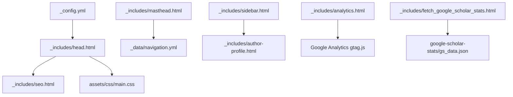
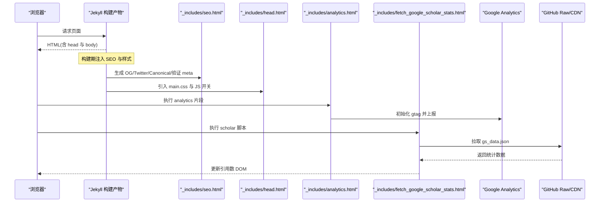
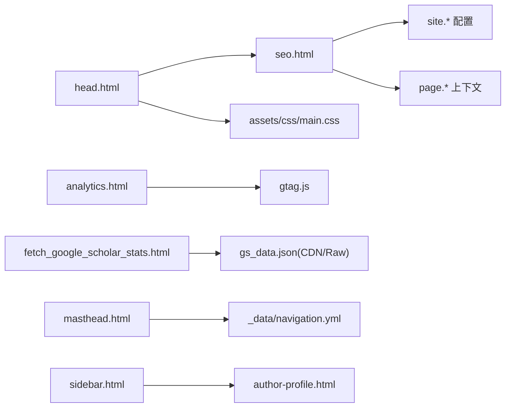

# API 参考

<cite>
**本文引用的文件**
- [_config.yml](file://_config.yml)
- [README.md](file://README.md)
- [docs/README-zh.md](file://docs/README-zh.md)
- [_includes/head.html](file://_includes/head.html)
- [_includes/seo.html](file://_includes/seo.html)
- [_includes/analytics.html](file://_includes/analytics.html)
- [_includes/fetch_google_scholar_stats.html](file://_includes/fetch_google_scholar_stats.html)
- [_includes/masthead.html](file://_includes/masthead.html)
- [_includes/sidebar.html](file://_includes/sidebar.html)
- [_includes/author-profile.html](file://_includes/author-profile.html)
- [_data/navigation.yml](file://_data/navigation.yml)
</cite>

## 目录
1. [简介](#简介)
2. [项目结构](#项目结构)
3. [核心组件](#核心组件)
4. [架构总览](#架构总览)
5. [详细组件分析](#详细组件分析)
6. [依赖关系分析](#依赖关系分析)
7. [性能与可用性建议](#性能与可用性建议)
8. [故障排查指南](#故障排查指南)
9. [结论](#结论)
10. [附录：配置项速查表](#附录配置项速查表)

## 简介
本 API 参考文档面向二次开发者，系统化说明 Jekyll 站点中 _config.yml 的所有配置选项、模板引擎语法与全局变量、以及 include 组件的接口与用法。重点覆盖作者信息、SEO 设置、插件配置、Google Analytics、Google Scholar 引用统计等能力，并提供最佳实践与常见问题排查方法，帮助快速集成与扩展。

## 项目结构
本项目采用 Jekyll 标准目录组织方式，关键目录与职责如下：
- _config.yml：站点全局配置（站点信息、作者、SEO、Markdown/Sass、输出、插件等）
- _includes：可复用的页面片段（SEO、Analytics、头部、侧边栏、作者资料等）
- _layouts：布局模板（默认布局）
- _pages：页面内容（如 about、internships、projects）
- _data：数据文件（导航、书籍等）
- assets：静态资源（CSS、JS、字体、图片）
- blog：博客文章集合
- docs：文档与示例

图表来源
- [_config.yml:1-169](file://_config.yml#L1-L169)
- [_includes/head.html:1-16](file://_includes/head.html#L1-L16)
- [_includes/seo.html:1-76](file://_includes/seo.html#L1-L76)
- [_includes/masthead.html:1-16](file://_includes/masthead.html#L1-L16)
- [_includes/sidebar.html:1-14](file://_includes/sidebar.html#L1-L14)
- [_includes/author-profile.html:1-91](file://_includes/author-profile.html#L1-L91)
- [_includes/analytics.html:1-13](file://_includes/analytics.html#L1-L13)
- [_includes/fetch_google_scholar_stats.html:1-19](file://_includes/fetch_google_scholar_stats.html#L1-L19)
- [_data/navigation.yml:1-26](file://_data/navigation.yml#L1-L26)

章节来源
- [README.md:1-73](file://README.md#L1-L73)
- [docs/README-zh.md:1-67](file://docs/README-zh.md#L1-L67)

## 核心组件
- 站点配置中心：_config.yml 提供站点元信息、作者信息、SEO 验证、Markdown/Sass 处理、输出规则、插件白名单等。
- SEO 注入：_includes/seo.html 根据配置生成 Open Graph、Twitter Card、Canonical、站点验证等 meta 标签。
- 流量统计：_includes/analytics.html 在满足条件时注入 Google Analytics gtag.js。
- 学术引用展示：_includes/fetch_google_scholar_stats.html 动态加载 google-scholar-stats/gs_data.json 并渲染引用数。
- 导航与侧边栏：_includes/masthead.html 读取 _data/navigation.yml 渲染主导航；_includes/sidebar.html 组合 author-profile 与自定义侧边栏内容。
- 作者资料卡片：_includes/author-profile.html 支持从 page.author 或 site.author 解析作者信息并渲染社交链接。

章节来源
- [_config.yml:1-169](file://_config.yml#L1-L169)
- [_includes/seo.html:1-76](file://_includes/seo.html#L1-L76)
- [_includes/analytics.html:1-13](file://_includes/analytics.html#L1-L13)
- [_includes/fetch_google_scholar_stats.html:1-19](file://_includes/fetch_google_scholar_stats.html#L1-L19)
- [_includes/masthead.html:1-16](file://_includes/masthead.html#L1-L16)
- [_includes/sidebar.html:1-14](file://_includes/sidebar.html#L1-L14)
- [_includes/author-profile.html:1-91](file://_includes/author-profile.html#L1-L91)
- [_data/navigation.yml:1-26](file://_data/navigation.yml#L1-L26)

## 架构总览
下图展示了页面构建时的关键流程：Jekyll 编译阶段注入 SEO 与样式，运行期通过脚本加载 Analytics 与 Google Scholar 引用数据。

图表来源
- [_includes/head.html:1-16](file://_includes/head.html#L1-L16)
- [_includes/seo.html:1-76](file://_includes/seo.html#L1-L76)
- [_includes/analytics.html:1-13](file://_includes/analytics.html#L1-L13)
- [_includes/fetch_google_scholar_stats.html:1-19](file://_includes/fetch_google_scholar_stats.html#L1-L19)

## 详细组件分析

### 配置项详解（_config.yml）
- 站点基本信息
  - title：站点标题，用于 SEO 标题与 OG 标题。
  - description：站点描述，用于 SEO 描述与作者卡片中的站点介绍。
  - repository：仓库标识，用于 Google Scholar 数据源地址拼接。
  - google_scholar_stats_use_cdn：是否使用 CDN 获取引用数据，避免部分地区访问受限，但存在缓存延迟。
- 分析与 SEO
  - google_analytics_id：Google Analytics 追踪 ID。
  - google_site_verification、bing_site_verification、baidu_site_verification：搜索引擎站点验证。
- 作者信息（author）
  - 基础字段：name、avatar、bio、location、employer、email、uri。
  - 学术与平台：googlescholar、pubmed、orcid、researchgate、dblp、impactstory、wikipedia。
  - 社交账号：github、twitter、facebook、linkedin、instagram、tumblr、bitbucket、stackoverflow、lastfm、dribbble、pinterest、foursquare、steam、youtube、soundcloud、weibo、flickr、codepen、vine、xing、keybase、google_plus。
- 文件读取与排除
  - include/exclude/keep_files：控制参与构建的文件集。
  - encoding/markdown_ext：编码与 Markdown 扩展名。
- 转换与 Markdown 处理
  - markdown/highlighter/excerpt_separator/incremental：选择 kramdown、rouge 高亮、摘要分隔符与增量构建开关。
  - kramdown.*：GFM 输入、自动锚点、脚注编号、TOC 层级、智能引号等。
- 默认值（defaults）
  - pages 类型默认 layout=default，author_profile=true。
- Sass/SCSS
  - sass_dir/style/syntax_highlight/load_paths：指定 SCSS 目录、压缩输出、高亮主题与加载路径。
- 输出与时间
  - permalink/timezone：URL 结构与时区。
- 插件与白名单
  - plugins/whitelist：启用分页、sitemap、gist、feed、重定向、emoji 等插件。
- HTML 压缩
  - compress_html：忽略开发环境，生产压缩。

章节来源
- [_config.yml:1-169](file://_config.yml#L1-L169)

### 模板引擎与全局变量
- Liquid 语法
  - 变量赋值与比较：、、、。
  - 过滤器：| default、| markdownify、| strip_html、| strip_newlines、| escape_once、| replace、| prepend、| relative_url。
  - 循环与遍历：。
- 常用全局对象
  - site：站点配置（title、description、url、repository、google_analytics_id、google_site_verification 等）。
  - page：当前页面上下文（title、description、excerpt、author、analytics、sidebar 等）。
  - site.data：_data 下的数据（navigation、authors 等）。
  - 其他：layout、paginator（分页）、jekyll 版本信息等。

章节来源
- [_includes/seo.html:1-76](file://_includes/seo.html#L1-L76)
- [_includes/masthead.html:1-16](file://_includes/masthead.html#L1-L16)
- [_includes/sidebar.html:1-14](file://_includes/sidebar.html#L1-L14)
- [_includes/author-profile.html:1-91](file://_includes/author-profile.html#L1-L91)

### Include 组件接口与用法

#### seo.html
- 作用：生成 SEO 相关 meta 标签（OG、Twitter Card、Canonical、站点验证）。
- 依赖配置
  - site.title、site.description、site.url、site.github.url、site.twitter.username、site.facebook.publisher、site.facebook.app_id、site.google_site_verification、site.bing_site_verification、site.baidu_site_verification。
- 行为要点
  - 优先使用 page.description，其次 page.excerpt，最后 site.description。
  - 作者 Twitter 用户名可从 page.author、site.data.authors[page.author]、site.author 推导。
  - 当未显式设置 site.url 时，回退到 site.github.url。
- 返回值：无（直接输出 HTML meta/link 标签）。

章节来源
- [_includes/seo.html:1-76](file://_includes/seo.html#L1-L76)

#### analytics.html
- 作用：按需注入 Google Analytics gtag.js。
- 触发条件
  - 当 page.analytics != false 且 site.google_analytics_id 已配置时生效。
- 返回值：无（输出 gtag 初始化脚本）。

章节来源
- [_includes/analytics.html:1-13](file://_includes/analytics.html#L1-L13)

#### fetch_google_scholar_stats.html
- 作用：运行时加载 google-scholar-stats/gs_data.json，将总引用与论文引用写入 DOM。
- 数据来源
  - 若 site.google_scholar_stats_use_cdn 为真，则使用 jsdelivr CDN；否则使用 raw.githubusercontent.com。
  - 目标路径：google-scholar-stats/gs_data.json。
- 渲染目标
  - id="total_cit" 的元素显示总引用数。
  - class="show_paper_citations" 的元素根据 data 属性匹配论文 ID，追加引用数文本。
- 返回值：无（修改 DOM）。

章节来源
- [_includes/fetch_google_scholar_stats.html:1-19](file://_includes/fetch_google_scholar_stats.html#L1-L19)

#### masthead.html
- 作用：渲染顶部导航菜单。
- 数据来源
  - 读取 site.data.navigation.main 列表，按顺序渲染链接。
- 返回值：无（输出导航 HTML）。

章节来源
- [_includes/masthead.html:1-16](file://_includes/masthead.html#L1-L16)
- [_data/navigation.yml:1-26](file://_data/navigation.yml#L1-L26)

#### sidebar.html
- 作用：渲染侧边栏，包含作者资料与可选的自定义侧边栏内容。
- 触发条件
  - 当 page.author_profile 或 layout.author_profile 或 page.sidebar 任一为真时渲染。
- 子组件
  - 作者资料：include author-profile.html。
  - 自定义侧边栏：遍历 page.sidebar 数组，支持 image、image_alt、title、text（markdownify）。
- 返回值：无（输出侧边栏 HTML）。

章节来源
- [_includes/sidebar.html:1-14](file://_includes/sidebar.html#L1-L14)

#### author-profile.html
- 作用：渲染作者头像、姓名、简介、机构/地点、邮箱与多平台社交链接。
- 数据优先级
  - 优先使用 page.author 对应的 site.data.authors[page.author]；否则回退到 site.author。
- 支持的字段
  - 基础：name、avatar、bio、location、employer、email、uri。
  - 学术：googlescholar、pubmed、orcid、researchgate、dblp、impactstory、wikipedia。
  - 社交：github、twitter、facebook、linkedin、instagram、tumblr、bitbucket、stackoverflow、lastfm、dribbble、pinterest、foursquare、steam、youtube、soundcloud、weibo、flickr、codepen、vine、xing、keybase、google_plus。
- 返回值：无（输出作者卡片 HTML）。

章节来源
- [_includes/author-profile.html:1-91](file://_includes/author-profile.html#L1-L91)

#### head.html
- 作用：定义字符集、引入 SEO 片段、移动端适配、JS 能力检测、主样式与 Cleartype 优化。
- 依赖
  - include seo.html；引入 assets/css/main.css。
- 返回值：无（输出 head 内必要标签）。

章节来源
- [_includes/head.html:1-16](file://_includes/head.html#L1-L16)

### 配置示例与最佳实践
- 基本站点与作者信息
  - 设置 title、description、repository、author.name/avatar/bio/location/email/googlescholar 等。
- SEO 与站点验证
  - 填写 google_site_verification、bing_site_verification、baidu_site_verification，确保搜索引擎收录。
- 流量统计
  - 配置 google_analytics_id，并在需要关闭统计的页面设置 page.analytics=false。
- Google Scholar 引用
  - 开启 google_scholar_stats_use_cdn 以改善国内访问体验；注意引用数据更新有缓存延迟。
  - 在页面中使用  显示单篇论文引用。
- 导航与侧边栏
  - 在 _data/navigation.yml 中维护主导航条目；在页面 front matter 中配置 sidebar 数组以添加图片、标题与文本。
- 插件与输出
  - 启用 jekyll-paginate、jekyll-sitemap、jekyll-feed、jekyll-gist、jekyll-redirect-from、jemoji 等插件；按需调整 permalink 与时区。
- 开发与调试
  - 本地启动后修改 _config.yml 需重启服务；HTML 压缩在生产环境生效，开发环境忽略。

章节来源
- [README.md:1-73](file://README.md#L1-L73)
- [docs/README-zh.md:1-67](file://docs/README-zh.md#L1-L67)
- [_config.yml:1-169](file://_config.yml#L1-L169)

## 依赖关系分析
- 组件耦合
  - head.html 依赖 seo.html 与 main.css。
  - seo.html 依赖 site.* 与 page.* 的多级回退逻辑。
  - analytics.html 依赖 site.google_analytics_id 与 page.analytics。
  - fetch_google_scholar_stats.html 依赖 site.repository 与 site.google_scholar_stats_use_cdn，并拉取外部 JSON。
  - masthead.html 依赖 _data/navigation.yml。
  - sidebar.html 组合 author-profile.html 与 page.sidebar。
- 外部依赖
  - Google Analytics gtag.js。
  - GitHub Raw 或 jsdelivr CDN 上的 gs_data.json。

图表来源
- [_includes/head.html:1-16](file://_includes/head.html#L1-L16)
- [_includes/seo.html:1-76](file://_includes/seo.html#L1-L76)
- [_includes/analytics.html:1-13](file://_includes/analytics.html#L1-L13)
- [_includes/fetch_google_scholar_stats.html:1-19](file://_includes/fetch_google_scholar_stats.html#L1-L19)
- [_includes/masthead.html:1-16](file://_includes/masthead.html#L1-L16)
- [_includes/sidebar.html:1-14](file://_includes/sidebar.html#L1-L14)
- [_includes/author-profile.html:1-91](file://_includes/author-profile.html#L1-L91)
- [_data/navigation.yml:1-26](file://_data/navigation.yml#L1-L26)

## 性能与可用性建议
- 首屏性能
  - 保持 main.css 最小化；按需延迟加载非关键脚本。
  - 合理使用相对路径与 relative_url 减少跨域与路径问题。
- 网络与缓存
  - 使用 CDN 获取 gs_data.json 可减少跨域与地区限制，但需注意缓存延迟。
  - 对第三方脚本（Analytics、jQuery）进行异步加载与错误降级。
- 构建优化
  - 启用 incremental 与合适的 excerpt_separator 提升构建速度。
  - 生产环境启用 compress_html，开发环境忽略以提升调试效率。

## 故障排查指南
- Google Analytics 未上报
  - 检查 site.google_analytics_id 是否正确配置。
  - 确认页面未设置 page.analytics=false。
  - 查看控制台是否有 gtag.js 加载失败。
- Google Scholar 引用不显示
  - 确认 gs_data.json 存在于 google-scholar-stats 分支并可被访问。
  - 校验 site.repository 与 google_scholar_stats_use_cdn 的设置。
  - 检查页面是否存在 id="total_cit" 与 class="show_paper_citations" 的目标元素。
- SEO 信息缺失
  - 检查 site.title、site.description、site.url 是否配置。
  - 确认各搜索引擎站点验证 key 已正确粘贴。
- 导航与侧边栏异常
  - 核对 _data/navigation.yml 的格式与 URL 路径。
  - 检查页面 front matter 中 sidebar 数组的结构（image/image_alt/title/text）。

章节来源
- [_includes/analytics.html:1-13](file://_includes/analytics.html#L1-L13)
- [_includes/fetch_google_scholar_stats.html:1-19](file://_includes/fetch_google_scholar_stats.html#L1-L19)
- [_includes/seo.html:1-76](file://_includes/seo.html#L1-L76)
- [_includes/masthead.html:1-16](file://_includes/masthead.html#L1-L16)
- [_includes/sidebar.html:1-14](file://_includes/sidebar.html#L1-L14)

## 结论
通过 _config.yml 集中管理站点与作者信息、SEO 与插件，配合 _includes 模块化组件实现 SEO 注入、流量统计与学术引用展示，形成清晰、可扩展的站点架构。遵循本文的配置规范与最佳实践，可高效完成二次开发与个性化定制。

## 附录：配置项速查表
- 站点信息
  - title、description、repository、google_scholar_stats_use_cdn
- 分析与 SEO
  - google_analytics_id、google_site_verification、bing_site_verification、baidu_site_verification
- 作者信息（author）
  - name、avatar、bio、location、employer、email、uri
  - googlescholar、pubmed、orcid、researchgate、dblp、impactstory、wikipedia
  - github、twitter、facebook、linkedin、instagram、tumblr、bitbucket、stackoverflow、lastfm、dribbble、pinterest、foursquare、steam、youtube、soundcloud、weibo、flickr、codepen、vine、xing、keybase、google_plus
- 文件与转换
  - include、exclude、keep_files、encoding、markdown_ext
  - markdown、highlighter、excerpt_separator、incremental
  - kramdown.*（input、hard_wrap、auto_ids、footnote_nr、entity_output、toc_levels、smart_quotes、enable_coderay）
- 默认值
  - defaults.pages.layout、defaults.pages.author_profile
- Sass/SCSS
  - sass_dir、style、syntax_highlight、line_numbers、load_paths
- 输出与时间
  - permalink、timezone
- 插件与白名单
  - plugins、whitelist
- HTML 压缩
  - compress_html.clippings、compress_html.ignore.envs

章节来源
- [_config.yml:1-169](file://_config.yml#L1-L169)