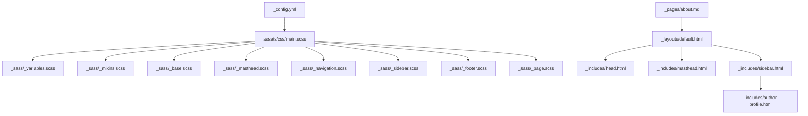
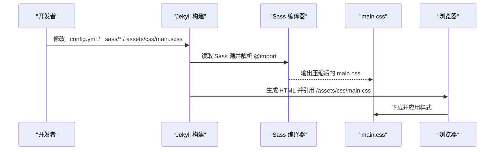
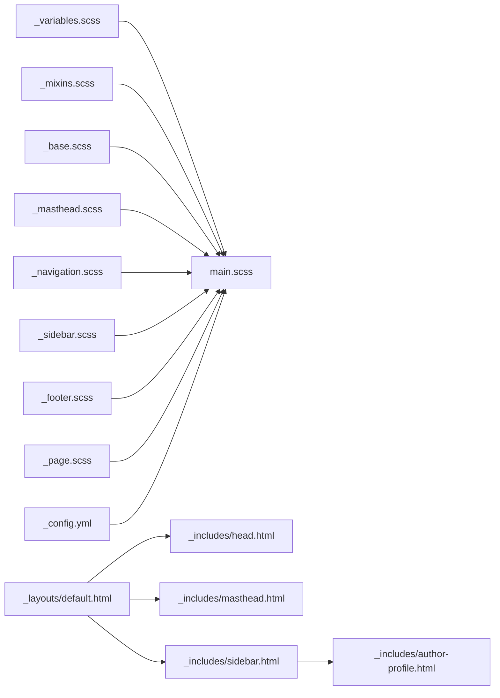

# 主题定制

<cite>
**本文引用的文件**   
- [_variables.scss](file://_sass/_variables.scss)
- [main.scss](file://assets/css/main.scss)
- [_config.yml](file://_config.yml)
- [README.md](file://README.md)
- [_mixins.scss](file://_sass/_mixins.scss)
- [_base.scss](file://_sass/_base.scss)
- [_masthead.scss](file://_sass/_masthead.scss)
- [_sidebar.scss](file://_sass/_sidebar.scss)
- [_footer.scss](file://_sass/_footer.scss)
- [_navigation.scss](file://_sass/_navigation.scss)
- [_page.scss](file://_sass/_page.scss)
- [default.html](file://_layouts/default.html)
- [masthead.html](file://_includes/masthead.html)
- [sidebar.html](file://_includes/sidebar.html)
- [author-profile.html](file://_includes/author-profile.html)
- [head.html](file://_includes/head.html)
- [about.md](file://_pages/about.md)
- [STYLE_EXAMPLES.md](file://docs/STYLE_EXAMPLES.md)
</cite>

## 目录
1. [简介](#简介)
2. [项目结构](#项目结构)
3. [核心组件](#核心组件)
4. [架构总览](#架构总览)
5. [详细组件分析](#详细组件分析)
6. [依赖关系分析](#依赖关系分析)
7. [性能与可访问性优化](#性能与可访问性优化)
8. [故障排查指南](#故障排查指南)
9. [结论](#结论)
10. [附录：常用定制清单](#附录常用定制清单)

## 简介
本指南面向希望个性化学术主页的开发者，系统讲解如何基于现有 Jekyll 主题进行视觉样式定制。内容覆盖颜色主题、字体设置、布局调整、响应式断点、Sass 变量体系、头部/侧边栏/页脚等模板组件的修改方法，并提供实践建议与常见问题排查路径。

## 项目结构
本项目采用典型的 Jekyll + Sass 组织方式：
- 配置入口：站点全局配置位于 _config.yml；Sass 编译输出由 assets/css/main.scss 聚合。
- 样式分层：_sass 下按模块拆分（变量、基础、导航、侧边栏、页脚、页面等），通过 main.scss 统一引入。
- 布局与包含：_layouts/default.html 为默认布局，组合 _includes 中的 head、masthead、sidebar、scripts 等片段。
- 页面内容：_pages 下的 Markdown 页面使用默认布局渲染。

图表来源
- [_config.yml:131-141](file://_config.yml#L131-L141)
- [main.scss:10-38](file://assets/css/main.scss#L10-L38)
- [_variables.scss:1-158](file://_sass/_variables.scss#L1-L158)
- [_mixins.scss:1-53](file://_sass/_mixins.scss#L1-L53)
- [_base.scss:1-323](file://_sass/_base.scss#L1-L323)
- [_masthead.scss:1-65](file://_sass/_masthead.scss#L1-L65)
- [_navigation.scss:1-432](file://_sass/_navigation.scss#L1-L432)
- [_sidebar.scss:1-277](file://_sass/_sidebar.scss#L1-L277)
- [_footer.scss:1-93](file://_sass/_footer.scss#L1-L93)
- [_page.scss:1-413](file://_sass/_page.scss#L1-L413)
- [default.html:1-34](file://_layouts/default.html#L1-L34)
- [head.html:1-16](file://_includes/head.html#L1-L16)
- [masthead.html:1-16](file://_includes/masthead.html#L1-L16)
- [sidebar.html:1-14](file://_includes/sidebar.html#L1-L14)
- [author-profile.html:1-91](file://_includes/author-profile.html#L1-L91)
- [about.md:1-250](file://_pages/about.md#L1-L250)

章节来源
- [_config.yml:131-141](file://_config.yml#L131-L141)
- [main.scss:10-38](file://assets/css/main.scss#L10-L38)
- [default.html:1-34](file://_layouts/default.html#L1-L34)

## 核心组件
- 样式入口与加载顺序：assets/css/main.scss 负责引入 vendor、变量、混入、基础样式与各模块样式，最终生成 main.css。
- 站点配置：_config.yml 中 sass 段指定 Sass 目录、压缩输出与 load_paths，影响构建产物与性能。
- 默认布局：_layouts/default.html 组合 head、masthead、sidebar、content、scripts，是页面骨架。
- 头部与导航：_includes/masthead.html 渲染主导航菜单，样式在 _sass/_masthead.scss 与 _sass/_navigation.scss。
- 侧边栏与作者信息：_includes/sidebar.html 与 author-profile.html 组合展示头像、简介与社交链接，样式在 _sass/_sidebar.scss。
- 页脚：_sass/_footer.scss 控制底部区域样式。
- 页面内容与排版：_sass/_base.scss 定义基础元素与通用交互，_sass/_page.scss 定义单页布局与细节。

章节来源
- [main.scss:10-38](file://assets/css/main.scss#L10-L38)
- [_config.yml:131-141](file://_config.yml#L131-L141)
- [default.html:1-34](file://_layouts/default.html#L1-L34)
- [masthead.html:1-16](file://_includes/masthead.html#L1-L16)
- [_masthead.scss:1-65](file://_sass/_masthead.scss#L1-L65)
- [_navigation.scss:1-432](file://_sass/_navigation.scss#L1-L432)
- [sidebar.html:1-14](file://_includes/sidebar.html#L1-L14)
- [author-profile.html:1-91](file://_includes/author-profile.html#L1-L91)
- [_sidebar.scss:1-277](file://_sass/_sidebar.scss#L1-L277)
- [_footer.scss:1-93](file://_sass/_footer.scss#L1-L93)
- [_base.scss:1-323](file://_sass/_base.scss#L1-L323)
- [_page.scss:1-413](file://_sass/_page.scss#L1-L413)

## 架构总览
下图展示了从配置到样式编译再到页面渲染的关键路径。

图表来源
- [_config.yml:131-141](file://_config.yml#L131-L141)
- [main.scss:10-38](file://assets/css/main.scss#L10-L38)
- [head.html:13-16](file://_includes/head.html#L13-L16)

## 详细组件分析

### 颜色与字体主题（Sass 变量）
- 颜色体系：在 _sass/_variables.scss 中集中管理文本色、背景色、边框色、品牌色、链接色等，便于全局替换。
- 字体与字号：全局字体族、标题字体、说明字体以及类型阶梯（type-size-*）均在此处定义。
- 断点与网格：断点变量与 Susy 网格参数也在此定义，影响响应式行为与栅格宽度。
- 其他：圆角、阴影、过渡动画时长等全局 UI 常量。

建议做法
- 新增或覆盖变量时，优先在 _variables.scss 中定义，避免直接写死值。
- 如需局部覆盖，可在 main.scss 末尾追加自定义块，或使用 :root CSS 变量配合 JS 动态切换主题。

章节来源
- [_variables.scss:49-102](file://_sass/_variables.scss#L49-L102)
- [_variables.scss:8-46](file://_sass/_variables.scss#L8-L46)
- [_variables.scss:104-146](file://_sass/_variables.scss#L104-L146)
- [_variables.scss:148-158](file://_sass/_variables.scss#L148-L158)

### 基础排版与通用样式
- 基础元素：在 _sass/_base.scss 中定义 body、标题、段落、列表、代码、图片、引用等基础样式。
- 全局过渡：对常见元素添加统一的 transition 属性，提升交互一致性。
- 段落缩进：通过 $paragraph-indent 与 $indent-var 控制是否启用首行缩进及缩进量。

建议做法
- 需要调整正文行高、字号、字重或代码块风格时，优先修改 _base.scss 对应规则。
- 若需针对某类页面微调，建议在 main.scss 中追加更具体的选择器覆盖。

章节来源
- [_base.scss:10-22](file://_sass/_base.scss#L10-L22)
- [_base.scss:24-55](file://_sass/_base.scss#L24-L55)
- [_base.scss:132-159](file://_sass/_base.scss#L132-L159)
- [_base.scss:319-323](file://_sass/_base.scss#L319-L323)

### 头部与导航
- 头部容器：_includes/masthead.html 提供导航 DOM，样式在 _sass/_masthead.scss。
- 导航交互：优先级折叠菜单与下拉隐藏项样式在 _sass/_navigation.scss。
- 数据驱动菜单：导航项来自 site.data.navigation.main，可通过 _data/navigation.yml 维护。

建议做法
- 修改顶部背景、边框、内边距、字体与链接颜色，优先在 _masthead.scss 与 _navigation.scss 中调整。
- 如需增加新菜单项，编辑 _data/navigation.yml 并在 masthead.html 中确认遍历逻辑。

章节来源
- [masthead.html:1-16](file://_includes/masthead.html#L1-L16)
- [_masthead.scss:5-34](file://_sass/_masthead.scss#L5-L34)
- [_navigation.scss:175-309](file://_sass/_navigation.scss#L175-L309)

### 侧边栏与作者资料
- 侧边栏容器：_includes/sidebar.html 根据页面 front matter 决定是否显示，并支持自定义区块。
- 作者资料：_includes/author-profile.html 渲染头像、姓名、简介与社交链接，数据来源为 site.author 或 page.author。
- 样式：头像尺寸、间距、链接列表、移动端适配等在 _sass/_sidebar.scss。

建议做法
- 调整头像大小、边框、阴影、间距与链接图标样式，优先在 _sidebar.scss 中修改。
- 扩展社交链接或调整布局，可在 author-profile.html 中增删列表项。

章节来源
- [sidebar.html:1-14](file://_includes/sidebar.html#L1-L14)
- [author-profile.html:1-91](file://_includes/author-profile.html#L1-L91)
- [_sidebar.scss:9-50](file://_sass/_sidebar.scss#L9-L50)
- [_sidebar.scss:83-106](file://_sass/_sidebar.scss#L83-L106)
- [_sidebar.scss:152-261](file://_sass/_sidebar.scss#L152-L261)

### 页脚
- 结构与样式：_sass/_footer.scss 控制底部背景、文字色、版权信息与社交图标样式。
- 固定底部：通过绝对定位实现“粘性页脚”效果，确保内容不足一屏时页脚仍贴底。

建议做法
- 修改页脚背景、分割线、字体大小与图标颜色，直接在 _footer.scss 中调整。

章节来源
- [_footer.scss:5-25](file://_sass/_footer.scss#L5-L25)
- [_footer.scss:56-93](file://_sass/_footer.scss#L56-L93)

### 页面内容与锚点
- 页面容器与栅格：_sass/_page.scss 定义 #main 与 .page 的栅格占位与最大宽度。
- 锚点偏移：为页面内锚点跳转预留滚动偏移，避免被固定头部遮挡。
- 内容排版：标题、段落、链接、引用等细节在 _page.scss 与 _base.scss 共同作用。

建议做法
- 调整页面最大宽度、内外边距、标题下划线与段落缩进，优先在 _page.scss 与 _base.scss 中修改。
- 若需自定义锚点偏移量，参考 main.scss 中的 scroll_offset 变量用法。

章节来源
- [_page.scss:5-17](file://_sass/_page.scss#L5-L17)
- [_page.scss:51-84](file://_sass/_page.scss#L51-L84)
- [main.scss:88-96](file://assets/css/main.scss#L88-L96)

### 博客与论文卡片样式
- 卡片布局：.paper-box 使用 Flexbox 将图片与文字左右排列，适用于论文与文章展示。
- 徽章与标签：.badge 及其变体用于技术栈或分类标记。
- 功能网格与教程步骤：.feature-grid、.tutorial-steps 等增强内容可读性与结构化呈现。
- 示例文档：docs/STYLE_EXAMPLES.md 提供了多种样式的 Markdown 用法与效果预览。

建议做法
- 在页面中使用这些类名即可快速获得一致风格；如需调整配色与间距，可在 main.scss 中覆盖对应样式。

章节来源
- [main.scss:45-86](file://assets/css/main.scss#L45-L86)
- [main.scss:98-141](file://assets/css/main.scss#L98-L141)
- [main.scss:203-248](file://assets/css/main.scss#L203-L248)
- [main.scss:272-302](file://assets/css/main.scss#L272-L302)
- [STYLE_EXAMPLES.md:1-401](file://docs/STYLE_EXAMPLES.md#L1-L401)

## 依赖关系分析
- 样式加载链：main.scss 作为唯一入口，按顺序引入 vendor、变量、混入、基础与各模块样式，保证变量先于使用方生效。
- 布局与包含：default.html 组合 head、masthead、sidebar、scripts，形成完整页面骨架。
- 数据驱动：导航菜单来源于 _data/navigation.yml，作者信息来源于 _config.yml 的 author 字段。

图表来源
- [main.scss:10-38](file://assets/css/main.scss#L10-L38)
- [_config.yml:131-141](file://_config.yml#L131-L141)
- [default.html:1-34](file://_layouts/default.html#L1-L34)
- [head.html:1-16](file://_includes/head.html#L1-L16)
- [masthead.html:1-16](file://_includes/masthead.html#L1-L16)
- [sidebar.html:1-14](file://_includes/sidebar.html#L1-L14)
- [author-profile.html:1-91](file://_includes/author-profile.html#L1-L91)

章节来源
- [main.scss:10-38](file://assets/css/main.scss#L10-L38)
- [_config.yml:131-141](file://_config.yml#L131-L141)
- [default.html:1-34](file://_layouts/default.html#L1-L34)

## 性能与可访问性优化
- 构建与压缩
  - 在 _config.yml 的 sass 段设置 style: compressed，减少 CSS 体积。
  - 合理拆分 Sass 模块，避免重复导入，降低编译时间。
- 资源加载
  - 仅引入必要的 vendor 库，按需裁剪 Font Awesome 与 Magnific Popup。
  - 使用相对路径与 CDN 策略平衡缓存与更新频率。
- 响应式与断点
  - 通过 _variables.scss 中的断点变量统一管理，避免硬编码媒体查询。
  - 在小屏设备上隐藏次要导航项，提升首屏渲染效率。
- 可访问性
  - 保持足够的对比度，遵循 WCAG 建议。
  - 为图标与图片提供 alt 与 aria-hidden 标注，提升屏幕阅读器体验。

章节来源
- [_config.yml:131-141](file://_config.yml#L131-L141)
- [_variables.scss:104-122](file://_sass/_variables.scss#L104-L122)
- [_navigation.scss:175-309](file://_sass/_navigation.scss#L175-L309)

## 故障排查指南
- 样式未生效
  - 检查 main.scss 是否正确引入目标模块。
  - 确认 _config.yml 的 sass.load_paths 包含 _sass 与 assets/css。
- 导航不显示
  - 核对 _data/navigation.yml 的 main 数组格式与键名。
  - 确认 masthead.html 的遍历逻辑未被改动。
- 侧边栏不出现
  - 检查页面 front matter 是否开启 author_profile 或 sidebar。
  - 确认 author-profile.html 的数据源 site.author 已正确配置。
- 锚点跳转被遮挡
  - 检查 main.scss 中的滚动偏移变量与 _page.scss 的锚点伪元素高度是否匹配。

章节来源
- [main.scss:10-38](file://assets/css/main.scss#L10-L38)
- [_config.yml:131-141](file://_config.yml#L131-L141)
- [masthead.html:1-16](file://_includes/masthead.html#L1-L16)
- [sidebar.html:1-14](file://_includes/sidebar.html#L1-L14)
- [author-profile.html:1-91](file://_includes/author-profile.html#L1-L91)
- [main.scss:88-96](file://assets/css/main.scss#L88-L96)
- [_page.scss:51-84](file://_sass/_page.scss#L51-L84)

## 结论
通过集中化的 Sass 变量与模块化样式组织，本项目提供了灵活的主题定制能力。建议以 _variables.scss 为核心进行主题化改造，结合 _masthead.scss、_sidebar.scss、_footer.scss 与 _page.scss 进行局部精调；同时利用 docs/STYLE_EXAMPLES.md 提供的样式组件快速搭建个性化内容。

## 附录：常用定制清单
- 颜色主题
  - 修改 _variables.scss 中的文本色、背景色、边框色、链接色与品牌色。
- 字体与字号
  - 调整 _variables.scss 的全局字体族、标题字体与 type-size-* 层级。
- 断点与网格
  - 在 _variables.scss 中调整 $small/$medium/$large/$x-large 与 Susy 网格参数。
- 头部与导航
  - 在 _masthead.scss 与 _navigation.scss 中调整背景、边框、内边距与链接样式。
- 侧边栏与作者资料
  - 在 _sidebar.scss 中调整头像、间距与链接样式；在 author-profile.html 中增删社交链接。
- 页脚
  - 在 _footer.scss 中调整背景、分割线与图标颜色。
- 页面内容与锚点
  - 在 _page.scss 与 _base.scss 中调整页面宽度、标题与段落样式；在 main.scss 中调整锚点偏移。
- 博客与论文卡片
  - 在 main.scss 中覆盖 .paper-box、.badge、.feature-grid 等样式；参考 STYLE_EXAMPLES.md 的使用示例。

章节来源
- [_variables.scss:49-102](file://_sass/_variables.scss#L49-L102)
- [_variables.scss:8-46](file://_sass/_variables.scss#L8-L46)
- [_variables.scss:104-146](file://_sass/_variables.scss#L104-L146)
- [_masthead.scss:5-34](file://_sass/_masthead.scss#L5-L34)
- [_navigation.scss:175-309](file://_sass/_navigation.scss#L175-L309)
- [_sidebar.scss:83-106](file://_sass/_sidebar.scss#L83-L106)
- [_footer.scss:5-25](file://_sass/_footer.scss#L5-L25)
- [_page.scss:5-17](file://_sass/_page.scss#L5-L17)
- [main.scss:45-86](file://assets/css/main.scss#L45-L86)
- [STYLE_EXAMPLES.md:1-401](file://docs/STYLE_EXAMPLES.md#L1-L401)