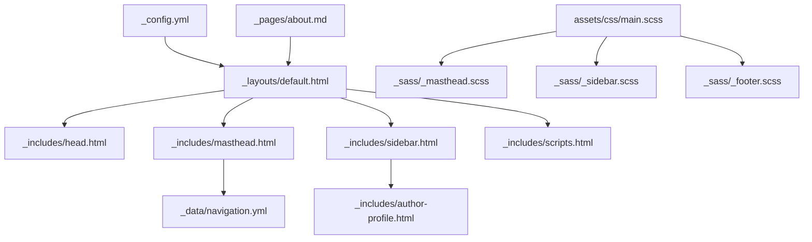
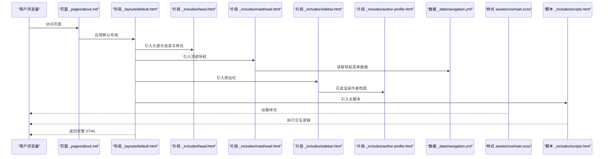
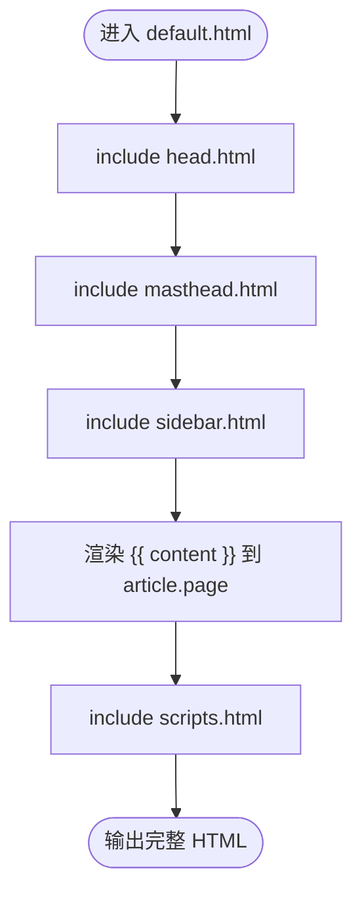
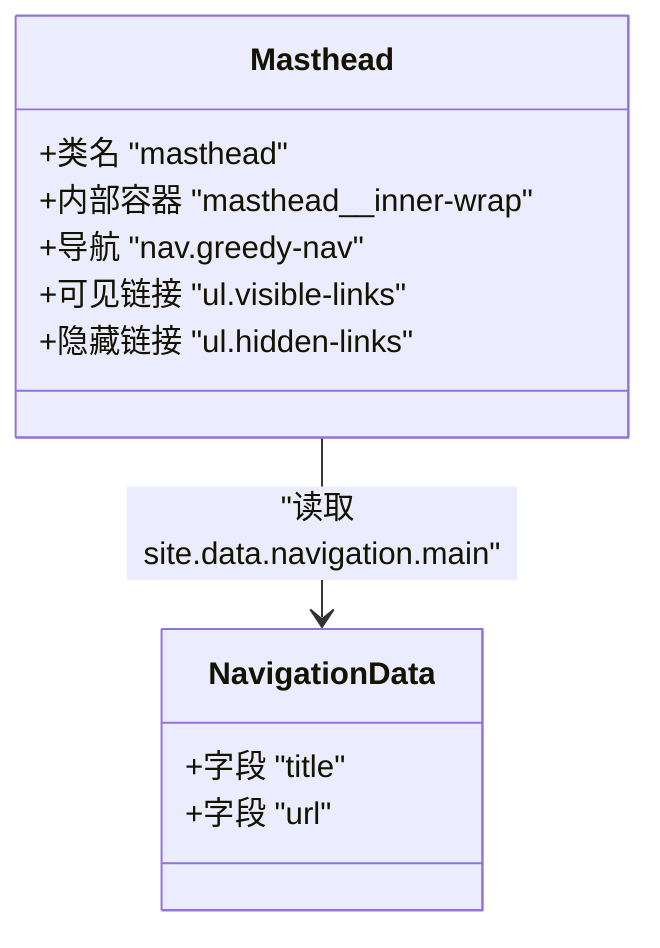
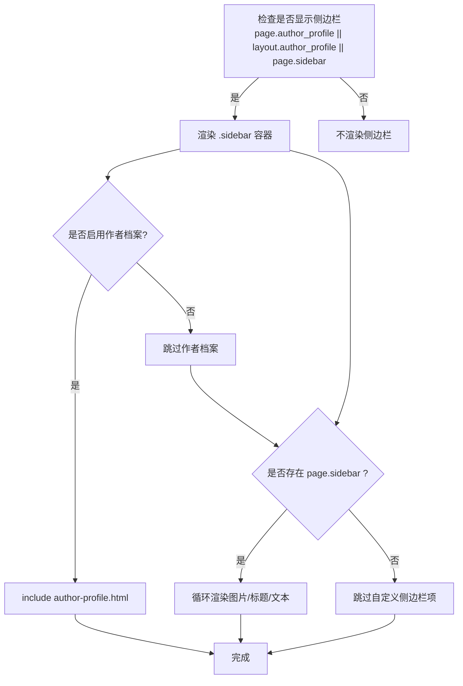
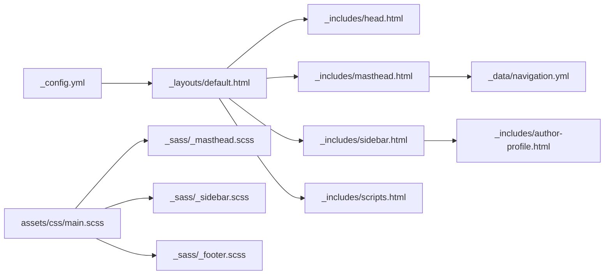

# 布局修改

<cite>
**本文引用的文件**   
- [_layouts/default.html](file://_layouts/default.html)
- [_includes/masthead.html](file://_includes/masthead.html)
- [_includes/sidebar.html](file://_includes/sidebar.html)
- [_includes/author-profile.html](file://_includes/author-profile.html)
- [_includes/head.html](file://_includes/head.html)
- [_includes/scripts.html](file://_includes/scripts.html)
- [_data/navigation.yml](file://_data/navigation.yml)
- [_sass/_masthead.scss](file://_sass/_masthead.scss)
- [_sass/_sidebar.scss](file://_sass/_sidebar.scss)
- [_sass/_footer.scss](file://_sass/_footer.scss)
- [assets/css/main.scss](file://assets/css/main.scss)
- [_config.yml](file://_config.yml)
- [_pages/about.md](file://_pages/about.md)
</cite>

## 目录
1. [简介](#简介)
2. [项目结构](#项目结构)
3. [核心组件](#核心组件)
4. [架构总览](#架构总览)
5. [详细组件分析](#详细组件分析)
6. [依赖关系分析](#依赖关系分析)
7. [性能与可维护性建议](#性能与可维护性建议)
8. [故障排查指南](#故障排查指南)
9. [结论](#结论)
10. [附录：常用定制清单](#附录常用定制清单)

## 简介
本指南面向希望深度定制 Jekyll 站点布局的读者，聚焦以下目标：
- 理解默认基础布局 default.html 的结构与渲染流程
- 掌握头部（masthead）、侧边栏（sidebar）等关键组件的定制方法
- 通过 HTML 与 Liquid 模板语法示例，展示如何新增页面元素、调整布局结构、实现自定义导航菜单
- 提供响应式适配技巧与最佳实践，确保在不同屏幕尺寸下获得一致体验

## 项目结构
本项目采用典型的 Jekyll 主题组织方式：
- _layouts：存放布局模板，入口为 default.html
- _includes：存放可复用片段，如 masthead、sidebar、head、scripts 等
- _sass：样式模块，按功能拆分（masthead、sidebar、footer 等）
- assets/css：主样式入口 main.scss，聚合各 SCSS 模块
- _data：数据文件，如导航菜单 navigation.yml
- _pages：页面内容，使用 front matter 指定布局与属性
- _config.yml：全局配置，包含作者信息、默认布局、Sass 设置等

图表来源
- [_layouts/default.html:1-34](file://_layouts/default.html#L1-L34)
- [_includes/head.html:1-16](file://_includes/head.html#L1-L16)
- [_includes/masthead.html:1-16](file://_includes/masthead.html#L1-L16)
- [_includes/sidebar.html:1-14](file://_includes/sidebar.html#L1-L14)
- [_includes/author-profile.html:1-91](file://_includes/author-profile.html#L1-L91)
- [_includes/scripts.html:1-1](file://_includes/scripts.html#L1-L1)
- [_data/navigation.yml:1-29](file://_data/navigation.yml#L1-L29)
- [assets/css/main.scss:1-38](file://assets/css/main.scss#L1-L38)
- [_sass/_masthead.scss:1-65](file://_sass/_masthead.scss#L1-L65)
- [_sass/_sidebar.scss:1-277](file://_sass/_sidebar.scss#L1-L277)
- [_sass/_footer.scss:1-93](file://_sass/_footer.scss#L1-L93)
- [_config.yml:120-128](file://_config.yml#L120-L128)
- [_pages/about.md:1-9](file://_pages/about.md#L1-L9)

章节来源
- [_layouts/default.html:1-34](file://_layouts/default.html#L1-L34)
- [_config.yml:120-128](file://_config.yml#L120-L128)

## 核心组件
- 基础布局 default.html
  - 负责整体 HTML 骨架、引入 head、masthead、sidebar、scripts 等片段
  - 将页面内容 content 注入到 article.page 的内容区域
- 头部 masthead
  - 包含站点导航菜单，支持移动端折叠隐藏
  - 菜单项来源于 _data/navigation.yml
- 侧边栏 sidebar
  - 根据页面或布局的 author_profile、sidebar 开关决定是否显示
  - 可嵌入作者档案 author-profile 与自定义侧边栏内容
- 页脚 footer
  - 由样式控制，当前未在主布局中显式 include；可通过在页面或布局中添加相应 HTML 并配合样式进行展示
- 头部元信息与资源 head
  - 引入 SEO、视口、主样式 main.css 等
- 脚本 scripts
  - 引入主 JS 文件，用于交互逻辑（如导航折叠、滚动等）

章节来源
- [_layouts/default.html:12-31](file://_layouts/default.html#L12-L31)
- [_includes/masthead.html:1-16](file://_includes/masthead.html#L1-L16)
- [_includes/sidebar.html:1-14](file://_includes/sidebar.html#L1-L14)
- [_includes/author-profile.html:1-91](file://_includes/author-profile.html#L1-L91)
- [_includes/head.html:1-16](file://_includes/head.html#L1-L16)
- [_includes/scripts.html:1-1](file://_includes/scripts.html#L1-L1)
- [_sass/_footer.scss:1-93](file://_sass/_footer.scss#L1-L93)

## 架构总览
下图展示了从页面请求到最终渲染的关键路径，包括布局、片段、数据与样式的协作关系。

图表来源
- [_layouts/default.html:1-34](file://_layouts/default.html#L1-L34)
- [_includes/head.html:1-16](file://_includes/head.html#L1-L16)
- [_includes/masthead.html:1-16](file://_includes/masthead.html#L1-L16)
- [_includes/sidebar.html:1-14](file://_includes/sidebar.html#L1-L14)
- [_includes/author-profile.html:1-91](file://_includes/author-profile.html#L1-L91)
- [_data/navigation.yml:1-29](file://_data/navigation.yml#L1-L29)
- [assets/css/main.scss:1-38](file://assets/css/main.scss#L1-L38)
- [_includes/scripts.html:1-1](file://_includes/scripts.html#L1-L1)

## 详细组件分析

### 基础布局 default.html
- 作用
  - 定义文档类型、语言、HTML 根节点
  - 引入 head、masthead、sidebar、scripts 等片段
  - 将页面内容 content 渲染到 article.page 的内容区
- 关键点
  - 使用 layout: compress 启用 HTML 压缩（由配置驱动）
  - 通过 include 机制组合多个片段，便于模块化定制
  - 页面标题 meta 基于 page.title 生成，利于 SEO

图表来源
- [_layouts/default.html:1-34](file://_layouts/default.html#L1-L34)

章节来源
- [_layouts/default.html:1-34](file://_layouts/default.html#L1-L34)

### 头部 masthead 与导航菜单
- 结构
  - 外层容器 masthead__inner-wrap 包裹导航
  - 使用 greedy-nav 实现移动端折叠菜单
  - visible-links 显示主要菜单，hidden-links 用于超出宽度时的隐藏项
- 数据来源
  - 通过 site.data.navigation.main 遍历渲染菜单项
- 定制要点
  - 修改 _data/navigation.yml 即可增删改菜单项
  - 可在 masthead.html 中增加新的菜单分组或图标
  - 通过 _sass/_masthead.scss 调整粘性定位、背景色、间距等

图表来源
- [_includes/masthead.html:1-16](file://_includes/masthead.html#L1-L16)
- [_data/navigation.yml:1-29](file://_data/navigation.yml#L1-L29)
- [_sass/_masthead.scss:1-65](file://_sass/_masthead.scss#L1-L65)

章节来源
- [_includes/masthead.html:1-16](file://_includes/masthead.html#L1-L16)
- [_data/navigation.yml:1-29](file://_data/navigation.yml#L1-L29)
- [_sass/_masthead.scss:1-65](file://_sass/_masthead.scss#L1-L65)

### 侧边栏 sidebar 与作者档案 author-profile
- 显示条件
  - 当 page.author_profile 或 layout.author_profile 或 page.sidebar 任一为真时显示
- 内容组成
  - 若开启作者档案，则 include author-profile.html
  - 若存在 page.sidebar，则循环渲染图片、标题、文本（支持 Markdown）
- 作者档案
  - 从 page.author 或 site.author 获取作者信息
  - 展示头像、姓名、简介、社交链接等
- 定制要点
  - 在页面 front matter 设置 author_profile: true 或 sidebar 数组
  - 在 _includes/author-profile.html 扩展更多字段或链接
  - 通过 _sass/_sidebar.scss 调整布局、间距、响应式行为

图表来源
- [_includes/sidebar.html:1-14](file://_includes/sidebar.html#L1-L14)
- [_includes/author-profile.html:1-91](file://_includes/author-profile.html#L1-L91)
- [_sass/_sidebar.scss:1-277](file://_sass/_sidebar.scss#L1-L277)

章节来源
- [_includes/sidebar.html:1-14](file://_includes/sidebar.html#L1-L14)
- [_includes/author-profile.html:1-91](file://_includes/author-profile.html#L1-L91)
- [_sass/_sidebar.scss:1-277](file://_sass/_sidebar.scss#L1-L277)

### 页脚 footer
- 现状
  - 样式已定义，但主布局未 include 对应片段
- 建议做法
  - 在 default.html 末尾添加 include footer.html（需新建 _includes/footer.html）
  - 或在具体页面直接插入页脚 HTML 并使用现有样式类
- 样式要点
  - 使用 .page__footer 及其子元素控制布局与配色
  - 通过 _sass/_footer.scss 调整字体、颜色、边框、动画等

章节来源
- [_sass/_footer.scss:1-93](file://_sass/_footer.scss#L1-L93)

### 头部元信息与资源 head
- 功能
  - 引入 SEO 片段、视口设置、主样式 main.css
  - 切换 no-js 为 js，便于 CSS 检测 JavaScript 支持
- 定制要点
  - 在 _includes/head/custom.html 追加额外 meta、favicon、第三方资源
  - 通过 _includes/head.html 调整资源路径或顺序

章节来源
- [_includes/head.html:1-16](file://_includes/head.html#L1-L16)

### 脚本 scripts
- 功能
  - 引入主 JS 文件，用于导航折叠、平滑滚动等交互
- 定制要点
  - 如需新增交互，可在 assets/js 下编写模块并在 scripts.html 引入
  - 注意避免重复引入与冲突

章节来源
- [_includes/scripts.html:1-1](file://_includes/scripts.html#L1-L1)

### 页面内容与示例 about.md
- 说明
  - 使用 front matter 指定 permalink、title、excerpt、author_profile 等
  - 正文可使用 Markdown 与 HTML 混排，结合主题提供的卡片、徽章等样式
- 定制要点
  - 通过 front matter 控制布局与侧边栏显示
  - 使用主题提供的 CSS 类构建结构化内容区块

章节来源
- [_pages/about.md:1-9](file://_pages/about.md#L1-L9)

## 依赖关系分析
- 布局与片段
  - default.html 依赖 head、masthead、sidebar、scripts 等片段
  - sidebar 依赖 author-profile（可选）
- 数据与模板
  - masthead 依赖 _data/navigation.yml 的 main 列表
- 样式与主题
  - main.scss 聚合 _sass 下的模块（masthead、sidebar、footer 等）
  - 变量与断点定义在 _variables.scss，影响整体响应式行为
- 配置
  - _config.yml 的 defaults 为 pages 指定默认布局与作者档案开关
  - sass 配置指向 _sass 目录，启用压缩输出

图表来源
- [_layouts/default.html:1-34](file://_layouts/default.html#L1-L34)
- [_includes/head.html:1-16](file://_includes/head.html#L1-L16)
- [_includes/masthead.html:1-16](file://_includes/masthead.html#L1-L16)
- [_includes/sidebar.html:1-14](file://_includes/sidebar.html#L1-L14)
- [_includes/author-profile.html:1-91](file://_includes/author-profile.html#L1-L91)
- [_includes/scripts.html:1-1](file://_includes/scripts.html#L1-L1)
- [_data/navigation.yml:1-29](file://_data/navigation.yml#L1-L29)
- [assets/css/main.scss:1-38](file://assets/css/main.scss#L1-L38)
- [_sass/_masthead.scss:1-65](file://_sass/_masthead.scss#L1-L65)
- [_sass/_sidebar.scss:1-277](file://_sass/_sidebar.scss#L1-L277)
- [_sass/_footer.scss:1-93](file://_sass/_footer.scss#L1-L93)
- [_config.yml:120-128](file://_config.yml#L120-L128)

章节来源
- [_config.yml:120-128](file://_config.yml#L120-L128)
- [assets/css/main.scss:1-38](file://assets/css/main.scss#L1-L38)

## 性能与可维护性建议
- 样式优化
  - 保持 main.scss 的导入顺序稳定，避免重复引入
  - 合理使用断点与变量，减少冗余规则
- 脚本优化
  - 按需引入插件，避免不必要的 DOM 操作
  - 对长列表或复杂交互使用事件委托与懒加载
- 缓存与压缩
  - 利用 compress_html 与 Sass 压缩输出，减小体积
- 可维护性
  - 将通用 UI 块抽取为 include 片段，统一风格
  - 在 _data 中集中管理静态数据（如导航、标签），便于迭代

[本节为通用指导，无需特定文件引用]

## 故障排查指南
- 导航菜单不显示
  - 检查 _data/navigation.yml 的 main 列表格式是否正确
  - 确认 masthead.html 中的 include 与循环语法无误
- 侧边栏不出现
  - 检查页面 front matter 是否设置 author_profile: true 或 sidebar 数组
  - 确认 sidebar.html 的条件判断未被覆盖
- 样式错乱
  - 查看 main.scss 的导入顺序与变量定义
  - 检查 _sass 模块是否被正确引入
- 脚本失效
  - 确认 scripts.html 引入的主 JS 路径正确
  - 浏览器控制台是否有报错，检查依赖库是否加载成功

章节来源
- [_includes/masthead.html:1-16](file://_includes/masthead.html#L1-L16)
- [_includes/sidebar.html:1-14](file://_includes/sidebar.html#L1-L14)
- [assets/css/main.scss:1-38](file://assets/css/main.scss#L1-L38)
- [_includes/scripts.html:1-1](file://_includes/scripts.html#L1-L1)

## 结论
通过对 default.html 与各片段的深入解析，可以系统性地定制站点的头部、侧边栏与页脚等关键布局组件。借助 _data 与 front matter 的数据驱动方式，能够灵活扩展导航与侧边栏内容；通过 SCSS 模块化与断点变量，可实现一致的响应式体验。建议在保持模块化与数据分离的前提下，逐步迭代布局与样式，以获得更好的可维护性与性能表现。

[本节为总结，无需特定文件引用]

## 附录：常用定制清单
- 新增导航菜单项
  - 在 _data/navigation.yml 的 main 列表中添加 title 与 url
  - 参考路径：[_data/navigation.yml:1-29](file://_data/navigation.yml#L1-L29)
- 启用作者档案
  - 在页面 front matter 设置 author_profile: true
  - 参考路径：[_pages/about.md:1-9](file://_pages/about.md#L1-L9)
- 添加自定义侧边栏内容
  - 在页面 front matter 设置 sidebar 数组，包含 image、title、text
  - 参考路径：[_includes/sidebar.html:1-14](file://_includes/sidebar.html#L1-L14)
- 修改头部样式
  - 调整 _sass/_masthead.scss 中的粘性定位、背景、间距等
  - 参考路径：[_sass/_masthead.scss:1-65](file://_sass/_masthead.scss#L1-L65)
- 调整侧边栏样式
  - 修改 _sass/_sidebar.scss 中的布局、间距、响应式断点
  - 参考路径：[_sass/_sidebar.scss:1-277](file://_sass/_sidebar.scss#L1-L277)
- 引入页脚
  - 在 default.html 末尾 include footer.html，或使用现有样式类
  - 参考路径：[_sass/_footer.scss:1-93](file://_sass/_footer.scss#L1-L93)
- 扩展头部元信息
  - 在 _includes/head/custom.html 追加 meta、favicon 等
  - 参考路径：[_includes/head.html:1-16](file://_includes/head.html#L1-L16)
- 调整全局变量与断点
  - 修改 _sass/_variables.scss 中的字体、颜色、断点等
  - 参考路径：[_sass/_variables.scss:1-158](file://_sass/_variables.scss#L1-L158)