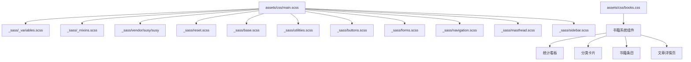
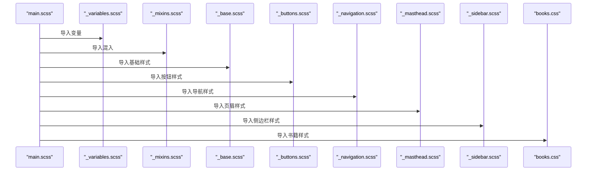
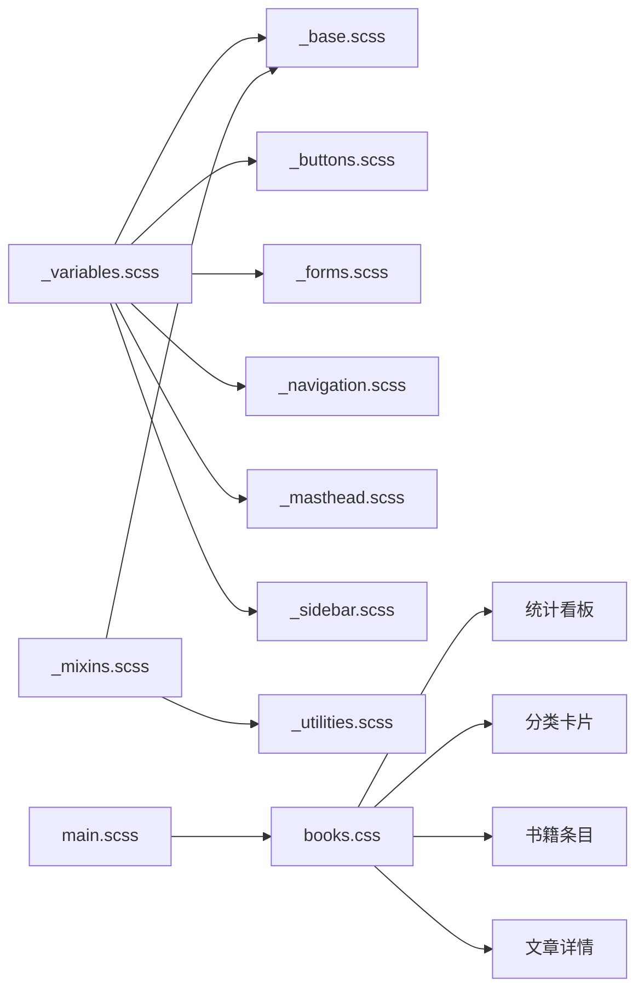

# 样式定制

<cite>
**本文引用的文件**
- [assets/css/main.scss](file://assets/css/main.scss)
- [assets/css/books.css](file://assets/css/books.css)
- [_sass/_variables.scss](file://_sass/_variables.scss)
- [_sass/_mixins.scss](file://_sass/_mixins.scss)
- [_sass/_base.scss](file://_sass/_base.scss)
- [_sass/_buttons.scss](file://_sass/_buttons.scss)
- [_sass/_forms.scss](file://_sass/_forms.scss)
- [_sass/_utilities.scss](file://_sass/_utilities.scss)
- [_sass/_navigation.scss](file://_sass/_navigation.scss)
- [_sass/_masthead.scss](file://_sass/_masthead.scss)
- [_sass/_sidebar.scss](file://_sass/_sidebar.scss)
- [docs/STYLE_EXAMPLES.md](file://docs/STYLE_EXAMPLES.md)
</cite>

## 更新摘要
**变更内容**
- 新增书籍系统专用样式模块，包含完整的读书笔记界面组件
- 扩展主样式文件以支持新的网站增强功能
- 添加响应式设计、渐变背景、悬停效果、进度条等视觉组件
- 完善书籍文章详情页的样式实现

## 目录
1. [简介](#简介)
2. [项目结构](#项目结构)
3. [核心组件](#核心组件)
4. [架构总览](#架构总览)
5. [详细组件分析](#详细组件分析)
6. [依赖关系分析](#依赖关系分析)
7. [性能与可维护性建议](#性能与可维护性建议)
8. [故障排查指南](#故障排查指南)
9. [结论](#结论)
10. [附录：变量清单与定制要点](#附录变量清单与定制要点)

## 简介
本指南面向希望深度定制主题样式的开发者与内容作者，聚焦于 Sass 变量系统的使用与扩展。你将学会如何修改颜色主题、字体设置、间距配置、断点与网格、阴影与边框等核心变量，并通过具体示例了解如何创建自定义主题色板、调整字体大小层级、修改链接样式等常见需求。文档同时提供响应式设计的最佳实践与性能优化建议，帮助你构建一致、可维护且高性能的视觉体系。

**更新** 新增了书籍系统的完整样式模块，包括统计看板、分类卡片、书籍条目、文章详情页等丰富的视觉组件。

## 项目结构
本项目基于 Jekyll + Minimal Mistakes 主题，样式采用 Sass 模块化组织，入口文件负责按顺序引入各模块，变量与混入集中定义，业务样式分散在多个局部文件中。

图表来源
- [assets/css/main.scss:10-38](file://assets/css/main.scss#L10-L38)
- [assets/css/books.css:1-530](file://assets/css/books.css#L1-L530)
- [_sass/_variables.scss:1-158](file://_sass/_variables.scss#L1-L158)
- [_sass/_mixins.scss:1-53](file://_sass/_mixins.scss#L1-L53)

章节来源
- [assets/css/main.scss:10-38](file://assets/css/main.scss#L10-L38)

## 核心组件
- 变量中心：集中管理颜色、字体、字号阶梯、断点、网格、圆角、阴影、过渡等全局设计令牌。
- 混入与函数：封装常用工具（如 em 计算、清除浮动），以及响应式断点调用方式。
- 基础样式：为 HTML 元素提供默认排版、链接、代码块、列表、媒体等基础规则。
- 组件样式：按钮、表单、导航、页眉、侧边栏等 UI 组件的样式实现。
- 实用类：通用工具类（对齐、隐藏、图标、模态框等）。
- **新增** 书籍系统组件：统计看板、分类卡片、书籍条目、文章详情页等完整的读书笔记界面。

章节来源
- [_sass/_variables.scss:1-158](file://_sass/_variables.scss#L1-L158)
- [_sass/_mixins.scss:1-53](file://_sass/_mixins.scss#L1-L53)
- [_sass/_base.scss:1-323](file://_sass/_base.scss#L1-L323)
- [_sass/_buttons.scss:1-153](file://_sass/_buttons.scss#L1-L153)
- [_sass/_forms.scss:1-391](file://_sass/_forms.scss#L1-L391)
- [_sass/_utilities.scss:1-471](file://_sass/_utilities.scss#L1-L471)
- [assets/css/books.css:1-530](file://assets/css/books.css#L1-L530)

## 架构总览
样式编译链路从入口 main.scss 开始，依次引入 vendor 库、变量、混入、重置与基础样式，再逐步加载功能模块与页面组件。变量与混入作为"设计令牌"和"工具集"，被所有后续模块复用，确保风格一致性。

图表来源
- [assets/css/main.scss:10-38](file://assets/css/main.scss#L10-L38)

## 详细组件分析

### 变量系统（_variables.scss）
变量是样式定制的基石，涵盖以下关键维度：
- 字体与字号
  - 全局字体族、标题字体族、说明字体族、等宽字体族
  - 字号阶梯（type-size-1 到 type-size-8）
- 颜色体系
  - 灰阶、主色、成功/警告/危险/信息色
  - 品牌色（社交图标等）
  - 链接色及其 hover/visited 派生值
- 断点与网格
  - 小/中/大/XL 断点
  - Susy 网格配置（列数、列宽、gutters、容器宽度、输出模式等）
- 其他
  - 圆角、阴影、导航图标尺寸、全局过渡

定制方法
- 直接覆盖变量：在 _variables.scss 中修改对应变量值，或在其后新建一个覆盖文件并在 main.scss 中优先引入。
- 使用 !default：若变量已声明并带 !default，可在外部通过同名变量覆盖。
- 组合与派生：利用 mix() 等函数生成深浅变体，保持色彩一致性。
- 断点与网格：调整断点以适配不同屏幕；调整 Susy 参数以改变栅格行为。

章节来源
- [_sass/_variables.scss:1-158](file://_sass/_variables.scss#L1-L158)

### 混入与函数（_mixins.scss）
- em 函数：将目标像素转换为相对单位，便于无障碍与缩放。
- clearfix 混入：清理浮动布局残留。
- 焦点样式占位符：统一键盘可达性的焦点外观。

定制方法
- 扩展 em 函数的上下文：通过 $doc-font-size 控制基准字号，影响所有基于 em 的计算。
- 自定义混入：在 mixins 中新增通用逻辑，供多处复用。

章节来源
- [_sass/_mixins.scss:1-53](file://_sass/_mixins.scss#L1-L53)

### 基础样式（_base.scss）
- 全局排版：body、h1-h6、p、ul/ol、blockquote、hr 等默认样式。
- 链接与代码：链接状态、内联代码与代码块的背景、边框、阴影、圆角。
- 媒体与图片：figure/figcaption 布局与响应式半图/三图布局。
- 全局过渡：对常用元素应用统一的 transition。

定制方法
- 通过变量控制：text-color、border-color、code-background-color、box-shadow、border-radius、global-transition 等。
- 调整字号阶梯：修改 type-size-* 变量，影响 h1-h6 与 small 等元素的字号。
- 链接样式：修改 link-color、link-color-hover、link-color-visited 等变量。

章节来源
- [_sass/_base.scss:1-323](file://_sass/_base.scss#L1-L323)

### 按钮（_buttons.scss）
- 默认按钮：主色背景、圆角、悬停加深。
- 变体：inverse、light-outline、info/warning/success/danger、social 系列。
- 尺寸：x-large、large、small。

定制方法
- 主色与辅助色：通过 primary-color、info-color、warning-color、success-color、danger-color 控制。
- 圆角与字号：通过 border-radius 与 type-size-* 控制。
- 社交按钮：通过对应的品牌色变量控制。

章节来源
- [_sass/_buttons.scss:1-153](file://_sass/_buttons.scss#L1-L153)

### 表单（_forms.scss）
- 输入控件：input/textarea/select 的基础样式、边框、圆角、阴影、hover/focus 状态。
- 帮助文本与搜索表单：help-block、form-search 等。
- 禁用与只读：opacity 与 cursor 提示。

定制方法
- 边框与圆角：通过 border-color、border-radius、box-shadow 控制。
- 焦点色：通过 primary-color 控制 focus 边框色。
- 字号：通过 type-size-* 控制 label/help 等文字大小。

章节来源
- [_sass/_forms.scss:1-391](file://_sass/_forms.scss#L1-L391)

### 导航与页眉（_navigation.scss, _masthead.scss）
- 面包屑与分页：分页器样式、当前页高亮、禁用态。
- 优先级+导航：移动端折叠菜单、下拉箭头、悬停下划线动画。
- 页眉：sticky 定位、底部边框、内部容器与菜单项。

定制方法
- 链接色与悬停色：通过 masthead-link-color、masthead-link-color-hover、link-color-hover 控制。
- 边框与圆角：通过 border-color、border-radius 控制。
- 过渡动效：通过 global-transition 控制。

章节来源
- [_sass/_navigation.scss:1-432](file://_sass/_navigation.scss#L1-L432)
- [_sass/_masthead.scss:1-65](file://_sass/_masthead.scss#L1-L65)

### 侧边栏（_sidebar.scss）
- 侧边栏布局：在大屏下使用 span(2 of 12) 参与栅格。
- 作者头像与信息：头像圆角、边框、名称与简介排版。
- 社交链接：悬停下划线、下拉箭头。

定制方法
- 右侧栏宽度：通过 right-sidebar-width-narrow/right-sidebar-width/right-sidebar-width-wide 控制。
- 字号与字体：通过 sans-serif-narrow、type-size-* 控制。
- 边框与圆角：通过 border-color、border-radius 控制。

章节来源
- [_sass/_sidebar.scss:1-277](file://_sass/_sidebar.scss#L1-L277)

### 实用类（_utilities.scss）
- 可见性与可读性：hidden、visually-hidden、screen-reader-text 等。
- 对齐与布局：align-left/center/right、full、wrapper。
- 图标与社交图标：icon、social-icons 及各平台颜色。
- 导航图标：navicon 与关闭态变换。
- 模态框与脚注：modal、footnote 等。

定制方法
- 社交图标颜色：通过各品牌色变量控制。
- 模态框边框与阴影：通过 border-color、border-radius、box-shadow 控制。

章节来源
- [_sass/_utilities.scss:1-471](file://_sass/_utilities.scss#L1-L471)

### 业务增强样式（assets/css/main.scss）
- CSS 变量：根级 --spacing 用于统一间距。
- 论文卡片、徽章、荣誉列表、告警框、特性网格、技术栈标签、教程步骤、对比表格、博客元数据等组件样式。
- 响应式适配：在小屏下调整网格与布局。
- **新增** 书籍系统基础样式：统计卡片、分类卡片、书籍条目等核心组件。

定制方法
- 通过 CSS 变量统一管理间距与主题色（建议在 :root 中扩展更多变量）。
- 组件样式可按需增删改，遵循现有命名约定与语义化类名。

章节来源
- [assets/css/main.scss:40-592](file://assets/css/main.scss#L40-L592)

### 书籍系统专用样式（assets/css/books.css）
**新增** 完整的读书笔记系统样式模块，包含以下核心组件：

#### 统计看板组件
- 四宫格统计卡片：总数、已完成、阅读中、计划中的可视化展示
- 渐变背景：每个统计卡片使用不同的渐变色方案
- 悬停效果：卡片上浮与阴影加深的交互反馈
- 响应式适配：移动端自动调整为两列布局

#### 分类卡片网格
- 自适应网格布局：根据屏幕宽度自动调整列数
- 卡片悬停效果：上浮动画与阴影变化
- 进度条组件：显示各类别完成进度的可视化指示器
- 图标与内容分离：左侧图标区域与右侧内容区域的清晰划分

#### 书籍条目卡片
- 状态标识：通过左侧边框颜色区分完成、阅读中、计划中三种状态
- 状态徽章：右上角显示当前状态的彩色标签
- 标签系统：支持多标签的扁平化展示
- 内容层次：标题、日期、分类、摘要、标签的清晰层次结构

#### 文章详情页样式
- 文章头部：返回链接、标题、元信息的结构化布局
- 章节目录导航：粘性定位的章节导航面板
- 章节内容：优化的阅读体验，包括标题层级、引用、代码块等
- 分页提示：底部的阅读进度提示

定制方法
- 颜色主题：通过修改渐变色值和状态色来定制整体视觉风格
- 布局调整：通过 Grid 和 Flexbox 属性调整组件布局
- 动画效果：通过 transition 属性控制交互动画的速度和缓动函数
- 响应式断点：通过 @media 查询适配不同屏幕尺寸

章节来源
- [assets/css/books.css:1-530](file://assets/css/books.css#L1-L530)

## 依赖关系分析
- 入口依赖：main.scss 依赖 breakpoint、susy、font-awesome、magnific-popup 等第三方库。
- 变量与混入：_variables.scss 与 _mixins.scss 被所有模块引用，形成强耦合的设计令牌层。
- 组件间关系：导航、页眉、侧边栏均依赖变量中的颜色、字号、断点与网格。
- **新增** 书籍系统独立依赖：books.css 作为独立的样式模块，不依赖 Sass 变量系统，可直接使用。

图表来源
- [_sass/_variables.scss:1-158](file://_sass/_variables.scss#L1-L158)
- [_sass/_mixins.scss:1-53](file://_sass/_mixins.scss#L1-L53)
- [_sass/_base.scss:1-323](file://_sass/_base.scss#L1-L323)
- [_sass/_buttons.scss:1-153](file://_sass/_buttons.scss#L1-L153)
- [_sass/_forms.scss:1-391](file://_sass/_forms.scss#L1-L391)
- [_sass/_navigation.scss:1-432](file://_sass/_navigation.scss#L1-L432)
- [_sass/_masthead.scss:1-65](file://_sass/_masthead.scss#L1-L65)
- [_sass/_sidebar.scss:1-277](file://_sass/_sidebar.scss#L1-L277)
- [_sass/_utilities.scss:1-471](file://_sass/_utilities.scss#L1-L471)
- [assets/css/books.css:1-530](file://assets/css/books.css#L1-L530)

## 性能与可维护性建议
- 变量集中管理：将设计令牌集中在 _variables.scss，避免散落硬编码值。
- 合理使用 !default：对外部覆盖友好，便于主题二次开发。
- 减少重复计算：使用 mix() 与函数派生颜色，避免手工维护多套相近色值。
- 控制断点数量：仅保留必要断点，避免过度细分导致样式膨胀。
- 谨慎使用复杂选择器：提高可读性与编译效率。
- 按需引入第三方库：仅在 main.scss 中引入必要的 vendor 样式。
- 使用 CSS 变量进行运行时微调：对于需要动态切换的主题，可在 :root 中定义 CSS 变量，结合 JS 切换。
- **新增** 书籍样式模块化：books.css 作为独立模块，便于维护和扩展。
- **新增** 响应式优化：使用现代 CSS Grid 和 Flexbox 布局，减少媒体查询复杂度。

[本节为通用指导，不直接分析具体文件]

## 故障排查指南
- 变量未生效
  - 检查变量是否被正确引入，确认覆盖顺序（覆盖文件应在被覆盖文件之后引入）。
  - 确认变量是否带有 !default，必要时移除 !default 或在覆盖文件中显式赋值。
- 断点不生效
  - 检查 breakpoint-set 配置与断点变量值是否正确。
  - 确认 @include breakpoint(...) 的变量名与 _variables.scss 中定义的断点一致。
- 网格异常
  - 检查 Susy 配置（columns、column-width、gutters、container 等）是否与预期一致。
  - 确认容器宽度与断点匹配，避免溢出或留白异常。
- 链接样式不一致
  - 检查 link-color、link-color-hover、link-color-visited 变量是否被覆盖。
  - 确认导航与页眉链接使用的 masthead-link-color 变量是否被修改。
- 按钮颜色异常
  - 检查 primary-color 与各状态色变量是否被覆盖。
  - 确认 social 按钮的品牌色变量是否更新。
- **新增** 书籍样式冲突
  - 检查 books.css 是否被正确引入到页面中。
  - 确认书籍组件的类名没有被其他样式覆盖。
  - 验证响应式断点在不同设备上的表现是否符合预期。

章节来源
- [_sass/_variables.scss:1-158](file://_sass/_variables.scss#L1-L158)
- [_sass/_buttons.scss:1-153](file://_sass/_buttons.scss#L1-L153)
- [_sass/_navigation.scss:1-432](file://_sass/_navigation.scss#L1-L432)
- [_sass/_masthead.scss:1-65](file://_sass/_masthead.scss#L1-L65)
- [assets/css/books.css:1-530](file://assets/css/books.css#L1-L530)

## 结论
通过集中化的 Sass 变量系统与模块化样式组织，本项目提供了高度可定制的视觉体系。围绕颜色、字体、字号、断点、网格、阴影与边框等核心变量进行定制，可以快速实现主题换肤、品牌升级与响应式优化。配合合理的性能与可维护性策略，能够长期稳定地支撑站点演进。

**更新** 新增的书籍系统样式模块为读书笔记功能提供了完整的视觉解决方案，包括统计看板、分类导航、书籍管理和文章阅读等核心场景，进一步丰富了网站的表达能力和用户交互体验。

[本节为总结，不直接分析具体文件]

## 附录：变量清单与定制要点

- 字体与字号
  - 全局字体族：$global-font-family、$header-font-family、$caption-font-family、$monospace
  - 字号阶梯：$type-size-1 至 $type-size-8
  - 定制要点：修改字号阶梯即可整体调整标题与正文比例；如需更细粒度控制，可在基础样式中针对特定元素覆盖。

- 颜色体系
  - 灰阶：$gray、$dark-gray、$darker-gray、$light-gray、$lighter-gray
  - 主题色：$primary-color、$success-color、$warning-color、$danger-color、$info-color
  - 链接色：$link-color、$link-color-hover、$link-color-visited
  - 品牌色：$facebook-color、$twitter-color、$github-color 等
  - 定制要点：通过 mix() 派生 hover/visited 等变体，保持色彩一致性；社交图标颜色由品牌色变量驱动。

- 断点与网格
  - 断点：$small、$medium、$medium-wide、$large、$x-large
  - Susy：$susy（columns、column-width、gutters、math、output、gutter-position、container、global-box-sizing）
  - 定制要点：根据内容密度与设备分布调整断点；调整 Susy 列数与列宽以改变栅格密度与容器宽度。

- 其他
  - 圆角：$border-radius
  - 阴影：$box-shadow
  - 导航图标：$navicon-width、$navicon-height
  - 全局过渡：$global-transition
  - 定制要点：统一圆角与阴影可提升视觉一致性；过渡时间影响交互反馈速度。

- 业务增强样式
  - 在 assets/css/main.scss 中定义了丰富的业务组件样式与 CSS 变量，适合快速扩展与主题化。
  - **新增** 书籍系统样式：在 assets/css/books.css 中实现了完整的读书笔记界面，包括统计看板、分类卡片、书籍条目、文章详情页等组件。
  - 参考示例文档以了解各类组件的使用方法。

章节来源
- [_sass/_variables.scss:1-158](file://_sass/_variables.scss#L1-L158)
- [assets/css/main.scss:40-592](file://assets/css/main.scss#L40-L592)
- [assets/css/books.css:1-530](file://assets/css/books.css#L1-L530)
- [docs/STYLE_EXAMPLES.md:1-401](file://docs/STYLE_EXAMPLES.md#L1-L401)