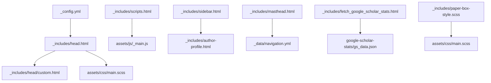
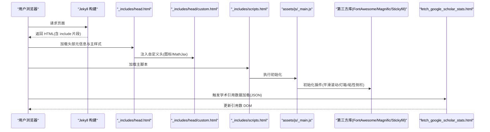
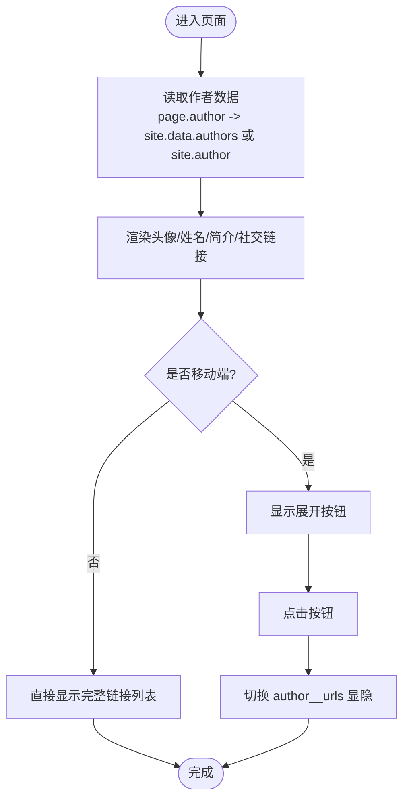
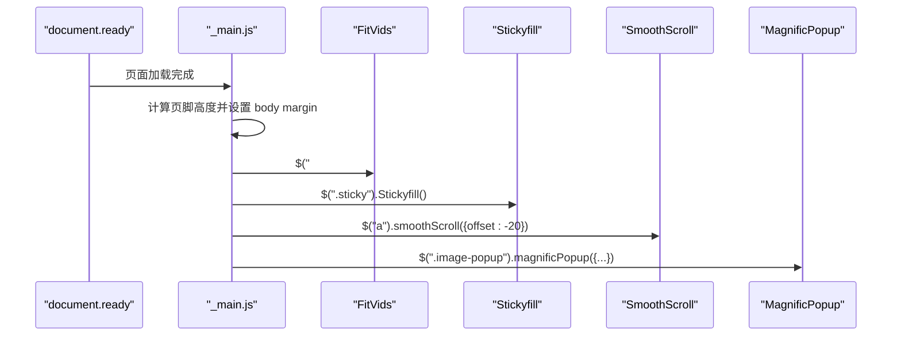
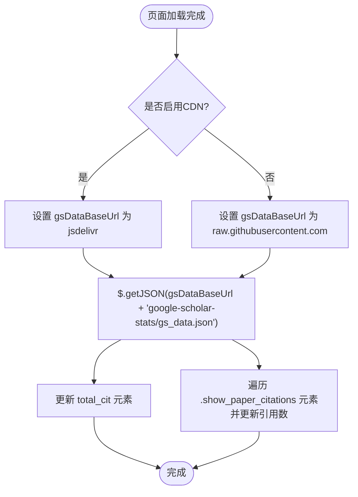
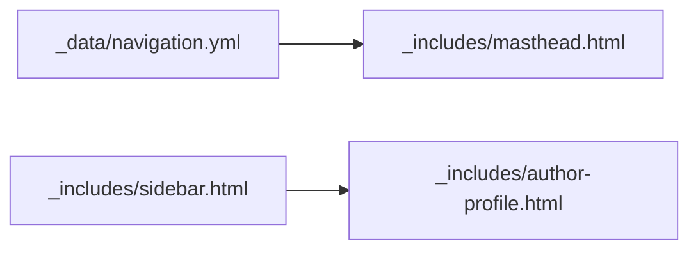
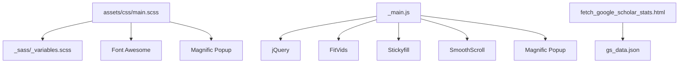

# 组件定制

<cite>
**本文引用的文件**   
- [_config.yml](file://_config.yml)
- [_includes/head.html](file://_includes/head.html)
- [_includes/head/custom.html](file://_includes/head/custom.html)
- [_includes/scripts.html](file://_includes/scripts.html)
- [_includes/author-profile.html](file://_includes/author-profile.html)
- [_includes/sidebar.html](file://_includes/sidebar.html)
- [_includes/masthead.html](file://_includes/masthead.html)
- [_includes/fetch_google_scholar_stats.html](file://_includes/fetch_google_scholar_stats.html)
- [_includes/paper-box-style.scss](file://_includes/paper-box-style.scss)
- [assets/css/main.scss](file://assets/css/main.scss)
- [assets/js/_main.js](file://assets/js/_main.js)
- [assets/js/collapse.js](file://assets/js/collapse.js)
- [_sass/_variables.scss](file://_sass/_variables.scss)
- [_data/navigation.yml](file://_data/navigation.yml)
</cite>

## 目录
1. [简介](#简介)
2. [项目结构](#项目结构)
3. [核心组件](#核心组件)
4. [架构总览](#架构总览)
5. [详细组件分析](#详细组件分析)
6. [依赖关系分析](#依赖关系分析)
7. [性能考虑](#性能考虑)
8. [故障排查指南](#故障排查指南)
9. [结论](#结论)
10. [附录](#附录)

## 简介
本指南面向希望深度定制可复用组件的开发者，聚焦以下目标：
- 理解并扩展作者资料卡片、论文展示框、脚本加载器等核心组件
- 通过修改 include 文件实现功能扩展与交互增强
- 集成第三方 JavaScript 库（如 MathJax、Magnific Popup、Stickyfill 等）
- 提供高级定制技巧：自定义动画、用户体验增强、页面性能优化

## 项目结构
本项目基于 Jekyll + Minimal Mistakes 主题。关键目录与职责：
- _includes：可复用片段（头部、侧边栏、作者卡片、脚本注入等）
- assets/css：样式入口 main.scss，聚合各模块样式
- assets/js：主逻辑 _main.js 与插件 collapse.js
- _sass：SCSS 变量与主题样式
- _data：导航配置等数据源
- _config.yml：站点全局配置（默认值、Sass、插件等）



图表来源
- [_config.yml:120-140](file://_config.yml#L120-L140)
- [_includes/head.html:1-16](file://_includes/head.html#L1-L16)
- [_includes/head/custom.html:1-24](file://_includes/head/custom.html#L1-L24)
- [_includes/scripts.html:1-1](file://_includes/scripts.html#L1-L1)
- [_includes/sidebar.html:1-14](file://_includes/sidebar.html#L1-L14)
- [_includes/author-profile.html:1-91](file://_includes/author-profile.html#L1-L91)
- [_includes/masthead.html:1-16](file://_includes/masthead.html#L1-L16)
- [_data/navigation.yml:1-29](file://_data/navigation.yml#L1-L29)
- [_includes/fetch_google_scholar_stats.html:1-19](file://_includes/fetch_google_scholar_stats.html#L1-L19)
- [_includes/paper-box-style.scss:1-26](file://_includes/paper-box-style.scss#L1-L26)
- [assets/css/main.scss:1-50](file://assets/css/main.scss#L1-L50)

章节来源
- [_config.yml:120-140](file://_config.yml#L120-L140)
- [_includes/head.html:1-16](file://_includes/head.html#L1-L16)
- [_includes/scripts.html:1-1](file://_includes/scripts.html#L1-L1)
- [_includes/sidebar.html:1-14](file://_includes/sidebar.html#L1-L14)
- [_includes/masthead.html:1-16](file://_includes/masthead.html#L1-L16)
- [_data/navigation.yml:1-29](file://_data/navigation.yml#L1-L29)
- [_includes/paper-box-style.scss:1-26](file://_includes/paper-box-style.scss#L1-L26)
- [assets/css/main.scss:1-50](file://assets/css/main.scss#L1-L50)

## 核心组件
- 作者资料卡片：通过 include 渲染，支持头像、简介、多平台社交链接；响应式折叠在移动端显示为按钮展开
- 论文展示框：使用 paper-box 类实现图文左右布局，图片自适应与阴影效果
- 脚本加载器：统一在 scripts.html 引入主脚本，_main.js 初始化交互与第三方插件
- Google Scholar 统计：按需从 CDN 或仓库拉取 JSON 数据，动态填充引用数

章节来源
- [_includes/author-profile.html:1-91](file://_includes/author-profile.html#L1-L91)
- [_includes/paper-box-style.scss:1-26](file://_includes/paper-box-style.scss#L1-L26)
- [_includes/scripts.html:1-1](file://_includes/scripts.html#L1-L1)
- [assets/js/_main.js:1-99](file://assets/js/_main.js#L1-L99)
- [_includes/fetch_google_scholar_stats.html:1-19](file://_includes/fetch_google_scholar_stats.html#L1-L19)

## 架构总览
下图展示了页面构建与运行时交互的关键路径：HTML 片段由 Jekyll 渲染，CSS/JS 资源在 head 与 scripts 中注入，运行时由 _main.js 驱动交互与第三方库。



图表来源
- [_includes/head.html:1-16](file://_includes/head.html#L1-L16)
- [_includes/head/custom.html:1-24](file://_includes/head/custom.html#L1-L24)
- [_includes/scripts.html:1-1](file://_includes/scripts.html#L1-L1)
- [assets/js/_main.js:1-99](file://assets/js/_main.js#L1-L99)
- [_includes/fetch_google_scholar_stats.html:1-19](file://_includes/fetch_google_scholar_stats.html#L1-L19)

## 详细组件分析

### 作者资料卡片组件
- 数据来源：优先使用 page.author 对应的 site.data.authors，否则回退到 site.author
- 渲染内容：头像、姓名、简介、站点描述、社交链接列表（桌面端长列表，移动端短列表+按钮展开）
- 交互逻辑：_main.js 监听按钮点击，切换 author__urls 的显隐与按钮状态；窗口尺寸变化时重建粘性布局



图表来源
- [_includes/author-profile.html:1-91](file://_includes/author-profile.html#L1-L91)
- [assets/js/_main.js:29-58](file://assets/js/_main.js#L29-L58)

章节来源
- [_includes/author-profile.html:1-91](file://_includes/author-profile.html#L1-L91)
- [assets/js/_main.js:29-58](file://assets/js/_main.js#L29-L58)

#### 如何定制作者资料卡片
- 新增社交平台字段
  - 在 _config.yml 的 author 节点添加新字段（例如 new_platform），并在 _includes/author-profile.html 中按既有模式增加条件渲染与图标
- 调整布局与样式
  - 在 assets/css/main.scss 或 _sass 下新增/覆盖相关类名，控制间距、颜色、字体等
- 行为增强
  - 在 _main.js 中追加事件监听，例如点击后记录埋点或打开新标签

章节来源
- [_config.yml:23-60](file://_config.yml#L23-L60)
- [_includes/author-profile.html:1-91](file://_includes/author-profile.html#L1-L91)
- [assets/css/main.scss:40-86](file://assets/css/main.scss#L40-L86)
- [assets/js/_main.js:29-58](file://assets/js/_main.js#L29-L58)

### 论文展示框组件
- 结构与样式：paper-box 容器采用 Flex 布局，左侧图片区与右侧文字区比例固定；图片带阴影与 object-fit 适配
- 样式来源：_includes/paper-box-style.scss 与 assets/css/main.scss 均定义了 .paper-box 系列样式，后者为主入口

```mermaid
classDiagram
class PaperBox {
+display : flex
+flex-direction : row
+gap : 20px
+align-items : center
+border-bottom : 1px solid #efefef
+padding : 2em 0
}
class PaperBoxImage {
+min-width : 200px
+max-width : 40%
+img{
+max-width : 400px
+box-shadow : 3px 3px 6px #888
+object-fit : cover
}
}
class PaperBoxText {
+max-width : 60%
+vertical-align : middle
}
PaperBox --> PaperBoxImage : "包含"
PaperBox --> PaperBoxText : "包含"
```

图表来源
- [_includes/paper-box-style.scss:1-26](file://_includes/paper-box-style.scss#L1-L26)
- [assets/css/main.scss:45-86](file://assets/css/main.scss#L45-L86)

章节来源
- [_includes/paper-box-style.scss:1-26](file://_includes/paper-box-style.scss#L1-L26)
- [assets/css/main.scss:45-86](file://assets/css/main.scss#L45-L86)

#### 如何定制论文展示框
- 调整比例与间距
  - 修改 .paper-box-image 与 .paper-box-text 的百分比宽度与 gap
- 图片表现
  - 调整 box-shadow、object-fit、圆角等属性
- 响应式适配
  - 在 main.scss 中添加媒体查询，在小屏改为上下堆叠布局

章节来源
- [assets/css/main.scss:45-86](file://assets/css/main.scss#L45-L86)

### 脚本加载器与交互系统
- 加载入口：_includes/scripts.html 引入 assets/js/main.min.js（实际开发可使用未压缩版本便于调试）
- 初始化流程：_main.js 在文档就绪后执行：
  - 粘性页脚高度计算
  - FitVids 初始化（视频自适应）
  - Stickyfill 初始化（侧栏粘性）
  - 作者链接区域响应式显示/隐藏
  - 平滑滚动
  - 图片灯箱（Magnific Popup）
- 第三方库集成：
  - FontAwesome、Magnific Popup、Stickyfill、jQuery 插件等在 main.scss 与 _main.js 中被引入与调用



图表来源
- [_includes/scripts.html:1-1](file://_includes/scripts.html#L1-L1)
- [assets/js/_main.js:1-99](file://assets/js/_main.js#L1-L99)

章节来源
- [_includes/scripts.html:1-1](file://_includes/scripts.html#L1-L1)
- [assets/js/_main.js:1-99](file://assets/js/_main.js#L1-L99)

#### 如何添加新的交互效果
- 在 _main.js 中追加 jQuery 事件绑定与动画逻辑
- 如需独立模块，可在 assets/js 下新建文件并在 scripts.html 中引入
- 使用 CSS 动画或过渡提升体验（参考 _sass/_animations.scss 与 main.scss 中的过渡定义）

章节来源
- [assets/js/_main.js:1-99](file://assets/js/_main.js#L1-L99)
- [_includes/scripts.html:1-1](file://_includes/scripts.html#L1-L1)

#### 如何集成第三方 JavaScript 库
- 在 _includes/head/custom.html 中通过 CDN 引入库（示例：MathJax）
- 在 main.scss 中引入对应样式（示例：Magnific Popup）
- 在 _main.js 中初始化插件（示例：Magnific Popup、Stickyfill、SmoothScroll）

章节来源
- [_includes/head/custom.html:12-21](file://_includes/head/custom.html#L12-L21)
- [assets/css/main.scss:34-38](file://assets/css/main.scss#L34-L38)
- [assets/js/_main.js:60-96](file://assets/js/_main.js#L60-L96)

### Google Scholar 统计组件
- 数据源选择：根据配置 google_scholar_stats_use_cdn 决定从 jsdelivr CDN 或 GitHub raw 获取 gs_data.json
- 渲染逻辑：页面加载完成后，通过 $.getJSON 拉取数据，将 totalCitation 写入 id="total_cit" 的元素，并将每篇论文的引用数写入带有 class="show_paper_citations" 且 data 属性为论文 ID 的元素



图表来源
- [_includes/fetch_google_scholar_stats.html:1-19](file://_includes/fetch_google_scholar_stats.html#L1-L19)
- [_config.yml:12](file://_config.yml#L12)

章节来源
- [_includes/fetch_google_scholar_stats.html:1-19](file://_includes/fetch_google_scholar_stats.html#L1-L19)
- [_config.yml:12](file://_config.yml#L12)

#### 如何扩展学术引用展示
- 在论文条目中使用 class="show_paper_citations" 并设置 data 属性为论文 ID
- 确保 gs_data.json 中包含 publications 映射与 citedby 总数
- 如需本地缓存或错误重试，可在 fetch_google_scholar_stats.html 中封装 AJAX 逻辑

章节来源
- [_includes/fetch_google_scholar_stats.html:1-19](file://_includes/fetch_google_scholar_stats.html#L1-L19)

### 侧边栏与导航
- 侧边栏：_includes/sidebar.html 根据 page.layout 与 page.sidebar 决定是否渲染作者卡片与自定义侧边内容
- 导航：_includes/masthead.html 读取 _data/navigation.yml 生成菜单项



图表来源
- [_includes/sidebar.html:1-14](file://_includes/sidebar.html#L1-L14)
- [_includes/masthead.html:1-16](file://_includes/masthead.html#L1-L16)
- [_data/navigation.yml:1-29](file://_data/navigation.yml#L1-L29)

章节来源
- [_includes/sidebar.html:1-14](file://_includes/sidebar.html#L1-L14)
- [_includes/masthead.html:1-16](file://_includes/masthead.html#L1-L16)
- [_data/navigation.yml:1-29](file://_data/navigation.yml#L1-L29)

#### 如何扩展侧边栏与导航
- 导航：在 _data/navigation.yml 中添加新条目（title/url）
- 侧边栏：在页面 front matter 中定义 sidebar 数组，支持 image/title/text 字段

章节来源
- [_data/navigation.yml:1-29](file://_data/navigation.yml#L1-L29)
- [_includes/sidebar.html:4-12](file://_includes/sidebar.html#L4-L12)

## 依赖关系分析
- 样式依赖：main.scss 聚合主题基础样式、工具类、组件样式与第三方库样式
- 脚本依赖：_main.js 依赖 jQuery 与多个插件（FitVids、Stickyfill、SmoothScroll、Magnific Popup）
- 数据依赖：Google Scholar 统计依赖 gs_data.json 的结构与可用性



图表来源
- [assets/css/main.scss:10-38](file://assets/css/main.scss#L10-L38)
- [_sass/_variables.scss:1-158](file://_sass/_variables.scss#L1-158)
- [assets/js/_main.js:1-99](file://assets/js/_main.js#L1-L99)
- [_includes/fetch_google_scholar_stats.html:1-19](file://_includes/fetch_google_scholar_stats.html#L1-L19)

章节来源
- [assets/css/main.scss:10-38](file://assets/css/main.scss#L10-L38)
- [_sass/_variables.scss:1-158](file://_sass/_variables.scss#L1-158)
- [assets/js/_main.js:1-99](file://assets/js/_main.js#L1-L99)
- [_includes/fetch_google_scholar_stats.html:1-19](file://_includes/fetch_google_scholar_stats.html#L1-L19)

## 性能考虑
- 资源合并与压缩
  - 生产环境建议使用 assets/js/main.min.js；开发阶段可使用未压缩版本便于调试
- 第三方库按需加载
  - 仅在需要的页面引入 MathJax 或其他重型库，避免首屏阻塞
- 图片与媒体优化
  - 使用合适的图片格式与尺寸；利用 FitVids 保证视频自适应
- 粘性布局与重排
  - Stickyfill 在窗口 resize 时重建布局，注意节流与减少频繁重绘

[本节为通用指导，不直接分析具体文件]

## 故障排查指南
- 数学公式不渲染
  - 检查 _includes/head/custom.html 中 MathJax 配置与脚本加载顺序
- 图片灯箱无效
  - 确认图片链接后缀匹配 _main.js 中的选择器规则，并确保 Magnific Popup 已正确初始化
- 侧边栏粘性失效
  - 检查 Stickyfill 初始化与 .sticky 类是否存在；确认窗口尺寸变化时是否重建
- Google Scholar 引用数为空
  - 确认 gs_data.json 存在且结构正确；检查 google_scholar_stats_use_cdn 配置与网络可达性

章节来源
- [_includes/head/custom.html:12-21](file://_includes/head/custom.html#L12-L21)
- [assets/js/_main.js:63-96](file://assets/js/_main.js#L63-L96)
- [assets/js/_main.js:26-47](file://assets/js/_main.js#L26-L47)
- [_includes/fetch_google_scholar_stats.html:1-19](file://_includes/fetch_google_scholar_stats.html#L1-L19)

## 结论
通过合理组织 include 片段、集中管理样式与脚本、按需集成第三方库，可以高效地扩展与定制作者资料卡片、论文展示框与脚本加载器等核心组件。结合本文提供的定制步骤与最佳实践，可实现更丰富的交互体验与更优的性能表现。

[本节为总结性内容，不直接分析具体文件]

## 附录
- 常用定制清单
  - 新增社交平台：在 _config.yml 与 _includes/author-profile.html 同步添加
  - 调整论文卡片样式：在 assets/css/main.scss 中覆盖 .paper-box 相关类
  - 引入新脚本：在 _includes/scripts.html 中追加 <script> 标签
  - 扩展导航：在 _data/navigation.yml 中添加条目
  - 启用/禁用学术引用 CDN：在 _config.yml 中切换 google_scholar_stats_use_cdn

章节来源
- [_config.yml:23-60](file://_config.yml#L23-L60)
- [_includes/author-profile.html:1-91](file://_includes/author-profile.html#L1-L91)
- [assets/css/main.scss:45-86](file://assets/css/main.scss#L45-L86)
- [_includes/scripts.html:1-1](file://_includes/scripts.html#L1-L1)
- [_data/navigation.yml:1-29](file://_data/navigation.yml#L1-L29)
- [_config.yml:12](file://_config.yml#L12)