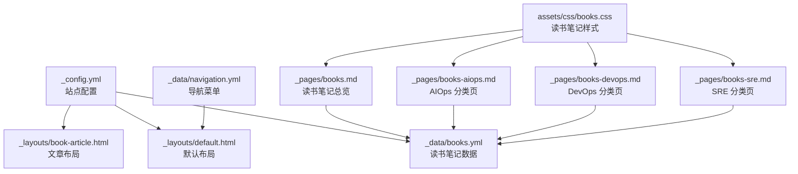
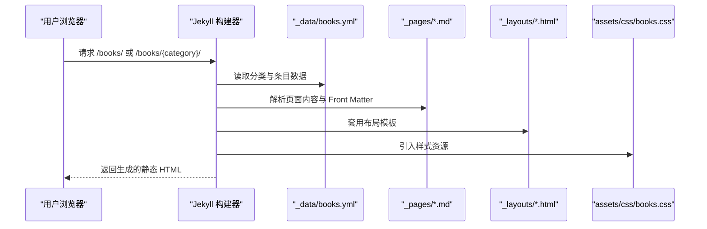
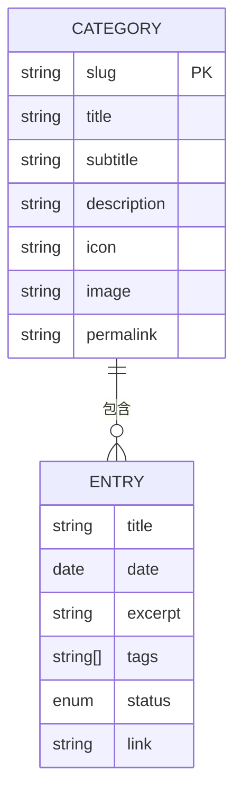
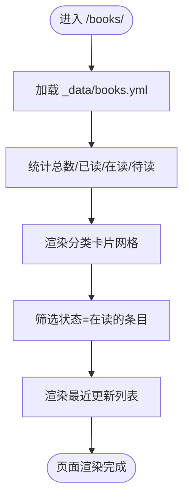
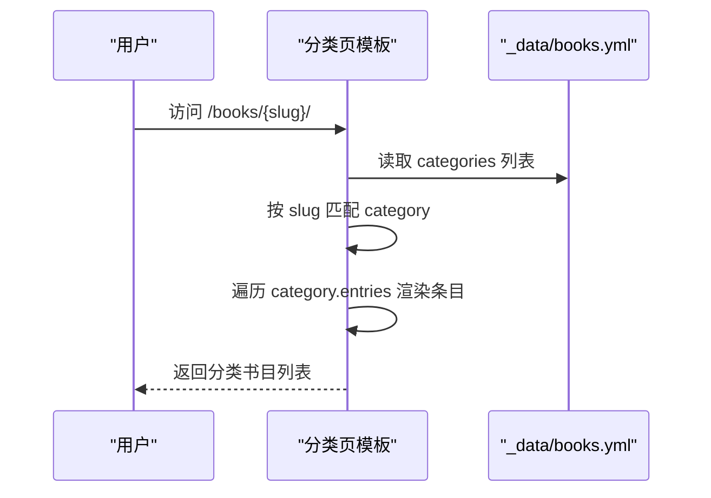
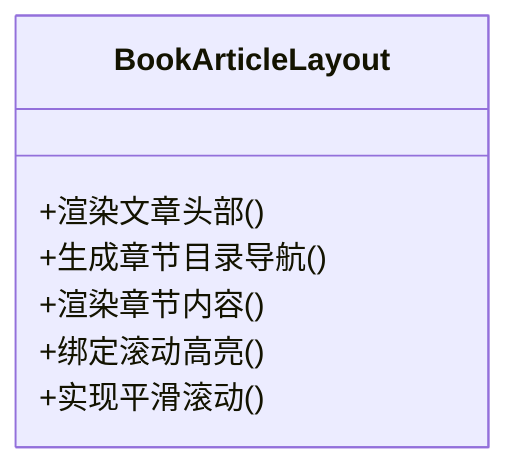
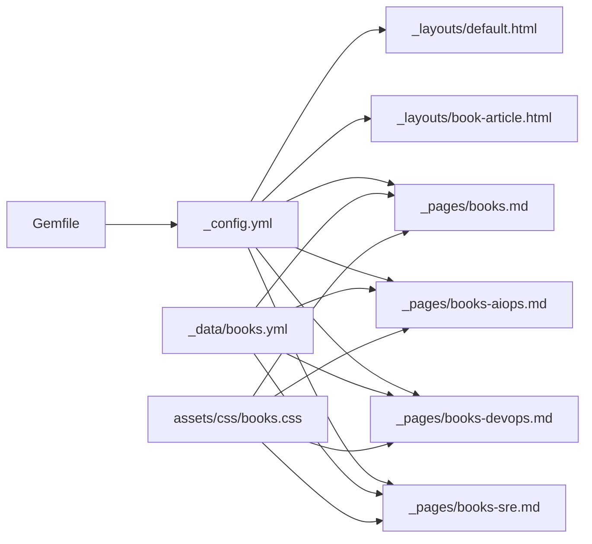

# 书籍管理系统

<cite>
**本文引用的文件**
- [_config.yml](file://_config.yml)
- [books.yml](file://_data/books.yml)
- [navigation.yml](file://_data/navigation.yml)
- [books.md](file://_pages/books.md)
- [books-aiops.md](file://_pages/books-aiops.md)
- [books-devops.md](file://_pages/books-devops.md)
- [books-sre.md](file://_pages/books-sre.md)
- [book-article.html](file://_layouts/book-article.html)
- [default.html](file://_layouts/default.html)
- [books.css](file://assets/css/books.css)
- [Gemfile](file://Gemfile)
- [README.md](file://README.md)
</cite>

## 目录
1. [简介](#简介)
2. [项目结构](#项目结构)
3. [核心组件](#核心组件)
4. [架构总览](#架构总览)
5. [详细组件分析](#详细组件分析)
6. [依赖关系分析](#依赖关系分析)
7. [性能与可维护性](#性能与可维护性)
8. [故障排查指南](#故障排查指南)
9. [结论](#结论)
10. [附录](#附录)

## 简介
本项目是一个基于 Jekyll 的静态站点，内置“读书笔记”模块，用于按分类展示技术书籍的阅读状态、摘要与标签，并提供分类列表页与文章详情页模板。数据通过 YAML 配置集中管理，页面使用 Liquid 模板渲染，样式由 SCSS/CSS 提供，整体遵循“数据驱动 + 模板渲染”的静态站点模式。

## 项目结构
- 站点根目录包含 Jekyll 标准目录：_config.yml、_data、_includes、_layouts、_pages、_sass、assets 等。
- 读书笔记数据集中在 _data/books.yml；导航菜单在 _data/navigation.yml。
- 页面包括读书笔记总览 /books/ 与各分类子页（AIOps、DevOps、SRE）。
- 布局模板包括默认布局 default.html 与读书笔记文章布局 book-article.html。
- 样式文件 assets/css/books.css 负责读书笔记模块的视觉呈现。

图表来源
- [_config.yml:139-144](file://_config.yml#L139-L144)
- [_data/books.yml:1-85](file://_data/books.yml#L1-L85)
- [_pages/books.md:1-109](file://_pages/books.md#L1-L109)
- [_pages/books-aiops.md:1-45](file://_pages/books-aiops.md#L1-L45)
- [_pages/books-devops.md:1-45](file://_pages/books-devops.md#L1-L45)
- [_pages/books-sre.md:1-45](file://_pages/books-sre.md#L1-L45)
- [_layouts/default.html:1-132](file://_layouts/default.html#L1-L132)
- [_layouts/book-article.html:1-129](file://_layouts/book-article.html#L1-L129)
- [books.css:1-530](file://assets/css/books.css#L1-L530)
- [_data/navigation.yml:1-29](file://_data/navigation.yml#L1-L29)

章节来源
- [_config.yml:1-184](file://_config.yml#L1-L184)
- [_data/books.yml:1-85](file://_data/books.yml#L1-L85)
- [_pages/books.md:1-109](file://_pages/books.md#L1-L109)
- [_pages/books-aiops.md:1-45](file://_pages/books-aiops.md#L1-L45)
- [_pages/books-devops.md:1-45](file://_pages/books-devops.md#L1-L45)
- [_pages/books-sre.md:1-45](file://_pages/books-sre.md#L1-L45)
- [_layouts/default.html:1-132](file://_layouts/default.html#L1-L132)
- [_layouts/book-article.html:1-129](file://_layouts/book-article.html#L1-L129)
- [books.css:1-530](file://assets/css/books.css#L1-L530)
- [_data/navigation.yml:1-29](file://_data/navigation.yml#L1-L29)

## 核心组件
- 数据层
  - _data/books.yml：定义分类 slug、标题、副标题、描述、图标、图片、永久链接及条目列表（含标题、日期、摘要、标签、状态、外链）。
  - _data/navigation.yml：主导航项，包含“Books”入口。
- 页面层
  - _pages/books.md：读书笔记总览，统计总数、已读/在读/待读数量，展示分类卡片网格与最近更新（在读条目）。
  - _pages/books-{aiops,devops,sre}.md：各分类书目列表页，根据 slug 匹配对应分类并渲染条目。
- 布局层
  - _layouts/default.html：通用页面骨架，注入头部、侧边栏、脚本等。
  - _layouts/book-article.html：读书笔记文章详情页模板，支持章节目录导航、滚动高亮与平滑跳转。
- 样式层
  - assets/css/books.css：读书笔记看板、分类卡片、条目卡片、文章详情页样式与响应式适配。
- 构建与插件
  - Gemfile：声明 Jekyll 版本与插件（分页、sitemap、feed、gist、重定向等）。
  - _config.yml：站点元信息、作者信息、集合（collections）配置、Sass 编译、输出规则、时区、压缩等。

章节来源
- [_data/books.yml:1-85](file://_data/books.yml#L1-L85)
- [_data/navigation.yml:1-29](file://_data/navigation.yml#L1-L29)
- [_pages/books.md:1-109](file://_pages/books.md#L1-L109)
- [_pages/books-aiops.md:1-45](file://_pages/books-aiops.md#L1-L45)
- [_pages/books-devops.md:1-45](file://_pages/books-devops.md#L1-L45)
- [_pages/books-sre.md:1-45](file://_pages/books-sre.md#L1-L45)
- [_layouts/default.html:1-132](file://_layouts/default.html#L1-L132)
- [_layouts/book-article.html:1-129](file://_layouts/book-article.html#L1-L129)
- [books.css:1-530](file://assets/css/books.css#L1-L530)
- [Gemfile:1-51](file://Gemfile#L1-L51)
- [_config.yml:1-184](file://_config.yml#L1-L184)

## 架构总览
系统采用“数据 + 模板 + 样式”的静态站点架构：
- 数据源：YAML 配置文件集中管理分类与条目。
- 渲染引擎：Jekyll 使用 Liquid 模板在构建期生成静态 HTML。
- 页面路由：通过 _pages 下的 Markdown 文件定义 URL 与内容，结合 _config.yml 的 permalink 规则。
- 样式与交互：SCSS/CSS 提供视觉风格，少量前端脚本实现章节目录高亮与平滑滚动。

图表来源
- [_config.yml:139-144](file://_config.yml#L139-L144)
- [_data/books.yml:1-85](file://_data/books.yml#L1-L85)
- [_pages/books.md:1-109](file://_pages/books.md#L1-L109)
- [_pages/books-aiops.md:1-45](file://_pages/books-aiops.md#L1-L45)
- [_pages/books-devops.md:1-45](file://_pages/books-devops.md#L1-L45)
- [_pages/books-sre.md:1-45](file://_pages/books-sre.md#L1-L45)
- [_layouts/default.html:1-132](file://_layouts/default.html#L1-L132)
- [_layouts/book-article.html:1-129](file://_layouts/book-article.html#L1-L129)
- [books.css:1-530](file://assets/css/books.css#L1-L530)

## 详细组件分析

### 数据模型与字段规范
- 分类对象
  - slug：唯一标识，用于页面匹配（如 aiops、devops、sre）。
  - title：分类名称。
  - subtitle：副标题。
  - description：分类描述。
  - icon：分类图标（emoji）。
  - image：分类封面图路径。
  - permalink：分类页永久链接。
  - entries：条目数组。
- 条目对象
  - title：书名。
  - date：阅读日期（YYYY-MM-DD）。
  - excerpt：摘要。
  - tags：标签数组。
  - status：阅读状态（reading/completed/planned）。
  - link：外部链接（可选）。

图表来源
- [_data/books.yml:1-85](file://_data/books.yml#L1-L85)

章节来源
- [_data/books.yml:1-85](file://_data/books.yml#L1-L85)

### 读书笔记总览页（/books/）
- 功能要点
  - 遍历所有分类与条目，统计总计、已读、在读、待读数量。
  - 展示分类卡片网格，显示每类条目数与完成进度条。
  - 展示“最近更新”区域，仅列出状态为“在读”的条目。
- 关键逻辑
  - 使用 Liquid 循环与条件判断进行计数与筛选。
  - 计算进度百分比并动态设置进度条宽度。
  - 渲染标签列表与分类图标。

图表来源
- [_pages/books.md:1-109](file://_pages/books.md#L1-L109)
- [_data/books.yml:1-85](file://_data/books.yml#L1-L85)

章节来源
- [_pages/books.md:1-109](file://_pages/books.md#L1-L109)

### 分类书目列表页（/books/{aiops|devops|sre}）
- 功能要点
  - 通过 slug 匹配对应分类，渲染分类信息与条目列表。
  - 根据条目状态应用不同样式类与徽章文本。
  - 若存在外链则标题可点击跳转。
- 关键逻辑
  - 遍历 site.data.books.categories 查找匹配的 category。
  - 对每个 entry 渲染标题、日期、摘要与标签。

图表来源
- [_pages/books-aiops.md:1-45](file://_pages/books-aiops.md#L1-L45)
- [_pages/books-devops.md:1-45](file://_pages/books-devops.md#L1-L45)
- [_pages/books-sre.md:1-45](file://_pages/books-sre.md#L1-L45)
- [_data/books.yml:1-85](file://_data/books.yml#L1-L85)

章节来源
- [_pages/books-aiops.md:1-45](file://_pages/books-aiops.md#L1-L45)
- [_pages/books-devops.md:1-45](file://_pages/books-devops.md#L1-L45)
- [_pages/books-sre.md:1-45](file://_pages/books-sre.md#L1-L45)

### 读书笔记文章详情页模板（book-article.html）
- 功能要点
  - 文章头部：返回链接、标题、元信息（日期、章节数、状态）、摘要。
  - 章节目录导航：固定定位，滚动时高亮当前章节。
  - 章节内容：按章节顺序渲染标题、副标题与正文（Markdown 转 HTML）。
  - 交互：平滑滚动到目标章节。
- 关键逻辑
  - 监听滚动事件，计算章节位置并切换 active 类。
  - 拦截章节链接点击，执行 smooth scroll。

图表来源
- [_layouts/book-article.html:1-129](file://_layouts/book-article.html#L1-L129)

章节来源
- [_layouts/book-article.html:1-129](file://_layouts/book-article.html#L1-L129)

### 默认布局（default.html）
- 作用：提供全站统一的 HTML 骨架，包含 head、masthead、sidebar、scripts 等公共部分。
- 使用：读书笔记各页面均指定 layout: default，以复用布局。

章节来源
- [_layouts/default.html:1-132](file://_layouts/default.html#L1-L132)

### 样式系统（books.css）
- 模块划分
  - 统计看板：四宫格卡片，渐变背景，悬停动效。
  - 分类卡片网格：自适应列宽，进度条可视化。
  - 条目卡片：状态边框与徽章，标签样式。
  - 文章详情页：头部、章节目录、章节内容、分隔线、提示区。
  - 响应式：移动端网格与布局调整。
- 设计原则
  - 语义化类名，便于扩展与维护。
  - 使用 CSS Grid/Flexbox 提升布局弹性。
  - 统一色彩体系与圆角阴影风格。

章节来源
- [books.css:1-530](file://assets/css/books.css#L1-L530)

### 导航与入口
- 主导航包含“Books”，指向 /books/。
- 各分类页提供“← 返回读书笔记总览”链接，形成双向导航。

章节来源
- [_data/navigation.yml:1-29](file://_data/navigation.yml#L1-L29)
- [_pages/books-aiops.md:1-45](file://_pages/books-aiops.md#L1-L45)
- [_pages/books-devops.md:1-45](file://_pages/books-devops.md#L1-L45)
- [_pages/books-sre.md:1-45](file://_pages/books-sre.md#L1-L45)

## 依赖关系分析
- 构建与插件
  - Jekyll 版本与插件在 Gemfile 中声明，_config.yml 的 plugins 与 whitelist 启用相应功能。
- 站点配置
  - _config.yml 定义站点元信息、作者、集合（books）、Sass 路径、输出规则、时区与压缩策略。
- 页面与布局
  - 页面文件引用默认布局与自定义样式，布局文件包含公共片段（head、sidebar、scripts）。
- 数据与渲染
  - 页面通过 Liquid 读取 _data/books.yml 的数据，进行统计、过滤与渲染。

图表来源
- [Gemfile:1-51](file://Gemfile#L1-L51)
- [_config.yml:1-184](file://_config.yml#L1-L184)
- [_layouts/default.html:1-132](file://_layouts/default.html#L1-L132)
- [_layouts/book-article.html:1-129](file://_layouts/book-article.html#L1-L129)
- [_pages/books.md:1-109](file://_pages/books.md#L1-L109)
- [_pages/books-aiops.md:1-45](file://_pages/books-aiops.md#L1-L45)
- [_pages/books-devops.md:1-45](file://_pages/books-devops.md#L1-L45)
- [_pages/books-sre.md:1-45](file://_pages/books-sre.md#L1-L45)
- [_data/books.yml:1-85](file://_data/books.yml#L1-L85)
- [books.css:1-530](file://assets/css/books.css#L1-L530)

章节来源
- [Gemfile:1-51](file://Gemfile#L1-L51)
- [_config.yml:1-184](file://_config.yml#L1-L184)

## 性能与可维护性
- 构建性能
  - 静态站点在构建期完成渲染，运行时零后端开销；合理组织数据与模板有助于缩短构建时间。
- 渲染优化
  - 避免在模板中进行复杂计算，尽量将数据处理前置到数据文件或预处理器。
  - 合理使用 Liquid 过滤器与循环，减少重复遍历。
- 样式优化
  - 按需引入样式，避免全局污染；利用 CSS 变量统一管理主题色与间距。
- 可维护性
  - 保持数据模型稳定，新增分类仅需在 books.yml 中添加块。
  - 页面模板与样式解耦，便于独立迭代。

[本节为通用指导，不直接分析具体文件]

## 故障排查指南
- 本地开发环境
  - 参考 README 中的“Debug Locally”步骤，确保 Ruby、RubyGems、GCC、Make 安装正确，并使用提供的脚本启动 Jekyll 热重载服务。
- 常见问题
  - 页面未渲染：检查 Front Matter 是否完整（title、permalink、layout 等）。
  - 数据未生效：确认 _data/books.yml 格式正确，无语法错误。
  - 样式缺失：确认 assets/css/books.css 被正确引入且未被缓存。
  - 插件报错：核对 Gemfile 与 _config.yml 的插件白名单一致。

章节来源
- [README.md:59-66](file://README.md#L59-L66)

## 结论
该书籍管理系统以简洁的数据驱动方式实现了读书笔记的分类管理与展示，具备清晰的页面结构与良好的可扩展性。通过集中化的 YAML 数据与模块化模板/样式，新增分类与条目成本低，适合个人知识管理与分享。

[本节为总结性内容，不直接分析具体文件]

## 附录
- 快速开始
  - Fork 仓库并重命名为 USERNAME.github.io。
  - 根据需要修改 _config.yml 与 _data/books.yml。
  - 本地运行 Jekyll 服务预览效果。
- 相关文档
  - README 提供了 Google Scholar 自动更新、Favicon 生成、SEO 配置等说明。

章节来源
- [README.md:33-57](file://README.md#L33-L57)