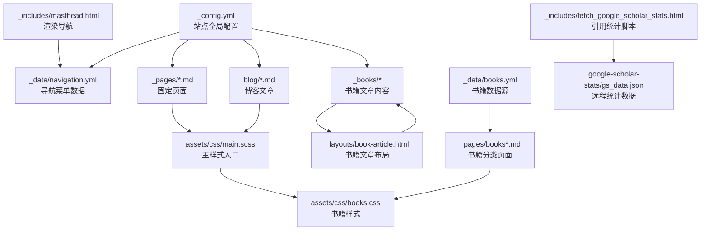
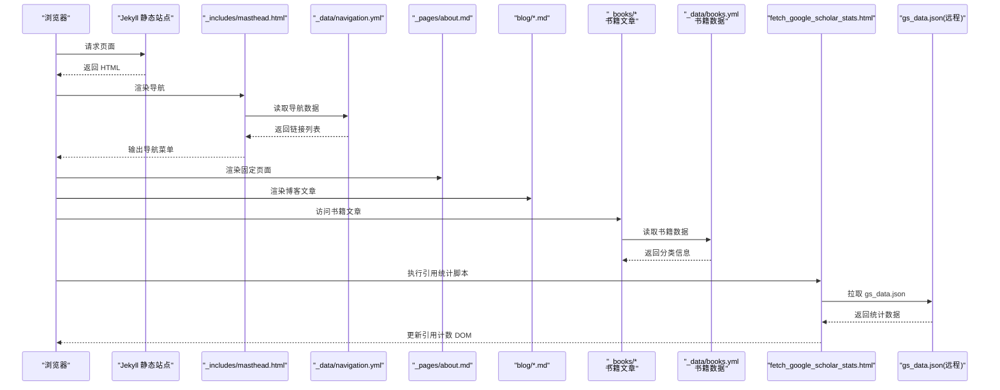
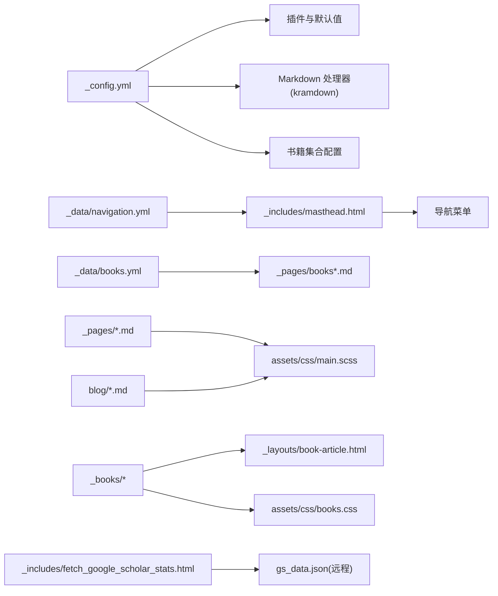

# 内容管理

<cite>
**本文引用的文件**   
- [_config.yml](file://_config.yml)
- [_data/navigation.yml](file://_data/navigation.yml)
- [_data/books.yml](file://_data/books.yml)
- [README.md](file://README.md)
- [docs/README-zh.md](file://docs/README-zh.md)
- [docs/BLOG_USAGE_GUIDE.md](file://docs/BLOG_USAGE_GUIDE.md)
- [docs/STYLE_EXAMPLES.md](file://docs/STYLE_EXAMPLES.md)
- [_pages/about.md](file://_pages/about.md)
- [_pages/projects.md](file://_pages/projects.md)
- [_pages/internships.md](file://_pages/internships.md)
- [_pages/books.md](file://_pages/books.md)
- [_pages/books-aiops.md](file://_pages/books-aiops.md)
- [_pages/books-devops.md](file://_pages/books-devops.md)
- [_pages/books-sre.md](file://_pages/books-sre.md)
- [_books/sre/google-sre.md](file://_books/sre/google-sre.md)
- [_layouts/book-article.html](file://_layouts/book-article.html)
- [blog/2024-01-05-observability-stack.md](file://blog/2024-01-05-observability-stack.md)
- [blog/2025-01-01-k8s-1.35-cilium-kubevip-containerd-high-availability-cluster.md](file://blog/2025-01-01-k8s-1.35-cilium-kubevip-containerd-high-availability-cluster.md)
- [_includes/fetch_google_scholar_stats.html](file://_includes/fetch_google_scholar_stats.html)
- [_includes/masthead.html](file://_includes/masthead.html)
- [assets/css/main.scss](file://assets/css/main.scss)
- [assets/css/books.css](file://assets/css/books.css)
</cite>

## 更新摘要
**变更内容**   
- 新增书籍集合配置章节，详细说明 Jekyll Collections 的使用
- 更新数据源配置部分，包含 _data/books.yml 的数据结构说明
- 新增书籍文章布局与样式系统说明
- 完善导航菜单配置，包含书籍集合的集成方式
- 补充书籍内容的组织与管理规范

## 目录
1. [简介](#简介)
2. [项目结构](#项目结构)
3. [核心组件](#核心组件)
4. [架构总览](#架构总览)
5. [详细组件分析](#详细组件分析)
6. [依赖关系分析](#依赖关系分析)
7. [性能与可用性考虑](#性能与可用性考虑)
8. [故障排查指南](#故障排查指南)
9. [结论](#结论)
10. [附录：写作规范与最佳实践](#附录写作规范与最佳实践)

## 简介
本仓库是一个基于 Jekyll 的个人学术主页与博客站点，采用 Markdown 编写页面与文章，支持 Google Scholar 引用统计、响应式布局与 SEO 优化。内容管理系统围绕以下目标展开：
- 使用 Markdown 语法高效维护关于页、项目展示、实习经历等固定页面
- 以日期命名组织博客文章，并通过 Front Matter 配置元数据
- 通过导航配置文件集中管理顶部菜单
- 统一管理图片资源路径与样式
- 提供 HTML+Markdown 混合排版技巧与 Google Scholar 引用统计集成方案
- **新增** 支持书籍集合功能，实现读书笔记的结构化管理与分类展示

## 项目结构
站点遵循 Jekyll 标准目录约定，关键目录与职责如下：
- _config.yml：站点全局配置（标题、作者、插件、默认值、Markdown 处理器、书籍集合配置等）
- _data/navigation.yml：导航菜单数据源
- _data/books.yml：书籍集合数据源，按分类组织读书笔记条目
- _pages/*.md：固定页面（首页、项目、实习、书籍总览等）
- _books/*：书籍文章内容，使用 Jekyll Collections 组织
- blog/*.md：按日期命名的博客文章
- _includes/*：可复用片段（如 Google Scholar 统计脚本、头部导航等）
- _layouts/book-article.html：书籍文章专用布局模板
- assets/css/main.scss：主样式入口，包含论文卡片、徽章、荣誉列表等自定义样式
- assets/css/books.css：书籍模块专用样式
- images/*：图片资源存放位置

**图表来源**
- [_config.yml:138-143](file://_config.yml#L138-L143)
- [_data/books.yml:1-85](file://_data/books.yml#L1-85)
- [_layouts/book-article.html:1-129](file://_layouts/book-article.html#L1-L129)
- [assets/css/books.css:1-530](file://assets/css/books.css#L1-L530)

**章节来源**
- [_config.yml:1-183](file://_config.yml#L1-L183)
- [_data/navigation.yml:1-29](file://_data/navigation.yml#L1-L29)
- [_data/books.yml:1-85](file://_data/books.yml#L1-L85)
- [README.md:1-73](file://README.md#L1-L73)
- [docs/README-zh.md:1-67](file://docs/README-zh.md#L1-L67)

## 核心组件
- 站点配置中心：统一控制主题行为、SEO、Google Analytics、Google Scholar CDN 开关、默认布局与作者信息等
- **新增** 书籍集合配置：通过 Jekyll Collections 定义 books 集合，设置输出格式和永久链接结构
- 导航系统：通过 YAML 数据驱动，在模板中循环渲染
- 页面与文章：均使用 Markdown + Front Matter；页面用于固定内容，文章用于时间线式发布
- **新增** 书籍数据源：_data/books.yml 提供分类化的读书笔记数据，支持状态管理和标签系统
- **新增** 书籍文章布局：book-article.html 提供专门的书籍阅读体验，包含章节目录导航
- 引用统计：前端脚本动态加载 gs_data.json，并注入到指定 DOM 节点
- 样式系统：SCSS 聚合样式，提供论文卡片、徽章、荣誉列表、警告框、功能网格、技术栈标签、教程步骤、对比表格、博客元数据、书籍模块等组件样式

**章节来源**
- [_config.yml:120-143](file://_config.yml#L120-L143)
- [_data/books.yml:1-85](file://_data/books.yml#L1-L85)
- [_layouts/book-article.html:1-129](file://_layouts/book-article.html#L1-L129)
- [_includes/masthead.html:1-16](file://_includes/masthead.html#L1-L16)
- [_includes/fetch_google_scholar_stats.html:1-19](file://_includes/fetch_google_scholar_stats.html#L1-L19)
- [assets/css/main.scss:40-342](file://assets/css/main.scss#L40-L342)
- [assets/css/books.css:1-530](file://assets/css/books.css#L1-L530)

## 架构总览
下图展示了从用户访问到内容渲染与引用统计加载的关键流程，包括新增的书籍集合处理流程。

**图表来源**
- [_includes/masthead.html:1-16](file://_includes/masthead.html#L1-L16)
- [_data/navigation.yml:1-29](file://_data/navigation.yml#L1-L29)
- [_data/books.yml:1-85](file://_data/books.yml#L1-L85)
- [_includes/fetch_google_scholar_stats.html:1-19](file://_includes/fetch_google_scholar_stats.html#L1-L19)
- [_pages/about.md:1-250](file://_pages/about.md#L1-L250)
- [blog/2024-01-05-observability-stack.md:1-280](file://blog/2024-01-05-observability-stack.md#L1-L280)

## 详细组件分析

### 书籍集合配置与管理
**新增** Jekyll Collections 是 Jekyll 的高级功能，允许创建结构化内容集合。本站点通过 collections 配置实现了书籍文章的专门管理。

#### 集合配置详解
- **集合定义**：在 _config.yml 中定义 books 集合，设置 output: true 启用输出
- **永久链接**：permalink: /books/:path/ 为书籍文章生成友好的 URL 结构
- **默认值**：为书籍文章设置 author_profile: true，自动显示作者信息

#### 书籍数据源结构
_data/books.yml 采用分层数据结构：
- **categories**：顶级分类数组，每个分类包含 slug、title、subtitle、description、icon、image、permalink、entries
- **entries**：每本书的详细信息，包含 title、date、excerpt、tags、status、link
- **状态管理**：支持 reading、completed、planned 三种阅读状态
- **链接引用**：link 字段支持指向具体的书籍文章内容

#### 书籍页面组织
- **总览页面**：_pages/books.md 展示所有分类和统计信息
- **分类页面**：_pages/books-{category}.md 为每个分类提供独立页面
- **内容页面**：_books/{category}/article.md 存放详细的读书笔记内容

**章节来源**
- [_config.yml:138-143](file://_config.yml#L138-L143)
- [_data/books.yml:1-85](file://_data/books.yml#L1-L85)
- [_pages/books.md:1-109](file://_pages/books.md#L1-L109)
- [_pages/books-aiops.md:1-45](file://_pages/books-aiops.md#L1-L45)
- [_pages/books-devops.md:1-45](file://_pages/books-devops.md#L1-L45)
- [_pages/books-sre.md:1-45](file://_pages/books-sre.md#L1-L45)

### 书籍文章布局与样式系统
**新增** 书籍文章使用专用的 book-article.html 布局模板，提供优化的阅读体验。

#### 布局模板特性
- **章节目录导航**：自动生成章节列表，支持滚动高亮和平滑滚动
- **状态标识**：根据书籍状态显示不同的视觉标识
- **元数据展示**：显示发布日期、章节数量、阅读状态等信息
- **响应式设计**：适配不同屏幕尺寸的设备

#### 样式系统设计
- **模块化样式**：assets/css/books.css 专门管理书籍相关样式
- **统计看板**：展示总计书目、已读完、在读中、待阅读的数量统计
- **分类卡片**：网格布局展示各个分类，包含进度条和统计信息
- **条目卡片**：区分不同状态的书籍条目，支持标签和摘要展示

#### 实际示例
以 Google SRE 读书笔记为例，展示了完整的书籍文章结构：
- Front Matter 配置：layout、title、excerpt、category_link、chapters 等
- 章节内容：每个章节包含标题、副标题和详细内容
- 格式化内容：支持表格、代码块、引用等 Markdown 语法

**章节来源**
- [_layouts/book-article.html:1-129](file://_layouts/book-article.html#L1-L129)
- [assets/css/books.css:1-530](file://assets/css/books.css#L1-L530)
- [_books/sre/google-sre.md:1-196](file://_books/sre/google-sre.md#L1-L196)

### 页面内容与格式规范（关于页、项目、实习、书籍）
- 固定页面位于 _pages 目录，每个 .md 文件代表一个独立页面
- 必须包含 Front Matter，至少设置 permalink、title、excerpt、author_profile、layout
- 推荐使用锚点实现页面内导航，便于顶部菜单直接定位到各章节
- 可使用 HTML+Markdown 混合排版，借助内置样式类实现卡片、徽章、列表等效果
- **新增** 书籍页面支持数据驱动的动态内容生成

示例参考路径
- 关于页结构与引用统计集成：[_pages/about.md:1-250](file://_pages/about.md#L1-L250)
- 项目展示页：[_pages/projects.md:1-46](file://_pages/projects.md#L1-L46)
- 实习经历页：[_pages/internships.md:1-11](file://_pages/internships.md#L1-L11)
- **新增** 书籍总览页：[_pages/books.md:1-109](file://_pages/books.md#L1-L109)
- **新增** AIOps 分类页：[_pages/books-aiops.md:1-45](file://_pages/books-aiops.md#L1-L45)

**章节来源**
- [_pages/about.md:1-250](file://_pages/about.md#L1-L250)
- [_pages/projects.md:1-46](file://_pages/projects.md#L1-L46)
- [_pages/internships.md:1-11](file://_pages/internships.md#L1-L11)
- [_pages/books.md:1-109](file://_pages/books.md#L1-L109)
- [_pages/books-aiops.md:1-45](file://_pages/books-aiops.md#L1-L45)

### 博客文章的组织方式、命名规范与元数据
- 文章位于 blog 目录，文件名必须以日期开头，格式为 YYYY-MM-DD-title.md
- Front Matter 必填字段包括 title、date、categories、tags、excerpt、author_profile
- 建议使用分类与标签进行归档与检索，并在文章末尾补充作者与发布时间信息

示例参考路径
- 博客文章 Front Matter 与正文结构：[blog/2024-01-05-observability-stack.md:1-280](file://blog/2024-01-05-observability-stack.md#L1-L280)
- 长文示例（含架构图与多节内容）：[blog/2025-01-01-k8s-1.35-cilium-kubevip-containerd-high-availability-cluster.md:1-800](file://blog/2025-01-01-k8s-1.35-cilium-kubevip-containerd-high-availability-cluster.md#L1-L800)

**章节来源**
- [docs/BLOG_USAGE_GUIDE.md:85-118](file://docs/BLOG_USAGE_GUIDE.md#L85-L118)
- [blog/2024-01-05-observability-stack.md:1-280](file://blog/2024-01-05-observability-stack.md#L1-L280)
- [blog/2025-01-01-k8s-1.35-cilium-kubevip-containerd-high-availability-cluster.md:1-800](file://blog/2025-01-01-k8s-1.35-cilium-kubevip-containerd-high-availability-cluster.md#L1-L800)

### 导航菜单配置方法
- 导航数据集中定义于 _data/navigation.yml，键 main 下为条目数组
- 模板 _includes/masthead.html 遍历该数据并渲染为菜单项
- 修改菜单只需编辑 YAML 文件，无需改动模板
- **新增** 书籍集合已添加到导航菜单中，提供便捷的访问入口

示例参考路径
- 导航数据：[_data/navigation.yml:1-29](file://_data/navigation.yml#L1-L29)
- 导航模板：[_includes/masthead.html:1-16](file://_includes/masthead.html#L1-L16)

**章节来源**
- [_data/navigation.yml:1-29](file://_data/navigation.yml#L1-L29)
- [_includes/masthead.html:1-16](file://_includes/masthead.html#L1-L16)

### 图片资源的组织与管理
- 图片统一存放在 images 目录，页面与文章中通过相对路径引用
- 建议为图片添加描述性 alt 文本，并进行尺寸优化以提升加载速度
- 可在样式中使用 object-fit 等属性确保图片在不同容器中的显示效果
- **新增** 书籍分类页面支持使用分类图标和封面图片

示例参考路径
- 图片引用示例（关于页）：[_pages/about.md:84-99](file://_pages/about.md#L84-L99)
- 样式中对图片的适配处理：[assets/css/main.scss:62-78](file://assets/css/main.scss#L62-L78)
- **新增** 书籍分类图片配置：[_data/books.yml:11,33,62:11-11](file://_data/books.yml#L11-L11)

**章节来源**
- [_pages/about.md:84-99](file://_pages/about.md#L84-L99)
- [assets/css/main.scss:62-78](file://assets/css/main.scss#L62-L78)
- [_data/books.yml:11,33,62:11-11](file://_data/books.yml#L11-L11)

### HTML+Markdown 混合使用技巧
- 在 Markdown 段落中嵌入 HTML 块以实现更丰富的布局（如卡片、徽章、警告框）
- 使用 markdown="1" 在 HTML 容器中启用 Markdown 解析，提升可读性与可维护性
- 结合样式类名（如 paper-box、badge、honors-list、alert-box、feature-grid、tech-stack、tutorial-steps、comparison-table、blog-meta、书籍相关样式类）快速构建专业版面
- **新增** 书籍模块提供了专门的 CSS 类名用于构建读书笔记界面

示例参考路径
- 论文卡片与徽章混排：[_pages/about.md:84-99](file://_pages/about.md#L84-L99)
- 样式类定义与说明：[assets/css/main.scss:40-342](file://assets/css/main.scss#L40-L342)
- 样式使用示例文档：[docs/STYLE_EXAMPLES.md:1-401](file://docs/STYLE_EXAMPLES.md#L1-L401)
- **新增** 书籍样式类：[assets/css/books.css:1-530](file://assets/css/books.css#L1-L530)

**章节来源**
- [_pages/about.md:84-99](file://_pages/about.md#L84-L99)
- [assets/css/main.scss:40-342](file://assets/css/main.scss#L40-L342)
- [docs/STYLE_EXAMPLES.md:1-401](file://docs/STYLE_EXAMPLES.md#L1-L401)
- [assets/css/books.css:1-530](file://assets/css/books.css#L1-L530)

### Google Scholar 引用统计集成方法
- 在 about 页面或任意需要的位置插入  节点，data 属性值为 Google Scholar 论文 ID
- 站点配置 _config.yml 中 google_scholar_stats_use_cdn 决定数据来源（CDN 或 raw.githubusercontent）
- 脚本 _includes/fetch_google_scholar_stats.html 在页面加载后异步拉取 gs_data.json，并将引用数写入对应 DOM 节点
- 若需显示总引用数，可在页面放置 id 为 total_cit 的元素，脚本会自动填充

流程图（引用统计加载）

**图表来源**
- [_includes/fetch_google_scholar_stats.html:1-19](file://_includes/fetch_google_scholar_stats.html#L1-L19)
- [_config.yml:12-12](file://_config.yml#L12-L12)
- [_pages/about.md:11-16](file://_pages/about.md#L11-L16)

**章节来源**
- [_includes/fetch_google_scholar_stats.html:1-19](file://_includes/fetch_google_scholar_stats.html#L1-L19)
- [_config.yml:12-12](file://_config.yml#L12-L12)
- [_pages/about.md:11-16](file://_pages/about.md#L11-L16)

## 依赖关系分析
- 配置层：_config.yml 控制 Markdown 处理器（kramdown）、高亮器（rouge）、插件（paginate、sitemap、feed、gist、redirect-from）、默认布局与作者信息、**新增** 书籍集合配置
- 数据层：_data/navigation.yml 提供导航数据，_data/books.yml 提供书籍数据，被相应模板消费
- 视图层：_pages 与 blog 下的 Markdown 文件经 Jekyll 编译为 HTML，应用 assets/css/main.scss 提供的样式
- **新增** 集合层：_books 目录下的书籍文章通过 Jekyll Collections 机制处理，应用 book-article.html 布局
- 运行时：fetch_google_scholar_stats.html 在客户端侧拉取 gs_data.json 并更新 DOM

**图表来源**
- [_config.yml:120-143](file://_config.yml#L120-L143)
- [_data/navigation.yml:1-29](file://_data/navigation.yml#L1-L29)
- [_data/books.yml:1-85](file://_data/books.yml#L1-L85)
- [_layouts/book-article.html:1-129](file://_layouts/book-article.html#L1-L129)
- [assets/css/books.css:1-530](file://assets/css/books.css#L1-L530)

**章节来源**
- [_config.yml:120-143](file://_config.yml#L120-L143)
- [_data/navigation.yml:1-29](file://_data/navigation.yml#L1-L29)
- [_data/books.yml:1-85](file://_data/books.yml#L1-L85)
- [_includes/masthead.html:1-16](file://_includes/masthead.html#L1-L16)
- [assets/css/main.scss:1-342](file://assets/css/main.scss#L1-L342)
- [_includes/fetch_google_scholar_stats.html:1-19](file://_includes/fetch_google_scholar_stats.html#L1-L19)

## 性能与可用性考虑
- 图片优化：压缩与合理尺寸，避免阻塞首屏渲染
- 样式合并：main.scss 已聚合常用样式，按需扩展，避免重复引入
- 引用统计：启用 CDN 可减少跨域与墙内访问问题，但存在缓存延迟；关闭 CDN 则直连 GitHub Raw，实时性更好
- 代码块与图表：合理使用 Mermaid 与代码高亮，避免过大文件影响加载
- **新增** 书籍数据加载：_data/books.yml 作为静态数据源，加载速度快，适合大量书籍条目的展示
- **新增** 集合优化：Jekyll Collections 在构建时生成静态页面，无需运行时处理，性能优异

## 故障排查指南
- 导航未显示或链接异常
  - 检查 _data/navigation.yml 的 URL 与 title 是否正确
  - 确认 _includes/masthead.html 模板是否被正确引入
- 引用统计不更新
  - 检查 _config.yml 中 google_scholar_stats_use_cdn 的设置
  - 确认 gs_data.json 是否存在且可访问
  - 检查页面中是否有  节点以及正确的 data 值
- 样式未生效
  - 确认 assets/css/main.scss 已被编译并引入
  - 检查类名是否与样式定义一致（如 paper-box、badge、honors-list 等）
- **新增** 书籍页面问题
  - 检查 _config.yml 中 collections.books 配置是否正确
  - 确认 _data/books.yml 文件格式和数据结构
  - 验证书籍文章的 Front Matter 是否包含必需的 layout 字段
- 本地调试
  - 按照 README 指引安装 Jekyll 环境并运行本地服务器，查看控制台错误

**章节来源**
- [_data/navigation.yml:1-29](file://_data/navigation.yml#L1-L29)
- [_includes/masthead.html:1-16](file://_includes/masthead.html#L1-L16)
- [_includes/fetch_google_scholar_stats.html:1-19](file://_includes/fetch_google_scholar_stats.html#L1-L19)
- [_config.yml:12-12](file://_config.yml#L12-L12)
- [_config.yml:138-143](file://_config.yml#L138-L143)
- [_data/books.yml:1-85](file://_data/books.yml#L1-L85)
- [README.md:59-66](file://README.md#L59-L66)

## 结论
本内容管理系统以 Jekyll 为核心，通过清晰的目录结构、YAML 数据驱动与 SCSS 样式体系，实现了高效的页面与博客内容管理。**新增的书籍集合功能**进一步增强了知识管理的系统性，支持结构化的读书笔记组织和分类展示。配合 Google Scholar 引用统计与丰富的样式组件，既能满足学术主页的专业呈现，也能支撑技术博客的高质量输出。遵循本文档的写作规范与最佳实践，可显著提升内容维护效率与站点体验。

## 附录：写作规范与最佳实践
- 页面 Front Matter 必备字段：permalink、title、excerpt、author_profile、layout
- 博客文章 Front Matter 必备字段：title、date、categories、tags、excerpt、author_profile
- **新增** 书籍文章 Front Matter 必备字段：layout: book-article、title、excerpt、category_link、category_title、icon、date、status、tags、chapters
- 文件命名：页面使用小写与连字符；博客文章使用 YYYY-MM-DD-title.md；书籍文章按分类组织在 _books/{category}/ 目录下
- 图片管理：统一放在 images 目录，使用相对路径，并为图片添加 alt 文本
- 链接管理：内部链接使用相对路径，外部链接添加描述性文本
- SEO 优化：为每个页面设置有意义的 title 与 description，使用语义化标签
- 版本控制：提交前检查 Markdown 语法与 Front Matter 格式，编写有意义的 commit 信息
- **新增** 书籍数据管理：保持 _data/books.yml 的结构一致性，定期更新阅读状态和进度

**章节来源**
- [docs/BLOG_USAGE_GUIDE.md:329-382](file://docs/BLOG_USAGE_GUIDE.md#L329-L382)
- [docs/STYLE_EXAMPLES.md:380-401](file://docs/STYLE_EXAMPLES.md#L380-L401)
- [_books/sre/google-sre.md:1-10](file://_books/sre/google-sre.md#L1-L10)
- [_data/books.yml:1-85](file://_data/books.yml#L1-L85)