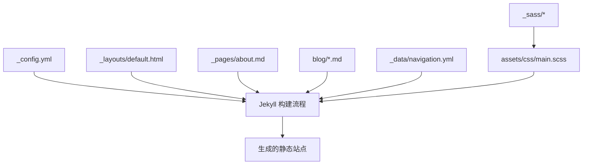
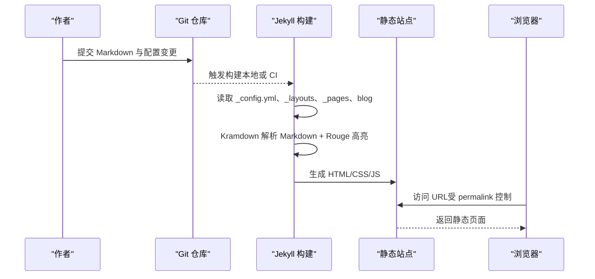
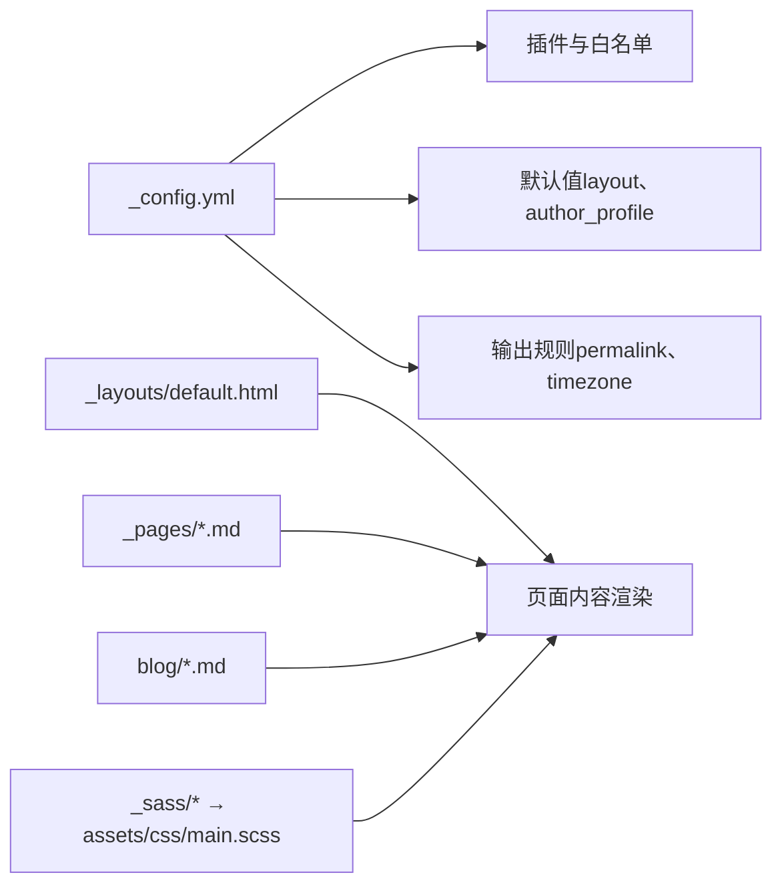

# 博客系统

<cite>
**本文引用的文件**
- [_config.yml](file://_config.yml)
- [README.md](file://README.md)
- [docs/BLOG_USAGE_GUIDE.md](file://docs/BLOG_USAGE_GUIDE.md)
- [docs/STYLE_EXAMPLES.md](file://docs/STYLE_EXAMPLES.md)
- [blog/2024-01-05-observability-stack.md](file://blog/2024-01-05-observability-stack.md)
- [blog/2025-01-01-k8s-1.35-cilium-kubevip-containerd-high-availability-cluster.md](file://blog/2025-01-01-k8s-1.35-cilium-kubevip-containerd-high-availability-cluster.md)
- [_data/navigation.yml](file://_data/navigation.yml)
- [_layouts/default.html](file://_layouts/default.html)
- [_pages/about.md](file://_pages/about.md)
- [_sass/_archive.scss](file://_sass/_archive.scss)
- [_sass/_page.scss](file://_sass/_page.scss)
- [assets/css/main.scss](file://assets/css/main.scss)
</cite>

## 目录
1. [简介](#简介)
2. [项目结构](#项目结构)
3. [核心组件](#核心组件)
4. [架构总览](#架构总览)
5. [详细组件分析](#详细组件分析)
6. [依赖关系分析](#依赖关系分析)
7. [性能与体验优化](#性能与体验优化)
8. [故障排查指南](#故障排查指南)
9. [结论](#结论)
10. [附录：实操步骤与示例](#附录：实操步骤与示例)

## 简介
本仓库基于 Jekyll 构建，采用 Kramdown 作为 Markdown 处理器、Rouge 进行代码高亮。站点包含固定页面（_pages）、导航配置（_data/navigation.yml）、布局模板（_layouts）以及样式资源（_sass、assets/css）。博客文章存放于 blog 目录，遵循日期前缀命名规范，并通过 YAML front matter 定义标题、日期、分类、标签、摘要等元数据。站点支持 SEO 相关配置、Google Analytics、站点验证、压缩输出、分页与 Sitemap 生成等能力。

## 项目结构
- 站点根目录包含 Jekyll 标准目录与自定义资源：
  - _config.yml：全局站点配置（主题、插件、默认值、输出规则等）
  - _layouts/default.html：默认页面布局
  - _includes/*：可复用片段（头部、侧边栏、脚本等）
  - _sass/*：SCSS 样式模块
  - assets/css/main.scss：主样式入口
  - _pages/*.md：固定页面（如首页 about.md）
  - _data/navigation.yml：顶部导航菜单
  - blog/*.md：博客文章（按日期命名）
  - docs/*：使用指南与样式示例文档

图表来源
- [_config.yml:100-169](file://_config.yml#L100-L169)
- [_layouts/default.html:1-34](file://_layouts/default.html#L1-L34)
- [_pages/about.md:1-20](file://_pages/about.md#L1-L20)
- [blog/2024-01-05-observability-stack.md:1-10](file://blog/2024-01-05-observability-stack.md#L1-L10)
- [_data/navigation.yml:1-29](file://_data/navigation.yml#L1-L29)
- [assets/css/main.scss:293-361](file://assets/css/main.scss#L293-L361)

章节来源
- [_config.yml:1-169](file://_config.yml#L1-L169)
- [README.md:1-73](file://README.md#L1-L73)

## 核心组件
- 站点配置（_config.yml）
  - 站点信息、作者信息、SEO 校验码、Google Analytics ID
  - 编码、Markdown 处理器（kramdown）、代码高亮（rouge）
  - 默认值（defaults）为 pages 设置 layout 与 author_profile
  - 输出规则 permalink 使用 /:categories/:title/
  - 时区 Asia/Shanghai
  - 插件与白名单：jekyll-paginate、jekyll-sitemap、jekyll-gist、jekyll-feed、jekyll-redirect-from、jemoji
  - HTML 压缩（compress_html）
- 布局模板（_layouts/default.html）
  - 引入 head、masthead、sidebar、scripts 等片段
  - 渲染 page.title 到 meta headline，内容区域为 {{ content }}
- 导航（_data/navigation.yml）
  - main 列表项，包含 About Me、Publications、Honors and Awards、Educations、Work Experience、Invited Talks、Internships、Blog、Books 等链接
- 固定页面（_pages/about.md）
  - 首页通过 permalink: / 指向站点根路径
  - 使用锚点与卡片样式展示论文、荣誉、教育、工作经历、技术博客推荐等内容
- 博客文章（blog/*.md）
  - 文件名以 YYYY-MM-DD- 开头，便于时间线排序
  - Front Matter 包含 title、date、categories、tags、excerpt、author_profile 等字段
  - 正文支持 Kramdown/GFM、Mermaid 流程图、表格、代码块高亮等

章节来源
- [_config.yml:1-169](file://_config.yml#L1-L169)
- [_layouts/default.html:1-34](file://_layouts/default.html#L1-L34)
- [_data/navigation.yml:1-29](file://_data/navigation.yml#L1-L29)
- [_pages/about.md:1-250](file://_pages/about.md#L1-L250)
- [blog/2024-01-05-observability-stack.md:1-280](file://blog/2024-01-05-observability-stack.md#L1-L280)
- [blog/2025-01-01-k8s-1.35-cilium-kubevip-containerd-high-availability-cluster.md:1-800](file://blog/2025-01-01-k8s-1.35-cilium-kubevip-containerd-high-availability-cluster.md#L1-L800)

## 架构总览
站点由 Jekyll 在构建时将 Markdown 与布局模板合并，生成静态 HTML。Kramdown 负责 Markdown 解析，Rouge 负责代码高亮；插件提供分页、Sitemap、Feed、重定向等功能。样式通过 SCSS 编译并注入到最终页面。

图表来源
- [_config.yml:100-169](file://_config.yml#L100-L169)
- [_layouts/default.html:1-34](file://_layouts/default.html#L1-L34)
- [assets/css/main.scss:293-361](file://assets/css/main.scss#L293-L361)

## 详细组件分析

### 博客文章组织与命名规范
- 目录位置：blog
- 命名规则：YYYY-MM-DD-title.md（例如 2024-01-05-observability-stack.md）
- 作用：确保文章按时间顺序排列，URL 由 permalink 规则生成

章节来源
- [blog/2024-01-05-observability-stack.md:1-10](file://blog/2024-01-05-observability-stack.md#L1-L10)
- [blog/2025-01-01-k8s-1.35-cilium-kubevip-containerd-high-availability-cluster.md:1-10](file://blog/2025-01-01-k8s-1.35-cilium-kubevip-containerd-high-availability-cluster.md#L1-L10)
- [_config.yml:144-145](file://_config.yml#L144-L145)

### YAML Front Matter 配置说明
- 必需字段
  - title：文章标题
  - date：发布时间（建议带时区，如 +0800）
- 可选字段
  - categories：分类数组（影响 URL 路径，因 permalink 使用 /:categories/:title/）
  - tags：标签数组（用于内容检索与展示）
  - excerpt：摘要（用于列表页预览）
  - author_profile：是否显示作者信息
- 封面图片
  - 当前文章未使用专用 cover_image 字段；可在正文中使用图片引用（images/*），或在首页卡片中嵌入图片
- 注意事项
  - 若 categories 为空或未设置，permalink 可能不包含分类段，需检查 URL 生成是否符合预期

章节来源
- [blog/2024-01-05-observability-stack.md:1-8](file://blog/2024-01-05-observability-stack.md#L1-L8)
- [blog/2025-01-01-k8s-1.35-cilium-kubevip-containerd-high-availability-cluster.md:1-8](file://blog/2025-01-01-k8s-1.35-cilium-kubevip-containerd-high-availability-cluster.md#L1-L8)
- [_config.yml:144-145](file://_config.yml#L144-L145)

### Markdown 语法与高级功能
- 代码块高亮：使用三反引号指定语言（如 yaml、bash、json、go），由 Rouge 渲染
- 数学公式：仓库未启用 MathJax/KaTeX；如需支持，需在布局或头文件中引入相应脚本
- 表格：标准 Markdown 表格，自动应用样式
- 列表：有序/无序列表，嵌套层级清晰
- Mermaid 流程图：示例文章中包含 Mermaid 图，用于架构图与拓扑图展示
- 警告框与提示：可使用 blockquote 或自定义 HTML 容器（参考样式示例）

章节来源
- [blog/2024-01-05-observability-stack.md:30-170](file://blog/2024-01-05-observability-stack.md#L30-L170)
- [blog/2025-01-01-k8s-1.35-cilium-kubevip-containerd-high-availability-cluster.md:20-140](file://blog/2025-01-01-k8s-1.35-cilium-kubevip-containerd-high-availability-cluster.md#L20-L140)
- [docs/STYLE_EXAMPLES.md:229-378](file://docs/STYLE_EXAMPLES.md#L229-L378)

### 封面图片与图片管理
- 图片存放：images 目录
- 引用方式：相对路径 images/xxx.png
- 首页卡片：在 _pages/about.md 中使用 paper-box 样式嵌入图片与描述
- 最佳实践：为图片添加 alt 文本，合理压缩尺寸以提升加载速度

章节来源
- [_pages/about.md:185-250](file://_pages/about.md#L185-L250)
- [docs/BLOG_USAGE_GUIDE.md:358-364](file://docs/BLOG_USAGE_GUIDE.md#L358-L364)

### 分类与标签
- 分类（categories）：影响 URL 路径（/:categories/:title/），建议统一小写与连字符风格
- 标签（tags）：用于内容检索与展示，不直接影响 URL
- 导航：_data/navigation.yml 中可添加“博客”入口，方便读者浏览

章节来源
- [_config.yml:144-145](file://_config.yml#L144-L145)
- [_data/navigation.yml:24-25](file://_data/navigation.yml#L24-L25)
- [blog/2024-01-05-observability-stack.md:4-6](file://blog/2024-01-05-observability-stack.md#L4-L6)

### 页面与布局
- 默认布局：_layouts/default.html 提供基础骨架，包含头部、侧边栏、内容与脚本
- 固定页面：_pages/about.md 使用 permalink: / 作为首页，并通过锚点与卡片展示内容
- 作者信息：defaults 中为 pages 设置 author_profile: true

章节来源
- [_layouts/default.html:1-34](file://_layouts/default.html#L1-L34)
- [_pages/about.md:1-10](file://_pages/about.md#L1-L10)
- [_config.yml:120-129](file://_config.yml#L120-L129)

### 样式与视觉
- 归档与列表样式：_sass/_archive.scss 定义了归档项、缩略图、网格视图等
- 单页样式：_sass/_page.scss 定义了页面主体、标题、内容间距等
- 主样式入口：assets/css/main.scss 包含对比表格、博客元数据、书籍看板等自定义样式

章节来源
- [_sass/_archive.scss:1-246](file://_sass/_archive.scss#L1-L246)
- [_sass/_page.scss:1-72](file://_sass/_page.scss#L1-L72)
- [assets/css/main.scss:293-361](file://assets/css/main.scss#L293-L361)

## 依赖关系分析
- 构建依赖
  - Jekyll 核心、Kramdown（Markdown 解析）、Rouge（代码高亮）
  - 插件：jekyll-paginate、jekyll-sitemap、jekyll-gist、jekyll-feed、jekyll-redirect-from、jemoji
- 运行时依赖
  - 浏览器端无额外依赖（静态站点）
  - 如需数学公式或 Mermaid 渲染，需在布局或头文件中引入对应脚本（当前仓库未显式启用）

图表来源
- [_config.yml:100-169](file://_config.yml#L100-L169)
- [_layouts/default.html:1-34](file://_layouts/default.html#L1-L34)
- [assets/css/main.scss:293-361](file://assets/css/main.scss#L293-L361)

章节来源
- [_config.yml:100-169](file://_config.yml#L100-L169)

## 性能与体验优化
- 代码高亮与压缩
  - 使用 Rouge 高亮，开启 compress_html 减少 HTML 体积
- 图片优化
  - 使用合适尺寸与格式（WebP/PNG/JPG），添加 alt 文本，避免过大图片
- 缓存与 CDN
  - Google Scholar 统计可通过 CDN 加速（配置项 google_scholar_stats_use_cdn）
- 路由与 SEO
  - 使用有意义的 title 与 description，语义化标签，站点验证与 Analytics 接入
- 数学公式与 Mermaid
  - 如需增强，建议在布局中按需引入脚本，避免不必要的加载

[本节为通用指导，无需具体文件分析]

## 故障排查指南
- 页面无法访问或 URL 不正确
  - 检查 permalink 规则与 Front Matter 的 categories 设置
  - 确认文件名符合 YYYY-MM-DD-title.md 规范
- 作者信息未显示
  - 检查 defaults 中 author_profile 是否为 true，或页面 Front Matter 是否覆盖
- 代码高亮异常
  - 确认代码块语言标识正确，Rouge 已启用
- 样式未生效
  - 检查 SCSS 编译与 assets/css/main.scss 是否正确引入
- 构建失败
  - 查看控制台错误，确认依赖安装与环境配置（Ruby、Jekyll、GCC、Make）

章节来源
- [_config.yml:100-169](file://_config.yml#L100-L169)
- [_layouts/default.html:1-34](file://_layouts/default.html#L1-L34)
- [README.md:59-66](file://README.md#L59-L66)

## 结论
该博客系统基于 Jekyll 与 Kramdown/Rouge 构建，具备清晰的目录结构与命名规范，完善的 Front Matter 元数据支持，丰富的样式与组件，以及良好的 SEO 与性能优化能力。通过遵循本文档的组织方式与最佳实践，可以快速创建高质量的技术文章，并保持站点的一致性与可维护性。

[本节为总结，无需具体文件分析]

## 附录：实操步骤与示例

### 创建新文章
- 在 blog 目录下新建文件，命名为 YYYY-MM-DD-title.md
- 在文件顶部添加 YAML front matter，至少包含 title 与 date
- 编写正文内容，使用 Markdown 语法与代码块高亮
- 如需分类，设置 categories；如需标签，设置 tags
- 本地运行 jekyll serve 预览，确认 URL 与样式正常

章节来源
- [docs/BLOG_USAGE_GUIDE.md:85-118](file://docs/BLOG_USAGE_GUIDE.md#L85-L118)
- [blog/2024-01-05-observability-stack.md:1-10](file://blog/2024-01-05-observability-stack.md#L1-L10)

### 管理文章分类
- 在 Front Matter 中设置 categories 数组
- 注意 permalink 规则 /:categories/:title/ 会影响 URL 生成
- 保持分类命名一致（小写、连字符），便于管理与检索

章节来源
- [_config.yml:144-145](file://_config.yml#L144-L145)
- [blog/2024-01-05-observability-stack.md:4-6](file://blog/2024-01-05-observability-stack.md#L4-L6)

### 配置文章元数据
- 必填：title、date
- 可选：categories、tags、excerpt、author_profile
- 封面图片：在正文或首页卡片中嵌入图片（images/*）

章节来源
- [blog/2025-01-01-k8s-1.35-cilium-kubevip-containerd-high-availability-cluster.md:1-8](file://blog/2025-01-01-k8s-1.35-cilium-kubevip-containerd-high-availability-cluster.md#L1-L8)
- [_pages/about.md:185-250](file://_pages/about.md#L185-L250)

### 使用 Markdown 高级功能
- 代码块高亮：指定语言（yaml、bash、json、go 等）
- 表格：标准 Markdown 表格
- 列表：有序/无序列表，嵌套层级清晰
- Mermaid 流程图：在正文中使用 mermaid 代码块绘制架构图
- 警告框与提示：使用 blockquote 或自定义 HTML 容器

章节来源
- [blog/2024-01-05-observability-stack.md:30-170](file://blog/2024-01-05-observability-stack.md#L30-L170)
- [blog/2025-01-01-k8s-1.35-cilium-kubevip-containerd-high-availability-cluster.md:20-140](file://blog/2025-01-01-k8s-1.35-cilium-kubevip-containerd-high-availability-cluster.md#L20-L140)
- [docs/STYLE_EXAMPLES.md:229-378](file://docs/STYLE_EXAMPLES.md#L229-L378)

### SEO 优化与内容结构
- 为每个页面设置有意义的 title 与 description
- 使用语义化标签（h1-h6、strong、em、blockquote）
- 添加站点验证与 Analytics（在 _config.yml 中配置）
- 内部链接使用相对路径，外部链接添加描述性文本

章节来源
- [_config.yml:17-21](file://_config.yml#L17-L21)
- [docs/BLOG_USAGE_GUIDE.md:371-376](file://docs/BLOG_USAGE_GUIDE.md#L371-L376)

### 图片管理最佳实践
- 将图片放在 images 目录
- 使用相对路径引用，并为图片添加 alt 文本
- 优化图片大小与格式，提升加载速度

章节来源
- [docs/BLOG_USAGE_GUIDE.md:358-364](file://docs/BLOG_USAGE_GUIDE.md#L358-L364)