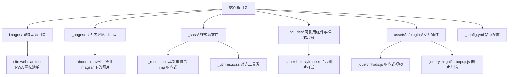
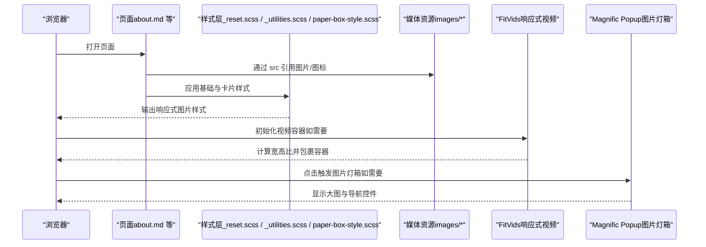
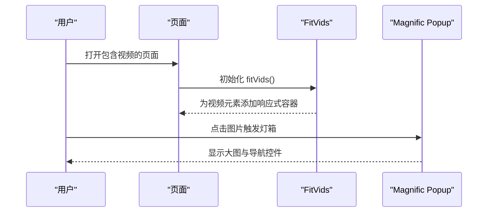
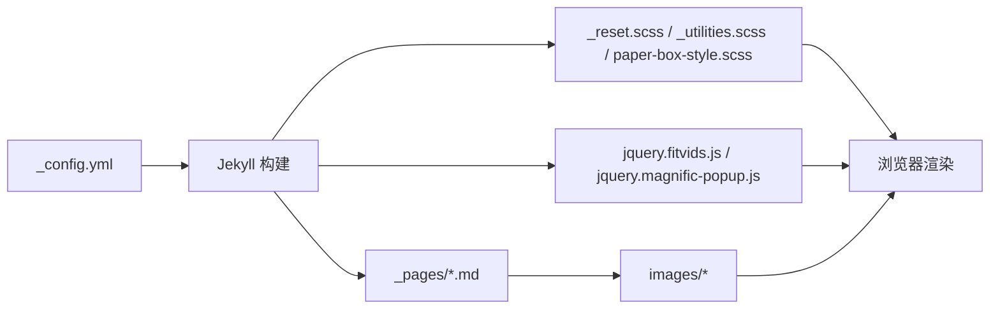

# 媒体资源管理

<cite>
**本文引用的文件**   
- [_config.yml](file://_config.yml)
- [README.md](file://README.md)
- [about.md](file://_pages/about.md)
- [BLOG_USAGE_GUIDE.md](file://docs/BLOG_USAGE_GUIDE.md)
- [site.webmanifest](file://images/site.webmanifest)
- [_reset.scss](file://_sass/_reset.scss)
- [_utilities.scss](file://_sass/_utilities.scss)
- [paper-box-style.scss](file://_includes/paper-box-style.scss)
- [jquery.fitvids.js](file://assets/js/plugins/jquery.fitvids.js)
- [jquery.magnific-popup.js](file://assets/js/plugins/jquery.magnific-popup.js)
</cite>

## 目录
1. [简介](#简介)
2. [项目结构](#项目结构)
3. [核心组件](#核心组件)
4. [架构总览](#架构总览)
5. [详细组件分析](#详细组件分析)
6. [依赖分析](#依赖分析)
7. [性能考虑](#性能考虑)
8. [故障排查指南](#故障排查指南)
9. [结论](#结论)
10. [附录](#附录)

## 简介
本文件面向在 Jekyll 站点中管理与优化媒体资源的作者与维护者，聚焦图片与视频等多媒体的组织、命名、引用方式、响应式与加载体验优化，以及跨域与缓存策略。文档结合仓库实际实现，给出可操作的规范与最佳实践，并附带图示帮助理解数据流与渲染流程。

## 项目结构
本项目采用 Jekyll 标准目录布局，媒体资源主要集中于根目录 images 文件夹；样式与脚本位于 assets 与 _sass/_includes 等目录；页面内容以 Markdown 为主，配合少量 HTML 增强展示效果。

**图表来源** 
- [_config.yml:1-169](file://_config.yml#L1-L169)
- [about.md:80-100](file://_pages/about.md#L80-L100)
- [_reset.scss:100-122](file://_sass/_reset.scss#L100-L122)
- [_utilities.scss:129-157](file://_sass/_utilities.scss#L129-L157)
- [paper-box-style.scss:1-26](file://_includes/paper-box-style.scss#L1-L26)
- [jquery.fitvids.js:1-82](file://assets/js/plugins/jquery.fitvids.js#L1-L82)
- [jquery.magnific-popup.js:1192-1309](file://assets/js/plugins/jquery.magnific-popup.js#L1192-L1309)
- [site.webmanifest:1-19](file://images/site.webmanifest#L1-L19)

**章节来源**
- [_config.yml:1-169](file://_config.yml#L1-L169)
- [README.md:1-73](file://README.md#L1-L73)

## 核心组件
- 媒体资源目录 images
  - 用于存放站点静态图片与 PWA 图标清单等。站点内多处通过相对路径或根路径引用该目录中的资源。
- 页面内容与引用
  - 页面以 Markdown 编写，可在其中嵌入 HTML 的  标签，并通过 src 指向 images 目录中的资源。
- 响应式与展示样式
  - 全局 img 基础样式确保图片自适应父容器宽度；卡片组件对缩略图进行裁剪与阴影处理；工具类提供对齐能力。
- 交互与多媒体
  - FitVids 为嵌入式视频提供等比缩放；Magnific Popup 提供图片灯箱与放大浏览体验。

**章节来源**
- [about.md:80-100](file://_pages/about.md#L80-L100)
- [_reset.scss:100-122](file://_sass/_reset.scss#L100-L122)
- [_utilities.scss:129-157](file://_sass/_utilities.scss#L129-L157)
- [paper-box-style.scss:1-26](file://_includes/paper-box-style.scss#L1-L26)
- [jquery.fitvids.js:1-82](file://assets/js/plugins/jquery.fitvids.js#L1-L82)
- [jquery.magnific-popup.js:1192-1309](file://assets/js/plugins/jquery.magnific-popup.js#L1192-L1309)

## 架构总览
下图展示了从页面到媒体资源的请求与渲染路径，包括样式与交互插件如何影响最终呈现。

**图表来源** 
- [about.md:80-100](file://_pages/about.md#L80-L100)
- [_reset.scss:100-122](file://_sass/_reset.scss#L100-L122)
- [_utilities.scss:129-157](file://_sass/_utilities.scss#L129-L157)
- [paper-box-style.scss:1-26](file://_includes/paper-box-style.scss#L1-L26)
- [jquery.fitvids.js:1-82](file://assets/js/plugins/jquery.fitvids.js#L1-L82)
- [jquery.magnific-popup.js:1192-1309](file://assets/js/plugins/jquery.magnific-popup.js#L1192-L1309)

## 详细组件分析

### 图片资源组织与命名规范
- 目录约定
  - 将图片统一放置在 images 目录下，便于集中管理与引用。
- 命名建议
  - 使用描述性名称，避免无意义字符；建议使用小写英文字母、数字与连字符，例如 kubernetes-architecture.png。
- 与 PWA 的关系
  - site.webmanifest 定义了不同尺寸的图标路径，通常由 favicon 生成器产出后放入站点根目录或 images 下，并在清单中声明。

**章节来源**
- [BLOG_USAGE_GUIDE.md:358-363](file://docs/BLOG_USAGE_GUIDE.md#L358-L363)
- [site.webmanifest:1-19](file://images/site.webmanifest#L1-L19)

### 在 Markdown 与 HTML 中正确引用图片
- 相对路径
  - 在 Markdown 或 HTML 中使用相对路径引用 images 目录中的图片，例如 images/your-image.png。
- 绝对路径
  - 也可使用以站点根开始的绝对路径，例如 /images/your-image.png。
- 示例位置
  - 页面 about.md 中多处通过  标签引用 images 目录中的图片，可作为参考。

**章节来源**
- [BLOG_USAGE_GUIDE.md:358-363](file://docs/BLOG_USAGE_GUIDE.md#L358-L363)
- [about.md:80-100](file://_pages/about.md#L80-L100)

### 图片样式与响应式实现
- 基础响应式
  - 全局 img 样式设置 max-width: 100% 与 height: auto，保证图片不超出父容器并保持比例。
- 卡片缩略图
  - 论文/文章卡片样式对图片设置最大宽度、阴影与 object-fit: cover，使缩略图在不同尺寸容器中保持美观。
- 对齐工具类
  - 提供居中对齐与右对齐等工具类，方便快速排版。

**图表来源** 
- [_reset.scss:100-122](file://_sass/_reset.scss#L100-L122)
- [paper-box-style.scss:1-26](file://_includes/paper-box-style.scss#L1-L26)
- [_utilities.scss:129-157](file://_sass/_utilities.scss#L129-L157)

**章节来源**
- [_reset.scss:100-122](file://_sass/_reset.scss#L100-L122)
- [paper-box-style.scss:1-26](file://_includes/paper-box-style.scss#L1-L26)
- [_utilities.scss:129-157](file://_sass/_utilities.scss#L129-L157)

### 视频与多媒体的响应式与灯箱
- 响应式视频
  - 使用 FitVids 自动计算宽高比并包裹容器，使 iframe/embed/object 在不同屏幕尺寸下保持比例。
- 图片灯箱
  - Magnific Popup 提供图片放大、切换与键盘操作等能力，支持图片加载状态与错误提示。

**图表来源** 
- [jquery.fitvids.js:1-82](file://assets/js/plugins/jquery.fitvids.js#L1-L82)
- [jquery.magnific-popup.js:1192-1309](file://assets/js/plugins/jquery.magnific-popup.js#L1192-L1309)

**章节来源**
- [jquery.fitvids.js:1-82](file://assets/js/plugins/jquery.fitvids.js#L1-L82)
- [jquery.magnific-popup.js:1192-1309](file://assets/js/plugins/jquery.magnific-popup.js#L1192-L1309)

### 跨域资源访问问题
- 外部图片与视频
  - 当引用第三方域名资源时，需关注目标站点的 CORS 策略与访问限制；若出现跨域错误，应优先选择允许跨域的 CDN 或镜像源。
- 站点内资源
  - images 目录下的资源属于同源资源，一般无需额外跨域配置。

[本节为通用指导，不直接分析具体代码文件]

## 依赖分析
- 样式依赖
  - 基础重置与工具类共同决定图片的默认行为与排版能力。
- 交互依赖
  - FitVids 与 Magnific Popup 作为 jQuery 插件，需在页面加载后初始化，分别负责视频与图片的增强体验。
- 配置依赖
  - _config.yml 控制站点元信息、插件与编译选项，间接影响资源路径解析与构建产物。

**图表来源** 
- [_config.yml:1-169](file://_config.yml#L1-L169)
- [_reset.scss:100-122](file://_sass/_reset.scss#L100-L122)
- [_utilities.scss:129-157](file://_sass/_utilities.scss#L129-L157)
- [paper-box-style.scss:1-26](file://_includes/paper-box-style.scss#L1-L26)
- [jquery.fitvids.js:1-82](file://assets/js/plugins/jquery.fitvids.js#L1-L82)
- [jquery.magnific-popup.js:1192-1309](file://assets/js/plugins/jquery.magnific-popup.js#L1192-L1309)

**章节来源**
- [_config.yml:1-169](file://_config.yml#L1-L169)

## 性能考虑
- 图片压缩与格式选择
  - 优先使用现代格式（如 WebP/AVIF），在兼容场景下显著减小体积；保留 PNG/JPG 作为兼容方案。
- 响应式图片
  - 使用合适的尺寸与 CSS 控制，避免传输过大图片；必要时可采用 srcset/sizes（视平台支持情况）。
- 懒加载与预加载
  - 对首屏外的图片启用懒加载；对关键资源（如 logo、首屏缩略图）可考虑预加载。
- 缓存策略
  - 利用浏览器缓存与 CDN 缓存；对静态资源设置合理的 Cache-Control 与版本化文件名。
- 视频优化
  - 使用合适的编码与码率；按需加载播放器；避免在首屏阻塞。

[本节为通用指导，不直接分析具体代码文件]

## 故障排查指南
- 图片无法显示
  - 检查 src 路径是否正确（相对路径或根路径）；确认 images 目录存在对应文件；查看浏览器控制台网络面板是否有 404。
- 图片变形或溢出
  - 确认基础 img 样式未被覆盖；检查卡片容器样式是否生效；必要时使用工具类对齐。
- 视频比例异常
  - 确认已初始化 FitVids；检查容器是否被其他样式覆盖；验证宽高比计算逻辑。
- 灯箱无法打开
  - 检查 Magnific Popup 是否初始化；确认触发元素与事件绑定；查看控制台是否有 JS 报错。

**章节来源**
- [_reset.scss:100-122](file://_sass/_reset.scss#L100-L122)
- [_utilities.scss:129-157](file://_sass/_utilities.scss#L129-L157)
- [paper-box-style.scss:1-26](file://_includes/paper-box-style.scss#L1-L26)
- [jquery.fitvids.js:1-82](file://assets/js/plugins/jquery.fitvids.js#L1-L82)
- [jquery.magnific-popup.js:1192-1309](file://assets/js/plugins/jquery.magnific-popup.js#L1192-L1309)

## 结论
通过将图片等资源集中管理于 images 目录，并结合基础响应式样式与交互插件，可以在 Jekyll 站点中实现稳定、美观且高性能的多媒体展示。遵循统一的命名与引用规范，辅以压缩、缓存与懒加载等优化手段，可显著提升用户体验与可维护性。

## 附录
- 常用路径参考
  - 相对路径：images/your-image.png
  - 绝对路径：/images/your-image.png
- 相关示例位置
  - 页面中图片引用示例：about.md
  - 博客使用指南中的图片管理建议：docs/BLOG_USAGE_GUIDE.md

**章节来源**
- [about.md:80-100](file://_pages/about.md#L80-L100)
- [BLOG_USAGE_GUIDE.md:358-363](file://docs/BLOG_USAGE_GUIDE.md#L358-L363)