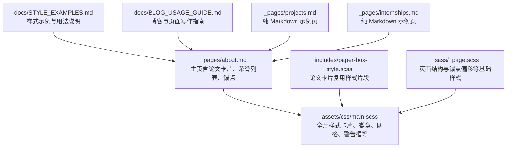
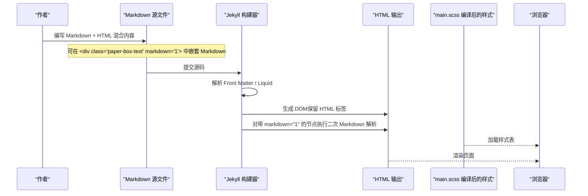
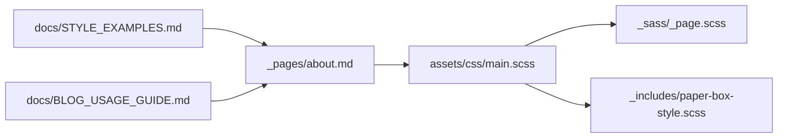

# HTML 与 Markdown 混合使用

<cite>
**本文引用的文件**
- [README.md](file://README.md)
- [docs/STYLE_EXAMPLES.md](file://docs/STYLE_EXAMPLES.md)
- [docs/BLOG_USAGE_GUIDE.md](file://docs/BLOG_USAGE_GUIDE.md)
- [_pages/about.md](file://_pages/about.md)
- [_pages/projects.md](file://_pages/projects.md)
- [_pages/internships.md](file://_pages/internships.md)
- [assets/css/main.scss](file://assets/css/main.scss)
- [_includes/paper-box-style.scss](file://_includes/paper-box-style.scss)
- [_sass/_page.scss](file://_sass/_page.scss)
</cite>

## 目录
1. [简介](#简介)
2. [项目结构](#项目结构)
3. [核心组件](#核心组件)
4. [架构总览](#架构总览)
5. [详细组件分析](#详细组件分析)
6. [依赖关系分析](#依赖关系分析)
7. [性能与可维护性建议](#性能与可维护性建议)
8. [故障排查指南](#故障排查指南)
9. [结论](#结论)
10. [附录：常用样式与用法速查](#附录常用样式与用法速查)

## 简介
本文件面向在 Jekyll 站点中使用“HTML + Markdown”混合写作的作者，系统讲解如何在 Markdown 内容中嵌入 HTML 标签、自定义 CSS 类、内联样式与容器布局；并重点说明 markdown="1" 属性在 HTML 容器中启用嵌套 Markdown 的用法。文档结合仓库中的实际页面与样式实现，给出论文展示框、荣誉奖项列表、功能网格、徽章、警告框等组件的实现思路与最佳实践，帮助读者在不牺牲可读性的前提下，构建复杂且美观的页面结构。

## 项目结构
本项目基于 Jekyll 与 Minimal Mistakes 主题，站点内容主要位于 _pages 与 blog 目录，样式集中在 assets/css/main.scss 与 _sass 子模块中。以下图示展示了与“HTML+Markdown 混用”相关的核心文件及其职责。



图表来源
- [_pages/about.md:81-145](file://_pages/about.md#L81-L145)
- [assets/css/main.scss:45-342](file://assets/css/main.scss#L45-L342)
- [_includes/paper-box-style.scss:1-26](file://_includes/paper-box-style.scss#L1-L26)
- [_sass/_page.scss:52-62](file://_sass/_page.scss#L52-L62)
- [docs/STYLE_EXAMPLES.md:1-401](file://docs/STYLE_EXAMPLES.md#L1-L401)
- [docs/BLOG_USAGE_GUIDE.md:191-326](file://docs/BLOG_USAGE_GUIDE.md#L191-L326)

章节来源
- [README.md:49-57](file://README.md#L49-L57)
- [docs/BLOG_USAGE_GUIDE.md:13-27](file://docs/BLOG_USAGE_GUIDE.md#L13-L27)

## 核心组件
- 论文/文章卡片（paper-box）：用于图文混排的内容块，左侧图片、右侧文本，支持在文本区域使用 Markdown。
- 徽章（badge）：用于标记技术栈、会议或状态的小标签。
- 荣誉列表（honors-list）：带背景与边框的有序列表容器，适合展示成就与量化成果。
- 功能网格（feature-grid）：响应式网格，适合特性介绍与模块化展示。
- 警告框（alert-box）：信息/警告/错误/成功四类提示框。
- 技术栈标签（tech-stack）：横向排列的技术标签集合。
- 教程步骤（tutorial-steps）：带序号的步骤引导。
- 对比表格（comparison-table）：增强样式的表格。
- 博客元数据（blog-meta）：日期、标签、阅读时长、浏览数等信息条。
- 锚点（anchor）：配合滚动偏移的页面内导航锚点。

章节来源
- [assets/css/main.scss:45-342](file://assets/css/main.scss#L45-L342)
- [docs/STYLE_EXAMPLES.md:1-401](file://docs/STYLE_EXAMPLES.md#L1-L401)

## 架构总览
下图展示了从 Markdown 源到最终渲染的关键路径：Jekyll 解析 Markdown 与 Liquid，允许在 Markdown 中直接书写 HTML；当 HTML 元素带有 markdown="1" 时，其内部内容会被当作 Markdown 再次解析；CSS 由 main.scss 编译输出，为各类组件提供样式。



图表来源
- [assets/css/main.scss:45-342](file://assets/css/main.scss#L45-L342)
- [docs/STYLE_EXAMPLES.md:318-360](file://docs/STYLE_EXAMPLES.md#L318-L360)
- [_pages/about.md:81-145](file://_pages/about.md#L81-L145)

## 详细组件分析

### 论文/文章卡片（paper-box）
- 作用：图文混排卡片，常用于论文、技术文章或推荐内容的展示。
- 关键要点：
  - 外层容器使用 paper-box，左右分栏（图片区与文字区）。
  - 文字区通过 markdown="1" 启用 Markdown 解析，从而在 HTML 容器内自由使用链接、加粗、列表等语法。
  - 图片区可使用 badge 标注会议/分类，img 设置自适应与阴影效果。
- 参考实现位置：
  - 样式定义：assets/css/main.scss
  - 示例页面：_pages/about.md
  - 示例文档：docs/STYLE_EXAMPLES.md

```mermaid
classDiagram
class PaperBox {
+display : flex
+flex-direction : row
+gap : 20px
+align-items : center
+border-bottom : 1px solid #efefef
+padding : 2em 0
}
class PaperBoxImage {
+flex : 0 0 40%
+align-items : center
+img { max-width : 100%; box-shadow; object-fit : cover }
}
class PaperBoxText {
+flex : 0 0 60%
+vertical-align : middle
+markdown="1" 启用嵌套 Markdown
}
PaperBox --> PaperBoxImage : "包含"
PaperBox --> PaperBoxText : "包含"
```

图表来源
- [assets/css/main.scss:45-86](file://assets/css/main.scss#L45-L86)
- [_includes/paper-box-style.scss:1-26](file://_includes/paper-box-style.scss#L1-L26)
- [_pages/about.md:81-99](file://_pages/about.md#L81-L99)
- [docs/STYLE_EXAMPLES.md:318-360](file://docs/STYLE_EXAMPLES.md#L318-L360)

章节来源
- [assets/css/main.scss:45-86](file://assets/css/main.scss#L45-L86)
- [_includes/paper-box-style.scss:1-26](file://_includes/paper-box-style.scss#L1-L26)
- [_pages/about.md:81-99](file://_pages/about.md#L81-L99)
- [docs/STYLE_EXAMPLES.md:318-360](file://docs/STYLE_EXAMPLES.md#L318-L360)

### 徽章（badge）
- 作用：小尺寸标签，用于会议、技术栈、状态等标识。
- 关键点：
  - 基础类 badge 提供通用样式。
  - 扩展类如 badge-kubernetes、badge-devops 等提供不同配色。
- 参考实现位置：
  - 样式定义：assets/css/main.scss
  - 示例：docs/STYLE_EXAMPLES.md

章节来源
- [assets/css/main.scss:98-140](file://assets/css/main.scss#L98-L140)
- [docs/STYLE_EXAMPLES.md:5-35](file://docs/STYLE_EXAMPLES.md#L5-L35)

### 荣誉列表（honors-list）
- 作用：以带背景与边框的有序列表呈现成就与量化指标。
- 关键点：
  - 容器 honors-list 提供圆角、边框与内边距。
  - 列表项 strong 标题突出，code 代码片段高亮。
- 参考实现位置：
  - 样式定义：assets/css/main.scss
  - 示例：_pages/about.md、docs/STYLE_EXAMPLES.md

章节来源
- [assets/css/main.scss:142-170](file://assets/css/main.scss#L142-L170)
- [_pages/about.md:123-145](file://_pages/about.md#L123-L145)
- [docs/STYLE_EXAMPLES.md:37-70](file://docs/STYLE_EXAMPLES.md#L37-L70)

### 功能网格（feature-grid）
- 作用：响应式网格布局，适合特性/能力/产品模块展示。
- 关键点：
  - 使用 grid-template-columns: repeat(auto-fit, minmax(250px, 1fr)) 实现自适应列数。
  - 每个 feature-item 具备悬停动效。
- 参考实现位置：
  - 样式定义：assets/css/main.scss
  - 示例：docs/STYLE_EXAMPLES.md

章节来源
- [assets/css/main.scss:203-226](file://assets/css/main.scss#L203-L226)
- [docs/STYLE_EXAMPLES.md:122-162](file://docs/STYLE_EXAMPLES.md#L122-L162)

### 警告框（alert-box）
- 作用：信息/警告/错误/成功四类提示框，便于强调重要内容。
- 关键点：
  - 通过 alert-info、alert-warning、alert-error、alert-success 切换颜色与语义。
- 参考实现位置：
  - 样式定义：assets/css/main.scss
  - 示例：docs/STYLE_EXAMPLES.md

章节来源
- [assets/css/main.scss:172-201](file://assets/css/main.scss#L172-L201)
- [docs/STYLE_EXAMPLES.md:72-121](file://docs/STYLE_EXAMPLES.md#L72-L121)

### 技术栈标签（tech-stack）
- 作用：横向排列的技术标签集合，支持悬停变色。
- 参考实现位置：
  - 样式定义：assets/css/main.scss
  - 示例：docs/STYLE_EXAMPLES.md

章节来源
- [assets/css/main.scss:228-248](file://assets/css/main.scss#L228-L248)
- [docs/STYLE_EXAMPLES.md:164-189](file://docs/STYLE_EXAMPLES.md#L164-L189)

### 教程步骤（tutorial-steps）
- 作用：带自动编号的步骤引导，适合教程与操作指南。
- 参考实现位置：
  - 样式定义：assets/css/main.scss
  - 示例：docs/STYLE_EXAMPLES.md

章节来源
- [assets/css/main.scss:272-302](file://assets/css/main.scss#L272-L302)
- [docs/STYLE_EXAMPLES.md:191-227](file://docs/STYLE_EXAMPLES.md#L191-L227)

### 对比表格（comparison-table）
- 作用：增强样式的表格，适合方案对比。
- 参考实现位置：
  - 样式定义：assets/css/main.scss
  - 示例：docs/STYLE_EXAMPLES.md

章节来源
- [assets/css/main.scss:304-324](file://assets/css/main.scss#L304-L324)
- [docs/STYLE_EXAMPLES.md:229-294](file://docs/STYLE_EXAMPLES.md#L229-L294)

### 博客元数据（blog-meta）
- 作用：显示发布日期、标签、阅读时长、浏览数等元信息。
- 参考实现位置：
  - 样式定义：assets/css/main.scss
  - 示例：docs/STYLE_EXAMPLES.md

章节来源
- [assets/css/main.scss:326-342](file://assets/css/main.scss#L326-L342)
- [docs/STYLE_EXAMPLES.md:296-316](file://docs/STYLE_EXAMPLES.md#L296-L316)

### 锚点（anchor）与滚动偏移
- 作用：创建页面内导航锚点，并通过 CSS 伪元素预留滚动偏移空间，避免标题被顶部遮挡。
- 关键点：
  - 在标题后插入 <span class='anchor' id='section-id'></span>。
  - 通过 h1:before, .anchor:before 设置固定高度偏移。
- 参考实现位置：
  - 样式定义：assets/css/main.scss、_sass/_page.scss
  - 示例：_pages/about.md

章节来源
- [assets/css/main.scss:88-96](file://assets/css/main.scss#L88-L96)
- [_sass/_page.scss:52-62](file://_sass/_page.scss#L52-L62)
- [_pages/about.md:18-19](file://_pages/about.md#L18-L19)

## 依赖关系分析
- 样式组织：
  - assets/css/main.scss 作为入口，引入 variables、mixins、utilities、buttons、notices、masthead、navigation、footer、syntax、forms、page、archive、sidebar 等模块。
  - 自定义组件样式（paper-box、badge、honors-list、alert-box、feature-grid、tech-stack、tutorial-steps、comparison-table、blog-meta）均集中在此文件中，便于统一维护。
- 组件复用：
  - _includes/paper-box-style.scss 提供论文卡片的独立样式片段，可作为补充或覆盖主样式。
- 页面结构：
  - _sass/_page.scss 定义了页面主体、标题、段落、链接、评论等相关样式，并对锚点偏移进行适配。
- 内容与示例：
  - docs/STYLE_EXAMPLES.md 提供了各组件的使用示例与效果演示。
  - docs/BLOG_USAGE_GUIDE.md 提供了写作流程、Front Matter 规范与最佳实践。
  - _pages/about.md 是实际落地页面，综合使用了论文卡片、荣誉列表、锚点等。



图表来源
- [assets/css/main.scss:10-38](file://assets/css/main.scss#L10-L38)
- [_includes/paper-box-style.scss:1-26](file://_includes/paper-box-style.scss#L1-L26)
- [_sass/_page.scss:1-20](file://_sass/_page.scss#L1-L20)
- [_pages/about.md:81-145](file://_pages/about.md#L81-L145)
- [docs/STYLE_EXAMPLES.md:1-401](file://docs/STYLE_EXAMPLES.md#L1-L401)
- [docs/BLOG_USAGE_GUIDE.md:191-326](file://docs/BLOG_USAGE_GUIDE.md#L191-L326)

章节来源
- [assets/css/main.scss:10-38](file://assets/css/main.scss#L10-L38)
- [_includes/paper-box-style.scss:1-26](file://_includes/paper-box-style.scss#L1-L26)
- [_sass/_page.scss:1-20](file://_sass/_page.scss#L1-L20)

## 性能与可维护性建议
- 控制 HTML 复杂度：尽量使用现有组件类（paper-box、badge、feature-grid 等），减少重复内联样式，提升可维护性与渲染性能。
- 合理使用 markdown="1"：仅在确实需要 Markdown 语法的容器上使用，避免过度嵌套导致解析开销增加。
- 图片优化：为图片添加合适的尺寸与压缩，避免大图影响首屏加载。
- 样式分层：将新增样式按组件拆分到对应 SCSS 模块，保持 main.scss 整洁。
- 响应式优先：利用 Grid/Flexbox 的自适应能力，减少媒体查询数量。

[本节为通用建议，不直接分析具体文件]

## 故障排查指南
- 页面内锚点跳转错位：
  - 检查是否在标题后插入了 <span class='anchor' id='...'>，并确保 CSS 中设置了 h1:before/.anchor:before 的偏移量。
  - 参考：_sass/_page.scss 与 assets/css/main.scss 中的锚点偏移逻辑。
- 卡片内 Markdown 未生效：
  - 确认容器是否添加了 markdown="1" 属性。
  - 参考：_pages/about.md 与 docs/STYLE_EXAMPLES.md 中的论文卡片示例。
- 样式未生效：
  - 确认 main.scss 已正确引入并编译。
  - 检查浏览器控制台是否有 CSS 加载错误或类名拼写问题。
- 本地调试：
  - 使用 Jekyll 本地服务器实时预览，快速定位渲染与样式问题。

章节来源
- [_sass/_page.scss:52-62](file://_sass/_page.scss#L52-L62)
- [assets/css/main.scss:88-96](file://assets/css/main.scss#L88-L96)
- [_pages/about.md:81-99](file://_pages/about.md#L81-L99)
- [docs/STYLE_EXAMPLES.md:318-360](file://docs/STYLE_EXAMPLES.md#L318-L360)

## 结论
通过在 Markdown 中适度嵌入 HTML，并结合 markdown="1" 在 HTML 容器内启用嵌套 Markdown，可以在保持内容可读性的同时获得强大的布局与样式能力。本项目提供了完善的组件库与示例，覆盖了论文卡片、荣誉列表、功能网格、徽章、警告框等常见场景。遵循本文的最佳实践，可以高效地构建复杂且美观的学术或个人主页。

[本节为总结，不直接分析具体文件]

## 附录：常用样式与用法速查
- 论文卡片（paper-box）
  - 结构：外层 paper-box，左图右文；文字区使用 markdown="1" 启用 Markdown。
  - 参考：_pages/about.md、docs/STYLE_EXAMPLES.md
- 徽章（badge）
  - 基础类 badge，扩展类如 badge-kubernetes、badge-devops 等。
  - 参考：assets/css/main.scss、docs/STYLE_EXAMPLES.md
- 荣誉列表（honors-list）
  - 容器 honors-list，内部 ol/li 结构化展示成就。
  - 参考：assets/css/main.scss、_pages/about.md、docs/STYLE_EXAMPLES.md
- 功能网格（feature-grid）
  - 使用 Grid 自适应列，hover 动效。
  - 参考：assets/css/main.scss、docs/STYLE_EXAMPLES.md
- 警告框（alert-box）
  - 四类语义化提示：info/warning/error/success。
  - 参考：assets/css/main.scss、docs/STYLE_EXAMPLES.md
- 技术栈标签（tech-stack）
  - 横向标签集合，hover 变色。
  - 参考：assets/css/main.scss、docs/STYLE_EXAMPLES.md
- 教程步骤（tutorial-steps）
  - 自动编号步骤，适合教程。
  - 参考：assets/css/main.scss、docs/STYLE_EXAMPLES.md
- 对比表格（comparison-table）
  - 增强表格样式，适合方案对比。
  - 参考：assets/css/main.scss、docs/STYLE_EXAMPLES.md
- 博客元数据（blog-meta）
  - 日期、标签、阅读时长、浏览数等信息条。
  - 参考：assets/css/main.scss、docs/STYLE_EXAMPLES.md
- 锚点（anchor）
  - 在标题后插入 span.anchor，配合 CSS 偏移避免遮挡。
  - 参考：assets/css/main.scss、_sass/_page.scss、_pages/about.md

章节来源
- [assets/css/main.scss:45-342](file://assets/css/main.scss#L45-L342)
- [docs/STYLE_EXAMPLES.md:1-401](file://docs/STYLE_EXAMPLES.md#L1-L401)
- [_pages/about.md:81-145](file://_pages/about.md#L81-L145)
- [_sass/_page.scss:52-62](file://_sass/_page.scss#L52-L62)