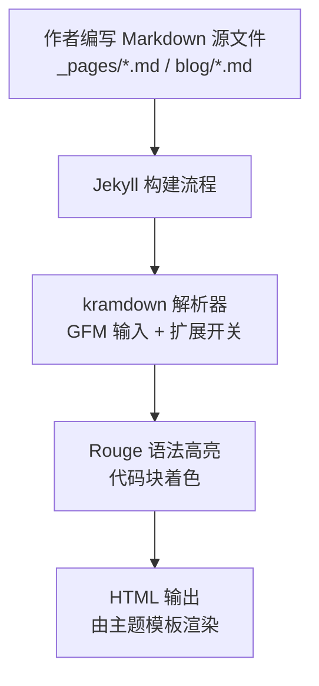
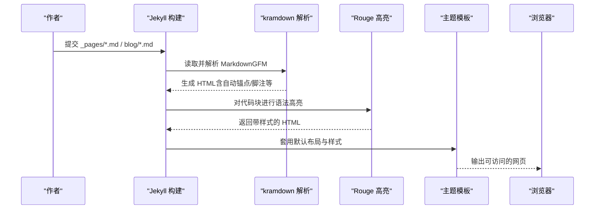

# Markdown 基础语法

<cite>
**本文引用的文件**   
- [_config.yml](file://_config.yml)
- [README.md](file://README.md)
- [docs/STYLE_EXAMPLES.md](file://docs/STYLE_EXAMPLES.md)
- [docs/BLOG_USAGE_GUIDE.md](file://docs/BLOG_USAGE_GUIDE.md)
- [_pages/about.md](file://_pages/about.md)
- [blog/2024-01-05-observability-stack.md](file://blog/2024-01-05-observability-stack.md)
- [blog/2024-01-15-kubernetes-cluster-management.md](file://blog/2024-01-15-kubernetes-cluster-management.md)
</cite>

## 目录
1. [简介](#简介)
2. [项目结构与渲染环境](#项目结构与渲染环境)
3. [核心组件与配置要点](#核心组件与配置要点)
4. [架构总览](#架构总览)
5. [详细语法指南](#详细语法指南)
6. [依赖关系分析](#依赖关系分析)
7. [性能与可读性建议](#性能与可读性建议)
8. [故障排查指南](#故障排查指南)
9. [结论](#结论)
10. [附录：常用示例路径索引](#附录常用示例路径索引)

## 简介
本文件面向在 Jekyll 静态站点中使用 kramdown 处理器的作者，系统梳理 Markdown 基础语法与本项目中的实际用法，包括标题层级、段落、列表、链接与图片、粗体斜体、代码块、表格等。同时结合站点配置与示例文档，说明 kramdown 的扩展能力（如脚注、定义列表、数学公式）在本仓库中的启用方式与使用建议。

## 项目结构与渲染环境
- 站点根目录包含页面内容（_pages）、博客文章（blog）、样式（_sass）、布局（_layouts）、数据（_data）以及配置文件（_config.yml）。
- 站点通过 Jekyll 构建，Markdown 处理器为 kramdown，并启用了 GFM 输入模式与若干 kramdown 选项。
- 站点支持 Rouge 语法高亮，便于在代码块中展示多种语言。

图表来源
- [_config.yml:100-119](file://_config.yml#L100-L119)
- [blog/2024-01-05-observability-stack.md:33-55](file://blog/2024-01-05-observability-stack.md#L33-L55)

章节来源
- [_config.yml:98-119](file://_config.yml#L98-L119)
- [README.md:49-57](file://README.md#L49-L57)

## 核心组件与配置要点
- Markdown 处理器与输入模式
  - 使用 kramdown 作为 Markdown 处理器，并设置 input: GFM，以兼容 GitHub Flavored Markdown 的行为。
- kramdown 关键选项
  - hard_wrap: false（不强制换行）
  - auto_ids: true（自动为标题生成锚点 ID）
  - footnote_nr: 1（脚注编号起始值）
  - toc_levels: 1..6（目录支持的标题层级范围）
  - smart_quotes: 启用智能引号
- 代码高亮
  - highlighter: rouge，用于代码块语法高亮。

章节来源
- [_config.yml:100-119](file://_config.yml#L100-L119)

## 架构总览
下图展示了从 Markdown 到最终页面的主要处理链路，以及各配置项的作用位置。

图表来源
- [_config.yml:100-119](file://_config.yml#L100-L119)
- [blog/2024-01-05-observability-stack.md:33-55](file://blog/2024-01-05-observability-stack.md#L33-L55)

## 详细语法指南

### 标题层级（#、##、###）
- 使用 # 到 ###### 表示 H1–H6 标题层级。
- 站点开启 auto_ids: true，可为标题自动生成锚点 ID，便于内部跳转。
- 建议在长文内为重要章节添加锚点，提升导航体验。

参考示例路径
- [docs/STYLE_EXAMPLES.md:362-378](file://docs/STYLE_EXAMPLES.md#L362-L378)
- [_pages/about.md:18-28](file://_pages/about.md#L18-L28)

章节来源
- [_config.yml:110-116](file://_config.yml#L110-L116)
- [docs/STYLE_EXAMPLES.md:362-378](file://docs/STYLE_EXAMPLES.md#L362-L378)

### 段落与换行
- 空行分隔段落；硬换行受 hard_wrap: false 控制，通常不需要额外换行符。
- 中文排版建议：合理使用段落间距，避免过多空行导致阅读节奏被打断。

章节来源
- [_config.yml:111-112](file://_config.yml#L111-L112)

### 列表（有序与无序）
- 无序列表使用 - 或 * 开头；有序列表使用数字加句点。
- 列表项内可嵌套子列表，注意缩进一致。
- 示例见站点 README 与样式示例文档。

参考示例路径
- [README.md:26-31](file://README.md#L26-L31)
- [docs/STYLE_EXAMPLES.md:1-10](file://docs/STYLE_EXAMPLES.md#L1-L10)

章节来源
- [README.md:26-31](file://README.md#L26-L31)
- [docs/STYLE_EXAMPLES.md:1-10](file://docs/STYLE_EXAMPLES.md#L1-L10)

### 链接与图片引用
- 链接：[文本](URL) 或 <URL>。
- 图片：。
- 站内资源建议使用相对路径，外部链接需确保可访问。
- 示例可见 README 与样式示例文档中的图片与链接用法。

参考示例路径
- [README.md:16-20](file://README.md#L16-L20)
- [docs/STYLE_EXAMPLES.md:320-340](file://docs/STYLE_EXAMPLES.md#L320-L340)

章节来源
- [README.md:16-20](file://README.md#L16-L20)
- [docs/STYLE_EXAMPLES.md:320-340](file://docs/STYLE_EXAMPLES.md#L320-L340)

### 粗体与斜体
- 粗体：**文本**；斜体：*文本*。
- 可在论文作者名、强调关键词时使用。

参考示例路径
- [_pages/about.md:93-96](file://_pages/about.md#L93-L96)

章节来源
- [_pages/about.md:93-96](file://_pages/about.md#L93-L96)

### 代码块与语法高亮
- 使用三反引号包裹代码块，并在首行指定语言以获得 Rouge 高亮。
- 常见语言：yaml、json、bash、go 等。
- 站点已启用 highlighter: rouge。

参考示例路径
- [blog/2024-01-05-observability-stack.md:33-55](file://blog/2024-01-05-observability-stack.md#L33-L55)
- [blog/2024-01-05-observability-stack.md:148-169](file://blog/2024-01-05-observability-stack.md#L148-L169)
- [blog/2024-01-05-observability-stack.md:174-211](file://blog/2024-01-05-observability-stack.md#L174-L211)
- [blog/2024-01-05-observability-stack.md:247-257](file://blog/2024-01-05-observability-stack.md#L247-L257)

章节来源
- [_config.yml:103](file://_config.yml#L103)
- [blog/2024-01-05-observability-stack.md:33-55](file://blog/2024-01-05-observability-stack.md#L33-L55)

### 表格
- 使用标准 Markdown 表格语法，列对齐可通过冒号控制。
- 站点示例中包含监控指标对比表等。

参考示例路径
- [blog/2024-01-15-kubernetes-cluster-management.md:220-227](file://blog/2024-01-15-kubernetes-cluster-management.md#L220-L227)

章节来源
- [blog/2024-01-15-kubernetes-cluster-management.md:220-227](file://blog/2024-01-15-kubernetes-cluster-management.md#L220-L227)

### 脚注（kramdown 扩展）
- kramdown 支持脚注，站点配置了 footnote_nr: 1，表示脚注编号从 1 开始。
- 使用方式：在正文插入脚注标记，并在文末提供对应注释。

参考示例路径
- [_config.yml:114](file://_config.yml#L114)

章节来源
- [_config.yml:114](file://_config.yml#L114)

### 定义列表（kramdown 扩展）
- kramdown 支持定义列表语法，适合术语解释与条目说明。
- 建议在技术文档中对关键概念进行统一解释，提高一致性。

章节来源
- [_config.yml:100-119](file://_config.yml#L100-L119)

### 数学公式（kramdown 扩展）
- kramdown 具备数学公式扩展能力，但本仓库未显式启用 MathJax/KaTeX 等渲染插件。
- 若需渲染 LaTeX 公式，可在主题或页面中引入相应脚本；当前仓库未包含相关配置。

章节来源
- [_config.yml:148-161](file://_config.yml#L148-L161)

### 中文排版技巧
- 合理使用标题层级与段落，避免大段无分段文本。
- 列表与表格配合使用，增强信息密度与可读性。
- 代码块标注语言，便于高亮与复制。
- 链接与图片描述清晰，alt 文本准确。

参考示例路径
- [docs/BLOG_USAGE_GUIDE.md:287-298](file://docs/BLOG_USAGE_GUIDE.md#L287-L298)
- [docs/STYLE_EXAMPLES.md:229-294](file://docs/STYLE_EXAMPLES.md#L229-L294)

章节来源
- [docs/BLOG_USAGE_GUIDE.md:287-298](file://docs/BLOG_USAGE_GUIDE.md#L287-L298)
- [docs/STYLE_EXAMPLES.md:229-294](file://docs/STYLE_EXAMPLES.md#L229-L294)

## 依赖关系分析
- 站点构建依赖 Jekyll 与 kramdown；代码高亮依赖 Rouge。
- 页面内容与样式分离：Markdown 负责结构，SCSS/CSS 负责呈现。
- 主题模板将生成的 HTML 与站点样式组合输出。

图表来源
- [_config.yml:100-119](file://_config.yml#L100-L119)
- [blog/2024-01-05-observability-stack.md:33-55](file://blog/2024-01-05-observability-stack.md#L33-L55)

章节来源
- [_config.yml:100-119](file://_config.yml#L100-L119)

## 性能与可读性建议
- 合理组织标题层级，利用 auto_ids 生成锚点，提升长文导航效率。
- 控制代码块长度，必要时拆分为多个小节。
- 表格不宜过宽，优先展示关键维度。
- 图片尺寸适中，alt 文本准确，利于 SEO 与无障碍访问。

## 故障排查指南
- 检查 _config.yml 中 markdown 与 kramdown 配置是否生效。
- 确认代码块语言标识正确，以便 Rouge 高亮。
- 若脚注未显示，核对 footnote_nr 与脚注标记是否正确。
- 本地调试可使用 Jekyll 服务命令，查看控制台错误提示。

章节来源
- [_config.yml:100-119](file://_config.yml#L100-L119)
- [README.md:59-66](file://README.md#L59-L66)

## 结论
本仓库基于 Jekyll + kramdown（GFM）+ Rouge 的高亮方案，提供了完善的 Markdown 写作与排版能力。通过合理的标题、列表、表格、代码块与链接图片使用，并结合 kramdown 的脚注与定义列表扩展，能够高效产出高质量的技术文档与博客内容。

## 附录：常用示例路径索引
- 标题与锚点示例：[docs/STYLE_EXAMPLES.md:362-378](file://docs/STYLE_EXAMPLES.md#L362-L378)
- 列表与徽章示例：[docs/STYLE_EXAMPLES.md:1-36](file://docs/STYLE_EXAMPLES.md#L1-L36)
- 代码块与高亮示例：[blog/2024-01-05-observability-stack.md:33-55](file://blog/2024-01-05-observability-stack.md#L33-L55)
- 表格示例：[blog/2024-01-15-kubernetes-cluster-management.md:220-227](file://blog/2024-01-15-kubernetes-cluster-management.md#L220-L227)
- 链接与图片示例：[README.md:16-20](file://README.md#L16-L20)
- 粗体与作者名示例：[_pages/about.md:93-96](file://_pages/about.md#L93-L96)