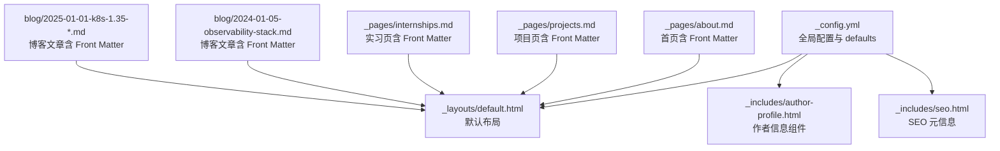
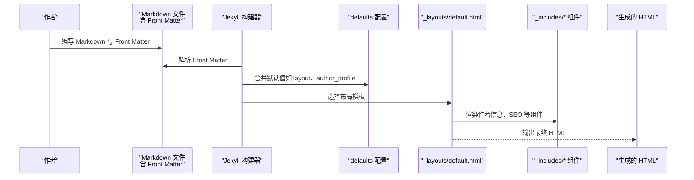
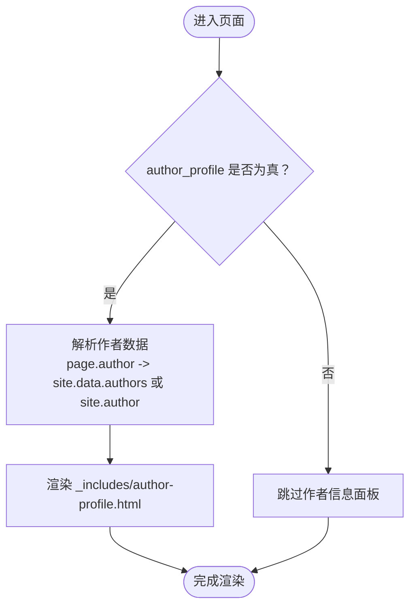
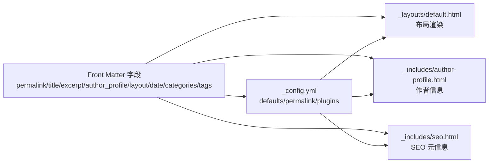

# YAML Front Matter 配置

<cite>
**本文引用的文件**   
- [_config.yml](file://_config.yml)
- [README.md](file://README.md)
- [docs/BLOG_USAGE_GUIDE.md](file://docs/BLOG_USAGE_GUIDE.md)
- [docs/README-zh.md](file://docs/README-zh.md)
- [_pages/about.md](file://_pages/about.md)
- [_pages/projects.md](file://_pages/projects.md)
- [_pages/internships.md](file://_pages/internships.md)
- [blog/2024-01-05-observability-stack.md](file://blog/2024-01-05-observability-stack.md)
- [blog/2025-01-01-k8s-1.35-cilium-kubevip-containerd-high-availability-cluster.md](file://blog/2025-01-01-k8s-1.35-cilium-kubevip-containerd-high-availability-cluster.md)
- [_includes/author-profile.html](file://_includes/author-profile.html)
- [_layouts/default.html](file://_layouts/default.html)
- [_includes/seo.html](file://_includes/seo.html)
</cite>

## 目录
1. [简介](#简介)
2. [项目结构](#项目结构)
3. [核心组件](#核心组件)
4. [架构总览](#架构总览)
5. [详细组件分析](#详细组件分析)
6. [依赖关系分析](#依赖关系分析)
7. [性能与构建特性](#性能与构建特性)
8. [故障排查指南](#故障排查指南)
9. [结论](#结论)
10. [附录：常用 Front Matter 字段速查](#附录常用-front-matter-字段速查)

## 简介
本文件面向使用 Jekyll 的站点作者，系统化梳理 YAML Front Matter（页面元数据）在本仓库中的使用方法与作用机制。重点覆盖以下字段：permalink、title、excerpt、author_profile、redirect_from，并补充 blog 文章常用的 date、categories、tags 等字段。文档同时说明各字段的数据类型、默认值来源、典型使用场景，提供完整示例路径，解释自定义字段的添加与在模板中的读取方式，以及 Front Matter 与 Jekyll 构建流程的集成点。

## 项目结构
本项目采用 Jekyll 标准目录组织，Front Matter 主要出现在两类文件中：
- 固定页面：位于 _pages/*.md
- 博客文章：位于 blog/*.md（按日期命名）

图表来源
- [_config.yml:120-129](file://_config.yml#L120-L129)
- [_layouts/default.html:1-34](file://_layouts/default.html#L1-L34)
- [_includes/author-profile.html:1-91](file://_includes/author-profile.html#L1-L91)
- [_includes/seo.html:1-37](file://_includes/seo.html#L1-L37)
- [_pages/about.md:1-9](file://_pages/about.md#L1-L9)
- [_pages/projects.md:1-7](file://_pages/projects.md#L1-L7)
- [_pages/internships.md:1-6](file://_pages/internships.md#L1-L6)
- [blog/2024-01-05-observability-stack.md:1-8](file://blog/2024-01-05-observability-stack.md#L1-L8)
- [blog/2025-01-01-k8s-1.35-cilium-kubevip-containerd-high-availability-cluster.md:1-8](file://blog/2025-01-01-k8s-1.35-cilium-kubevip-containerd-high-availability-cluster.md#L1-L8)

章节来源
- [docs/BLOG_USAGE_GUIDE.md:14-27](file://docs/BLOG_USAGE_GUIDE.md#L14-L27)

## 核心组件
本节聚焦 Front Matter 的核心字段及其在本仓库中的行为与默认值来源。

- permalink（永久链接）
  - 作用：定义页面的最终 URL 路径。
  - 数据类型：字符串（以 / 开头的相对路径）。
  - 默认值：若未设置，Jekyll 会根据文件位置与 permalink 全局规则生成；本仓库在全局中设置了通用 permalink 模式，但页面级可覆盖。
  - 使用场景：为静态页面或文章指定友好 URL。
  - 参考示例路径：
    - 首页：[permalink 设置:1-9](file://_pages/about.md#L1-L9)
    - 项目页：[permalink 设置:1-7](file://_pages/projects.md#L1-L7)
    - 实习页：[permalink 设置:1-6](file://_pages/internships.md#L1-L6)
    - 全局默认模式：[全局 permalink:144-145](file://_config.yml#L144-L145)

- title（页面标题）
  - 作用：页面标题，用于 SEO 与布局渲染。
  - 数据类型：字符串。
  - 默认值：若未设置，布局会尝试从内容或其他上下文推导；本仓库默认布局对 page.title 有处理逻辑。
  - 使用场景：所有页面与文章都应设置清晰的标题。
  - 参考示例路径：
    - 首页：[title 设置:1-9](file://_pages/about.md#L1-L9)
    - 项目页：[title 设置:1-7](file://_pages/projects.md#L1-L7)
    - 博客文章：[title 设置:1-8](file://blog/2024-01-05-observability-stack.md#L1-L8)

- excerpt（摘要）
  - 作用：页面或文章的简短描述，常用于 SEO 描述、列表预览。
  - 数据类型：字符串。
  - 默认值：若未显式设置，Jekyll 可能根据正文自动截取（受 excerpt_separator 影响）。
  - 使用场景：为页面或文章提供简洁描述，利于 SEO 与卡片展示。
  - 参考示例路径：
    - 首页：[excerpt 设置:1-9](file://_pages/about.md#L1-L9)
    - 项目页：[excerpt 设置:1-7](file://_pages/projects.md#L1-L7)
    - 博客文章：[excerpt 设置:1-8](file://blog/2024-01-05-observability-stack.md#L1-L8)

- author_profile（作者资料显示）
  - 作用：控制是否显示作者信息面板。
  - 数据类型：布尔值（true/false）。
  - 默认值：通过 defaults 为 pages 类型设置默认 true。
  - 使用场景：个人主页类页面通常开启，技术文章可按需关闭。
  - 参考示例路径：
    - 全局默认：[defaults 设置:120-129](file://_config.yml#L120-L129)
    - 首页：[author_profile 设置:1-9](file://_pages/about.md#L1-L9)
    - 项目页：[author_profile 设置:1-7](file://_pages/projects.md#L1-L7)
    - 实习页：[author_profile 设置:1-6](file://_pages/internships.md#L1-L6)
    - 博客文章：[author_profile 设置:1-8](file://blog/2024-01-05-observability-stack.md#L1-L8)

- redirect_from（重定向设置）
  - 作用：为页面定义多个旧 URL，使其跳转到当前页面。
  - 数据类型：字符串数组。
  - 默认值：无。
  - 使用场景：迁移旧链接、保留历史书签。
  - 参考示例路径：
    - 首页：[redirect_from 设置:1-9](file://_pages/about.md#L1-L9)

- layout（布局）
  - 作用：指定页面使用的布局模板。
  - 数据类型：字符串（布局文件名）。
  - 默认值：通过 defaults 为 pages 类型设置 default。
  - 使用场景：统一页面外观与行为。
  - 参考示例路径：
    - 全局默认：[defaults 设置:120-129](file://_config.yml#L120-L129)
    - 项目页：[layout 设置:1-7](file://_pages/projects.md#L1-L7)

- date（发布日期）
  - 作用：文章发布时间，影响排序与归档。
  - 数据类型：时间字符串（ISO 格式，支持时区偏移）。
  - 默认值：可从文件名解析（如 _posts 约定），本仓库 blog 目录下的文章也遵循类似命名。
  - 使用场景：博客文章必备。
  - 参考示例路径：
    - 博客文章：[date 设置:1-8](file://blog/2024-01-05-observability-stack.md#L1-L8)
    - 另一篇博客：[date 设置:1-8](file://blog/2025-01-01-k8s-1.35-cilium-kubevip-containerd-high-availability-cluster.md#L1-L8)

- categories（分类）与 tags（标签）
  - 作用：对文章进行归类与打标签，便于导航与聚合。
  - 数据类型：字符串数组。
  - 默认值：无。
  - 使用场景：博客文章推荐设置。
  - 参考示例路径：
    - 博客文章：[categories/tags 设置:1-8](file://blog/2024-01-05-observability-stack.md#L1-L8)
    - 另一篇博客：[categories/tags 设置:1-8](file://blog/2025-01-01-k8s-1.35-cilium-kubevip-containerd-high-availability-cluster.md#L1-L8)

章节来源
- [_config.yml:120-129](file://_config.yml#L120-L129)
- [_config.yml:144-145](file://_config.yml#L144-L145)
- [_pages/about.md:1-9](file://_pages/about.md#L1-L9)
- [_pages/projects.md:1-7](file://_pages/projects.md#L1-L7)
- [_pages/internships.md:1-6](file://_pages/internships.md#L1-L6)
- [blog/2024-01-05-observability-stack.md:1-8](file://blog/2024-01-05-observability-stack.md#L1-L8)
- [blog/2025-01-01-k8s-1.35-cilium-kubevip-containerd-high-availability-cluster.md:1-8](file://blog/2025-01-01-k8s-1.35-cilium-kubevip-containerd-high-availability-cluster.md#L1-L8)

## 架构总览
Front Matter 与 Jekyll 构建过程的集成关系如下：

图表来源
- [_config.yml:120-129](file://_config.yml#L120-L129)
- [_layouts/default.html:1-34](file://_layouts/default.html#L1-L34)
- [_includes/author-profile.html:1-91](file://_includes/author-profile.html#L1-L91)
- [_includes/seo.html:1-37](file://_includes/seo.html#L1-L37)

## 详细组件分析

### 页面元数据字段详解与示例
本节汇总常见字段的使用方法与示例路径，帮助快速上手。

- 固定页面（_pages/*.md）
  - 建议包含：permalink、title、excerpt、author_profile、layout（可由 defaults 提供）
  - 示例路径：
    - 首页：[Front Matter 片段:1-9](file://_pages/about.md#L1-L9)
    - 项目页：[Front Matter 片段:1-7](file://_pages/projects.md#L1-L7)
    - 实习页：[Front Matter 片段:1-6](file://_pages/internships.md#L1-L6)

- 博客文章（blog/*.md）
  - 建议包含：title、date、categories、tags、excerpt、author_profile
  - 示例路径：
    - 文章一：[Front Matter 片段:1-8](file://blog/2024-01-05-observability-stack.md#L1-L8)
    - 文章二：[Front Matter 片段:1-8](file://blog/2025-01-01-k8s-1.35-cilium-kubevip-containerd-high-availability-cluster.md#L1-L8)

- 全局默认与覆盖
  - 通过 defaults 为 pages 类型设置默认 layout 与 author_profile，页面可覆盖。
  - 示例路径：
    - 全局 defaults：[defaults 配置:120-129](file://_config.yml#L120-L129)

章节来源
- [_pages/about.md:1-9](file://_pages/about.md#L1-L9)
- [_pages/projects.md:1-7](file://_pages/projects.md#L1-L7)
- [_pages/internships.md:1-6](file://_pages/internships.md#L1-L6)
- [blog/2024-01-05-observability-stack.md:1-8](file://blog/2024-01-05-observability-stack.md#L1-L8)
- [blog/2025-01-01-k8s-1.35-cilium-kubevip-containerd-high-availability-cluster.md:1-8](file://blog/2025-01-01-k8s-1.35-cilium-kubevip-containerd-high-availability-cluster.md#L1-L8)
- [_config.yml:120-129](file://_config.yml#L120-L129)

### 自定义字段添加与模板使用技巧
- 添加自定义字段
  - 在任意 Markdown 文件的 Front Matter 中添加键值对即可，例如：custom_field: "value"。
  - 该字段将作为 page.custom_field 在模板中可用。
- 在模板中使用
  - 在布局或 include 中通过 Liquid 访问：{{ page.custom_field }}。
  - 建议在 include 中做空值判断，避免未设置时报错。
- 实践建议
  - 为自定义字段增加注释说明用途与取值范围。
  - 结合 defaults 为某类页面提供默认值，减少重复配置。

章节来源
- [docs/BLOG_USAGE_GUIDE.md:335-349](file://docs/BLOG_USAGE_GUIDE.md#L335-L349)

### 作者信息显示机制
- 控制开关
  - 通过 author_profile 控制是否显示作者信息面板。
  - 默认值为 true（由 defaults 为 pages 类型设置）。
- 数据来源
  - 优先使用 page.author（若存在）并从 site.data.authors 查找详细信息；否则回退到 site.author。
- 组件实现
  - 作者信息面板由 _includes/author-profile.html 渲染，读取 avatar、name、bio、location、email 等字段。
- 相关引用
  - 默认布局调用 include 组件。
  - SEO 组件也会使用 page.excerpt 与 site.description 作为描述。

图表来源
- [_config.yml:120-129](file://_config.yml#L120-L129)
- [_includes/author-profile.html:1-91](file://_includes/author-profile.html#L1-L91)
- [_layouts/default.html:1-34](file://_layouts/default.html#L1-L34)

章节来源
- [_includes/author-profile.html:1-91](file://_includes/author-profile.html#L1-L91)
- [_layouts/default.html:1-34](file://_layouts/default.html#L1-L34)
- [_config.yml:120-129](file://_config.yml#L120-L129)

### 重定向机制（redirect_from）
- 作用：为页面定义多个旧 URL，使访问旧地址时跳转到新地址。
- 插件支持：jekyll-redirect-from（已在 plugins 中启用）。
- 使用方式：在 Front Matter 中以数组形式列出旧路径。
- 示例路径：
  - 首页：[redirect_from 设置:1-9](file://_pages/about.md#L1-L9)

章节来源
- [_config.yml:148-154](file://_config.yml#L148-L154)
- [_pages/about.md:1-9](file://_pages/about.md#L1-L9)

### SEO 与摘要（excerpt）
- 摘要优先级：page.description → page.excerpt → site.description。
- 标题与 canonical URL：布局与 SEO include 共同决定。
- 示例路径：
  - SEO include：[meta 与 canonical 处理:1-37](file://_includes/seo.html#L1-L37)
  - 默认布局：[title 处理:20-22](file://_layouts/default.html#L20-L22)

章节来源
- [_includes/seo.html:1-37](file://_includes/seo.html#L1-L37)
- [_layouts/default.html:20-22](file://_layouts/default.html#L20-L22)

## 依赖关系分析
Front Matter 字段与模板、配置的依赖关系如下：

图表来源
- [_config.yml:120-129](file://_config.yml#L120-L129)
- [_config.yml:144-145](file://_config.yml#L144-L145)
- [_config.yml:148-154](file://_config.yml#L148-L154)
- [_layouts/default.html:1-34](file://_layouts/default.html#L1-L34)
- [_includes/author-profile.html:1-91](file://_includes/author-profile.html#L1-L91)
- [_includes/seo.html:1-37](file://_includes/seo.html#L1-L37)

章节来源
- [_config.yml:120-129](file://_config.yml#L120-L129)
- [_config.yml:144-145](file://_config.yml#L144-L145)
- [_config.yml:148-154](file://_config.yml#L148-L154)
- [_layouts/default.html:1-34](file://_layouts/default.html#L1-L34)
- [_includes/author-profile.html:1-91](file://_includes/author-profile.html#L1-L91)
- [_includes/seo.html:1-37](file://_includes/seo.html#L1-L37)

## 性能与构建特性
- 增量构建：incremental 设置为 false，适合本地开发稳定构建。
- 提取分隔符：excerpt_separator 为 "\n\n"，影响自动摘要生成。
- 压缩：compress_html 启用，生产环境可减少 HTML 体积。
- 插件：启用 jekyll-paginate、jekyll-sitemap、jekyll-gist、jekyll-feed、jekyll-redirect-from，提升功能与 SEO。

章节来源
- [_config.yml:101-106](file://_config.yml#L101-L106)
- [_config.yml:164-169](file://_config.yml#L164-L169)
- [_config.yml:148-154](file://_config.yml#L148-L154)

## 故障排查指南
- Front Matter 语法错误
  - 检查文件首部的 --- 分隔是否正确，键名与缩进是否符合 YAML 规范。
  - 参考常见问题解答：[FAQ 调试建议:383-419](file://docs/BLOG_USAGE_GUIDE.md#L383-L419)
- 页面 URL 不正确
  - 确认 permalink 是否被全局默认覆盖或未正确设置。
  - 参考修改方法：[URL 修改指引:383-393](file://docs/BLOG_USAGE_GUIDE.md#L383-L393)
- 作者信息不显示
  - 检查 author_profile 是否为 true，或 defaults 是否生效。
  - 参考默认设置：[defaults 配置:120-129](file://_config.yml#L120-L129)
- 重定向无效
  - 确认 jekyll-redirect-from 插件已启用，且 redirect_from 数组格式正确。
  - 参考插件启用：[plugins 配置:148-154](file://_config.yml#L148-L154)

章节来源
- [docs/BLOG_USAGE_GUIDE.md:383-419](file://docs/BLOG_USAGE_GUIDE.md#L383-L419)
- [_config.yml:120-129](file://_config.yml#L120-L129)
- [_config.yml:148-154](file://_config.yml#L148-L154)

## 结论
通过合理设置 Front Matter 字段并结合 defaults 与 include 组件，可以高效地管理页面元数据、SEO 信息与作者资料。本仓库提供了完整的示例与默认值策略，便于快速搭建与维护个人学术主页与技术博客。

## 附录：常用 Front Matter 字段速查
- 固定页面（_pages/*.md）
  - permalink：字符串，必需（建议）
  - title：字符串，必需（建议）
  - excerpt：字符串，可选（建议）
  - author_profile：布尔，默认 true（由 defaults）
  - layout：字符串，默认 default（由 defaults）
  - redirect_from：字符串数组，可选
- 博客文章（blog/*.md）
  - title：字符串，必需
  - date：时间字符串，必需（建议）
  - categories：字符串数组，可选
  - tags：字符串数组，可选
  - excerpt：字符串，可选
  - author_profile：布尔，默认 true（由 defaults）

章节来源
- [_config.yml:120-129](file://_config.yml#L120-L129)
- [_pages/about.md:1-9](file://_pages/about.md#L1-L9)
- [_pages/projects.md:1-7](file://_pages/projects.md#L1-L7)
- [_pages/internships.md:1-6](file://_pages/internships.md#L1-L6)
- [blog/2024-01-05-observability-stack.md:1-8](file://blog/2024-01-05-observability-stack.md#L1-L8)
- [blog/2025-01-01-k8s-1.35-cilium-kubevip-containerd-high-availability-cluster.md:1-8](file://blog/2025-01-01-k8s-1.35-cilium-kubevip-containerd-high-availability-cluster.md#L1-L8)