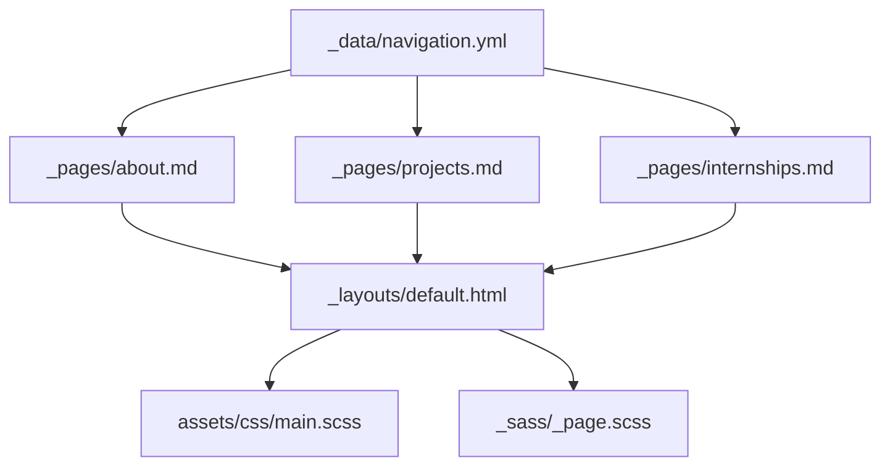
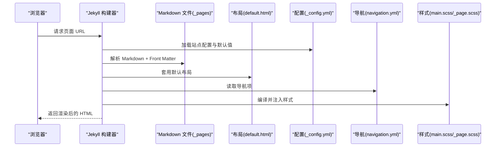
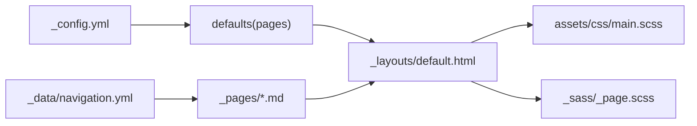

# 页面内容编辑

<cite>
**本文引用的文件**   
- [_config.yml](file://_config.yml)
- [default.html](file://_layouts/default.html)
- [about.md](file://_pages/about.md)
- [projects.md](file://_pages/projects.md)
- [internships.md](file://_pages/internships.md)
- [navigation.yml](file://_data/navigation.yml)
- [main.scss](file://assets/css/main.scss)
- [_page.scss](file://_sass/_page.scss)
- [STYLE_EXAMPLES.md](file://docs/STYLE_EXAMPLES.md)
- [BLOG_USAGE_GUIDE.md](file://docs/BLOG_USAGE_GUIDE.md)
- [2024-01-05-observability-stack.md](file://blog/2024-01-05-observability-stack.md)
</cite>

## 目录
1. [简介](#简介)
2. [项目结构](#项目结构)
3. [核心组件](#核心组件)
4. [架构总览](#架构总览)
5. [详细组件分析](#详细组件分析)
6. [依赖关系分析](#依赖关系分析)
7. [性能与可维护性建议](#性能与可维护性建议)
8. [故障排查指南](#故障排查指南)
9. [结论](#结论)
10. [附录：常用样式与示例](#附录常用样式与示例)

## 简介
本文件面向需要在站点中编写和编辑“页面内容”的读者，聚焦以下目标：
- 如何使用 Markdown 语法编写关于页面（about.md）、项目展示页面（projects.md）、实习经历页面（internships.md）的内容结构与格式。
- 详细说明 YAML front matter 的关键字段（如 permalink、title、excerpt、author_profile 等）的作用与用法。
- 介绍 HTML+Markdown 混合使用技巧（自定义 CSS 类、内联样式、图片引用等）。
- 提供创建新页面、修改现有页面、添加链接与图片资源的实操指引。

## 项目结构
与本主题相关的核心目录与文件如下：
- _pages：存放站点固定页面（about.md、projects.md、internships.md 等）
- _layouts：页面布局模板（default.html）
- _data：导航配置（navigation.yml）
- assets/css：主样式入口（main.scss），包含论文卡片、徽章、荣誉列表等样式
- _sass：基础页面样式（_page.scss）
- docs：样式示例与博客使用指南（STYLE_EXAMPLES.md、BLOG_USAGE_GUIDE.md）
- blog：示例文章（用于理解 Front Matter 与内容组织方式）

图表来源
- [about.md:1-10](file://_pages/about.md#L1-L10)
- [projects.md:1-7](file://_pages/projects.md#L1-L7)
- [internships.md:1-6](file://_pages/internships.md#L1-L6)
- [default.html:1-34](file://_layouts/default.html#L1-L34)
- [main.scss:40-170](file://assets/css/main.scss#L40-L170)
- [_page.scss:1-120](file://_sass/_page.scss#L1-L120)
- [navigation.yml:1-29](file://_data/navigation.yml#L1-L29)

章节来源
- [BLOG_USAGE_GUIDE.md:13-27](file://docs/BLOG_USAGE_GUIDE.md#L13-L27)

## 核心组件
- 页面文件（_pages/*.md）：每个页面以 Markdown 编写，并在顶部通过 YAML front matter 声明元数据（如 permalink、title、excerpt、author_profile 等）。
- 默认布局（_layouts/default.html）：所有页面的统一外壳，负责引入头部、侧边栏、正文区域与脚本。
- 全局配置（_config.yml）：定义站点级设置、默认值（defaults）、Markdown 引擎（kramdown/GFM）、插件等。
- 导航配置（_data/navigation.yml）：控制顶部导航菜单项与跳转锚点或路径。
- 样式系统（assets/css/main.scss 与 _sass/_page.scss）：提供论文卡片、徽章、荣誉列表、锚点偏移等样式能力。

章节来源
- [_config.yml:120-129](file://_config.yml#L120-L129)
- [_config.yml:100-119](file://_config.yml#L100-L119)
- [default.html:1-34](file://_layouts/default.html#L1-L34)
- [navigation.yml:1-29](file://_data/navigation.yml#L1-L29)
- [main.scss:40-170](file://assets/css/main.scss#L40-L170)
- [_page.scss:1-120](file://_sass/_page.scss#L1-L120)

## 架构总览
页面渲染流程概览：
- Jekyll 读取 _pages 下的 Markdown 文件
- 解析 YAML front matter 并应用 defaults 中的默认值
- 使用 _layouts/default.html 作为布局包裹内容
- 注入 assets/css/main.scss 与 _sass/_page.scss 提供的样式
- 根据 _data/navigation.yml 生成导航

图表来源
- [_config.yml:120-129](file://_config.yml#L120-L129)
- [default.html:1-34](file://_layouts/default.html#L1-L34)
- [navigation.yml:1-29](file://_data/navigation.yml#L1-L29)
- [main.scss:40-170](file://assets/css/main.scss#L40-L170)
- [_page.scss:1-120](file://_sass/_page.scss#L1-L120)

## 详细组件分析

### 关于页面（about.md）
- 用途：个人主页，聚合技能、成果、教育、工作经历、演讲、实习与技术博客推荐等内容。
- 关键特性：
  - 使用锚点实现页面内导航（例如 #about-me、#publications、#honors 等）。
  - 使用 paper-box 卡片展示技术文章或论文条目，支持 badge 标签与图片。
  - 使用 honors-list 展示成就与量化结果。
  - 使用标准 Markdown 列表、标题、链接、图片等。
- 建议结构：
  - 顶部锚点与简介
  - 核心技能与专业能力（分模块）
  - 出版物/技术文章（paper-box 卡片）
  - 荣誉与奖项（honors-list）
  - 教育与工作经历（时间线式列表）
  - 邀请演讲（Talks）
  - 实习经历（Internships）
  - 技术博客推荐（paper-box 卡片）

章节来源
- [about.md:1-10](file://_pages/about.md#L1-L10)
- [about.md:18-122](file://_pages/about.md#L18-L122)
- [about.md:123-145](file://_pages/about.md#L123-L145)
- [about.md:147-183](file://_pages/about.md#L147-L183)
- [about.md:185-250](file://_pages/about.md#L185-L250)

### 项目展示页面（projects.md）
- 用途：集中展示项目与研究工作的结构化信息。
- 建议结构：
  - 项目分类（Web 开发、研究项目等）
  - 每个项目的技术栈、特性、链接（演示/源码）
  - 技能矩阵（前端/后端/DevOps/数据科学等）
  - 联系方式
- 注意：
  - 可使用标准 Markdown 标题、加粗、列表、链接等。
  - 如需更丰富的卡片展示，可参考 about.md 中的 paper-box 模式进行扩展。

章节来源
- [projects.md:1-46](file://_pages/projects.md#L1-L46)

### 实习经历页面（internships.md）
- 用途：按时间顺序列出实习经历。
- 建议格式：
  - 每行一条记录，包含时间段、公司/机构名称（可链接）、地点。
  - 保持简洁清晰，便于快速浏览。

章节来源
- [internships.md:1-11](file://_pages/internships.md#L1-L11)

### YAML Front Matter 字段说明
- permalink：页面的最终 URL 路径。若未设置，将基于文件名生成。
- title：页面标题，影响浏览器标签与 SEO。
- excerpt：页面摘要，常用于列表页或社交分享。
- author_profile：是否显示作者信息（由站点配置 author 决定）。
- layout：指定使用的布局模板，通常为 default。
- redirect_from：旧地址重定向到新地址，利于 SEO 与外链兼容。
- date/categories/tags：主要用于博客文章（_posts），页面文档一般不需要。

在站点层面，_config.yml 的 defaults 为 pages 类型设置了默认布局与作者信息展示，因此页面文件可省略部分字段。

章节来源
- [_config.yml:120-129](file://_config.yml#L120-L129)
- [about.md:1-9](file://_pages/about.md#L1-L9)
- [projects.md:1-7](file://_pages/projects.md#L1-L7)
- [internships.md:1-6](file://_pages/internships.md#L1-L6)
- [BLOG_USAGE_GUIDE.md:41-50](file://docs/BLOG_USAGE_GUIDE.md#L41-L50)

### HTML+Markdown 混合使用技巧
- 自定义 CSS 类：
  - 使用 paper-box、paper-box-image、paper-box-text 组合展示图文卡片。
  - 使用 badge 系列类（badge-kubernetes、badge-devops 等）标注技术或状态。
  - 使用 honors-list 容器呈现带样式的成就列表。
  - 使用 alert-box、feature-grid、tech-stack、tutorial-steps、comparison-table、blog-meta 等增强可读性与交互感。
- 锚点与滚动定位：
  - 在章节标题后插入锚点元素，配合 _page.scss 的锚点偏移样式，点击导航可实现平滑定位。
- 图片引用：
  - 图片资源放在 images/ 目录下，使用相对路径引用。
  - 可在 img 标签中使用 style 属性控制尺寸与适配（如 max-width、object-fit）。
- 代码块与高亮：
  - 使用 fenced code blocks 并指定语言，启用 Rouge 高亮。
- 表格与列表：
  - 使用标准 Markdown 表格与列表，必要时结合 comparison-table 等样式类提升表现。

章节来源
- [main.scss:40-170](file://assets/css/main.scss#L40-L170)
- [_page.scss:88-96](file://_sass/_page.scss#L88-L96)
- [STYLE_EXAMPLES.md:1-401](file://docs/STYLE_EXAMPLES.md#L1-L401)
- [about.md:84-99](file://_pages/about.md#L84-L99)
- [about.md:123-145](file://_pages/about.md#L123-L145)

### 导航与页面关联
- 在 _data/navigation.yml 中添加或调整导航项，指向页面路径或页面内锚点。
- 对于首页（about.md），可通过 permalink: / 将其设置为站点根路径，并通过 redirect_from 兼容旧链接。

章节来源
- [navigation.yml:1-29](file://_data/navigation.yml#L1-L29)
- [about.md:1-9](file://_pages/about.md#L1-L9)

### 新增页面与修改现有页面的步骤
- 新增页面：
  1. 在 _pages 下创建新的 .md 文件。
  2. 在文件顶部添加 Front Matter（至少包含 permalink、title、excerpt、author_profile）。
  3. 编写 Markdown 内容，按需使用 HTML 类与样式。
  4. 在 navigation.yml 中添加导航项。
- 修改现有页面：
  1. 打开对应 .md 文件，更新内容或 Front Matter。
  2. 如需更换图片，确保图片位于 images/ 目录并更新引用路径。
  3. 如需调整导航，同步更新 navigation.yml。
- 添加链接与图片：
  - 内部链接使用相对路径（如 /blog/...）。
  - 外部链接使用完整 URL。
  - 图片路径形如 images/your-image.png，可为图片添加 alt 文本以提升可访问性。

章节来源
- [BLOG_USAGE_GUIDE.md:29-83](file://docs/BLOG_USAGE_GUIDE.md#L29-L83)
- [BLOG_USAGE_GUIDE.md:358-376](file://docs/BLOG_USAGE_GUIDE.md#L358-L376)
- [navigation.yml:1-29](file://_data/navigation.yml#L1-L29)

### 博客文章对比（Front Matter 与内容组织）
- 博客文章（_posts）通常包含 date、categories、tags 等字段，适合时间线展示。
- 页面文档（_pages）强调 permalink 与静态结构，适合固定页面。
- 两者均支持 Markdown 与 HTML 混合、代码高亮、图片与链接。

章节来源
- [2024-01-05-observability-stack.md:1-8](file://blog/2024-01-05-observability-stack.md#L1-L8)
- [BLOG_USAGE_GUIDE.md:85-118](file://docs/BLOG_USAGE_GUIDE.md#L85-L118)

## 依赖关系分析
- 页面文件依赖：
  - 布局模板（default.html）
  - 样式（main.scss、_page.scss）
  - 导航（navigation.yml）
- 配置依赖：
  - _config.yml 的 defaults 为 pages 提供默认布局与作者信息展示。
  - kramdown 与 GFM 启用，Rouge 用于代码高亮。
- 外部资源：
  - 图片资源位于 images/ 目录。
  - 可选 CDN 引用（如 Google Scholar 统计）由页面逻辑动态拼接。

图表来源
- [_config.yml:120-129](file://_config.yml#L120-L129)
- [default.html:1-34](file://_layouts/default.html#L1-L34)
- [main.scss:40-170](file://assets/css/main.scss#L40-L170)
- [_page.scss:1-120](file://_sass/_page.scss#L1-L120)
- [navigation.yml:1-29](file://_data/navigation.yml#L1-L29)

章节来源
- [_config.yml:100-119](file://_config.yml#L100-L119)
- [_config.yml:148-161](file://_config.yml#L148-L161)

## 性能与可维护性建议
- 图片优化：压缩图片体积，合理设置尺寸与 object-fit，避免大图阻塞首屏。
- 样式复用：优先使用已有 CSS 类（paper-box、badge、honors-list 等），减少重复样式。
- 内容模块化：将长页面拆分为多个小节并使用锚点导航，提升阅读体验。
- 导航一致性：每次新增页面后，及时更新 navigation.yml，保证入口可见。
- 版本控制：提交前检查 Front Matter 语法与 Markdown 语法，避免构建失败。

[本节为通用建议，不直接分析具体文件]

## 故障排查指南
- 页面无法访问或 URL 不正确：
  - 检查 Front Matter 中的 permalink 是否正确。
  - 确认 navigation.yml 中的 url 与 permalink 一致。
- 作者信息未显示：
  - 检查页面 Front Matter 的 author_profile 是否为 true。
  - 确认 _config.yml 的 defaults 对 pages 已设置 author_profile: true。
- 锚点跳转位置异常：
  - 确认章节后插入了锚点元素，且 _page.scss 的锚点偏移生效。
- 图片不显示：
  - 检查图片路径是否在 images/ 目录，引用路径是否正确。
- 代码高亮不生效：
  - 确认 fenced code blocks 指定了语言，且 _config.yml 启用了 rouge 高亮。

章节来源
- [_config.yml:120-129](file://_config.yml#L120-L129)
- [_page.scss:88-96](file://_sass/_page.scss#L88-L96)
- [about.md:1-9](file://_pages/about.md#L1-L9)

## 结论
通过合理的 Front Matter 配置、清晰的页面结构、以及充分利用内置样式与锚点机制，可以在 _pages 下高效地维护关于、项目与实习经历等页面。结合导航配置与图片/链接管理，能够形成稳定、易读、可扩展的个人站点内容体系。

[本节为总结性内容，不直接分析具体文件]

## 附录：常用样式与示例
- 论文/文章卡片（paper-box）：适用于技术文章、论文展示，支持 badge 与图片。
- 荣誉列表（honors-list）：用于展示成就与量化指标。
- 警告框（alert-box）：用于提示、警告、错误、成功等信息。
- 功能网格（feature-grid）：用于并列展示特性或产品亮点。
- 技术栈标签（tech-stack）：用于展示技术集合。
- 教程步骤（tutorial-steps）：用于分步教程。
- 对比表格（comparison-table）：用于方案对比。
- 博客元数据（blog-meta）：用于显示发布信息。
- 锚点（anchor）：用于页面内导航。

章节来源
- [STYLE_EXAMPLES.md:1-401](file://docs/STYLE_EXAMPLES.md#L1-L401)
- [main.scss:40-170](file://assets/css/main.scss#L40-L170)
- [_page.scss:88-96](file://_sass/_page.scss#L88-L96)