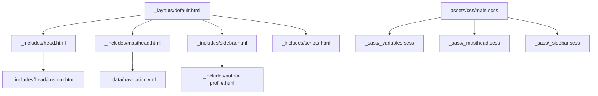
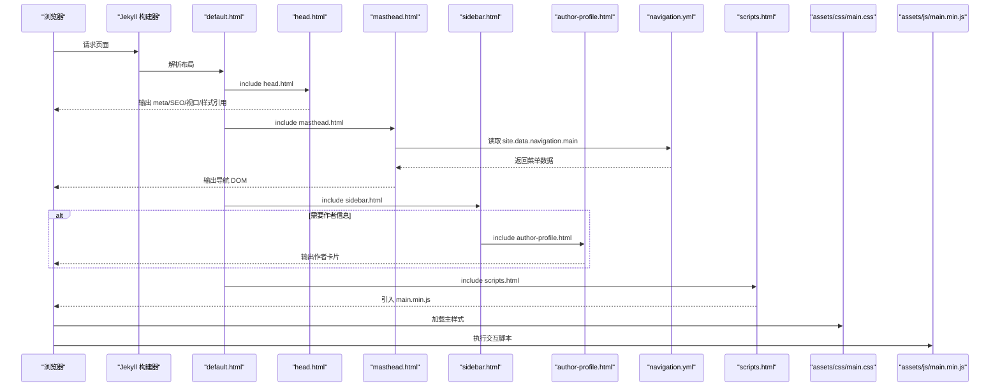
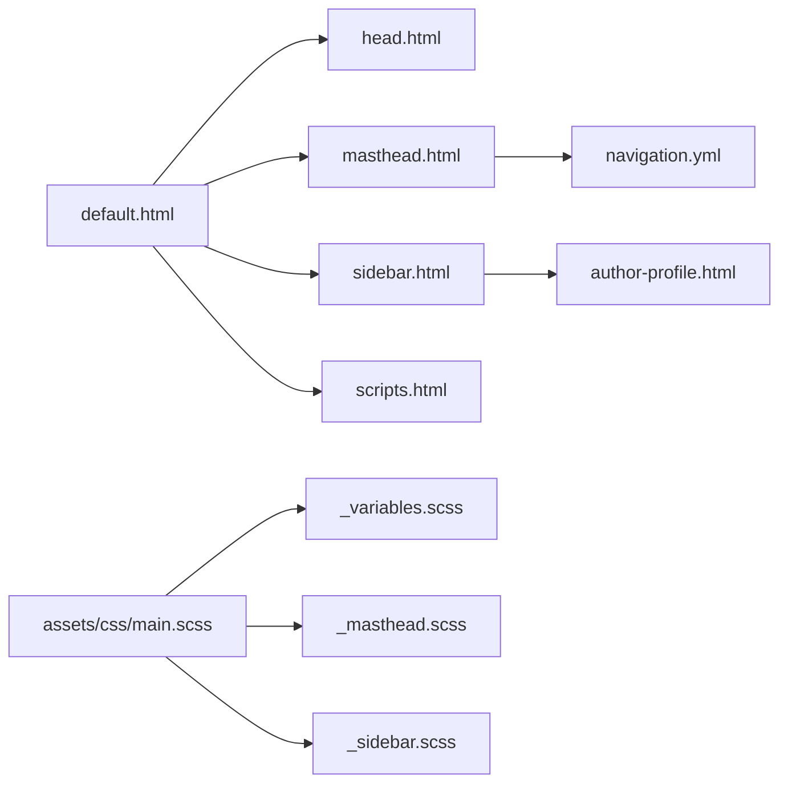

# 页面模板结构

<cite>
**本文引用的文件**   
- [default.html](file://_layouts/default.html)
- [masthead.html](file://_includes/masthead.html)
- [sidebar.html](file://_includes/sidebar.html)
- [scripts.html](file://_includes/scripts.html)
- [head.html](file://_includes/head.html)
- [author-profile.html](file://_includes/author-profile.html)
- [navigation.yml](file://_data/navigation.yml)
- [custom.html](file://_includes/head/custom.html)
- [_variables.scss](file://_sass/_variables.scss)
- [_masthead.scss](file://_sass/_masthead.scss)
- [_sidebar.scss](file://_sass/_sidebar.scss)
- [main.scss](file://assets/css/main.scss)
- [about.md](file://_pages/about.md)
- [_config.yml](file://_config.yml)
</cite>

## 目录
1. [简介](#简介)
2. [项目结构](#项目结构)
3. [核心组件](#核心组件)
4. [架构总览](#架构总览)
5. [详细组件分析](#详细组件分析)
6. [依赖关系分析](#依赖关系分析)
7. [性能与可维护性](#性能与可维护性)
8. [故障排查指南](#故障排查指南)
9. [结论](#结论)
10. [附录：自定义模板最佳实践](#附录自定义模板最佳实践)

## 简介
本文件面向希望理解并定制该 Jekyll 站点页面模板结构的读者，重点说明基础布局 default.html 的组织方式、头部 masthead.html、侧边栏 sidebar.html、脚本加载 scripts.html 等可复用组件的职责与扩展点；解释如何通过 include 指令在页面中组合模块；阐述响应式设计与移动端适配机制；并提供创建自定义页面模板的步骤与最佳实践。

## 项目结构
该站点的页面模板采用“布局 + 片段”的模块化组织方式：
- _layouts/default.html：全局基础布局，负责 HTML 骨架、头部引入、主体区域与脚本加载。
- _includes/*：可复用的页面片段（如 head、masthead、sidebar、scripts、author-profile 等）。
- _data/navigation.yml：导航菜单数据源，供 masthead 渲染主导航。
- assets/css/main.scss：样式入口，聚合各 SCSS 模块，定义主题变量与响应式断点。
- _sass/*：按功能拆分的样式模块（如 masthead、sidebar、variables 等）。
- _pages/*.md：内容页，默认使用 layout: default 并通过 front matter 控制行为（如 author_profile、sidebar 等）。

图表来源
- [default.html:1-34](file://_layouts/default.html#L1-L34)
- [head.html:1-16](file://_includes/head.html#L1-L16)
- [masthead.html:1-16](file://_includes/masthead.html#L1-L16)
- [sidebar.html:1-14](file://_includes/sidebar.html#L1-L14)
- [scripts.html:1-1](file://_includes/scripts.html#L1-L1)
- [author-profile.html:1-91](file://_includes/author-profile.html#L1-L91)
- [navigation.yml:1-29](file://_data/navigation.yml#L1-L29)
- [custom.html:1-24](file://_includes/head/custom.html#L1-L24)
- [main.scss:1-38](file://assets/css/main.scss#L1-L38)
- [_variables.scss:108-121](file://_sass/_variables.scss#L108-L121)
- [_masthead.scss:1-65](file://_sass/_masthead.scss#L1-L65)
- [_sidebar.scss:1-200](file://_sass/_sidebar.scss#L1-L200)

章节来源
- [default.html:1-34](file://_layouts/default.html#L1-L34)
- [main.scss:1-38](file://assets/css/main.scss#L1-L38)

## 核心组件
- 基础布局 default.html
  - 作用：提供完整的 HTML 文档结构，统一注入 head、masthead、sidebar、正文 content 与 scripts。
  - 关键点：通过 include 指令组合 head.html、masthead.html、sidebar.html、scripts.html；在 <body> 内渲染 {{ content }} 作为页面主体。
- 头部 head.html
  - 作用：设置字符集、SEO、视口、JS 能力检测、主样式表等。
  - 扩展点：支持 include head/custom.html 以追加 favicon、第三方库或 MathJax 配置。
- 头部区域 masthead.html
  - 作用：渲染顶部导航，包含首页链接与来自 site.data.navigation.main 的动态菜单项。
  - 交互：结合 JS 插件实现移动端折叠菜单。
- 侧边栏 sidebar.html
  - 作用：根据 front matter 条件渲染作者信息卡片与自定义侧边栏内容。
  - 条件：page.author_profile / layout.author_profile 决定是否显示作者信息；page.sidebar 数组决定侧边栏条目。
- 脚本加载 scripts.html
  - 作用：引入站点主脚本 main.min.js，承载导航、滚动、弹窗等交互逻辑。
- 作者信息 author-profile.html
  - 作用：展示头像、姓名、简介、社交链接等，数据来源为 page.author 或 site.author。

章节来源
- [default.html:1-34](file://_layouts/default.html#L1-L34)
- [head.html:1-16](file://_includes/head.html#L1-L16)
- [masthead.html:1-16](file://_includes/masthead.html#L1-L16)
- [sidebar.html:1-14](file://_includes/sidebar.html#L1-L14)
- [scripts.html:1-1](file://_includes/scripts.html#L1-L1)
- [author-profile.html:1-91](file://_includes/author-profile.html#L1-L91)

## 架构总览
下图展示了页面从请求到渲染的关键路径，包括布局继承、include 组合、数据驱动与样式/脚本加载顺序。

图表来源
- [default.html:1-34](file://_layouts/default.html#L1-L34)
- [head.html:1-16](file://_includes/head.html#L1-L16)
- [masthead.html:1-16](file://_includes/masthead.html#L1-L16)
- [sidebar.html:1-14](file://_includes/sidebar.html#L1-L14)
- [author-profile.html:1-91](file://_includes/author-profile.html#L1-L91)
- [navigation.yml:1-29](file://_data/navigation.yml#L1-L29)
- [scripts.html:1-1](file://_includes/scripts.html#L1-L1)

## 详细组件分析

### 基础布局 default.html
- 职责
  - 定义 HTML 根节点与语言属性。
  - 注入 head 与 head/custom 扩展。
  - 渲染 masthead 与 sidebar。
  - 将页面内容 {{ content }} 放入 article.page 结构中。
  - 在页面底部引入 scripts。
- 关键流程
  - 先渲染 head 相关资源，再渲染可视区域，最后加载脚本，确保样式优先、交互后置。
- 可扩展点
  - 在 head/custom.html 追加 favicon、第三方库、MathJax 等。
  - 在 body 中按需插入新的 include 片段（例如公告条、横幅等）。

章节来源
- [default.html:1-34](file://_layouts/default.html#L1-L34)
- [custom.html:1-24](file://_includes/head/custom.html#L1-L24)

### 头部区域 masthead.html
- 结构与数据
  - 使用 site.data.navigation.main 动态生成菜单项。
  - 包含一个汉堡按钮用于移动端展开隐藏菜单。
- 交互与样式
  - 配合 JS 插件实现“greedy-nav”效果（在小屏下自动折叠多余菜单项）。
  - 样式上采用 sticky 定位，保证滚动时固定在顶部。
- 定制方法
  - 修改 navigation.yml 的 main 列表即可调整导航项。
  - 如需新增一级菜单或二级菜单，可在 include 处扩展循环逻辑。

章节来源
- [masthead.html:1-16](file://_includes/masthead.html#L1-L16)
- [navigation.yml:1-29](file://_data/navigation.yml#L1-L29)
- [_masthead.scss:1-65](file://_sass/_masthead.scss#L1-L65)

### 侧边栏 sidebar.html
- 条件渲染
  - 当 page.author_profile 或 layout.author_profile 为真时，渲染作者信息卡片。
  - 当 page.sidebar 存在时，遍历数组渲染图片、标题与文本。
- 数据结构
  - page.sidebar 是一个对象数组，每个对象可包含 image、image_alt、title、text 字段。
- 定制方法
  - 在页面的 front matter 中设置 author_profile: true 启用作者信息。
  - 在 front matter 中设置 sidebar 数组，逐项添加图片、标题与 Markdown 文本。

章节来源
- [sidebar.html:1-14](file://_includes/sidebar.html#L1-L14)
- [author-profile.html:1-91](file://_includes/author-profile.html#L1-L91)

### 脚本加载 scripts.html
- 职责
  - 引入 assets/js/main.min.js，承载导航、滚动、弹窗等交互逻辑。
- 建议
  - 若需新增脚本，建议在 main.min.js 中合并或通过 build 流程打包，避免过多分散 script 标签影响性能。

章节来源
- [scripts.html:1-1](file://_includes/scripts.html#L1-L1)

### 头部元信息与扩展 head.html / custom.html
- head.html
  - 设置字符集、SEO、视口、JS 能力检测、主样式表。
- head/custom.html
  - 用于追加 favicon、manifest、第三方样式与脚本（如 MathJax）。
- 定制方法
  - 在 custom.html 中添加需要的 link/script/meta 标签，无需改动 head.html。

章节来源
- [head.html:1-16](file://_includes/head.html#L1-L16)
- [custom.html:1-24](file://_includes/head/custom.html#L1-L24)

### 作者信息 author-profile.html
- 数据来源
  - 优先使用 page.author 对应的 site.data.authors 条目，否则回退到 site.author。
- 展示内容
  - 头像、姓名、简介、位置、雇主、邮箱、各类社交与学术平台链接。
- 定制方法
  - 在 _config.yml 的 author 或 site.data.authors 中补充字段，即可在侧边栏自动展示。

章节来源
- [author-profile.html:1-91](file://_includes/author-profile.html#L1-L91)
- [_config.yml:23-59](file://_config.yml#L23-L59)

### 示例页面 about.md 的使用
- 通过 front matter 指定 layout: default（由 defaults 全局设置）与 author_profile: true。
- 页面内容可直接使用 Markdown 与 HTML 混合编写，侧边栏可通过 page.sidebar 配置。

章节来源
- [about.md:1-250](file://_pages/about.md#L1-L250)
- [_config.yml:121-129](file://_config.yml#L121-L129)

## 依赖关系分析
- 布局与片段
  - default.html 依赖 head.html、masthead.html、sidebar.html、scripts.html。
  - sidebar.html 可选依赖 author-profile.html。
  - masthead.html 依赖 _data/navigation.yml。
- 样式与脚本
  - assets/css/main.scss 聚合 _sass 下的多个模块，包括 variables、masthead、sidebar 等。
  - 响应式断点由 _variables.scss 中的 $small/$medium/$large/$x-large 等变量控制。
- 运行时依赖
  - 导航折叠与滚动等行为由 assets/js/main.min.js 提供。

图表来源
- [default.html:1-34](file://_layouts/default.html#L1-L34)
- [head.html:1-16](file://_includes/head.html#L1-L16)
- [masthead.html:1-16](file://_includes/masthead.html#L1-L16)
- [sidebar.html:1-14](file://_includes/sidebar.html#L1-L14)
- [author-profile.html:1-91](file://_includes/author-profile.html#L1-L91)
- [navigation.yml:1-29](file://_data/navigation.yml#L1-L29)
- [main.scss:1-38](file://assets/css/main.scss#L1-L38)
- [_variables.scss:108-121](file://_sass/_variables.scss#L108-L121)
- [_masthead.scss:1-65](file://_sass/_masthead.scss#L1-L65)
- [_sidebar.scss:1-200](file://_sass/_sidebar.scss#L1-L200)

## 性能与可维护性
- 资源加载顺序
  - 样式先行、脚本后置，减少阻塞渲染的风险。
- 压缩与缓存
  - 主样式与脚本已提供压缩版本（main.css、main.min.js），有利于减小体积与提升加载速度。
- 模块化样式
  - 通过 SCSS 拆分与变量集中管理，便于主题化与响应式调整。
- 可维护性建议
  - 将通用 UI 片段抽取为 include，避免重复代码。
  - 使用 data 文件管理静态文案与导航，降低模板复杂度。

[本节为通用指导，不直接分析具体文件]

## 故障排查指南
- 导航未显示或菜单项缺失
  - 检查 _data/navigation.yml 的 main 列表是否完整且格式正确。
  - 确认 masthead.html 是否正确读取 site.data.navigation.main。
- 侧边栏未显示
  - 检查页面 front matter 是否设置 author_profile: true 或 sidebar 数组。
  - 确认 sidebar.html 的条件判断与 author-profile.html 的数据源是否存在。
- 移动端菜单无法折叠
  - 确认 assets/js/main.min.js 是否成功加载。
  - 检查浏览器控制台是否有 JS 报错。
- 样式错乱或断点异常
  - 核对 _variables.scss 中的断点变量是否与预期一致。
  - 确认 assets/css/main.scss 是否正确引入对应模块。

章节来源
- [masthead.html:1-16](file://_includes/masthead.html#L1-L16)
- [navigation.yml:1-29](file://_data/navigation.yml#L1-L29)
- [sidebar.html:1-14](file://_includes/sidebar.html#L1-L14)
- [author-profile.html:1-91](file://_includes/author-profile.html#L1-L91)
- [_variables.scss:108-121](file://_sass/_variables.scss#L108-L121)
- [main.scss:1-38](file://assets/css/main.scss#L1-L38)

## 结论
该站点的页面模板采用清晰的“布局 + 片段”模式，default.html 作为基础布局统一了页面结构，masthead、sidebar、scripts 等 include 组件实现了高内聚低耦合的可复用设计。通过 data 文件与 front matter 的组合，既保证了内容的灵活性，又提升了模板的可维护性。响应式体系基于 SCSS 变量与断点 mixin，易于扩展与主题化。

[本节为总结性内容，不直接分析具体文件]

## 附录：自定义模板最佳实践

- 创建自定义页面模板
  - 在 _layouts 目录下新建模板文件（例如 my-page.html），并在 front matter 中指定 layout: my-page。
  - 参考 default.html 的结构，按需 include head、masthead、sidebar、scripts。
  - 在模板中放置 {{ content }} 以渲染页面正文。
- 使用 include 组合模块
  - 在任意布局或页面中使用  插入片段。
  - 将复杂 UI 拆分为独立 include，提高复用性与可读性。
- 定制头部与第三方资源
  - 在 _includes/head/custom.html 中追加 favicon、manifest、第三方样式与脚本。
- 配置侧边栏与作者信息
  - 在页面 front matter 中设置 author_profile: true 与 sidebar 数组。
  - 在 _config.yml 或 site.data.authors 中完善作者资料。
- 调整响应式与主题色
  - 修改 _sass/_variables.scss 中的断点与颜色变量。
  - 在 assets/css/main.scss 中追加或覆盖样式类。
- 优化性能
  - 合并与压缩 JS/CSS，减少请求数量。
  - 按需加载第三方库，避免不必要的资源占用。

章节来源
- [default.html:1-34](file://_layouts/default.html#L1-L34)
- [custom.html:1-24](file://_includes/head/custom.html#L1-L24)
- [sidebar.html:1-14](file://_includes/sidebar.html#L1-L14)
- [_variables.scss:108-121](file://_sass/_variables.scss#L108-L121)
- [main.scss:1-38](file://assets/css/main.scss#L1-L38)