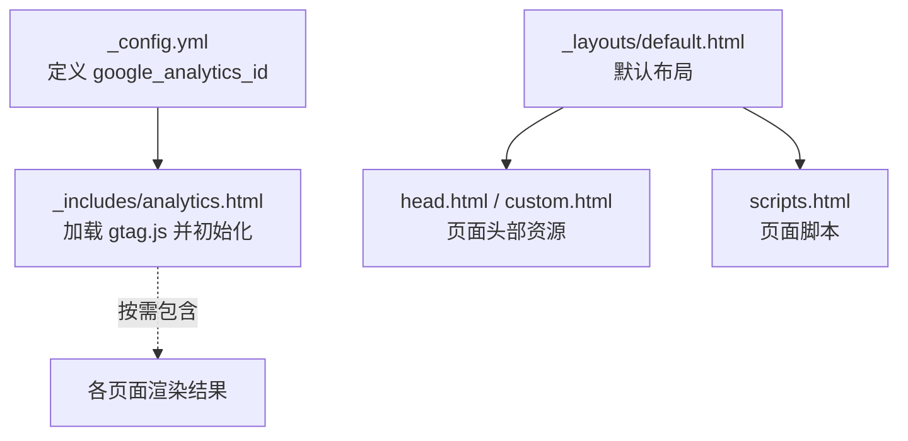
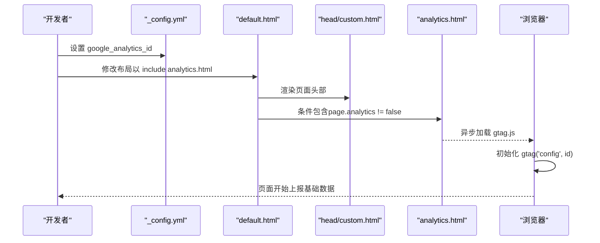
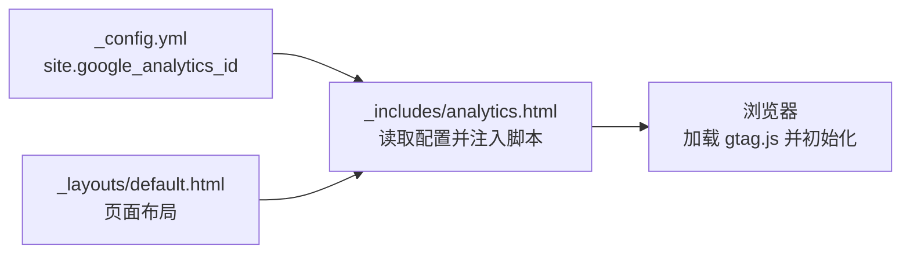
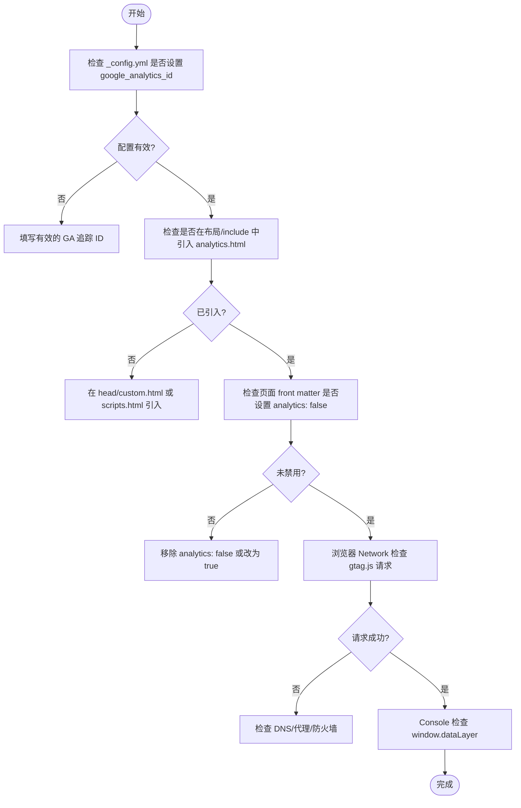

# Google Analytics 集成

<cite>
**本文引用的文件**
- [_config.yml](file://_config.yml)
- [_includes/analytics.html](file://_includes/analytics.html)
- [_layouts/default.html](file://_layouts/default.html)
- [README.md](file://README.md)
- [docs/README-zh.md](file://docs/README-zh.md)
</cite>

## 目录
1. [简介](#简介)
2. [项目结构](#项目结构)
3. [核心组件](#核心组件)
4. [架构总览](#架构总览)
5. [详细组件分析](#详细组件分析)
6. [依赖关系分析](#依赖关系分析)
7. [性能与隐私考虑](#性能与隐私考虑)
8. [故障排查指南](#故障排查指南)
9. [结论](#结论)
10. [附录：配置与示例](#附录配置与示例)

## 简介
本文件面向在 Jekyll 站点中集成 Google Analytics（gtag.js）的读者，结合仓库现有实现，说明如何在站点级配置追踪 ID、如何通过页面级选项控制特定页面的分析功能，并提供事件追踪、页面浏览统计等数据收集实践建议。同时包含隐私合规与调试方法，帮助你在满足合规要求的前提下完成分析与排障。

## 项目结构
本项目为基于 Jekyll 的个人站点，Google Analytics 相关代码集中在以下位置：
- 站点级配置：_config.yml 中的 google_analytics_id
- gtag.js 注入模板：_includes/analytics.html
- 布局入口：_layouts/default.html（负责引入 head 与 scripts）

图表来源
- [_config.yml:14-16](file://_config.yml#L14-L16)
- [_includes/analytics.html:1-13](file://_includes/analytics.html#L1-L13)
- [_layouts/default.html:1-34](file://_layouts/default.html#L1-L34)

章节来源
- [_config.yml:14-16](file://_config.yml#L14-L16)
- [_includes/analytics.html:1-13](file://_includes/analytics.html#L1-L13)
- [_layouts/default.html:1-34](file://_layouts/default.html#L1-L34)

## 核心组件
- 站点级配置项 google_analytics_id
  - 作用：集中管理 Google Analytics 追踪 ID，供 gtag.js 初始化使用。
  - 位置：_config.yml 的“google analytics”区域。
- gtag.js 注入模板 analytics.html
  - 作用：根据页面级 analytics 开关决定是否注入 gtag.js；若启用，则加载远程脚本并执行基本初始化。
  - 关键逻辑：通过 page.analytics 判断是否禁用；当未显式设为 false 时，默认启用。
- 默认布局 default.html
  - 作用：组织页面头尾资源，当前版本未直接 include analytics.html，但提供了扩展点（如可在 head/custom.html 或 scripts.html 中引入）。

章节来源
- [_config.yml:14-16](file://_config.yml#L14-L16)
- [_includes/analytics.html:1-13](file://_includes/analytics.html#L1-L13)
- [_layouts/default.html:1-34](file://_layouts/default.html#L1-L34)

## 架构总览
下图展示了从配置到页面渲染的关键路径：站点配置提供追踪 ID，模板在页面渲染时注入 gtag.js，浏览器端完成初始化并开始采集基础数据。

图表来源
- [_config.yml:14-16](file://_config.yml#L14-L16)
- [_includes/analytics.html:1-13](file://_includes/analytics.html#L1-L13)
- [_layouts/default.html:1-34](file://_layouts/default.html#L1-L34)

## 详细组件分析

### 组件一：站点级配置 _config.yml
- 字段：google_analytics_id
- 用途：作为全局变量 site.google_analytics_id 被模板读取，用于 gtag.js 初始化。
- 文档指引：README 与中文 README 均提示该字段为可选配置项。

章节来源
- [_config.yml:14-16](file://_config.yml#L14-L16)
- [README.md:41-48](file://README.md#L41-L48)
- [docs/README-zh.md:43-51](file://docs/README-zh.md#L43-L51)

### 组件二：gtag.js 注入模板 _includes/analytics.html
- 条件开关：
  - 含义：只要未在页面 YAML front matter 中将 analytics 设置为 false，即默认启用。
- 脚本加载：异步加载 googletagmanager.com/gtag/js?id=...
- 初始化：创建 dataLayer 与 gtag 函数，调用 gtag('config', id) 完成站点初始化。
- 可观测性：可通过浏览器控制台查看 window.dataLayer 内容，验证初始化是否成功。

章节来源
- [_includes/analytics.html:1-13](file://_includes/analytics.html#L1-L13)

### 组件三：默认布局 _layouts/default.html
- 职责：组织 <head> 与 <body> 结构，引入 head.html、head/custom.html 与 scripts.html。
- 现状：未直接 include analytics.html，需由使用者在合适位置引入（例如 head/custom.html 或 scripts.html），以实现全站启用。

章节来源
- [_layouts/default.html:1-34](file://_layouts/default.html#L1-L34)

## 依赖关系分析
- 配置依赖：analytics.html 依赖 site.google_analytics_id，该值来自 _config.yml。
- 布局依赖：default.html 负责组合页面资源，是引入 analytics.html 的合理位置之一。
- 运行时依赖：gtag.js 需要网络访问 googletagmanager.com，且需在浏览器环境中执行。

图表来源
- [_config.yml:14-16](file://_config.yml#L14-L16)
- [_includes/analytics.html:1-13](file://_includes/analytics.html#L1-L13)
- [_layouts/default.html:1-34](file://_layouts/default.html#L1-L34)

## 性能与隐私考虑
- 性能
  - 使用 async 加载 gtag.js，避免阻塞首屏渲染。
  - 仅在需要的页面启用分析，减少不必要的脚本开销。
- 隐私与合规
  - 建议在用户同意前不加载 gtag.js，或在初始化前设置 consent 参数以满足 GDPR 等法规要求。
  - 对敏感页面（如登录、支付）可通过 page.analytics=false 关闭分析，避免采集。
  - 如需限制 IP 采集或匿名化 IP，请在 gtag 初始化后追加相应配置（参考官方文档）。

[本节为通用指导，无需源码引用]

## 故障排查指南
- 确认已设置 google_analytics_id
  - 检查 _config.yml 中对应字段是否为空。
- 确认 analytics.html 已被包含
  - 在默认布局或 head/custom.html 中引入 。
- 确认页面未禁用分析
  - 若页面 front matter 设置了 analytics: false，将不会注入 gtag.js。
- 浏览器侧验证
  - 打开开发者工具，查看 Network 面板是否有 googletagmanager.com/gtag/js 请求。
  - 在 Console 输入 window.dataLayer，观察是否存在初始化记录。
- 控制台快速自检流程

章节来源
- [_config.yml:14-16](file://_config.yml#L14-L16)
- [_includes/analytics.html:1-13](file://_includes/analytics.html#L1-L13)
- [_layouts/default.html:1-34](file://_layouts/default.html#L1-L34)

## 结论
本项目已提供完整的 gtag.js 集成模板与站点级配置项。你只需：
- 在 _config.yml 中设置 google_analytics_id
- 在布局或 head/custom.html 中引入 analytics.html
- 按需通过页面级 analytics 选项控制特定页面的分析行为
即可在全站范围内启用 Google Analytics 的基础数据采集。后续可按需扩展事件追踪、转化跟踪与隐私合规策略。

[本节为总结，无需源码引用]

## 附录：配置与示例

### 在 _config.yml 中设置追踪 ID
- 步骤
  - 打开 _config.yml，找到“google analytics”区域。
  - 将 google_analytics_id 设置为你的 Google Analytics 媒体资源 ID（格式通常为 G-XXXXXXXXXX）。
- 参考
  - README 与中文 README 均指出该字段为可选配置项。

章节来源
- [_config.yml:14-16](file://_config.yml#L14-L16)
- [README.md:41-48](file://README.md#L41-L48)
- [docs/README-zh.md:43-51](file://docs/README-zh.md#L43-L51)

### 通过页面级 analytics 选项控制特定页面
- 启用（默认）：不在页面 front matter 设置 analytics，或设置为 true。
- 禁用：在页面 front matter 添加 analytics: false，将阻止该页面注入 gtag.js。
- 适用场景：隐私敏感页面、内部测试页、下载页等。

章节来源
- [_includes/analytics.html:1-13](file://_includes/analytics.html#L1-L13)

### 全站启用 gtag.js 的方法
- 在 _layouts/default.html 或 _includes/head/custom.html 中添加对 analytics.html 的 include。
- 推荐位置：head/custom.html，便于统一管理第三方脚本。

章节来源
- [_layouts/default.html:1-34](file://_layouts/default.html#L1-L34)
- [_includes/analytics.html:1-13](file://_includes/analytics.html#L1-L13)

### 数据收集配置示例（概念性说明）
以下为常见用例的实现思路（不直接粘贴代码，仅给出操作要点）：
- 页面浏览统计
  - 默认已启用：gtag('config', id) 会发送 page_view。
  - SPA 路由变更：在路由切换处调用 gtag('event', 'page_view') 或使用 history API 监听。
- 事件追踪
  - 按钮点击：在 click 事件中调用 gtag('event', 'click', { event_category, event_label, value })。
  - 表单提交：在 submit 事件中调用 gtag('event', 'form_submit', ...)。
  - 文件下载：在下载链接点击时调用 gtag('event', 'download', ...)。
- 转化与广告
  - 购买转化：在订单完成页调用 gtag('event', 'purchase', {...})。
  - 广告点击/展示：按广告平台要求调用相应事件。
- 隐私与同意
  - 在用户同意前不初始化 gtag，或设置 consent 参数为 granted/denied。
  - 对用户拒绝的场景，跳过所有 gtag 调用。

[本节为通用指导，无需源码引用]

### 调试方法
- 浏览器控制台
  - 查看 window.dataLayer 数组，确认初始化与事件推送。
  - 使用 console.log 打印自定义事件参数，确保字段正确。
- 网络面板
  - 过滤 googletagmanager.com，确认 gtag.js 与 /collect 请求存在。
- 实时报告
  - 在 Google Analytics 后台“实时”报告中观察页面浏览与事件。

[本节为通用指导，无需源码引用]