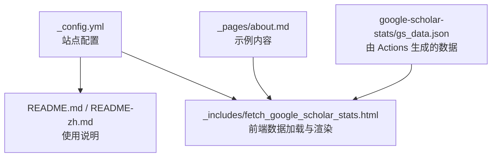
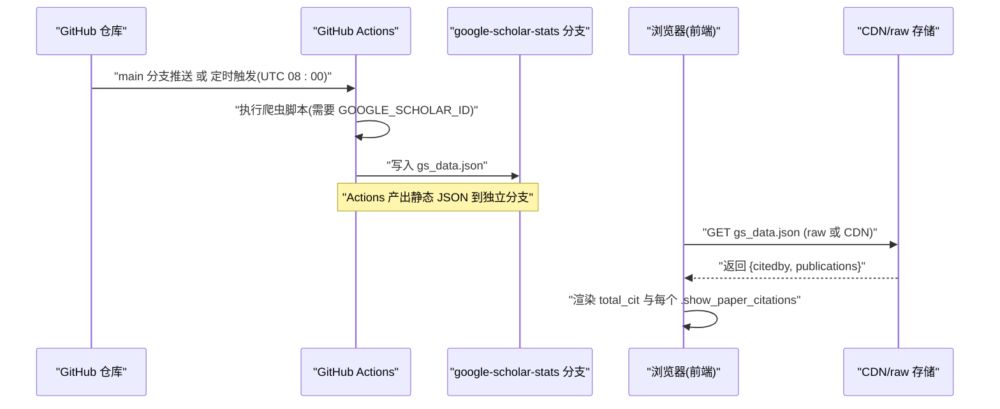
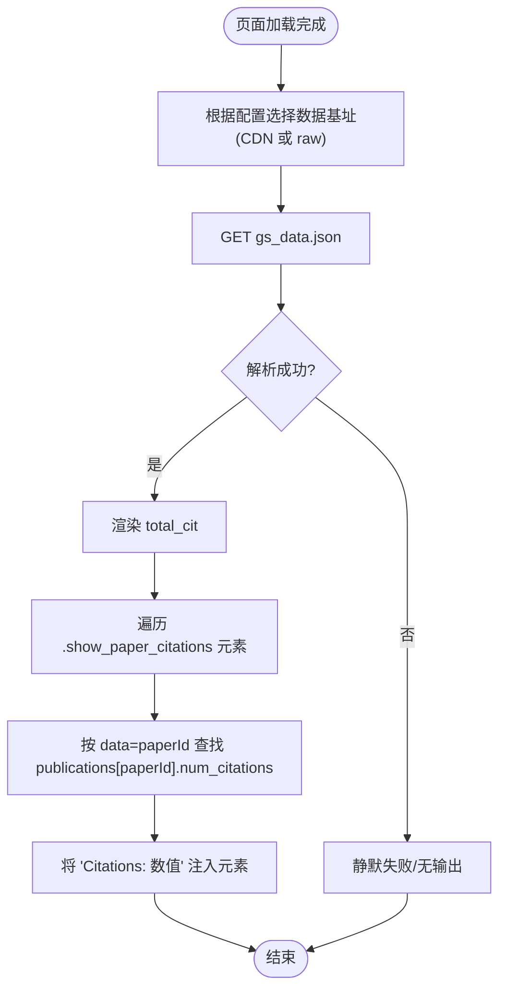
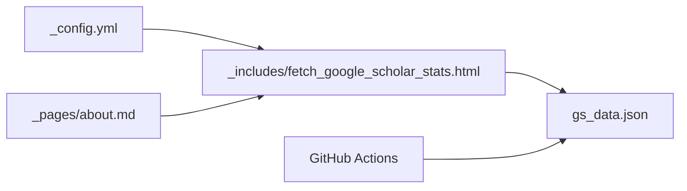

# Google Scholar 引用统计

<cite>
**本文引用的文件**   
- [README.md](file://README.md)
- [README-zh.md](file://docs/README-zh.md)
- [_config.yml](file://_config.yml)
- [fetch_google_scholar_stats.html](file://_includes/fetch_google_scholar_stats.html)
- [about.md](file://_pages/about.md)
</cite>

## 目录
1. [简介](#简介)
2. [项目结构](#项目结构)
3. [核心组件](#核心组件)
4. [架构总览](#架构总览)
5. [详细组件分析](#详细组件分析)
6. [依赖关系分析](#依赖关系分析)
7. [性能与缓存策略](#性能与缓存策略)
8. [故障排除指南](#故障排除指南)
9. [结论](#结论)
10. [附录：配置清单](#附录配置清单)

## 简介
本仓库为学术个人主页模板，内置“Google Scholar 引用统计自动化”能力。其核心思路是：通过 GitHub Actions 定时或触发式运行爬虫脚本，抓取 Google Scholar 的引用数据并生成静态 JSON；站点页面在运行时动态加载该 JSON，将作者总被引与单篇论文被引渲染到页面上。

- 自动更新：GitHub Actions 支持每日定时（UTC 08:00）与 main 分支推送时触发，产出 gs_data.json 至独立分支。
- 前端展示：页面加载后通过 AJAX 请求 gs_data.json，按元素标记填充“总被引”和“论文被引”。
- 可配置项：是否使用 CDN、仓库地址、作者 Google Scholar ID 等。

本节为总体介绍，不直接分析具体代码文件。

## 项目结构
与本功能相关的核心文件与职责如下：
- _config.yml：站点全局配置，包含仓库名、CDN 开关、作者信息等。
- README.md / docs/README-zh.md：快速开始说明，包括如何设置 GOOGLE_SCHOLAR_ID、启用 Actions、何时触发等。
- _includes/fetch_google_scholar_stats.html：前端脚本，负责根据配置选择数据源 URL，拉取 gs_data.json 并渲染。
- _pages/about.md：示例页面，演示如何在文章条目中插入占位符以显示论文被引。

图表来源
- [_config.yml:1-169](file://_config.yml#L1-L169)
- [README.md:33-57](file://README.md#L33-L57)
- [README-zh.md:35-53](file://docs/README-zh.md#L35-L53)
- [fetch_google_scholar_stats.html:1-19](file://_includes/fetch_google_scholar_stats.html#L1-L19)
- [about.md:1-250](file://_pages/about.md#L1-L250)

章节来源
- [_config.yml:1-169](file://_config.yml#L1-L169)
- [README.md:33-57](file://README.md#L33-L57)
- [README-zh.md:35-53](file://docs/README-zh.md#L35-L53)
- [fetch_google_scholar_stats.html:1-19](file://_includes/fetch_google_scholar_stats.html#L1-L19)
- [about.md:1-250](file://_pages/about.md#L1-L250)

## 核心组件
- 站点配置层（_config.yml）
  - repository：用于拼接数据源 URL。
  - google_scholar_stats_use_cdn：控制前端从 raw.githubusercontent.com 还是 jsDelivr CDN 读取 gs_data.json。
  - author.googlescholar：作者 Google Scholar 主页链接（用于侧边栏展示）。
- 前端加载器（_includes/fetch_google_scholar_stats.html）
  - 依据配置选择数据基址，发起 GET 请求获取 gs_data.json。
  - 解析返回对象中的 citedby 与 publications 字段，分别渲染总被引与每篇论文的被引。
  - 通过 class="show_paper_citations" 且 data 属性为 paperId 的元素进行匹配与填充。
- 示例页面（_pages/about.md）
  - 提供插入  的示例位置，供前端脚本定位并注入被引数。
- 使用说明（README.md / README-zh.md）
  - 指导如何设置 GOOGLE_SCHOLAR_ID、启用 Actions、触发时机（main 分支推送与每日 UTC 08:00）、以及如何使用 show_paper_citations 标签。

章节来源
- [_config.yml:1-169](file://_config.yml#L1-L169)
- [fetch_google_scholar_stats.html:1-19](file://_includes/fetch_google_scholar_stats.html#L1-L19)
- [about.md:80-120](file://_pages/about.md#L80-L120)
- [README.md:33-57](file://README.md#L33-L57)
- [README-zh.md:35-53](file://docs/README-zh.md#L35-L53)

## 架构总览
下图展示了从 Actions 生成数据到前端渲染的端到端流程。

图表来源
- [README.md:33-57](file://README.md#L33-L57)
- [README-zh.md:35-53](file://docs/README-zh.md#L35-L53)
- [fetch_google_scholar_stats.html:1-19](file://_includes/fetch_google_scholar_stats.html#L1-L19)

## 详细组件分析

### 前端数据加载与渲染（_includes/fetch_google_scholar_stats.html）
- 数据源选择
  - 若启用 CDN：基址指向 jsDelivr 托管路径。
  - 否则：基址指向 raw.githubusercontent.com。
- 数据请求
  - 使用 AJAX 请求 gs_data.json，期望返回对象包含：
    - citedby：作者总被引。
    - publications：键为 paperId，值为包含 num_citations 的对象。
- 渲染逻辑
  - 将 citedby 写入 id 为 total_cit 的元素。
  - 遍历所有 class 为 show_paper_citations 的元素，以其 data 属性作为 paperId，从 publications 中取出 num_citations 并追加到元素文本中。

图表来源
- [fetch_google_scholar_stats.html:1-19](file://_includes/fetch_google_scholar_stats.html#L1-L19)

章节来源
- [fetch_google_scholar_stats.html:1-19](file://_includes/fetch_google_scholar_stats.html#L1-L19)

### 示例页面集成（_pages/about.md）
- 在论文条目旁插入 ，其中 data 值需与 gs_data.json 中 publications 的键一致。
- 页面渲染后，脚本会找到这些占位符并注入对应论文的被引数。

章节来源
- [about.md:80-120](file://_pages/about.md#L80-L120)

### 配置项说明（_config.yml）
- repository：用于拼接数据源 URL，必须与当前仓库 owner/repo 一致。
- google_scholar_stats_use_cdn：true 时使用 CDN，false 时使用 raw.githubusercontent.com。
- author.googlescholar：作者 Google Scholar 主页链接，用于侧边栏展示。

章节来源
- [_config.yml:1-169](file://_config.yml#L1-L169)

### 使用说明与触发策略（README.md / README-zh.md）
- 设置 GOOGLE_SCHOLAR_ID：在仓库 Settings -> Secrets -> Actions 中添加名为 GOOGLE_SCHOLAR_ID 的密钥。
- 启用 Actions：首次需在 Actions 页面点击启用工作流。
- 触发时机：
  - main 分支有推送时触发。
  - 每天 UTC 08:00 定时触发。
- 产出产物：gs_data.json 写入 google-scholar-stats 分支。

章节来源
- [README.md:33-57](file://README.md#L33-L57)
- [README-zh.md:35-53](file://docs/README-zh.md#L35-L53)

## 依赖关系分析
- 前端脚本依赖：
  - jQuery（AJAX 调用）。
  - 站点配置变量 site.repository 与 site.google_scholar_stats_use_cdn。
  - 目标 JSON 文件 gs_data.json 的结构（citedby、publications）。
- 构建/部署依赖：
  - GitHub Actions（由 README 描述的工作流触发与定时任务）。
  - 独立分支 google-scholar-stats 用于存放 gs_data.json。

图表来源
- [_config.yml:1-169](file://_config.yml#L1-L169)
- [fetch_google_scholar_stats.html:1-19](file://_includes/fetch_google_scholar_stats.html#L1-L19)
- [README.md:33-57](file://README.md#L33-L57)
- [README-zh.md:35-53](file://docs/README-zh.md#L35-L53)
- [about.md:80-120](file://_pages/about.md#L80-L120)

章节来源
- [_config.yml:1-169](file://_config.yml#L1-L169)
- [fetch_google_scholar_stats.html:1-19](file://_includes/fetch_google_scholar_stats.html#L1-L19)
- [README.md:33-57](file://README.md#L33-L57)
- [README-zh.md:35-53](file://docs/README-zh.md#L35-L53)
- [about.md:80-120](file://_pages/about.md#L80-L120)

## 性能与缓存策略
- CDN 加速与延迟
  - 启用 google_scholar_stats_use_cdn 后，前端通过 jsDelivr 访问 gs_data.json，可降低跨域与网络延迟，但存在缓存延迟，导致数据更新不会立即生效。
  - 关闭 CDN 则直连 raw.githubusercontent.com，更新更及时，但在部分地区可能受限。
- 请求频率
  - 前端仅在页面加载时发起一次请求，属于轻量级 I/O，对服务器压力较小。
- 建议
  - 国内用户优先开启 CDN 以获得更好可用性。
  - 如需尽快看到最新数据，可临时关闭 CDN 并在必要时再恢复。

[本节为通用性能讨论，不直接分析具体代码文件]

## 故障排除指南
- 未显示或被引数为空
  - 检查页面是否存在 id 为 total_cit 的元素，以及 class 为 show_paper_citations 的元素是否正确设置了 data 属性。
  - 确认 gs_data.json 已成功生成并位于 google-scholar-stats 分支。
  - 核对 repository 配置是否与当前仓库一致。
- 无法加载 gs_data.json
  - 若启用 CDN，请确认 jsDelivr 可达；如不可用，切换为 raw.githubusercontent.com。
  - 检查 CORS 与网络连通性。
- 数据未更新
  - 确认已启用 Actions 且 GOOGLE_SCHOLAR_ID 已正确配置。
  - 等待定时任务（UTC 08:00）或手动触发 main 分支推送。
  - 若启用 CDN，注意缓存延迟，稍后再刷新查看。
- 本地调试
  - 参考 README 的本地调试步骤，启动 Jekyll 服务后观察控制台是否有请求错误。

章节来源
- [README.md:33-57](file://README.md#L33-L57)
- [README-zh.md:35-53](file://docs/README-zh.md#L35-L53)
- [fetch_google_scholar_stats.html:1-19](file://_includes/fetch_google_scholar_stats.html#L1-L19)
- [about.md:80-120](file://_pages/about.md#L80-L120)

## 结论
本方案通过“Actions 定时/触发 + 静态 JSON + 前端按需加载”的方式，实现了 Google Scholar 引用统计的自动化与低耦合展示。配合 CDN 与合理的配置项，可在可用性与时效性之间取得平衡。对于中国大陆地区用户，推荐启用 CDN 以提升稳定性；对时效性要求较高的场景，可关闭 CDN 并关注网络可达性。

[本节为总结性内容，不直接分析具体代码文件]

## 附录：配置清单
- 必需配置
  - GOOGLE_SCHOLAR_ID：在仓库 Secrets 中设置，供 Actions 使用。
  - repository：站点配置中填写 owner/repo，用于拼接数据源 URL。
  - google_scholar_stats_use_cdn：根据网络环境选择 true/false。
- 可选配置
  - author.googlescholar：作者 Google Scholar 主页链接。
- 页面集成
  - 在需要显示被引的位置插入 ，确保 data 与 gs_data.json 中 publications 的键一致。
  - 在页面中提供 id 为 total_cit 的元素以显示作者总被引。

章节来源
- [_config.yml:1-169](file://_config.yml#L1-L169)
- [README.md:33-57](file://README.md#L33-L57)
- [README-zh.md:35-53](file://docs/README-zh.md#L35-L53)
- [about.md:80-120](file://_pages/about.md#L80-L120)