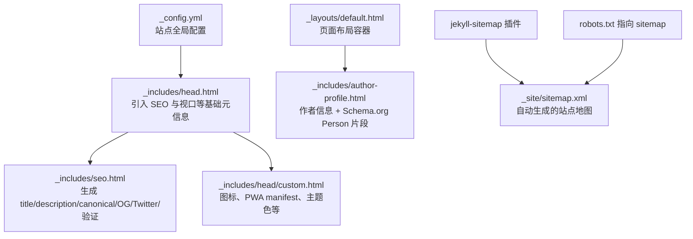
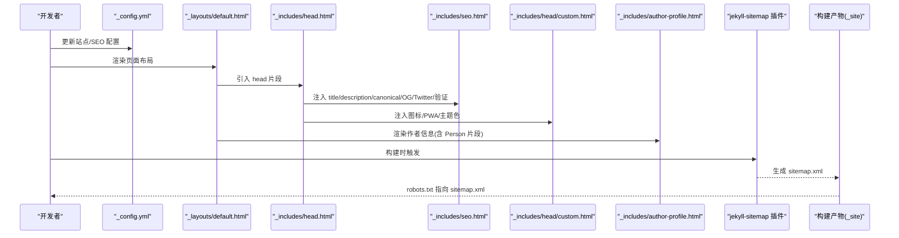
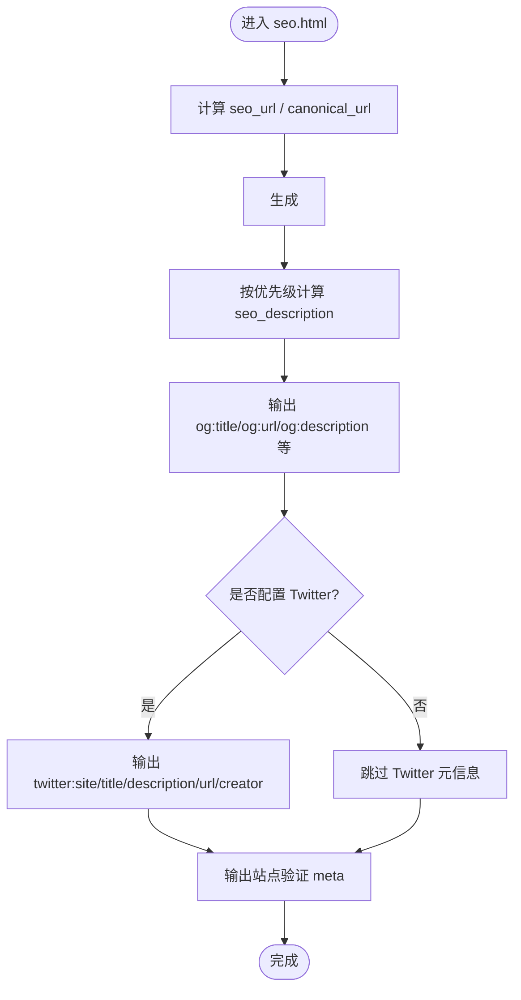
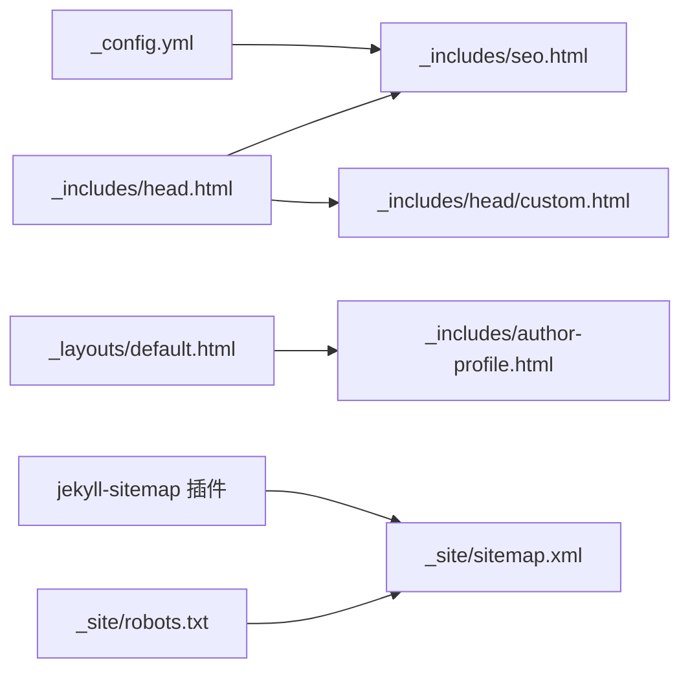

# SEO 优化配置

<cite>
**本文引用的文件**   
- [_config.yml](file://_config.yml)
- [_includes/head.html](file://_includes/head.html)
- [_includes/seo.html](file://_includes/seo.html)
- [_includes/head/custom.html](file://_includes/head/custom.html)
- [images/site.webmanifest](file://images/site.webmanifest)
- [_includes/author-profile.html](file:// _includes/author-profile.html)
- [_layouts/default.html](file://_layouts/default.html)
- [_site/sitemap.xml](file://_site/sitemap.xml)
- [_site/robots.txt](file://_site/robots.txt)
</cite>

## 目录
1. [简介](#简介)
2. [项目结构](#项目结构)
3. [核心组件](#核心组件)
4. [架构总览](#架构总览)
5. [详细组件分析](#详细组件分析)
6. [依赖关系分析](#依赖关系分析)
7. [性能与可维护性建议](#性能与可维护性建议)
8. [故障排查指南](#故障排查指南)
9. [结论](#结论)
10. [附录](#附录)

## 简介
本文件面向使用 Jekyll 构建的个人站点，系统化梳理并完善搜索引擎优化（SEO）能力。内容覆盖：
- 元数据配置系统：标题、描述、关键词的自动生成与管理策略
- Open Graph 标签与 Twitter Card 的配置方法
- 结构化数据标记的实现现状与改进建议（含 JSON-LD）
- 站点地图生成与 robots.txt 配置
- 多语言 SEO 支持与移动端优化策略

## 项目结构
本项目为基于 Jekyll 的博客站点，SEO 相关逻辑集中在以下位置：
- 全局站点配置：_config.yml
- 页面头部模板：_includes/head.html、_includes/head/custom.html
- SEO 元信息注入：_includes/seo.html
- 作者信息与结构化数据片段：_includes/author-profile.html
- 默认布局入口：_layouts/default.html
- 站点地图与 robots.txt：由插件在构建产物中生成，位于 _site 下
- PWA 清单：images/site.webmanifest

图示来源
- [_config.yml:148-161](file://_config.yml#L148-L161)
- [_includes/head.html:1-16](file://_includes/head.html#L1-L16)
- [_includes/seo.html:1-76](file://_includes/seo.html#L1-L76)
- [_includes/head/custom.html:1-24](file:// _includes/head/custom.html#L1-L24)
- [_includes/author-profile.html:1-90](file://_includes/author-profile.html#L1-L90)
- [_site/sitemap.xml:1-46](file://_site/sitemap.xml#L1-L46)
- [_site/robots.txt:1-2](file://_site/robots.txt#L1-L2)

章节来源
- [_config.yml:148-161](file://_config.yml#L148-L161)
- [_includes/head.html:1-16](file://_includes/head.html#L1-L16)
- [_includes/seo.html:1-76](file://_includes/seo.html#L1-L76)
- [_includes/head/custom.html:1-24](file://_includes/head/custom.html#L1-L24)
- [_includes/author-profile.html:1-90](file://_includes/author-profile.html#L1-L90)
- [_site/sitemap.xml:1-46](file://_site/sitemap.xml#L1-L46)
- [_site/robots.txt:1-2](file://_site/robots.txt#L1-L2)

## 核心组件
- 站点全局配置（_config.yml）
  - 站点名称、描述、时区、输出规则、插件白名单等
  - SEO 相关字段预留：google_site_verification、bing_site_verification、baidu_site_verification
  - 启用 jekyll-sitemap 插件以自动生成站点地图
- 页面头部模板（_includes/head.html）
  - 引入 SEO 模块、设置移动端视口、加载主样式
- SEO 元信息注入（_includes/seo.html）
  - 动态生成 <title>、canonical、og:*、twitter:*、站点验证 meta
  - 描述优先级：page.description → page.excerpt → site.description
  - 作者 Twitter 处理：优先取页面对象或 data.authors 中的 twitter
- 自定义头部片段（_includes/head/custom.html）
  - 图标、PWA manifest、主题色、第三方资源引用
- 作者信息片段（_includes/author-profile.html）
  - 包含 Schema.org Person 结构化数据片段
- 默认布局（_layouts/default.html）
  - 页面级结构化数据容器（CreativeWork）
- 站点地图与 robots.txt（_site 下）
  - 由 jekyll-sitemap 生成；robots.txt 指向 sitemap.xml

章节来源
- [_config.yml:8-21](file://_config.yml#L8-L21)
- [_config.yml:148-161](file://_config.yml#L148-L161)
- [_includes/head.html:1-16](file://_includes/head.html#L1-L16)
- [_includes/seo.html:1-76](file://_includes/seo.html#L1-L76)
- [_includes/head/custom.html:1-24](file://_includes/head/custom.html#L1-L24)
- [_includes/author-profile.html:1-90](file://_includes/author-profile.html#L1-L90)
- [_layouts/default.html:19](file://_layouts/default.html#L19)
- [_site/sitemap.xml:1-46](file://_site/sitemap.xml#L1-L46)
- [_site/robots.txt:1-2](file://_site/robots.txt#L1-L2)

## 架构总览
下图展示了从配置到最终 HTML 输出的关键路径，以及 SEO 元信息的生成顺序与依赖关系。

图示来源
- [_config.yml:148-161](file://_config.yml#L148-L161)
- [_includes/head.html:1-16](file://_includes/head.html#L1-L16)
- [_includes/seo.html:1-76](file://_includes/seo.html#L1-L76)
- [_includes/head/custom.html:1-24](file://_includes/head/custom.html#L1-L24)
- [_includes/author-profile.html:1-90](file://_includes/author-profile.html#L1-L90)
- [_site/sitemap.xml:1-46](file://_site/sitemap.xml#L1-L46)
- [_site/robots.txt:1-2](file://_site/robots.txt#L1-L2)

## 详细组件分析

### 元数据配置系统（标题、描述、关键词）
- 标题生成
  - 当前实现固定输出“站点名 - Homepage”，未根据页面标题动态调整
  - 建议：优先使用 page.title，其次回退到 site.title，并在首页显示不同后缀
- 描述生成
  - 优先级：page.description → page.excerpt → site.description
  - 对内容进行清理（去除 HTML、换行、转义），避免过长或乱码
- 关键词
  - 当前未生成 keywords 标签
  - 建议：若使用 page.keywords 或 tags，可在 seo.html 中按需输出
- 规范化链接 canonical
  - 已根据 site.url 与 page.url 生成，避免重复内容问题
- 站点验证
  - 支持 Google/Bing/Baidu 站点验证，通过 _config.yml 对应键值注入

图示来源
- [_includes/seo.html:1-76](file://_includes/seo.html#L1-L76)

章节来源
- [_includes/seo.html:11-16](file://_includes/seo.html#L11-L16)
- [_includes/seo.html:32-43](file://_includes/seo.html#L32-L43)
- [_includes/seo.html:45-54](file://_includes/seo.html#L45-L54)
- [_includes/seo.html:66-74](file://_includes/seo.html#L66-L74)
- [_config.yml:17-21](file://_config.yml#L17-L21)

### Open Graph 标签
- 已实现
  - og:locale、og:site_name、og:title、og:url、og:description
- 缺失项与建议
  - og:image：建议在页面或全局配置中提供封面图，提升社交分享展示效果
  - og:type：建议根据页面类型设置（如 article、website）
  - fb:app_id/article:publisher：已在条件分支中支持

章节来源
- [_includes/seo.html:32-43](file://_includes/seo.html#L32-L43)
- [_includes/seo.html:56-64](file://_includes/seo.html#L56-L64)

### Twitter Card 标签
- 已实现
  - twitter:site、twitter:title、twitter:description、twitter:url、twitter:creator
- 缺失项与建议
  - twitter:card：建议显式声明（如 summary_large_image）
  - twitter:image：建议提供图片以提升卡片展示质量

章节来源
- [_includes/seo.html:45-54](file://_includes/seo.html#L45-L54)

### 结构化数据标记（JSON-LD 与 Microdata）
- 现状
  - 使用 Microdata：
    - 作者信息：Person 类型（_includes/author-profile.html）
    - 页面主体：CreativeWork 类型（_layouts/default.html）
- 建议补充 JSON-LD
  - WebSite/WebPage：统一站点与页面的结构化描述
  - Article/BlogPosting：针对博客文章
  - Organization：站点运营方信息
  - BreadcrumbList：导航面包屑
  - ImageObject：配合 og:image 提供高质量图片信息
- 实施要点
  - 将 JSON-LD 脚本插入 <head> 或页面顶部
  - 确保字段与页面实际内容一致，避免误导爬虫

章节来源
- [_includes/author-profile.html:4-5](file://_includes/author-profile.html#L4-L5)
- [_layouts/default.html:19](file://_layouts/default.html#L19)

### 站点地图与 robots.txt
- 站点地图
  - 通过 jekyll-sitemap 插件自动生成 _site/sitemap.xml
  - 包含所有页面 URL，便于搜索引擎抓取
- robots.txt
  - 指向 sitemap.xml，引导爬虫发现站点地图
- 建议
  - 生产环境确认 robots.txt 未被屏蔽
  - 如需排除特定目录，可在 robots.txt 中添加 Disallow 规则

章节来源
- [_config.yml:148-161](file://_config.yml#L148-L161)
- [_site/sitemap.xml:1-46](file://_site/sitemap.xml#L1-L46)
- [_site/robots.txt:1-2](file://_site/robots.txt#L1-L2)

### 多语言 SEO 支持
- 现状
  - og:locale 固定为 en
- 建议
  - 根据页面语言动态设置 og:locale
  - 添加 hreflang 标签，指向各语言版本页面
  - 为每个语言版本提供独立的 title/description/keywords

章节来源
- [_includes/seo.html:32](file://_includes/seo.html#L32)

### 移动端优化策略
- 视口与设备适配
  - 已设置 viewport、HandheldFriendly、MobileOptimized
- PWA 与图标
  - 已引入 site.webmanifest、favicon 系列、主题色
- 建议
  - 确保图片响应式与懒加载
  - 控制首屏体积，减少阻塞资源
  - 使用预连接与预加载关键资源

章节来源
- [_includes/head.html:5-7](file://_includes/head.html#L5-L7)
- [_includes/head/custom.html:1-9](file://_includes/head/custom.html#L1-L9)
- [images/site.webmanifest:1-19](file://images/site.webmanifest#L1-L19)

## 依赖关系分析
- 组件耦合
  - head.html 依赖 seo.html 与 custom.html
  - seo.html 依赖 _config.yml 的全局配置与页面 front matter
  - author-profile.html 与 default.html 共同构成页面级结构化数据
- 外部依赖
  - jekyll-sitemap 插件负责站点地图生成
  - 第三方资源（MathJax、Academicons）通过 CDN 引入

图示来源
- [_config.yml:148-161](file://_config.yml#L148-L161)
- [_includes/head.html:1-16](file://_includes/head.html#L1-L16)
- [_includes/seo.html:1-76](file://_includes/seo.html#L1-L76)
- [_includes/head/custom.html:1-24](file://_includes/head/custom.html#L1-L24)
- [_includes/author-profile.html:1-90](file://_includes/author-profile.html#L1-L90)
- [_layouts/default.html:19](file://_layouts/default.html#L19)
- [_site/sitemap.xml:1-46](file://_site/sitemap.xml#L1-L46)
- [_site/robots.txt:1-2](file://_site/robots.txt#L1-L2)

## 性能与可维护性建议
- 元数据精简
  - 仅输出必要 meta，避免冗余
- 资源加载优化
  - 延迟加载非关键脚本（如 MathJax）
  - 使用相对路径与缓存策略
- 结构化数据一致性
  - 保持 JSON-LD/Microdata 与页面内容同步
- 可维护性
  - 将常用 SEO 字段集中管理于 _config.yml 或页面 front matter
  - 建立检查清单，发布前校验 OG/Twitter/Canonical/Robots/Sitemap

## 故障排查指南
- 标题不正确
  - 检查 seo.html 的标题生成逻辑与页面 front matter
- OG/Twitter 预览异常
  - 确认 og:image/twitter:image 存在且可达
  - 检查 og:locale 与语言匹配
- 站点验证失败
  - 核对 _config.yml 中的验证密钥是否正确
- 站点地图未收录
  - 确认 jekyll-sitemap 已启用且 _site/sitemap.xml 可访问
  - 检查 robots.txt 是否允许抓取
- 移动端显示异常
  - 检查 viewport 与 PWA manifest 配置
  - 确认图片尺寸与 CSS 适配

章节来源
- [_includes/seo.html:11-16](file://_includes/seo.html#L11-L16)
- [_includes/seo.html:32-43](file://_includes/seo.html#L32-L43)
- [_includes/seo.html:45-54](file://_includes/seo.html#L45-L54)
- [_config.yml:17-21](file://_config.yml#L17-L21)
- [_config.yml:148-161](file://_config.yml#L148-L161)
- [_site/robots.txt:1-2](file://_site/robots.txt#L1-L2)
- [_site/sitemap.xml:1-46](file://_site/sitemap.xml#L1-L46)
- [_includes/head.html:5-7](file://_includes/head.html#L5-L7)
- [_includes/head/custom.html:1-9](file://_includes/head/custom.html#L1-L9)

## 结论
本项目已具备基础的 SEO 能力：标题与描述自动生成、Open Graph 与 Twitter Card 部分字段、站点地图与 robots.txt 自动化、移动端视口与 PWA 基础配置。为进一步增强搜索可见性与社交分享体验，建议补充 JSON-LD 结构化数据、完善 og:image/twitter:image、实现多语言 SEO（hreflang 与动态 locale）、并对标题与关键词进行更精细化的页面级控制。

## 附录
- 快速检查清单
  - 每个页面是否有唯一 title 与 description
  - canonical 是否正确
  - og:* 与 twitter:* 是否完整
  - 站点地图是否可访问
  - robots.txt 是否允许抓取
  - 移动端视口与 PWA 是否生效
  - 结构化数据是否与页面内容一致