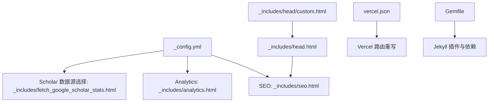
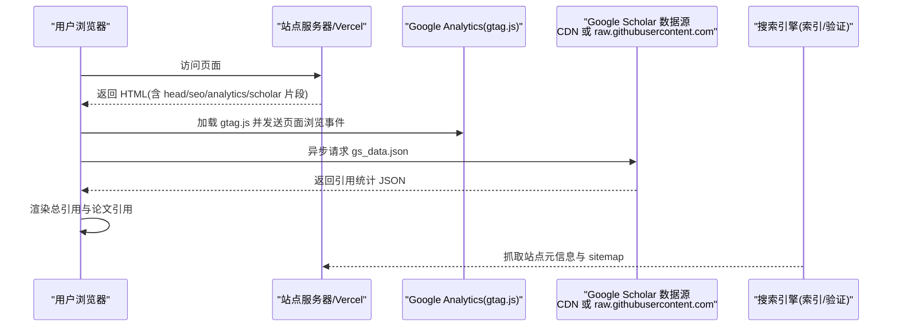
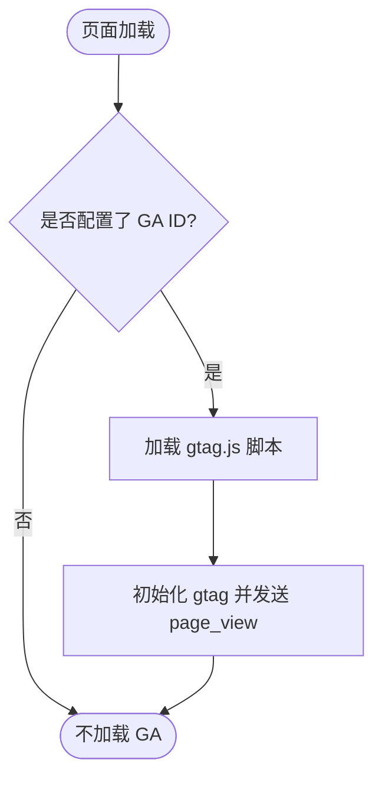
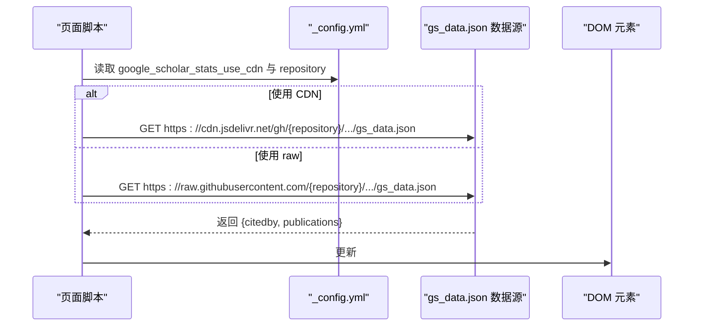
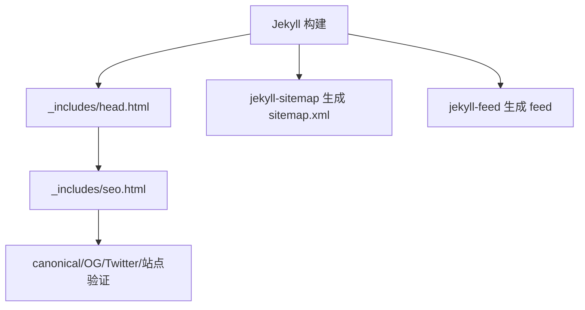
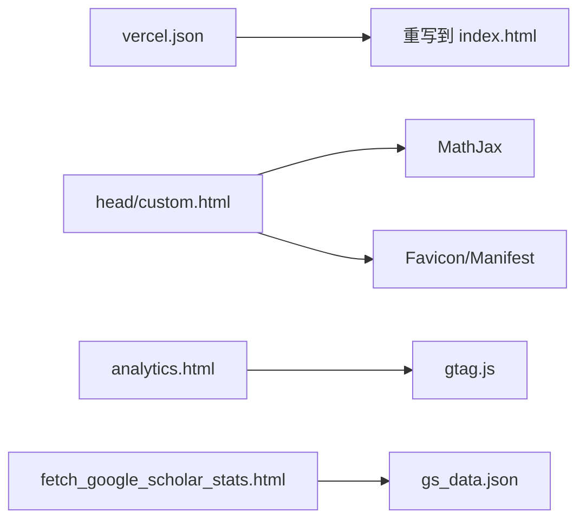
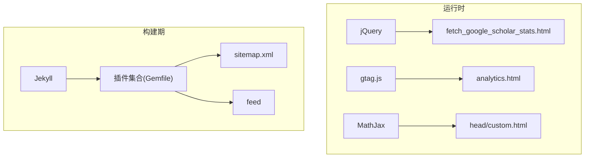

# 功能集成

<cite>
**本文引用的文件**   
- [_config.yml](file://_config.yml)
- [vercel.json](file://vercel.json)
- [_includes/analytics.html](file://_includes/analytics.html)
- [_includes/fetch_google_scholar_stats.html](file://_includes/fetch_google_scholar_stats.html)
- [_includes/seo.html](file://_includes/seo.html)
- [_includes/head.html](file://_includes/head.html)
- [_includes/head/custom.html](file://_includes/head/custom.html)
- [README.md](file://README.md)
- [Gemfile](file://Gemfile)
</cite>

## 目录
1. [简介](#简介)
2. [项目结构](#项目结构)
3. [核心组件](#核心组件)
4. [架构总览](#架构总览)
5. [详细组件分析](#详细组件分析)
6. [依赖分析](#依赖分析)
7. [性能考虑](#性能考虑)
8. [故障排除指南](#故障排除指南)
9. [结论](#结论)
10. [附录](#附录)

## 简介
本文件面向第三方服务集成的配置与使用，覆盖以下能力：
- Google Analytics（GA）分析工具的配置与数据收集开关
- Google Scholar 引用统计的自动化更新机制与前端展示逻辑
- SEO 元数据与搜索引擎验证配置
- Vercel 部署配置与其他外部服务集成要点
- 常见问题排查与调试方法

## 项目结构
本项目为 Jekyll 站点，第三方服务相关的关键位置如下：
- 全局配置：_config.yml
- 页面头部与 SEO：_includes/head.html、_includes/seo.html、_includes/head/custom.html
- 分析统计：_includes/analytics.html
- 学术引用：_includes/fetch_google_scholar_stats.html
- 部署配置：vercel.json
- 构建与插件：Gemfile

图示来源
- [_config.yml](file://_config.yml)
- [_includes/seo.html](file://_includes/seo.html)
- [_includes/analytics.html](file://_includes/analytics.html)
- [_includes/fetch_google_scholar_stats.html](file://_includes/fetch_google_scholar_stats.html)
- [_includes/head.html](file://_includes/head.html)
- [_includes/head/custom.html](file://_includes/head/custom.html)
- [vercel.json](file://vercel.json)
- [Gemfile](file://Gemfile)

章节来源
- [_config.yml](file://_config.yml)
- [_includes/head.html](file://_includes/head.html)
- [_includes/head/custom.html](file://_includes/head/custom.html)
- [_includes/seo.html](file://_includes/seo.html)
- [_includes/analytics.html](file://_includes/analytics.html)
- [_includes/fetch_google_scholar_stats.html](file://_includes/fetch_google_scholar_stats.html)
- [vercel.json](file://vercel.json)
- [Gemfile](file://Gemfile)

## 核心组件
- 全局配置项（_config.yml）
  - google_analytics_id：用于启用 GA 追踪
  - google_site_verification / bing_site_verification / baidu_site_verification：搜索引擎站点验证
  - repository：用于构造 GitHub 仓库地址（CDN/raw）
  - google_scholar_stats_use_cdn：控制引用统计数据读取来源（CDN 或 raw）
- 页面头与 SEO（head.html + seo.html + head/custom.html）
  - 注入 canonical、OG/Twitter 元信息、站点验证 meta
  - 引入 favicon、manifest、MathJax 等
- 分析统计（analytics.html）
  - 条件加载 gtag.js，按 site.google_analytics_id 初始化
- 学术引用（fetch_google_scholar_stats.html）
  - 根据配置选择 CDN 或 raw 地址，拉取 gs_data.json 并渲染引用数
- 部署（vercel.json）
  - SPA 风格重定向到 index.html，适配前端路由
- 构建与插件（Gemfile）
  - jekyll-sitemap、jekyll-feed、jekyll-seo-tag 等插件支持 SEO 与站点地图

章节来源
- [_config.yml](file://_config.yml)
- [_includes/head.html](file://_includes/head.html)
- [_includes/seo.html](file://_includes/seo.html)
- [_includes/head/custom.html](file://_includes/head/custom.html)
- [_includes/analytics.html](file://_includes/analytics.html)
- [_includes/fetch_google_scholar_stats.html](file://_includes/fetch_google_scholar_stats.html)
- [vercel.json](file://vercel.json)
- [Gemfile](file://Gemfile)

## 架构总览
下图展示了从浏览器请求到各第三方服务的调用链路。

图示来源
- [_includes/analytics.html](file://_includes/analytics.html)
- [_includes/fetch_google_scholar_stats.html](file://_includes/fetch_google_scholar_stats.html)
- [_includes/seo.html](file://_includes/seo.html)
- [vercel.json](file://vercel.json)

## 详细组件分析

### Google Analytics 集成
- 配置入口
  - 在 _config.yml 中设置 google_analytics_id
- 加载与初始化
  - _includes/analytics.html 通过 gtag.js 初始化，并将 site.google_analytics_id 传入
  - 可通过页面级 analytics 开关控制是否加载
- 数据收集
  - 默认采集页面浏览；如需自定义事件，可在页面脚本中调用 gtag 接口

图示来源
- [_includes/analytics.html](file://_includes/analytics.html)
- [_config.yml](file://_config.yml)

章节来源
- [_includes/analytics.html](file://_includes/analytics.html)
- [_config.yml](file://_config.yml)

### Google Scholar 引用统计自动化与前端展示
- 数据来源与更新
  - 根据 README 说明，GitHub Actions 会定时触发，将引用统计写入 google-scholar-stats 分支的 gs_data.json
  - 需在仓库 Secrets 中配置 GOOGLE_SCHOLAR_ID
- 前端读取策略
  - fetch_google_scholar_stats.html 依据 google_scholar_stats_use_cdn 决定从 jsDelivr CDN 或 raw.githubusercontent.com 拉取 gs_data.json
  - 页面就绪后，读取 totalCitation 与 publications 列表，动态填充 DOM
- 页面标记
  - 在内容中使用 class="show_paper_citations" 且 data 属性为论文 ID，即可显示对应论文引用数

图示来源
- [_includes/fetch_google_scholar_stats.html](file://_includes/fetch_google_scholar_stats.html)
- [_config.yml](file://_config.yml)
- [README.md](file://README.md)

章节来源
- [_includes/fetch_google_scholar_stats.html](file://_includes/fetch_google_scholar_stats.html)
- [_config.yml](file://_config.yml)
- [README.md](file://README.md)

### SEO 优化实现
- 元数据与社交分享
  - _includes/seo.html 生成 canonical、OG、Twitter Card 等元信息
- 站点验证
  - 支持 Google/Bing/Baidu 站点验证 meta 标签注入
- 站点地图与 Feed
  - Gemfile 启用 jekyll-sitemap、jekyll-feed，便于搜索引擎发现
- 站点基础
  - _includes/head.html 统一引入 seo.html 与资源
  - _includes/head/custom.html 引入 favicon、manifest、MathJax 等

图示来源
- [_includes/head.html](file://_includes/head.html)
- [_includes/seo.html](file://_includes/seo.html)
- [_includes/head/custom.html](file://_includes/head/custom.html)
- [Gemfile](file://Gemfile)

章节来源
- [_includes/seo.html](file://_includes/seo.html)
- [_includes/head.html](file://_includes/head.html)
- [_includes/head/custom.html](file://_includes/head/custom.html)
- [Gemfile](file://Gemfile)

### Vercel 部署配置与其他外部服务集成
- Vercel 路由重写
  - vercel.json 将所有路径重写到 index.html，适配前端单页路由
- 其他外部服务
  - MathJax：通过 _includes/head/custom.html 引入
  - 图标与 PWA：favicon、site.webmanifest 由 custom.html 引入
  - 分析统计：gtag.js 由 analytics.html 引入
  - 学术引用：gs_data.json 由 fetch_google_scholar_stats.html 引入

图示来源
- [vercel.json](file://vercel.json)
- [_includes/head/custom.html](file://_includes/head/custom.html)
- [_includes/analytics.html](file://_includes/analytics.html)
- [_includes/fetch_google_scholar_stats.html](file://_includes/fetch_google_scholar_stats.html)

章节来源
- [vercel.json](file://vercel.json)
- [_includes/head/custom.html](file://_includes/head/custom.html)
- [_includes/analytics.html](file://_includes/analytics.html)
- [_includes/fetch_google_scholar_stats.html](file://_includes/fetch_google_scholar_stats.html)

## 依赖分析
- 运行时依赖
  - jQuery：fetch_google_scholar_stats.html 使用 $.getJSON 拉取 JSON
  - gtag.js：analytics.html 通过 Google Tag Manager 加载
  - MathJax：head/custom.html 引入
- 构建期依赖
  - Jekyll 及插件：Gemfile 声明 jekyll、jekyll-sitemap、jekyll-feed、jekyll-seo-tag、jekyll-paginate、jekyll-gist、jekyll-redirect-from 等

图示来源
- [_includes/fetch_google_scholar_stats.html](file://_includes/fetch_google_scholar_stats.html)
- [_includes/analytics.html](file://_includes/analytics.html)
- [_includes/head/custom.html](file://_includes/head/custom.html)
- [Gemfile](file://Gemfile)

章节来源
- [_includes/fetch_google_scholar_stats.html](file://_includes/fetch_google_scholar_stats.html)
- [_includes/analytics.html](file://_includes/analytics.html)
- [_includes/head/custom.html](file://_includes/head/custom.html)
- [Gemfile](file://Gemfile)

## 性能考虑
- 学术引用数据缓存
  - 使用 CDN 可提升中国大陆地区访问稳定性，但存在缓存延迟；若需最新数据，可关闭 CDN 直连 raw
- 脚本加载顺序
  - 确保 jQuery 先于 fetch_google_scholar_stats.html 执行，避免 $ 未定义错误
- 静态资源优化
  - 已启用 CSS 压缩与按需引入，建议保持最小化外部脚本数量

[本节为通用指导，无需代码来源]

## 故障排除指南
- GA 无数据
  - 检查 _config.yml 是否填写 google_analytics_id
  - 确认 analytics.html 被包含进页面模板
  - 浏览器控制台查看 gtag.js 是否成功加载
- Scholar 引用不更新
  - 确认 README 所述 GitHub Actions 已启用，并在 Secrets 中配置 GOOGLE_SCHOLAR_ID
  - 检查 google-scholar-stats 分支是否存在 gs_data.json
  - 若开启 CDN，注意缓存延迟；必要时切换回 raw 源
  - 浏览器控制台检查 $.getJSON 是否成功，网络面板查看 gs_data.json 状态码
- SEO 未生效
  - 检查 _config.yml 中的 google_site_verification/bing_site_verification/baidu_site_verification 是否正确
  - 确认 seo.html 被包含，且 canonical/OG/Twitter 元信息正确输出
  - 提交后等待搜索引擎重新抓取；可使用 sitemap.xml 辅助发现
- Vercel 路由问题
  - 确认 vercel.json 存在且包含重写到 index.html 的规则
  - 刷新或硬刷新以清除缓存

章节来源
- [_config.yml](file://_config.yml)
- [_includes/analytics.html](file://_includes/analytics.html)
- [_includes/fetch_google_scholar_stats.html](file://_includes/fetch_google_scholar_stats.html)
- [_includes/seo.html](file://_includes/seo.html)
- [vercel.json](file://vercel.json)
- [README.md](file://README.md)

## 结论
本项目通过集中式配置与模块化 include 的方式，实现了 GA 分析、Google Scholar 引用统计、SEO 元数据与 Vercel 部署的无缝集成。遵循本文配置与排障步骤，可快速完成第三方服务的接入与日常维护。

[本节为总结性内容，无需代码来源]

## 附录
- 关键配置项速查
  - google_analytics_id：GA 追踪 ID
  - google_site_verification / bing_site_verification / baidu_site_verification：搜索引擎站点验证
  - repository：仓库名，用于构造数据源 URL
  - google_scholar_stats_use_cdn：是否使用 CDN 获取 gs_data.json
- 参考文档
  - README.md 提供了 Google Scholar 爬虫与 Actions 的详细指引

章节来源
- [_config.yml](file://_config.yml)
- [README.md](file://README.md)