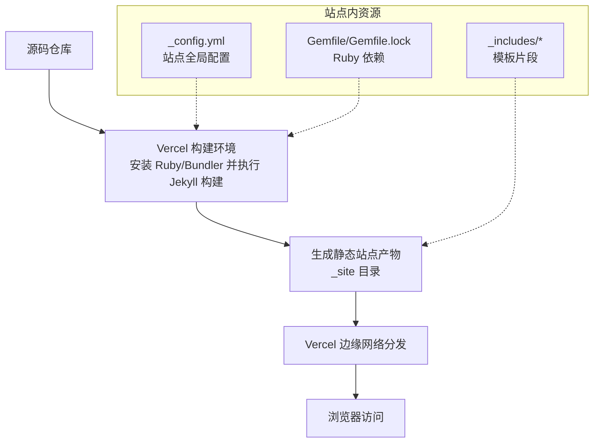
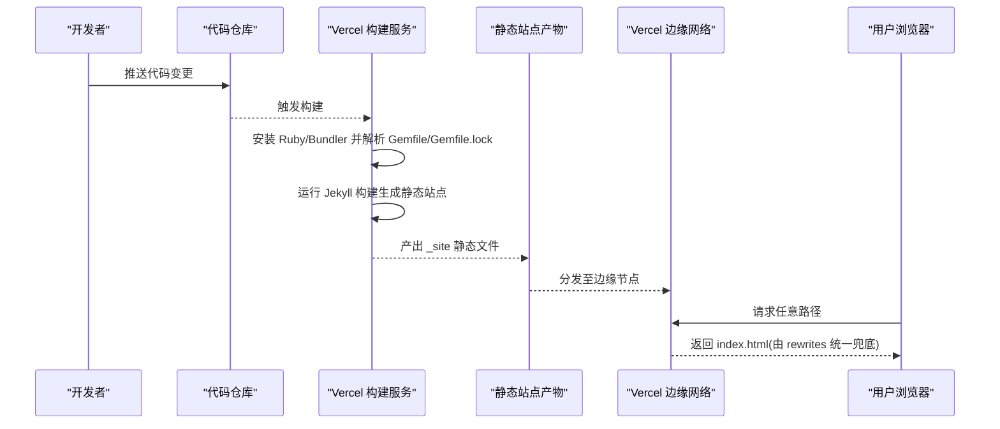
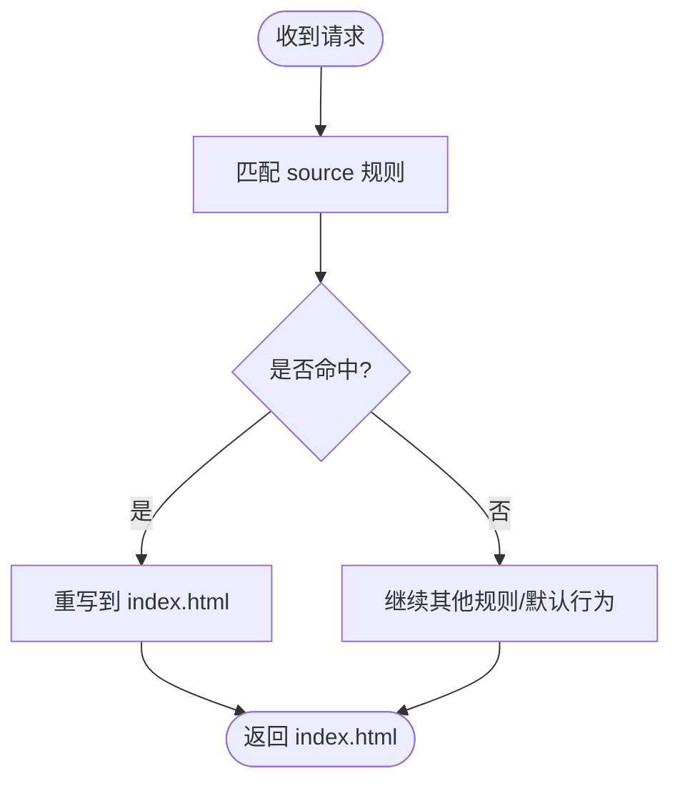
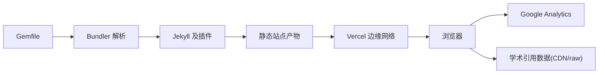

# 部署配置

<cite>
**本文引用的文件**   
- [vercel.json](file://vercel.json)
- [.vercelignore](file://.vercelignore)
- [Gemfile](file://Gemfile)
- [Gemfile.lock](file://Gemfile.lock)
- [_config.yml](file://_config.yml)
- [README.md](file://README.md)
- [run_server.sh](file://run_server.sh)
- [analytics.html](file://_includes/analytics.html)
- [fetch_google_scholar_stats.html](file://_includes/fetch_google_scholar_stats.html)
</cite>

## 目录
1. [简介](#简介)
2. [项目结构](#项目结构)
3. [核心组件](#核心组件)
4. [架构总览](#架构总览)
5. [详细组件分析](#详细组件分析)
6. [依赖关系分析](#依赖关系分析)
7. [性能与构建优化](#性能与构建优化)
8. [故障排查指南](#故障排查指南)
9. [结论](#结论)
10. [附录：GitHub Pages 替代方案与迁移指南](#附录github-pages-替代方案与迁移指南)

## 简介
本文件面向现代化静态站点（基于 Jekyll）的部署平台配置，重点说明在 Vercel 上的部署方式、构建产物路由、忽略规则、Ruby 依赖管理以及可选的 GitHub Pages 替代方案。同时给出自定义域名、SSL 证书与 CDN 加速的配置建议，帮助读者快速完成从本地到生产环境的稳定发布。

## 项目结构
本项目为 Jekyll 静态站点，包含页面内容、主题样式、插件与构建脚本等。关键配置文件如下：
- vercel.json：Vercel 应用级路由重写配置
- .vercelignore：Vercel 构建时忽略的文件/目录
- Gemfile / Gemfile.lock：Ruby 依赖声明与锁定版本
- _config.yml：Jekyll 站点全局配置（含 SEO、Sass、输出格式、插件白名单等）
- README.md：快速开始与环境准备说明
- run_server.sh：本地开发启动脚本
- _includes/analytics.html：Google Analytics 集成片段
- _includes/fetch_google_scholar_stats.html：学术引用数据加载逻辑（支持 CDN 开关）

图表来源
- [vercel.json:1-1](file://vercel.json#L1-L1)
- [_config.yml:144-169](file://_config.yml#L144-L169)
- [Gemfile:17-50](file://Gemfile#L17-L50)
- [Gemfile.lock:30-142](file://Gemfile.lock#L30-L142)

章节来源
- [README.md:33-66](file://README.md#L33-L66)
- [_config.yml:144-169](file://_config.yml#L144-L169)
- [Gemfile:17-50](file://Gemfile#L17-L50)
- [Gemfile.lock:30-142](file://Gemfile.lock#L30-L142)

## 核心组件
- Vercel 路由重写：通过 vercel.json 将所有路径重写到 index.html，实现前端单页路由能力。
- 构建忽略规则：.vercelignore 控制不参与构建的资源，减少上传体积与构建时间。
- Ruby 依赖管理：Gemfile 声明 Jekyll 及其插件；Gemfile.lock 锁定具体版本，保证构建可重现。
- 站点配置：_config.yml 定义站点元信息、Markdown/Sass 处理、输出格式、插件白名单等。
- 分析与统计：analytics.html 注入 Google Analytics；fetch_google_scholar_stats.html 动态拉取学术引用数据，支持 CDN 加速。

章节来源
- [vercel.json:1-1](file://vercel.json#L1-L1)
- [.vercelignore:1-7](file://.vercelignore#L1-L7)
- [Gemfile:17-50](file://Gemfile#L17-L50)
- [Gemfile.lock:30-142](file://Gemfile.lock#L30-L142)
- [_config.yml:144-169](file://_config.yml#L144-L169)
- [analytics.html:1-13](file://_includes/analytics.html#L1-L13)
- [fetch_google_scholar_stats.html:1-19](file://_includes/fetch_google_scholar_stats.html#L1-L19)

## 架构总览
下图展示从源码到用户浏览器的完整流程，包括 Vercel 构建、静态产物分发与前端路由。

图表来源
- [vercel.json:1-1](file://vercel.json#L1-L1)
- [Gemfile:17-50](file://Gemfile#L17-L50)
- [Gemfile.lock:30-142](file://Gemfile.lock#L30-L142)

## 详细组件分析

### Vercel 部署配置（vercel.json）
- 作用：将全部 URL 重写到 index.html，使前端路由（如 SPA 或锚点导航）正常工作。
- 关键点：
  - rewrites.source 使用通配匹配所有路径
  - destination 指向入口文件 index.html
- 适用场景：单页应用、锚点跳转、客户端路由等

图表来源
- [vercel.json:1-1](file://vercel.json#L1-L1)

章节来源
- [vercel.json:1-1](file://vercel.json#L1-L1)

### 构建忽略规则（.vercelignore）
- 目的：排除不必要的目录与文件，降低构建体积、缩短构建时间。
- 常见条目：
  - node_modules：Node 依赖缓存（若未使用 Node 构建也可保留以兼容通用模板）
  - build/dist：历史构建产物
  - .git/.trae/.log/.figma：版本控制与工具缓存
- 建议：
  - 仅保留必要忽略项，避免误删影响构建
  - 结合 CI/CD 缓存策略进一步提升速度

章节来源
- [.vercelignore:1-7](file://.vercelignore#L1-L7)

### Ruby 依赖管理与 Gemfile 配置
- 角色：
  - Gemfile：声明 Jekyll 及插件依赖
  - Gemfile.lock：锁定各 gem 的具体版本，确保构建可重现
- 关键依赖：
  - jekyll 主框架
  - kramdown/kramdown-parser-gfm：Markdown 渲染
  - rouge：语法高亮
  - jekyll-sass-converter：SCSS 编译
  - jekyll-feed/jekyll-sitemap/jekyll-seo-tag/jekyll-paginate/jekyll-gist/jekyll-redirect-from：常用插件
- 注意事项：
  - 保持 Gemfile.lock 与 Gemfile 同步提交
  - 升级前先在本地 bundle update 验证兼容性

章节来源
- [Gemfile:17-50](file://Gemfile#L17-L50)
- [Gemfile.lock:30-142](file://Gemfile.lock#L30-L142)

### Jekyll 站点配置（_config.yml）
- 站点元信息：标题、描述、作者、仓库地址等
- Markdown 与高亮：kramdown 输入模式、GFM 支持、rouge 高亮
- Sass 编译：压缩输出、加载路径
- 输出格式：永久链接、时区
- 插件白名单：whitelist 列表用于兼容 GitHub Pages 安全限制
- 注意：
  - 某些字段（如 google_analytics_id）为空时需按需填写
  - 插件需在 Gemfile 与 _config.yml 中保持一致

章节来源
- [_config.yml:144-169](file://_config.yml#L144-L169)

### 分析与统计集成
- Google Analytics：
  - 通过 analytics.html 注入 gtag.js
  - 需要在 _config.yml 中设置对应 ID 方可生效
- 学术引用数据：
  - fetch_google_scholar_stats.html 根据配置选择数据来源（CDN 或 raw）
  - 可通过 _config.yml 中的开关切换 CDN 以提升国内访问稳定性

章节来源
- [analytics.html:1-13](file://_includes/analytics.html#L1-L13)
- [fetch_google_scholar_stats.html:1-19](file://_includes/fetch_google_scholar_stats.html#L1-L19)
- [_config.yml:144-169](file://_config.yml#L144-L169)

## 依赖关系分析
- 构建期依赖：
  - Ruby + Bundler：解析 Gemfile/Gemfile.lock
  - Jekyll 及插件：负责模板渲染、Sass 编译、SEO/Sitemap 生成
- 运行期依赖：
  - 静态 HTML/CSS/JS：由 Vercel 边缘网络提供
  - 第三方资源：Google Analytics、MathJax、学术引用数据源（raw 或 CDN）

图表来源
- [Gemfile:17-50](file://Gemfile#L17-L50)
- [Gemfile.lock:30-142](file://Gemfile.lock#L30-L142)
- [analytics.html:1-13](file://_includes/analytics.html#L1-L13)
- [fetch_google_scholar_stats.html:1-19](file://_includes/fetch_google_scholar_stats.html#L1-L19)

章节来源
- [Gemfile:17-50](file://Gemfile#L17-L50)
- [Gemfile.lock:30-142](file://Gemfile.lock#L30-L142)

## 性能与构建优化
- 构建阶段
  - 利用 .vercelignore 排除无关目录，减少上传与构建开销
  - 固定 Ruby 与 Jekyll 版本（Gemfile.lock），避免重复下载与编译差异
  - 启用 Sass 压缩输出，减小 CSS 体积
- 运行阶段
  - 使用 CDN 获取学术引用数据，提升首屏加载稳定性
  - 合理配置 rewrites，避免服务端额外计算
- 缓存策略
  - 静态资源开启长期缓存（由 Vercel 默认策略保障）
  - 对频繁变动的 JSON 数据（如引用统计）考虑短缓存或版本号化

[本节为通用指导，不直接分析具体文件]

## 故障排查指南
- 构建失败
  - 检查 Gemfile 与 Gemfile.lock 是否一致，必要时在本地 bundle install 复现
  - 确认 _config.yml 中启用的插件均已声明于 Gemfile
- 路由异常
  - 确认 vercel.json 的 rewrites 已正确指向 index.html
- 统计不可用
  - 检查 _config.yml 中是否填写了 Google Analytics ID
  - 学术引用数据：确认 repository 与分支名称正确，且 CDN/raw 开关符合预期

章节来源
- [Gemfile:17-50](file://Gemfile#L17-L50)
- [Gemfile.lock:30-142](file://Gemfile.lock#L30-L142)
- [_config.yml:144-169](file://_config.yml#L144-L169)
- [vercel.json:1-1](file://vercel.json#L1-L1)
- [analytics.html:1-13](file://_includes/analytics.html#L1-L13)
- [fetch_google_scholar_stats.html:1-19](file://_includes/fetch_google_scholar_stats.html#L1-L19)

## 结论
通过 vercel.json 的路由重写、.vercelignore 的构建优化、Gemfile/Gemfile.lock 的依赖锁定，以及 _config.yml 的站点配置，本项目可在 Vercel 上实现稳定高效的静态站点部署。配合 Google Analytics 与学术引用数据的 CDN 加速，可获得良好的用户体验与可观测性。

[本节为总结性内容，不直接分析具体文件]

## 附录：GitHub Pages 替代方案与迁移指南

### 为什么选择 Vercel
- 更快的全球分发与自动 HTTPS
- 更灵活的构建与路由配置
- 更好的构建缓存与增量构建体验

### 迁移步骤概览
- 在 Vercel 中导入仓库，选择 Jekyll 作为框架
- 确认环境变量与构建命令（通常无需额外命令，Vercel 会自动识别 Jekyll）
- 校验 rewrites 与忽略规则是否符合预期
- 绑定自定义域名并完成 DNS 与 SSL 配置

### 自定义域名与 SSL
- 在 Vercel 控制台添加自定义域名
- 按提示配置 DNS 记录（A/CNAME）
- Vercel 自动签发并续期 Let's Encrypt 证书

### CDN 加速
- 学术引用数据已通过 CDN 开关支持
- 其他静态资源由 Vercel 边缘网络自动加速

### 本地开发与调试
- 使用 run_server.sh 启动本地热重载服务器进行预览
- 修改 _config.yml 后需重启本地服务以生效

章节来源
- [README.md:33-66](file://README.md#L33-L66)
- [run_server.sh:1-1](file://run_server.sh#L1-L1)
- [vercel.json:1-1](file://vercel.json#L1-L1)
- [Gemfile:17-50](file://Gemfile#L17-L50)
- [Gemfile.lock:30-142](file://Gemfile.lock#L30-L142)
- [_config.yml:144-169](file://_config.yml#L144-L169)
- [fetch_google_scholar_stats.html:1-19](file://_includes/fetch_google_scholar_stats.html#L1-L19)