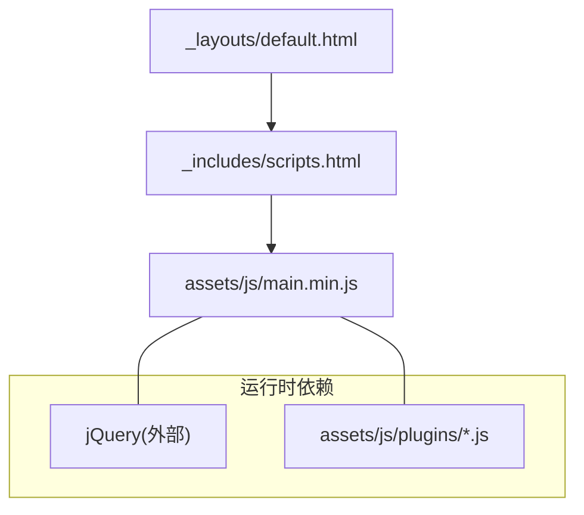
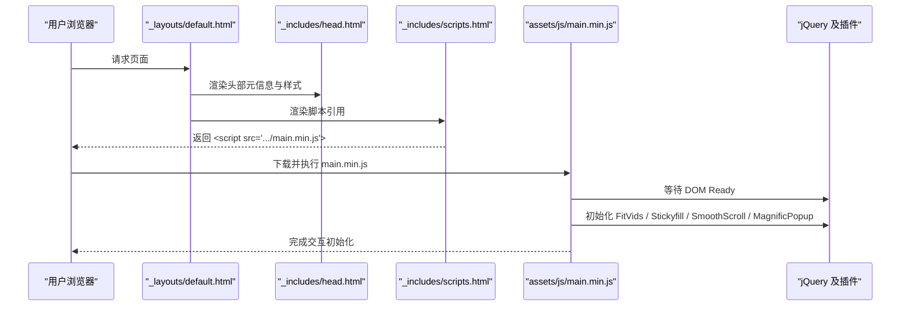
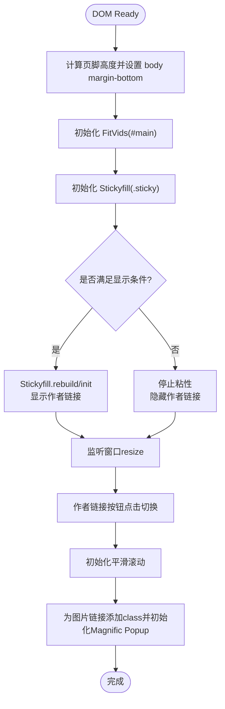
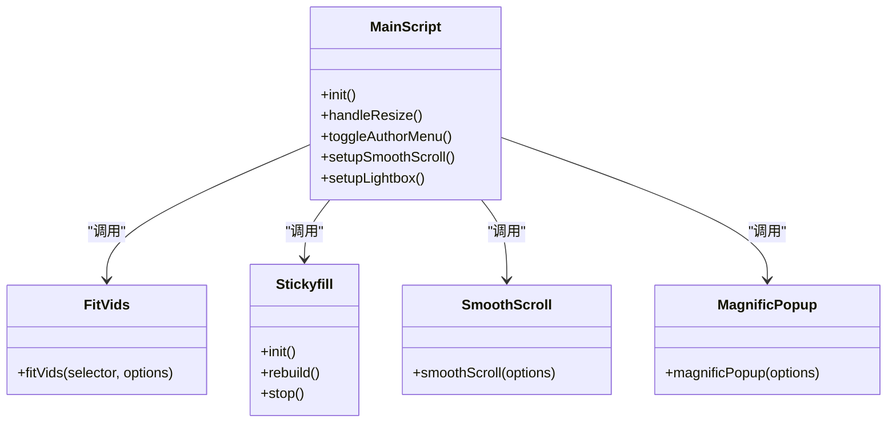
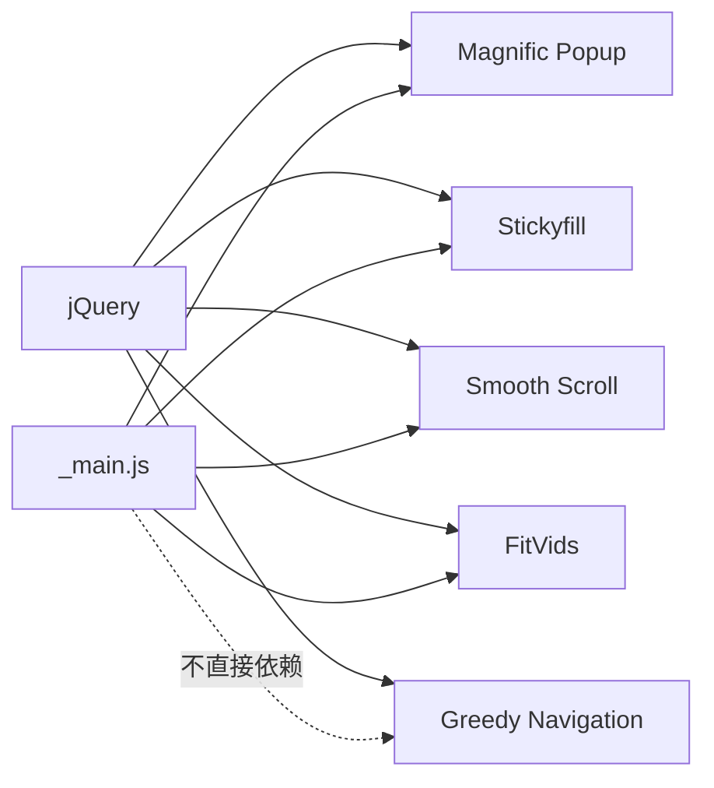

# JavaScript 开发指南

<cite>
**本文引用的文件**   
- [assets/js/_main.js](file://assets/js/_main.js)
- [assets/js/collapse.js](file://assets/js/collapse.js)
- [assets/js/plugins/jquery.fitvids.js](file://assets/js/plugins/jquery.fitvids.js)
- [assets/js/plugins/jquery.greedy-navigation.js](file://assets/js/plugins/jquery.greedy-navigation.js)
- [assets/js/plugins/jquery.magnific-popup.js](file://assets/js/plugins/jquery.magnific-popup.js)
- [assets/js/plugins/jquery.smooth-scroll.min.js](file://assets/js/plugins/jquery.smooth-scroll.min.js)
- [assets/js/plugins/stickyfill.min.js](file://assets/js/plugins/stickyfill.min.js)
- [_includes/scripts.html](file://_includes/scripts.html)
- [_includes/head.html](file://_includes/head.html)
- [_layouts/default.html](file://_layouts/default.html)
- [_config.yml](file://_config.yml)
</cite>

## 目录
1. [简介](#简介)
2. [项目结构](#项目结构)
3. [核心组件](#核心组件)
4. [架构总览](#架构总览)
5. [详细组件分析](#详细组件分析)
6. [依赖关系分析](#依赖关系分析)
7. [性能与加载优化](#性能与加载优化)
8. [调试与常见问题](#调试与常见问题)
9. [结论](#结论)
10. [附录：环境与工具配置](#附录：环境与工具配置)

## 简介
本指南面向开发者，系统化梳理本项目的前端脚本组织方式、模块化设计、主脚本 _main.js 的功能实现与事件处理机制，详解 jQuery 插件的使用方法与自定义交互开发。同时提供响应式设计与移动端适配最佳实践、脚本加载优化与性能调优策略、调试技巧与常见问题解决方案，以及为新开发者准备的完整 JavaScript 开发与工具配置建议。

## 项目结构
前端脚本位于 assets/js 目录，采用“业务脚本 + 第三方插件”的清晰分层：
- 业务脚本
  - assets/js/_main.js：站点级初始化与交互编排（粘性页脚、视频自适应、侧边栏粘性、平滑滚动、图片灯箱等）
  - assets/js/collapse.js：简单的折叠/展开交互
- 第三方插件
  - assets/js/plugins/jquery.fitvids.js：响应式视频容器
  - assets/js/plugins/jquery.greedy-navigation.js：导航项按需隐藏与下拉切换
  - assets/js/plugins/jquery.magnific-popup.js：图片灯箱
  - assets/js/plugins/jquery.smooth-scroll.min.js：平滑滚动
  - assets/js/plugins/stickyfill.min.js：position: sticky polyfill
- 页面模板与引入
  - _includes/head.html：注入 viewport 与 no-js/js 类名切换
  - _includes/scripts.html：统一引入生产构建产物 main.min.js
  - _layouts/default.html：在 body 末尾引入 scripts.html
  - _config.yml：Jekyll 构建时排除源码目录，仅输出压缩后的 main.min.js

图表来源
- [_layouts/default.html:1-34](file://_layouts/default.html#L1-L34)
- [_includes/scripts.html:1-1](file://_includes/scripts.html#L1-L1)

章节来源
- [_layouts/default.html:1-34](file://_layouts/default.html#L1-L34)
- [_includes/scripts.html:1-1](file://_includes/scripts.html#L1-L1)
- [_includes/head.html:1-16](file://_includes/head.html#L1-L16)
- [_config.yml:84-86](file://_config.yml#L84-L86)

## 核心组件
- 主脚本 assets/js/_main.js
  - 负责站点级初始化：粘性页脚、FitVids 视频自适应、Stickyfill 侧边栏粘性、作者链接下拉菜单、平滑滚动、图片灯箱等
  - 通过 $(document).ready 确保 DOM 就绪后执行
  - 使用窗口 resize 事件驱动布局重算与 UI 状态更新
- 折叠交互 assets/js/collapse.js
  - 为 .header 元素绑定点击事件，切换下一个兄弟元素的显示/隐藏，并动态修改标题文本
- 第三方插件
  - FitVids：自动计算宽高比，包裹视频元素以实现响应式
  - Stickyfill：在不支持 position: sticky 的浏览器中模拟粘性定位
  - Magnific Popup：图片灯箱，支持画廊、预加载、动画与回调
  - Smooth Scroll：锚点平滑滚动
  - Greedy Navigation：导航项根据可用空间自动折叠到下拉列表

章节来源
- [assets/js/_main.js:1-99](file://assets/js/_main.js#L1-L99)
- [assets/js/collapse.js:1-17](file://assets/js/collapse.js#L1-L17)
- [assets/js/plugins/jquery.fitvids.js:1-82](file://assets/js/plugins/jquery.fitvids.js#L1-L82)
- [assets/js/plugins/jquery.magnific-popup.js:1-800](file://assets/js/plugins/jquery.magnific-popup.js#L1-L800)
- [assets/js/plugins/jquery.smooth-scroll.min.js:1-9](file://assets/js/plugins/jquery.smooth-scroll.min.js#L1-L9)
- [assets/js/plugins/stickyfill.min.js:1-8](file://assets/js/plugins/stickyfill.min.js#L1-L8)
- [assets/js/plugins/jquery.greedy-navigation.js:1-72](file://assets/js/plugins/jquery.greedy-navigation.js#L1-L72)

## 架构总览
整体运行流程：
- 页面模板 default.html 包含 head.html 与 scripts.html
- head.html 设置 viewport 与 JS 能力检测（no-js -> js）
- scripts.html 引入 main.min.js（由构建流程生成）
- main.min.js 在 DOM 就绪后初始化各功能模块，依赖 jQuery 与各插件

图表来源
- [_layouts/default.html:1-34](file://_layouts/default.html#L1-L34)
- [_includes/head.html:1-16](file://_includes/head.html#L1-L16)
- [_includes/scripts.html:1-1](file://_includes/scripts.html#L1-L1)
- [assets/js/_main.js:1-99](file://assets/js/_main.js#L1-L99)

## 详细组件分析

### 主脚本 _main.js 分析与事件流
职责概览
- 粘性页脚：根据页脚高度动态设置 body 底部外边距，避免内容被遮挡
- 视频自适应：对 #main 区域启用 FitVids，使嵌入视频按比例缩放
- 侧边栏粘性：使用 Stickyfill 实现作者信息区在滚动时的粘性效果，并在窗口尺寸变化时重建
- 作者链接下拉：在小屏下通过按钮切换展示/隐藏
- 平滑滚动：为所有 a 标签启用平滑滚动，偏移量 -20 以避开顶部固定区域
- 图片灯箱：为图片链接添加 class，并初始化 Magnific Popup，开启画廊与预加载

关键事件与生命周期
- $(document).ready：集中初始化
- window.resize：触发粘性侧边栏重建与显示控制
- 点击事件：作者链接按钮切换下拉菜单
- 插件回调：Magnific Popup 的 beforeOpen 钩子用于注入动画类

图表来源
- [assets/js/_main.js:1-99](file://assets/js/_main.js#L1-L99)

章节来源
- [assets/js/_main.js:1-99](file://assets/js/_main.js#L1-L99)

#### 对象与关系图（主脚本与插件）

图表来源
- [assets/js/_main.js:1-99](file://assets/js/_main.js#L1-L99)
- [assets/js/plugins/jquery.fitvids.js:1-82](file://assets/js/plugins/jquery.fitvids.js#L1-L82)
- [assets/js/plugins/stickyfill.min.js:1-8](file://assets/js/plugins/stickyfill.min.js#L1-L8)
- [assets/js/plugins/jquery.smooth-scroll.min.js:1-9](file://assets/js/plugins/jquery.smooth-scroll.min.js#L1-L9)
- [assets/js/plugins/jquery.magnific-popup.js:1-800](file://assets/js/plugins/jquery.magnific-popup.js#L1-L800)

### 折叠交互 collapse.js
- 行为：点击 .header 元素，切换其下一个兄弟元素的显示/隐藏，并根据可见性更新标题文本
- 适用场景：FAQ、可折叠区块等
- 注意：若使用动态插入的内容，需考虑事件委托或重新绑定

章节来源
- [assets/js/collapse.js:1-17](file://assets/js/collapse.js#L1-L17)

### 插件用法与集成要点
- FitVids
  - 选择器：#main
  - 作用：将视频元素包裹为流体宽度容器，保持纵横比
  - 参考路径：[assets/js/_main.js:24](file://assets/js/_main.js#L24)、[assets/js/plugins/jquery.fitvids.js:1-82](file://assets/js/plugins/jquery.fitvids.js#L1-L82)
- Stickyfill
  - 选择器：.sticky
  - 作用：polyfill position: sticky；在窗口尺寸变化时 rebuild/init
  - 参考路径：[assets/js/_main.js:27-47](file://assets/js/_main.js#L27-L47)、[assets/js/plugins/stickyfill.min.js:1-8](file://assets/js/plugins/stickyfill.min.js#L1-L8)
- Smooth Scroll
  - 全局 a 标签启用，offset: -20
  - 参考路径：[assets/js/_main.js:61](file://assets/js/_main.js#L61)、[assets/js/plugins/jquery.smooth-scroll.min.js:1-9](file://assets/js/plugins/jquery.smooth-scroll.min.js#L1-L9)
- Magnific Popup
  - 为图片链接添加 image-popup 类，初始化 gallery、preload、动画与错误提示
  - 参考路径：[assets/js/_main.js:64-96](file://assets/js/_main.js#L64-L96)、[assets/js/plugins/jquery.magnific-popup.js:1-800](file://assets/js/plugins/jquery.magnific-popup.js#L1-L800)
- Greedy Navigation
  - 根据导航可用空间移动链接至可见/隐藏列表，并提供下拉切换
  - 参考路径：[assets/js/plugins/jquery.greedy-navigation.js:1-72](file://assets/js/plugins/jquery.greedy-navigation.js#L1-L72)

章节来源
- [assets/js/_main.js:24-96](file://assets/js/_main.js#L24-L96)
- [assets/js/plugins/jquery.fitvids.js:1-82](file://assets/js/plugins/jquery.fitvids.js#L1-L82)
- [assets/js/plugins/stickyfill.min.js:1-8](file://assets/js/plugins/stickyfill.min.js#L1-L8)
- [assets/js/plugins/jquery.smooth-scroll.min.js:1-9](file://assets/js/plugins/jquery.smooth-scroll.min.js#L1-L9)
- [assets/js/plugins/jquery.magnific-popup.js:1-800](file://assets/js/plugins/jquery.magnific-popup.js#L1-L800)
- [assets/js/plugins/jquery.greedy-navigation.js:1-72](file://assets/js/plugins/jquery.greedy-navigation.js#L1-L72)

## 依赖关系分析
- 运行时依赖
  - jQuery：所有插件均基于 jQuery API
  - 插件库：FitVids、Stickyfill、Magnific Popup、Smooth Scroll、Greedy Navigation
- 构建期依赖
  - Jekyll 构建时排除源码目录（_main.js、plugins、vendor），仅输出 main.min.js
  - 页面模板通过相对路径引入 main.min.js

图表来源
- [assets/js/_main.js:1-99](file://assets/js/_main.js#L1-L99)
- [assets/js/plugins/jquery.magnific-popup.js:1-800](file://assets/js/plugins/jquery.magnific-popup.js#L1-L800)
- [assets/js/plugins/stickyfill.min.js:1-8](file://assets/js/plugins/stickyfill.min.js#L1-L8)
- [assets/js/plugins/jquery.smooth-scroll.min.js:1-9](file://assets/js/plugins/jquery.smooth-scroll.min.js#L1-L9)
- [assets/js/plugins/jquery.fitvids.js:1-82](file://assets/js/plugins/jquery.fitvids.js#L1-L82)
- [assets/js/plugins/jquery.greedy-navigation.js:1-72](file://assets/js/plugins/jquery.greedy-navigation.js#L1-L72)

章节来源
- [_config.yml:84-86](file://_config.yml#L84-L86)
- [_includes/scripts.html:1-1](file://_includes/scripts.html#L1-L1)

## 性能与加载优化
- 脚本加载顺序与位置
  - 将 main.min.js 放在 </body> 前，减少阻塞首屏渲染
  - 当前模板已在 body 末尾引入，符合最佳实践
- 资源压缩与合并
  - 构建阶段输出 main.min.js，减小体积与请求数
  - 建议进一步合并 CSS 与 JS，启用 Gzip/Brotli 压缩
- 按需加载与延迟初始化
  - 对非首屏交互（如灯箱）可采用懒加载或仅在需要时初始化
  - 对于大图或视频，优先使用懒加载与占位图
- 事件节流与防抖
  - 窗口 resize 事件已使用轮询标记，建议改为 requestAnimationFrame 或节流函数，降低高频回调开销
- 缓存与版本化
  - 为静态资源添加版本号或指纹，配合 CDN 缓存策略
- 移动端优化
  - 合理设置 viewport，避免过度重排重绘
  - 谨慎使用复杂动画，必要时降级为 CSS transform 或硬件加速

章节来源
- [_layouts/default.html:30-30](file://_layouts/default.html#L30-L30)
- [_includes/scripts.html:1-1](file://_includes/scripts.html#L1-L1)
- [assets/js/_main.js:14-22](file://assets/js/_main.js#L14-L22)

## 调试与常见问题
- 控制台报错 “$ is not defined”
  - 原因：jQuery 未正确加载或加载顺序错误
  - 排查：确认 main.min.js 之前已引入 jQuery；检查网络面板是否有 404
- 灯箱无法打开或图片不显示
  - 原因：图片链接缺少 image-popup 类或未匹配扩展名
  - 排查：检查 a 标签 href 后缀与 class 是否正确；查看 Magnific Popup 的错误回调
- 侧边栏粘性失效
  - 原因：父容器定位或高度异常；浏览器不支持 sticky
  - 排查：确认 .sticky 父级有合适的高度与定位上下文；检查 Stickyfill 是否初始化成功
- 视频比例错乱
  - 原因：视频元素未包含在 #main 或已被其他样式覆盖
  - 排查：确认 FitVids 选择器范围与 CSS 优先级
- 平滑滚动偏移不正确
  - 原因：顶部固定区域高度变化或 offset 值不合适
  - 排查：调整 smoothScroll 的 offset 参数，或在滚动目标处增加 padding-top
- 导航下拉不出现
  - 原因：页面缺少 site-nav 相关结构或按钮不可见
  - 排查：检查 HTML 结构与 Greedy Navigation 的选择器匹配

章节来源
- [assets/js/_main.js:64-96](file://assets/js/_main.js#L64-L96)
- [assets/js/_main.js:27-47](file://assets/js/_main.js#L27-L47)
- [assets/js/_main.js:24-24](file://assets/js/_main.js#L24-L24)
- [assets/js/_main.js:61-61](file://assets/js/_main.js#L61-L61)
- [assets/js/plugins/jquery.greedy-navigation.js:1-72](file://assets/js/plugins/jquery.greedy-navigation.js#L1-L72)

## 结论
本项目采用清晰的脚本分层与插件化架构，主脚本 _main.js 作为协调者，整合多个 jQuery 插件实现响应式与交互增强。通过合理的模板引入与构建排除策略，实现了生产环境的精简与高效。建议在后续迭代中进一步优化事件处理性能、按需加载与资源缓存策略，以提升用户体验与可维护性。

## 附录：环境与工具配置
- 本地开发环境
  - 安装 Ruby 与 Jekyll，按仓库说明启动本地服务
  - 如需修改 JS，先编辑 assets/js/_main.js 与 plugins 下的源文件
- 构建与发布
  - Jekyll 构建时会排除源码目录（_main.js、plugins、vendor），仅输出 main.min.js
  - 请确保在部署前完成 JS 的压缩与合并，生成 main.min.js 并放置于 assets/js 根目录
- 推荐工具链
  - 代码质量：ESLint、Prettier
  - 构建与打包：Webpack/Vite/Gulp（可选）
  - 测试：Jest（针对逻辑模块）、Playwright/Cypress（端到端）
  - 性能分析：Chrome DevTools Lighthouse、WebPageTest

章节来源
- [_config.yml:84-86](file://_config.yml#L84-L86)
- [_includes/scripts.html:1-1](file://_includes/scripts.html#L1-L1)