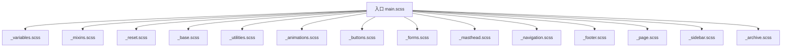
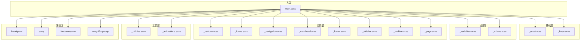
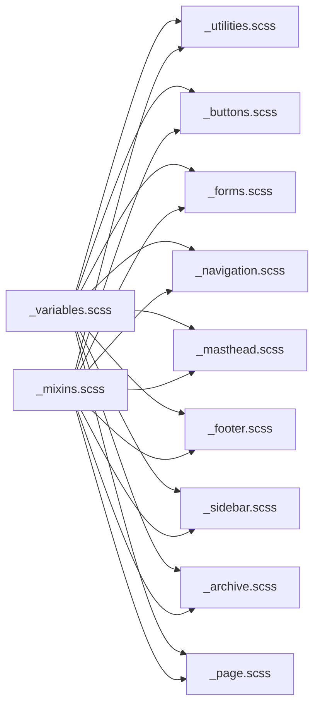

# Sass 样式开发

<cite>
**本文引用的文件**   
- [assets/css/main.scss](file://assets/css/main.scss)
- [_sass/_variables.scss](file://_sass/_variables.scss)
- [_sass/_mixins.scss](file://_sass/_mixins.scss)
- [_sass/_reset.scss](file://_sass/_reset.scss)
- [_sass/_base.scss](file://_sass/_base.scss)
- [_sass/_utilities.scss](file://_sass/_utilities.scss)
- [_sass/_animations.scss](file://_sass/_animations.scss)
- [_sass/_buttons.scss](file://_sass/_buttons.scss)
- [_sass/_forms.scss](file://_sass/_forms.scss)
- [_sass/_masthead.scss](file://_sass/_masthead.scss)
- [_sass/_navigation.scss](file://_sass/_navigation.scss)
- [_sass/_footer.scss](file://_sass/_footer.scss)
- [_sass/_page.scss](file://_sass/_page.scss)
- [_sass/_sidebar.scss](file://_sass/_sidebar.scss)
- [_sass/_archive.scss](file://_sass/_archive.scss)
</cite>

## 目录
1. [简介](#简介)
2. [项目结构](#项目结构)
3. [核心组件](#核心组件)
4. [架构总览](#架构总览)
5. [详细组件分析](#详细组件分析)
6. [依赖关系分析](#依赖关系分析)
7. [性能与构建优化](#性能与构建优化)
8. [故障排查指南](#故障排查指南)
9. [结论](#结论)
10. [附录：主题定制与最佳实践](#附录：主题定制与最佳实践)

## 简介
本指南面向开发者，系统化阐述该 Jekyll 主题的 Sass 模块化架构、变量系统（颜色主题、字体、断点）、mixin 与函数使用、样式复用与组件化实践，以及现代布局（Flexbox、CSS Grid）的实现方式。同时覆盖样式编译流程、构建优化策略、浏览器兼容性与性能优化技巧，帮助新开发者快速上手并高效定制主题。

## 项目结构
Sass 采用“入口聚合 + 模块拆分”的组织方式：
- 入口聚合：assets/css/main.scss 统一引入 vendor、基础层、业务模块与第三方库。
- 基础层：_reset.scss、_base.scss 提供重置与全局基础样式。
- 设计令牌：_variables.scss 集中管理颜色、字体、断点、网格等。
- 工具与复用：_mixins.scss 提供通用 mixin 与函数；_utilities.scss 提供常用工具类。
- 组件与页面：按钮、表单、导航、页眉、页脚、侧边栏、归档、单页等各自独立文件。
- 动画与打印：_animations.scss、_print.scss 提供动效与打印适配。

图表来源
- [assets/css/main.scss:1-38](file://assets/css/main.scss#L1-L38)
- [_sass/_variables.scss:1-158](file://_sass/_variables.scss#L1-L158)
- [_sass/_mixins.scss:1-53](file://_sass/_mixins.scss#L1-L53)
- [_sass/_reset.scss:1-82](file://_sass/_reset.scss#L1-L82)
- [_sass/_base.scss:1-323](file://_sass/_base.scss#L1-L323)
- [_sass/_utilities.scss:1-471](file://_sass/_utilities.scss#L1-L471)
- [_sass/_animations.scss:1-21](file://_sass/_animations.scss#L1-L21)
- [_sass/_buttons.scss:1-153](file://_sass/_buttons.scss#L1-L153)
- [_sass/_forms.scss:1-391](file://_sass/_forms.scss#L1-L391)
- [_sass/_masthead.scss:1-65](file://_sass/_masthead.scss#L1-L65)
- [_sass/_navigation.scss:1-432](file://_sass/_navigation.scss#L1-L432)
- [_sass/_footer.scss:1-93](file://_sass/_footer.scss#L1-L93)
- [_sass/_page.scss:1-413](file://_sass/_page.scss#L1-L413)
- [_sass/_sidebar.scss:1-277](file://_sass/_sidebar.scss#L1-L277)
- [_sass/_archive.scss:134-203](file://_sass/_archive.scss#L134-L203)

章节来源
- [assets/css/main.scss:1-38](file://assets/css/main.scss#L1-L38)

## 核心组件
- 设计令牌（Variables）
  - 字体与字号：全局字体族、标题字体族、字号阶梯、行高与段落缩进开关。
  - 颜色体系：灰阶、主色、成功/警告/危险/信息色、品牌色、链接色及其衍生态。
  - 响应式断点：small/medium/large/x-large 等断点变量，并通过 breakpoint-set 配置 em 单位输出。
  - 网格系统：Susy 配置（列数、列宽、gutters、容器宽度、输出模式等）。
- 工具与复用（Mixins & Functions）
  - em 函数：将目标像素值按上下文基准换算为 em。
  - clearfix mixin：用于清除浮动，避免父容器高度塌陷。
- 基础与重置（Reset & Base）
  - 盒模型、选择器、HTML5 元素显示、链接焦点态、代码块样式、列表与引用等基础规则。
- 组件与页面
  - 按钮：默认、反色、轮廓、语义色、尺寸变体、禁用态、社交按钮集合。
  - 表单：输入控件、标签、辅助文本、加载态、搜索框等。
  - 导航：面包屑、分页、优先+导航、目录导航等。
  - 页眉/页脚/侧边栏/归档/单页：各区域布局与交互样式。
- 实用工具（Utilities）
  - 可见性、对齐、图标、粘性定位、模态、脚注等常用工具类。
- 动画与打印
  - 淡入动画 keyframes；打印样式在 print 模块中定义。

章节来源
- [_sass/_variables.scss:1-158](file://_sass/_variables.scss#L1-L158)
- [_sass/_mixins.scss:1-53](file://_sass/_mixins.scss#L1-L53)
- [_sass/_reset.scss:1-82](file://_sass/_reset.scss#L1-L82)
- [_sass/_base.scss:1-323](file://_sass/_base.scss#L1-L323)
- [_sass/_buttons.scss:1-153](file://_sass/_buttons.scss#L1-L153)
- [_sass/_forms.scss:1-391](file://_sass/_forms.scss#L1-L391)
- [_sass/_navigation.scss:1-432](file://_sass/_navigation.scss#L1-L432)
- [_sass/_masthead.scss:1-65](file://_sass/_masthead.scss#L1-L65)
- [_sass/_footer.scss:1-93](file://_sass/_footer.scss#L1-L93)
- [_sass/_sidebar.scss:1-277](file://_sass/_sidebar.scss#L1-L277)
- [_sass/_archive.scss:134-203](file://_sass/_archive.scss#L134-L203)
- [_sass/_utilities.scss:1-471](file://_sass/_utilities.scss#L1-L471)
- [_sass/_animations.scss:1-21](file://_sass/_animations.scss#L1-L21)

## 架构总览
整体架构遵循“分层 + 组合”的模块化思想：
- 入口层：main.scss 负责导入顺序与依赖编排。
- 基础层：reset/base 提供跨浏览器一致性与全局基础。
- 设计层：variables/mixins 抽象设计令牌与可复用逻辑。
- 组件层：按钮、表单、导航、页眉、页脚、侧边栏、归档、单页等。
- 工具层：utilities 提供原子化能力，便于组合。
- 扩展层：vendor 第三方库（Breakpoint、Susy、Font Awesome、Magnific Popup）。

图表来源
- [assets/css/main.scss:1-38](file://assets/css/main.scss#L1-L38)
- [_sass/_variables.scss:1-158](file://_sass/_variables.scss#L1-L158)
- [_sass/_mixins.scss:1-53](file://_sass/_mixins.scss#L1-L53)
- [_sass/_reset.scss:1-82](file://_sass/_reset.scss#L1-L82)
- [_sass/_base.scss:1-323](file://_sass/_base.scss#L1-L323)
- [_sass/_utilities.scss:1-471](file://_sass/_utilities.scss#L1-L471)
- [_sass/_animations.scss:1-21](file://_sass/_animations.scss#L1-L21)
- [_sass/_buttons.scss:1-153](file://_sass/_buttons.scss#L1-L153)
- [_sass/_forms.scss:1-391](file://_sass/_forms.scss#L1-L391)
- [_sass/_navigation.scss:1-432](file://_sass/_navigation.scss#L1-L432)
- [_sass/_masthead.scss:1-65](file://_sass/_masthead.scss#L1-L65)
- [_sass/_footer.scss:1-93](file://_sass/_footer.scss#L1-L93)
- [_sass/_sidebar.scss:1-277](file://_sass/_sidebar.scss#L1-L277)
- [_sass/_archive.scss:134-203](file://_sass/_archive.scss#L134-L203)
- [_sass/_page.scss:1-413](file://_sass/_page.scss#L1-L413)

## 详细组件分析

### 变量系统与主题定制
- 字体与排版
  - 通过全局字体族、标题字体族、字号阶梯控制整体排版节奏。
  - 段落缩进可通过布尔开关控制是否启用相邻段落的缩进。
- 颜色主题
  - 灰阶与主色构成中性与强调色的基础；语义色（成功/警告/危险/信息）用于状态反馈。
  - 品牌色覆盖主流社交平台，便于统一视觉。
  - 链接色与其 hover/visited 派生色保证可读性与一致性。
- 响应式断点
  - 使用 breakpoint-set 将媒体查询单位设置为 em，提升可访问性与缩放体验。
  - small/medium/large/x-large 作为主要断点，贯穿各组件。
- 网格系统（Susy）
  - 12 列栅格、流体数学计算、after gutter 位置、容器最大宽度与 border-box 全局盒模型。
  - 通过 span/prefix/suffix/gallery 等 mixin 实现复杂布局。

章节来源
- [_sass/_variables.scss:1-158](file://_sass/_variables.scss#L1-L158)

### Mixin 与函数
- em 函数
  - 以文档根字号为上下文，将 px 转换为 em，确保可缩放与无障碍友好。
- clearfix mixin
  - 基于伪元素生成内容，解决浮动导致的父容器高度塌陷问题。

章节来源
- [_sass/_mixins.scss:1-53](file://_sass/_mixins.scss#L1-L53)

### 基础与重置
- 盒模型与选择器
  - 全局 border-box，消除不同浏览器差异。
- 链接与焦点态
  - 统一的 focus 样式，提升键盘可达性。
- 代码与引用
  - 代码块背景、边框、圆角与阴影；引用块左侧强调线与作者标记。
- 媒体与嵌入
  - figure 使用 Flex 布局，图片自适应与过渡效果。

章节来源
- [_sass/_reset.scss:1-82](file://_sass/_reset.scss#L1-L82)
- [_sass/_base.scss:1-323](file://_sass/_base.scss#L1-L323)

### 按钮组件
- 变体
  - 默认、反色、轮廓、语义色（info/warning/success/danger）、禁用态。
  - 尺寸变体（x-large/large/small），支持块级按钮。
- 社交按钮
  - 通过变量映射批量生成各平台按钮样式。

章节来源
- [_sass/_buttons.scss:1-153](file://_sass/_buttons.scss#L1-L153)

### 表单组件
- 输入控件
  - 统一 box-sizing、字体、边框、圆角与阴影；hover/focus 状态清晰。
- 辅助与状态
  - help-block/help-inline 提示文本；disabled/readonly 禁用态。
- 特殊场景
  - form--loading 遮罩与 spinner；Google 搜索表单样式。

章节来源
- [_sass/_forms.scss:1-391](file://_sass/_forms.scss#L1-L391)

### 导航与分页
- 面包屑与分页
  - 使用 Susy 进行分栏与间距控制；当前页与禁用态区分明确。
- 优先+导航
  - 小屏下隐藏多余项，点击展开下拉菜单；悬停下划线动效。
- 目录导航
  - 层级缩进与小屏隐藏子级，提升移动端阅读体验。

章节来源
- [_sass/_navigation.scss:1-432](file://_sass/_navigation.scss#L1-L432)

### 页眉与页脚
- 页眉
  - sticky 固定顶部，内部容器与导航联动，大尺寸屏幕限制最大宽度。
- 页脚
  - 粘性页脚修复、版权与社交关注区，图标颜色与链接样式统一。

章节来源
- [_sass/_masthead.scss:1-65](file://_sass/_masthead.scss#L1-L65)
- [_sass/_footer.scss:1-93](file://_sass/_footer.scss#L1-L93)

### 侧边栏与归档
- 侧边栏
  - 大屏分栏布局，作者头像与信息在不同断点下的展示切换。
- 归档
  - 使用 gallery 与 span 实现多列卡片布局，图片高度与摘要在小屏调整。

章节来源
- [_sass/_sidebar.scss:1-277](file://_sass/_sidebar.scss#L1-L277)
- [_sass/_archive.scss:134-203](file://_sass/_archive.scss#L134-L203)

### 单页与评论
- 单页
  - 主内容区容器、标题与元信息、分享区、相关条目等。
- 评论
  - 头像与内容左右布局，大屏下尺寸与间距调整。

章节来源
- [_sass/_page.scss:1-413](file://_sass/_page.scss#L1-L413)

### 实用工具与动画
- 工具类
  - 可见性、对齐、图标、粘性定位、模态、脚注等高频能力。
- 动画
  - intro 淡入 keyframes，配合 animation-delay 实现渐进呈现。

章节来源
- [_sass/_utilities.scss:1-471](file://_sass/_utilities.scss#L1-L471)
- [_sass/_animations.scss:1-21](file://_sass/_animations.scss#L1-L21)

### 现代布局：Flexbox 与 CSS Grid
- Flexbox 应用
  - 论文卡片、技术栈标签、博客元信息等采用 flex 布局，结合 gap 与 align-items 实现简洁排列。
- CSS Grid 应用
  - 特性网格、书籍统计看板、分类卡片网格等使用 grid-template-columns 与 auto-fit/minmax 实现自适应布局。
- 响应式适配
  - 针对小屏设备调整列数与方向，保证可读性与触控体验。

章节来源
- [assets/css/main.scss:45-248](file://assets/css/main.scss#L45-L248)
- [assets/css/main.scss:348-465](file://assets/css/main.scss#L348-L465)
- [assets/css/main.scss:572-592](file://assets/css/main.scss#L572-L592)

### 样式编译流程与构建优化
- 编译入口
  - assets/css/main.scss 作为唯一入口，按依赖顺序引入各模块与第三方库。
- 依赖顺序建议
  - 先引入 Breakpoint/Susy 等工具，再引入 variables/mixins，最后引入组件与页面样式。
- 构建优化建议
  - 生产环境启用压缩与去重；按需引入第三方库以减少体积；合理使用 !default 变量便于覆盖。
- 调试与可视化
  - Susy 开启 debug 可叠加网格线，便于布局调试（注释示例已给出）。

章节来源
- [assets/css/main.scss:1-38](file://assets/css/main.scss#L1-L38)
- [_sass/_variables.scss:131-146](file://_sass/_variables.scss#L131-L146)

### 浏览器兼容性与可访问性
- 兼容性
  - 使用 vendor prefix 与旧语法兼容（如 -webkit-transform、-ms-interpolation-mode）。
  - 通过 breakpoint-set 输出 em 单位，提升缩放体验。
- 可访问性
  - 链接 focus 态、screen-reader-text 工具类、skip-link 跳转、aria 友好的结构建议。

章节来源
- [_sass/_mixins.scss:1-53](file://_sass/_mixins.scss#L1-L53)
- [_sass/_utilities.scss:26-61](file://_sass/_utilities.scss#L26-L61)
- [_sass/_variables.scss:108-121](file://_sass/_variables.scss#L108-L121)

## 依赖关系分析
- 直接依赖
  - main.scss 依赖 Breakpoint、Susy、Font Awesome、Magnific Popup 等第三方库。
  - 各组件依赖 _variables.scss 与 _mixins.scss 提供的令牌与工具。
- 间接依赖
  - 组件间通过变量与 mixin 形成松耦合；页面布局通过 Susy 的 span/gallery 组合。
- 潜在循环
  - 当前结构无循环依赖风险，入口文件承担编排职责。

图表来源
- [_sass/_variables.scss:1-158](file://_sass/_variables.scss#L1-L158)
- [_sass/_mixins.scss:1-53](file://_sass/_mixins.scss#L1-L53)
- [_sass/_utilities.scss:1-471](file://_sass/_utilities.scss#L1-L471)
- [_sass/_buttons.scss:1-153](file://_sass/_buttons.scss#L1-L153)
- [_sass/_forms.scss:1-391](file://_sass/_forms.scss#L1-L391)
- [_sass/_navigation.scss:1-432](file://_sass/_navigation.scss#L1-L432)
- [_sass/_masthead.scss:1-65](file://_sass/_masthead.scss#L1-L65)
- [_sass/_footer.scss:1-93](file://_sass/_footer.scss#L1-L93)
- [_sass/_sidebar.scss:1-277](file://_sass/_sidebar.scss#L1-L277)
- [_sass/_archive.scss:134-203](file://_sass/_archive.scss#L134-L203)
- [_sass/_page.scss:1-413](file://_sass/_page.scss#L1-L413)

章节来源
- [assets/css/main.scss:1-38](file://assets/css/main.scss#L1-L38)

## 性能与构建优化
- 减少重复与冗余
  - 尽量复用变量与 mixin，避免硬编码数值。
- 合理组织 import
  - 将公共依赖前置，避免重复加载；按需引入第三方库。
- 使用现代布局
  - 优先使用 Flexbox/Grid，减少 float 与 hack，降低渲染成本。
- 动画与过渡
  - 谨慎使用 transform/opacity 等 GPU 加速属性；避免过度动画。
- 资源与字体
  - 字体与图标按需加载；图片懒加载与合适尺寸。

[本节为通用指导，不直接分析具体文件]

## 故障排查指南
- 样式未生效
  - 检查 main.scss 的 import 顺序是否正确；确认变量与 mixin 是否被正确引入。
- 布局错乱
  - 检查 Susy 配置与 container 设置；确认 span/gallery 的使用是否符合列数与 gutters。
- 响应式异常
  - 核对 breakpoint-set 的单位设置；确认断点变量是否被覆盖或冲突。
- 交互与焦点态缺失
  - 检查 :focus 与 %tab-focus 的继承链；确认工具类是否被正确应用。

章节来源
- [assets/css/main.scss:1-38](file://assets/css/main.scss#L1-L38)
- [_sass/_variables.scss:108-121](file://_sass/_variables.scss#L108-L121)
- [_sass/_mixins.scss:1-53](file://_sass/_mixins.scss#L1-L53)

## 结论
本项目采用清晰的 Sass 模块化架构，通过变量与 mixin 抽象设计令牌与复用逻辑，结合 Susy 与 Breakpoint 实现灵活的栅格与响应式布局。组件与页面样式解耦良好，便于维护与扩展。遵循本文的最佳实践与优化建议，可进一步提升可维护性、性能与用户体验。

[本节为总结，不直接分析具体文件]

## 附录：主题定制与最佳实践
- 主题定制步骤
  - 修改 _variables.scss 中的颜色、字体、断点与 Susy 配置。
  - 在自定义样式文件中覆盖或扩展组件样式，保持 import 顺序。
  - 如需新增组件，新建 _component.scss 并在 main.scss 中引入。
- 组件化开发建议
  - 使用 BEM 命名规范；将样式拆分为“基础 + 变体 + 状态”。
  - 通过 mixin 封装通用交互与布局逻辑，减少重复。
- 现代布局实践
  - 优先使用 Flexbox 处理一维布局；Grid 处理二维布局。
  - 使用 gap 与 minmax/auto-fit 简化响应式列布局。
- 可访问性与兼容性
  - 确保焦点态与屏幕阅读器文本可用；必要时添加 skip-link。
  - 对关键属性保留 vendor prefix，逐步淘汰过时 hack。

[本节为概念性指导，不直接分析具体文件]