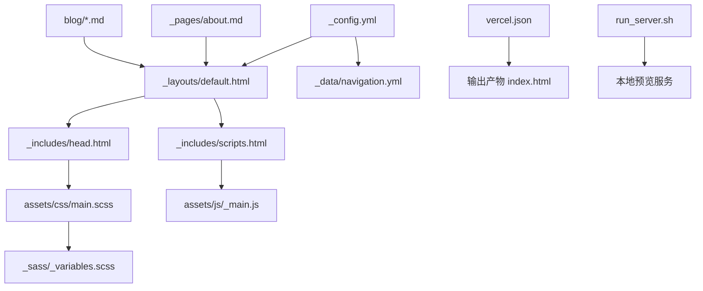
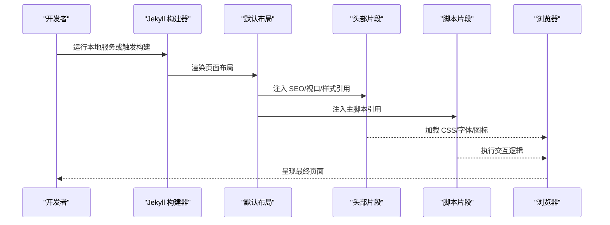
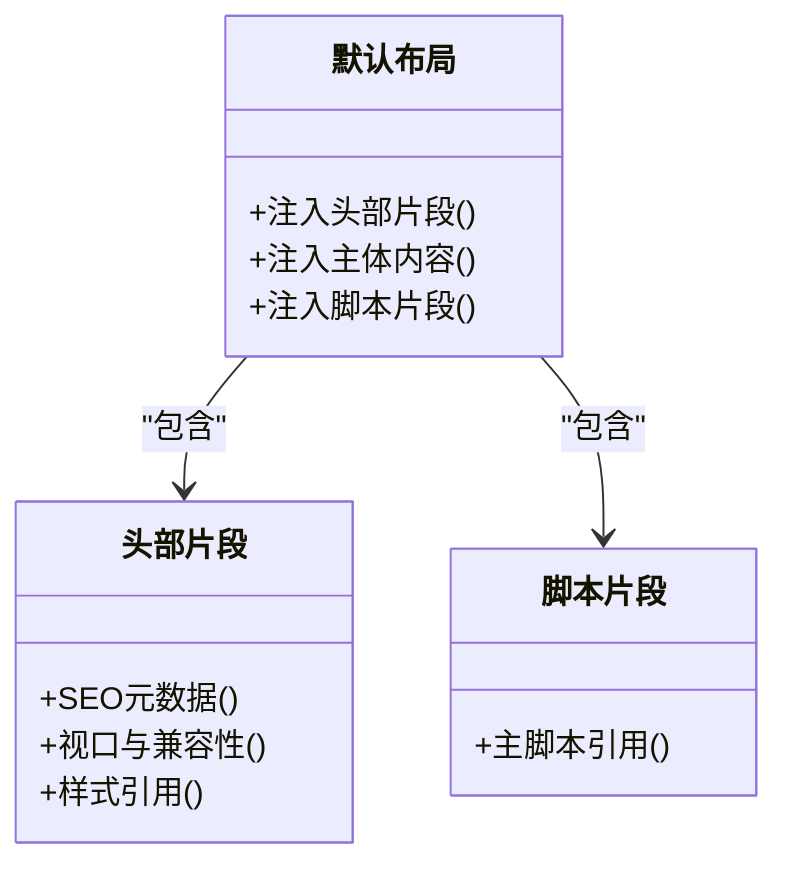
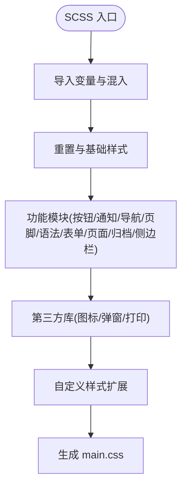
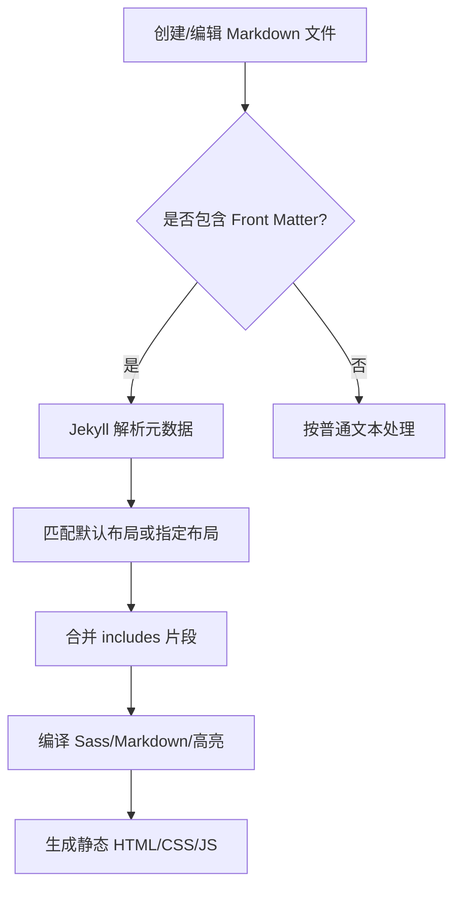
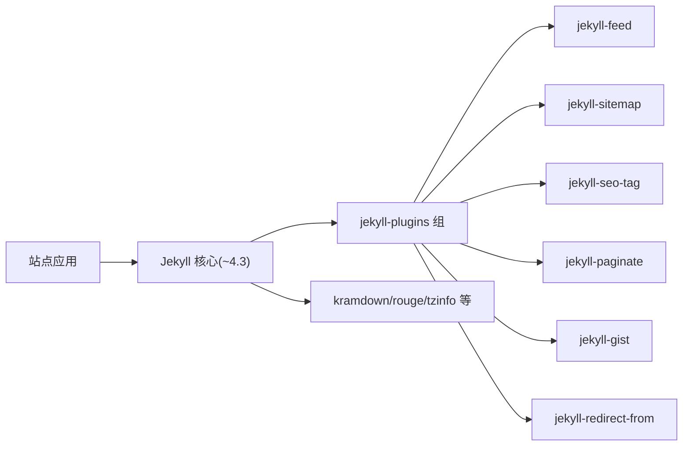

# 代码结构规范

<cite>
**本文引用的文件**   
- [_config.yml](file://_config.yml)
- [README.md](file://README.md)
- [Gemfile](file://Gemfile)
- [vercel.json](file://vercel.json)
- [_data/navigation.yml](file://_data/navigation.yml)
- [_layouts/default.html](file://_layouts/default.html)
- [_pages/about.md](file://_pages/about.md)
- [assets/css/main.scss](file://assets/css/main.scss)
- [_sass/_variables.scss](file://sass/_variables.scss)
- [_includes/head.html](file://_includes/head.html)
- [_includes/scripts.html](file://_includes/scripts.html)
- [run_server.sh](file://run_server.sh)
- [blog/2024-01-05-observability-stack.md](file://blog/2024-01-05-observability-stack.md)
</cite>

## 目录
1. [简介](#简介)
2. [项目结构](#项目结构)
3. [核心组件](#核心组件)
4. [架构总览](#架构总览)
5. [详细组件分析](#详细组件分析)
6. [依赖分析](#依赖分析)
7. [性能考虑](#性能考虑)
8. [故障排查指南](#故障排查指南)
9. [结论](#结论)
10. [附录](#附录)

## 简介
本规范面向贡献者与维护者，系统化说明基于 Jekyll 的静态站点项目的目录组织、命名约定、构建与部署流程、以及协作开发最佳实践。项目采用 Minimal Mistakes 主题风格，结合 SCSS 模块化样式与页面模板复用机制，提供响应式、SEO 友好的学术个人主页与博客能力。

## 项目结构
仓库采用“按职责分层 + 资源集中”的组织方式：
- _config.yml：站点全局配置（元信息、插件、Sass、默认值等）
- _data：数据驱动的配置（如导航菜单）
- _includes：可复用的片段（头部、侧边栏、脚本等）
- _layouts：页面布局模板（默认布局）
- _pages：内容页（Markdown 文档）
- blog：博客文章（带 Front Matter 的 Markdown）
- assets：前端资源（CSS/JS/字体/图片）
- images：站点图片与图标
- docs：项目文档与示例
- bin：本地辅助脚本（Jekyll 命令包装）
- vercel.json：Vercel 部署重定向规则
- run_server.sh：本地开发启动脚本
- Gemfile：Ruby 与 Jekyll 插件依赖声明

图表来源
- [_config.yml:1-169](file://_config.yml#L1-L169)
- [_layouts/default.html:1-34](file://_layouts/default.html#L1-L34)
- [_includes/head.html:1-16](file://_includes/head.html#L1-L16)
- [_includes/scripts.html:1-1](file://_includes/scripts.html#L1-L1)
- [assets/css/main.scss:1-592](file://assets/css/main.scss#L1-L592)
- [_sass/_variables.scss:1-158](file://sass/_variables.scss#L1-L158)
- [assets/js/_main.js:1-99](file://assets/js/_main.js#L1-L99)
- [vercel.json:1-1](file://vercel.json#L1-L1)
- [run_server.sh:1-1](file://run_server.sh#L1-L1)

章节来源
- [_config.yml:1-169](file://_config.yml#L1-L169)
- [README.md:1-73](file://README.md#L1-L73)

## 核心组件
- 站点配置与默认值
  - 站点元信息、作者信息、时区、永久链接格式、Markdown 处理器、Sass 编译选项、插件白名单等均在配置中定义；通过 defaults 为 pages 类型设置默认布局与作者展示开关。
- 布局与片段
  - 默认布局负责组装 head、masthead、sidebar、主内容与 scripts 等片段；片段化设计便于统一修改 SEO、统计、第三方资源引入。
- 数据与导航
  - 导航菜单以 YAML 数据驱动，便于在不改动模板的情况下调整顶部导航。
- 样式系统
  - 使用 SCSS 模块化组织，变量集中管理，主入口 main.scss 聚合各模块；包含自定义卡片、徽章、统计面板等样式扩展。
- 交互脚本
  - 主脚本初始化粘性底部、自适应侧边栏、平滑滚动、图片灯箱等功能。
- 内容模型
  - 页面与博客文章均使用 Markdown + Front Matter；博客文章支持分类、标签、摘要、作者展示等字段。

章节来源
- [_config.yml:120-141](file://_config.yml#L120-L141)
- [_layouts/default.html:1-34](file://_layouts/default.html#L1-L34)
- [_data/navigation.yml:1-29](file://_data/navigation.yml#L1-L29)
- [assets/css/main.scss:1-592](file://assets/css/main.scss#L1-L592)
- [assets/js/_main.js:1-99](file://assets/js/_main.js#L1-L99)
- [blog/2024-01-05-observability-stack.md:1-280](file://blog/2024-01-05-observability-stack.md#L1-L280)

## 架构总览
下图展示了从源码到浏览器渲染的关键路径：配置驱动布局，布局组合片段，片段加载样式与脚本，最终由浏览器解析执行。

图表来源
- [_config.yml:143-169](file://_config.yml#L143-L169)
- [_layouts/default.html:1-34](file://_layouts/default.html#L1-L34)
- [_includes/head.html:1-16](file://_includes/head.html#L1-L16)
- [_includes/scripts.html:1-1](file://_includes/scripts.html#L1-L1)

## 详细组件分析

### 配置与默认值（_config.yml）
- 站点基础信息与 SEO 相关键位集中管理，便于多环境切换与平台集成。
- 通过 include/exclude/keep_files 控制参与构建的文件范围，避免将开发期文件打包进生产产物。
- markdown 与 kramdown 选项决定语法特性（GFM、自动 ID、脚注等）。
- sass 配置指定目录、压缩输出与额外加载路径，确保 SCSS 模块化与按需引入。
- permalink 定义 URL 结构，timezone 保证时间线正确显示。
- plugins 与 whitelist 声明运行时插件，兼容 GitHub Pages 安全策略。
- compress_html 在开发环境忽略压缩，便于调试。

章节来源
- [_config.yml:8-21](file://_config.yml#L8-L21)
- [_config.yml:62-98](file://_config.yml#L62-L98)
- [_config.yml:101-119](file://_config.yml#L101-L119)
- [_config.yml:131-141](file://_config.yml#L131-L141)
- [_config.yml:143-169](file://_config.yml#L143-L169)

### 布局与片段（_layouts/default.html, _includes/*）
- 默认布局作为根骨架，依次注入 head、head/custom、browser-upgrade、masthead、sidebar、主内容区域与 scripts。
- head 片段负责字符集、SEO、视口、JS 检测与主样式引入。
- scripts 片段统一引入主脚本，减少重复引用。
- 通过 include 机制实现高内聚低耦合，便于局部替换与扩展。

图表来源
- [_layouts/default.html:1-34](file://_layouts/default.html#L1-L34)
- [_includes/head.html:1-16](file://_includes/head.html#L1-L16)
- [_includes/scripts.html:1-1](file://_includes/scripts.html#L1-L1)

章节来源
- [_layouts/default.html:1-34](file://_layouts/default.html#L1-L34)
- [_includes/head.html:1-16](file://_includes/head.html#L1-L16)
- [_includes/scripts.html:1-1](file://_includes/scripts.html#L1-L1)

### 数据与导航（_data/navigation.yml）
- 导航项以 YAML 列表形式维护，title 与 url 分离，便于国际化与路由变更。
- 支持锚点跳转与独立页面链接，兼顾首页滚动体验与子页面直达。

章节来源
- [_data/navigation.yml:1-29](file://_data/navigation.yml#L1-L29)

### 样式系统（assets/css/main.scss, _sass/*）
- main.scss 作为入口，聚合变量、混入、重置、排版、按钮、通知、导航、页脚、语法高亮、表单、页面、归档、侧边栏、打印等模块。
- 变量集中定义字体族、字号阶梯、颜色体系、断点、网格与过渡动画等，便于主题级定制。
- 自定义样式覆盖与扩展包括论文卡片、徽章、统计看板、进度条、对比表格、博客元信息等。

图表来源
- [assets/css/main.scss:1-592](file://assets/css/main.scss#L1-L592)
- [_sass/_variables.scss:1-158](file://sass/_variables.scss#L1-L158)

章节来源
- [assets/css/main.scss:1-592](file://assets/css/main.scss#L1-L592)
- [_sass/_variables.scss:1-158](file://sass/_variables.scss#L1-L158)

### 交互脚本（assets/js/_main.js）
- 初始化粘性底部高度，监听窗口尺寸变化并动态调整。
- 启用视频自适应、侧边栏粘性定位、移动端下拉菜单、平滑滚动与图片灯箱。
- 通过类名选择器与事件委托提升性能与可维护性。

章节来源
- [assets/js/_main.js:1-99](file://assets/js/_main.js#L1-L99)

### 内容模型与页面（_pages/about.md, blog/*.md）
- 页面与文章均采用 Markdown + Front Matter；页面可通过 permalink 与 redirect_from 控制访问路径与历史迁移。
- 博客文章支持 title、date、categories、tags、excerpt、author_profile 等字段，便于归档与展示。
- 首页 about.md 整合个人介绍、技能、荣誉、教育、工作经历、演讲、实习与技术博客入口等内容区块。

图表来源
- [_pages/about.md:1-250](file://_pages/about.md#L1-L250)
- [blog/2024-01-05-observability-stack.md:1-280](file://blog/2024-01-05-observability-stack.md#L1-L280)
- [_config.yml:120-141](file://_config.yml#L120-L141)

章节来源
- [_pages/about.md:1-250](file://_pages/about.md#L1-L250)
- [blog/2024-01-05-observability-stack.md:1-280](file://blog/2024-01-05-observability-stack.md#L1-L280)

### 部署与重定向（vercel.json）
- 单行重写规则将所有路径重定向至 index.html，适配 SPA 风格的客户端路由或 Jekyll 生成的静态站点。

章节来源
- [vercel.json:1-1](file://vercel.json#L1-L1)

## 依赖分析
- Ruby 与 Jekyll 版本锁定于 Gemfile，确保团队与 CI 环境一致。
- 插件组 jekyll_plugins 包含 feed、sitemap、seo-tag、paginate、gist、redirect-from 等常用能力。
- 运行时依赖 tzinfo/tzinfo-data/kramdown/rouge/jekyll-watch/sass-converter/minima 等用于时区、Markdown 解析、语法高亮、热重载与主题基础。

图表来源
- [Gemfile:1-51](file://Gemfile#L1-L51)

章节来源
- [Gemfile:1-51](file://Gemfile#L1-L51)

## 性能考虑
- 开启 Sass 压缩输出与 HTML 压缩（开发环境忽略），减小体积并提升加载速度。
- 合理使用 include 与模块化 SCSS，避免冗余样式与重复脚本。
- 图片与媒体资源建议按需懒加载与合理尺寸裁剪，减少首屏负载。
- 对第三方库（图标、弹窗、粘性定位）按需引入，避免未使用功能带来的开销。
- 使用 CDN 缓存 Google Scholar 统计数据时注意更新延迟，必要时切换回直链源。

[本节为通用指导，不直接分析具体文件]

## 故障排查指南
- 本地无法启动或端口占用
  - 检查 run_server.sh 是否正确调用 bundle exec jekyll serve --livereload。
  - 确认 Ruby/Gem/Jekyll 版本与 Gemfile 一致。
- 样式未生效或报错
  - 检查 _config.yml 的 sass 配置与 load_paths 是否包含 assets/css。
  - 确认 main.scss 入口已正确引入所需模块与变量。
- 页面 404 或路由异常
  - 核对 _config.yml 的 permalink 与页面 front matter 的 permalink/redirect_from。
  - 若部署在 Vercel，确认 vercel.json 的重写规则是否生效。
- 插件缺失或权限问题
  - 检查 Gemfile 的 jekyll_plugins 组是否安装完整。
  - 若部署在 GitHub Pages，确认 whitelist 与插件白名单一致。

章节来源
- [run_server.sh:1-1](file://run_server.sh#L1-L1)
- [_config.yml:131-141](file://_config.yml#L131-L141)
- [_config.yml:143-169](file://_config.yml#L143-L169)
- [vercel.json:1-1](file://vercel.json#L1-L1)

## 结论
本项目以 Jekyll 为核心，采用清晰的目录分层与模块化样式/脚本组织，配合数据驱动的导航与灵活的布局片段，形成易于维护与扩展的个人主页与博客体系。遵循本规范进行内容创作、样式定制与部署发布，可显著提升团队协作效率与交付质量。

[本节为总结性内容，不直接分析具体文件]

## 附录

### 开发工作流程（从内容创作到发布）
- 环境准备
  - 安装 Ruby、RubyGems、GCC、Make，参考官方安装指南。
  - 克隆仓库，进入项目目录。
- 本地预览
  - 执行 run_server.sh 启动 Jekyll 实时重载服务。
  - 打开 http://127.0.0.1:4000 查看效果。
- 内容创作
  - 新增页面：在 _pages 下创建 Markdown 文件，添加必要 Front Matter（如 permalink、title、author_profile）。
  - 新增博客：在 blog 下创建日期前缀命名的 Markdown 文件，填写 title、date、categories、tags、excerpt 等。
- 样式与交互
  - 修改样式：在 assets/css/main.scss 或对应 _sass 模块中添加/调整样式。
  - 修改交互：在 assets/js/_main.js 中增补或优化脚本逻辑。
- 提交与推送
  - 使用 Git 提交变更，遵循分支与提交信息规范（见下文）。
- 部署发布
  - 推送到远程仓库后，GitHub Pages/Vercel 自动构建并发布。
  - 如需自定义域名或高级配置，参考平台文档与 vercel.json 重写规则。

章节来源
- [README.md:59-66](file://README.md#L59-L66)
- [run_server.sh:1-1](file://run_server.sh#L1-L1)
- [vercel.json:1-1](file://vercel.json#L1-L1)

### Git 版本控制与协作规范
- 分支策略
  - main：稳定发布分支，仅接受经过测试的变更。
  - feature/*：新功能开发分支，完成后合并至 main。
  - fix/*：缺陷修复分支，完成后合并至 main。
  - hotfix/*：紧急修复分支，快速合并至 main 并打标签。
- 提交信息规范
  - 类型：feat、fix、docs、style、refactor、perf、test、chore。
  - 格式：<type>: <简短描述>，必要时附加详细说明与影响范围。
- 代码审查
  - 所有合并需至少一名维护者审查通过。
  - 关注可读性、一致性、性能与安全性。
- 冲突解决
  - 优先在本地拉取最新 main，再解决冲突；必要时与协作者沟通语义变更。
- 发布流程
  - 合并后触发 CI/CD，自动生成站点并部署。
  - 重要版本打 Tag，记录变更日志。

[本节为通用规范，不直接分析具体文件]

### 文件命名约定
- 页面与博客
  - 页面：_pages/<name>.md（建议使用小写英文与连字符，如 projects.md）。
  - 博客：blog/<YYYY-MM-DD>-<slug>.md（日期前缀+短横线分隔的标题缩写）。
- 样式与脚本
  - SCSS：_sass/_*.scss（模块按职责命名，如 _variables.scss、_navigation.scss）。
  - 主入口：assets/css/main.scss（聚合导入）。
  - JS：assets/js/_main.js（主逻辑），plugins/vendor 存放第三方库。
- 数据与配置
  - _data/*.yml：结构化数据（如 navigation.yml）。
  - _config.yml：站点全局配置。
- 资源
  - assets/fonts、assets/js、images 等按类型分目录，避免扁平化。

[本节为约定性内容，不直接分析具体文件]