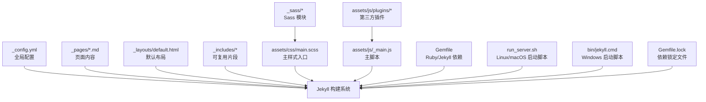
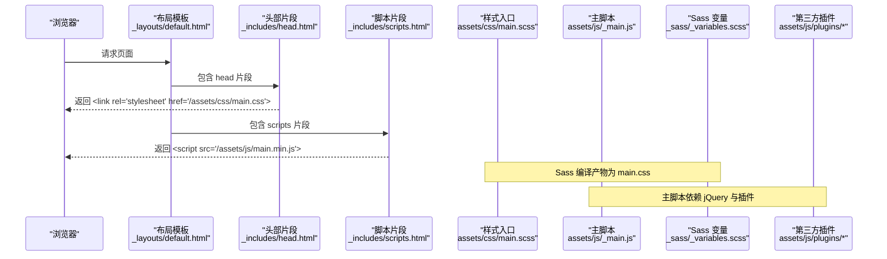
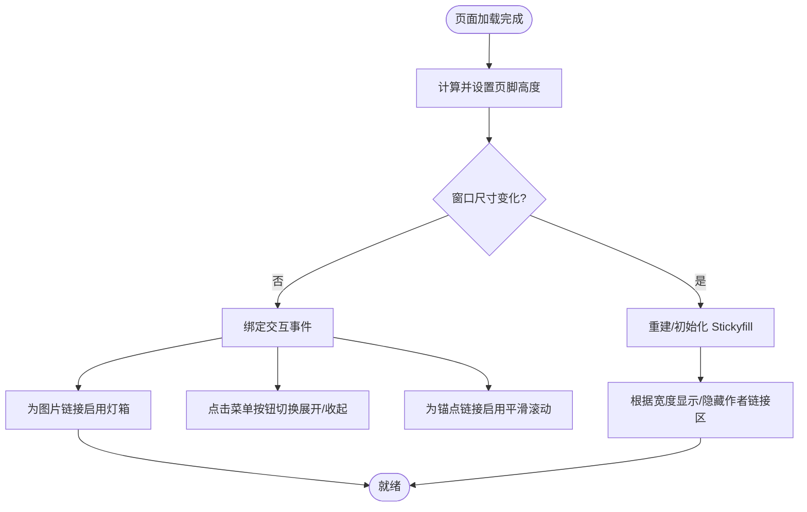
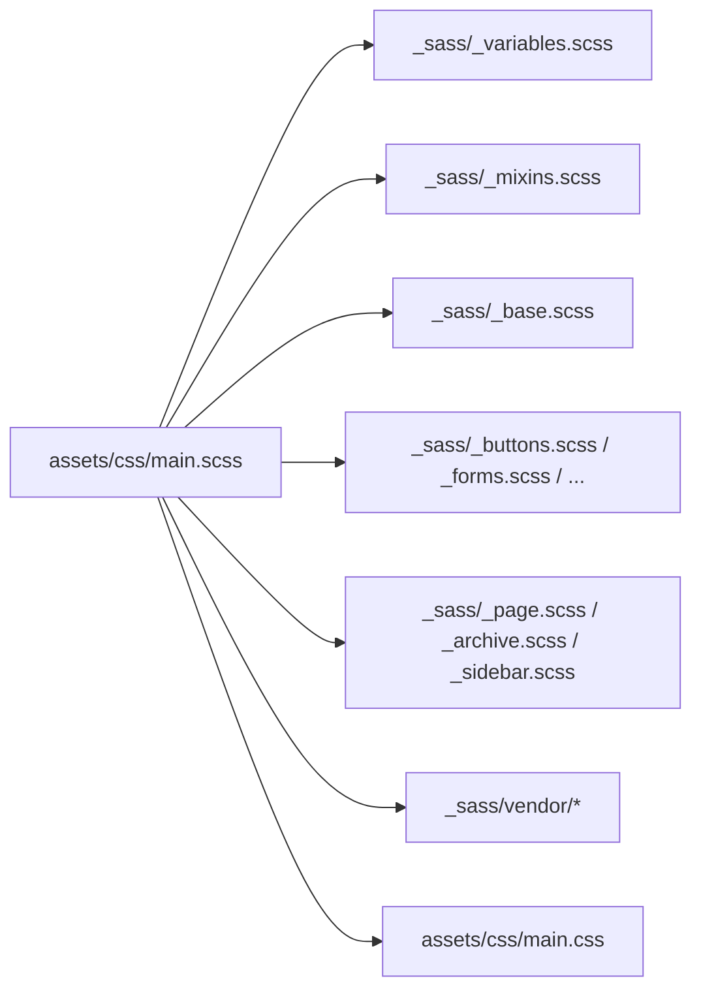
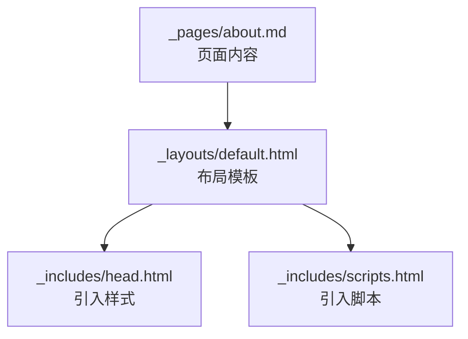
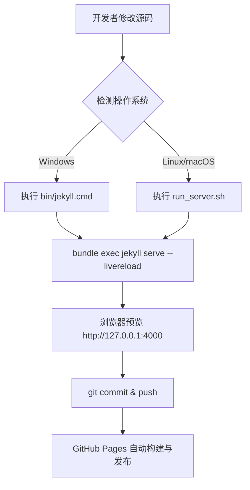
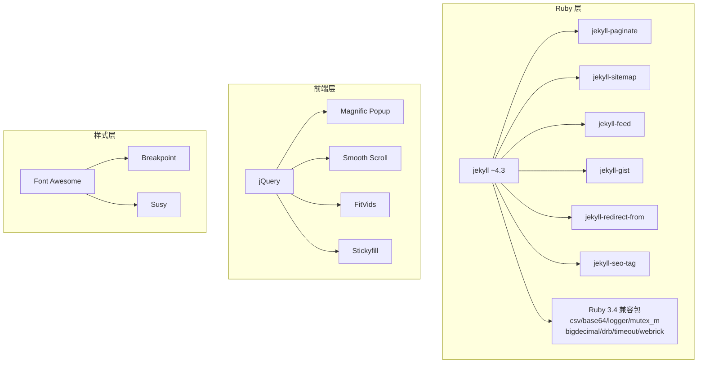

# 开发指南

<cite>
**本文引用的文件**   
- [README.md](file://README.md)
- [_config.yml](file://_config.yml)
- [Gemfile](file://Gemfile)
- [Gemfile.lock](file://Gemfile.lock)
- [bin/jekyll.cmd](file://bin/jekyll.cmd)
- [assets/js/_main.js](file://assets/js/_main.js)
- [assets/js/collapse.js](file://assets/js/collapse.js)
- [assets/css/main.scss](file://assets/css/main.scss)
- [_sass/_variables.scss](file://_sass/_variables.scss)
- [_includes/scripts.html](file://_includes/scripts.html)
- [_includes/head.html](file://_includes/head.html)
- [run_server.sh](file://run_server.sh)
- [_pages/about.md](file://_pages/about.md)
- [docs/README-zh.md](file://docs/README-zh.md)
</cite>

## 更新摘要
**所做更改**   
- 新增 Windows 平台 Jekyll 构建脚本支持
- 更新 Ruby 3.4 兼容性依赖配置
- 增强跨平台开发环境支持
- 完善本地开发工作流说明

## 目录
1. [简介](#简介)
2. [项目结构](#项目结构)
3. [核心组件](#核心组件)
4. [架构总览](#架构总览)
5. [详细组件分析](#详细组件分析)
6. [依赖分析](#依赖分析)
7. [性能考虑](#性能考虑)
8. [故障排查指南](#故障排查指南)
9. [结论](#结论)
10. [附录](#附录)

## 简介
本指南面向新贡献者与维护者，系统化说明该 Jekyll 学术主页项目的代码组织、命名约定与开发工作流；重点覆盖前端 JavaScript 交互实现、Sass 模块化规范、调试技巧与工具配置，以及贡献流程、测试方法与版本管理策略。目标是让开发者快速上手并高效协作。

**更新** 本项目现已完全支持跨平台开发环境，包括 Windows、macOS 和 Linux 系统，提供统一的构建体验。

## 项目结构
本项目基于 Jekyll 静态站点生成器，采用"按功能域"的目录划分：页面内容、布局片段、样式模块、脚本资源与构建配置分离清晰。

图表来源
- [_config.yml:1-169](file://_config.yml#L1-L169)
- [Gemfile:1-51](file://Gemfile#L1-L51)
- [Gemfile.lock:1-142](file://Gemfile.lock#L1-L142)
- [bin/jekyll.cmd:1-20](file://bin/jekyll.cmd#L1-L20)
- [assets/css/main.scss:1-342](file://assets/css/main.scss#L1-L342)
- [_sass/_variables.scss:1-158](file://_sass/_variables.scss#L1-L158)
- [assets/js/_main.js:1-99](file://assets/js/_main.js#L1-L99)
- [run_server.sh:1-1](file://run_server.sh#L1-L1)

章节来源
- [README.md:1-73](file://README.md#L1-L73)
- [_config.yml:1-169](file://_config.yml#L1-L169)
- [Gemfile:1-51](file://Gemfile#L1-L51)

## 核心组件
- 站点配置与元数据
  - 站点标题、描述、仓库地址、Google Analytics、SEO 验证等通过配置文件集中管理。
  - Sass 编译路径、输出压缩、语法高亮等构建选项在配置中声明。
- 页面与布局
  - 页面以 Markdown 编写，位于 _pages 目录；默认布局由 _layouts/default.html 提供。
  - 通用头部、脚本注入等片段位于 _includes。
- 样式系统（Sass）
  - 主入口 assets/css/main.scss 统一引入变量、混入、基础样式与业务模块。
  - 主题变量与断点定义集中在 _sass/_variables.scss。
- 前端脚本（JavaScript）
  - 主逻辑集中在 assets/js/_main.js，负责粘性页脚、图片灯箱、平滑滚动、侧边栏自适应等。
  - 辅助交互如折叠面板在 assets/js/collapse.js 中实现。
- 构建与运行
  - Ruby 与 Jekyll 依赖在 Gemfile 中声明，现已完全支持 Ruby 3.4。
  - 本地开发通过 run_server.sh（Linux/macOS）或 bin/jekyll.cmd（Windows）启动带热重载的服务。

**更新** 新增对 Ruby 3.4 的完整支持，包含必要的标准库依赖项以确保跨平台兼容性。

章节来源
- [_config.yml:1-169](file://_config.yml#L1-L169)
- [_includes/head.html:1-16](file://_includes/head.html#L1-L16)
- [_includes/scripts.html:1-1](file://_includes/scripts.html#L1-L1)
- [assets/css/main.scss:1-342](file://assets/css/main.scss#L1-L342)
- [_sass/_variables.scss:1-158](file://_sass/_variables.scss#L1-L158)
- [assets/js/_main.js:1-99](file://assets/js/_main.js#L1-L99)
- [assets/js/collapse.js:1-17](file://assets/js/collapse.js#L1-L17)
- [Gemfile:1-51](file://Gemfile#L1-L51)
- [Gemfile.lock:1-142](file://Gemfile.lock#L1-L142)
- [run_server.sh:1-1](file://run_server.sh#L1-L1)
- [bin/jekyll.cmd:1-20](file://bin/jekyll.cmd#L1-L20)

## 架构总览
下图展示从浏览器到 Jekyll 构建产物的关键路径，包括样式与脚本的加载顺序及依赖关系。

图表来源
- [_includes/head.html:1-16](file://_includes/head.html#L1-L16)
- [_includes/scripts.html:1-1](file://_includes/scripts.html#L1-L1)
- [assets/css/main.scss:1-342](file://assets/css/main.scss#L1-L342)
- [_sass/_variables.scss:1-158](file://_sass/_variables.scss#L1-L158)
- [assets/js/_main.js:1-99](file://assets/js/_main.js#L1-L99)

## 详细组件分析

### 前端脚本与事件处理
- 主脚本职责
  - 初始化粘性页脚，避免内容过短时底部留白异常。
  - 根据窗口尺寸控制作者链接区域的显示/隐藏，并在需要时重建 Stickyfill。
  - 为图片链接添加灯箱类，启用 Magnific Popup 图片预览。
  - 初始化平滑滚动，优化锚点跳转体验。
  - 使用 FitVids 与 Stickyfill 增强响应式视频与侧边栏效果。
- 辅助脚本
  - 折叠面板：点击标题切换内容区域可见性，并动态更新按钮文案。

图表来源
- [assets/js/_main.js:1-99](file://assets/js/_main.js#L1-L99)
- [assets/js/collapse.js:1-17](file://assets/js/collapse.js#L1-L17)

章节来源
- [assets/js/_main.js:1-99](file://assets/js/_main.js#L1-L99)
- [assets/js/collapse.js:1-17](file://assets/js/collapse.js#L1-L17)

### Sass 模块化与样式组织
- 入口与分层
  - assets/css/main.scss 作为唯一入口，按"基础 → 组件 → 页面 → 第三方"的顺序引入模块。
  - 变量与混入集中于 _sass/_variables.scss 与 _sass/_mixins.scss，便于统一管理主题色、字号、断点等。
- 命名与扩展
  - 新增 UI 组件建议拆分为独立 SCSS 文件，遵循 BEM 风格命名（例如 .paper-box、.badge-*）。
  - 颜色、间距、字体等设计令牌优先通过变量或 CSS 自定义属性表达，减少硬编码。
- 编译与输出
  - 通过 _config.yml 的 sass 配置指定编译目录与压缩输出，确保生产环境体积最小化。

图表来源
- [assets/css/main.scss:1-342](file://assets/css/main.scss#L1-L342)
- [_sass/_variables.scss:1-158](file://_sass/_variables.scss#L1-L158)
- [_config.yml:131-141](file://_config.yml#L131-L141)

章节来源
- [assets/css/main.scss:1-342](file://assets/css/main.scss#L1-L342)
- [_sass/_variables.scss:1-158](file://_sass/_variables.scss#L1-L158)
- [_config.yml:131-141](file://_config.yml#L131-L141)

### 页面内容与布局
- 页面内容
  - 首页与子页面以 Markdown 编写，位于 _pages 目录，支持 Front Matter 与 Jekyll 标签。
  - 示例页面包含论文卡片、荣誉列表、博客摘要等结构化区块。
- 布局与片段
  - 默认布局 _layouts/default.html 提供整体骨架。
  - 通用头部与脚本注入分别由 _includes/head.html 与 _includes/scripts.html 管理。

图表来源
- [_pages/about.md:1-250](file://_pages/about.md#L1-L250)
- [_includes/head.html:1-16](file://_includes/head.html#L1-L16)
- [_includes/scripts.html:1-1](file://_includes/scripts.html#L1-L1)

章节来源
- [_pages/about.md:1-250](file://_pages/about.md#L1-L250)
- [_includes/head.html:1-16](file://_includes/head.html#L1-L16)
- [_includes/scripts.html:1-1](file://_includes/scripts.html#L1-L1)

### 构建与运行

#### 跨平台构建支持
**新增** 项目现已提供完整的跨平台构建支持，包括 Windows、Linux 和 macOS 系统。

- **Windows 平台支持**
  - 新增 `bin/jekyll.cmd` 批处理脚本，提供原生的 Windows 构建体验
  - 脚本自动配置 Bundler 环境并加载正确的 Gemfile
  - 支持错误码传递和环境变量继承

- **Linux/macOS 平台支持**
  - 使用 `run_server.sh` 脚本启动 Jekyll 服务
  - 支持 livereload 实时重载功能

- **依赖管理**
  - 使用 Gemfile 锁定 Jekyll 及其插件版本，保证构建一致性
  - Gemfile.lock 记录精确的依赖版本，确保跨平台构建一致性

#### Ruby 3.4 兼容性支持
**更新** 项目已完全适配 Ruby 3.4 版本要求。

- **必要依赖项**
  - csv、base64、logger、mutex_m、bigdecimal、drb、timeout、webrick 等标准库
  - 这些依赖在 Ruby 3.4 中已从默认 gems 中移除，需要显式声明

- **平台特定配置**
  - 针对 Windows 平台优化了依赖解析
  - 支持 x64-mingw-ucrt 平台架构

图表来源
- [Gemfile:1-51](file://Gemfile#L1-L51)
- [Gemfile.lock:1-142](file://Gemfile.lock#L1-L142)
- [bin/jekyll.cmd:1-20](file://bin/jekyll.cmd#L1-L20)
- [run_server.sh:1-1](file://run_server.sh#L1-L1)
- [README.md:59-66](file://README.md#L59-L66)

章节来源
- [Gemfile:1-51](file://Gemfile#L1-L51)
- [Gemfile.lock:1-142](file://Gemfile.lock#L1-L142)
- [bin/jekyll.cmd:1-20](file://bin/jekyll.cmd#L1-L20)
- [run_server.sh:1-1](file://run_server.sh#L1-L1)
- [README.md:59-66](file://README.md#L59-L66)

## 依赖分析
- 运行时依赖
  - Jekyll 4.x 与常用插件（分页、sitemap、feed、gist、重定向等）。
  - **更新** Ruby 3.4 兼容包（csv、logger、webrick、base64、bigdecimal、drb、timeout、mutex_m 等），提升跨平台稳定性。
- 前端依赖
  - jQuery 与第三方插件（Magnific Popup、Smooth Scroll、FitVids、Stickyfill 等）通过 assets/js/plugins 管理。
- 样式依赖
  - Font Awesome、Breakpoint、Susy 等通过 vendor 目录引入。

图表来源
- [Gemfile:1-51](file://Gemfile#L1-L51)
- [Gemfile.lock:1-142](file://Gemfile.lock#L1-L142)
- [assets/js/_main.js:1-99](file://assets/js/_main.js#L1-L99)
- [assets/css/main.scss:1-342](file://assets/css/main.scss#L1-L342)

章节来源
- [Gemfile:1-51](file://Gemfile#L1-L51)
- [Gemfile.lock:1-142](file://Gemfile.lock#L1-L142)
- [assets/js/_main.js:1-99](file://assets/js/_main.js#L1-L99)
- [assets/css/main.scss:1-342](file://assets/css/main.scss#L1-L342)

## 性能考虑
- 样式与脚本
  - 保持 Sass 模块化与按需引入，避免重复导入造成冗余。
  - 生产环境启用压缩输出（已在配置中开启），减少 CSS 体积。
  - 对图片与媒体资源进行适当压缩与懒加载，结合 FitVids 与灯箱插件的预加载策略平衡首屏与交互体验。
- 构建与缓存
  - 固定 Jekyll 与插件版本，避免不可预期的构建差异。
  - 合理使用 CDN 与浏览器缓存策略，降低重复加载成本。
- **更新** 跨平台优化
  - 针对不同平台优化依赖解析，减少安装时间
  - 利用平台特定的二进制包提升构建性能

## 故障排查指南
- 本地无法启动或端口占用
  - 确认已安装 Ruby、RubyGems、GCC、Make，并使用 bundle exec 执行命令。
  - 若端口被占用，可在启动脚本中调整端口参数。
  - **新增** Windows 用户请确保使用 bin/jekyll.cmd 而非直接调用 jekyll 命令。
- 样式未生效或 Sass 报错
  - 检查 assets/css/main.scss 的引入顺序与变量定义是否完整。
  - 确认 _config.yml 中 sass 配置的路径与输出模式正确。
- 脚本不生效或控制台报错
  - 确认 jQuery 与相关插件已正确加载且无冲突。
  - 检查 _includes/scripts.html 是否正确引入主脚本。
- Google Scholar 引用数据不更新
  - 检查仓库 Secret 中的 GOOGLE_SCHOLAR_ID 配置是否正确。
  - 确认 Actions 工作流已启用，并查看日志定位失败原因。
- **新增** Ruby 3.4 兼容性问题
  - 如果遇到缺少标准库的错误，确认 Gemfile 中包含所有必要的依赖项。
  - 执行 `bundle install` 重新安装依赖。
  - 检查 Gemfile.lock 是否包含最新的依赖版本。

章节来源
- [README.md:59-66](file://README.md#L59-L66)
- [_config.yml:131-141](file://_config.yml#L131-L141)
- [_includes/scripts.html:1-1](file://_includes/scripts.html#L1-L1)
- [assets/js/_main.js:1-99](file://assets/js/_main.js#L1-L99)
- [Gemfile:21-29](file://Gemfile#L21-L29)
- [bin/jekyll.cmd:1-20](file://bin/jekyll.cmd#L1-L20)

## 结论
本项目采用清晰的 Jekyll 工程结构与模块化样式/脚本组织方式，具备良好的可维护性与扩展性。**更新** 经过跨平台优化后，项目现已完全支持 Windows、Linux 和 macOS 开发环境，并提供 Ruby 3.4 的完整兼容性。遵循本文的开发规范与工作流，新贡献者可快速上手并高效协作。建议在后续迭代中持续完善文档、统一命名与错误提示，并逐步补充自动化测试与质量门禁。

## 附录

### 开发环境与工具配置
- 必需环境
  - Ruby、RubyGems、GCC、Make（参考官方安装指南）。
  - **更新** 推荐使用 Ruby 3.4+ 以获得最佳兼容性。
- 推荐工具
  - VS Code + Live Sass Compiler（可选）、ESLint/Prettier（用于 JS 格式化）、浏览器开发者工具。
- 本地启动
  - **更新** 跨平台启动方式：
    - Windows: 执行 `bin\jekyll.cmd`
    - Linux/macOS: 执行 `bash run_server.sh`
  - 访问 http://127.0.0.1:4000 预览。

**更新** 新增跨平台启动脚本支持，简化不同操作系统的开发环境配置。

章节来源
- [docs/README-zh.md:55-61](file://docs/README-zh.md#L55-L61)
- [run_server.sh:1-1](file://run_server.sh#L1-L1)
- [bin/jekyll.cmd:1-20](file://bin/jekyll.cmd#L1-L20)

### 代码组织与命名约定
- 目录与文件
  - 页面内容：_pages/*.md
  - 布局与片段：_layouts/*.html、_includes/*.html
  - 样式：assets/css/main.scss 为主入口，_sass/* 为模块
  - 脚本：assets/js/_main.js 为主逻辑，assets/js/plugins/* 为第三方插件
  - **新增** 构建脚本：bin/jekyll.cmd（Windows）、run_server.sh（Linux/macOS）
- 命名规范
  - Sass 类名采用小写连字符（kebab-case），组件前缀明确语义（如 .paper-box、.badge-*）。
  - JS 文件按职责拆分，避免全局污染，尽量使用模块化封装。

章节来源
- [assets/css/main.scss:1-342](file://assets/css/main.scss#L1-L342)
- [_sass/_variables.scss:1-158](file://_sass/_variables.scss#L1-L158)
- [assets/js/_main.js:1-99](file://assets/js/_main.js#L1-L99)
- [bin/jekyll.cmd:1-20](file://bin/jekyll.cmd#L1-L20)
- [run_server.sh:1-1](file://run_server.sh#L1-L1)

### 贡献流程与版本管理
- 分支策略
  - 主干分支（main）保持稳定，新功能在 feature/* 分支开发，修复在 fix/* 分支提交。
- 提交规范
  - 使用简洁明确的提交信息，必要时附带影响范围与变更说明。
- 审查与合并
  - 发起 Pull Request，等待同行评审通过后合并至主干。
- 发布与回滚
  - 通过 Git Tag 标记版本，配合 GitHub Pages 自动构建发布。

[本节为通用实践建议，无需特定文件引用]

### 测试方法
- 手动测试
  - 在不同分辨率下验证响应式布局与交互行为。
  - 检查图片灯箱、平滑滚动、侧边栏吸附等功能是否正常。
  - **新增** 跨平台测试：在 Windows、Linux、macOS 环境下验证构建脚本功能。
- 自动化测试（可选）
  - 引入 Lighthouse 进行性能与可访问性审计。
  - 使用 Cypress 或 Playwright 对关键用户流程进行端到端回归。

[本节为通用实践建议，无需特定文件引用]

### Ruby 3.4 兼容性配置
**新增** 项目已完全适配 Ruby 3.4 版本要求。

- **必要依赖项**
  - csv (3.3.5): CSV 数据处理
  - base64 (0.3.0): Base64 编解码
  - logger (1.7.0): 日志记录
  - mutex_m (0.3.0): 多线程互斥锁
  - bigdecimal (4.0.1): 高精度算术运算
  - drb (2.2.3): 分布式 Ruby
  - timeout (0.6.0): 超时控制
  - webrick (1.9.2): HTTP 服务器

- **平台支持**
  - 支持 x64-mingw-ucrt 平台架构
  - 确保在所有目标平台上的一致行为

章节来源
- [Gemfile:21-29](file://Gemfile#L21-L29)
- [Gemfile.lock:6-110](file://Gemfile.lock#L6-L110)
- [Gemfile.lock:112-113](file://Gemfile.lock#L112-L113)