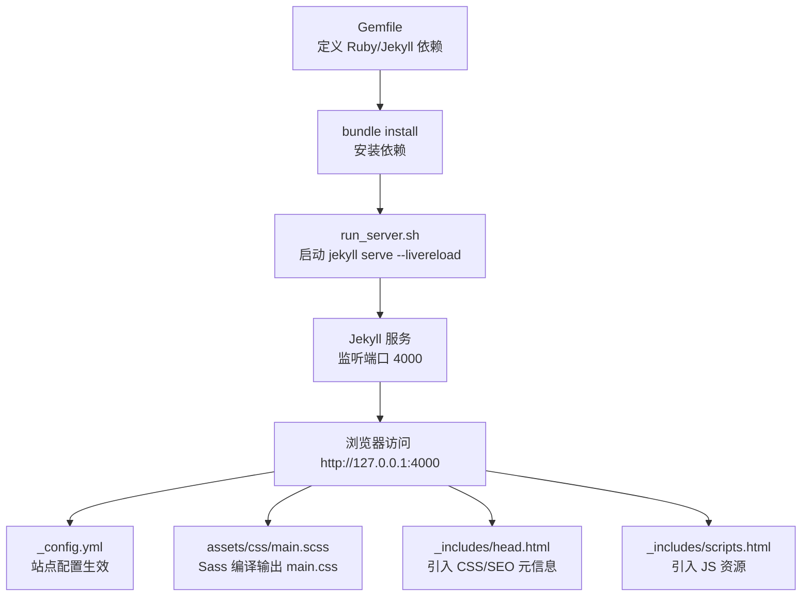
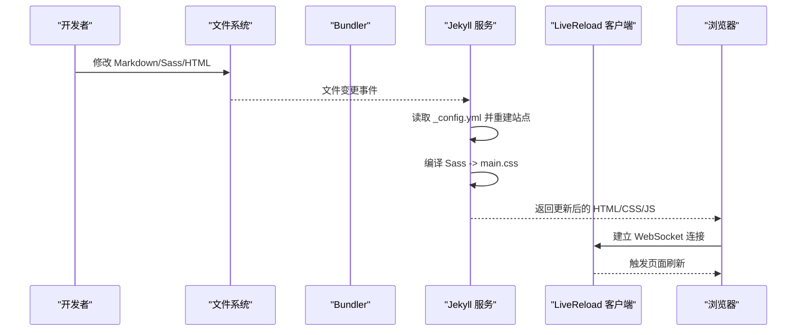
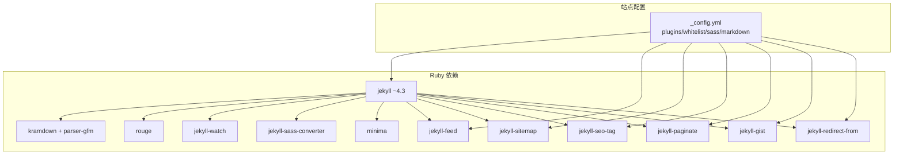

# 调试与测试

<cite>
**本文引用的文件**
- [Gemfile](file://Gemfile)
- [Gemfile.lock](file://Gemfile.lock)
- [_config.yml](file://_config.yml)
- [README.md](file://README.md)
- [run_server.sh](file://run_server.sh)
- [vercel.json](file://vercel.json)
- [.gitignore](file://.gitignore)
- [docs/README-zh.md](file://docs/README-zh.md)
- [docs/BLOG_USAGE_GUIDE.md](file://docs/BLOG_USAGE_GUIDE.md)
- [_includes/head.html](file://_includes/head.html)
- [_includes/scripts.html](file://_includes/scripts.html)
</cite>

## 目录
1. [简介](#简介)
2. [项目结构](#项目结构)
3. [核心组件](#核心组件)
4. [架构总览](#架构总览)
5. [详细组件分析](#详细组件分析)
6. [依赖分析](#依赖分析)
7. [性能考虑](#性能考虑)
8. [故障排除指南](#故障排除指南)
9. [结论](#结论)
10. [附录](#附录)

## 简介
本指南面向新贡献者与维护者，提供本地开发环境搭建、Jekyll 开发服务器与热重载使用、浏览器开发者工具调试方法、Markdown 渲染问题排查以及自动化测试建议。内容基于仓库现有配置与脚本，确保可操作且与线上行为一致。

## 项目结构
本项目为 Jekyll 静态站点，关键目录与职责如下：
- _config.yml：站点全局配置（主题、插件、Sass、Markdown 解析等）
- Gemfile/Gemfile.lock：Ruby 依赖与锁定版本
- run_server.sh：一键启动带热重载的开发服务器
- assets/css/main.scss：主样式入口（由 Sass 编译）
- _includes/head.html、scripts.html：页面头部与脚本注入点
- vercel.json：Vercel 部署重写规则（SPA 风格回退到 index.html）
- .gitignore：忽略构建产物与缓存目录

图表来源
- [Gemfile:1-51](file://Gemfile#L1-L51)
- [Gemfile.lock:1-142](file://Gemfile.lock#L1-L142)
- [run_server.sh:1-1](file://run_server.sh#L1-L1)
- [_config.yml:1-169](file://_config.yml#L1-L169)
- [_includes/head.html:1-16](file://_includes/head.html#L1-L16)
- [_includes/scripts.html:1-1](file://_includes/scripts.html#L1-L1)

章节来源
- [README.md:59-66](file://README.md#L59-L66)
- [docs/README-zh.md:55-61](file://docs/README-zh.md#L55-L61)
- [run_server.sh:1-1](file://run_server.sh#L1-L1)
- [_config.yml:100-141](file://_config.yml#L100-L141)
- [_includes/head.html:1-16](file://_includes/head.html#L1-L16)
- [_includes/scripts.html:1-1](file://_includes/scripts.html#L1-L1)

## 核心组件
- 依赖管理：通过 Gemfile 声明 Jekyll 及插件，Gemfile.lock 锁定版本，保证本地与 CI/CD 一致性。
- 构建与运行：run_server.sh 调用 bundle exec jekyll serve --livereload，实现源码变更自动刷新。
- 站点配置：_config.yml 控制 Markdown 引擎（kramdown）、语法高亮（rouge）、Sass 路径与压缩、插件白名单等。
- 前端资源：head.html 引入 main.css；scripts.html 引入 main.min.js。
- 部署适配：vercel.json 将路由重写到 index.html，便于 SPA 式跳转。

章节来源
- [Gemfile:17-50](file://Gemfile#L17-L50)
- [Gemfile.lock:30-142](file://Gemfile.lock#L30-L142)
- [run_server.sh:1-1](file://run_server.sh#L1-L1)
- [_config.yml:100-169](file://_config.yml#L100-L169)
- [_includes/head.html:1-16](file://_includes/head.html#L1-L16)
- [_includes/scripts.html:1-1](file://_includes/scripts.html#L1-L1)
- [vercel.json:1-1](file://vercel.json#L1-L1)

## 架构总览
下图展示从源码修改到浏览器热重载的完整链路，包括配置加载、Sass 编译、JS/CSS 注入与 LiveReload 通信。

图表来源
- [_config.yml:100-141](file://_config.yml#L100-L141)
- [_includes/head.html:1-16](file://_includes/head.html#L1-L16)
- [_includes/scripts.html:1-1](file://_includes/scripts.html#L1-L1)
- [run_server.sh:1-1](file://run_server.sh#L1-L1)

## 详细组件分析

### 本地开发与热重载
- 环境准备
  - 安装 Ruby、RubyGems、GCC、Make（参考 README 中的“Debug Locally”说明）。
  - 在仓库根目录执行依赖安装：bundle install。
- 启动开发服务器
  - 执行 bash run_server.sh，内部调用 bundle exec jekyll serve --livereload。
  - 打开 http://127.0.0.1:4000 预览站点。
- 热重载机制
  - 修改 Markdown、Sass、布局或包含模板后，Jekyll 增量重建，LiveReload 推送刷新指令至浏览器。
  - 注意：_config.yml 不会热重载，需重启服务。

章节来源
- [README.md:59-66](file://README.md#L59-L66)
- [docs/README-zh.md:55-61](file://docs/README-zh.md#L55-L61)
- [run_server.sh:1-1](file://run_server.sh#L1-L1)
- [_config.yml:1-6](file://_config.yml#L1-L6)

### 浏览器开发者工具使用
- 控制台调试
  - 打开控制台查看 JS 错误、断点调试、打印日志。
  - 若 main.min.js 未加载，检查 scripts.html 中资源路径是否正确。
- 网络请求分析
  - 在 Network 面板观察 CSS/JS/图片等资源是否 200 成功，是否存在跨域或 404。
  - 关注 main.css 是否由 Sass 正确编译生成。
- 性能监控
  - 使用 Performance 面板录制页面加载，定位阻塞资源与长任务。
  - 结合 Lighthouse 进行整体评分与优化建议。

章节来源
- [_includes/scripts.html:1-1](file://_includes/scripts.html#L1-L1)
- [_includes/head.html:14-14](file://_includes/head.html#L14-L14)

### Markdown 渲染调试技巧
- 引擎与选项
  - 当前使用 kramdown + GFM 输入模式，支持表格、脚注、TOC 等。
  - 语法高亮使用 rouge。
- 常见问题
  - Front Matter 格式错误导致页面无法渲染。
  - 中文编码问题：确保文件以 UTF-8 保存，_config.yml 已设置 encoding。
  - 列表/缩进不一致导致段落合并异常。
  - 代码块语言标识缺失导致无高亮。
- 验证步骤
  - 在浏览器控制台查看生成的 HTML 结构是否符合预期。
  - 逐步简化 Markdown 内容定位问题片段。
  - 检查 _config.yml 的 markdown/kramdown/highlighter 配置是否与 Gemfile 一致。

章节来源
- [_config.yml:97-119](file://_config.yml#L97-L119)
- [Gemfile:34-36](file://Gemfile#L34-L36)

### 样式与脚本调试
- Sass 编译
  - 确认 sass_dir 与 load_paths 指向 _sass 与 assets/css。
  - style: compressed 用于生产，开发时可改为 expanded 便于调试。
- 资源注入
  - head.html 引入 main.css；scripts.html 引入 main.min.js。
  - 若资源 404，检查 relative_url 与构建输出目录。

章节来源
- [_config.yml:131-141](file://_config.yml#L131-L141)
- [_includes/head.html:14-14](file://_includes/head.html#L14-L14)
- [_includes/scripts.html:1-1](file://_includes/scripts.html#L1-L1)

### 部署与路由
- Vercel 重写
  - vercel.json 将所有路由重写到 index.html，适合单页应用式导航。
- GitHub Pages
  - 站点默认发布到 https://USERNAME.github.io，遵循 Jekyll 标准流程。

章节来源
- [vercel.json:1-1](file://vercel.json#L1-L1)
- [README.md:57-57](file://README.md#L57-L57)

### 自动化测试建议
当前仓库未内置自动化测试框架。建议按以下策略补充：
- 链接与图片校验
  - 使用 linkchecker 或 lychee 扫描站内链接与外部引用。
- 构建回归
  - 在 CI 中执行 bundle install && bundle exec jekyll build，确保构建稳定。
- 样式与脚本
  - 使用 Stylelint/Prettier 规范 SCSS/JS；ESLint 检查 JS。
- 文档质量
  - 对 Markdown 使用 markdownlint 检查语法与一致性。
- 示例命令（供 CI 参考）
  - bundle install
  - bundle exec jekyll build
  - npx lychee --no-progress .
  - npx markdownlint-cli "**/*.md"

[本节为通用建议，不直接分析具体源文件]

## 依赖分析
- 运行时依赖
  - jekyll (~> 4.3)、kramdown、kramdown-parser-gfm、rouge、jekyll-watch、jekyll-sass-converter、minima 等。
  - 插件：jekyll-feed、jekyll-sitemap、jekyll-seo-tag、jekyll-paginate、jekyll-gist、jekyll-redirect-from。
- 平台与锁定
  - Gemfile.lock 锁定各包版本，避免升级导致的兼容性问题。
- 潜在耦合
  - _config.yml 的 plugins/whitelist 与 Gemfile 的 gem 声明需保持一致。
  - Sass 编译依赖 sass-embedded，Windows 下需 ffi 等原生扩展。

图表来源
- [Gemfile:17-50](file://Gemfile#L17-L50)
- [Gemfile.lock:30-142](file://Gemfile.lock#L30-L142)
- [_config.yml:148-169](file://_config.yml#L148-L169)

章节来源
- [Gemfile:17-50](file://Gemfile#L17-L50)
- [Gemfile.lock:30-142](file://Gemfile.lock#L30-L142)
- [_config.yml:148-169](file://_config.yml#L148-L169)

## 性能考虑
- 启用增量构建
  - 可在 _config.yml 开启 incremental: true 提升本地构建速度（谨慎评估兼容性）。
- 样式与脚本
  - 生产环境保持 style: compressed；按需拆分 JS，减少首屏体积。
- 资源缓存
  - 利用浏览器缓存与 CDN 加速静态资源。
- 图片优化
  - 使用合适尺寸与格式，避免过大图片影响加载。

[本节为通用建议，不直接分析具体源文件]

## 故障排除指南
- 无法启动或端口占用
  - 检查 4000 端口是否被占用；必要时更换端口或关闭占用进程。
- 依赖安装失败
  - 确认 Ruby 版本与系统编译器（GCC/Make）满足要求；Windows 下可能需要安装 Visual Studio Build Tools。
- 配置未生效
  - 修改 _config.yml 后需重启服务；检查 plugins 与 whitelist 是否一致。
- Sass 编译失败
  - 检查 sass_dir 与 load_paths；确认 _sass 目录下文件语法正确。
- 资源 404
  - 检查 head.html 与 scripts.html 的资源路径；确认 assets 目录结构与相对路径。
- 构建产物污染
  - 清理 _site、.jekyll-cache、.sass-cache 后重新构建。
- 部署后路由异常
  - 确认 vercel.json 的 rewrites 配置；GitHub Pages 无需额外重写。

章节来源
- [_config.yml:1-6](file://_config.yml#L1-L6)
- [_config.yml:131-141](file://_config.yml#L131-L141)
- [_includes/head.html:14-14](file://_includes/head.html#L14-L14)
- [_includes/scripts.html:1-1](file://_includes/scripts.html#L1-L1)
- [vercel.json:1-1](file://vercel.json#L1-L1)
- [.gitignore:1-4](file://.gitignore#L1-L4)

## 结论
通过规范的依赖管理与配置，配合 Jekyll 的热重载与浏览器开发者工具，可以高效完成本地开发与问题定位。建议在 CI 中补充链接与构建校验，进一步提升稳定性与可维护性。

## 附录
- 快速开始（本地调试）
  - 克隆仓库、安装依赖、运行 bash run_server.sh、访问 http://127.0.0.1:4000。
- 博客写作与展示
  - 参考 docs/BLOG_USAGE_GUIDE.md 了解页面与文章的组织方式、Front Matter 规范与常见样式。

章节来源
- [README.md:59-66](file://README.md#L59-L66)
- [docs/README-zh.md:55-61](file://docs/README-zh.md#L55-L61)
- [docs/BLOG_USAGE_GUIDE.md:1-430](file://docs/BLOG_USAGE_GUIDE.md#L1-L430)