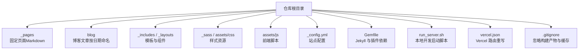
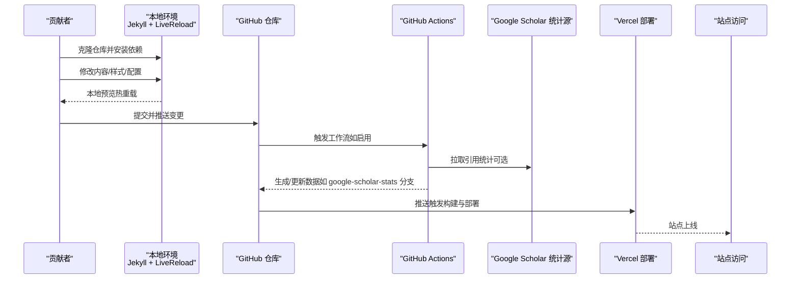
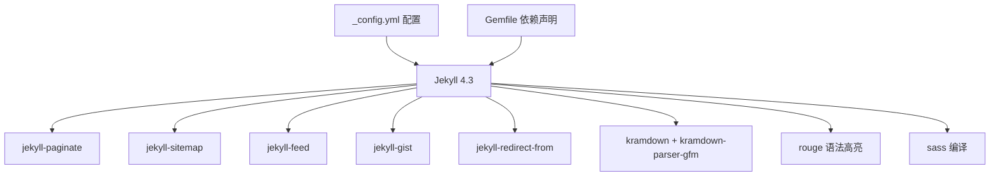

# 贡献工作流

<cite>
**本文引用的文件**
- [README.md](file://README.md)
- [README-zh.md](file://docs/README-zh.md)
- [BLOG_USAGE_GUIDE.md](file://docs/BLOG_USAGE_GUIDE.md)
- [STYLE_EXAMPLES.md](file://docs/STYLE_EXAMPLES.md)
- [_config.yml](file://_config.yml)
- [Gemfile](file://Gemfile)
- [run_server.sh](file://run_server.sh)
- [vercel.json](file://vercel.json)
- [.gitignore](file://.gitignore)
</cite>

## 目录
1. [简介](#简介)
2. [项目结构](#项目结构)
3. [核心组件](#核心组件)
4. [架构总览](#架构总览)
5. [详细组件分析](#详细组件分析)
6. [依赖分析](#依赖分析)
7. [性能考虑](#性能考虑)
8. [故障排查指南](#故障排查指南)
9. [结论](#结论)
10. [附录](#附录)

## 简介
本指南面向新贡献者，提供从 Fork、分支管理、提交规范、代码审查到发布与版本管理的完整协作流程。本项目为基于 Jekyll 的静态站点，本地构建与 GitHub Pages/Vercel 部署是主要交付路径；同时包含博客与样式示例文档，便于统一内容产出风格。

## 项目结构
仓库采用按功能域组织的方式：页面内容位于 _pages，博客文章位于 blog，样式与脚本位于 assets/_sass 与 assets/js，站点配置在 _config.yml，构建与运行脚本在根目录。

图表来源
- [_config.yml:1-169](file://_config.yml#L1-L169)
- [Gemfile:1-51](file://Gemfile#L1-L51)
- [run_server.sh:1-1](file://run_server.sh#L1-L1)
- [vercel.json:1-1](file://vercel.json#L1-L1)
- [.gitignore:1-4](file://.gitignore#L1-L4)

章节来源
- [README.md:33-57](file://README.md#L33-L57)
- [README-zh.md:35-61](file://docs/README-zh.md#L35-L61)
- [BLOG_USAGE_GUIDE.md:14-27](file://docs/BLOG_USAGE_GUIDE.md#L14-L27)

## 核心组件
- 站点配置与元数据：_config.yml 定义站点标题、作者信息、SEO 验证、默认布局、Sass 编译选项、插件白名单等。
- 构建与依赖：Gemfile 锁定 Jekyll 版本及插件，确保本地与 CI 环境一致。
- 本地开发：run_server.sh 使用 bundle exec jekyll serve --livereload 启动热重载服务。
- 部署配置：vercel.json 用于 SPA 式重定向，配合 Vercel 实现单页路由。
- 忽略规则：.gitignore 排除 _site 构建产物与缓存目录，避免污染仓库。

章节来源
- [_config.yml:1-169](file://_config.yml#L1-L169)
- [Gemfile:1-51](file://Gemfile#L1-L51)
- [run_server.sh:1-1](file://run_server.sh#L1-L1)
- [vercel.json:1-1](file://vercel.json#L1-L1)
- [.gitignore:1-4](file://.gitignore#L1-L4)

## 架构总览
下图展示贡献者从本地修改到线上发布的端到端流程，涵盖本地构建、推送、GitHub Actions 与 Vercel 部署。

图表来源
- [README.md:33-57](file://README.md#L33-L57)
- [README-zh.md:35-61](file://docs/README-zh.md#L35-L61)
- [vercel.json:1-1](file://vercel.json#L1-L1)
- [run_server.sh:1-1](file://run_server.sh#L1-L1)

## 详细组件分析

### 分支管理与版本控制策略
- 主分支
  - main：稳定可发布分支，所有合并需通过 Pull Request 审核。
- 功能分支
  - feature/*：新功能或较大改动，完成后发起 PR 至 main。
- 修复分支
  - fix/*：缺陷修复，完成后发起 PR 至 main。
- 文档分支
  - docs/*：仅文档与示例更新，完成后发起 PR 至 main。
- 发布分支
  - release/*：预发布准备，打标签后合并回 main 并创建发布标签。
- 临时/实验分支
  - hotfix/*：紧急修复，快速走 PR 流程并合并。

最佳实践
- 分支命名遵循语义化前缀，保持简短明确。
- 小步提交，每个提交聚焦单一职责。
- 提交信息遵循约定格式：类型(范围): 描述（例如 feat(blog): 新增多网关流量隔离文章）。
- 定期 rebase main，避免历史混乱。
- 禁止直接 push 到受保护分支（main）。

章节来源
- [README.md:33-57](file://README.md#L33-L57)
- [README-zh.md:35-61](file://docs/README-zh.md#L35-L61)

### 代码审查流程与质量标准
- 审查入口
  - 通过 Pull Request 发起审查，填写变更背景、影响范围与测试说明。
- 审查清单
  - 正确性：逻辑与边界条件覆盖，无破坏性变更。
  - 可读性：命名清晰、注释必要且不过度、结构合理。
  - 一致性：遵循本仓库的样式与文档规范。
  - 安全性：不泄露密钥与敏感信息。
  - 可维护性：低耦合、高内聚，避免过度复杂。
- 自动化检查
  - 建议引入 Lint 与格式化检查（如 Markdown 语法校验），在 PR 中自动报告问题。
- 文档要求
  - 涉及用户可见变更需同步更新 README 或相关文档。
  - 新增样式或组件需在 STYLE_EXAMPLES.md 补充示例。

章节来源
- [BLOG_USAGE_GUIDE.md:327-382](file://docs/BLOG_USAGE_GUIDE.md#L327-L382)
- [STYLE_EXAMPLES.md:1-401](file://docs/STYLE_EXAMPLES.md#L1-L401)

### 内容创作与博客规范
- 页面文档
  - 位置：_pages/*.md
  - Front Matter 必填字段：title、permalink、layout、author_profile 等。
  - 导航链接：在 _data/navigation.yml 中添加。
- 博客文章
  - 位置：blog/YYYY-MM-DD-title.md
  - Front Matter 必填字段：title、date、categories/tags、excerpt、author_profile。
- 主页展示
  - 在 _pages/about.md 中以卡片形式展示最新文章或论文。
- 特殊样式
  - 徽章、荣誉列表、警告框、教程步骤、对比表格、技术栈标签等，参考样式示例文档。

章节来源
- [BLOG_USAGE_GUIDE.md:29-118](file://docs/BLOG_USAGE_GUIDE.md#L29-L118)
- [BLOG_USAGE_GUIDE.md:120-189](file://docs/BLOG_USAGE_GUIDE.md#L120-L189)
- [STYLE_EXAMPLES.md:1-401](file://docs/STYLE_EXAMPLES.md#L1-L401)

### 本地开发与调试
- 环境准备
  - 安装 Ruby、RubyGems、GCC、Make，参考官方安装指南。
- 依赖安装
  - 使用 Gemfile 指定 Jekyll 版本与插件，执行 bundle install。
- 启动服务
  - 运行 run_server.sh 启动 Jekyll 并开启热重载。
- 预览地址
  - 浏览器访问 http://127.0.0.1:4000。

章节来源
- [README.md:59-66](file://README.md#L59-L66)
- [README-zh.md:55-61](file://docs/README-zh.md#L55-L61)
- [Gemfile:1-51](file://Gemfile#L1-L51)
- [run_server.sh:1-1](file://run_server.sh#L1-L1)

### 构建与部署
- GitHub Pages
  - 将仓库命名为 USERNAME.github.io 即可由 GitHub Pages 自动构建与发布。
- Vercel 部署
  - vercel.json 配置 SPA 式重定向，确保客户端路由正常工作。
- Google Scholar 统计
  - 通过 GitHub Actions 定时拉取引用数据，写入 google-scholar-stats 分支，供站点读取。

章节来源
- [README.md:33-57](file://README.md#L33-L57)
- [README-zh.md:35-61](file://docs/README-zh.md#L35-L61)
- [vercel.json:1-1](file://vercel.json#L1-L1)

### Pull Request 创建与合并流程
- 创建 PR
  - 从功能分支向 main 发起 PR，附上变更说明与截图（如有 UI 变化）。
- 审查与反馈
  - 维护者与协作者进行审查，提出修改意见。
- 合并标准
  - 通过所有自动化检查，至少一名维护者批准，无冲突。
- 合并方式
  - 推荐 Squash and Merge 以保持主线简洁。

章节来源
- [README.md:33-57](file://README.md#L33-L57)
- [README-zh.md:35-61](file://docs/README-zh.md#L35-L61)

### 发布流程与版本管理
- 版本策略
  - 采用语义化版本（主版本.次版本.修订号），重大变更提升主版本，新增特性提升次版本，修复问题提升修订号。
- 发布步骤
  - 从 main 切出 release/* 分支，完成最终回归与文档更新。
  - 打标签 vX.Y.Z，并在 Release Notes 中记录变更摘要。
  - 合并回 main 并删除 release/* 分支。
- 持续集成
  - 建议在 PR 阶段执行构建与基础检查，在 tag 阶段执行完整构建与发布。

章节来源
- [README.md:33-57](file://README.md#L33-L57)
- [README-zh.md:35-61](file://docs/README-zh.md#L35-L61)

## 依赖分析
- 运行时依赖
  - Jekyll 4.3 与一系列插件（分页、sitemap、feed、gist、重定向等）。
- 构建工具链
  - Sass 编译、Rouge 语法高亮、Kramdown Markdown 解析。
- 外部服务
  - Google Scholar 统计（可选）、Google Analytics（可选）、搜索引擎站点验证（可选）。

图表来源
- [Gemfile:1-51](file://Gemfile#L1-L51)
- [_config.yml:1-169](file://_config.yml#L1-L169)

章节来源
- [Gemfile:1-51](file://Gemfile#L1-L51)
- [_config.yml:1-169](file://_config.yml#L1-L169)

## 性能考虑
- 构建优化
  - 使用增量构建与压缩 HTML，减少输出体积。
- 资源优化
  - 图片压缩与懒加载，CSS/JS 按需加载与压缩。
- 缓存策略
  - 利用浏览器缓存与 CDN 缓存（如 Google Scholar 统计），注意缓存失效策略。
- 渲染效率
  - 避免在模板中进行重型计算，尽量在构建期完成数据处理。

[本节为通用指导，无需特定文件来源]

## 故障排查指南
- 本地无法启动
  - 确认 Ruby 与 Gem 环境，执行 bundle install 安装依赖。
  - 检查 run_server.sh 是否具备执行权限。
- 构建失败
  - 查看 Jekyll 日志，定位具体错误；核对 _config.yml 与 Front Matter 格式。
- 样式异常
  - 检查 _sass 与 assets/css 的导入关系与变量定义。
- 部署失败
  - 检查 vercel.json 路由重写是否正确；确认 GitHub Pages 或 Vercel 环境变量与密钥。
- 忽略规则
  - 确保 .gitignore 已排除 _site 与缓存目录，避免误提交。

章节来源
- [run_server.sh:1-1](file://run_server.sh#L1-L1)
- [_config.yml:1-169](file://_config.yml#L1-L169)
- [vercel.json:1-1](file://vercel.json#L1-L1)
- [.gitignore:1-4](file://.gitignore#L1-L4)

## 结论
通过统一的分支策略、严格的代码审查与清晰的文档规范，结合本地高效开发与稳定的构建部署流程，本项目能够保障高质量的内容产出与稳定的站点发布。新贡献者可依据本指南快速上手，并为项目的长期演进贡献力量。

[本节为总结性内容，无需特定文件来源]

## 附录
- 常用命令
  - 安装依赖：bundle install
  - 本地开发：bash run_server.sh
  - 构建站点：bundle exec jekyll build
- 参考文档
  - 博客使用指南：docs/BLOG_USAGE_GUIDE.md
  - 样式示例：docs/STYLE_EXAMPLES.md
  - 中文快速开始：docs/README-zh.md

章节来源
- [BLOG_USAGE_GUIDE.md:1-430](file://docs/BLOG_USAGE_GUIDE.md#L1-L430)
- [STYLE_EXAMPLES.md:1-401](file://docs/STYLE_EXAMPLES.md#L1-L401)
- [README-zh.md:1-67](file://docs/README-zh.md#L1-L67)