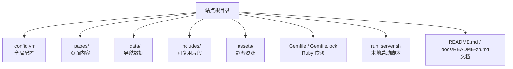
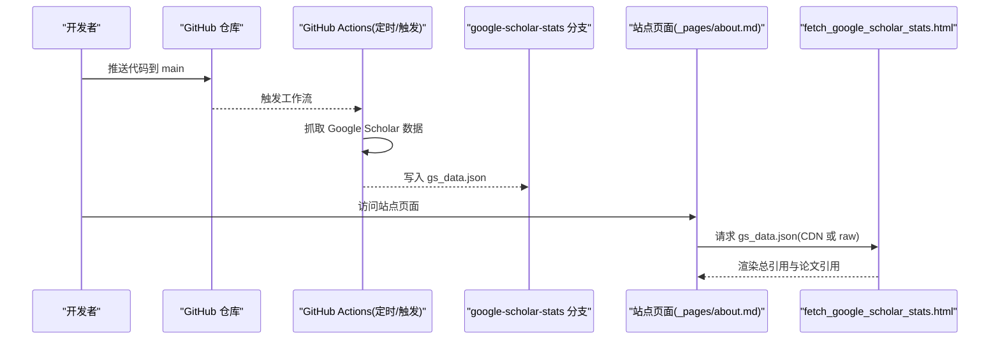
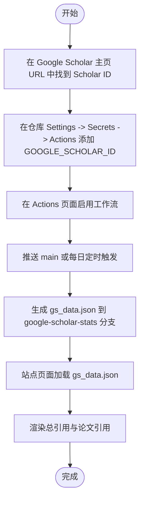
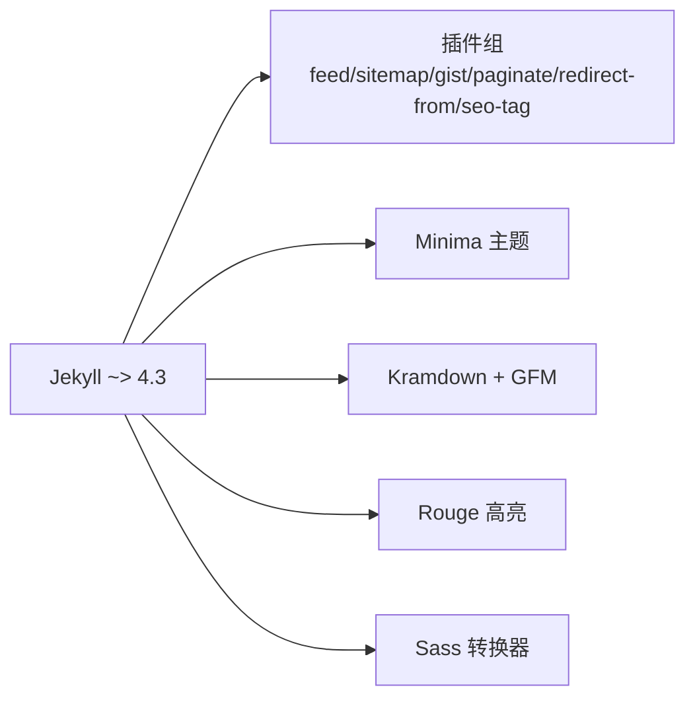

# 快速开始

<cite>
**本文引用的文件**   
- [README.md](file://README.md)
- [docs/README-zh.md](file://docs/README-zh.md)
- [_config.yml](file://_config.yml)
- [Gemfile](file://Gemfile)
- [Gemfile.lock](file://Gemfile.lock)
- [run_server.sh](file://run_server.sh)
- [_pages/about.md](file://_pages/about.md)
- [_data/navigation.yml](file://_data/navigation.yml)
- [_includes/fetch_google_scholar_stats.html](file://_includes/fetch_google_scholar_stats.html)
</cite>

## 目录
1. [简介](#简介)
2. [项目结构](#项目结构)
3. [核心组件](#核心组件)
4. [架构总览](#架构总览)
5. [详细组件分析](#详细组件分析)
6. [依赖分析](#依赖分析)
7. [性能与构建优化](#性能与构建优化)
8. [故障排查指南](#故障排查指南)
9. [结论](#结论)
10. [附录：30分钟上手清单](#附录30分钟上手清单)

## 简介
AcadHomepage 是一个现代、响应式的学术个人主页模板，基于 Jekyll 构建，支持自动更新 Google Scholar 引用统计、Google Analytics 流量统计、SEO 配置等。本快速开始指南面向新手开发者，帮助你在 30 分钟内完成环境准备、仓库 Fork、配置修改、本地运行与部署上线。

## 项目结构
该仓库采用 Jekyll 标准目录组织方式，关键目录与文件如下：
- _config.yml：站点全局配置（标题、作者信息、插件、时区等）
- _pages：页面内容（如 about.md）
- _data：导航数据（navigation.yml）
- _includes：可复用片段（如抓取 Google Scholar 统计的脚本）
- assets：静态资源（CSS、JS、字体等）
- Gemfile/Gemfile.lock：Ruby 依赖声明与锁定版本
- run_server.sh：本地开发启动脚本
- README.md / docs/README-zh.md：英文/中文使用说明

图表来源
- [_config.yml:1-169](file://_config.yml#L1-L169)
- [_pages/about.md:1-250](file://_pages/about.md#L1-L250)
- [_data/navigation.yml:1-26](file://_data/navigation.yml#L1-L26)
- [_includes/fetch_google_scholar_stats.html:1-19](file://_includes/fetch_google_scholar_stats.html#L1-L19)
- [Gemfile:1-51](file://Gemfile#L1-L51)
- [Gemfile.lock:1-142](file://Gemfile.lock#L1-L142)
- [run_server.sh:1-1](file://run_server.sh#L1-L1)
- [README.md:33-66](file://README.md#L33-L66)
- [docs/README-zh.md:35-61](file://docs/README-zh.md#L35-L61)

章节来源
- [README.md:33-66](file://README.md#L33-L66)
- [docs/README-zh.md:35-61](file://docs/README-zh.md#L35-L61)

## 核心组件
- 站点配置中心：_config.yml 集中管理站点元信息、作者资料、插件白名单、Sass 路径、输出格式与时区等。
- 页面内容：_pages/about.md 作为首页入口，包含“关于我”、“论文”、“荣誉”、“教育经历”、“工作经历”、“演讲”、“实习”、“博客”等板块。
- 导航数据：_data/navigation.yml 定义主导航项与跳转锚点。
- Google Scholar 统计：_includes/fetch_google_scholar_stats.html 动态加载 gs_data.json，渲染总引用与单篇论文引用数。
- 依赖管理：Gemfile 声明 Jekyll 及插件版本；Gemfile.lock 锁定实际安装版本，确保构建一致性。
- 本地开发：run_server.sh 使用 bundle exec jekyll serve --livereload 启动热重载服务。

章节来源
- [_config.yml:1-169](file://_config.yml#L1-L169)
- [_pages/about.md:1-250](file://_pages/about.md#L1-L250)
- [_data/navigation.yml:1-26](file://_data/navigation.yml#L1-L26)
- [_includes/fetch_google_scholar_stats.html:1-19](file://_includes/fetch_google_scholar_stats.html#L1-L19)
- [Gemfile:1-51](file://Gemfile#L1-L51)
- [Gemfile.lock:1-142](file://Gemfile.lock#L1-L142)
- [run_server.sh:1-1](file://run_server.sh#L1-L1)

## 架构总览
AcadHomepage 采用“Jekyll 静态站点 + GitHub Pages 托管 + GitHub Actions 定时任务”的轻量架构。用户通过修改 Markdown 内容与配置文件驱动站点生成，GitHub Actions 负责拉取 Google Scholar 引用数据并写入指定分支，前端在运行时按需加载统计数据。

图表来源
- [README.md:33-40](file://README.md#L33-L40)
- [docs/README-zh.md:35-42](file://docs/README-zh.md#L35-L42)
- [_includes/fetch_google_scholar_stats.html:1-19](file://_includes/fetch_google_scholar_stats.html#L1-L19)
- [_pages/about.md:11-16](file://_pages/about.md#L11-L16)

## 详细组件分析

### 环境准备（Ruby、RubyGems、GCC、Make）
- 目标：在本地安装 Jekyll 构建所需的环境，包括 Ruby、RubyGems、GCC 与 Make。
- 参考步骤：
  - 克隆仓库到本地
  - 安装 Jekyll 构建环境（含 Ruby、RubyGems、GCC、Make）
  - 安装 Ruby 依赖（bundle install）
  - 启动本地服务器（bash run_server.sh）
  - 浏览器访问 http://127.0.0.1:4000
- 说明：
  - 官方文档提供了各平台安装指引，建议优先遵循官方教程以确保兼容性。
  - Windows 平台下，若遇到编译扩展问题，请确认已安装 GCC 与 Make，并确保系统 PATH 正确。

章节来源
- [README.md:59-66](file://README.md#L59-L66)
- [docs/README-zh.md:55-61](file://docs/README-zh.md#L55-L61)
- [run_server.sh:1-1](file://run_server.sh#L1-L1)

### 仓库 Fork 与命名
- 将本仓库 Fork 到你的 GitHub 账户，并将仓库名改为 USERNAME.github.io（USERNAME 为你的 GitHub 用户名）。
- 完成后，站点默认部署地址为 https://USERNAME.github.io。

章节来源
- [README.md:33-36](file://README.md#L33-L36)
- [docs/README-zh.md:35-38](file://docs/README-zh.md#L35-L38)

### 设置 Google Scholar ID 与引用统计
- 获取你的 Google Scholar ID：从你的 Google Scholar 主页 URL 中查找 user= 后的标识符。
- 在仓库 Settings -> Secrets -> Actions -> New repository secret 中添加变量：
  - name: GOOGLE_SCHOLAR_ID
  - value: 你的 Scholar ID
- 启用 Actions 工作流：在仓库的 Action 页面点击启用。工作流会在每次推送 main 分支以及每天 UTC 08:00 触发，生成 gs_data.json 到 google-scholar-stats 分支。
- 站点页面会按配置选择 CDN 或 raw.githubusercontent.com 读取 gs_data.json，并在页面上展示总引用与每篇论文的引用数。

图表来源
- [README.md:36-40](file://README.md#L36-L40)
- [docs/README-zh.md:38-42](file://docs/README-zh.md#L38-L42)
- [_includes/fetch_google_scholar_stats.html:1-19](file://_includes/fetch_google_scholar_stats.html#L1-L19)
- [_pages/about.md:11-16](file://_pages/about.md#L11-L16)

章节来源
- [README.md:36-40](file://README.md#L36-L40)
- [docs/README-zh.md:38-42](file://docs/README-zh.md#L38-L42)
- [_includes/fetch_google_scholar_stats.html:1-19](file://_includes/fetch_google_scholar_stats.html#L1-L19)
- [_pages/about.md:11-16](file://_pages/about.md#L11-L16)

### 修改配置文件 _config.yml
- 必填项建议修改：
  - title：站点标题
  - description：站点描述
  - repository：USER_NAME/REPO_NAME（用于构建 gs_data.json 的访问路径）
- 可选项：
  - google_analytics_id：Google Analytics 追踪 ID
  - SEO 相关键值：google_site_verification、bing_site_verification、baidu_site_verification
  - author：作者信息（姓名、头像、邮箱、机构、城市、Google Scholar 链接等）
- 其他重要配置：
  - plugins 与 whitelist：声明使用的 Jekyll 插件
  - sass.load_paths：Sass 加载路径
  - timezone：时区（示例为 Asia/Shanghai）
  - compress_html：HTML 压缩策略（development 环境忽略）

章节来源
- [_config.yml:1-169](file://_config.yml#L1-L169)

### 添加个人内容
- 编辑 _pages/about.md，使用 HTML+Markdown 语法编写“关于我”、“论文”、“荣誉”、“教育经历”、“工作经历”、“演讲”、“实习”等内容。
- 如需显示论文引用数，可在页面中使用 class="show_paper_citations" 的 span 标签，并通过 data 属性设置 Google Scholar 论文 ID。
- 导航项可通过 _data/navigation.yml 调整。

章节来源
- [_pages/about.md:1-250](file://_pages/about.md#L1-L250)
- [_data/navigation.yml:1-26](file://_data/navigation.yml#L1-L26)

### 启动本地开发服务器
- 执行 bash run_server.sh 启动 Jekyll 实时重载服务器。
- 打开浏览器访问 http://127.0.0.1:4000。
- 修改源码后，服务器会自动重新编译并刷新页面。

章节来源
- [run_server.sh:1-1](file://run_server.sh#L1-L1)
- [README.md:59-66](file://README.md#L59-L66)
- [docs/README-zh.md:55-61](file://docs/README-zh.md#L55-L61)

### 部署上线
- 将修改提交并推送到远程仓库。
- 站点默认部署地址为 https://USERNAME.github.io。

章节来源
- [README.md:57-57](file://README.md#L57-L57)
- [docs/README-zh.md:52-53](file://docs/README-zh.md#L52-L53)

## 依赖分析
- Jekyll 版本：~> 4.3（Gemfile 声明），Gemfile.lock 锁定具体版本 4.4.1。
- 主要插件：jekyll-feed、jekyll-sitemap、jekyll-gist、jekyll-paginate、jekyll-redirect-from、jekyll-seo-tag。
- 主题与样式：minima、kramdown、rouge、sass-embedded。
- 平台：x64-mingw-ucrt（Windows 平台）。

图表来源
- [Gemfile:17-50](file://Gemfile#L17-L50)
- [Gemfile.lock:30-110](file://Gemfile.lock#L30-L110)

章节来源
- [Gemfile:1-51](file://Gemfile#L1-L51)
- [Gemfile.lock:1-142](file://Gemfile.lock#L1-L142)

## 性能与构建优化
- 使用 CDN 加速 Google Scholar 数据加载：在 _config.yml 中设置 google_scholar_stats_use_cdn 为 true，可减少跨域与网络延迟，但需注意缓存延迟。
- 关闭不必要的插件：仅保留必要的插件以减少构建时间。
- 合理组织图片与静态资源：避免过大图片影响首屏加载。
- 开启 HTML 压缩：生产环境启用 compress_html，减少传输体积。

章节来源
- [_config.yml:12-12](file://_config.yml#L12-L12)
- [_config.yml:164-169](file://_config.yml#L164-L169)
- [_includes/fetch_google_scholar_stats.html:1-19](file://_includes/fetch_google_scholar_stats.html#L1-L19)

## 故障排查指南
- 本地无法启动或端口占用：
  - 检查是否已有进程占用 4000 端口，必要时更换端口或终止占用进程。
  - 确认已安装 Ruby、RubyGems、GCC、Make，并成功执行 bundle install。
- 页面未显示引用数据：
  - 确认已在仓库 Secrets 中设置 GOOGLE_SCHOLAR_ID。
  - 确认 Actions 已启用且 google-scholar-stats 分支存在 gs_data.json。
  - 检查 _config.yml 中的 repository 是否正确，确保站点能访问 gs_data.json。
  - 若启用 CDN，注意缓存延迟导致的数据更新滞后。
- 构建报错（缺少依赖或编译失败）：
  - 查看 Gemfile.lock 的平台与版本是否与当前环境匹配。
  - Windows 平台需确保 GCC 与 Make 可用，PATH 配置正确。
- 页面渲染异常：
  - 检查 Front Matter 格式是否正确。
  - 检查 Markdown 语法是否有误。
  - 确认文件编码为 UTF-8。
  - 查看浏览器控制台错误信息以定位问题。

章节来源
- [docs/BLOG_USAGE_GUIDE.md:383-430](file://docs/BLOG_USAGE_GUIDE.md#L383-L430)
- [_config.yml:1-169](file://_config.yml#L1-L169)
- [_includes/fetch_google_scholar_stats.html:1-19](file://_includes/fetch_google_scholar_stats.html#L1-L19)

## 结论
通过本快速开始指南，你可以在 30 分钟内完成 AcadHomepage 的环境准备、仓库 Fork、配置修改、本地运行与部署上线。建议在首次搭建后，逐步完善作者信息、论文列表与博客内容，并根据需要启用 SEO 与 Analytics 功能以获得更好的曝光与数据分析能力。

## 附录：30分钟上手清单
- 安装环境：Ruby、RubyGems、GCC、Make（参考官方安装指南）
- 克隆仓库：git clone 你的仓库到本地
- 安装依赖：bundle install
- 启动服务：bash run_server.sh
- 访问站点：http://127.0.0.1:4000
- 修改配置：_config.yml（title、description、repository、author 等）
- 设置 Scholar：在仓库 Secrets 添加 GOOGLE_SCHOLAR_ID，启用 Actions
- 编辑内容：_pages/about.md（HTML+Markdown）
- 提交部署：commit 并 push，站点发布至 https://USERNAME.github.io

章节来源
- [README.md:33-66](file://README.md#L33-L66)
- [docs/README-zh.md:35-61](file://docs/README-zh.md#L35-L61)
- [run_server.sh:1-1](file://run_server.sh#L1-L1)