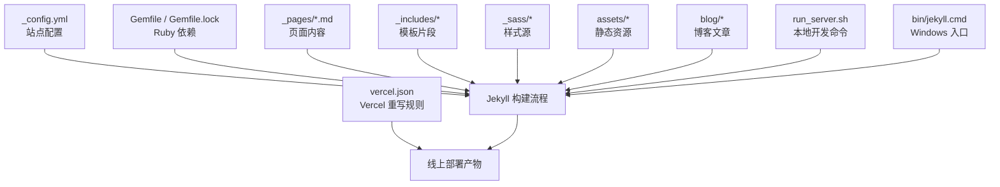
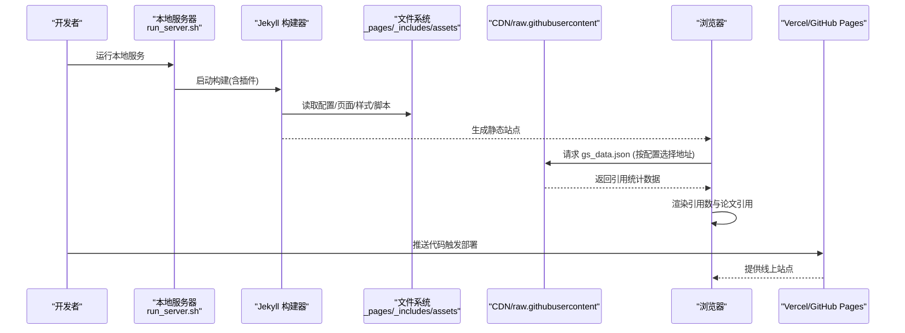
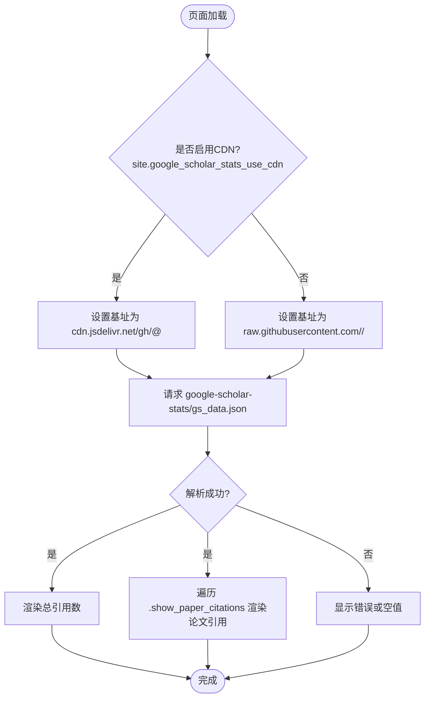
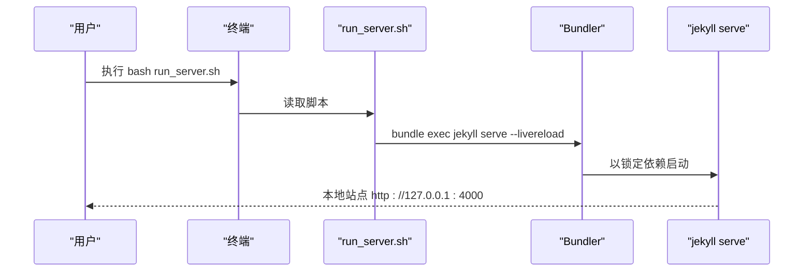
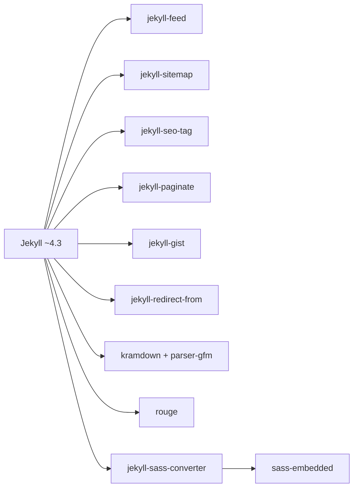

# 故障排除

<cite>
**本文引用的文件**   
- [_config.yml](file://_config.yml)
- [Gemfile](file://Gemfile)
- [Gemfile.lock](file://Gemfile.lock)
- [README.md](file://README.md)
- [docs/README-zh.md](file://docs/README-zh.md)
- [docs/BLOG_USAGE_GUIDE.md](file://docs/BLOG_USAGE_GUIDE.md)
- [_includes/fetch_google_scholar_stats.html](file://_includes/fetch_google_scholar_stats.html)
- [_pages/about.md](file://_pages/about.md)
- [_data/navigation.yml](file://_data/navigation.yml)
- [run_server.sh](file://run_server.sh)
- [bin/jekyll.cmd](file://bin/jekyll.cmd)
- [vercel.json](file://vercel.json)
</cite>

## 目录
1. [简介](#简介)
2. [项目结构](#项目结构)
3. [核心组件](#核心组件)
4. [架构总览](#架构总览)
5. [详细组件分析](#详细组件分析)
6. [依赖分析](#依赖分析)
7. [性能考虑](#性能考虑)
8. [故障排除指南](#故障排除指南)
9. [结论](#结论)
10. [附录](#附录)

## 简介
本指南聚焦于该 Jekyll 学术主页项目的常见问题与解决方案，覆盖环境安装、Jekyll 构建错误、Google Scholar 引用集成失败、部署问题（GitHub Pages/Vercel）、以及性能优化与调试技巧。目标是帮助用户快速定位并解决问题，提升本地开发与线上稳定性。

## 项目结构
本项目采用标准 Jekyll 目录组织：配置位于根目录 _config.yml；页面内容在 _pages；可复用片段在 _includes；样式在 _sass；静态资源在 assets；博客文章在 blog；导航数据在 _data；构建脚本在 run_server.sh；Windows 下通过 bin/jekyll.cmd 调用 Bundler 启动 Jekyll；Vercel 部署由 vercel.json 控制路由重写。

图表来源
- [_config.yml:1-169](file://_config.yml#L1-L169)
- [Gemfile:1-51](file://Gemfile#L1-L51)
- [Gemfile.lock:1-141](file://Gemfile.lock#L1-L141)
- [run_server.sh:1-1](file://run_server.sh#L1-L1)
- [bin/jekyll.cmd:1-19](file://bin/jekyll.cmd#L1-L19)
- [vercel.json:1-1](file://vercel.json#L1-L1)

章节来源
- [_config.yml:1-169](file://_config.yml#L1-L169)
- [Gemfile:1-51](file://Gemfile#L1-L51)
- [Gemfile.lock:1-141](file://Gemfile.lock#L1-L141)
- [run_server.sh:1-1](file://run_server.sh#L1-L1)
- [bin/jekyll.cmd:1-19](file://bin/jekyll.cmd#L1-L19)
- [vercel.json:1-1](file://vercel.json#L1-L1)

## 核心组件
- 站点配置与插件：_config.yml 定义站点元信息、作者信息、Markdown/Sass 处理、输出规则、时区、插件白名单等。
- Ruby 依赖管理：Gemfile 指定 Jekyll 版本及插件组；Gemfile.lock 锁定具体版本与平台。
- Google Scholar 集成：_includes/fetch_google_scholar_stats.html 根据配置选择 CDN 或 raw.githubusercontent 拉取引用统计 JSON，并在前端渲染。
- 页面内容与导航：_pages/about.md 为主页内容；_data/navigation.yml 提供导航项。
- 本地开发：run_server.sh 使用 bundle exec jekyll serve --livereload 启动热重载服务；Windows 通过 bin/jekyll.cmd 调用 Bundler。
- 部署：GitHub Pages 默认支持 Jekyll；Vercel 通过 vercel.json 将全部路径重写到 index.html。

章节来源
- [_config.yml:1-169](file://_config.yml#L1-L169)
- [Gemfile:1-51](file://Gemfile#L1-L51)
- [Gemfile.lock:1-141](file://Gemfile.lock#L1-L141)
- [_includes/fetch_google_scholar_stats.html:1-19](file://_includes/fetch_google_scholar_stats.html#L1-L19)
- [_pages/about.md:1-250](file://_pages/about.md#L1-L250)
- [_data/navigation.yml:1-29](file://_data/navigation.yml#L1-L29)
- [run_server.sh:1-1](file://run_server.sh#L1-L1)
- [bin/jekyll.cmd:1-19](file://bin/jekyll.cmd#L1-L19)
- [vercel.json:1-1](file://vercel.json#L1-L1)

## 架构总览
下图展示从本地开发到线上部署的关键流程，包括 Jekyll 构建、Google Scholar 数据获取与渲染、以及 Vercel 路由重写。

图表来源
- [run_server.sh:1-1](file://run_server.sh#L1-L1)
- [_config.yml:1-169](file://_config.yml#L1-L169)
- [_includes/fetch_google_scholar_stats.html:1-19](file://_includes/fetch_google_scholar_stats.html#L1-L19)
- [vercel.json:1-1](file://vercel.json#L1-L1)

## 详细组件分析

### Google Scholar 引用集成
- 数据来源：google-scholar-stats 分支下的 gs_data.json（或 gs_data_shieldsio.json）。
- 前端加载逻辑：_includes/fetch_google_scholar_stats.html 依据 site.google_scholar_stats_use_cdn 决定使用 jsDelivr CDN 还是 raw.githubusercontent 作为基址，然后发起 JSONP 请求，填充“总引用”和“论文引用”。
- 页面使用：_pages/about.md 中通过 class="show_paper_citations" 的 span 元素标记论文 ID，用于显示单篇论文引用数。

图表来源
- [_includes/fetch_google_scholar_stats.html:1-19](file://_includes/fetch_google_scholar_stats.html#L1-L19)
- [_pages/about.md:1-250](file://_pages/about.md#L1-L250)
- [_config.yml:1-169](file://_config.yml#L1-L169)

章节来源
- [_includes/fetch_google_scholar_stats.html:1-19](file://_includes/fetch_google_scholar_stats.html#L1-L19)
- [_pages/about.md:1-250](file://_pages/about.md#L1-L250)
- [_config.yml:1-169](file://_config.yml#L1-L169)

### 本地开发与 Windows 启动
- Linux/macOS：run_server.sh 执行 bundle exec jekyll serve --livereload，自动监听变更并刷新。
- Windows：bin/jekyll.cmd 通过 Bundler 加载 Gemfile 并调用 jekyll 命令，确保使用锁定的依赖版本。

图表来源
- [run_server.sh:1-1](file://run_server.sh#L1-L1)
- [bin/jekyll.cmd:1-19](file://bin/jekyll.cmd#L1-L19)
- [Gemfile:1-51](file://Gemfile#L1-L51)
- [Gemfile.lock:1-141](file://Gemfile.lock#L1-L141)

章节来源
- [run_server.sh:1-1](file://run_server.sh#L1-L1)
- [bin/jekyll.cmd:1-19](file://bin/jekyll.cmd#L1-L19)
- [Gemfile:1-51](file://Gemfile#L1-L51)
- [Gemfile.lock:1-141](file://Gemfile.lock#L1-L141)

### 导航与页面链接
- 导航项在 _data/navigation.yml 中维护，包含锚点链接与子页面 URL。
- 若出现导航跳转无效或 404，需检查 permalink 与目标页面是否存在。

章节来源
- [_data/navigation.yml:1-29](file://_data/navigation.yml#L1-L29)
- [_pages/about.md:1-250](file://_pages/about.md#L1-L250)

## 依赖分析
- Jekyll 版本：~> 4.3，锁定在 Gemfile.lock 中。
- 关键插件：jekyll-feed、jekyll-sitemap、jekyll-seo-tag、jekyll-paginate、jekyll-gist、jekyll-redirect-from。
- Markdown 与高亮：kramdown、kramdown-parser-gfm、rouge。
- Sass 转换：jekyll-sass-converter（依赖 sass-embedded）。
- 平台：x64-mingw-ucrt（Windows），注意原生扩展编译需求。

图表来源
- [Gemfile:1-51](file://Gemfile#L1-L51)
- [Gemfile.lock:1-141](file://Gemfile.lock#L1-L141)

章节来源
- [Gemfile:1-51](file://Gemfile#L1-L51)
- [Gemfile.lock:1-141](file://Gemfile.lock#L1-L141)

## 性能考虑
- 增量构建：_config.yml 中 incremental 设置为 false，如需加速本地开发可尝试开启，但需注意兼容性。
- Sass 压缩：style: compressed 已启用，减少 CSS 体积。
- 外部脚本：MathJax 通过 CDN 异步加载，避免阻塞首屏。
- 缓存策略：Google Scholar 数据可通过 CDN 获取，存在缓存延迟，必要时切换回 raw.githubusercontent 以获得最新数据。

[本节为通用建议，不直接分析具体文件]

## 故障排除指南

### 一、环境与安装问题
- 症状：bundle install 失败、gem 编译报错、缺少系统工具。
- 排查步骤：
  - 确认 Ruby 版本与平台匹配（Gemfile.lock 显示 x64-mingw-ucrt）。
  - 安装必要的系统依赖（GCC、Make）以满足 sass-embedded 等原生扩展。
  - 清理并重新安装依赖：删除 .bundle、vendor、Gemfile.lock，再执行 bundle install。
  - 使用 bundle exec 运行命令，确保使用锁定版本。
- 参考：
  - [Gemfile:1-51](file://Gemfile#L1-L51)
  - [Gemfile.lock:1-141](file://Gemfile.lock#L1-L141)

章节来源
- [Gemfile:1-51](file://Gemfile#L1-L51)
- [Gemfile.lock:1-141](file://Gemfile.lock#L1-L141)

### 二、Jekyll 构建错误
- 症状：构建时报错、插件未找到、Sass 编译失败。
- 排查步骤：
  - 检查 _config.yml 中的 plugins 与 whitelist 是否一致。
  - 确认 kramdown、rouge、jekyll-sass-converter 等依赖版本兼容。
  - 在 Windows 上通过 bin/jekyll.cmd 启动，避免 PATH 问题。
  - 查看控制台日志，定位具体插件或语法错误。
- 参考：
  - [_config.yml:148-169](file://_config.yml#L148-L169)
  - [bin/jekyll.cmd:1-19](file://bin/jekyll.cmd#L1-L19)

章节来源
- [_config.yml:148-169](file://_config.yml#L148-L169)
- [bin/jekyll.cmd:1-19](file://bin/jekyll.cmd#L1-L19)

### 三、Google Scholar 引用集成失败
- 症状：总引用数为空、论文引用未显示、控制台报跨域或 404。
- 排查步骤：
  - 确认仓库中存在 google-scholar-stats 分支且包含 gs_data.json。
  - 检查 _config.yml 中 repository 是否正确（影响 CDN/raw 基址拼接）。
  - 根据网络情况调整 google_scholar_stats_use_cdn：
    - true：使用 jsDelivr CDN，可能受缓存影响。
    - false：使用 raw.githubusercontent，中国大陆地区可能被墙。
  - 打开浏览器控制台，查看 JSON 请求状态码与响应体。
  - 验证 _pages/about.md 中论文 data 属性是否与 gs_data.json 中的 publications 键一致。
- 参考：
  - [_includes/fetch_google_scholar_stats.html:1-19](file://_includes/fetch_google_scholar_stats.html#L1-L19)
  - [_config.yml:11-12](file://_config.yml#L11-L12)
  - [_pages/about.md:1-250](file://_pages/about.md#L1-L250)

章节来源
- [_includes/fetch_google_scholar_stats.html:1-19](file://_includes/fetch_google_scholar_stats.html#L1-L19)
- [_config.yml:11-12](file://_config.yml#L11-L12)
- [_pages/about.md:1-250](file://_pages/about.md#L1-L250)

### 四、部署问题（GitHub Pages / Vercel）
- GitHub Pages：
  - 确认仓库名为 USERNAME.github.io 或启用 Pages 分支。
  - 检查 _config.yml 中 repository 与站点域名一致性。
- Vercel：
  - vercel.json 将所有路径重写到 index.html，适用于 SPA 风格；若需要多页路由，请调整 rewrites 规则。
  - 构建阶段无需额外命令，Jekyll 静态产物可直接部署。
- 参考：
  - [vercel.json:1-1](file://vercel.json#L1-L1)
  - [_config.yml:11](file://_config.yml#L11)

章节来源
- [vercel.json:1-1](file://vercel.json#L1-L1)
- [_config.yml:11](file://_config.yml#L11)

### 五、本地开发问题
- 症状：端口占用、热重载不生效、页面不刷新。
- 排查步骤：
  - 使用 run_server.sh 启动，确保 bundle 环境正确。
  - 关闭占用 4000 端口的进程或更换端口。
  - 修改 _config.yml 后需重启服务（Jekyll 不会自动重载配置）。
- 参考：
  - [run_server.sh:1-1](file://run_server.sh#L1-L1)
  - [_config.yml:5-6](file://_config.yml#L5-L6)

章节来源
- [run_server.sh:1-1](file://run_server.sh#L1-L1)
- [_config.yml:5-6](file://_config.yml#L5-L6)

### 六、导航与链接问题
- 症状：导航点击无响应、跳转到 404。
- 排查步骤：
  - 检查 _data/navigation.yml 中的 url 与 _pages 中对应文件的 permalink 是否一致。
  - 确认页面 Front Matter 中 permalink 设置正确。
- 参考：
  - [_data/navigation.yml:1-29](file://_data/navigation.yml#L1-L29)
  - [_pages/about.md:1-10](file://_pages/about.md#L1-L10)

章节来源
- [_data/navigation.yml:1-29](file://_data/navigation.yml#L1-L29)
- [_pages/about.md:1-10](file://_pages/about.md#L1-L10)

### 七、SEO 与第三方服务
- 症状：Google Analytics 不计数、站点验证失败。
- 排查步骤：
  - 在 _config.yml 中填写 google_analytics_id 与站点验证 key。
  - 检查浏览器控制台是否有跨域或脚本加载错误。
- 参考：
  - [_config.yml:14-20](file://_config.yml#L14-L20)

章节来源
- [_config.yml:14-20](file://_config.yml#L14-L20)

### 八、Markdown 与样式问题
- 症状：表格/列表渲染异常、数学公式不显示。
- 排查步骤：
  - 确认 _config.yml 中 markdown: kramdown 与 kramdown 选项。
  - MathJax 通过 CDN 异步加载，检查网络与 CSP 策略。
  - 参考文档中的最佳实践与示例。
- 参考：
  - [_config.yml:102-118](file://_config.yml#L102-L118)
  - [docs/BLOG_USAGE_GUIDE.md:383-430](file://docs/BLOG_USAGE_GUIDE.md#L383-L430)

章节来源
- [_config.yml:102-118](file://_config.yml#L102-L118)
- [docs/BLOG_USAGE_GUIDE.md:383-430](file://docs/BLOG_USAGE_GUIDE.md#L383-L430)

### 九、性能优化建议
- 开启增量构建（谨慎评估兼容性）。
- 使用 CDN 获取外部资源（如 MathJax、Google Scholar 数据）。
- 压缩静态资源（Sass style: compressed 已启用）。
- 减少不必要的插件与脚本加载。

[本节为通用建议，不直接分析具体文件]

### 十、社区支持与帮助渠道
- 官方文档：Jekyll、Kramdown、Liquid 模板语言。
- 项目说明：README 与 docs/README-zh.md 提供快速开始与本地调试指引。
- 参考：
  - [README.md:33-66](file://README.md#L33-L66)
  - [docs/README-zh.md:35-61](file://docs/README-zh.md#L35-L61)
  - [docs/BLOG_USAGE_GUIDE.md:420-430](file://docs/BLOG_USAGE_GUIDE.md#L420-L430)

章节来源
- [README.md:33-66](file://README.md#L33-L66)
- [docs/README-zh.md:35-61](file://docs/README-zh.md#L35-L61)
- [docs/BLOG_USAGE_GUIDE.md:420-430](file://docs/BLOG_USAGE_GUIDE.md#L420-L430)

## 结论
通过系统化地检查环境依赖、Jekyll 配置、Google Scholar 数据源与部署配置，大多数问题可以快速定位与修复。建议在本地使用 run_server.sh 进行热重载调试，结合浏览器控制台与构建日志进行排错；在线上部署时，优先保证依赖与配置的一致性，并根据网络环境选择合适的 CDN 策略。

[本节为总结性内容，不直接分析具体文件]

## 附录
- 常用命令：
  - 本地开发：bash run_server.sh
  - Windows 启动：bin/jekyll.cmd
  - 依赖安装：bundle install
- 关键配置文件：
  - _config.yml：站点与插件配置
  - Gemfile / Gemfile.lock：依赖与版本锁定
  - vercel.json：Vercel 路由重写

[本节为补充信息，不直接分析具体文件]