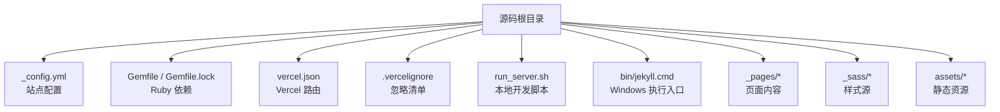
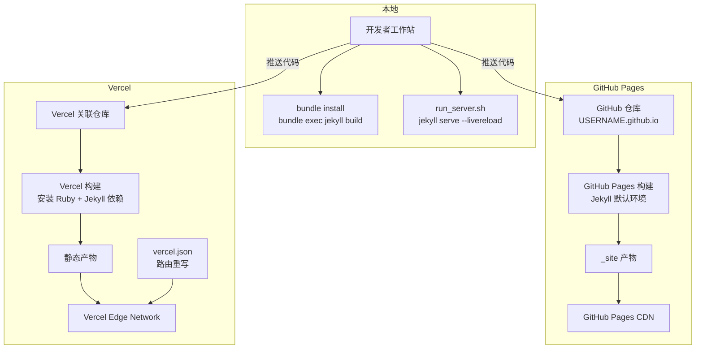
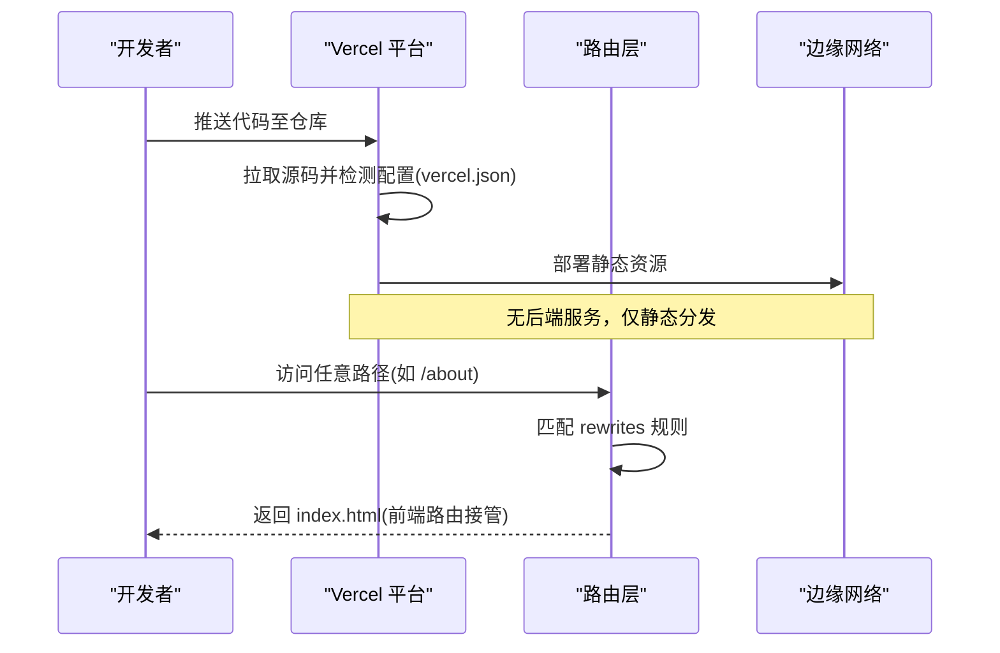
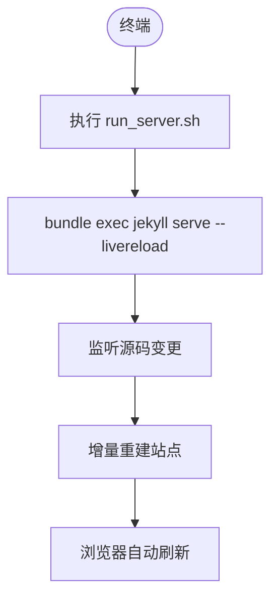
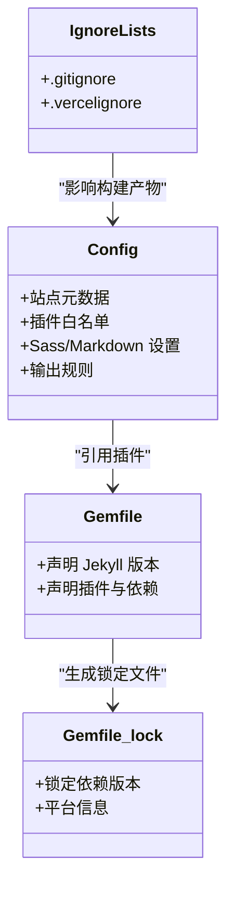

# 部署指南

<cite>
**本文引用的文件**   
- [_config.yml](file://_config.yml)
- [Gemfile](file://Gemfile)
- [Gemfile.lock](file://Gemfile.lock)
- [vercel.json](file://vercel.json)
- [.vercelignore](file://.vercelignore)
- [README.md](file://README.md)
- [docs/README-zh.md](file://docs/README-zh.md)
- [run_server.sh](file://run_server.sh)
- [bin/jekyll.cmd](file://bin/jekyll.cmd)
</cite>

## 目录
1. [简介](#简介)
2. [项目结构](#项目结构)
3. [核心组件](#核心组件)
4. [架构总览](#架构总览)
5. [详细组件分析](#详细组件分析)
6. [依赖与版本控制](#依赖与版本控制)
7. [性能优化与生产最佳实践](#性能优化与生产最佳实践)
8. [自动化部署与持续集成](#自动化部署与持续集成)
9. [故障排除](#故障排除)
10. [结论](#结论)

## 简介
本指南面向使用 Jekyll 构建的静态站点，提供多平台部署方案与最佳实践。重点覆盖：
- GitHub Pages 与 Vercel 两种主流平台的部署流程
- 构建环境配置、依赖管理与版本控制策略
- 生产环境优化（缓存、CDN、压缩、SEO）
- 自动化部署工作流与持续集成建议
- 常见问题排查方法

## 项目结构
仓库采用典型的 Jekyll 静态站点结构，包含站点配置、主题样式、页面内容、资源与脚本等。关键目录与文件：
- _config.yml：Jekyll 全局配置（站点信息、插件、Sass、输出规则等）
- Gemfile/Gemfile.lock：Ruby 依赖与锁定版本
- vercel.json：Vercel 路由重写配置
- .vercelignore：Vercel 忽略清单
- run_server.sh：本地开发启动脚本
- bin/jekyll.cmd：Windows 下通过 Bundler 执行 jekyll 的入口
- README.md / docs/README-zh.md：快速开始与中文说明

图表来源
- [_config.yml:1-169](file://_config.yml#L1-L169)
- [Gemfile:1-51](file://Gemfile#L1-L51)
- [Gemfile.lock:1-142](file://Gemfile.lock#L1-L142)
- [vercel.json:1-1](file://vercel.json#L1-L1)
- [.vercelignore:1-7](file://.vercelignore#L1-L7)
- [run_server.sh:1-1](file://run_server.sh#L1-L1)
- [bin/jekyll.cmd:1-19](file://bin/jekyll.cmd#L1-L19)

章节来源
- [README.md:33-57](file://README.md#L33-L57)
- [docs/README-zh.md:35-53](file://docs/README-zh.md#L35-L53)

## 核心组件
- 站点配置中心：_config.yml 集中管理站点元数据、Markdown/Sass 处理、插件白名单、输出规则与 HTML 压缩等。
- 依赖管理：Gemfile 声明 Jekyll 及插件版本；Gemfile.lock 锁定具体版本，确保构建可重现。
- 平台适配：
  - GitHub Pages：基于仓库名 USERNAME.github.io 自动发布，支持内置 Jekyll 构建。
  - Vercel：通过 vercel.json 实现 SPA 式路由重写，将非静态路径重写到 index.html。
- 本地开发：run_server.sh 调用 bundle exec jekyll serve --livereload 提供热重载体验。

章节来源
- [_config.yml:1-169](file://_config.yml#L1-L169)
- [Gemfile:1-51](file://Gemfile#L1-L51)
- [Gemfile.lock:1-142](file://Gemfile.lock#L1-L142)
- [vercel.json:1-1](file://vercel.json#L1-L1)
- [run_server.sh:1-1](file://run_server.sh#L1-L1)

## 架构总览
下图展示从源码到线上站点的整体流程，包括本地开发与两种平台的生产构建路径。

图表来源
- [_config.yml:1-169](file://_config.yml#L1-L169)
- [Gemfile:1-51](file://Gemfile#L1-L51)
- [Gemfile.lock:1-142](file://Gemfile.lock#L1-L142)
- [vercel.json:1-1](file://vercel.json#L1-L1)
- [run_server.sh:1-1](file://run_server.sh#L1-L1)

## 详细组件分析

### GitHub Pages 部署
- 前置条件
  - 仓库命名规范：USERNAME.github.io（或子路径下的 Pages 站点）。
  - 启用 Pages：在仓库设置中开启 GitHub Pages，选择分支与根目录（通常为 main 分支与根目录）。
- 构建环境
  - GitHub Pages 使用官方 Jekyll 环境，插件白名单由平台维护。
  - 本项目 _config.yml 中的 whitelist 用于本地模拟 --safe 模式，便于本地验证与平台一致性。
- 构建产物
  - 构建后生成 _site 目录，GitHub Pages 会将其作为静态站点根目录发布。
- 注意事项
  - 若使用自定义域名，需在仓库设置中添加 CNAME 并上传对应证书。
  - 如需 SEO 与站点地图，请确认已启用相关插件（已在配置中声明）。

章节来源
- [README.md:33-57](file://README.md#L33-L57)
- [_config.yml:148-169](file://_config.yml#L148-L169)

### Vercel 部署
- 前置条件
  - 在 Vercel 中导入该仓库，选择框架为“其他”（Other），因为这是纯静态站点。
- 构建命令
  - 由于是静态站点，无需额外构建命令；但需确保 Vercel 环境中能解析 Ruby 与 Jekyll 依赖（如需要服务端渲染或预构建）。对于纯静态站点，可直接上传源码，Vercel 会将所有静态资源直接分发。
- 路由重写
  - vercel.json 定义了将所有请求重写到 index.html，以支持前端路由（SPA 风格）。
- 忽略清单
  - .vercelignore 排除了 node_modules、build、dist、.git 等无关目录，减少上传体积。

图表来源
- [vercel.json:1-1](file://vercel.json#L1-L1)
- [.vercelignore:1-7](file://.vercelignore#L1-L7)

章节来源
- [vercel.json:1-1](file://vercel.json#L1-L1)
- [.vercelignore:1-7](file://.vercelignore#L1-L7)

### 本地开发与调试
- 启动开发服务器
  - 运行 run_server.sh，内部调用 bundle exec jekyll serve --livereload，修改源码后浏览器自动刷新。
- Windows 环境
  - 可通过 bin/jekyll.cmd 借助 Bundler 执行 jekyll 命令，确保使用 Gemfile 指定的版本与环境。

图表来源
- [run_server.sh:1-1](file://run_server.sh#L1-L1)
- [bin/jekyll.cmd:1-19](file://bin/jekyll.cmd#L1-L19)

章节来源
- [run_server.sh:1-1](file://run_server.sh#L1-L1)
- [bin/jekyll.cmd:1-19](file://bin/jekyll.cmd#L1-L19)

## 依赖与版本控制
- Ruby 与 Jekyll 版本
  - Gemfile 指定 jekyll "~> 4.3"，保证主版本稳定且兼容安全更新。
  - Gemfile.lock 锁定了所有依赖的具体版本，确保不同环境构建一致。
- 插件与工具链
  - 插件包括分页、站点地图、Gist、Feed、SEO 标签、重定向等，均在 Gemfile 与 _config.yml 中同步声明。
- 时间与时区
  - _config.yml 设置时区为 Asia/Shanghai，确保文章时间与站点时间一致。
- 构建产物与忽略
  - _site 目录应被忽略（避免提交构建产物），保持仓库精简。
  - .vercelignore 与 .gitignore 分别针对 Vercel 与 Git 的忽略策略。

图表来源
- [Gemfile:1-51](file://Gemfile#L1-L51)
- [Gemfile.lock:1-142](file://Gemfile.lock#L1-L142)
- [_config.yml:1-169](file://_config.yml#L1-L169)

章节来源
- [Gemfile:1-51](file://Gemfile#L1-L51)
- [Gemfile.lock:1-142](file://Gemfile.lock#L1-L142)
- [_config.yml:1-169](file://_config.yml#L1-L169)

## 性能优化与生产最佳实践
- 压缩与体积优化
  - 启用 HTML 压缩（compress_html），在开发环境忽略，在生产环境生效，减小响应体积。
  - Sass 输出 style: compressed，减少 CSS 体积。
- 缓存策略
  - GitHub Pages 与 Vercel 均提供全球 CDN，静态资源具备强缓存能力。
  - 对长期不变的资源（字体、图标、第三方库）建议使用带哈希的文件名，配合长缓存头。
- CDN 与外部资源
  - 配置 google_scholar_stats_use_cdn 为 true，通过 CDN 读取 Google Scholar 引用统计，提升国内访问稳定性。注意 CDN 缓存可能导致数据延迟。
- SEO 与可发现性
  - 启用 jekyll-sitemap 与 jekyll-seo-tag，生成站点地图与 SEO 元信息，利于搜索引擎收录。
- 监控与分析
  - 可选配置 google_analytics_id，接入流量分析。
- 构建产物清理
  - 确保 _site 未被提交，避免冗余；CI/CD 中每次构建前清理旧产物，防止污染。

章节来源
- [_config.yml:164-169](file://_config.yml#L164-L169)
- [_config.yml:131-141](file://_config.yml#L131-L141)
- [_config.yml:12-12](file://_config.yml#L12-L12)
- [_config.yml:148-161](file://_config.yml#L148-L161)
- [docs/README-zh.md:50-51](file://docs/README-zh.md#L50-L51)

## 自动化部署与持续集成
- GitHub Actions（推荐）
  - 触发条件：main 分支 push 或定时任务。
  - 步骤建议：
    - 设置 Ruby 环境（与 Gemfile 版本对齐）。
    - 安装依赖（bundle install）。
    - 构建站点（bundle exec jekyll build）。
    - 部署到 GitHub Pages（使用官方 action 或 rsync 到 gh-pages 分支）。
  - 敏感信息：Google Scholar ID 等通过仓库 Secrets 注入。
- Vercel CI
  - 自动检测 vercel.json 与忽略清单，构建完成后自动部署。
  - 环境变量可在 Vercel 控制台配置，无需写入仓库。
- 构建缓存
  - 在 CI 中缓存 Ruby 包与 Jekyll 构建缓存，加速后续构建。
- 回滚与预览
  - Vercel 支持每个 PR 的预览部署；GitHub Pages 可通过切换分支或回滚提交实现回滚。

[本节为通用指导，不直接分析具体文件]

## 故障排除
- 构建失败（依赖缺失或版本冲突）
  - 检查 Gemfile 与 Gemfile.lock 是否一致；在 CI 中先执行 bundle install，再执行构建。
  - 若出现 webrick 或 tzinfo 相关错误，确认 Gemfile 中已显式声明这些依赖。
- 路由问题（Vercel）
  - 确认 vercel.json 的 rewrites 规则正确，所有非静态路径重写到 index.html。
  - 检查 .vercelignore 是否误忽略了必要资源。
- 本地与线上不一致
  - 使用 _config.yml 的 whitelist 模拟 --safe 模式，确保本地与 GitHub Pages 行为一致。
  - 对比本地与 CI 的 Ruby/Jekyll 版本，必要时在 CI 中固定版本。
- 外部资源不可用
  - 若 Google Scholar 统计无法加载，检查 google_scholar_stats_use_cdn 配置与网络连通性。
- 构建产物污染
  - 确保 _site 未被提交；CI 中每次构建前清理旧产物。

章节来源
- [Gemfile:1-51](file://Gemfile#L1-L51)
- [Gemfile.lock:1-142](file://Gemfile.lock#L1-L142)
- [vercel.json:1-1](file://vercel.json#L1-L1)
- [.vercelignore:1-7](file://.vercelignore#L1-L7)
- [_config.yml:148-169](file://_config.yml#L148-L169)
- [docs/README-zh.md:50-51](file://docs/README-zh.md#L50-L51)

## 结论
本指南提供了基于 Jekyll 的静态站点在多平台（GitHub Pages、Vercel）的完整部署方案，涵盖构建环境、依赖管理、版本控制、生产优化与自动化流水线。通过合理的配置与最佳实践，可实现稳定、高效、可观测的站点交付与运维。