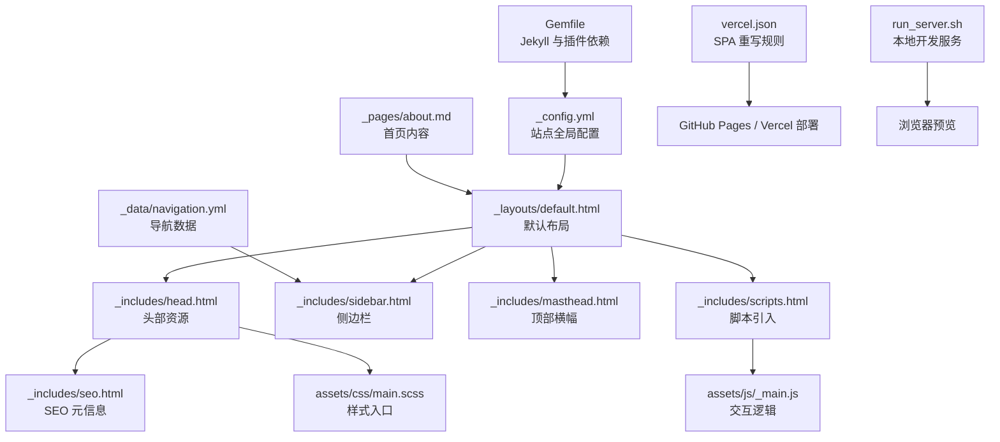
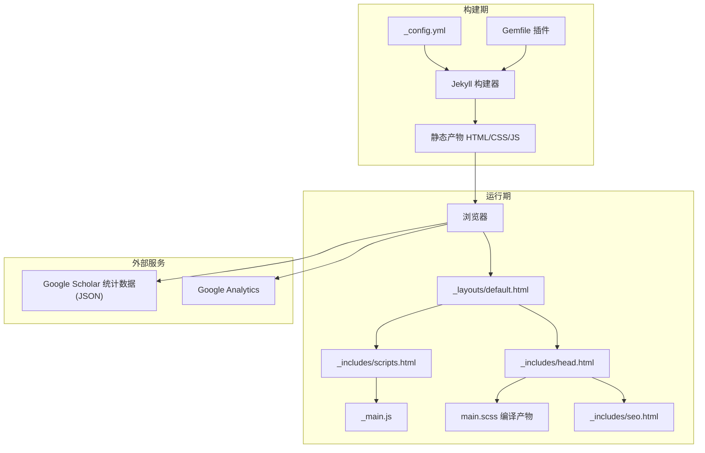
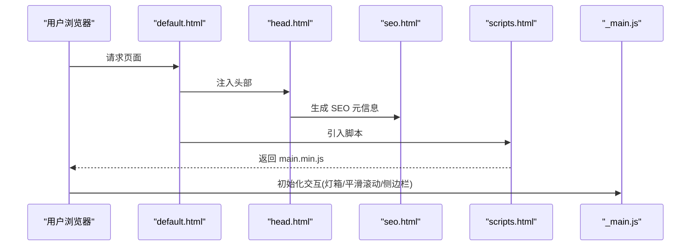
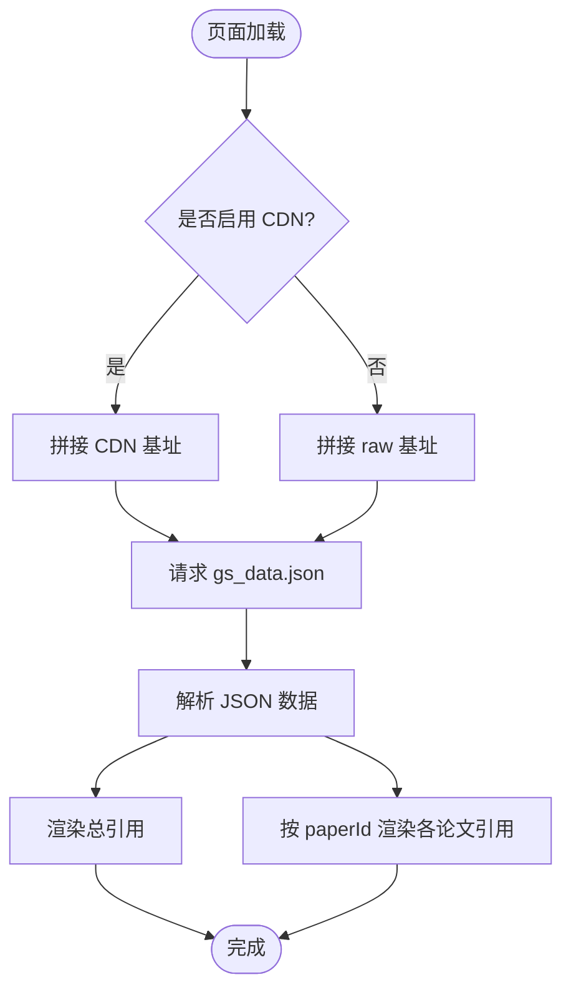
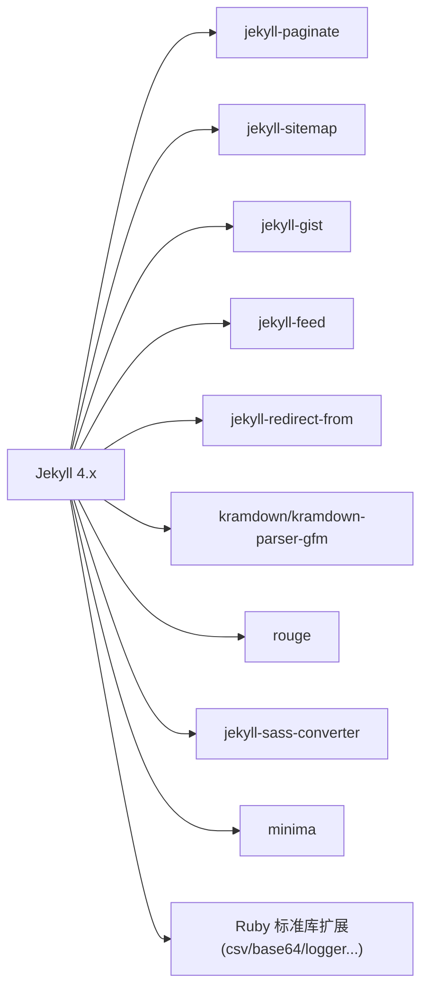

# 项目概述

<cite>
**本文引用的文件**   
- [README.md](file://README.md)
- [_config.yml](file://_config.yml)
- [Gemfile](file://Gemfile)
- [vercel.json](file://vercel.json)
- [_layouts/default.html](file://_layouts/default.html)
- [_includes/head.html](file://_includes/head.html)
- [_includes/seo.html](file://_includes/seo.html)
- [_includes/analytics.html](file://_includes/analytics.html)
- [_includes/fetch_google_scholar_stats.html](file://_includes/fetch_google_scholar_stats.html)
- [_data/navigation.yml](file://_data/navigation.yml)
- [_pages/about.md](file://_pages/about.md)
- [assets/css/main.scss](file://assets/css/main.scss)
- [assets/js/_main.js](file://assets/js/_main.js)
- [_includes/scripts.html](file://_includes/scripts.html)
- [run_server.sh](file://run_server.sh)
- [docs/README-zh.md](file://docs/README-zh.md)
</cite>

## 目录
1. [简介](#简介)
2. [项目结构](#项目结构)
3. [核心组件](#核心组件)
4. [架构总览](#架构总览)
5. [详细组件分析](#详细组件分析)
6. [依赖分析](#依赖分析)
7. [性能考量](#性能考量)
8. [故障排查指南](#故障排查指南)
9. [结论](#结论)
10. [附录](#附录)

## 简介
AcadHomepage 是一个基于 Jekyll 的现代化、响应式学术个人主页模板，面向学术研究人员与技术人员。它提供以下关键能力：
- 自动更新 Google Scholar 引用统计（通过 GitHub Actions 定时任务生成数据，页面侧动态加载）
- Google Analytics 集成（可选配置）
- SEO 优化（Open Graph、Twitter Card、站点验证等）
- 响应式布局与简洁美观的设计
- 静态站点生成模式，便于在 GitHub Pages 或 Vercel 等平台部署

该仓库同时包含中文文档与快速开始说明，适合快速搭建并维护个人学术主页。

章节来源
- [README.md:26-32](file://README.md#L26-L32)
- [docs/README-zh.md:28-33](file://docs/README-zh.md#L28-L33)

## 项目结构
本项目采用典型的 Jekyll 静态站点组织方式，按功能分层与模块化拆分：
- 配置层：站点全局配置、插件与输出策略
- 布局与片段：默认布局、头部、SEO、脚本、侧边栏等可复用片段
- 内容层：以 Markdown 为主的页面与导航数据
- 样式与脚本：SCSS 主入口、主题变量与混入、交互脚本
- 构建与部署：本地运行脚本、Vercel 重写规则

图表来源
- [_config.yml:1-169](file://_config.yml#L1-L169)
- [_layouts/default.html:1-34](file://_layouts/default.html#L1-L34)
- [_includes/head.html:1-16](file://_includes/head.html#L1-L16)
- [_includes/seo.html:1-76](file://_includes/seo.html#L1-L76)
- [_includes/scripts.html:1-1](file://_includes/scripts.html#L1-L1)
- [assets/js/_main.js:1-99](file://assets/js/_main.js#L1-L99)
- [assets/css/main.scss:1-342](file://assets/css/main.scss#L1-L342)
- [_data/navigation.yml:1-26](file://_data/navigation.yml#L1-L26)
- [_pages/about.md:1-250](file://_pages/about.md#L1-L250)
- [Gemfile:1-51](file://Gemfile#L1-L51)
- [vercel.json:1-1](file://vercel.json#L1-L1)
- [run_server.sh:1-1](file://run_server.sh#L1-L1)

章节来源
- [_config.yml:1-169](file://_config.yml#L1-L169)
- [_layouts/default.html:1-34](file://_layouts/default.html#L1-L34)
- [_includes/head.html:1-16](file://_includes/head.html#L1-L16)
- [_includes/seo.html:1-76](file://_includes/seo.html#L1-L76)
- [_includes/scripts.html:1-1](file://_includes/scripts.html#L1-L1)
- [assets/js/_main.js:1-99](file://assets/js/_main.js#L1-L99)
- [assets/css/main.scss:1-342](file://assets/css/main.scss#L1-L342)
- [_data/navigation.yml:1-26](file://_data/navigation.yml#L1-L26)
- [_pages/about.md:1-250](file://_pages/about.md#L1-L250)
- [Gemfile:1-51](file://Gemfile#L1-L51)
- [vercel.json:1-1](file://vercel.json#L1-L1)
- [run_server.sh:1-1](file://run_server.sh#L1-L1)

## 核心组件
- 站点配置与插件
  - 站点标题、描述、作者信息与社交链接
  - Google Analytics ID、SEO 站点验证键值
  - Jekyll 插件白名单与压缩策略
- 默认布局与片段
  - 默认 HTML 骨架，注入 head、masthead、sidebar、scripts 等片段
  - SEO 片段负责 Open Graph、Twitter Card、canonical URL 与站点验证
- 前端资源
  - SCSS 主入口聚合基础样式、组件样式与第三方库
  - 主脚本实现粘性页脚、图片灯箱、平滑滚动、侧边栏自适应等
- 内容与导航
  - 首页内容以 Markdown 编写，支持论文卡片、引用展示等
  - 导航数据集中管理，便于统一修改
- 构建与部署
  - Gemfile 锁定 Jekyll 版本与插件
  - Vercel 重写规则适配 SPA 路由
  - 本地开发脚本一键启动热重载服务

章节来源
- [_config.yml:1-169](file://_config.yml#L1-L169)
- [_layouts/default.html:1-34](file://_layouts/default.html#L1-L34)
- [_includes/seo.html:1-76](file://_includes/seo.html#L1-L76)
- [assets/css/main.scss:1-342](file://assets/css/main.scss#L1-L342)
- [assets/js/_main.js:1-99](file://assets/js/_main.js#L1-L99)
- [_data/navigation.yml:1-26](file://_data/navigation.yml#L1-L26)
- [Gemfile:1-51](file://Gemfile#L1-L51)
- [vercel.json:1-1](file://vercel.json#L1-L1)
- [run_server.sh:1-1](file://run_server.sh#L1-L1)

## 架构总览
整体为“静态站点 + 客户端增强”的架构：
- 构建期：Jekyll 将 Markdown 与片段渲染为静态 HTML/CSS/JS
- 运行期：浏览器加载主样式与脚本，执行交互逻辑
- 外部集成：Google Analytics 埋点、Google Scholar 引用数据通过 JSON 动态加载

图表来源
- [_config.yml:1-169](file://_config.yml#L1-L169)
- [Gemfile:1-51](file://Gemfile#L1-L51)
- [_layouts/default.html:1-34](file://_layouts/default.html#L1-L34)
- [_includes/head.html:1-16](file://_includes/head.html#L1-L16)
- [_includes/seo.html:1-76](file://_includes/seo.html#L1-L76)
- [_includes/scripts.html:1-1](file://_includes/scripts.html#L1-L1)
- [assets/js/_main.js:1-99](file://assets/js/_main.js#L1-L99)
- [assets/css/main.scss:1-342](file://assets/css/main.scss#L1-L342)

## 详细组件分析

### 布局与片段系统
- 默认布局负责页面骨架与片段组合，确保 SEO、分析与脚本的统一注入
- 头部片段负责字符集、视口、CSS 引入与 JS 能力检测
- SEO 片段根据站点与页面元数据生成 canonical、OG、Twitter 与站点验证标签
- 脚本片段统一引入主脚本，避免重复引用

图表来源
- [_layouts/default.html:1-34](file://_layouts/default.html#L1-L34)
- [_includes/head.html:1-16](file://_includes/head.html#L1-L16)
- [_includes/seo.html:1-76](file://_includes/seo.html#L1-L76)
- [_includes/scripts.html:1-1](file://_includes/scripts.html#L1-L1)
- [assets/js/_main.js:1-99](file://assets/js/_main.js#L1-L99)

章节来源
- [_layouts/default.html:1-34](file://_layouts/default.html#L1-L34)
- [_includes/head.html:1-16](file://_includes/head.html#L1-L16)
- [_includes/seo.html:1-76](file://_includes/seo.html#L1-L76)
- [_includes/scripts.html:1-1](file://_includes/scripts.html#L1-L1)
- [assets/js/_main.js:1-99](file://assets/js/_main.js#L1-L99)

### 搜索引擎优化（SEO）
- 自动生成 canonical URL 与 OG/Twitter 元信息
- 支持 Google/Bing/Baidu 站点验证
- 依据页面与站点配置选择描述与作者信息

章节来源
- [_includes/seo.html:1-76](file://_includes/seo.html#L1-L76)
- [_config.yml:17-21](file://_config.yml#L17-L21)

### 流量分析（Google Analytics）
- 通过配置项启用 gtag.js 埋点
- 可按页面级开关控制是否启用

章节来源
- [_config.yml:14-15](file://_config.yml#L14-L15)
- [_includes/analytics.html:1-13](file://_includes/analytics.html#L1-L13)

### Google Scholar 引用统计
- 构建期由 GitHub Actions 生成 gs_data.json 到指定分支
- 运行期通过脚本从 CDN 或 raw 地址拉取 JSON，并按 paperId 填充引用数
- 支持切换 CDN 以提升国内访问稳定性

图表来源
- [_includes/fetch_google_scholar_stats.html:1-19](file://_includes/fetch_google_scholar_stats.html#L1-L19)
- [_config.yml:12](file://_config.yml#L12)
- [_pages/about.md:11-16](file://_pages/about.md#L11-L16)

章节来源
- [_includes/fetch_google_scholar_stats.html:1-19](file://_includes/fetch_google_scholar_stats.html#L1-L19)
- [_config.yml:12](file://_config.yml#L12)
- [_pages/about.md:11-16](file://_pages/about.md#L11-L16)

### 样式与响应式
- SCSS 主入口聚合基础、组件与第三方样式
- 自定义论文卡片、徽章、特性网格、代码块等 UI 组件
- 使用媒体查询与 Flex/Grid 实现多端适配

章节来源
- [assets/css/main.scss:1-342](file://assets/css/main.scss#L1-L342)

### 交互脚本
- 粘性页脚、图片灯箱、平滑滚动、侧边栏自适应
- 移动端友好：折叠菜单与尺寸监听

章节来源
- [assets/js/_main.js:1-99](file://assets/js/_main.js#L1-L99)

### 导航与内容
- 导航数据集中管理，支持锚点跳转与子页面
- 首页内容以 Markdown 编写，支持论文卡片与引用占位符

章节来源
- [_data/navigation.yml:1-26](file://_data/navigation.yml#L1-L26)
- [_pages/about.md:1-250](file://_pages/about.md#L1-L250)

### 构建与部署
- Gemfile 固定 Jekyll 版本与插件集合
- Vercel 重写规则保证 SPA 路由回退至 index.html
- 本地开发脚本一键启动热重载

章节来源
- [Gemfile:1-51](file://Gemfile#L1-L51)
- [vercel.json:1-1](file://vercel.json#L1-L1)
- [run_server.sh:1-1](file://run_server.sh#L1-L1)

## 依赖分析
- 运行时依赖
  - Jekyll 4.x 与常用插件（分页、sitemap、gist、feed、重定向等）
  - Ruby 标准库补充（csv、base64、logger 等）
  - 主题与工具链（kramdown、rouge、sass-converter、minima 等）
- 外部服务
  - Google Analytics（可选）
  - Google Scholar 统计数据（JSON）
  - 第三方字体与图标（Font Awesome）

图表来源
- [Gemfile:1-51](file://Gemfile#L1-L51)

章节来源
- [Gemfile:1-51](file://Gemfile#L1-L51)

## 性能考量
- 静态站点生成减少服务端压力，利于缓存与 CDN 分发
- 样式与脚本按需引入，主样式通过 SCSS 聚合后压缩输出
- 图片灯箱与平滑滚动等交互仅在需要时启用
- 可选择使用 CDN 获取 Google Scholar 数据，降低跨域与网络延迟风险

[本节为通用指导，不直接分析具体文件]

## 故障排查指南
- 本地无法启动
  - 确认已安装 Ruby、RubyGems、GCC、Make 等环境
  - 使用提供的脚本启动 Jekyll 热重载服务
- 引用数据未更新
  - 检查 GitHub Actions 是否启用且 GOOGLE_SCHOLAR_ID 是否正确
  - 确认 gs_data.json 所在分支与路径正确
  - 若启用 CDN，注意缓存延迟
- 分析未上报
  - 确认 google_analytics_id 已配置且页面未禁用 analytics
- SEO 未生效
  - 检查站点验证键值是否填入配置
  - 确认 canonical 与 OG 标签是否正确生成

章节来源
- [README.md:59-66](file://README.md#L59-L66)
- [_config.yml:14-21](file://_config.yml#L14-L21)
- [_includes/analytics.html:1-13](file://_includes/analytics.html#L1-L13)
- [_includes/seo.html:66-74](file://_includes/seo.html#L66-L74)
- [_includes/fetch_google_scholar_stats.html:1-19](file://_includes/fetch_google_scholar_stats.html#L1-L19)

## 结论
AcadHomepage 以 Jekyll 为核心，结合现代前端实践与外部服务集成，提供了开箱即用的学术个人主页解决方案。其清晰的模块划分、完善的 SEO 与分析能力、以及灵活的引用统计机制，使其成为研究人员与技术人员的理想选择。

[本节为总结性内容，不直接分析具体文件]

## 附录
- 快速开始
  - Fork 仓库并重命名为 USERNAME.github.io
  - 配置 Google Scholar 引用爬虫与站点信息
  - 添加 favicon 与首页内容
  - 本地调试与发布流程详见 README 与中文文档
- 主要目录说明
  - _config.yml：站点全局配置
  - _layouts：布局模板
  - _includes：可复用片段（head、seo、analytics、scripts 等）
  - _pages：页面内容（Markdown）
  - _data：数据文件（如导航）
  - assets：样式与脚本资源
  - docs：文档与示例
  - vercel.json：部署重写规则
  - run_server.sh：本地开发脚本

章节来源
- [README.md:33-57](file://README.md#L33-L57)
- [docs/README-zh.md:35-61](file://docs/README-zh.md#L35-L61)