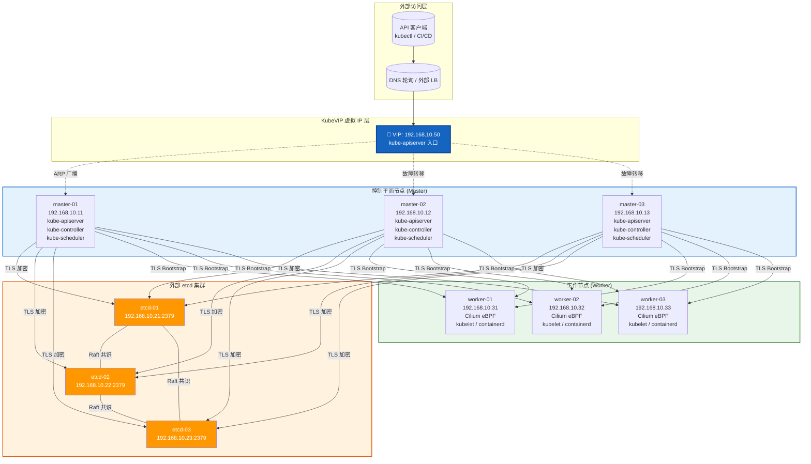
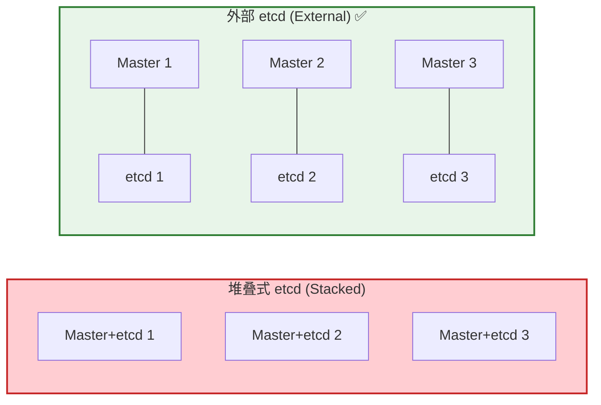
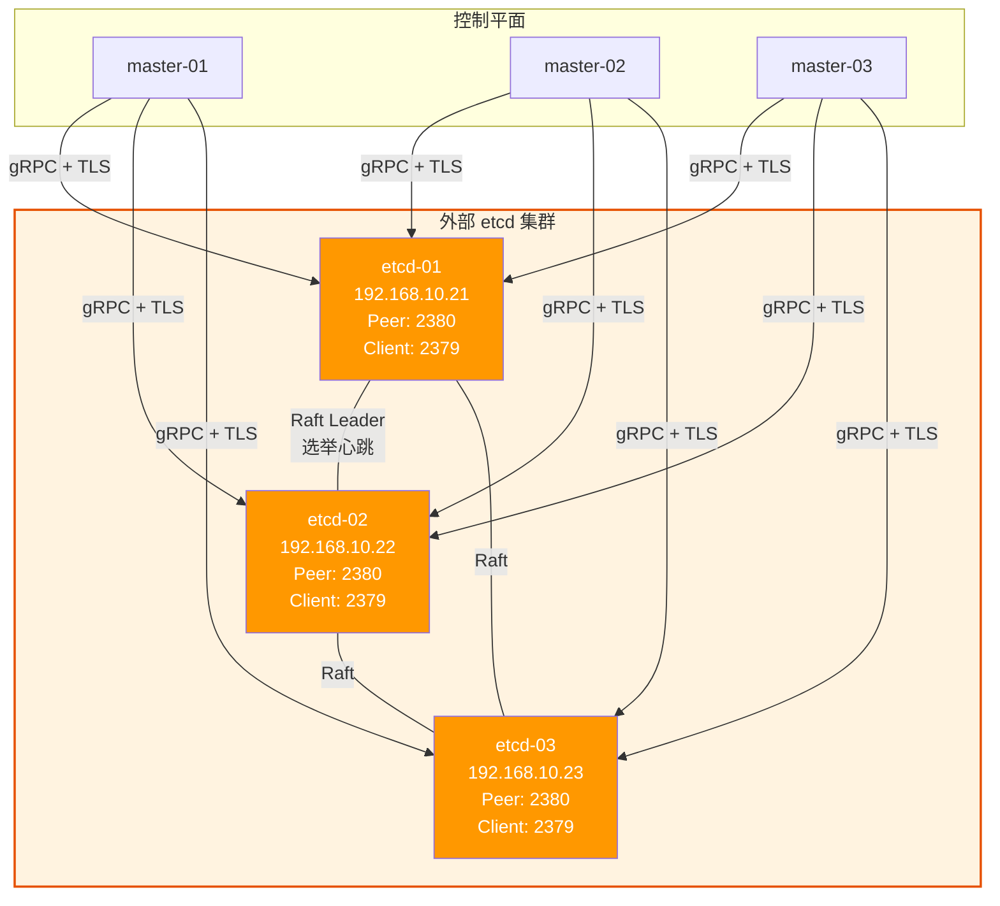
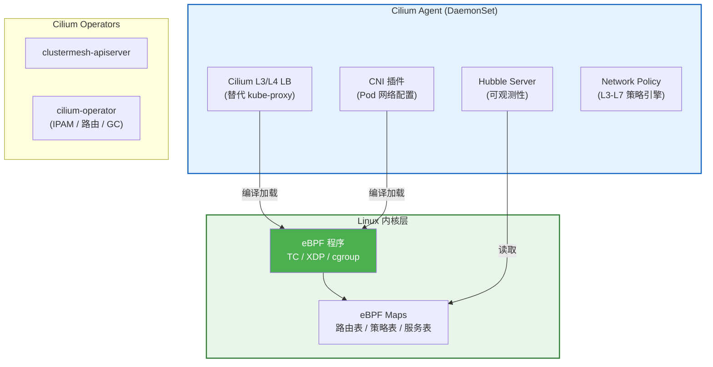
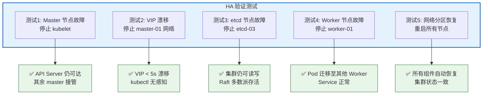
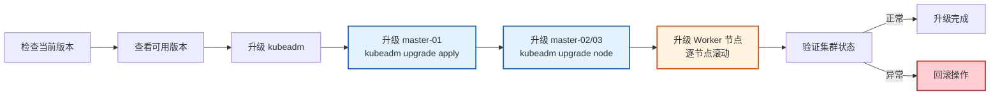

# K8s 1.35 + Cilium + KubeVIP + Containerd 高可用集群实现

> **技术栈**：Kubernetes 1.35 | Cilium (eBPF, kube-proxy replacement) | KubeVIP | Containerd | 外部 etcd
> **操作系统**：Rocky Linux 9.x / AlmaLinux 9.x / RHEL 9.x
> **高可用拓扑**：外部 etcd + 独立控制平面（最高可用性架构）

---

# 一、架构拓扑与规划

## 1.1 集群架构总览



## 1.2 外部 etcd 拓扑优势



| 对比维度 | 堆叠式 (Stacked) | 外部 etcd (External) ✅ |
|:---|:---|:---|
| 故障域 | Master 和 etcd 共享节点，一损俱损 | Master 与 etcd 故障域隔离 |
| 最少节点 | 3 节点（最低要求） | 6 节点（3 Master + 3 etcd） |
| etcd 独立扩缩容 | 不可独立扩缩 | 可独立扩缩 etcd 集群 |
| 数据安全 | Master 重装 = etcd 数据丢失 | etcd 独立存储，Master 可安全重装 |
| 运维复杂度 | 较低 | 较高（需独立管理 etcd 证书和运维） |
| 推荐场景 | 测试 / 小型集群 | **生产环境 / 高可用要求** |

## 1.3 节点规划

| 角色 | 主机名 | IP 地址 | OS | 配置 | 磁盘 |
|:---|:---|:---|:---|:---|:---|
| etcd 节点 | etcd-01 | 192.168.10.21 | Rocky 9.x | 4C/8G | 100G SSD |
| etcd 节点 | etcd-02 | 192.168.10.22 | Rocky 9.x | 4C/8G | 100G SSD |
| etcd 节点 | etcd-03 | 192.168.10.23 | Rocky 9.x | 4C/8G | 100G SSD |
| 控制平面 | master-01 | 192.168.10.11 | Rocky 9.x | 4C/16G | 100G SSD |
| 控制平面 | master-02 | 192.168.10.12 | Rocky 9.x | 4C/16G | 100G SSD |
| 控制平面 | master-03 | 192.168.10.13 | Rocky 9.x | 4C/16G | 100G SSD |
| 工作节点 | worker-01 | 192.168.10.31 | Rocky 9.x | 8C/32G | 200G SSD |
| 工作节点 | worker-02 | 192.168.10.32 | Rocky 9.x | 8C/32G | 200G SSD |
| 工作节点 | worker-03 | 192.168.10.33 | Rocky 9.x | 8C/32G | 200G SSD |

## 1.4 网络规划

| 网络段 | 用途 | CIDR |
|:---|:---|:---|
| 节点网络 | 物理节点通信 | 192.168.10.0/24 |
| KubeVIP | API Server 虚拟 IP | 192.168.10.50 |
| Pod 网络 (Cilium) | Pod 间通信 | 10.244.0.0/16 |
| Service 网络 | ClusterIP 通信 | 10.96.0.0/16 |
| etcd 通信 | etcd 集群内部 + 客户端 | 192.168.10.21-23:2379/2380 |

---

# 二、前置准备（所有节点执行）

> ⚠️ 以下操作在**所有节点**（etcd + master + worker）上执行，除非特别说明。

## 2.1 主机名与解析

```bash
hostnamectl set-hostname etcd-01
hostnamectl set-hostname etcd-02
hostnamectl set-hostname etcd-03
hostnamectl set-hostname master-01
hostnamectl set-hostname master-02
hostnamectl set-hostname master-03
hostnamectl set-hostname worker-01
hostnamectl set-hostname worker-02
hostnamectl set-hostname worker-03
```

```bash
cat >> /etc/hosts << 'EOF'
192.168.10.21  etcd-01
192.168.10.22  etcd-02
192.168.10.23  etcd-03
192.168.10.11  master-01
192.168.10.12  master-02
192.168.10.13  master-03
192.168.10.31  worker-01
192.168.10.32  worker-02
192.168.10.33  worker-03
192.168.10.50  k8s-api.k8s.local
EOF
```

## 2.2 系统初始化

```bash
setenforce 0
sed -i 's/^SELINUX=enforcing$/SELINUX=permissive/' /etc/selinux/config

systemctl disable --now firewalld

dnf -y install epel-release
dnf -y install wget curl vim bash-completion conntrack socat git jq tar ipvsadm \
    nfs-utils nc tcpdump strace lsof net-tools sysstat htop tmux tree

timedatectl set-timezone Asia/Shanghai
dnf -y install chrony
systemctl enable --now chronyd
chronyc wait_sync
timedatectl status
```

## 2.3 内核参数与模块

```bash
cat > /etc/modules-load.d/k8s.conf << 'EOF'
overlay
br_netfilter
nf_conntrack
ip_tables
EOF

modprobe overlay
modprobe br_netfilter
modprobe nf_conntrack

cat > /etc/sysctl.d/k8s.conf << 'EOF'
net.bridge.bridge-nf-call-iptables  = 1
net.bridge.bridge-nf-call-ip6tables = 1
net.ipv4.ip_forward                 = 1
net.ipv4.ip_nonlocal_bind           = 1
net.ipv4.tcp_tw_reuse               = 1
net.ipv4.tcp_fin_timeout            = 30
net.ipv4.tcp_keepalive_time         = 600
net.ipv4.tcp_keepalive_intvl        = 30
net.ipv4.tcp_keepalive_probes       = 10
net.core.somaxconn                  = 32768
net.core.netdev_max_backlog         = 16384
net.ipv4.tcp_max_syn_backlog        = 16384
net.ipv4.tcp_max_tw_buckets         = 32768
net.ipv4.neigh.default.gc_thresh1   = 1024
net.ipv4.neigh.default.gc_thresh2   = 4096
net.ipv4.neigh.default.gc_thresh3   = 8192
fs.inotify.max_user_watches         = 1048576
fs.inotify.max_user_instances       = 8192
fs.file-max                         = 2097152
vm.overcommit_memory                = 1
vm.swappiness                       = 0
EOF

sysctl --system
```

> 💡 `net.ipv4.ip_nonlocal_bind = 1` 是 KubeVIP 绑定非本地 IP 所必需的参数。

## 2.4 关闭 Swap

```bash
swapoff -a
sed -i '/swap/d' /etc/fstab
```

## 2.5 Containerd 安装与配置

```bash
dnf config-manager --add-repo https://download.docker.com/linux/centos/docker-ce.repo
dnf -y install containerd.io

mkdir -p /etc/containerd
containerd config default > /etc/containerd/config.toml

sed -i 's/SystemdCgroup = false/SystemdCgroup = true/' /etc/containerd/config.toml

sed -i '/sandbox_image/s|registry.k8s.io/pause:.*|registry.k8s.io/pause:3.10|' \
    /etc/containerd/config.toml

mkdir -p /etc/containerd/certs.d/registry.k8s.io
cat > /etc/containerd/certs.d/registry.k8s.io/hosts.toml << 'EOF'
server = "https://registry.k8s.io"

[host."https://your-mirror.example.com/v2/kubernetes"]
  capabilities = ["pull", "resolve"]
  skip_verify = false
EOF

systemctl enable --now containerd
systemctl status containerd

ctr version
```

### Containerd 配置验证

```bash
grep -A2 SystemdCgroup /etc/containerd/config.toml
grep sandbox_image /etc/containerd/config.toml
```

### 配置 crictl

```bash
cat > /etc/crictl.yaml << 'EOF'
runtime-endpoint: unix:///run/containerd/containerd.sock
image-endpoint: unix:///run/containerd/containerd.sock
timeout: 10
debug: false
pull-image-on-create: false
EOF

crictl info | grep -i "cgroup"
```

## 2.6 安装 kubeadm、kubelet、kubectl

```bash
cat > /etc/yum.repos.d/kubernetes.repo << 'EOF'
[kubernetes]
name=Kubernetes
baseurl=https://pkgs.k8s.io/core:/stable:/v1.35/rpm/
enabled=1
gpgcheck=1
gpgkey=https://pkgs.k8s.io/core:/stable:/v1.35/rpm/repodata/repomd.xml.key
EOF

dnf -y install kubelet-1.35.* kubeadm-1.35.* kubectl-1.35.*
systemctl enable kubelet
```

### 版本确认

```bash
kubeadm version -o short
kubelet --version
kubectl version --client -o yaml
```

## 2.7 时间同步验证（关键）

```bash
chronyc tracking | grep "Last offset"
chronyc sources -v
```

> ⚠️ etcd 对时间敏感，节点间时钟偏差超过 **50ms** 将导致 Leader 选举异常。务必确认所有节点 `Last offset` < 1ms。

---

# 三、外部 etcd 集群部署

> 以下操作仅在 **etcd-01/02/03** 上执行。

## 3.1 etcd 架构拓扑



## 3.2 etcd 证书生成（在 etcd-01 上执行）

```bash
mkdir -p /opt/etcd-cert && cd /opt/etcd-cert

cat > ca-config.json << 'EOF'
{
  "signing": {
    "default": {
      "expiry": "87600h"
    },
    "profiles": {
      "server": {
        "usages": ["signing", "key encipherment", "server auth"],
        "expiry": "87600h"
      },
      "client": {
        "usages": ["signing", "key encipherment", "client auth"],
        "expiry": "87600h"
      },
      "peer": {
        "usages": ["signing", "key encipherment", "server auth", "client auth"],
        "expiry": "87600h"
      }
    }
  }
}
EOF

cat > etcd-ca-csr.json << 'EOF'
{
  "CN": "etcd-ca",
  "key": {
    "algo": "ecdsa",
    "size": 256
  },
  "names": [
    {
      "C": "CN",
      "ST": "Beijing",
      "L": "Beijing",
      "O": "etcd",
      "OU": "CA"
    }
  ],
  "ca": {
    "expiry": "876000h"
  }
}
EOF
```

### 生成 CA 证书

```bash
cfssl gencert -initca etcd-ca-csr.json | cfssljson -bare etcd-ca
```

### 生成 Server 证书

```bash
cat > etcd-server-csr.json << 'EOF'
{
  "CN": "etcd",
  "hosts": [
    "127.0.0.1",
    "localhost",
    "192.168.10.21",
    "192.168.10.22",
    "192.168.10.23",
    "etcd-01",
    "etcd-02",
    "etcd-03"
  ],
  "key": {
    "algo": "ecdsa",
    "size": 256
  },
  "names": [
    {
      "C": "CN",
      "ST": "Beijing",
      "L": "Beijing",
      "O": "etcd",
      "OU": "cluster"
    }
  ]
}
EOF

cfssl gencert \
  -ca=etcd-ca.pem \
  -ca-key=etcd-ca-key.pem \
  -config=ca-config.json \
  -profile=server \
  etcd-server-csr.json | cfssljson -bare etcd-server
```

### 生成 Peer 证书

```bash
cat > etcd-peer-csr.json << 'EOF'
{
  "CN": "etcd-peer",
  "hosts": [
    "127.0.0.1",
    "localhost",
    "192.168.10.21",
    "192.168.10.22",
    "192.168.10.23",
    "etcd-01",
    "etcd-02",
    "etcd-03"
  ],
  "key": {
    "algo": "ecdsa",
    "size": 256
  },
  "names": [
    {
      "C": "CN",
      "ST": "Beijing",
      "L": "Beijing",
      "O": "etcd",
      "OU": "peer"
    }
  ]
}
EOF

cfssl gencert \
  -ca=etcd-ca.pem \
  -ca-key=etcd-ca-key.pem \
  -config=ca-config.json \
  -profile=peer \
  etcd-peer-csr.json | cfssljson -bare etcd-peer
```

### 生成 Client 证书（供 apiserver 使用）

```bash
cat > etcd-client-csr.json << 'EOF'
{
  "CN": "kube-apiserver-etcd-client",
  "hosts": [""],
  "key": {
    "algo": "ecdsa",
    "size": 256
  },
  "names": [
    {
      "C": "CN",
      "ST": "Beijing",
      "L": "Beijing",
      "O": "system:masters",
      "OU": "etcd-client"
    }
  ]
}
EOF

cfssl gencert \
  -ca=etcd-ca.pem \
  -ca-key=etcd-ca-key.pem \
  -config=ca-config.json \
  -profile=client \
  etcd-client-csr.json | cfssljson -bare etcd-client
```

### 分发证书到所有 etcd 和 master 节点

```bash
ETCD_NODES="etcd-01 etcd-02 etcd-03"
MASTER_NODES="master-01 master-02 master-03"

for node in $ETCD_NODES; do
  ssh $node "mkdir -p /etc/etcd/ssl"
  scp /opt/etcd-cert/etcd-ca.pem $node:/etc/etcd/ssl/
  scp /opt/etcd-cert/etcd-server.pem $node:/etc/etcd/ssl/
  scp /opt/etcd-cert/etcd-server-key.pem $node:/etc/etcd/ssl/
  scp /opt/etcd-cert/etcd-peer.pem $node:/etc/etcd/ssl/
  scp /opt/etcd-cert/etcd-peer-key.pem $node:/etc/etcd/ssl/
done

for node in $MASTER_NODES; do
  ssh $node "mkdir -p /etc/kubernetes/pki/etcd"
  scp /opt/etcd-cert/etcd-ca.pem $node:/etc/kubernetes/pki/etcd/ca.pem
  scp /opt/etcd-cert/etcd-client.pem $node:/etc/kubernetes/pki/etcd/healthcheck-client.pem
  scp /opt/etcd-cert/etcd-client-key.pem $node:/etc/kubernetes/pki/etcd/healthcheck-client-key.pem
  scp /opt/etcd-cert/etcd-server.pem $node:/etc/kubernetes/pki/etcd/server.pem
  scp /opt/etcd-cert/etcd-server-key.pem $node:/etc/kubernetes/pki/etcd/server.key
done
```

## 3.3 安装与配置 etcd

```bash
ETCD_VER="v3.5.21"
curl -sL https://github.com/etcd-io/etcd/releases/download/${ETCD_VER}/etcd-${ETCD_VER}-linux-amd64.tar.gz \
  -o /tmp/etcd.tar.gz
tar xzf /tmp/etcd.tar.gz -C /tmp/
cp /tmp/etcd-${ETCD_VER}-linux-amd64/etcd* /usr/local/bin/
etcd --version
```

### etcd 数据目录

```bash
mkdir -p /var/lib/etcd
```

### etcd systemd 服务（每节点各自配置）

**etcd-01:**

```bash
cat > /etc/systemd/system/etcd.service << 'EOF'
[Unit]
Description=etcd distributed key-value store
Documentation=https://github.com/etcd-io/etcd
After=network-online.target
Wants=network-online.target

[Service]
Type=notify
EnvironmentFile=/etc/etcd/etcd.conf
ExecStart=/usr/local/bin/etcd
Restart=always
RestartSec=10s
LimitNOFILE=65536
OOMScoreAdjust=-1000

[Install]
WantedBy=multi-user.target
EOF

cat > /etc/etcd/etcd.conf << 'EOF'
ETCD_NAME=etcd-01
ETCD_DATA_DIR=/var/lib/etcd
ETCD_LISTEN_CLIENT_URLS=https://192.168.10.21:2379,https://127.0.0.1:2379
ETCD_ADVERTISE_CLIENT_URLS=https://192.168.10.21:2379
ETCD_LISTEN_PEER_URLS=https://192.168.10.21:2380
ETCD_INITIAL_ADVERTISE_PEER_URLS=https://192.168.10.21:2380
ETCD_INITIAL_CLUSTER=etcd-01=https://192.168.10.21:2380,etcd-02=https://192.168.10.22:2380,etcd-03=https://192.168.10.23:2380
ETCD_INITIAL_CLUSTER_STATE=new
ETCD_INITIAL_CLUSTER_TOKEN=etcd-cluster-k8s
ETCD_CLIENT_CERT_AUTH=true
ETCD_TRUSTED_CA_FILE=/etc/etcd/ssl/etcd-ca.pem
ETCD_CERT_FILE=/etc/etcd/ssl/etcd-server.pem
ETCD_KEY_FILE=/etc/etcd/ssl/etcd-server-key.pem
ETCD_PEER_CLIENT_CERT_AUTH=true
ETCD_PEER_TRUSTED_CA_FILE=/etc/etcd/ssl/etcd-ca.pem
ETCD_PEER_CERT_FILE=/etc/etcd/ssl/etcd-peer.pem
ETCD_PEER_KEY_FILE=/etc/etcd/ssl/etcd-peer-key.pem
ETCD_AUTO_TLS=false
ETCD_PEER_AUTO_TLS=false
ETCD_HEARTBEAT_INTERVAL=500
ETCD_ELECTION_TIMEOUT=5000
ETCD_SNAPSHOT_COUNT=10000
ETCD_QUOTA_BACKEND_BYTES=8589934592
ETCD_MAX_REQUEST_BYTES=10485760
EOF
```

**etcd-02** 和 **etcd-03** 将对应变量替换为：
- `ETCD_NAME=etcd-02` / `etcd-03`
- IP 地址替换为 `192.168.10.22` / `192.168.10.23`

### 启动 etcd 集群

```bash
systemctl daemon-reload
systemctl enable --now etcd
systemctl status etcd
```

## 3.4 验证 etcd 集群

```bash
ETCDCTL_API=3 etcdctl \
  --cacert=/etc/etcd/ssl/etcd-ca.pem \
  --cert=/etc/etcd/ssl/etcd-server.pem \
  --key=/etc/etcd/ssl/etcd-server-key.pem \
  --endpoints=https://192.168.10.21:2379,https://192.168.10.22:2379,https://192.168.10.23:2379 \
  endpoint health --write-out=table

ETCDCTL_API=3 etcdctl \
  --cacert=/etc/etcd/ssl/etcd-ca.pem \
  --cert=/etc/etcd/ssl/etcd-server.pem \
  --key=/etc/etcd/ssl/etcd-server-key.pem \
  --endpoints=https://192.168.10.21:2379,https://192.168.10.22:2379,https://192.168.10.23:2379 \
  endpoint status --write-out=table
```

预期输出：
```
+---------------------------+------------------+---------+---------+-----------+------------+-----------+
|         ENDPOINT          |        ID        | VERSION | DB SIZE | IS LEADER | IS LEARNER | RAFT TERM |
+---------------------------+------------------+---------+---------+-----------+------------+-----------+
| https://192.168.10.21:2379 | 3e5e8...  | 3.5.21  |  20 kB  |     true  |      false |         2 |
| https://192.168.10.22:2379 | 7a1b2...  | 3.5.21  |  20 kB  |    false  |      false |         2 |
| https://192.168.10.23:2379 | c9d4f...  | 3.5.21  |  20 kB  |    false  |      false |         2 |
+---------------------------+------------------+---------+---------+-----------+------------+-----------+
```

> ⚠️ 确认一个 `IS LEADER = true`，另外两个为 `false`，且 `RAFT TERM` 一致。

---

# 四、控制平面部署（KubeVIP + kubeadm）

> 以下操作在 **master-01/02/03** 上执行。

## 4.1 KubeVIP 部署

### 方式一：Static Pod（推荐）

在 **master-01** 上执行：

```bash
mkdir -p /etc/kubernetes/manifests

export VIP=192.168.10.50
export INTERFACE=eth0
export KVVERSION=v0.8.9

ctr -n k8s.io image pull ghcr.io/kube-vip/kube-vip:${KVVERSION}

cat > /etc/kubernetes/manifests/kube-vip.yaml << 'EOF'
apiVersion: v1
kind: Pod
metadata:
  name: kube-vip
  namespace: kube-system
spec:
  containers:
    - name: kube-vip
      image: ghcr.io/kube-vip/kube-vip:v0.8.9
      imagePullPolicy: IfNotPresent
      args:
        - manager
      env:
        - name: vip_arp
          value: "true"
        - name: port
          value: "6443"
        - name: vip_cidr
          value: "32"
        - name: cp_enable
          value: "true"
        - name: cp_namespace
          value: "kube-system"
        - name: vip_interface
          value: "eth0"
        - name: vip_address
          value: "192.168.10.50"
        - name: lb_enable
          value: "true"
        - name: lb_port
          value: "6443"
        - name: enable_service_security
          value: "true"
        - name: prometheus_server
          value: ":2112"
      securityContext:
        capabilities:
          add:
            - NET_ADMIN
            - NET_RAW
            - SYS_TIME
      volumeMounts:
        - name: kubeconfig
          mountPath: /etc/kubernetes/admin.conf
          readOnly: true
  volumes:
    - name: kubeconfig
      hostPath:
        path: /etc/kubernetes/admin.conf
        type: FileOrCreate
  hostNetwork: true
  hostAliases:
    - hostnames:
        - kubernetes
      ip: 127.0.0.1
EOF
```

> 💡 KubeVIP Static Pod 在 kubeadm init 之前即可预置，此时 `admin.conf` 尚不存在，KubeVIP 会等待其生成后自动生效。

### 将 kube-vip.yaml 同步到其他 master 节点

```bash
for node in master-02 master-03; do
  ssh $node "mkdir -p /etc/kubernetes/manifests"
  scp /etc/kubernetes/manifests/kube-vip.yaml $node:/etc/kubernetes/manifests/
done
```

## 4.2 kubeadm 配置文件

在 **master-01** 上创建：

```bash
cat > /opt/kubeadm-config.yaml << 'EOF'
apiVersion: kubeadm.k8s.io/v1beta4
kind: InitConfiguration
nodeRegistration:
  criSocket: unix:///run/containerd/containerd.sock
  kubeletExtraArgs:
    rotate-server-certificates: "true"
  taints:
    - key: node-role.kubernetes.io/control-plane
      effect: NoSchedule
---
apiVersion: kubeadm.k8s.io/v1beta4
kind: ClusterConfiguration
kubernetesVersion: "v1.35.0"
controlPlaneEndpoint: "192.168.10.50:6443"
networking:
  podSubnet: "10.244.0.0/16"
  serviceSubnet: "10.96.0.0/16"
  serviceDomain: "cluster.local"
apiServer:
  extraArgs:
    authorization-mode: "Node,RBAC"
    enable-admission-plugins: "NodeRestriction,PodSecurity,PodTolerationRestriction"
    audit-log-maxage: "30"
    audit-log-maxbackup: "10"
    audit-log-maxsize: "200"
    audit-log-path: "/var/log/kubernetes/audit.log"
    audit-policy-file: "/etc/kubernetes/audit-policy.yaml"
    default-not-ready-toleration-seconds: "300"
    default-unreachable-toleration-seconds: "300"
  extraVolumes:
    - name: audit
      hostPath: /var/log/kubernetes
      mountPath: /var/log/kubernetes
      pathType: DirectoryOrCreate
    - name: audit-policy
      hostPath: /etc/kubernetes/audit-policy.yaml
      mountPath: /etc/kubernetes/audit-policy.yaml
      readOnly: true
      pathType: File
  certSANs:
    - "192.168.10.50"
    - "192.168.10.11"
    - "192.168.10.12"
    - "192.168.10.13"
    - "k8s-api.k8s.local"
    - "127.0.0.1"
etcd:
  external:
    endpoints:
      - "https://192.168.10.21:2379"
      - "https://192.168.10.22:2379"
      - "https://192.168.10.23:2379"
    caFile: "/etc/kubernetes/pki/etcd/ca.pem"
    certFile: "/etc/kubernetes/pki/etcd/healthcheck-client.pem"
    keyFile: "/etc/kubernetes/pki/etcd/healthcheck-client-key.pem"
controllerManager:
  extraArgs:
    bind-address: "0.0.0.0"
    cluster-signing-duration: "87600h"
    node-cidr-mask-size: "24"
    pod-eviction-timeout: "300s"
scheduler:
  extraArgs:
    bind-address: "0.0.0.0"
---
apiVersion: kubeadm.k8s.io/v1beta4
kind: KubeletConfiguration
cgroupDriver: "systemd"
rotateCertificates: true
serverTLSBootstrap: true
featureGates:
  KubeletInUserNamespace: false
maxPods: 220
podPidsLimit: -1
evictionHard:
  memory.available: "100Mi"
  nodefs.available: "10%"
  nodefs.inodesFree: "5%"
  imagefs.available: "15%"
systemReserved:
  cpu: "500m"
  memory: "512Mi"
kubeReserved:
  cpu: "500m"
  memory: "512Mi"
EOF
```

### 创建审计策略文件

```bash
mkdir -p /var/log/kubernetes

cat > /etc/kubernetes/audit-policy.yaml << 'EOF'
apiVersion: audit.k8s.io/v1
kind: Policy
rules:
  - level: None
    users: ["system:kube-proxy"]
    verbs: ["watch"]
    resources:
      - group: ""
        resources: ["endpoints", "services"]
  - level: None
    userGroups: ["system:authenticated"]
    nonResourceURLs: ["/api*", "/healthz*", "/livez*", "/readyz*", "/version*"]
  - level: RequestResponse
    users: ["system:unsecured"]
  - level: Metadata
    omitStages: ["RequestReceived"]
  - level: RequestResponse
    verbs: ["create", "update", "patch", "delete"]
    resources:
      - group: ""
        resources: ["secrets", "configmaps"]
  - level: Request
    verbs: ["create", "update", "patch", "delete"]
  - level: Metadata
    omitStages: ["RequestReceived"]
EOF
```

## 4.3 初始化第一个控制平面节点

在 **master-01** 上执行：

```bash
kubeadm init \
  --config /opt/kubeadm-config.yaml \
  --upload-certs \
  --v=6 2>&1 | tee /opt/kubeadm-init.log
```

初始化成功后记录以下关键信息：

```
Your Kubernetes control-plane has initialized successfully!

You can now join any number of control-plane nodes by running:
kubeadm join 192.168.10.50:6443 --token <token> \
  --discovery-token-ca-cert-hash sha256:<hash> \
  --control-plane --certificate-key <cert-key>

You can join worker nodes by running:
kubeadm join 192.168.10.50:6443 --token <token> \
  --discovery-token-ca-cert-hash sha256:<hash>
```

### 配置 kubectl

```bash
mkdir -p $HOME/.kube
cp -i /etc/kubernetes/admin.conf $HOME/.kube/config
chown $(id -u):$(id -g) $HOME/.kube/config

kubectl get nodes
kubectl get cs
```

## 4.4 加入其他控制平面节点

在 **master-02** 和 **master-03** 上执行（使用上面输出的 join 命令）：

```bash
kubeadm join 192.168.10.50:6443 \
  --token <token> \
  --discovery-token-ca-cert-hash sha256:<hash> \
  --control-plane \
  --certificate-key <cert-key>
```

加入后在 master-02/03 上配置 kubectl：

```bash
mkdir -p $HOME/.kube
cp -i /etc/kubernetes/admin.conf $HOME/.kube/config
chown $(id -u):$(id -g) $HOME/.kube/config
```

### 验证控制平面

```bash
kubectl get nodes -o wide
kubectl get pods -n kube-system -o wide
kubectl get componentstatuses
```

## 4.5 KubeVIP 验证

```bash
kubectl get pods -n kube-system -l app=kube-vip -o wide
```

```bash
ip addr show eth0 | grep 192.168.10.50
```

> 💡 VIP 应当前在 master-01 上，当 master-01 故障时自动漂移到 master-02 或 master-03。

### VIP 故障转移测试

```bash
ssh master-01 "systemctl stop kubelet"
sleep 5
ip addr show eth0 | grep 192.168.10.50
kubectl get nodes
ssh master-01 "systemctl start kubelet"
```

---

# 五、Cilium 网络插件部署

> 以下操作在具有 kubectl 访问权限的节点上执行。

## 5.1 Cilium 架构拓扑



## 5.2 安装 Helm

```bash
dnf -y install helm
```

## 5.3 部署 Cilium（替代 kube-proxy）

```bash
helm repo add cilium https://helm.cilium.io/
helm repo update

helm install cilium cilium/cilium \
  --version 1.17.5 \
  --namespace kube-system \
  --set kubeProxyReplacement=true \
  --set hubble.relay.enabled=true \
  --set hubble.ui.enabled=true \
  --set operator.replicas=2 \
  --set ipam.mode=kubernetes \
  --set routingMode=tunnel \
  --set tunnelProtocol=vxlan \
  --set autoDirectNodeRoutes=false \
  --set bandwidthManager.enabled=true \
  --set bandwidthManager.egressRate=50M \
  --set bpf.masquerade=true \
  --set enableIPv4Masquerade=true \
  --set ingressController.enabled=true \
  --set gatewayAPI.enabled=true \
  --set gatewayAPI.enableAlpn=true \
  --set l2announcements.enabled=true \
  --set l7Proxy.enabled=true \
  --set encryption.enabled=false \
  --set prometheus.enabled=true \
  --set prometheus.serviceMonitor.enabled=true \
  --set operator.prometheus.enabled=true \
  --set hubble.metrics.enableOpenMetrics=true \
  --set hubble.metrics.enabled="{dns,drop,tcp,flow,port-distribution,icmp,httpV2:exemplars=true;labelsContext=source_ip\,source_namespace\,source_workload\,destination_ip\,destination_namespace\,destination_workload\,traffic_direction}" \
  --wait
```

### 关键参数说明

| 参数 | 值 | 说明 |
|:---|:---|:---|
| `kubeProxyReplacement` | `true` | 完全替代 kube-proxy，eBPF 实现 Service LB |
| `routingMode` | `tunnel` | VXLAN 隧道模式，无需 BGP 支持 |
| `bpf.masquerade` | `true` | eBPF 实现 SNAT，性能优于 iptables |
| `bandwidthManager` | `true` | EDT 限速，精确控制 Pod 带宽 |
| `hubble.relay.enabled` | `true` | 启用 Hubble Relay，支持全局流量可观测 |
| `ingressController.enabled` | `true` | 启用 Cilium Ingress Controller |
| `gatewayAPI.enabled` | `true` | 启用 Gateway API 支持 |
| `l2announcements.enabled` | `true` | L2 广播，支持 LoadBalancer Service |

## 5.4 删除 kube-proxy DaemonSet

> Cilium 完全接管 Service LB 后，必须移除 kube-proxy 以避免冲突。

```bash
kubectl delete ds kube-proxy -n kube-system
kubectl delete cm kube-proxy -n kube-system
```

> ⚠️ 如果 kubeadm 配置中未设置 `kubeProxyReplacement=true`，需要手动清理 iptables 规则：
> ```bash
> iptables-restore < /dev/null
> ip6tables-restore < /dev/null
> ```

## 5.5 验证 Cilium 状态

```bash
kubectl -n kube-system get pods -l k8s-app=cilium -o wide
kubectl -n kube-system get pods -l k8s-app=cilium-operator -o wide

cilium status --wait
cilium connectivity test --wait --all-flows-valid
```

### 验证 kube-proxy 替换

```bash
cilium status | grep "KubeProxyReplacement"
```

预期输出：
```
KubeProxyReplacement:   Strict   [eth0 (Direct Routing), ...]
```

## 5.6 Hubble 可观测性

```bash
helm install hubble-ui cilium/hubble-ui \
  --namespace kube-system \
  --set frontend.replicas=1 \
  --set backend.replicas=1 \
  --wait

kubectl port-forward -n kube-system svc/hubble-ui 8080:80
```

访问 `http://localhost:8080` 即可查看 Hubble UI 流量拓扑。

### 安装 Hubble CLI

```bash
HUBBLE_VERSION=v0.16.5
curl -sL https://github.com/cilium/hubble/releases/download/${HUBBLE_VERSION}/hubble-linux-amd64.tar.gz \
  | tar xz -C /usr/local/bin

kubectl port-forward -n kube-system svc/hubble-relay 4245:80 &
hubble observe --since 1m
```

---

# 六、Worker 节点加入与 HA 验证

## 6.1 Worker 节点加入

在所有 **worker** 节点上执行：

```bash
kubeadm join 192.168.10.50:6443 \
  --token <token> \
  --discovery-token-ca-cert-hash sha256:<hash>
```

> 💡 如果 token 过期，在 master 上重新生成：
> ```bash
> kubeadm token create --print-join-command
> ```

### 验证节点状态

```bash
kubectl get nodes -o wide
kubectl get pods -A -o wide | grep -v Running
```

所有节点应为 `Ready`，所有 Pod 应为 `Running`。

## 6.2 部署验证应用

```bash
cat << 'EOF' | kubectl apply -f -
apiVersion: apps/v1
kind: Deployment
metadata:
  name: nginx-test
  namespace: default
spec:
  replicas: 6
  selector:
    matchLabels:
      app: nginx-test
  template:
    metadata:
      labels:
        app: nginx-test
    spec:
      topologySpreadConstraints:
        - maxSkew: 1
          topologyKey: kubernetes.io/hostname
          whenUnsatisfiable: DoNotSchedule
          labelSelector:
            matchLabels:
              app: nginx-test
      containers:
        - name: nginx
          image: nginx:1.27
          ports:
            - containerPort: 80
          resources:
            requests:
              cpu: 100m
              memory: 128Mi
            limits:
              cpu: 200m
              memory: 256Mi
---
apiVersion: v1
kind: Service
metadata:
  name: nginx-test
spec:
  type: LoadBalancer
  selector:
    app: nginx-test
  ports:
    - port: 80
      targetPort: 80
EOF
```

### 验证跨节点通信

```bash
POD1=$(kubectl get pods -l app=nginx-test -o jsonpath='{.items[0].metadata.name}')
POD2=$(kubectl get pods -l app=nginx-test -o jsonpath='{.items[3].metadata.name}')

kubectl exec $POD1 -- curl -sI http://nginx-test
```

## 6.3 高可用验证矩阵



### 测试1：Master 节点故障

```bash
ssh master-02 "systemctl stop kubelet"
sleep 10
kubectl get nodes
kubectl get pods -A --field-selector spec.nodeName=master-02
ssh master-02 "systemctl start kubelet"
```

### 测试2：VIP 漂移

```bash
CURRENT_VIP_NODE=$(ssh master-01 "ip addr show eth0" | grep -c "192.168.10.50" && echo "master-01" || \
                   ssh master-02 "ip addr show eth0" | grep -c "192.168.10.50" && echo "master-02" || \
                   echo "master-03")

echo "VIP 当前在: $CURRENT_VIP_NODE"

ssh $CURRENT_VIP_NODE "systemctl stop keepalived || true; systemctl stop kubelet"
sleep 10
kubectl get nodes
```

### 测试3：etcd 节点故障

```bash
ssh etcd-03 "systemctl stop etcd"
sleep 5
ETCDCTL_API=3 etcdctl \
  --cacert=/etc/etcd/ssl/etcd-ca.pem \
  --cert=/etc/etcd/ssl/etcd-server.pem \
  --key=/etc/etcd/ssl/etcd-server-key.pem \
  --endpoints=https://192.168.10.21:2379,https://192.168.10.22:2379 \
  endpoint health --write-out=table

kubectl get ns

ssh etcd-03 "systemctl start etcd"
```

### 测试4：Worker 节点故障

```bash
ssh worker-01 "systemctl stop kubelet containerd"
sleep 30
kubectl get nodes
kubectl get pods -A -o wide | grep -v Running
ssh worker-01 "systemctl start containerd kubelet"
```

---

# 七、运维加固

## 7.1 证书自动轮换

```bash
kubectl get csr
kubectl get certs -o wide
```

kubelet 证书轮换已通过 `rotateCertificates: true` 和 `rotate-server-certificates: true` 启用。

### 检查证书过期时间

```bash
kubeadm certs check-expiration
```

### 手动续期（证书即将过期时）

```bash
kubeadm certs renew all
systemctl restart kubelet
kubectl -n kube-system delete pod -l component=kube-apiserver
kubectl -n kube-system delete pod -l component=kube-controller-manager
kubectl -n kube-system delete pod -l component=kube-scheduler
```

## 7.2 etcd 备份与恢复

### 定时备份脚本

```bash
cat > /usr/local/bin/etcd-backup.sh << 'SCRIPT'
#!/bin/bash
set -euo pipefail

BACKUP_DIR="/data/etcd-backup"
DATE=$(date +%Y%m%d_%H%M%S)
RETAIN_DAYS=7

mkdir -p ${BACKUP_DIR}

ETCDCTL_API=3 etcdctl \
  --cacert=/etc/etcd/ssl/etcd-ca.pem \
  --cert=/etc/etcd/ssl/etcd-server.pem \
  --key=/etc/etcd/ssl/etcd-server-key.pem \
  --endpoints=https://192.168.10.21:2379 \
  snapshot save ${BACKUP_DIR}/etcd-snapshot-${DATE}.db

ETCDCTL_API=3 etcdctl \
  snapshot status ${BACKUP_DIR}/etcd-snapshot-${DATE}.db \
  --write-out=table

find ${BACKUP_DIR} -name "etcd-snapshot-*.db" -mtime +${RETAIN_DAYS} -delete

echo "[$(date)] Backup completed: etcd-snapshot-${DATE}.db"
SCRIPT

chmod +x /usr/local/bin/etcd-backup.sh
```

### Cron 定时任务

```bash
cat > /etc/cron.d/etcd-backup << 'EOF'
0 */6 * * * root /usr/local/bin/etcd-backup.sh >> /var/log/etcd-backup.log 2>&1
EOF
```

### etcd 恢复流程

```bash
systemctl stop etcd
rm -rf /var/lib/etcd/member

ETCDCTL_API=3 etcdctl snapshot restore /data/etcd-backup/etcd-snapshot-XXXXXXXXXX.db \
  --name etcd-01 \
  --initial-cluster etcd-01=https://192.168.10.21:2380,etcd-02=https://192.168.10.22:2380,etcd-03=https://192.168.10.23:2380 \
  --initial-advertise-peer-urls https://192.168.10.21:2380 \
  --data-dir /var/lib/etcd

systemctl start etcd
```

## 7.3 集群升级策略



### 升级前置检查

```bash
kubeadm upgrade plan
```

### 升级控制平面

```bash
dnf -y install kubelet-1.35.x-0 kubeadm-1.35.x-0 kubectl-1.35.x-0

kubeadm upgrade apply v1.35.x

systemctl restart kubelet
```

### 逐节点升级 Worker

```bash
kubectl drain worker-01 --ignore-daemonsets --delete-emptydir-data

ssh worker-01 "dnf -y install kubelet-1.35.x-0 kubeadm-1.35.x-0 kubectl-1.35.x-0"
ssh worker-01 "kubeadm upgrade node"
ssh worker-01 "systemctl restart kubelet"

kubectl uncordon worker-01
```

## 7.4 安全加固清单

| 项目 | 配置 | 状态 |
|:---|:---|:---|
| kubelet 匿名访问 | `--anonymous-auth=false` | ✅ kubeadm 默认关闭 |
| RBAC 授权 | `--authorization-mode=Node,RBAC` | ✅ 已配置 |
| Pod Security Admission | `PodSecurity` admission plugin | ✅ 已启用 |
| 审计日志 | audit-policy.yaml | ✅ 已配置 |
| etcd TLS | 双向 TLS 认证 | ✅ 已配置 |
| 证书轮换 | `rotateCertificates: true` | ✅ 已配置 |
| kube-proxy 移除 | Cilium 完全替代 | ✅ 已部署 |
| Cilium NetworkPolicy | L3/L4/L7 策略 | ✅ 已启用 |
| Secret 加密 | 静态加密 at-rest | ⬜ 需配置 |

### 配置 Secret 静态加密

```bash
cat > /etc/kubernetes/encryption-config.yaml << 'EOF'
apiVersion: apiserver.config.k8s.io/v1
kind: EncryptionConfiguration
resources:
  - resources:
      - secrets
    providers:
      - aescbc:
          keys:
            - name: key1
              secret: $(head -c 32 /dev/urandom | base64)
      - identity: {}
EOF
```

> ⚠️ 将 `EncryptionConfiguration` 挂载到 API Server 并添加 `--encryption-provider-config` 参数后重启 API Server。

---

# 八、附录

## 8.1 快速命令参考

```bash
kubectl get nodes -o wide
kubectl get pods -A -o wide
kubectl get cs
kubectl get events -A --sort-by='.lastTimestamp'
kubectl top nodes
kubectl top pods -A --sort-by=memory
cilium status
cilium connectivity test
hubble observe --since 5m --namespace default
etcdctl endpoint health --cluster --write-out=table
```

## 8.2 故障排查速查

| 现象 | 排查方向 | 关键命令 |
|:---|:---|:---|
| Node NotReady | kubelet 状态 / CNI | `systemctl status kubelet`, `journalctl -u kubelet` |
| Pod CrashLoopBackOff | 容器日志 | `kubectl logs <pod> --previous`, `kubectl describe pod <pod>` |
| Service 不可达 | Cilium eBPF / Endpoints | `cilium service list`, `kubectl get endpoints` |
| etcd Leader 丢失 | etcd 集群网络 / 磁盘 | `etcdctl endpoint status`, `etcdctl alarm list` |
| VIP 不可达 | KubeVIP 状态 | `kubectl logs -n kube-system kube-vip-xxx`, `ip addr show` |
| 证书过期 | 检查过期时间 | `kubeadm certs check-expiration` |
| Cilium Pod 异常 | 内核版本 / eBPF | `cilium status`, `dmesg | grep -i bpf` |

## 8.3 节点标签建议

```bash
kubectl label nodes worker-01 node.kubernetes.io/role=worker
kubectl label nodes worker-01 topology.kubernetes.io/zone=zone-a
kubectl label nodes worker-01 topology.kubernetes.io/region=region-1
kubectl label nodes worker-01 node.kubernetes.io/instance-type=standard-8c32g
```
