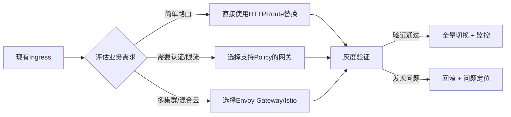
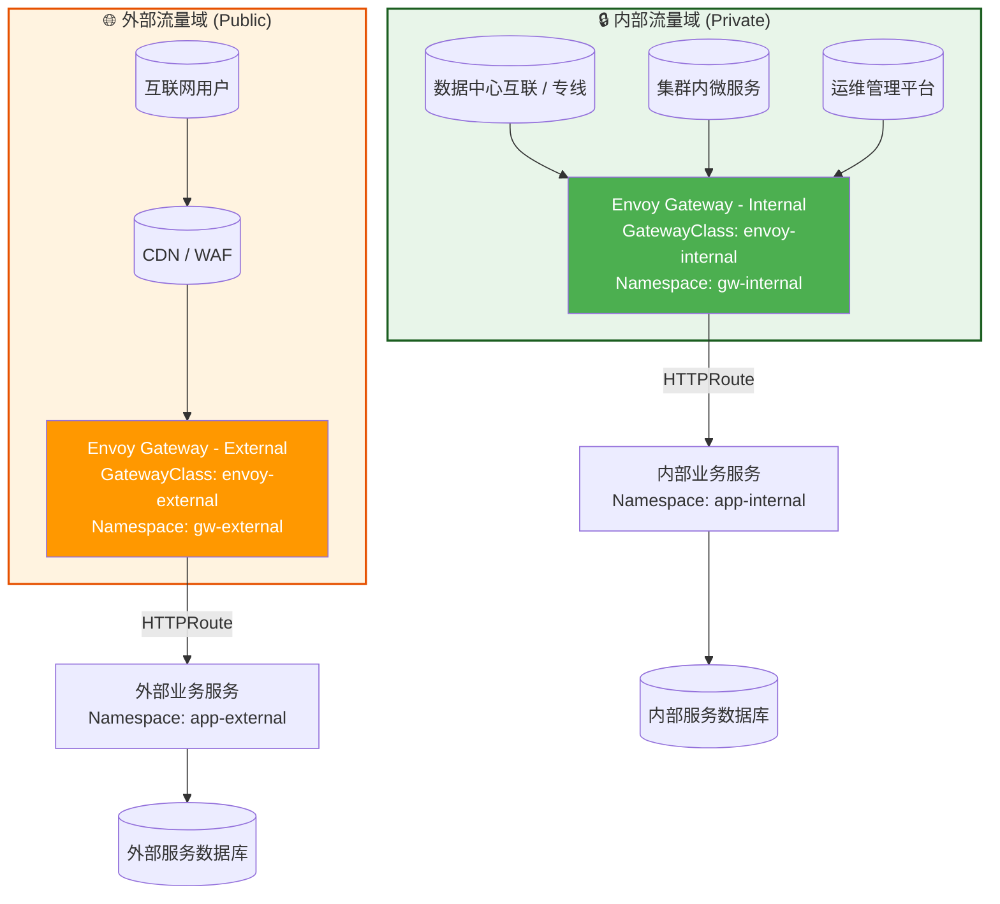
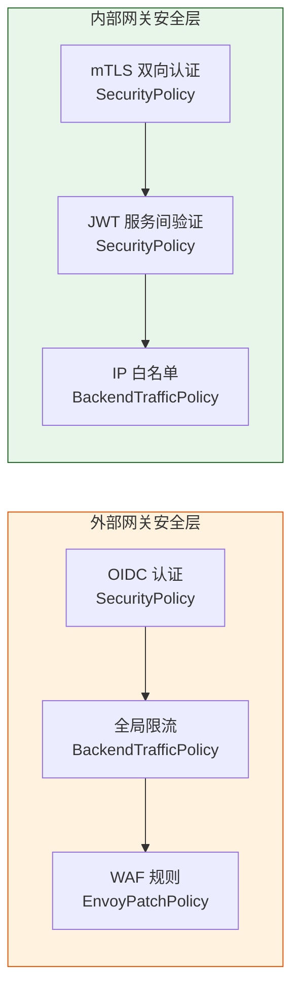
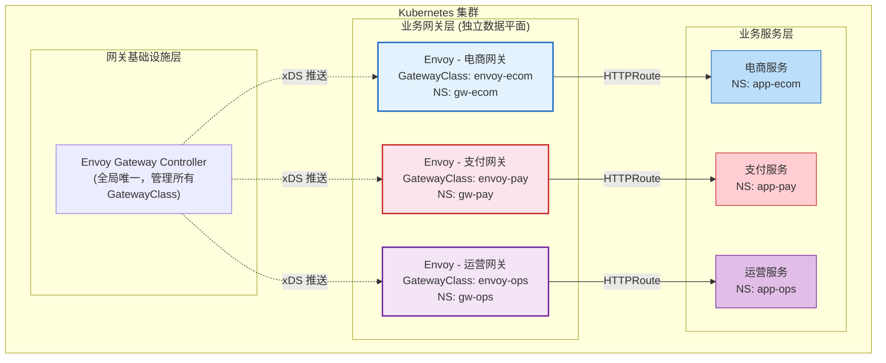
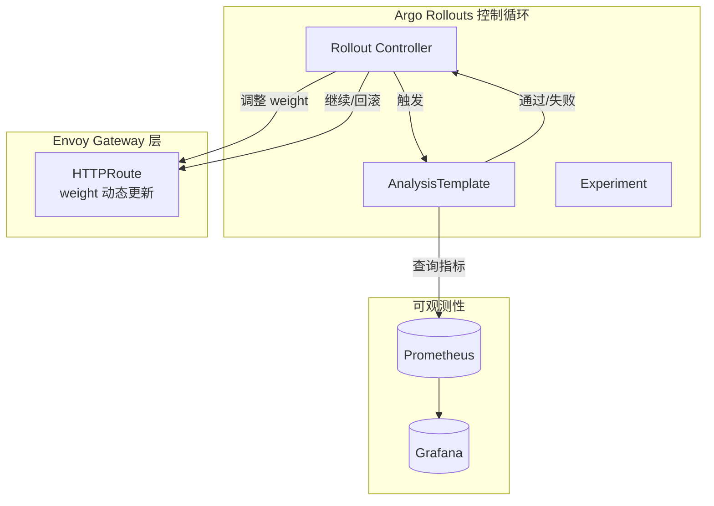
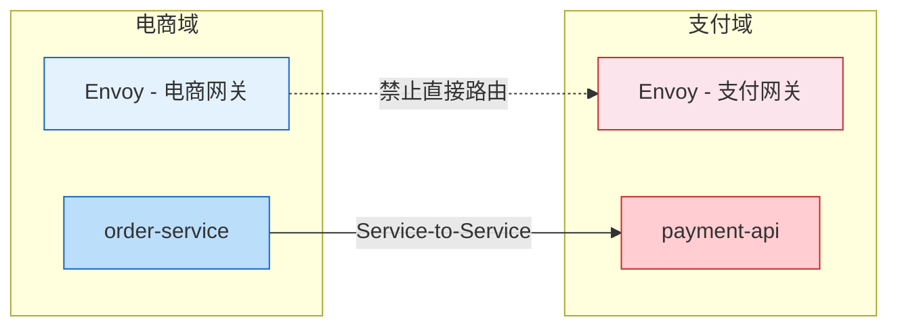
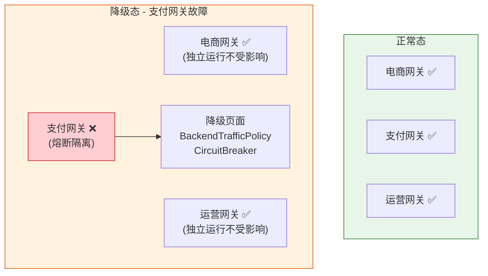

# 🚀 Kubernetes Gateway API 网关推荐指南（2026版）

> **核心结论**：选择网关的关键不是「功能最全」，而是「与你的架构最匹配」。以下推荐基于**生产就绪度**、**特性支持**、**运维复杂度**三维评估。

---

## 📊 一、主流网关实现对比总览

| 网关实现 | 架构模型 | 成熟度 | 核心优势 | 适用场景 | 开源协议 |
|:---|:---|:---|:---|:---|:---|
| **Envoy Gateway** | Envoy Native (xDS) | ✅ GA | 100%标准兼容、原生支持OIDC/限流、无厂商锁定 | 追求标准、多集群、云原生团队 | Apache 2.0 |
| **Istio (Ambient)** | Service Mesh + Envoy | ✅ GA | 南北+东西流量统一管理、零信任安全、性能最优 | 已用/计划用Service Mesh、高安全需求 | Apache 2.0 |
| **Cilium** | eBPF + Envoy Hybrid | ✅ GA | L4性能极致、内核级可观测、网络策略一体化 | 高性能网络、已用Cilium CNI、L4流量为主 | Apache 2.0 |
| **NGINX Gateway Fabric** | NGINX Data Plane | ✅ GA | 资源占用低、配置熟悉、静态内容高效 | 传统运维团队、高并发静态服务、混合云 | Apache 2.0 |
| **Kong Ingress Controller** | Kong + OpenResty | 🟡 Partial | 插件生态丰富、API管理能力强、企业支持完善 | API产品化、需要高级插件、商业支持需求 | Apache 2.0 + Enterprise |
| **GKE Gateway** | Cloud LB (Google) | ✅ GA | 与GCP深度集成、全球负载均衡、免运维 | 纯GKE环境、追求托管服务、多区域部署 | Proprietary (GCP) |
| **AWS Gateway API Controller** | ALB/NLB (AWS) | 🟡 Partial | 与AWS生态无缝、托管服务、安全集成 | 纯AWS环境、已有ALB投资、合规需求 | Apache 2.0 |

> 📌 **数据来源**：官方实现状态页 [[8]]、2026年社区对比报告 [[1]][[5]]

---

## 🎯 二、按场景精准推荐

### 🔹 场景1：追求标准 + 可移植性（推荐首选）
**✅ Envoy Gateway**
```yaml
推荐理由:
  - CNCF官方项目，无厂商绑定，配置可跨云迁移
  - 原生支持所有Standard通道资源（HTTPRoute/GRPCRoute/TLSRoute等）
  - SecurityPolicy内置OIDC认证，BackendTrafficPolicy支持限流/熔断
  - 支持EnvoyPatchPolicy扩展，保留底层能力逃逸通道

部署示例:
  helm install envoy-gateway oci://docker.io/envoyproxy/gateway-helm \
    --namespace envoy-gateway-system --create-namespace
```

### 🔹 场景2：已建设/规划服务网格
**✅ Istio (Ambient Mode)**
```yaml
推荐理由:
  - Gateway API + Service Mesh 统一控制面，避免两套配置
  - Ambient模式移除Sidecar，延迟降低40%，内存占用减少90%
  - 原生支持mTLS、JWT验证、细粒度授权策略
  - 控制平面更新延迟<100ms，适合高频变更场景

注意: 学习曲线较陡，建议从Gateway API ingress场景逐步切入
```

### 🔹 场景3：高性能网络 + 已用Cilium CNI
**✅ Cilium Gateway**
```yaml
推荐理由:
  - L4流量eBPF直通，吞吐量达硬件极限，延迟<50μs
  - 网络策略 + Gateway + Service Mesh 三合一，减少组件栈
  - 支持共享Agent模式，资源复用效率高

限制:
  - L7功能仍依赖Envoy代理，混合架构调试复杂度较高
  - 大规模路由变更时控制平面可能出现短暂CPU尖峰 [[5]]
```

### 🔹 场景4：传统运维团队 / 高并发静态服务
**✅ NGINX Gateway Fabric**
```yaml
推荐理由:
  - NGINX数据平面成熟稳定，内存占用低（~50MB/实例）
  - 配置语法与经典Ingress-NGINX相似，迁移成本低
  - 静态内容服务性能优异，适合内容分发场景

注意: 控制平面更新速度较慢（秒级），不适合高频路由变更
```

### 🔹 场景5：单云托管 + 免运维诉求
**✅ 云厂商原生控制器**
```yaml
GKE用户 → GKE Gateway
  - 自动集成Cloud CDN、Cloud Armor、Managed Certificates
  - 全球负载均衡开箱即用，多区域部署极简

AWS用户 → AWS Gateway API Controller
  - 直接映射ALB/NLB，享受AWS安全组、WAF、Shield集成
  - 注意：当前仅支持HTTPRoute/GRPCRoute，TCP/UDP需回退到Service

Azure用户 → Application Gateway for Containers
  - 与Azure AD、Key Vault深度集成，合规场景友好
```

---

## ⚠️ 三、选型避坑清单

### ❌ 避免以下组合
| 错误选择 | 风险 | 正确做法 |
|:---|:---|:---|
| 用`Ingress`注解迁移到`Gateway API` | 配置漂移，失去可移植性 | 直接编写标准`HTTPRoute`，避免厂商注解 |
| 在混合云用云厂商控制器 | 配置无法跨云复用 | 选择Envoy Gateway或Istio，保持配置一致 |
| 用Cilium处理复杂L7路由 | eBPF无法解析应用层协议，性能反降 | L7流量明确路由到Envoy代理，避免混合模式误用 |
| Kong OSS版用于生产认证 | OIDC/JWT等关键插件需企业版 | 评估Envoy Gateway（开源内置）或采购Kong企业版 |

### ✅ 必做验证项
```bash
# 1. 验证标准兼容性（确保未来可迁移）
kubectl apply -f https://github.com/kubernetes-sigs/gateway-api/releases/latest/download/standard-install.yaml

# 2. 测试核心功能（选型前必跑）
# - HTTP路由 + 权重分流
# - TLS终止 + 证书自动续期（集成cert-manager）
# - 跨Namespace路由（ReferenceGrant）
# - 限流/认证策略（如使用）

# 3. 压测关键指标
# - 路由更新延迟：kubectl apply后到生效的时间
# - 控制平面资源：controller CPU/Mem在1000+路由时的表现
# - 数据平面延迟：p99响应时间在1000 QPS下的变化
```

---

## 🔄 四、迁移路径建议



> 💡 **关键提示**：迁移时优先使用`Standard`通道资源（如`HTTPRoute`），避免依赖`Experimental`特性，确保未来升级平滑 [[9]]。

---

## 📚 五、学习资源推荐

1. **官方文档**：[gateway-api.sigs.k8s.io](https://gateway-api.sigs.k8s.io) - 最权威的规范与实现状态 [[8]]
2. **实现对比表**：[Extended Features Matrix](https://gateway-api.sigs.k8s.io/concepts/conformance/#extended-features) - 快速对比各网关特性支持
3. **实战教程**：
   - Envoy Gateway Quickstart: `https://gateway.envoyproxy.io/docs/tasks/quickstart/`
   - Istio Gateway API Guide: `https://istio.io/latest/docs/tasks/traffic-management/ingress/gateway-api/`
4. **社区讨论**：`#sig-network-gateway-api` on Kubernetes Slack - 获取最新实践与问题解答

---

> 🔍 **最终建议**：若无特殊约束，**优先选择 Envoy Gateway**——它在标准兼容性、功能完整性和开源中立性上取得最佳平衡，是未来3-5年最可持续的技术投资。若已深度绑定某云厂商或已有Service Mesh，则选择对应原生集成方案以降低迁移成本。

需要我针对你的具体环境（如：是否多集群、是否已有Service Mesh、流量类型分布）提供更细化的选型建议吗？

---

# 六、外部和内部网关流量隔离拆分和链路规划

> **核心问题**：生产环境中，面向公网的外部流量与面向内部服务/专线的内部流量必须物理隔离或逻辑强隔离，否则一旦外部攻击面扩大将波及内部核心服务。基于 **Envoy Gateway**，通过独立的 `GatewayClass` + 独立数据平面实例实现彻底隔离。

---

## 6.1 架构拓扑总览



**隔离要点**：
- 外部和内部使用**完全独立的 GatewayClass**，底层 Envoy 部署为**独立 Pod/Deployment**，资源池互不干扰
- 通过 Kubernetes `NetworkPolicy` 在 L3/L4 层面禁止外部网关 Pod 访问内部服务 Namespace
- 外部网关仅暴露公网 LB，内部网关仅暴露内网 LB 或 ClusterIP

---

## 6.2 GatewayClass 与数据平面隔离

### 外部网关 GatewayClass

```yaml
apiVersion: gateway.networking.k8s.io/v1
kind: GatewayClass
metadata:
  name: envoy-external
spec:
  controllerName: gateway.envoyproxy.io/gatewayclass-controller
  parametersRef:
    group: gateway.envoyproxy.io
    kind: EnvoyProxy
    name: envoy-external-proxy
    namespace: gw-external
---
apiVersion: gateway.envoyproxy.io/v1alpha1
kind: EnvoyProxy
metadata:
  name: envoy-external-proxy
  namespace: gw-external
spec:
  provider:
    type: Kubernetes
    kubernetes:
      envoyDeployment:
        replicas: 3
        pod:
          annotations:
            prometheus.io/scrape: "true"
          tolerations:
            - key: "dedicated"
              operator: "Equal"
              value: "external-gw"
              effect: "NoSchedule"
        container:
          resources:
            requests:
              cpu: "1"
              memory: "512Mi"
            limits:
              cpu: "2"
              memory: "1Gi"
          securityContext:
            runAsNonRoot: true
            readOnlyRootFilesystem: true
            allowPrivilegeEscalation: false
      service:
        type: LoadBalancer
        annotations:
          service.beta.kubernetes.io/aws-load-balancer-scheme: internet-facing
          service.beta.kubernetes.io/aws-load-balancer-type: nlb
```

### 内部网关 GatewayClass

```yaml
apiVersion: gateway.networking.k8s.io/v1
kind: GatewayClass
metadata:
  name: envoy-internal
spec:
  controllerName: gateway.envoyproxy.io/gatewayclass-controller
  parametersRef:
    group: gateway.envoyproxy.io
    kind: EnvoyProxy
    name: envoy-internal-proxy
    namespace: gw-internal
---
apiVersion: gateway.envoyproxy.io/v1alpha1
kind: EnvoyProxy
metadata:
  name: envoy-internal-proxy
  namespace: gw-internal
spec:
  provider:
    type: Kubernetes
    kubernetes:
      envoyDeployment:
        replicas: 2
        pod:
          tolerations:
            - key: "dedicated"
              operator: "Equal"
              value: "internal-gw"
              effect: "NoSchedule"
        container:
          resources:
            requests:
              cpu: "500m"
              memory: "256Mi"
            limits:
              cpu: "1"
              memory: "512Mi"
      service:
        type: LoadBalancer
        annotations:
          service.beta.kubernetes.io/aws-load-balancer-scheme: internal
          service.beta.kubernetes.io/aws-load-balancer-type: nlb
```

---

## 6.3 Gateway 实例与路由隔离

```yaml
apiVersion: gateway.networking.k8s.io/v1
kind: Gateway
metadata:
  name: external-gateway
  namespace: gw-external
spec:
  gatewayClassName: envoy-external
  listeners:
    - name: https-public
      protocol: HTTPS
      port: 443
      hostname: "*.example.com"
      tls:
        mode: Terminate
        certificateRefs:
          - name: public-wildcard-cert
            namespace: gw-external
      allowedRoutes:
        namespaces:
          from: Selector
          selector:
            matchLabels:
              gw-access: external
---
apiVersion: gateway.networking.k8s.io/v1
kind: Gateway
metadata:
  name: internal-gateway
  namespace: gw-internal
spec:
  gatewayClassName: envoy-internal
  listeners:
    - name: https-internal
      protocol: HTTPS
      port: 443
      hostname: "*.internal.example.com"
      tls:
        mode: Terminate
        certificateRefs:
          - name: internal-wildcard-cert
            namespace: gw-internal
      allowedRoutes:
        namespaces:
          from: Selector
          selector:
            matchLabels:
              gw-access: internal
```

**路由隔离机制**：`allowedRoutes.namespaces.selector` 确保：
- 外部 Gateway 仅接受来自 `gw-access: external` 标签的 Namespace 的 HTTPRoute
- 内部 Gateway 仅接受来自 `gw-access: internal` 标签的 Namespace 的 HTTPRoute
- 即使配置错误，Gateway 控制器也会**拒绝**不匹配的 Route 绑定

---

## 6.4 安全策略隔离



### 外部网关安全策略

```yaml
apiVersion: gateway.envoyproxy.io/v1alpha1
kind: SecurityPolicy
metadata:
  name: external-oidc
  namespace: gw-external
spec:
  targetRef:
    group: gateway.networking.k8s.io
    kind: Gateway
    name: external-gateway
  oidc:
    provider:
      issuer: "https://auth.example.com/realms/production"
      authorizationURL: "https://auth.example.com/realms/production/protocol/openid-connect/auth"
      tokenURL: "https://auth.example.com/realms/production/protocol/openid-connect/token"
    clientID: "external-gateway-client"
    clientSecret:
      name: oidc-client-secret
      namespace: gw-external
    redirectURL: "https://app.example.com/oauth2/callback"
    logoutPath: "/logout"
---
apiVersion: gateway.envoyproxy.io/v1alpha1
kind: BackendTrafficPolicy
metadata:
  name: external-rate-limit
  namespace: gw-external
spec:
  targetRef:
    group: gateway.networking.k8s.io
    kind: Gateway
    name: external-gateway
  rateLimit:
    type: Global
    global:
      rules:
        - clientSelectors:
            - sourceIP: "*"
          limit:
            requests: 1000
            unit: Minute
```

### 内部网关安全策略

```yaml
apiVersion: gateway.envoyproxy.io/v1alpha1
kind: SecurityPolicy
metadata:
  name: internal-mtls
  namespace: gw-internal
spec:
  targetRef:
    group: gateway.networking.k8s.io
    kind: Gateway
    name: internal-gateway
  mtls:
    clientValidation:
      caCertificateRefs:
        - name: internal-ca-cert
          namespace: gw-internal
---
apiVersion: gateway.envoyproxy.io/v1alpha1
kind: BackendTrafficPolicy
metadata:
  name: internal-ip-allowlist
  namespace: gw-internal
spec:
  targetRef:
    group: gateway.networking.k8s.io
    kind: Gateway
    name: internal-gateway
  clientIPDetection:
    xForwardedFor:
      numTrustedHops: 1
```

---

## 6.5 网络策略强化隔离

```yaml
apiVersion: networking.k8s.io/v1
kind: NetworkPolicy
metadata:
  name: deny-external-to-internal
  namespace: app-internal
spec:
  podSelector: {}
  policyTypes:
    - Ingress
  ingress:
    - from:
        - namespaceSelector:
            matchLabels:
              gw-access: internal
      ports:
        - protocol: TCP
          port: 8080
---
apiVersion: networking.k8s.io/v1
kind: NetworkPolicy
metadata:
  name: deny-internal-to-external
  namespace: app-external
spec:
  podSelector: {}
  policyTypes:
    - Ingress
  ingress:
    - from:
        - namespaceSelector:
            matchLabels:
              gw-access: external
      ports:
        - protocol: TCP
          port: 8080
```

---

## 6.6 监控与可观测性隔离

```yaml
apiVersion: v1
kind: ConfigMap
metadata:
  name: envoy-external-observability
  namespace: gw-external
data:
  observability.yaml: |
    accessLog:
      type: OpenTelemetry
      openTelemetry:
        endpoint: "otel-collector.observability:4317"
        resources:
          k8s.gateway.class: "envoy-external"
          traffic.domain: "public"
    metrics:
      type: OpenTelemetry
      openTelemetry:
        endpoint: "otel-collector.observability:4317"
---
apiVersion: v1
kind: ConfigMap
metadata:
  name: envoy-internal-observability
  namespace: gw-internal
data:
  observability.yaml: |
    accessLog:
      type: OpenTelemetry
      openTelemetry:
        endpoint: "otel-collector.observability:4317"
        resources:
          k8s.gateway.class: "envoy-internal"
          traffic.domain: "private"
    metrics:
      type: OpenTelemetry
      openTelemetry:
        endpoint: "otel-collector.observability:4317"
```

> 💡 **关键实践**：在 AccessLog 中注入 `traffic.domain` 标签，Grafana 仪表盘按域分别展示外部和内部网关的 QPS、延迟、错误率，避免指标混叠。

---

# 七、不同业务网关流量隔离拆分和链路规划

> **核心问题**：同一集群内多个业务线（如：电商、支付、运营平台）共享基础设施，但需在网关层实现流量隔离、独立运维、互不影响发布。基于 **Envoy Gateway** 的多 Gateway 实例 + Namespace 边界 + 权重灰度，实现业务级别的隔离与无损滚动更新。

---

## 7.1 多业务网关架构拓扑



**架构原则**：
| 原则 | 实现方式 | 效果 |
|:---|:---|:---|
| 数据平面隔离 | 每个业务线独立 GatewayClass → 独立 Envoy Deployment | 单业务网关故障/扩缩容不影响其他业务 |
| 配置平面统一 | 共享一个 Envoy Gateway Controller | 统一管控、简化运维、xDS 推送延迟一致 |
| 路由边界隔离 | Namespace Label + `allowedRoutes` 选择器 | 业务A的路由配置无法影响业务B的 Gateway |
| 资源配额隔离 | 每个网关 Namespace 设置 ResourceQuota | 防止某业务网关资源雪崩 |

---

## 7.2 业务网关 GatewayClass 定义

```yaml
apiVersion: gateway.networking.k8s.io/v1
kind: GatewayClass
metadata:
  name: envoy-ecom
spec:
  controllerName: gateway.envoyproxy.io/gatewayclass-controller
  parametersRef:
    group: gateway.envoyproxy.io
    kind: EnvoyProxy
    name: envoy-ecom-proxy
    namespace: gw-ecom
---
apiVersion: gateway.networking.k8s.io/v1
kind: GatewayClass
metadata:
  name: envoy-pay
spec:
  controllerName: gateway.envoyproxy.io/gatewayclass-controller
  parametersRef:
    group: gateway.envoyproxy.io
    kind: EnvoyProxy
    name: envoy-pay-proxy
    namespace: gw-pay
---
apiVersion: gateway.networking.k8s.io/v1
kind: GatewayClass
metadata:
  name: envoy-ops
spec:
  controllerName: gateway.envoyproxy.io/gatewayclass-controller
  parametersRef:
    group: gateway.envoyproxy.io
    kind: EnvoyProxy
    name: envoy-ops-proxy
    namespace: gw-ops
```

### Namespace 标签与 ResourceQuota

```yaml
apiVersion: v1
kind: Namespace
metadata:
  name: gw-ecom
  labels:
    gw-access: ecom
    istio-injection: disabled
---
apiVersion: v1
kind: ResourceQuota
metadata:
  name: gw-ecom-quota
  namespace: gw-ecom
spec:
  hard:
    requests.cpu: "4"
    requests.memory: "8Gi"
    limits.cpu: "8"
    limits.memory: "16Gi"
    pods: "10"
```

---

## 7.3 业务 Gateway 与 HTTPRoute 配置

```yaml
apiVersion: gateway.networking.k8s.io/v1
kind: Gateway
metadata:
  name: ecom-gateway
  namespace: gw-ecom
spec:
  gatewayClassName: envoy-ecom
  listeners:
    - name: https-ecom
      protocol: HTTPS
      port: 443
      hostname: "ecom.example.com"
      tls:
        mode: Terminate
        certificateRefs:
          - name: ecom-tls-cert
      allowedRoutes:
        namespaces:
          from: Selector
          selector:
            matchLabels:
              gw-access: ecom
---
apiVersion: gateway.networking.k8s.io/v1
kind: HTTPRoute
metadata:
  name: ecom-api-route
  namespace: app-ecom
spec:
  parentRefs:
    - name: ecom-gateway
      namespace: gw-ecom
  hostnames:
    - "ecom.example.com"
  rules:
    - matches:
        - path:
            type: PathPrefix
            value: /api/v1/products
      backendRefs:
        - name: product-service
          port: 8080
          weight: 100
    - matches:
        - path:
            type: PathPrefix
            value: /api/v1/orders
      backendRefs:
        - name: order-service
          port: 8080
          weight: 100
```

---

## 7.4 业务模块无损滚动更新

> **无损滚动更新**是核心目标：业务服务发布新版本时，网关层通过**权重分流**逐步切流，确保请求零丢失。

### 7.4.1 无损滚动更新架构流程

```mermaid
sequenceDiagram
    participant Dev as 开发人员
    participant CI as CI/CD Pipeline
    participant K8s as Kubernetes
    participant EG as Envoy Gateway
    participant User as 终端用户

    Dev->>CI: 触发 v2 版本发布
    CI->>K8s: 部署 product-service-v2 (replicas: 1)
    K8s-->>K8s: v2 Pod 启动 → Readiness Probe 通过

    CI->>EG: 更新 HTTPRoute<br/>v1 weight:90 / v2 weight:10
    Note over EG: xDS 增量推送<br/>路由权重更新 (< 100ms)

    CI->>CI: 观察 v2 错误率/延迟 (5min)
    alt v2 指标正常
        CI->>EG: weight:50/50
        CI->>CI: 继续观察 (5min)
        CI->>EG: weight:10/90
        CI->>CI: 最终观察 (5min)
        CI->>EG: weight:0/100 (全量切流)
        CI->>K8s: 缩容 product-service-v1 (replicas: 0)
    else v2 指标异常
        CI->>EG: weight:100/0 (回滚)
        CI->>K8s: 删除 product-service-v2
        Dev<-<CI: 告警 + 回滚通知
    end

    User->>EG: 请求始终路由到健康后端
    Note over User,EG: 全程无 5xx / 无连接中断
```

### 7.4.2 金丝雀发布 HTTPRoute 配置

```yaml
apiVersion: gateway.networking.k8s.io/v1
kind: HTTPRoute
metadata:
  name: ecom-product-canary
  namespace: app-ecom
  annotations:
    rollout.argoproj.io/revision: "2"
spec:
  parentRefs:
    - name: ecom-gateway
      namespace: gw-ecom
  hostnames:
    - "ecom.example.com"
  rules:
    - matches:
        - path:
            type: PathPrefix
            value: /api/v1/products
      backendRefs:
        - name: product-service-v1
          port: 8080
          weight: 90
        - name: product-service-v2
          port: 8080
          weight: 10
      filters:
        - type: RequestHeaderModifier
          requestHeaderModifier:
            add:
              - name: X-Canary-Weight
                value: "v1:90,v2:10"
```

### 7.4.3 服务端 Pod 保障零丢连接

```yaml
apiVersion: apps/v1
kind: Deployment
metadata:
  name: product-service-v2
  namespace: app-ecom
spec:
  replicas: 3
  strategy:
    type: RollingUpdate
    rollingUpdate:
      maxSurge: 1
      maxUnavailable: 0
  template:
    spec:
      terminationGracePeriodSeconds: 60
      containers:
        - name: product-service
          image: registry.example.com/ecom/product-service:v2.1.0
          ports:
            - containerPort: 8080
          readinessProbe:
            httpGet:
              path: /healthz/ready
              port: 8080
            initialDelaySeconds: 5
            periodSeconds: 3
            failureThreshold: 3
          livenessProbe:
            httpGet:
              path: /healthz/live
              port: 8080
            initialDelaySeconds: 10
            periodSeconds: 10
          lifecycle:
            preStop:
              exec:
                command: ["/bin/sh", "-c", "sleep 10"]
```

**无损滚动更新关键机制**：

| 机制 | 配置 | 作用 |
|:---|:---|:---|
| `maxUnavailable: 0` | Deployment Strategy | 滚动更新时始终保留全部旧 Pod，新 Pod Ready 后才替换 |
| `readinessProbe` | Pod 规范 | 仅健康检查通过的 Pod 被加入 Endpoints，Envoy 才会路由流量 |
| `preStop sleep` | lifecycle hook | K8s 发送 SIGTERM 后延迟 10s，等 Envoy xDS 同步摘除后再停止接收请求 |
| `terminationGracePeriodSeconds: 60` | Pod 规范 | 给予足够时间处理存量请求，避免强制 SIGKILL |
| HTTPRoute `weight` | Gateway API | 网关层控制新旧版本流量比例，逐步放量 |

---

## 7.5 自动化灰度流程（Argo Rollouts 集成）



### Argo Rollouts + Envoy Gateway 配置

```yaml
apiVersion: argoproj.io/v1alpha1
kind: Rollout
metadata:
  name: product-service
  namespace: app-ecom
spec:
  replicas: 5
  strategy:
    canary:
      canaryService: product-service-canary
      stableService: product-service-stable
      trafficRouting:
        managedRoutes:
          - name: canary-header-route
        plugins:
          argo-rollouts-gatewayapi:
            gatewayRef:
              name: ecom-gateway
              namespace: gw-ecom
            httpRouteRef:
              name: ecom-product-route
              namespace: app-ecom
      steps:
        - setWeight: 10
        - pause: { duration: 3m }
        - setHeaderRoute:
            name: canary-header-route
            match:
              - headerName: X-Canary
                headerValue: "true"
        - pause: { duration: 5m }
        - setWeight: 30
        - pause: { duration: 5m }
        - analysis:
            templates:
              - templateName: success-rate
            args:
              - name: service-name
                value: product-service-canary.app-ecom.svc.cluster.local
        - setWeight: 60
        - pause: { duration: 5m }
        - setWeight: 100
      analysisTemplates:
        - templateName: success-rate
---
apiVersion: argoproj.io/v1alpha1
kind: AnalysisTemplate
metadata:
  name: success-rate
  namespace: app-ecom
spec:
  args:
    - name: service-name
  metrics:
    - name: success-rate
      interval: 30s
      successLimit: 3
      failureLimit: 2
      provider:
        prometheus:
          address: "http://prometheus.observability:9090"
          query: |
            sum(rate(http_requests_total{service="{{args.service-name}}",status!~"5.."}[1m]))
            /
            sum(rate(http_requests_total{service="{{args.service-name}}"}[1m]))
          successCondition: "result[0] >= 0.99"
```

---

## 7.6 跨业务线路由（安全受控场景）

> 某些场景需要跨业务线调用（如：电商调用支付），必须通过 **ReferenceGrant** 显式授权，禁止隐式访问。



```yaml
apiVersion: gateway.networking.k8s.io/v1beta1
kind: ReferenceGrant
metadata:
  name: ecom-to-pay-grant
  namespace: app-pay
spec:
  from:
    - group: gateway.networking.k8s.io
      kind: HTTPRoute
      namespace: app-ecom
  to:
    - group: ""
      kind: Service
      name: payment-api
```

> ⚠️ **安全原则**：跨域服务调用走 Service-to-Service 直连（集群内网络），**不经过对方业务网关**。网关仅处理南北向流量，东西向流量由 Service Mesh 或 Internal Gateway 统一管控。

---

## 7.7 全链路可观测性

```yaml
apiVersion: gateway.envoyproxy.io/v1alpha1
kind: EnvoyProxy
metadata:
  name: envoy-ecom-proxy
  namespace: gw-ecom
spec:
  telemetry:
    accessLog:
      type: OpenTelemetry
      openTelemetry:
        endpoint: "otel-collector.observability:4317"
        resources:
          k8s.business.line: "ecom"
          k8s.gateway.name: "ecom-gateway"
    metrics:
      type: OpenTelemetry
      openTelemetry:
        endpoint: "otel-collector.observability:4317"
    tracing:
      type: OpenTelemetry
      openTelemetry:
        endpoint: "otel-collector.observability:4317"
        serviceName: "ecom-gateway"
```

### 业务级监控看板关键指标

| 指标 | PromQL | 告警阈值 |
|:---|:---|:---|
| 业务线 QPS | `sum(rate(envoy_http_downstream_rq_total{k8s_business_line="ecom"}[5m]))` | > 基线 150% |
| P99 延迟 | `histogram_quantile(0.99, rate(envoy_http_downstream_rq_time_bucket{k8s_business_line="ecom"}[5m]))` | > 500ms |
| 5xx 错误率 | `sum(rate(envoy_http_downstream_rq_xx{k8s_business_line="ecom",envoy_response_code_class="5"}[5m])) / sum(rate(envoy_http_downstream_rq_total{k8s_business_line="ecom"}[5m]))` | > 0.1% |
| 活跃连接数 | `envoy_http_downstream_cx_active{k8s_business_line="ecom"}` | > 连接池 80% |
| 路由更新延迟 | `envoy_config_update_time_seconds{k8s_business_line="ecom"}` | > 1s |

---

## 7.8 故障隔离与降级策略



```yaml
apiVersion: gateway.envoyproxy.io/v1alpha1
kind: BackendTrafficPolicy
metadata:
  name: pay-circuit-breaker
  namespace: gw-pay
spec:
  targetRef:
    group: gateway.networking.k8s.io
    kind: Gateway
    name: pay-gateway
  circuitBreaker:
    maxConnections: 1000
    maxPendingRequests: 100
    maxParallelRequests: 500
    maxParallelRetries: 10
    perEndpoint:
      maxConnections: 50
      maxPendingRequests: 10
      maxParallelRequests: 25
  retry:
    retryOn:
      - "5xx"
      - "connect-failure"
      - "refused-stream"
    numRetries: 3
    retryBackOff:
      baseInterval: "100ms"
      maxInterval: "5s"
  faultInjection:
    abort:
      percentage: 100
      httpStatus: 503
```

> 💡 **关键设计**：每个业务网关的 BackendTrafficPolicy 独立配置，支付网关的熔断降级不会影响电商和运营网关的正常运行，实现真正的**故障爆炸半径控制**。

---

## 📋 总结：多网关流量隔离核心设计矩阵

| 维度 | 外部 vs 内部隔离 | 业务线隔离 |
|:---|:---|:---|
| **隔离单元** | 流量域（公网 / 私网） | 业务线（电商 / 支付 / 运营） |
| **GatewayClass** | `envoy-external` / `envoy-internal` | `envoy-ecom` / `envoy-pay` / `envoy-ops` |
| **数据平面** | 独立 Envoy Deployment | 独立 Envoy Deployment |
| **控制平面** | 共享 EG Controller | 共享 EG Controller |
| **安全策略** | 外部: OIDC + 限流 / 内部: mTLS + IP白名单 | 按业务线独立配置 SecurityPolicy |
| **无损更新** | 标准滚动更新 | HTTPRoute weight + Argo Rollouts 灰度 |
| **故障隔离** | 网络策略 + 独立 LB | 独立 ResourceQuota + 熔断降级 |
| **可观测性** | `traffic.domain` 标签区分 | `k8s.business.line` 标签区分 |
| **跨域调用** | 禁止外部直接访问内部 | ReferenceGrant 显式授权 + Service直连 |