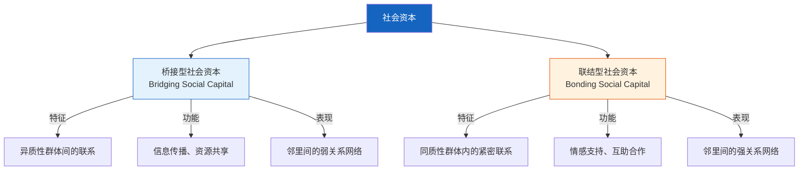
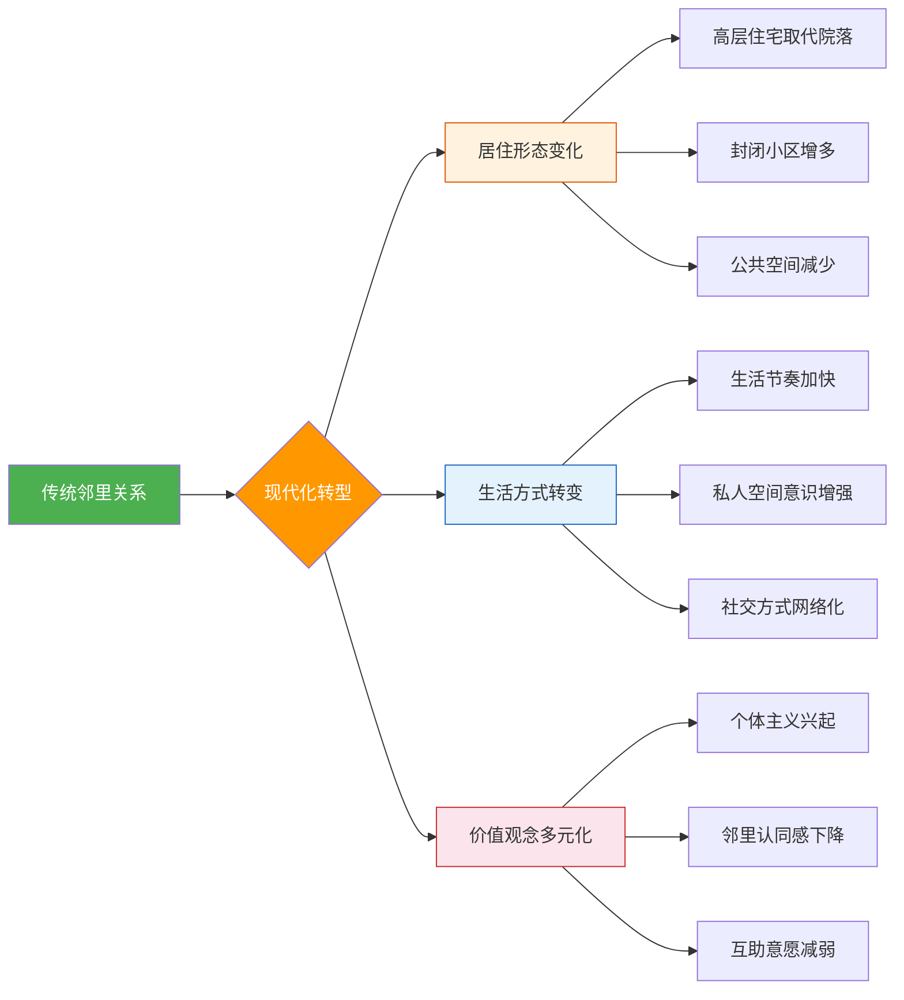
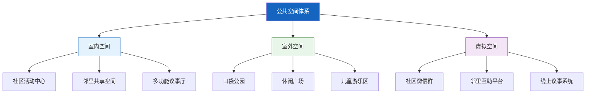
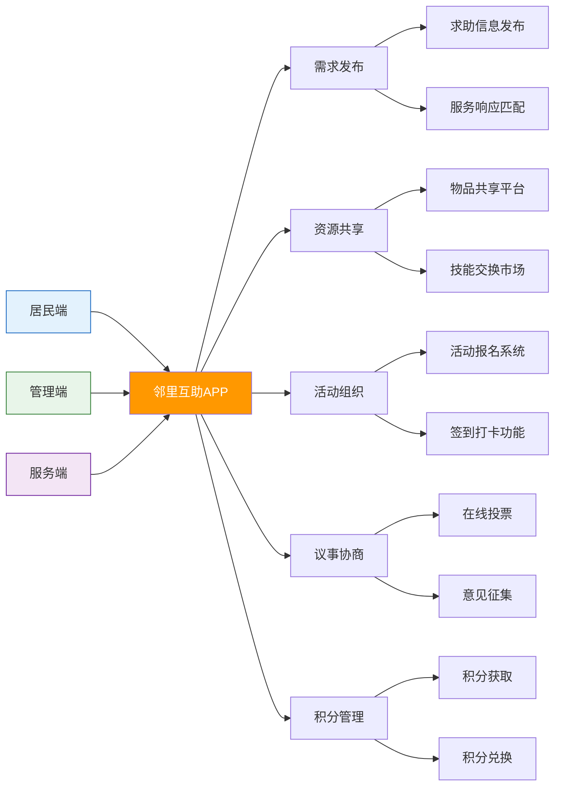
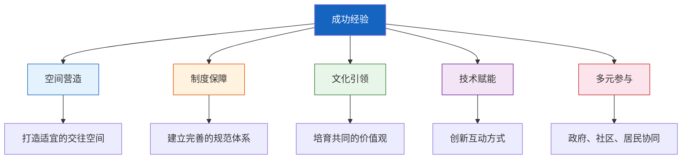

# 睦邻友好：构建和谐社会关系的理论与实践

> **核心观点**：睦邻友好不仅是中华民族的传统美德，更是现代社会治理体系中的重要基石。在城镇化加速推进、人口流动性增强的时代背景下，重构邻里关系对于建设和谐社区、提升居民幸福感具有不可替代的作用。

---

## 一、引言：邻里关系的时代价值

邻里关系是人类社会最基础的社会关系之一，它既是个体社会化的重要场所，也是社区治理的基本单元。在中国传统文化中，"远亲不如近邻"、"邻里和睦胜似亲人"等谚语深刻反映了邻里关系的重要价值。然而，随着现代化进程的加速，城市居住形态的变革使得传统的邻里关系面临前所未有的挑战。

### 1.1 研究背景与意义

当代社会正处于快速转型期，城镇化率持续攀升，人口流动日益频繁。高层住宅、封闭小区等现代居住形态改变了传统的邻里互动模式，"对门不识"成为城市生活的常态。这种变化不仅影响了居民的生活质量，也给社区治理带来了新的挑战。

在此背景下，重新审视和构建睦邻友好关系具有重要的理论价值和实践意义：

1. **社会层面**：良好的邻里关系有助于增强社区凝聚力，促进社会和谐稳定
2. **个体层面**：和谐的邻里交往能够提升居民的归属感和幸福感
3. **治理层面**：邻里互助网络是基层社会治理的重要支撑力量
4. **文化层面**：传承和发扬邻里和睦的优秀传统文化

### 1.2 概念界定

**睦邻友好**是指相邻而居的人们在长期交往过程中形成的相互尊重、互帮互助、和睦相处的社会关系状态。它不仅是一种道德规范，更是一种社会治理理念和实践方式。

---

## 二、理论基础与分析框架

### 2.1 社会资本理论

社会资本理论为理解睦邻友好提供了重要的分析视角。根据普特南（Robert Putnam）的研究，社会资本可以分为两种类型：



在邻里关系中，桥接型社会资本帮助居民建立广泛的社会网络，获取多样化资源；联结型社会资本则深化邻里间的情感纽带，形成互助共同体。两者相辅相成，共同构成睦邻友好的社会基础。

### 2.2 社会交换理论

社会交换理论认为，人际互动本质上是一种资源交换过程。在邻里交往中，居民通过以下方式实现社会交换：

| 交换类型 | 具体内容 | 实例 |
|:---|:---|:---|
| 物质交换 | 实物借用、资源共享 | 借用工具、共享停车位 |
| 服务交换 | 劳动互助、技能互补 | 帮忙照看老人小孩、维修电器 |
| 情感交换 | 关心慰问、心理支持 | 邻里聊天、节日问候 |
| 信息交换 | 消息传递、经验分享 | 社区资讯、育儿经验 |

### 2.3 社区治理理论

现代社区治理理论强调多元主体共同参与，而睦邻友好正是实现社区自治的重要前提。良好的邻里关系能够：

1. **降低治理成本**：邻里互助减少了对外部服务的依赖
2. **提高治理效率**：居民自发参与社区事务管理
3. **增强治理韧性**：面对突发事件时，邻里网络能快速响应

---

## 三、睦邻友好的历史演进与文化传承

### 3.1 中国传统邻里文化

中国自古以来就有着深厚的邻里文化传统，主要体现在以下几个方面：

**礼制规范**
- 《周礼》中记载的"五家为邻，五邻为里"的基层组织结构
- 儒家"里仁为美"的思想，强调选择良好邻里环境的重要性
- 传统乡约制度中的邻里互助条款

**道德伦理**
- "守望相助"的互助精神
- "出入相友，疾病相扶持"的伦理要求
- "千金买宅，万金买邻"的价值观念

**空间形态**
- 四合院、胡同、里弄等传统居住空间促进邻里交往
- 公共空间（井台、戏台、祠堂）作为邻里交流的重要场所
- 街坊邻里形成的熟人社会网络

### 3.2 现代转型与挑战

随着城镇化进程的推进，邻里关系面临多重挑战：



**空间隔离效应**
现代住宅设计注重私密性，减少了邻里自然接触的机会。防盗门、电梯公寓等物理屏障使得"鸡犬之声相闻，老死不相往来"成为现实。

**时间压缩效应**
快节奏的城市生活压缩了居民的闲暇时间，邻里交往被边缘化。工作时间长、通勤距离远等因素进一步减少了邻里互动。

**社会流动性增强**
频繁的人口流动使得邻里关系难以长期稳定建立。租户比例上升、居民更替加快，削弱了社区认同感和归属感。

---

## 四、睦邻友好的现实困境与成因分析

### 4.1 主要困境表现

**认知层面**
- 邻里认同感缺失，对社区缺乏归属感
- 互助意识淡薄，过度依赖市场化服务
- 公共精神不足，对社区事务漠不关心

**行为层面**
- 邻里交往频率低，互动内容单一
- 互助行为减少，利他动机不足
- 冲突化解能力弱，矛盾容易升级

**制度层面**
- 社区组织功能弱化，缺乏有效引导
- 激励机制不健全，参与动力不足
- 法律保障不完善，权益保护困难

### 4.2 成因深度剖析

**结构性因素**

1. **城市空间结构**：功能分区明确但混合度低，居住、工作、商业空间分离，减少了日常交往场景
2. **社会阶层分化**：不同收入、教育背景的群体居住空间分化，影响邻里间的理解与认同
3. **人口结构变化**：老龄化、少子化、家庭小型化改变了传统邻里互动模式

**文化性因素**

1. **价值观念转变**：个人主义、隐私意识增强，对公共生活的参与意愿下降
2. **信任危机**：社会信任度整体下降，邻里间的初始信任建立困难
3. **文化传承断裂**：传统邻里文化的现代转化不足，缺乏适应新时代的交往规范

**制度性因素**

1. **社区治理体制**：行政化管理色彩浓厚，居民自治空间有限
2. **公共服务供给**：市场化服务替代了部分邻里互助功能
3. **法律政策环境**：邻里关系缺乏明确的法律规范和制度保障

---

## 五、构建睦邻友好的实践路径

### 5.1 空间营造：重塑邻里交往场景

**社区公共空间优化**



**设计原则**
- **可达性**：公共空间应分布在居民步行5-10分钟范围内
- **开放性**：打破封闭格局，创造自然交往机会
- **多样性**：满足不同年龄、兴趣群体的需求
- **舒适性**：提供适宜的物理环境和设施配置

**成功案例**
- 新加坡"组屋底层架空层"（Void Deck）模式：将住宅楼底层设置为公共活动空间
- 日本"社区营造"（Machizukuri）实践：居民参与公共空间设计与维护
- 成都"坊间"项目：将老旧小区闲置空间改造为邻里共享空间

### 5.2 活动培育：激发邻里互动活力

**常态化活动体系**

| 活动类型 | 频次 | 参与对象 | 主要内容 |
|:---|:---|:---|:---|
| 邻里节 | 年度 | 全体居民 | 文艺表演、美食分享、互动游戏 |
| 周末市集 | 月度 | 居民商家 | 二手物品交换、手工艺品展销 |
| 兴趣小组 | 周度 | 兴趣爱好者 | 书法、舞蹈、园艺、读书会 |
| 志愿服务 | 不定期 | 志愿者 | 环境美化、助老扶弱、社区巡逻 |
| 亲子活动 | 双周 | 家庭 | 亲子游戏、科普教育、手工制作 |

**活动组织机制**

1. **政府引导**：提供资金支持和政策保障
2. **社区组织**：居委会、业委会统筹协调
3. **居民主导**：培育社区骨干和志愿者队伍
4. **社会参与**：引入专业社工机构和社会组织

### 5.3 制度建设：完善睦邻友好保障

**规范体系构建**

```yaml
邻里公约体系:
  基础规范:
    - 相互尊重，礼貌待人
    - 爱护环境，保持整洁
    - 文明养宠，不扰邻里
    - 控制噪音，维护安宁
  
  互助机制:
    - 建立邻里互助台账
    - 设立应急联系人制度
    - 开展"时间银行"互助存储
    - 组织技能共享交换
  
  纠纷调解:
    - 建立楼栋调解员制度
    - 设立社区议事协商平台
    - 引入专业法律顾问
    - 完善快速响应机制
  
  激励措施:
    - 评选"好邻居"典型
    - 建立志愿服务积分制
    - 提供公共服务优先权
    - 给予物质和精神奖励
```

**法律保障**

1. **明确邻里权利义务**：在法律层面界定相邻关系的基本规范
2. **完善纠纷解决机制**：建立多元化的邻里矛盾调解途径
3. **强化社区自治权**：赋予社区组织更多自治管理权限
4. **提供司法支持**：设立社区法庭或巡回审判点

### 5.4 技术赋能：创新邻里互动模式

**数字化平台建设**



**典型应用场景**

1. **邻里互助圈**：居民发布求助信息，附近邻居响应帮助
2. **共享工具箱**：社区集中购置常用工具，居民借用共享
3. **技能交换平台**：居民发布可提供的技能服务，实现互利互惠
4. **社区议事厅**：在线讨论社区事务，提高居民参与度
5. **时间银行**：志愿服务时间存储，未来可兑换他人服务

### 5.5 文化引领：培育睦邻友好精神

**价值观念塑造**

1. **宣传教育**：通过社区宣传栏、微信公众号等渠道传播睦邻文化
2. **典型示范**：评选表彰"好邻居"、"最美家庭"等先进典型
3. **文化传承**：挖掘整理本地邻里文化传统，进行现代转化
4. **氛围营造**：创作邻里主题文艺作品，开展文化活动

**社区精神培育**

```
社区精神培育路径：

认知认同 → 情感共鸣 → 行为践行 → 习惯养成
    ↓           ↓           ↓          ↓
了解社区    产生归属    参与活动    自觉维护
历史价值    感与认同感  互助行动    邻里关系
```

---

## 六、典型案例与经验启示

### 6.1 国内实践案例

**案例一：北京"小院议事厅"**

- **背景**：东城区胡同社区面临公共空间狭小、居民诉求多元等问题
- **做法**：在胡同小院设立议事厅，居民定期协商解决社区问题
- **成效**：形成了"民事民议、民事民办、民事民管"的治理格局
- **启示**：空间不在大小，关键是要有常态化议事机制

**案例二：上海"弄堂管家"**

- **背景**：老旧弄堂缺乏物业管理，环境脏乱差
- **做法**：居民自发组织"弄堂管家"团队，轮流值守、互助管理
- **成效**：弄堂环境明显改善，邻里关系更加和睦
- **启示**：激发居民主体意识，实现自我管理和互助服务

**案例三：深圳"邻里空间站"**

- **背景**：新建商品房小区邻里关系冷漠
- **做法**：利用架空层打造"邻里空间站"，开展多样化活动
- **成效**：居民参与度显著提升，社区凝聚力增强
- **启示**：现代化小区同样需要营造邻里交往空间

### 6.2 国际经验借鉴

**新加坡"邻里中心"模式**

新加坡在每个组屋区设立邻里中心（Neighborhood Centre），集商业、文化、体育、医疗等功能于一体，成为居民日常交往的重要场所。政府通过组屋政策刻意安排不同族群混居，促进社会融合。

**日本"町内会"制度**

日本的町内会（社区自治组织）在组织社区活动、维护公共环境、防灾减灾等方面发挥重要作用。居民通过缴纳会费、参与志愿活动等方式支持町内会运转，形成了成熟的社区自治传统。

**美国"社区营造"运动**

美国自20世纪60年代兴起社区营造（Community Building）运动，强调居民参与社区规划和发展。通过社区土地信托、参与式预算等创新机制，增强了居民的社区归属感和参与感。

### 6.3 经验总结



---

## 七、未来展望与发展趋势

### 7.1 发展趋势预测

**空间融合化**
未来社区将更加注重功能混合和空间开放，打破单一居住功能，创造更多邻里交往机会。混合用途开发、共享空间设计将成为主流趋势。

**治理精细化**
社区治理将从粗放式管理向精细化服务转变，通过网格化管理、数字化手段提高治理效能。邻里关系建设将被纳入社区治理的重要考核指标。

**服务智能化**
人工智能、物联网等技术将深度融入社区服务，智能门禁、智慧停车、远程医疗等智能化设施将改变邻里互动方式。但技术不能完全替代面对面交往，需要在智能化与人性化之间找到平衡。

**参与多元化**
居民参与社区事务的渠道将更加多样化，从传统的线下活动扩展到线上议事、云端志愿服务等形式。不同年龄、职业、背景的居民都能找到适合自己的参与方式。

### 7.2 面临的挑战与应对
**挑战一：代际差异**
不同年龄段居民对邻里交往的需求和方式存在显著差异。老年人偏好面对面交流，年轻人倾向线上互动。需要设计多样化的交往场景，满足不同群体需求。

**应对策略**：建立"线上+线下"融合模式，既保留传统邻里交往形式，又开发数字化互动平台。

**挑战二：隐私保护**
在数字化时代，邻里互动中涉及的个人信息保护问题日益突出。如何在促进交往的同时保护隐私，是需要认真考虑的议题。

**应对策略**：制定社区数据使用规范，明确信息收集、使用、存储的边界，保障居民隐私权。

**挑战三：可持续性**
许多睦邻友好项目在初期取得良好效果后难以持续，面临资金短缺、人员流失等问题。如何建立长效机制是关键挑战。

**应对策略**：建立多元化的资金支持体系，培育社区内生动力，形成自我运转的良性循环。

### 7.3 愿景展望
未来的理想社区应该是：

- **温暖的共同体**：邻里之间相互关心、互帮互助，形成情感纽带
- **开放的交往空间**：提供多样化的交往场景，促进不同群体交流融合
- **高效的治理体系**：居民广泛参与社区事务，实现共建共治共享
- **智慧的服务平台**：运用现代技术提升服务质量，但不替代人际温度
- **包容的文化氛围**：尊重差异、包容多样，让每个人都能找到归属感

---

## 八、结语

睦邻友好是中华民族的传统美德，也是现代社会治理的重要基石。在城镇化快速推进、社会结构深刻变革的时代背景下，重构邻里关系具有重要的现实意义和深远的历史意义。

构建睦邻友好关系是一项系统工程，需要空间营造、制度建设、文化引领、技术赋能等多方面的协同推进。政府、社区组织、居民个体都应承担起相应责任，共同努力营造和谐的邻里环境。

"邻里和睦，社区和谐；社区和谐，社会安定。"让我们从自身做起，从身边小事做起，用真诚和善意搭建邻里之间的友谊桥梁，共同建设美好家园。

---

## 参考文献

1. 费孝通. 《乡土中国》. 北京: 人民出版社, 2008.
2. 罗伯特·帕特南. 《独自打保龄：美国社区的衰落与复兴》. 北京: 北京大学出版社, 2011.
3. 简·雅各布斯. 《美国大城市的死与生》. 南京: 译林出版社, 2006.
4. 吴晓林. 城市社区治理的逻辑. 《政治学研究》, 2019(3): 45-56.
5. 陈伟东. 社区自治：理论与实践. 北京: 中国社会出版社, 2015.
6. Putnam, R. D. Bowling Alone: The Collapse and Revival of American Community. New York: Simon & Schuster, 2000.
7. Jacobs, J. The Death and Life of Great American Cities. New York: Random House, 1961.
8. 王名. 社会组织论. 北京: 北京大学出版社, 2018.
9. 李强. 城市化进程中的邻里关系重建. 《社会学研究》, 2020(2): 78-95.
10. 孙柏瑛. 城市社区治理创新的实践逻辑. 《中国行政管理》, 2021(5): 34-41.

---

**作者：** Pizicaiman  
**发布时间：** 2026-04-24  
**分类：** 社会学, 社区治理  
**标签：** 睦邻友好, 社区关系, 社会治理, 和谐社区, 人际交往  
**字数：** 约8500字