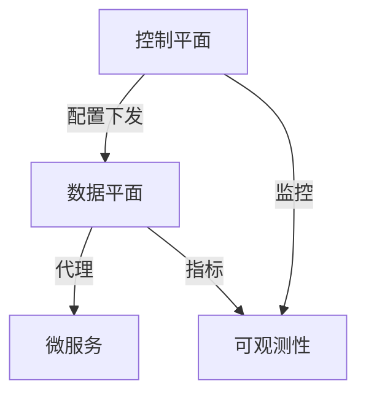
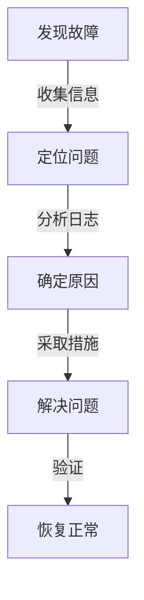
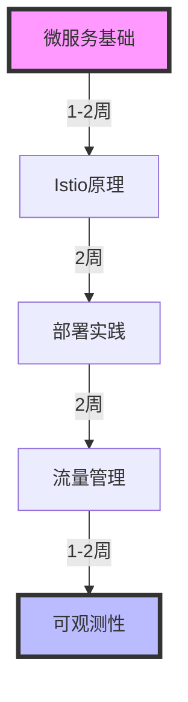

# 服务网格实践指南

## 目录

1. [架构概述](#架构概述)
2. [核心组件](#核心组件)
3. [部署实践](#部署实践)
4. [流量管理](#流量管理)
5. [可观测性](#可观测性)

## 架构概述

### 服务网格架构



### 核心功能

1. 流量控制
   - 负载均衡
   - 熔断限流
   - 故障注入

2. 安全管理
   - mTLS加密
   - 访问控制
   - 认证授权

## 核心组件

### 1. Istio组件配置

```yaml
# Istio配置示例
apiVersion: install.istio.io/v1alpha1
kind: IstioOperator
metadata:
  name: istio-control
spec:
  profile: demo
  components:
    pilot:
      k8s:
        resources:
          requests:
            cpu: 500m
            memory: 2048Mi
    ingressGateways:
    - name: istio-ingressgateway
      enabled: true
```

### 2. Envoy配置

```yaml
# Envoy Sidecar配置
apiVersion: networking.istio.io/v1alpha3
kind: EnvoyFilter
metadata:
  name: custom-filter
  namespace: istio-system
spec:
  configPatches:
  - applyTo: HTTP_FILTER
    match:
      context: SIDECAR_INBOUND
      listener:
        filterChain:
          filter:
            name: envoy.filters.network.http_connection_manager
    patch:
      operation: INSERT_BEFORE
      value:
        name: custom.filter
        typed_config:
          "@type": type.googleapis.com/udpa.type.v1.TypedStruct
          type_url: type.googleapis.com/envoy.extensions.filters.http.router.v3.Router
```

## 部署实践

### 1. 网关配置

```yaml
# Gateway配置
apiVersion: networking.istio.io/v1alpha3
kind: Gateway
metadata:
  name: bookinfo-gateway
spec:
  selector:
    istio: ingressgateway
  servers:
  - port:
      number: 80
      name: http
      protocol: HTTP
    hosts:
    - "bookinfo.example.com"
```

### 2. 虚拟服务

```yaml
# VirtualService配置
apiVersion: networking.istio.io/v1alpha3
kind: VirtualService
metadata:
  name: reviews
spec:
  hosts:
  - reviews
  http:
  - match:
    - headers:
        end-user:
          exact: jason
    route:
    - destination:
        host: reviews
        subset: v2
  - route:
    - destination:
        host: reviews
        subset: v3
```

## 流量管理

### 1. 流量控制


### 2. 熔断配置

```yaml
# 熔断器配置
apiVersion: networking.istio.io/v1alpha3
kind: DestinationRule
metadata:
  name: reviews
spec:
  host: reviews
  trafficPolicy:
    outlierDetection:
      consecutive5xxErrors: 5
      interval: 10s
      baseEjectionTime: 30s
```

## 可观测性

### 1. 监控配置

```yaml
# Prometheus监控配置
apiVersion: monitoring.coreos.com/v1
kind: ServiceMonitor
metadata:
  name: istio-component-monitor
  namespace: istio-system
spec:
  selector:
    matchLabels:
      istio: pilot
  endpoints:
  - port: http-monitoring
```

### 2. 链路追踪

```yaml
# Jaeger配置
apiVersion: jaegertracing.io/v1
kind: Jaeger
metadata:
  name: jaeger
spec:
  strategy: production
  storage:
    type: elasticsearch
    options:
      es:
        server-urls: http://elasticsearch:9200
```

## 最佳实践

### 1. 性能优化

1. 资源配置
   - 合理设置 CPU/内存限制
   - 优化 Envoy 配置
   - 调整并发连接数

2. 网络优化
   - 启用 keepalive
   - 配置合适的超时时间
   - 优化重试策略

### 2. 故障处理



## 学习路线



## 故障排查

### 1. 常见问题

```bash
# 检查Istio组件状态
kubectl get pods -n istio-system

# 查看代理配置
istioctl proxy-config all <pod-name>.<namespace>

# 验证配置
istioctl analyze
```

### 2. 调试工具

```bash
# 查看服务依赖
istioctl dashboard kiali

# 检查指标
istioctl dashboard grafana

# 查看追踪
istioctl dashboard jaeger
```

## 参考资料

1. [Istio官方文档](https://istio.io/latest/docs/)
2. [Service Mesh最佳实践](https://www.servicemesher.com/)
3. [Envoy文档](https://www.envoyproxy.io/docs/envoy/latest/)
4. [服务网格性能优化指南](https://istio.io/latest/docs/ops/best-practices/performance/)