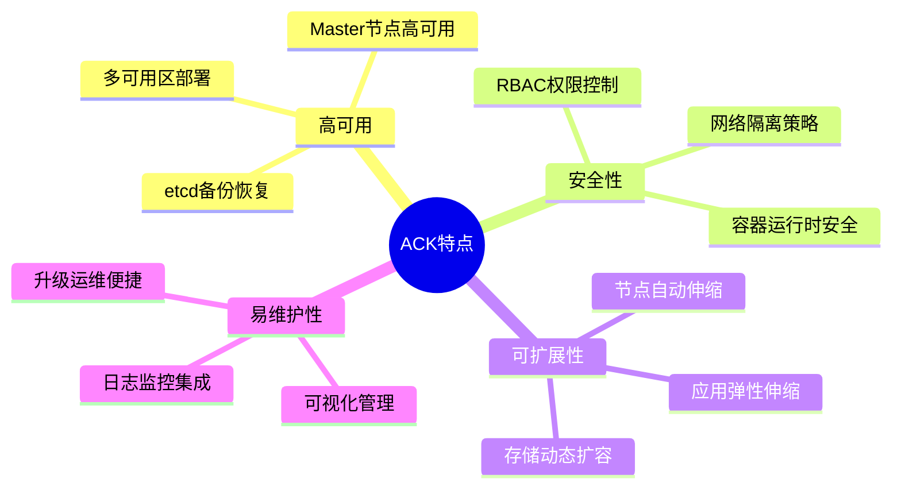
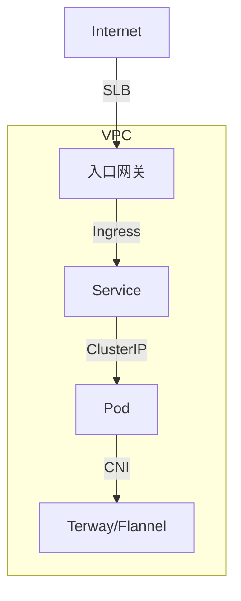
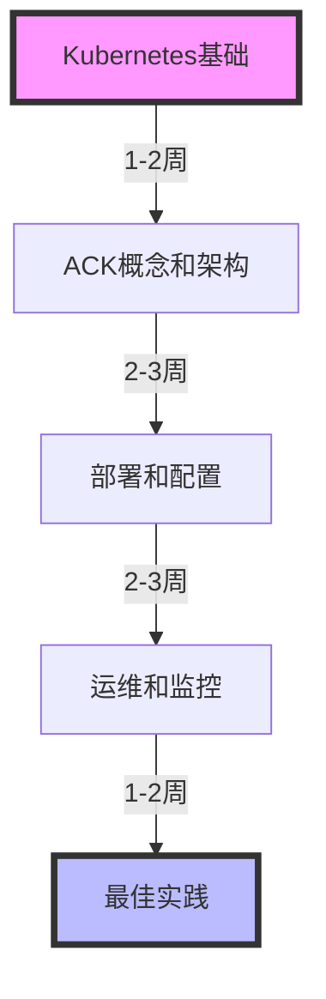

## 目录

1. [ACK概述](#ack概述)
2. [架构设计](#架构设计)
3. [部署实践](#部署实践)
4. [运维管理](#运维管理)
5. [最佳实践](#最佳实践)

## ACK概述

### 产品特点



### 版本类型

1. ACK专有版
   - 独享Master节点
   - 更高的SLA保证
   - 企业级特性支持

2. ACK托管版
   - 免费Master节点
   - 简化运维管理
   - 适合中小规模应用

## 架构设计

### 网络架构



### 多集群架构

```yaml
# 多集群配置示例
apiVersion: apps.openyurt.io/v1alpha1
kind: UnitedDeployment
metadata:
  name: nginx-deployment
spec:
  replicas: 6
  revisionHistoryLimit: 5
  selector:
    matchLabels:
      app: nginx
  workloadTemplate:
    deploymentTemplate:
      metadata:
        labels:
          app: nginx
      spec:
        template:
          metadata:
            labels:
              app: nginx
          spec:
            containers:
            - name: nginx
              image: nginx:1.21
  topology:
    pools:
    - name: hangzhou
      nodeSelectorTerms:
      - matchExpressions:
        - key: region
          operator: In
          values:
          - cn-hangzhou
      replicas: 3
    - name: beijing
      nodeSelectorTerms:
      - matchExpressions:
        - key: region
          operator: In
          values:
          - cn-beijing
      replicas: 3
```

## 部署实践

### 1. 集群创建

```bash
# 使用阿里云CLI创建ACK集群
aliyun cs POST /clusters \
  --header "Content-Type=application/json" \
  --body "$(cat <<EOF
{
    "name": "my-ack-cluster",
    "region_id": "cn-hangzhou",
    "cluster_type": "ManagedKubernetes",
    "vpcid": "vpc-xxx",
    "container_cidr": "172.20.0.0/16",
    "service_cidr": "172.21.0.0/20",
    "vswitch_ids": ["vsw-xxx"],
    "worker_instance_types": ["ecs.g6.large"],
    "num_of_nodes": 3,
    "worker_system_disk_category": "cloud_essd",
    "worker_system_disk_size": 120,
    "kubernetes_version": "1.24.6-aliyun.1",
    "worker_instance_charge_type": "PostPaid"
}
EOF
)"
```

### 2. 应用部署

```yaml
# 使用ACK提供的增强特性
apiVersion: apps/v1
kind: Deployment
metadata:
  name: nginx-deployment
  annotations:
    kubernetes.io/ingress-bandwidth: 10M
    kubernetes.io/egress-bandwidth: 10M
spec:
  replicas: 3
  selector:
    matchLabels:
      app: nginx
  template:
    metadata:
      labels:
        app: nginx
    spec:
      containers:
      - name: nginx
        image: nginx:1.21
        resources:
          requests:
            cpu: "250m"
            memory: "512Mi"
          limits:
            cpu: "500m"
            memory: "1Gi"
```

## 运维管理

### 监控告警

```yaml
# 配置ARMS监控
apiVersion: arms.aliyun.com/v1beta1
kind: ApplicationMonitor
metadata:
  name: nginx-monitor
spec:
  type: java
  selector:
    matchLabels:
      app: nginx
  template:
    spec:
      jvm: true
      profiling: true
```

### 日志管理

```bash
# 配置SLS日志采集
kubectl apply -f sls-logging.yaml

# 查看日志采集状态
kubectl get alicloud-log-config
```

## 最佳实践

### 1. 成本优化


### 2. 安全加固

1. 网络安全
   - 配置安全组规则
   - 启用网络策略
   - 使用私网SLB

2. 访问控制
   - 配置RAM角色
   - 使用Pod安全策略
   - 实施最小权限原则

### 3. 高可用配置

```yaml
# 多可用区部署配置
apiVersion: apps/v1
kind: Deployment
metadata:
  name: nginx-ha
spec:
  replicas: 6
  template:
    spec:
      affinity:
        podAntiAffinity:
          requiredDuringSchedulingIgnoredDuringExecution:
          - labelSelector:
              matchExpressions:
              - key: app
                operator: In
                values:
                - nginx
            topologyKey: topology.kubernetes.io/zone
```

## 常见问题排查

### 1. 节点问题

```bash
# 检查节点状态
kubectl get nodes
kubectl describe node <node-name>

# 查看节点系统日志
journalctl -u kubelet

# 检查节点资源使用
kubectl top node
```

### 2. 应用问题

```bash
# Pod状态检查
kubectl get pods -o wide
kubectl describe pod <pod-name>

# 容器日志查看
kubectl logs <pod-name> -c <container-name>

# 进入容器调试
kubectl exec -it <pod-name> -- /bin/bash
```

## 学习路线



## 参考资料

1. [阿里云ACK文档](https://help.aliyun.com/product/85222.html)
2. [ACK最佳实践](https://help.aliyun.com/document_detail/86208.html)
3. [容器服务ACK版本发布记录](https://help.aliyun.com/document_detail/185269.html)