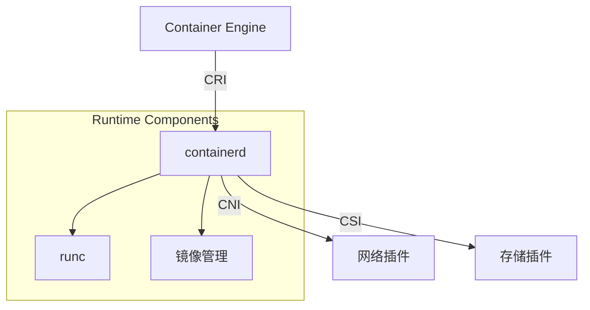
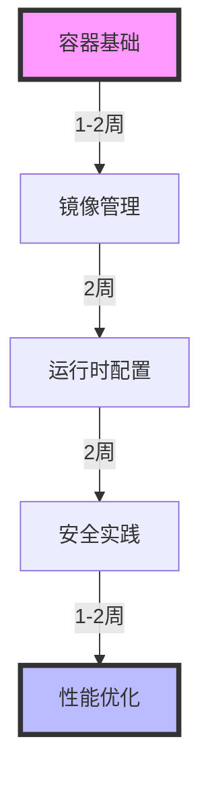

## 目录

1. [容器基础](#容器基础)
2. [镜像管理](#镜像管理)
3. [运行时配置](#运行时配置)
4. [安全实践](#安全实践)
5. [性能优化](#性能优化)

## 容器基础

### 容器运行时架构



### 支持的容器运行时

1. Containerd（推荐）
   - 更轻量级
   - 性能更好
   - OCI兼容

2. Docker Engine
   - 更成熟稳定
   - 工具链完整
   - 调试便利

## 镜像管理

### 1. 镜像仓库配置

```yaml
# ACR企业版配置
apiVersion: v1
kind: Secret
metadata:
  name: acr-registry-secret
  namespace: default
type: kubernetes.io/dockerconfigjson
data:
  .dockerconfigjson: <base64-encoded-registry-credentials>
```

### 2. 镜像构建最佳实践

```dockerfile
# 多阶段构建示例
FROM maven:3.8.4-jdk-11 AS builder
WORKDIR /app
COPY pom.xml .
COPY src ./src
RUN mvn clean package -DskipTests

FROM openjdk:11-jre-slim
WORKDIR /app
COPY --from=builder /app/target/*.jar app.jar
EXPOSE 8080
ENTRYPOINT ["java","-jar","app.jar"]
```

### 3. 镜像加速配置

```json
{
  "registry-mirrors": [
    "https://xxx.mirror.aliyuncs.com"
  ],
  "insecure-registries": [],
  "max-concurrent-downloads": 10,
  "max-concurrent-uploads": 5
}
```

## 运行时配置

### 1. 资源限制

```yaml
apiVersion: v1
kind: Pod
metadata:
  name: resource-demo
spec:
  containers:
  - name: app
    image: nginx
    resources:
      requests:
        memory: "64Mi"
        cpu: "250m"
      limits:
        memory: "128Mi"
        cpu: "500m"
    securityContext:
      runAsNonRoot: true
      runAsUser: 1000
      allowPrivilegeEscalation: false
```

### 2. 健康检查

```yaml
apiVersion: v1
kind: Pod
metadata:
  name: liveness-demo
spec:
  containers:
  - name: app
    image: nginx
    livenessProbe:
      httpGet:
        path: /health
        port: 8080
      initialDelaySeconds: 15
      periodSeconds: 10
    readinessProbe:
      httpGet:
        path: /ready
        port: 8080
      initialDelaySeconds: 5
      periodSeconds: 5
```

## 安全实践

### 1. 容器安全扫描

```bash
# 使用阿里云容器镜像服务扫描
aliyun cr scan --image-id registry.cn-hangzhou.aliyuncs.com/namespace/image:tag

# 查看扫描结果
aliyun cr scan-result --image-id registry.cn-hangzhou.aliyuncs.com/namespace/image:tag
```

### 2. 运行时安全策略

```yaml
# Pod安全策略
apiVersion: policy/v1beta1
kind: PodSecurityPolicy
metadata:
  name: restricted
spec:
  privileged: false
  seLinux:
    rule: RunAsAny
  runAsUser:
    rule: MustRunAsNonRoot
  fsGroup:
    rule: RunAsAny
  volumes:
  - 'configMap'
  - 'emptyDir'
  - 'projected'
  - 'secret'
  - 'downwardAPI'
  - 'persistentVolumeClaim'
```

## 性能优化

### 1. 容器启动优化


### 2. 资源配置优化

```yaml
# HPA配置示例
apiVersion: autoscaling/v2
kind: HorizontalPodAutoscaler
metadata:
  name: nginx-hpa
spec:
  scaleTargetRef:
    apiVersion: apps/v1
    kind: Deployment
    name: nginx
  minReplicas: 1
  maxReplicas: 10
  metrics:
  - type: Resource
    resource:
      name: cpu
      target:
        type: Utilization
        averageUtilization: 80
```

## 故障排查指南

### 1. 容器日志查看

```bash
# 查看容器日志
kubectl logs <pod-name> -c <container-name>

# 实时跟踪日志
kubectl logs -f <pod-name> -c <container-name>

# 查看崩溃前日志
kubectl logs --previous <pod-name> -c <container-name>
```

### 2. 容器调试

```bash
# 进入容器
kubectl exec -it <pod-name> -c <container-name> -- /bin/sh

# 复制文件
kubectl cp <pod-name>:/path/to/file /local/path

# 查看容器详情
crictl inspect <container-id>
```

## 最佳实践总结

1. 镜像管理
   - 使用多阶段构建
   - 实施镜像安全扫描
   - 配置镜像加速

2. 运行时优化
   - 合理设置资源限制
   - 配置健康检查
   - 实施安全策略

3. 监控告警
   - 容器资源监控
   - 日志采集分析
   - 性能指标跟踪

## 学习路线



## 参考资料

1. [阿里云容器服务文档](https://help.aliyun.com/product/85222.html)
2. [Containerd官方文档](https://containerd.io/)
3. [Docker最佳实践](https://docs.docker.com/develop/develop-images/dockerfile_best-practices/)
4. [Kubernetes容器运行时](https://kubernetes.io/docs/setup/production-environment/container-runtimes/)