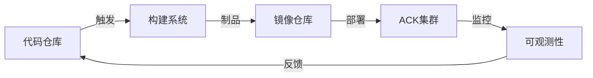
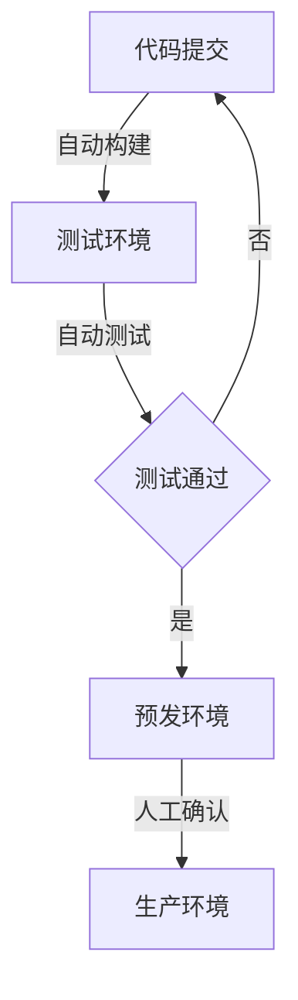
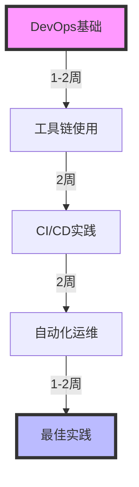

## 目录

1. [DevOps工具链](#devops工具链)
2. [持续集成](#持续集成)
3. [持续部署](#持续部署)
4. [自动化运维](#自动化运维)
5. [最佳实践](#最佳实践)

## DevOps工具链

### 工具链架构



### 核心组件

1. 代码管理
   - 阿里云代码仓库
   - GitLab企业版
   - GitHub Enterprise

2. 构建工具
   - 云效流水线
   - Jenkins
   - Tekton

3. 制品管理
   - ACR容器镜像服务
   - Harbor私有仓库

## 持续集成

### 1. 流水线配置

```yaml
# 云效流水线示例
version: '1.0'
name: demo-pipeline
triggers:
  trigger: auto
  branches:
    - master
    
stages:
  - name: 编译构建
    actions:
      - name: 构建Java应用
        uses: maven@1.0
        with:
          arguments: 'clean package -DskipTests'
          
  - name: 制品推送
    actions:
      - name: 构建镜像
        uses: docker-build@1.0
        with:
          dockerfile: ./Dockerfile
          image: registry.cn-hangzhou.aliyuncs.com/demo/app:${PIPELINE_ID}
          
  - name: 部署测试
    actions:
      - name: 部署到测试环境
        uses: acr-deploy@1.0
        with:
          cluster_id: ${TEST_CLUSTER_ID}
          namespace: test
```

### 2. 自动化测试

```yaml
# 测试任务配置
apiVersion: batch/v1
kind: Job
metadata:
  name: integration-test
spec:
  template:
    spec:
      containers:
      - name: test
        image: maven:3.8-jdk-11
        command: ["mvn", "test"]
        env:
        - name: TEST_DATABASE_URL
          valueFrom:
            configMapKeyRef:
              name: test-config
              key: database_url
      restartPolicy: Never
```

## 持续部署

### 1. GitOps实践

```yaml
# ArgoCD应用配置
apiVersion: argoproj.io/v1alpha1
kind: Application
metadata:
  name: demo-app
  namespace: argocd
spec:
  project: default
  source:
    repoURL: https://github.com/your-org/demo-app.git
    targetRevision: HEAD
    path: k8s
  destination:
    server: https://kubernetes.default.svc
    namespace: production
  syncPolicy:
    automated:
      prune: true
      selfHeal: true
```

### 2. 灰度发布

```yaml
# 金丝雀发布配置
apiVersion: flagger.app/v1beta1
kind: Canary
metadata:
  name: demo-app
spec:
  targetRef:
    apiVersion: apps/v1
    kind: Deployment
    name: demo-app
  progressDeadlineSeconds: 60
  service:
    port: 80
    targetPort: 8080
  analysis:
    interval: 1m
    threshold: 10
    maxWeight: 50
    stepWeight: 10
    metrics:
    - name: request-success-rate
      threshold: 99
      interval: 1m
```

## 自动化运维

### 1. 监控配置

```yaml
# Prometheus监控配置
apiVersion: monitoring.coreos.com/v1
kind: ServiceMonitor
metadata:
  name: demo-app
  namespace: monitoring
spec:
  selector:
    matchLabels:
      app: demo-app
  endpoints:
  - port: metrics
    interval: 15s
```

### 2. 日志采集

```yaml
# 日志采集配置
apiVersion: logging.alibabacloud.com/v1alpha1
kind: AliyunLogConfig
metadata:
  name: demo-app
spec:
  logstore: app-logs
  shardCount: 2
  logtailConfig:
    inputType: file
    configName: demo-app
    inputDetail:
      logType: json
      filePaths: 
      - /var/log/app/*.log
```

## 最佳实践

### 1. 发布策略



### 2. 质量保证

1. 代码质量
   - SonarQube静态检查
   - 单元测试覆盖率
   - 代码审查流程

2. 安全扫描
   - 依赖检查
   - 镜像扫描
   - 配置审计

## 故障排查

### 1. 流水线问题

```bash
# 查看构建日志
aliyun devops pipeline-log --pipeline-id xxx

# 检查构建状态
aliyun devops pipeline-status --pipeline-id xxx
```

### 2. 部署问题

```bash
# 查看部署历史
kubectl rollout history deployment/demo-app

# 回滚部署
kubectl rollout undo deployment/demo-app --to-revision=2
```

## 运维效率提升

### 1. 自动化脚本

```python
# 自动化运维脚本示例
import os
from aliyun.acs.ack import AckClient

def check_cluster_health():
    client = AckClient()
    clusters = client.list_clusters()
    for cluster in clusters:
        status = cluster.get_health_status()
        if status != 'healthy':
            send_alert(f"集群 {cluster.name} 状态异常")
```

### 2. 运维工具

```bash
# 常用运维命令别名
alias k='kubectl'
alias kg='kubectl get'
alias kd='kubectl describe'
alias kl='kubectl logs'
```

## 学习路线



## 参考资料

1. [阿里云DevOps文档](https://help.aliyun.com/product/152362.html)
2. [ACK DevOps最佳实践](https://help.aliyun.com/document_detail/86208.html)
3. [GitOps工具使用指南](https://argo-cd.readthedocs.io/en/stable/)
4. [云原生DevOps实践](https://cloudnative.to/blog/cloud-native-devops/)