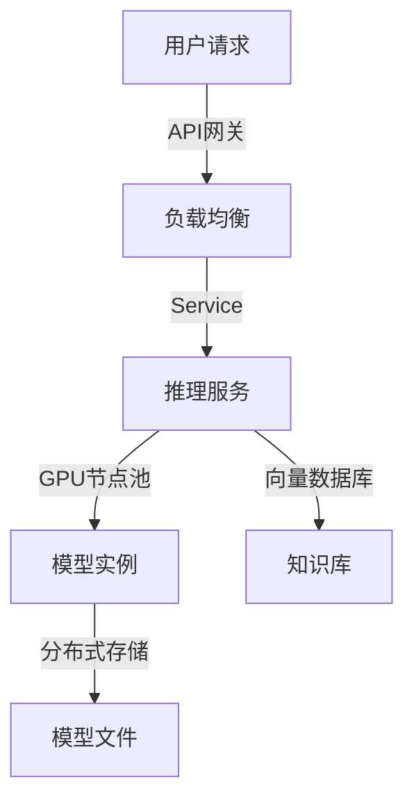
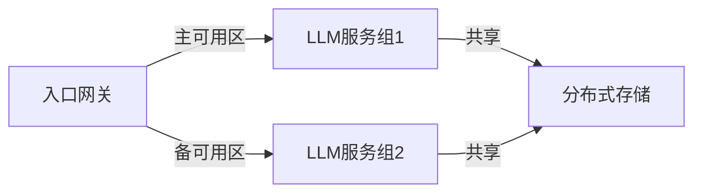
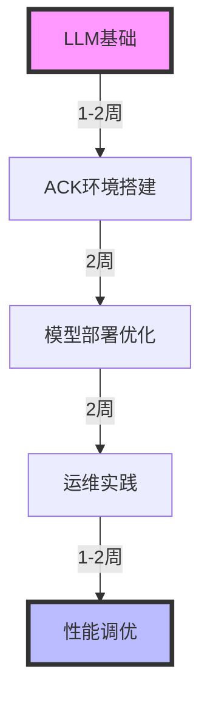

## 目录

1. [架构设计](#架构设计)
2. [环境配置](#环境配置)
3. [模型部署](#模型部署)
4. [性能优化](#性能优化)
5. [运维管理](#运维管理)

## 架构设计

### 整体架构



### 核心组件

1. 推理框架
   - vLLM
   - Triton Server
   - TensorRT-LLM

2. 资源管理
   - GPU共享调度
   - 显存优化
   - 动态批处理

## 环境配置

### 1. GPU节点配置

```yaml
# GPU节点池配置
apiVersion: apps/v1
kind: NodePool
metadata:
  name: gpu-pool
spec:
  nodeConfig:
    instanceTypes:
      - ecs.gn7i-c16g1.4xlarge
    systemDisk:
      category: cloud_essd
      size: 200
  scaling:
    minSize: 1
    maxSize: 10
```

### 2. 运行时配置

```bash
# 安装NVIDIA设备插件
kubectl apply -f https://raw.githubusercontent.com/NVIDIA/k8s-device-plugin/v0.14.1/nvidia-device-plugin.yml

# 验证GPU可用性
kubectl get nodes "-o=custom-columns=NAME:.metadata.name,GPU:.status.allocatable.nvidia\.com/gpu"
```

## 模型部署

### 1. 模型服务部署

```yaml
# vLLM服务部署
apiVersion: apps/v1
kind: Deployment
metadata:
  name: llm-inference
spec:
  replicas: 3
  selector:
    matchLabels:
      app: llm-inference
  template:
    metadata:
      labels:
        app: llm-inference
    spec:
      containers:
      - name: vllm
        image: vllm/vllm-openai
        resources:
          limits:
            nvidia.com/gpu: 1
          requests:
            nvidia.com/gpu: 1
        env:
        - name: MODEL_NAME
          value: "THUDM/chatglm3-6b"
        volumeMounts:
        - name: model-cache
          mountPath: /root/.cache/huggingface
      volumes:
      - name: model-cache
        persistentVolumeClaim:
          claimName: model-storage
```

### 2. 向量数据库配置

```yaml
# Milvus配置
apiVersion: milvus.io/v1beta1
kind: Milvus
metadata:
  name: my-release
spec:
  components:
    proxy:
      replicas: 2
    queryNode:
      replicas: 2
    dataNode:
      replicas: 2
```

## 性能优化

### 1. 推理性能优化

```python
# 批处理配置示例
from vllm import LLMEngine

engine = LLMEngine(
    model="THUDM/chatglm3-6b",
    tensor_parallel_size=2,
    max_batch_size=32,
    gpu_memory_utilization=0.95
)
```

### 2. 资源配置优化

```yaml
# HPA配置
apiVersion: autoscaling/v2
kind: HorizontalPodAutoscaler
metadata:
  name: llm-inference-hpa
spec:
  scaleTargetRef:
    apiVersion: apps/v1
    kind: Deployment
    name: llm-inference
  minReplicas: 1
  maxReplicas: 10
  metrics:
  - type: Resource
    resource:
      name: nvidia.com/gpu
      target:
        type: Utilization
        averageUtilization: 80
```

## 运维管理

### 1. 监控配置

```yaml
# Prometheus监控配置
apiVersion: monitoring.coreos.com/v1
kind: ServiceMonitor
metadata:
  name: llm-monitor
spec:
  selector:
    matchLabels:
      app: llm-inference
  endpoints:
  - port: metrics
    interval: 15s
```

### 2. 日志管理

```yaml
# 日志采集配置
apiVersion: logging.alibabacloud.com/v1alpha1
kind: AliyunLogConfig
metadata:
  name: llm-logs
spec:
  logstore: llm-inference
  logtailConfig:
    inputType: file
    configName: llm-log
    inputDetail:
      logType: json
      logPath: /var/log/llm
      filePattern: "*.log"
```

## 最佳实践

### 1. 高可用配置



### 2. 成本优化

1. 资源调度
   - 使用抢占式实例
   - 自动弹性伸缩
   - GPU共享技术

2. 模型优化
   - 模型量化
   - 知识蒸馏
   - 模型并行

## 排障指南

### 1. 常见问题处理

```bash
# 检查GPU状态
nvidia-smi

# 查看容器日志
kubectl logs -f deployment/llm-inference

# 检查模型加载
kubectl exec -it <pod-name> -- nvidia-smi
```

### 2. 性能诊断

```bash
# 性能分析
kubectl top pods
kubectl describe node <node-name>
```

## 学习路线



## 参考资料

1. [阿里云ACK文档](https://help.aliyun.com/product/85222.html)
2. [vLLM文档](https://vllm.ai/)
3. [Triton推理服务器](https://github.com/triton-inference-server/server)
4. [NVIDIA GPU Operator](https://github.com/NVIDIA/gpu-operator)