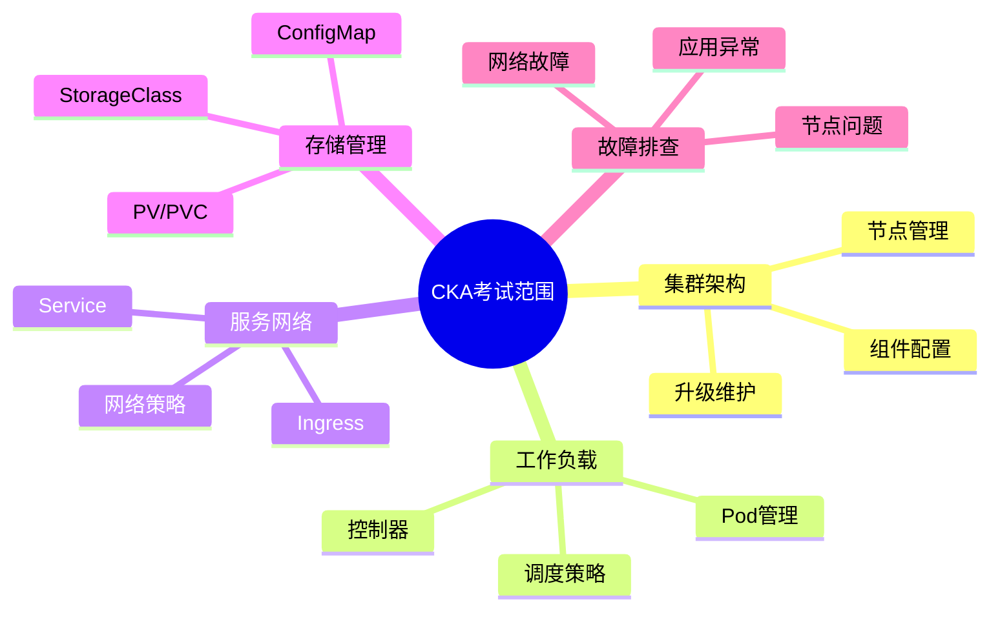
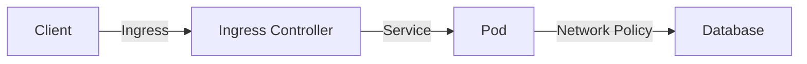
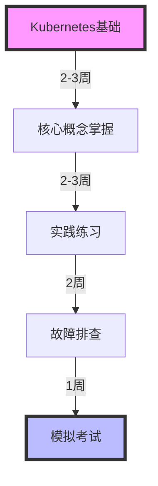
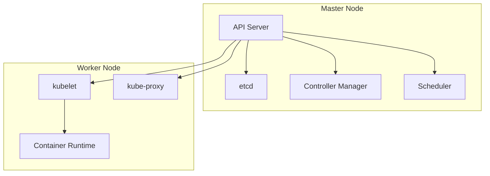
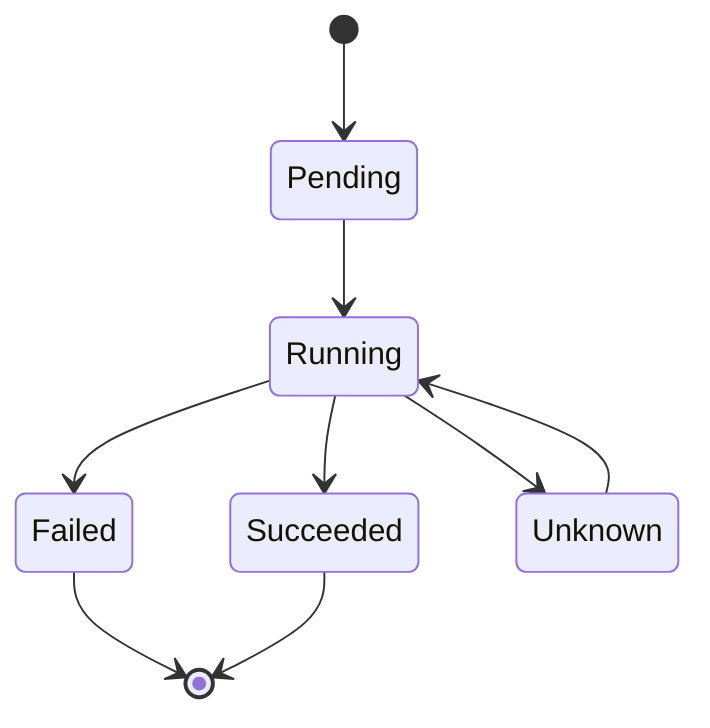

# CKA (Certified Kubernetes Administrator) 认证实战指南

## 目录

1. [考试概述](#考试概述)
2. [核心知识点](#核心知识点)
3. [实战案例](#实战案例)
4. [排错指南](#排错指南)
5. [学习路线](#学习路线)

## 考试概述

### 基本信息
- 考试时长：2小时
- 题目数量：15-20题
- 及格分数：66%
- 考试环境：Kubernetes v1.26
- 允许访问：kubernetes.io/docs/

### 考试范围



## 核心知识点

### 1. 集群管理

#### 1.1 创建集群

```bash
# 使用 kubeadm 初始化主节点
kubeadm init --pod-network-cidr=10.244.0.0/16

# 配置 kubectl
mkdir -p $HOME/.kube
sudo cp -i /etc/kubernetes/admin.conf $HOME/.kube/config
sudo chown $(id -u):$(id -g) $HOME/.kube/config

# 安装网络插件
kubectl apply -f https://raw.githubusercontent.com/coreos/flannel/master/Documentation/kube-flannel.yml
```

#### 1.2 节点管理

```yaml
# 示例：为节点添加标签
apiVersion: v1
kind: Node
metadata:
  name: worker-node1
  labels:
    zone: east
    type: compute
```

### 2. 工作负载管理

#### 2.1 Pod基础配置

```yaml
apiVersion: v1
kind: Pod
metadata:
  name: nginx-pod
  labels:
    app: nginx
spec:
  containers:
  - name: nginx
    image: nginx:1.21
    ports:
    - containerPort: 80
    resources:
      requests:
        memory: "64Mi"
        cpu: "250m"
      limits:
        memory: "128Mi"
        cpu: "500m"
```

#### 2.2 控制器示例

```yaml
# Deployment示例
apiVersion: apps/v1
kind: Deployment
metadata:
  name: nginx-deployment
spec:
  replicas: 3
  selector:
    matchLabels:
      app: nginx
  template:
    metadata:
      labels:
        app: nginx
    spec:
      containers:
      - name: nginx
        image: nginx:1.21
```

### 3. 网络配置



#### 3.1 Service配置

```yaml
apiVersion: v1
kind: Service
metadata:
  name: my-service
spec:
  selector:
    app: nginx
  ports:
    - protocol: TCP
      port: 80
      targetPort: 9376
  type: LoadBalancer
```

## 实战案例

### 案例1: 故障排查

```bash
# 1. 检查节点状态
kubectl get nodes
kubectl describe node <node-name>

# 2. 检查Pod状态
kubectl get pods -A -o wide
kubectl describe pod <pod-name>

# 3. 查看日志
kubectl logs <pod-name> -c <container-name>

# 4. 检查系统组件
kubectl get componentstatuses
```

### 案例2: 备份还原

```bash
# 1. 备份etcd
ETCDCTL_API=3 etcdctl snapshot save snapshot.db \
  --endpoints=https://127.0.0.1:2379 \
  --cacert=/etc/kubernetes/pki/etcd/ca.crt \
  --cert=/etc/kubernetes/pki/etcd/server.crt \
  --key=/etc/kubernetes/pki/etcd/server.key

# 2. 还原etcd
ETCDCTL_API=3 etcdctl snapshot restore snapshot.db \
  --data-dir=/var/lib/etcd-backup
```

## 学习路线



### 核心组件架构



## 常用命令速查

### 1. 基础操作

```bash
# Pod操作
kubectl run nginx --image=nginx
kubectl get pods -o wide
kubectl delete pod <pod-name>

# 节点管理
kubectl cordon <node-name>    # 标记不可调度
kubectl drain <node-name>     # 疏散节点
kubectl uncordon <node-name>  # 恢复调度
```

### 2. 故障排查

```bash
# 系统组件检查
systemctl status kubelet
journalctl -u kubelet

# 容器日志
crictl ps
crictl logs <container-id>

# 网络检查
kubectl exec <pod-name> -- ping <target-ip>
```

## 考试技巧

1. 时间管理
   - 先易后难
   - 合理分配时间
   - 标记待回顾题目

2. 操作效率
   - 使用命令别名
   - 掌握vim基本操作
   - 熟练使用kubectl命令

3. 文档查阅
   - 善用kubernetes.io文档
   - 记住常用YAML结构
   - 掌握快速查找技巧

## 重要概念图解

### Pod生命周期



## 参考资料

1. [Kubernetes官方文档](https://kubernetes.io/docs/)
2. [CKA考试大纲](https://github.com/cncf/curriculum)
3. [Kubernetes最佳实践](https://kubernetes.io/docs/concepts/configuration/overview/)