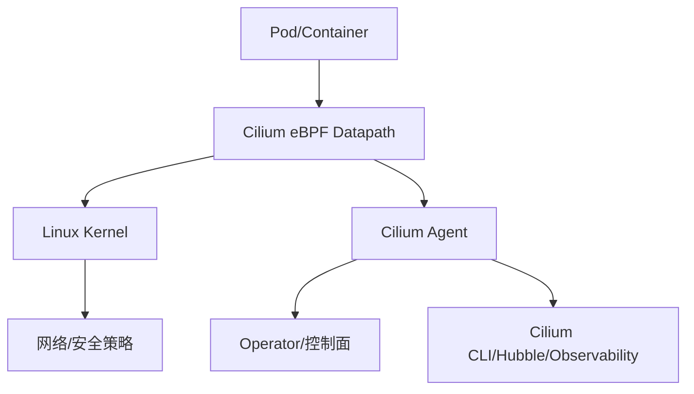

# 云原生网络Cilium深入探索与应用实践

Cilium 作为新一代基于 eBPF 的 Kubernetes 容器网络（CNI），已逐渐成为云原生网络与安全的事实标准。其不仅替代传统方案（如 Calico、Flannel），更在高性能、可观测性和安全性等方面带来质的飞跃。本文将系统解读 Cilium 的工作原理、核心特性、实际案例与进阶应用，为企业落地云原生网络提供一线实战指南。

---

## 1. 为什么选择 Cilium？CNI 方案演进回顾

- **传统 CNI（Flannel、Calico）局限：** 基于 iptables、内核转发规则，实现简单但性能有限，灵活性与安全粒度欠佳。
- **Cilium 优势：**
  - 核心基于 eBPF（内核原生沙盒字节码），极致性能，消除内核/用户态频繁切换。
  - L3~L7 全栈可观测和安全策略（支持 HTTP、gRPC、Kafka 等协议）。
  - 支持 Service Mesh、API-aware 网络策略、透明加密、DNS/流量可视化等进阶功能。
  - 成为 AWS EKS、Google GKE、阿里云 ACK 等主流云厂商默认/推荐 CNI。

---

## 2. Cilium 的架构与关键组件

Cilium 主要架构如下：



- **eBPF Datapath：** 所有数据面转发在内核执行，极低延迟、告别 iptables 瓶颈。
- **Cilium Agent：** 控制面组件，注入 eBPF 程序、同步 CRD 策略、管理网络状态。
- **Cilium Operator：** 负责 IPAM、Node 管理、跨集群自动路由等功能。
- **Hubble：** 内置分布式可观测性引擎，支持网络拓扑、流量追踪、DNS 解析链路等分析。
- **Cilium CLI：** 强大的命令行工具，辅助链路、策略、eBPF 状态调试。

---

## 3. 实际部署及快速体验（Kubernetes 环境）

### 安装示例（以 K8s 1.26+/CentOS 7+ 为例）

```bash
# 推荐官方 Helm 部署方式
helm repo add cilium https://helm.cilium.io/

helm install cilium cilium/cilium \
  --version 1.14.4 \
  --namespace kube-system \
  --set kubeProxyReplacement=strict \
  --set k8sServiceHost=<master-ip> \
  --set k8sServicePort=6443 \
  --set hubble.relay.enabled=true \
  --set hubble.ui.enabled=true
```

> 生产推荐搭配专用 VPC/CNI 设备开启 IPAM、Hubble 可观测、TLS 加密。

### 基础验证

```bash
kubectl -n kube-system get pods -l k8s-app=cilium
cilium status
cilium connectivity test
```

---

## 4. Cilium 进阶特性与特色实践

### 4.1 L7 网络策略

Cilium 除支持 Kubernetes 标准的 L3/L4 网络策略，还可实现 L7（HTTP、gRPC 等协议字段级）访问控制。

```yaml
apiVersion: "cilium.io/v2"
kind: CiliumNetworkPolicy
metadata:
  name: http-allow
spec:
  endpointSelector:
    matchLabels:
      app: myapp
  ingress:
  - toPorts:
    - ports:
      - port: "80"
        protocol: TCP
      rules:
        http:
        - method: "GET"
          path: "/api/public"
```

### 4.2 Hubble 网络可观测性

Hubble 支持实时查看集群所有流量、服务依赖拓扑、DNS 跟踪与异常分析。

```bash
# CLI 方式
cilium hubble enable
cilium hubble export flows
cilium hubble observe --protocol http --summary

# Web UI方式
kubectl port-forward -n kube-system svc/hubble-ui 12000:80
open http://localhost:12000
```

---

### 4.3 Service Mesh （与 Istio/Envoy 或原生 Mesh 集成）

- 支持原生透明代理（无需 Sidecar，资源占用更小）。
- L4/L7 粒度流量路由、访问日志、流量镜像。
- 系统自带 Ingress Gateway（cilium ingress），兼容 IngressClass 标准。

---

### 4.4 eBPF 扩展场景：可观测性与安全

- **eBPF Trace/Flow Logs**：无需侵入业务代码即可实现流量追踪、性能剖析。
- **Runtime Enforcement**：逐包实时安全策略，如阈值、速率限流、异常阻断。
- **透明加密**：Pod-Node、Pod-Pod 之间支持 WireGuard/IPSec 自动加密。

---

## 5. 常见落地最佳实践与运维建议

1. **生产环境推荐开启 kubeProxyReplacement**，减少 iptables 依赖提升性能。
2. **与云 VPC/IPAM 深度集成**，自动化弹性分配 IP 地址池。
3. **策略与 DNS 管理建议使用 Cilium CRD**，达成更细粒度可编程扩展。
4. **流量观测、异常告警务必接入 Hubble/Prometheus/Grafana**。
5. **定期升级 Cilium 版本**，紧跟 eBPF 生态与安全漏洞修复节奏。

---

## 6. 与 Calico/Flannel 对比及选型建议

| 特性             | Flannel           | Calico        | **Cilium**      |
|------------------|-------------------|---------------|-----------------|
| 数据面           | vxlan/host-gw     | iptables/BGP  | eBPF原生         |
| 性能             | 一般              | 高            | 极高            |
| L7 策略          | 不支持            | 不支持        | **支持**        |
| 可观测性         | 基础 logs         | flow logs     | **Hubble全局**  |
| Service Mesh     | 无                | 实验性        | **集成**        |
| 跨集群拓扑       | 无                | 需额外配置    | **原生支持**    |
| 云厂商支持       | 少                | 多            | **最强**        |

> 推荐选型：新项目一律 Cilium 优先；传统 Calico 可平滑迁移。

---

## 7. 应用案例：企业级集群的 Cilium 实践

- **A金融企业**：部署 Cilium + Hubble，实现微服务日万亿级流量全链路可观测，缩短故障定位时间 60%+。
- **B互联网公司**：利用 Cilium L7 策略灵活管控 API 网关调用，有效防御东西向横向攻击。
- **C云服务商**：全线 K8s 集群 IPAM、eBPF 网络方案，降本增效，网络转发延迟降低 30%。

---

## 8. 总结与学习路径建议

- **官方文档与博客：**  
  https://docs.cilium.io/  
  https://cilium.io/blog/

- **实战建议与学习路径：**
  1. 理解 K8s CNI 与 eBPF 基础原理（官方 docs + CNCF 制品课程）
  2. 本地 minikube/kind 环境 “跑一遍” Cilium 安装和可观测工具
  3. 重点实践 Hubble、L7 策略、多集群互联、Service Mesh
  4. 关注 Cilium Release Note、参与 eBPF/Cilium 社区

云原生网络不只是“连通”，更关乎安全、性能、运维与业务韧性。Cilium 及 eBPF 生态将成为 2025+ 年企业级云原生底座的关键竞争力。欢迎交流实践心得、部署难题与进阶落地案例！

