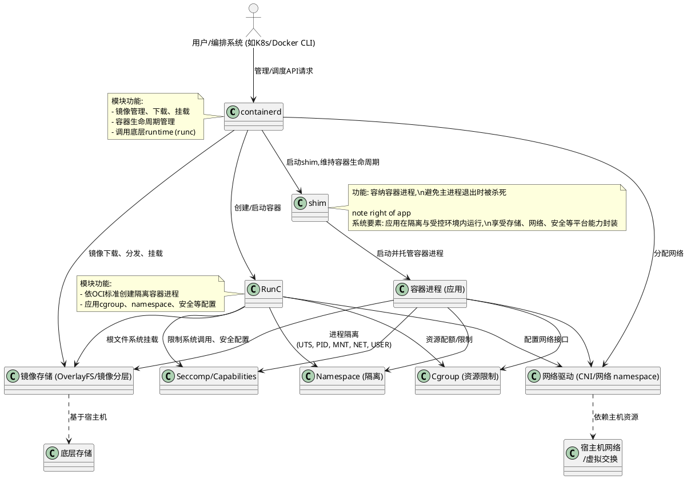
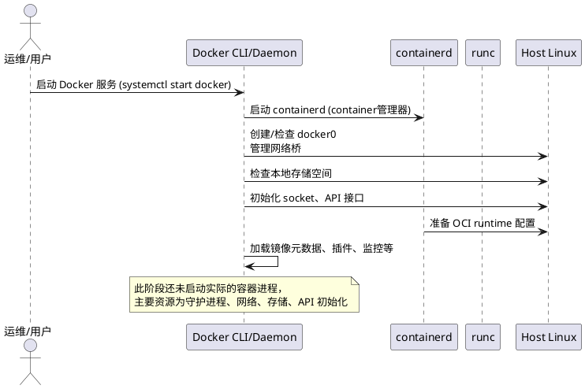
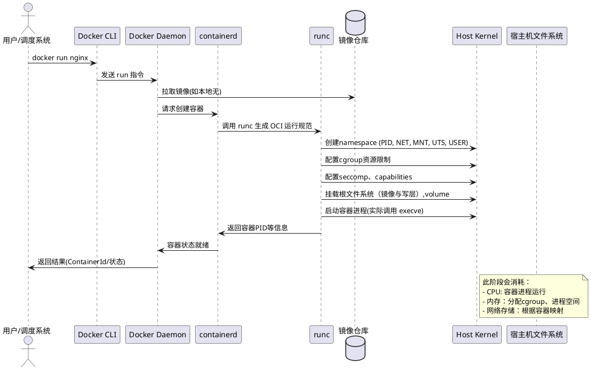
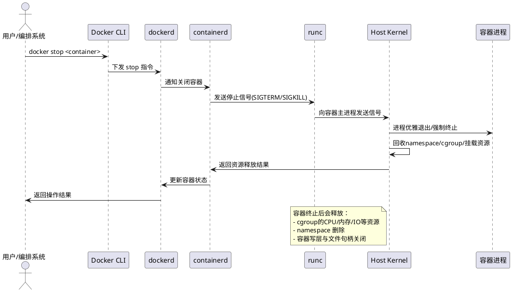

## Docker、containerd 容器实现的关键技术与功能剖析

容器技术以隔离、轻量、弹性著称，其核心原理是在同一个操作系统内核上，为不同应用提供进程级别的资源、环境隔离。Docker、containerd 是当前主流的容器引擎。以下详细拆解其落地实现中的关键技术及作用：

### 1. Namespace（命名空间）

**功能：提供进程级别的资源隔离。**  
通过 Linux Namespace，容器进程拥有独立的进程树、文件系统、网络、主机名等环境，彼此间互不可见。

- **PID Namespace**：进程号隔离，每个容器 sees 只看见自己的进程。
- **Mount Namespace**：文件系统挂载点独立，根目录、挂载卷等互不干扰。
- **Network Namespace**：网络设备和协议栈隔离，实现虚拟网络、私有IP。
- **UTS Namespace**：主机名、域名隔离。
- **IPC Namespace**：进程间通信资源隔离（如信号量/共享内存）。
- **User Namespace**：用户和权限隔离，容器内部 root 对应宿主普通用户，增强安全性。

### 2. Cgroups (Control Groups, 控制组)

**功能：进程资源的精细化限制和管理。**  
Cgroup 是 Linux 下用于限制、统计与隔离进程组使用的资源（CPU、内存、IO 等）。

- **CPU**：限制容器能占用的 CPU 时间百分比、核心数、调度公平。
- **Memory**：设置内存的最大使用量，防止过度消耗导致宿主 OOM。
- **Blkio**：控制磁盘 IO 权重/带宽限制。
- **pids**：限制进程数，防止 fork 炸弹攻击。
- **Devices**：控制容器能访问的硬件设备类型和范围。

### 3. OverlayFS（联合文件系统）

**功能：镜像的高效分层存储和复用。**  
OverlayFS 实现镜像只读与容器可写层的多层合成，通过 Copy-on-Write 技术，极大节省空间并加速启动。

- **镜像分层**：基础镜像（如OS层）与 APP 层独立复用，升级、下载更高效。
- **容器可写层**：运行态写操作仅影响顶层，销毁自动丢弃，保证镜像不可变性。
- **容器快照**：支持增量提交与回滚。

### 4. 容器网络驱动

**功能：容器间、容器与外部世界的数据通信。**  
network namespace 下, 利用虚拟交换机、网桥、veth pair 等手段提供多样网络模型。

- **bridge 模式**：容器通过虚拟网桥互联，宿主机端口映射实现外网通信。
- **host 模式**：容器直接使用宿主机网卡，无隔离加速。
- **overlay 网络**：跨主机容器通信，支持集群化的网络抽象。
- **macvlan**：虚拟网卡，容器有独立 IP。

### 5. 镜像打包与分发

**功能：应用快速移植、标准化交付。**  
按照 OCI (Open Container Initiative) 标准，镜像将应用及其环境统一封装，实现“一次打包，处处运行”。

- **多阶段构建**：减少镜像体积，提升安全性。
- **签名与认证**：防止镜像被篡改，加强供应链安全。
- **分层缓存**：大规模场景下节省网络和存储。

### 6. 容器生命周期管理（RunC、containerd、shim）

**功能：管理容器的启动、停止、暂停、监控。**  
containerd 利用 RunC（符合OCI runtime规范）具体执行容器创建与运行。

- **containerd**：负责容器的镜像管理、容器构建、分发、执行、存储及生命周期控制。
- **RunC**：进程隔离和容器运行的底层执行器（真正进入 namespace、cgroup 设定并 fork进程）。
- **shim 机制**：避免主进程退出带崩所有容器，提升容器健壮性与容错。

### 7. Seccomp、Capabilities、安全加固

**功能：系统调用白名单、能力精简，降低攻击面。**

- **Seccomp**：定义容器可用的系统调用，阻断危险操作。
- **Linux Capabilities**：只赋予进程所需最小特权。
- **rootless 容器**：支持不用 root 权限运行容器，增强安全性。

---

### 总结

Docker、containerd 以 Namespace、Cgroup 为隔离和资源配额基石，叠加高效的镜像存储、灵活网络驱动、安全加固等一揽子机制，实现了标准、高效、安全的容器管理与运行。正因这些关键技术的密切协作，现代云原生平台才能满足大规模弹性部署与自动治理的苛刻需求。

## 一、Docker 启动、运行、停止的详细资源流程（PlantUML 表示）

### 1. Docker 启动流程（plantuml）

### 2. Docker 运行容器流程（plantuml）

### 3. Docker 停止容器流程（plantuml）

---

## 二、容器底层技术源码核心实现剖析

### 1. Namespace

**核心代码**：runc/libcontainer、Linux kernel

- **创建 namespace**：通过 Linux `clone()` 系统调用的参数（如 CLONE_NEWUTS、CLONE_NEWPID 等）创建隔离空间。  
- runc/libcontainer/configs/namespaces.go 定义类型，libcontainer/process_linux.go 实际执行 clone。
- 用户空间每个 namespace 分配唯一 inode 标识，实现相互隔离。

### 2. Cgroup（资源限制与隔离）

**实现代码**：

- runc/libcontainer/cgroups 负责生成、挂载 cgroup 目录并写入限制，如 `/sys/fs/cgroup/cpu/docker/<containerid>/cpu.shares`
- 创建 cgroup 目录、写入限制，fork 子进程后将 PID 写入 `cgroup.procs`
- 支持 v1/v2，自动适配（libcontainer/cgroups/systemd/v1.go / v2.go）
- 内核Cgroup控制器驱动资源实际分配与统计

### 3. Filesystem/Overlay

**实现**：

- 镜像层用 AUFS/OverlayFS 组合（libcontainer/rootfs_unix.go）
- 启动容器时，挂载镜像只读层+容器写层，生成容器视图（mount rootfs，volume 注入）
- 停止时卸载 overlay、清理镜像挂载点

### 4. Network

**核心流程**：

- docker/libnetwork 调用 `netlink`，内核创建 veth pair，容器侧一端放入网络 namespace
- 配置 iptables 规则、Docker0/bridge 或 CNI 网络插件
- runc 在启动容器时通过 setns 切换 NET namespace，更新 /etc/resolv.conf、/etc/hosts

### 5. Capabilities/Seccomp

**关键实现**：

- libcontainer/configs/config_linux.go 设置 seccomp/capabilities
- runc 通过 prctl/install seccomp BPF 过滤规则，关闭不安全 syscall
- 设置进程 capabilities，丢弃 root 非必要能力，最小权限原则

---

### 典型主线源码入口

- **runc main流程**：runc/main.go -> createContainer -> libcontainer/container_linux.go
- **clone & namespace**: libcontainer/process_linux.go: startProcess
- **cgroup限制与回收**: libcontainer/cgroups/cgroup_manager_linux.go
- **镜像挂载/写层**: libcontainer/rootfs_linux.go: setupRootfs
- **网络配置**: libcontainer/configs/network.go, libnetwork/driver
- **安全机制**: libcontainer/seccomp, configs/capabilities.go

**总结**：  
容器 "启动-运行-停止" 涉及多内核原语配合，runc (及 containerd) 通过组合 clone/cgroup/挂载/netlink 等一系列低层 API，实现进程、资源、文件、网络等全维隔离和弹性治理，Docker 负责顶层编排与生命周期管理，支撑容器化的高弹性与资源高效利用。

---

---

## 容器产生的内在动因与底层虚拟化原理

**为什么容器技术得以问世？**  
Linux 等现代操作系统率先支持了多种“虚拟化”技术和隔离机制，使得“一个物理机可以被精细分割为多个安全、环境完全独立的小单元”。容器并非全新发明，而是组合利用了如下内核特性：

- **Namespace**：进程级别资源隔离，即使同一台主机，容器间彼此“看不见”。
- **Cgroup**：资源（CPU、内存、IO等）分组配额与监控，实现弹性管理和保护。
- **Capabilities / Seccomp**：权限与系统调用粒度限制，保障最小攻击面。
- **虚拟网络与文件系统挂载**：实现网络和持久化的按需隔离。

这些机制为“轻量级弹性虚拟计算环境”提供了坚实土壤，绕过了传统虚拟机对“全系统模拟”的冗余，极大提升了资源利用效率和启动速度。

---

## 容器底层实现过程及常见问题

**容器的实现流程，离不开以下步骤：**

1. **拉取并解包镜像**  
   获取镜像层并组合成完整的 rootfs（只读+写层叠加），准备运行环境。

2. **初始化进程隔离**  
   采用 `clone()` 或类似 API，显式指定要隔离的 namespace 类型（如PID/NET/MNT/UTS/IPC/USER）。

3. **挂载根文件系统**  
   将 rootfs mount 到新命名空间内，切换工作目录，挂载所需 volume。

4. **设置Cgroup限制**  
   创建 cgroup 目录，写入资源限制参数，将容器主进程加入对应 cgroup。

5. **配置网络与安全机制**  
   生成 veth pair、分配 IP，挂进 NET namespace，配置防火墙规则。下发 seccomp/capabilities、selinux/apparmor 策略。

6. **执行容器目标命令**  
   以隔离环境运行用户指定的 entrypoint/proc（容器内的主程序）。

**常见技术难点/问题：**

- namespace、cgroup 实现的兼容性（如 cgroup v1/v2 差异）
- 网络隔离方案与宿主机权限的问题
- 文件系统挂载点泄露、volume 权限隔离
- 用户命名空间与 rootless 容器实现的安全挑战
- 容器间通信和数据持久化难题
- 性能损耗与调优，如 overlayfs 多层级性能瓶颈

---

## 如果你想手写/实现基础容器，应掌握哪些知识？详细自实现路线

1. **操作系统内核技术基础**
   - Linux Namespace & Cgroup 调用与底层原理
   - 用户进程、clone/fork execve 流程
   - 文件系统结构、挂载机制（mount/umount/overlay）

2. **系统编程能力**
   - 掌握 C/C++/Go 等语言的系统调用接口
   - 能直接操作或封装如 setns、unshare、clone、mount、pivot_root、prctl 等 API

3. **网络与安全知识**
   - veth、网络 namespace 操作，iptables 基本运用
   - seccomp/capabilities/rbac 基础，合理收敛权限
   - 基本的SELinux/AppArmor/安全目录隔离技巧

4. **容器镜像体系**
   - 理解 rootfs 的布局、overlayfs 分层原理
   - OCI 镜像格式拆解方式

5. **进程与生命周期管理**
   - 设计并实现进程孵化、监控、回收
   - shim 机制防止主进程退出时容器进程被杀死

6. **监控与资源回收**
   - 能基于 cgroup 统计实时/历史资源消耗
   - 正确处理容器结束后副资源清理（挂载、网络、cgroup目录等）

**动手实践的基本步骤（以 Golang/C 为例）：**

1. 构建容器主进程（如 `mycontainer run <cmd>`），内部使用 clone 设置新 namespace
2. 初始化根目录（准备 own rootfs、mount proc/sys/dev 等必要系统目录）
3. 进容器后设置 hostname、挂载点（UTS、MNT namespace）
4. 手动创建/绑定 cgroup 限制目录、写入 cpu/mem 限制、将 PID 加入 cgroup
5. 配置网络（可先手动，复杂场景可写 veth 配对相关代码）
6. 以 exec 运行用户命令，并以 init/subreaper 形式监控子进程
7. 程序退出后执行收尾、资源清理（cgroup、挂载点、namespace 文件句柄等）

**深入参考：**
- 推荐阅读 [Liz Rice 的《Building a simple container in Go》](https://medium.com/@lizrice/container-from-scratch-1-namespaces-cgroups-5844f1fabe4e)，该文展示了用不到 100 行 Go 代码从 0 到 1 构造最小容器的核心流程。
- 可进一步对比 LXC、runc 等主流实现源码，了解 production 级别的完整工程实践。

---

**总结**：只有充分掌握 Linux 内核隔离/资源机制、系统编程与安全、镜像与网络原理，才能从零实现属于自己的“容器”。技术原理并不复杂，关键是理解每一步系统调用背后的分层与隔离思想。

