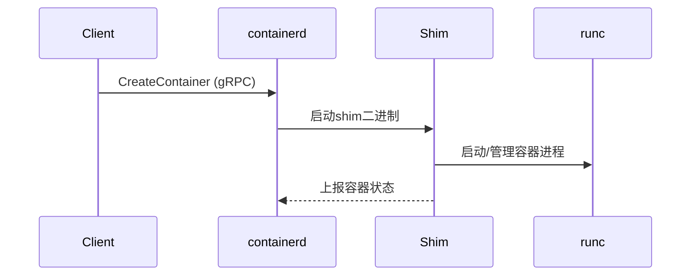

# containerd源码分析

containerd 是 CNCF 托管的高性能容器运行时，作为 Kubernetes、Docker 等平台的基础容器引擎。本文从源码层面对象核心架构、关键模块、典型调用链条等进行逐一解读，辅助云原生工程师深入理解 containerd 的原理与实现。

## 目录

- [containerd源码分析](#containerd源码分析)
  - [目录](#目录)
  - [1. containerd整体架构与设计思想](#1-containerd整体架构与设计思想)
    - [主要源码目录结构](#主要源码目录结构)
  - [2. 核心模块源码梳理](#2-核心模块源码梳理)
    - [启动主流程（cmd/containerd/main.go）](#启动主流程cmdcontainerdmaingo)
    - [gRPC API 层（api/services/）](#grpc-api-层apiservices)
  - [3. 重要数据结构与接口设计](#3-重要数据结构与接口设计)
  - [4. gRPC服务流程（API入口）](#4-grpc服务流程api入口)
  - [5. 容器生命周期管理关键流程](#5-容器生命周期管理关键流程)
  - [6. Snapshotter与镜像管理源码解读](#6-snapshotter与镜像管理源码解读)
  - [7. 与runc的集成及runtime调用链](#7-与runc的集成及runtime调用链)
  - [8. 事件、内置插件与扩展机制](#8-事件内置插件与扩展机制)
  - [9. Kubernetes CRI 集成核心入口](#9-kubernetes-cri-集成核心入口)
  - [10. 常见源码阅读问题与技巧](#10-常见源码阅读问题与技巧)
  - [结语](#结语)

---

## 1. containerd整体架构与设计思想

containerd 的整体架构体现了**模块化**、**高可扩展性**与**插件化**思想。主要分为：

- gRPC 服务层（API入口）
- Core服务（容器、镜像、快照、任务等子服务）
- 插件体系（无限扩展能力）
- Runtime集成（与runc等 OCI 兼容运行时）
- 本地服务与调度管理（Tasks、Events、Snapshotter等）


> containerd官方架构图

### 主要源码目录结构

- `cmd/containerd/`           守护进程入口(main.go)
- `api/`                     所有gRPC proto及pb实现
- `services/`                核心gRPC服务
- `runtime/`                 容器生命周期管理、shim机制等
- `snapshots/`               快照/存储
- `images/`                  镜像管理
- `pkg/` 和 `vendor/`        工具库与依赖

---

## 2. 核心模块源码梳理

### 启动主流程（cmd/containerd/main.go）

```go
func main() {
    // ...
    app := cli.NewApp()
    // ...
    if err := app.Run(os.Args); err != nil { ... }
}
```

进一步调用守护进程服务启动：

- 解析配置、加载插件
- 启动gRPC与本地API
- 初始化各子服务（container、image、task、snapshot等）

### gRPC API 层（api/services/）

containerd 的所有操作几乎都以 gRPC 形式暴露，gRPC服务由各子模块（`services/*`）注册。

如启动`container`服务：

```go
// services/container/service.go
func (s *service) Create(ctx context.Context, req *api.CreateContainerRequest) (*api.CreateContainerResponse, error) {
    // ...
}
```

---

## 3. 重要数据结构与接口设计

- **Client（pkg/client）**：外部Kubelet/Docker等通过Client发起gRPC请求
- **Container、Task、Image**：均为interface，对应实际资源操作
- **Plugin 机制**：所有核心功能均可通过插件机制注册与替换（见`plugin/`目录）

```go
type Plugin struct {
    ID   string
    Type Type
    Init InitFunc
}
```

---

## 4. gRPC服务流程（API入口）

1. 外部调用 gRPC API（如ContainerCreate）
2. 路由至 services/ 下的对应模块服务
3. 检查参数与权限，执行核心处理
4. 调用 runtime 或 snapshot、image、task 底层逻辑

---

## 5. 容器生命周期管理关键流程

典型流程示例（创建容器）：

1. gRPC CreateContainer -> services/container/service.go
2. 持久化元数据，分配ID
3. 创建 rootfs（快照/snapshotter）
4. 初始化 runtime shim 进程
5. 创建真正的容器进程（如runc create）
6. 状态追踪与事件上报

---

## 6. Snapshotter与镜像管理源码解读

- **Snapshotter（snapshots/）**：支持 overlayfs, btrfs, zfs, windows等后端驱动
- **Images（images/）**：镜像拉取、管理，支持镜像垃圾回收
- **Content（content/）**：镜像分层blob存储

---

## 7. 与runc的集成及runtime调用链

containerd 默认通过`shim`机制与runc解耦，实现“每个容器一个shim，一个shim拉起一个runc实例”——兼顾故障隔离与灵活性。



---

## 8. 事件、内置插件与扩展机制

- **事件(Event)系统**：服务间异步解耦，可订阅自定义事件
- **插件(Plugin)**：内核级功能机制；扩展新存储，runtime，网络等
- 开发自定义插件流程：实现 plugin.Plugin 接口并注册

---

## 9. Kubernetes CRI 集成核心入口

containerd 以`containerd-shim-runc-v2`+CRI Plugin 支持 Kubernetes 调用容器生命周期，核心代码在`pkg/cri/`下。

- Kubelet 通过 CRI gRPC 调用 containerd
- containerd 的 CRI Plugin 负责协议转换并实际执行核心流程

---

## 10. 常见源码阅读问题与技巧

- **如何 trace 关键调用链？**  
  建议从`cmd/containerd/main.go`出发，顺着 gRPC 服务注册，实际操作入口跟踪。
- **关注插件与模块边界**  
  插件体系是 containerd 可拓展能力的基础，关注各 Plugin 的 Init 流程。
- **ocicli、ctr 工具对调试有帮助**  
  可用 `ctr` 命令辅助理解与验证内部数据结构（如容器、镜像、快照等）。

---

## 结语

containerd 作为云原生容器运行时的核心组件，源码条理清晰、架构高度解耦，适合二次开发与深度运维。建议结合官方文档、架构图、实际调试配合源码跟踪，多维度深入理解 containerd 的原理与实现。

参考资料：

- [containerd 官方Repo & 文档](https://github.com/containerd/containerd)
- [containerd/Architecture](https://containerd.io/docs/architecture/)
- [Kubernetes docs: CRI integration](https://kubernetes.io/docs/concepts/containers/runtime-class/)
- [深入剖析containerd源代码（极客时间）](https://time.geekbang.org/column/intro/100076601)
- [阿里云云原生资料](https://developer.aliyun.com/around/container)

如有补充问题，欢迎留言讨论！
