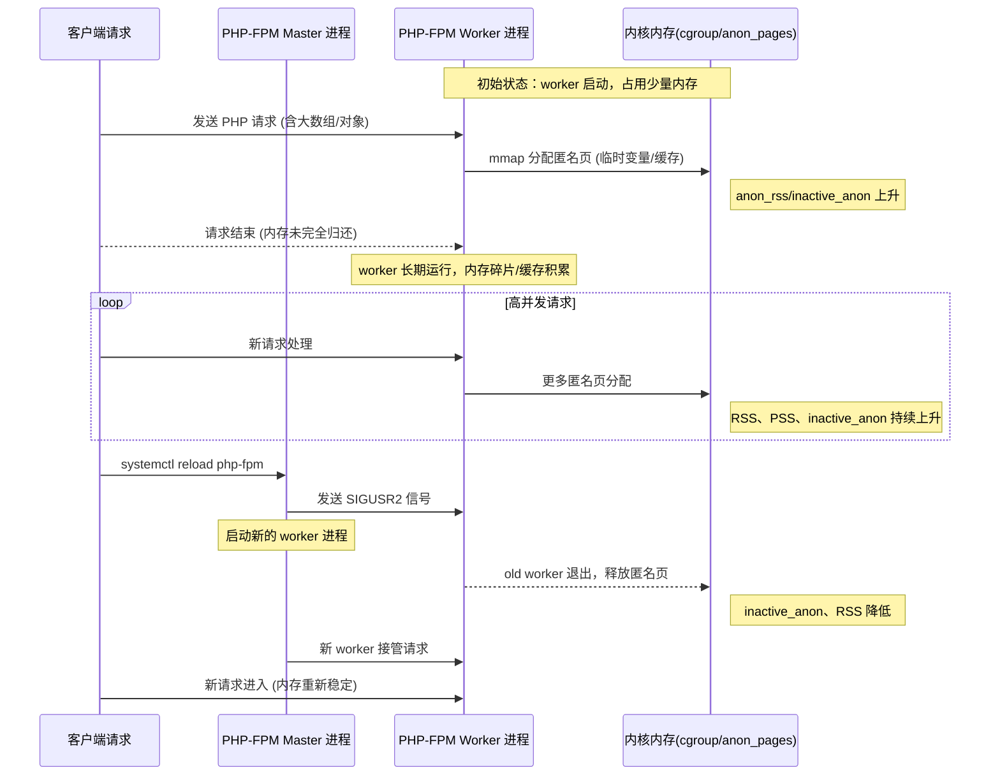
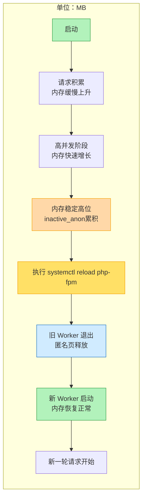
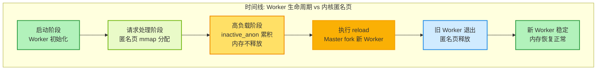
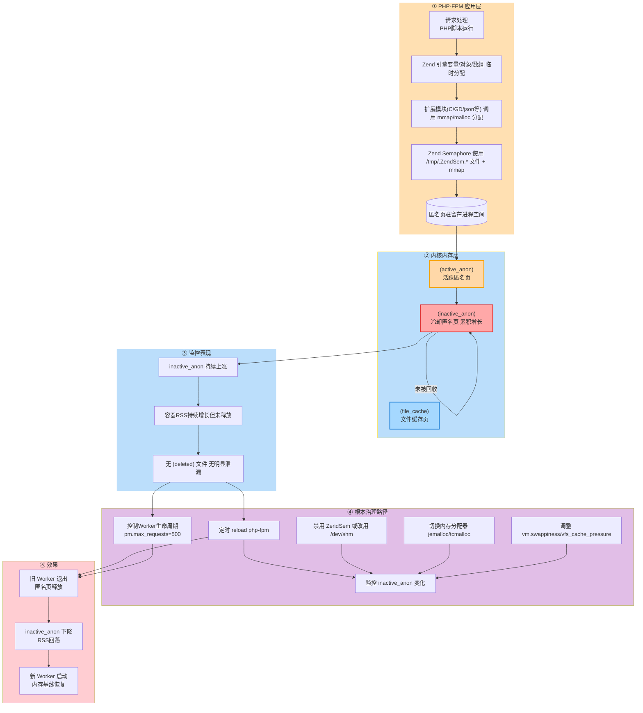
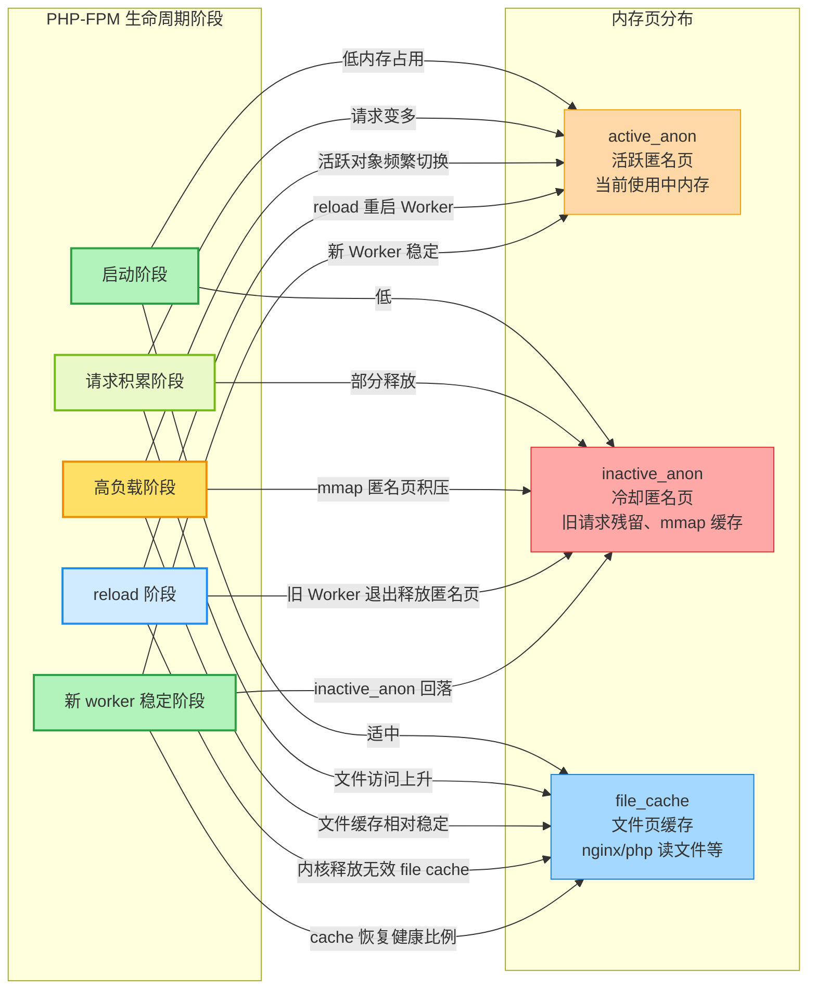

# 内存故障诊断分析指南

本文档主要梳理 Linux 系统中常见的内存问题类型、分析定位思路以及实用命令和案例，帮助 SRE/运维/开发工程师在生产环境高效定位和解决内存相关故障。

---

## 一、常见内存故障类型

1. **内存泄漏（Memory Leak）**
   - 应用程序未正确释放内存，导致可用内存逐渐减少。
2. **异常占用高（High Memory Usage）**
   - 某进程或集群进程短时间内占用大量内存，影响系统稳定性。
3. **OOM 杀死（Out-Of-Memory Kill）**
   - 物理内存耗尽，内核触发 OOM Killer，强制杀死消耗大量内存的进程。
4. **内存碎片化（Fragmentation）**
   - 虚拟内存分配/释放频繁，导致实际可用大块内存减少。
5. **Swap 频繁（频繁换页）**
   - 内存不够用导致频繁使用交换分区，影响性能。
6. **Page Cache 占用过高**
   - 系统缓存未及时回收，影响应用可用内存。

---

## 二、内存指标与常用命令

### 1. 查看系统内存使用

```bash
free -m           # 简要查看剩余与已用内存
cat /proc/meminfo # 查看内存详细分布信息
top               # 动态查看各进程内存占用
htop              # 彩色增强版 top
```

### 2. 查看进程内存占用排名

```bash
ps aux --sort=-%mem | head -20           # 占用内存最多的前20进程
smem -r | sort -k 4 -nr | head -20       # 更精细的内存统计工具
pmap <pid>                               # 显示进程内存分布
```

### 3. 排查 OOM 问题

```bash
dmesg | grep -i "kill"         # 查找 OOM kill 日志
journalctl -k | grep -i oom    # systemd 系统查找内核 OOM 日志
tail -n 100 /var/log/messages  # 传统日志方式查找 OOM 日志
```

### 4. Swap 使用分析

```bash
free -m | grep Swap
vmstat 1 5         # 关注 si/so 字段，swap in/out 频率
swapon -s          # 查看 swap 设备和使用情况
```

### 5. 内存泄漏排查

- 定位疑似泄漏进程后可用如下工具定位
  - `pmap <pid>`
  - `lsof -p <pid>`
  - `valgrind --tool=memcheck <app>`（建议测试环境用）
  - `gdb attach <pid>` + `info proc mappings`

---

## 三、常见排查流程

### 1. OOM 类故障

- Step 1: 查看 OOM 日志确定被杀死对象
- Step 2: 分析被 kill 进程的最近日志，确定异常前因
- Step 3: `top/htop` 排查剩余进程内存使用情况
- Step 4: 回溯代码逻辑/资源申请异常

### 2. 内存泄漏

- Step 1: `top`/`htop` 定位持续增长进程
- Step 2: 结合 `smem/pmap` 确认堆外还是堆内溢出
- Step 3: 导出 heap dump (`gcore`/应用自带机制)
- Step 4: 分析内存快照，查找未释放或引用异常对象

### 3. Page cache/swap 问题

- Step 1: `free -m` 关注 buffers/cache/swap
- Step 2: `echo 1 > /proc/sys/vm/drop_caches` 清理缓存（需审慎）
- Step 3: 优化内核参数，合理配置 swap

---

## 四、内存优化建议

- 合理设置内存限额（如 Java -Xmx, 容器 limits）
- 使用 jemalloc/tcmalloc 等更优分配器
- 修复代码内存泄漏
- 开启 OOM 调整（oom_score_adj 机制）
- 线上排查建议借助监控（Prometheus/node_exporter/grafana）

---

## 五、常见案例参考

### 案例1：应用内存泄漏导致 OOM

1. 业务报警发现接口响应慢，top 查发现主进程 RES 不断增长，且无及时回收。
2. dmesg 发现若干次 oom-killer 日志，均为主进程被杀。
3. 启用 heap dump，发现在处理某类型消息时不断分配/引用导致指针未释放。
4. 修复业务代码逻辑，部署后问题消除。

### 案例2：缓存类进程 page cache 过高

1. free -m 发现 used 增长过快，buffers/cache 区段占用主内存
2. 检查业务策略，调整缓存使用阈值或定期清理机制
3. 优化后有效降低内存占用峰值

---

## 常见工具推荐与资料

- [Linux Performance Analysis in 60s (中文版)](http://www.brendangregg.com/blog/2014-11-20/linux-perf-tools-60s.html)
- `sysstat`、`smem`、`valgrind`、`perf`、`bcc/bpftrace`、`malloc_trim`
- 《性能之巅》、《现代操作系统》、《深入理解 Linux 内核》

如有特殊问题建议结合具体业务与代码，联系 SRE/开发团队联合分析。

---

## 附：系统、应用、容器“三者缓存”理解简述

在实际内存故障排查中，需注意“缓存”含义在不同层级的差异：

### 1. 操作系统（System）缓存

- 主要指 Page cache、dentry、inode 等内核缓冲区。
- 通过 `free -m`、`cat /proc/meminfo` 关注 `buffers` 和 `cached` 字段。
- 系统缓存可被 drop cache 清理，但通常无需频繁手动操作。

### 2. 应用（Application）缓存

- 程序主动维护的对象缓存或内存池，例如 Java 的堆内 LRU 缓存、Go 的 sync.Pool、数据库 buffer pool 等。
- 占用在进程空间，“释放”需要代码层面清理或 GC 回收，不属于内核级别缓存。
- 运维/排查时需与开发协作具体定位。

### 3. 容器（Container）缓存

- 指容器内进程使用的缓存，但容器运行仍受宿主机内核 Page cache 控制。
- 容器平台（如 Docker、Kubernetes）限制进程可用内存（cgroup），但 page cache 共享宿主，释放机制与物理主机无异。
- “容器内存泄漏”常见为容器内进程内存超限(OOMKilled)，需区分是应用缓存未控还是系统 page cache 膨胀。

**小结：**  
排查内存相关问题时，要区分是 OS 层面（page cache）、应用自身维护的缓存，还是由于容器资源隔离导致的内存受限。分析来源和归属，有助于定位症结并制定有针对性的优化方案。


cgroupv1
cat /sys/fs/cgroup/memory/memory.stat

cache 3224702976
rss 2389835776
rss_huge 562036736
shmem 237355008
mapped_file 194641920
dirty 0
writeback 0
swap 0
workingset_refault_anon 0
workingset_refault_file 6623232
workingset_activate_anon 0
workingset_activate_file 675840
workingset_restore_anon 0
workingset_restore_file 0
workingset_nodereclaim 0
pgpgin 869437272
pgpgout 868209481
pgfault 898642503
pgmajfault 0
inactive_anon 2438934528
active_anon 196939776
inactive_file 2374172672
active_file 612716544
unevictable 0
hierarchical_memory_limit 6291456000
hierarchical_memsw_limit 6291456000
total_cache 3224702976
total_rss 2389835776
total_rss_huge 562036736
total_shmem 237355008
total_mapped_file 194641920
total_dirty 0
total_writeback 0
total_swap 0
total_workingset_refault_anon 0
total_workingset_refault_file 6623232
total_workingset_activate_anon 0
total_workingset_activate_file 675840
total_workingset_restore_anon 0
total_workingset_restore_file 0
total_workingset_nodereclaim 0
total_pgpgin 869437272
total_pgpgout 868209481
total_pgfault 898642503
total_pgmajfault 0
total_inactive_anon 2438934528
total_active_anon 196939776
total_inactive_file 2374172672
total_active_file 612716544
total_unevictable 0

根据上述 cgroup 的内存统计信息，整体分析如下：

1. **内存使用情况**
   - `hierarchical_memory_limit 6291456000` 表示 cgroup 配置的内存上限为约 6GB。
   - `total_rss 2389835776`（约 2.2GB）为进程实际物理内存使用（不包括 cache 和 swap），RSS为常驻内存页。
   - `total_cache 3224702976`（约 3GB）为用于缓存的页面，包括 file cache，说明磁盘IO有较多缓存提升性能。
   - `total_shmem 237355008`（约 226MB）为共享内存部分。

2. **Swap 使用**
   - `swap 0` 和 `total_swap 0`，说明当前未发生 swap，系统未将内存页换出到交换分区，整体压力可控。

3. **Hugepage 使用**
   - `total_rss_huge 562036736`（约 536MB），说明有部分内存以 hugepage 方式分配，用于提升大块内存访问性能，常见于 JVM/数据库等场景。

4. **匿名和文件缓存**
   - `total_inactive_anon 2438934528`（约 2.27GB）：未活跃匿名页（如进程数据段/堆）较多，大体与总 rss 接近。
   - `total_inactive_file 2374172672`、`total_active_file 612716544`：大量文件页处于非活跃状态，可能曾用于文件IO，目前未被访问但未被回收。

5. **页面读写与缺页统计**
   - `total_pgpgin 869437272`、`total_pgpgout 868209481`：表示内存页的读入/写出累计次数，读写较为频繁。
   - `total_pgfault 898642503`、`total_pgmajfault 0`：页缺失发生较多，但绝大多数为 minor fault（在内存页缓存中可即时分配），没有 major fault（即没有严重缺页）。

6. **其他**
   - `unevictable 0`：表示没有不可回收的页。
   - `total_unevictable 0`：同样说明没有内存被锁定（mlock）。

**结论及建议：**
- 当前 cgroup 物理内存总消耗约为 RSS 2.2GB + Cache 3GB ~= 5.2GB，接近 6GB 限制，但还有一定余量。
- Swap 未发生，系统整体流畅无内存回收压力，无明显 OOM 风险。
- 若需释放更多可用内存，可以通过 `echo 3 > /proc/sys/vm/drop_caches` 手动回收 file cache。
- 建议持续关注 inactive 匿名页和 file 页的增长，若发现缓存持续增长导致真实业务内存不足，应优化应用占用或调整 cgroup 限制。
- Hugepage 使用占比适中，若业务对大页依赖度高，可以考虑预留适量 hugepage 配置。

整体来看，该 cgroup 内存使用健康，无明显内存泄漏或异常，可根据实际业务压力滚动优化。














> **注意：**`inactive_anon`（冷却匿名页，如旧请求残留或 mmap 匿名缓存）不会被 `drop_caches` (即通过 `echo 1 > /proc/sys/vm/drop_caches` 等方式) 直接清理。其占用的内存通常只能通过如下手段释放：
>
> 1. **程序自身优化**：如修复内存泄漏、及时释放无用对象。
> 2. **容器/进程内存限制**：配置合理的内存上限，促使应用主动释放资源或通过 OOM 被重启。
> 3. **重启进程**：直接重启 PHP-FPM/nginx/应用程序进程，旧匿名页会被内核回收。
>
> 因此，当系统中 `inactive_anon` 长期处于高位且可用内存急剧下降时，仅靠 `drop_caches` 不会改善，需要关注应用自身的内存管理逻辑。


1. php-fpm进程刷新周期长，导致内存回收不及时，需要优化php-fpm配置，减少进程刷新周期，加快内存回收速度。
2. php-fpm进程数过多，导致内存占用过高，需要优化php-fpm配置，减少进程数，降低内存占用。
3. php-fpm max-requests配置过大，导致内存占用过高，需要优化php-fpm配置，增大max-requests参数，提高内存回收速度。

“大量 mmap 匿名映射未释放” 是典型导致 inactive_anon 持续上涨 的原因，尤其在长时间运行的服务（PHP-FPM、Java、C/C++ 守护进程）中常见。


### 进程级

**优化代码释放**

* PHP：设置 max_execution_time、request_terminate_timeout，避免长请求关闭或限制 Zend Shared Memory / Semaphore 映射数量

* C/C++：确保 munmap 对应 mmap

* Java：避免大量直接内存 ByteBuffer 未释放

**内存限制 + OOM 防护**

* Docker / Kubernetes：设置 memory limit，防止内存无限增长

* Kubelet 驱逐策略：高匿名页进程会被回收

* 周期性重启或热回收

* PHP-FPM：pm.max_requests 设置合理值

* Java：触发 GC 并释放 Direct ByteBuffer

### 系统级

tmpfs / shm 配置合理，避免 mmap 匿名页映射到 tmpfs 过大

避免频繁 drop_caches 清理匿名页（无效）

### 💡 总结：

匿名 mmap 不会自动被 drop_caches 回收
诊断：smaps、pmap、lsof
分析：找出长时间持有映射的进程或对象
处理：优化代码释放、设置内存限制、周期性重启


## 六、高并发场景下 Socket 未及时释放导致 OOM 问题

### 问题描述

在高并发网络服务中（如 PHP-FPM、Nginx、Node.js、Go 服务等），若 socket 连接未及时关闭或存在连接泄漏，会导致：

1. **文件描述符（FD）泄漏**：大量 CLOSE_WAIT / ESTABLISHED 状态连接堆积
2. **内核网络缓冲区占用**：每个 socket 关联的 recv/send buffer 占用内存
3. **inactive_anon 增长**：匿名页用于存储连接状态、buffer 等数据结构
4. **inactive_file 增长**：socket 关联的 inode、dentry 缓存未释放
5. **最终触发 OOM**：可用内存耗尽，内核 OOM Killer 强制杀死进程

---

### 典型现象

# 1. 大量 CLOSE_WAIT / TIME_WAIT 连接
netstat -antp | grep CLOSE_WAIT | wc -l   # 数量异常增长

# 2. 文件描述符数接近上限
lsof -p <pid> | wc -l                      # 接近 ulimit -n 值

# 3. cgroup 内存统计异常
cat /sys/fs/cgroup/memory/memory.stat
# inactive_anon 和 inactive_file 同时持续上涨
# total_rss 接近 hierarchical_memory_limit

# 4. 内核日志 OOM
dmesg | grep -i "out of memory"
journalctl -k | grep -i oom

---

### 排查流程

#### Step 1: 确认连接状态分布

# 查看各状态连接数量
ss -ant | awk '{print $1}' | sort | uniq -c

# 找出占用连接最多的进程
lsof -i -P -n | grep ESTABLISHED | awk '{print $2}' | sort | uniq -c | sort -rn | head -10

# 查看进程打开的 socket 详情
lsof -p <pid> | grep sock

#### Step 2: 分析 socket 内存占用

# 查看 socket buffer 配置
sysctl net.ipv4.tcp_rmem
sysctl net.ipv4.tcp_wmem

# 查看当前 socket 内存使用
cat /proc/net/sockstat
# TCP: inuse 5000 orphan 200 tw 3000 alloc 5500 mem 1200

# 查看进程内存映射
pmap -x <pid> | grep sock
smem -p <pid> -k

#### Step 3: 追踪连接泄漏点

# 使用 strace 追踪 socket 操作
strace -p <pid> -e trace=socket,connect,close -f

# 使用 bpftrace 统计未关闭 socket（需要 eBPF 支持）
bpftrace -e 'tracepoint:syscalls:sys_enter_socket { @[comm] = count(); }'
bpftrace -e 'tracepoint:syscalls:sys_enter_close { @[comm] = count(); }'

# 对比 socket() 和 close() 调用次数差异

#### Step 4: 检查应用层代码

- **PHP-FPM**：检查 curl、file_get_contents、mysql_connect 等网络调用是否正确关闭
- **Node.js**：检查 http.request、net.Socket 是否监听 close/error 事件
- **Go**：检查 http.Client、net.Conn 的 defer conn.Close()
- **Java**：检查 Socket、HttpClient 的 finally 块或 try-with-resources

---

### 解决方案

#### 1. 应用层优化

# PHP-FPM 配置优化
pm = dynamic
pm.max_children = 50
pm.max_requests = 500          # 限制单个 worker 处理请求数，强制回收
request_terminate_timeout = 30s # 超时强制终止

# 代码层面确保连接关闭
// PHP 示例
$ch = curl_init();
curl_setopt($ch, CURLOPT_TIMEOUT, 5);
$result = curl_exec($ch);
curl_close($ch);  // 必须显式关闭

// Go 示例
defer resp.Body.Close()
defer conn.Close()

#### 2. 系统层优化

# 调整 socket 超时参数
sysctl -w net.ipv4.tcp_keepalive_time=600
sysctl -w net.ipv4.tcp_fin_timeout=30
sysctl -w net.ipv4.tcp_tw_reuse=1

# 增加文件描述符限制
ulimit -n 65535
# 永久配置 /etc/security/limits.conf
* soft nofile 65535
* hard nofile 65535

# 定期清理 TIME_WAIT 连接（慎用）
# echo 1 > /proc/sys/net/ipv4/tcp_tw_recycle  # 内核 4.12+ 已移除

#### 3. 容器层优化

# Kubernetes Pod 资源限制
resources:
  limits:
    memory: "4Gi"
  requests:
    memory: "2Gi"

# 配置 liveness/readiness probe
livenessProbe:
  httpGet:
    path: /health
    port: 8080
  initialDelaySeconds: 30
  periodSeconds: 10
  timeoutSeconds: 5
  failureThreshold: 3  # 3 次失败后重启 Pod，释放泄漏资源

#### 4. 监控告警

# Prometheus 监控指标
node_sockstat_TCP_inuse          # TCP 连接数
node_sockstat_TCP_orphan         # 孤儿连接数
node_filefd_allocated            # 已分配文件描述符
container_memory_working_set_bytes  # 容器内存使用

# 告警规则示例
- alert: HighSocketUsage
  expr: node_sockstat_TCP_inuse > 5000
  for: 5m
  annotations:
    summary: "Socket 连接数过高"
    
- alert: HighInactiveAnon
  expr: container_memory_working_set_bytes{name="php-fpm"} > 3GB
  for: 10m
  annotations:
    summary: "inactive_anon 内存持续增长"

---

### 典型案例

**案例：PHP-FPM 高并发下 socket 泄漏导致 OOM**

1. **现象**：业务高峰期 PHP-FPM 容器频繁 OOMKilled，inactive_anon 和 inactive_file 同时暴涨
2. **排查**：
   - `lsof -p <php-fpm-pid>` 发现大量 `sock` 类型文件描述符未关闭
   - `netstat -antp | grep <port>` 发现数千个 CLOSE_WAIT 连接
   - 代码审查发现 `curl_multi_exec()` 未正确调用 `curl_multi_remove_handle()` 和 `curl_close()`
3. **修复**：
   - 补充 `curl_close()` 调用
   - 设置 `pm.max_requests=300` 强制回收 worker
   - 添加监控告警 `node_sockstat_TCP_orphan`
4. **效果**：内存占用下降 40%，OOM 问题消失

---

### 关键要点总结

| 层级 | 问题表现 | 排查工具 | 解决方向 |
|------|---------|---------|---------|
| **应用层** | 连接未关闭、异常处理缺失 | `strace`、`lsof`、代码审查 | 补充 `close()`、设置超时、异常捕获 |
| **系统层** | FD 耗尽、TIME_WAIT 堆积 | `netstat`、`ss`、`/proc/net/sockstat` | 调整内核参数、增加 ulimit |
| **容器层** | 内存 cgroup 超限、OOMKilled | `cgroup memory.stat`、Prometheus | 设置合理 limit、配置探针重启 |
| **监控层** | inactive_anon/file 异常增长 | `node_exporter`、Grafana | 建立阈值告警、定期巡检 |

**核心原则**：
- Socket 必须配对 `open()`/`close()` 或等效操作
- 高并发场景下设置连接池、限流、超时机制
- 通过监控 + 定期重启兜底，防止长期运行导致资源泄漏累积
- inactive_anon/inactive_file 同时增长时，优先排查网络连接和文件句柄泄漏

---


## 七、系统、容器、应用三者内存管理机制对比

在实际故障排查中，理解系统、容器、应用三个层级的内存管理差异至关重要。以下从内存分配、回收策略、度量指标等维度进行对比分析。

---

### 1. 三者内存创建与回收策略对比

| 维度 | 操作系统（System） | 容器（Container） | 应用（Application） |
|------|-------------------|------------------|-------------------|
| **内存分配** | 内核通过 `page allocator` 分配物理页，维护 buddy system、slab cache | 继承宿主机内核分配机制，通过 cgroup 限制可用内存范围 | 通过 `malloc()`/`mmap()` 等系统调用向内核申请虚拟内存，由语言运行时管理 |
| **缓存机制** | Page Cache（文件缓存）、Buffer Cache、Dentry/Inode Cache | **共享宿主 Page Cache**，无独立文件缓存隔离 | 应用层缓存（如 Redis、JVM Heap、Go sync.Pool），不受内核自动回收 |
| **回收策略** | kswapd 内核线程定期扫描 LRU 队列，回收 inactive pages | **被动回收**：达到 cgroup limit 时触发内存回收（memory.limit_in_bytes），优先回收 inactive_file | **主动回收**：依赖 GC（Java/Go）、手动 `free()`（C/C++）、引用计数（Python），不由内核自动回收 |
| **内存压力** | 全局内存压力触发 OOM Killer | 容器内存压力触发 cgroup OOM（仅杀死容器内进程） | 应用内存压力触发 GC Full GC、Swap 或应用崩溃 |
| **交换分区** | 系统级 Swap，受 `vm.swappiness` 控制 | 容器可配置 `memory.memsw.limit_in_bytes`（memory+swap 总限制） | 应用无法直接控制 Swap，但频繁换页会严重影响性能 |

---

### 2. 容器 WSS 与 RSS 的区别

#### WSS（Working Set Size）

**定义**：容器实际使用的**活跃内存**集合，即当前时间窗口内被访问的内存页集合。

**计算方式**：
# Kubernetes 中 WSS 定义
WSS = total_inactive_anon + total_active_anon + total_inactive_file + total_active_file
# 或简化为
WSS = memory.usage_in_bytes - memory.stat[total_cache]

**特点**：
- **动态变化**：随业务负载实时波动
- **包含匿名页和文件页**：既包括进程堆栈（anon），也包括 mmap 文件映射（file）
- **Kubernetes 使用 WSS 判断驱逐**：`kubelet` 通过 `memory.working_set_bytes` 触发 Pod 驱逐

#### RSS（Resident Set Size）

**定义**：进程**常驻物理内存**的大小，即映射到物理 RAM 的虚拟内存页总和。

**计算方式**：
# cgroup v1
cat /sys/fs/cgroup/memory/memory.stat | grep total_rss

# 进程级 RSS
ps aux | awk '{print $6, $11}' | sort -rn | head

**特点**：
- **仅包含匿名页**：不包括 Page Cache 等可回收内存
- **静态快照**：表示某一时刻的物理内存占用
- **不包括 Swap**：已换出的页面不计入 RSS

---

### 3. WSS vs RSS 对比表

| 指标 | WSS（Working Set Size） | RSS（Resident Set Size） |
|------|------------------------|-------------------------|
| **定义** | 活跃内存工作集（包含匿名页 + 部分文件页） | 常驻物理内存（仅匿名页） |
| **计算公式** | `active_anon + inactive_anon + active_file + inactive_file` | `total_rss`（匿名页映射到物理内存的大小） |
| **是否包含文件缓存** | **是**（包括 mmap 文件页、Page Cache） | **否**（仅进程数据段、堆、栈） |
| **Kubernetes 使用场景** | **驱逐依据**：`memory.working_set_bytes` 超限触发 Pod Eviction | 监控指标，但不作为驱逐判断标准 |
| **回收难度** | 文件页可快速回收（drop_caches），匿名页需进程释放或 Swap | 匿名页难回收，必须进程主动释放或 OOM Kill |
| **典型值** | 通常 **WSS > RSS**（因包含文件缓存） | 通常 **RSS < WSS** |

---

### 4. 实际场景案例对比

#### 场景 1：PHP-FPM 容器内存增长分析

**现象**：
# cgroup memory.stat
total_rss 2389835776          # ~2.2GB（匿名页）
total_cache 3224702976        # ~3GB（文件缓存）
total_inactive_anon 2438934528  # ~2.27GB（冷却匿名页）
total_active_file 612716544   # ~584MB（活跃文件页）

**分析**：
- **WSS ≈ 2.2GB（anon）+ 3GB（cache）= 5.2GB**
- **RSS ≈ 2.2GB**（仅匿名页）
- **问题根因**：`inactive_anon` 高达 2.27GB，说明旧 PHP-FPM Worker 未及时退出，匿名页（mmap、堆对象）未释放
- **治理方向**：设置 `pm.max_requests=300`，强制 Worker 定期重启释放匿名页

---

#### 场景 2：Java 应用 OOMKilled 但 RSS 不高

**现象**：
# Kubernetes 事件
Reason: OOMKilled
Last State: Terminated
  Exit Code: 137

# 容器监控
container_memory_working_set_bytes: 3.8GB（接近 limit 4GB）
container_memory_rss: 1.2GB

**分析**：
- **WSS 高但 RSS 低**：大量 Page Cache（文件缓存）占用，如日志文件、JAR 包映射
- **Kubernetes 驱逐判断**：基于 WSS 而非 RSS，虽然 RSS 仅 1.2GB，但 WSS 已超限
- **治理方向**：
  - 清理不必要的文件缓存：`echo 3 > /proc/sys/vm/drop_caches`
  - 优化应用减少文件 IO：如日志直接输出到 stdout，避免大量磁盘写入
  - 调整 JVM 参数：`-Xmx2g` 限制堆内存，为系统缓存预留空间

---

### 5. 监控与排查命令对比

| 目标 | 系统级 | 容器级（cgroup v1） | 容器级（cgroup v2） | 应用级 |
|------|-------|-------------------|-------------------|--------|
| **查看总内存** | `free -m` | `cat /sys/fs/cgroup/memory/memory.limit_in_bytes` | `cat /sys/fs/cgroup/memory.max` | - |
| **查看 RSS** | `ps aux --sort=-%mem` | `cat /sys/fs/cgroup/memory/memory.stat \| grep total_rss` | `cat /sys/fs/cgroup/memory.stat` | `jmap -heap <pid>`（Java） |
| **查看 WSS** | - | `memory.usage_in_bytes - total_cache` | `memory.current - inactive_file` | - |
| **查看缓存** | `cat /proc/meminfo \| grep -i cache` | `cat /sys/fs/cgroup/memory/memory.stat \| grep total_cache` | `cat /sys/fs/cgroup/memory.stat` | - |
| **强制回收** | `echo 3 > /proc/sys/vm/drop_caches` | **无效**（匿名页不受影响） | **无效** | 应用层 GC 或重启 |

---

### 6. 核心总结

#### 关键差异点

1. **系统内存**：全局视角，内核自动管理 Page Cache、Swap、OOM Killer
2. **容器内存**：**隔离视角**，继承宿主内核机制，但通过 cgroup 限制资源，驱逐基于 **WSS**
3. **应用内存**：**进程视角**，依赖语言运行时（GC/手动释放），无法被内核自动回收

#### 常见误区

| 误区 | 事实 |
|------|------|
| 容器有独立的 Page Cache | **错误**：容器共享宿主 Page Cache，`drop_caches` 是全局操作 |
| RSS 高就会 OOM | **不一定**：Kubernetes 驱逐看 WSS，RSS 高但 WSS 低可能不被杀 |
| 应用内存可以被内核自动回收 | **错误**：匿名页（anon）必须进程主动释放或 OOM Kill |
| 容器 limit 等于可用内存 | **错误**：limit 包含 Page Cache，实际可用需减去系统缓存 |

#### 最佳实践

1. **监控 WSS 而非仅看 RSS**：避免因文件缓存膨胀导致意外 OOMKilled
2. **应用层主动释放**：定期重启服务（如 PHP-FPM `pm.max_requests`）、触发 GC
3. **合理配置 limit**：预留 20%-30% 空间给 Page Cache 和系统开销
4. **区分内存类型**：排查时分别关注 `active_anon`、`inactive_anon`、`active_file`、`inactive_file`
5. **容器化改造**：避免应用内部缓存过大，优先使用外部缓存服务（Redis、Memcached）

---

### 7. 快速诊断决策树

内存问题
├─ RSS 高？
│  ├─ 是 → 应用内存泄漏（排查堆、栈、mmap 匿名页）
│  └─ 否 → 继续
├─ WSS 高？
│  ├─ 是 → 检查 Page Cache（total_cache）
│  │  ├─ cache 高 → 文件 IO 频繁，优化应用或清理缓存
│  │  └─ cache 低 → 匿名页泄漏（inactive_anon），重启服务或优化代码
│  └─ 否 → 系统整体内存不足，扩容或优化资源分配
└─ OOMKilled？
   ├─ WSS 接近 limit → 正常驱逐，调整 limit 或优化应用
   └─ WSS 远低于 limit → 检查节点整体内存压力或 cgroup 配置错误

---
