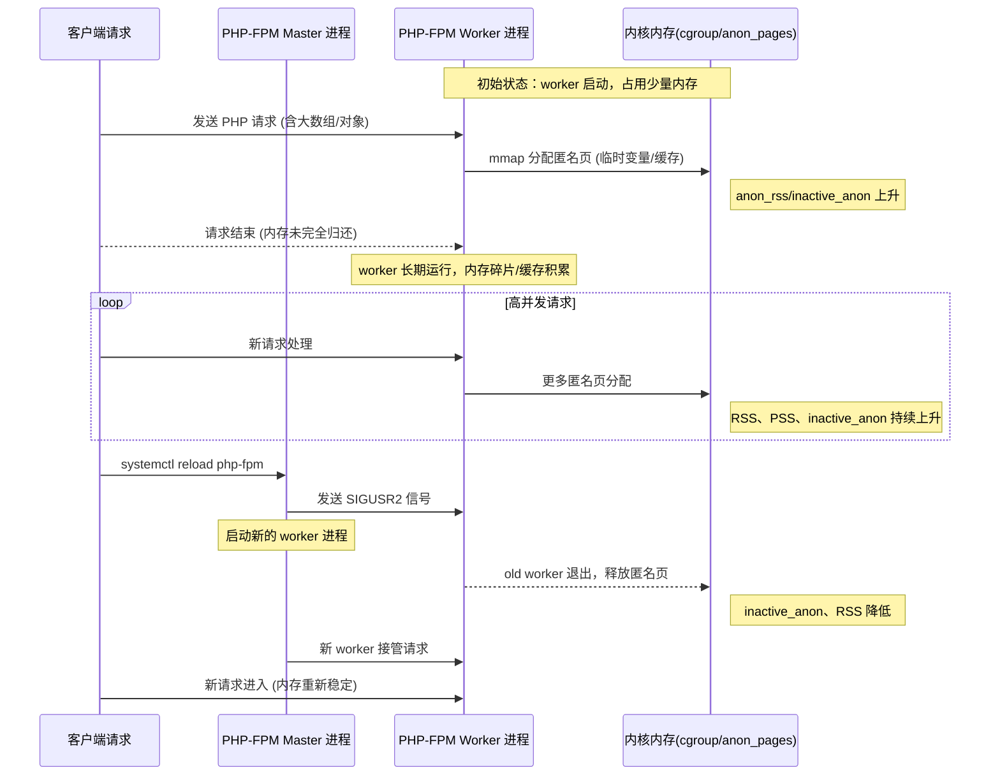
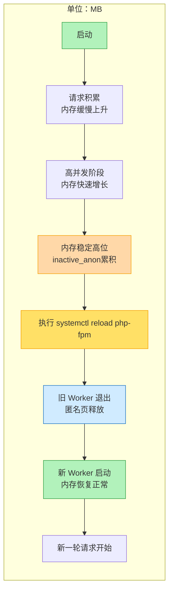
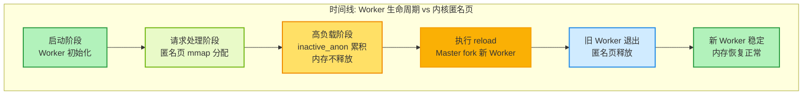
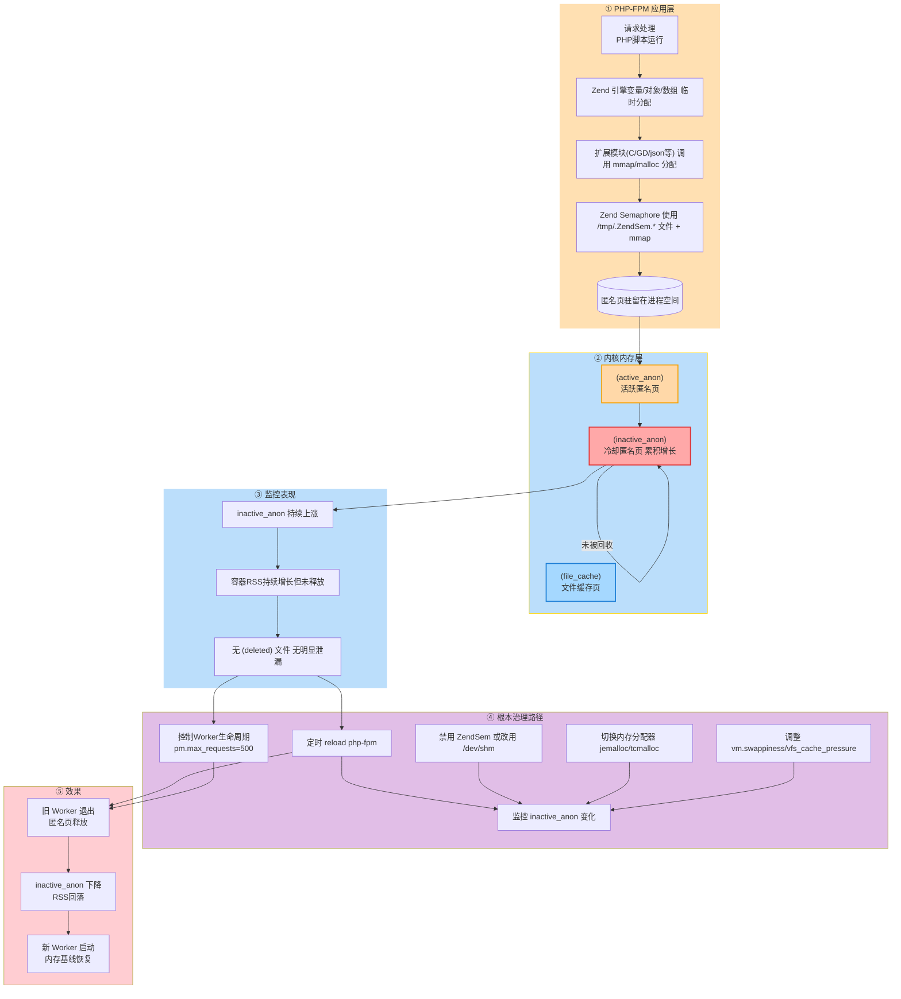
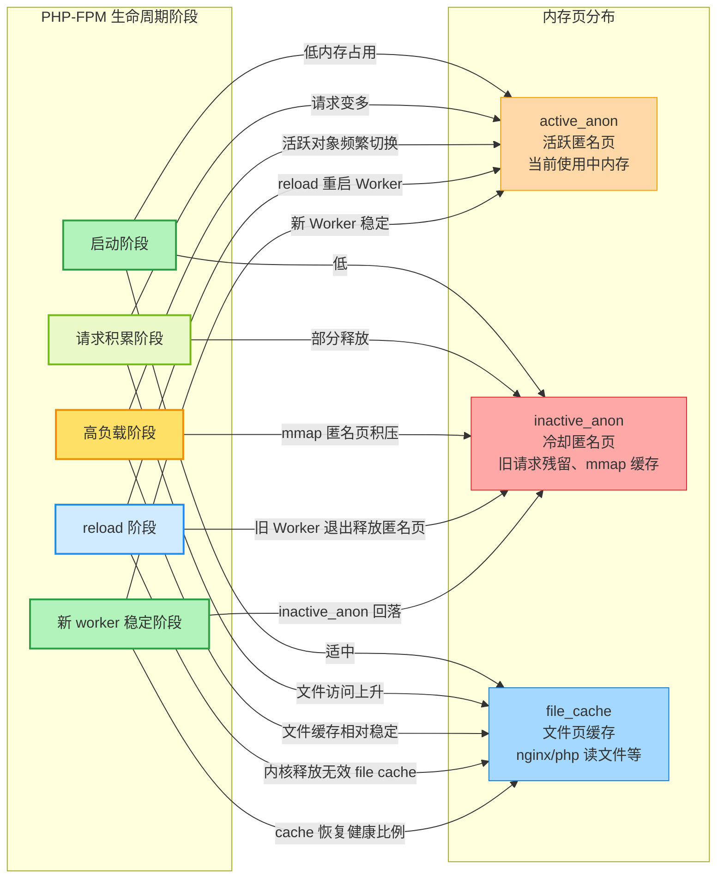

# 内存故障诊断分析指南

本文档主要梳理 Linux 系统中常见的内存问题类型、分析定位思路以及实用命令和案例，帮助 SRE/运维/开发工程师在生产环境高效定位和解决内存相关故障。

---

## 一、常见内存故障类型

1. **内存泄漏（Memory Leak）**
   - 应用程序未正确释放内存，导致可用内存逐渐减少。
2. **异常占用高（High Memory Usage）**
   - 某进程或集群进程短时间内占用大量内存，影响系统稳定性。
3. **OOM 杀死（Out-Of-Memory Kill）**
   - 物理内存耗尽，内核触发 OOM Killer，强制杀死消耗大量内存的进程。
4. **内存碎片化（Fragmentation）**
   - 虚拟内存分配/释放频繁，导致实际可用大块内存减少。
5. **Swap 频繁（频繁换页）**
   - 内存不够用导致频繁使用交换分区，影响性能。
6. **Page Cache 占用过高**
   - 系统缓存未及时回收，影响应用可用内存。

---

## 二、内存指标与常用命令

### 1. 查看系统内存使用

```bash
free -m           # 简要查看剩余与已用内存
cat /proc/meminfo # 查看内存详细分布信息
top               # 动态查看各进程内存占用
htop              # 彩色增强版 top
```

### 2. 查看进程内存占用排名

```bash
ps aux --sort=-%mem | head -20           # 占用内存最多的前20进程
smem -r | sort -k 4 -nr | head -20       # 更精细的内存统计工具
pmap <pid>                               # 显示进程内存分布
```

### 3. 排查 OOM 问题

```bash
dmesg | grep -i "kill"         # 查找 OOM kill 日志
journalctl -k | grep -i oom    # systemd 系统查找内核 OOM 日志
tail -n 100 /var/log/messages  # 传统日志方式查找 OOM 日志
```

### 4. Swap 使用分析

```bash
free -m | grep Swap
vmstat 1 5         # 关注 si/so 字段，swap in/out 频率
swapon -s          # 查看 swap 设备和使用情况
```

### 5. 内存泄漏排查

- 定位疑似泄漏进程后可用如下工具定位
  - `pmap <pid>`
  - `lsof -p <pid>`
  - `valgrind --tool=memcheck <app>`（建议测试环境用）
  - `gdb attach <pid>` + `info proc mappings`

---

## 三、常见排查流程

### 1. OOM 类故障

- Step 1: 查看 OOM 日志确定被杀死对象
- Step 2: 分析被 kill 进程的最近日志，确定异常前因
- Step 3: `top/htop` 排查剩余进程内存使用情况
- Step 4: 回溯代码逻辑/资源申请异常

### 2. 内存泄漏

- Step 1: `top`/`htop` 定位持续增长进程
- Step 2: 结合 `smem/pmap` 确认堆外还是堆内溢出
- Step 3: 导出 heap dump (`gcore`/应用自带机制)
- Step 4: 分析内存快照，查找未释放或引用异常对象

### 3. Page cache/swap 问题

- Step 1: `free -m` 关注 buffers/cache/swap
- Step 2: `echo 1 > /proc/sys/vm/drop_caches` 清理缓存（需审慎）
- Step 3: 优化内核参数，合理配置 swap

---

## 四、内存优化建议

- 合理设置内存限额（如 Java -Xmx, 容器 limits）
- 使用 jemalloc/tcmalloc 等更优分配器
- 修复代码内存泄漏
- 开启 OOM 调整（oom_score_adj 机制）
- 线上排查建议借助监控（Prometheus/node_exporter/grafana）

---

## 五、常见案例参考

### 案例1：应用内存泄漏导致 OOM

1. 业务报警发现接口响应慢，top 查发现主进程 RES 不断增长，且无及时回收。
2. dmesg 发现若干次 oom-killer 日志，均为主进程被杀。
3. 启用 heap dump，发现在处理某类型消息时不断分配/引用导致指针未释放。
4. 修复业务代码逻辑，部署后问题消除。

### 案例2：缓存类进程 page cache 过高

1. free -m 发现 used 增长过快，buffers/cache 区段占用主内存
2. 检查业务策略，调整缓存使用阈值或定期清理机制
3. 优化后有效降低内存占用峰值

---

## 常见工具推荐与资料

- [Linux Performance Analysis in 60s (中文版)](http://www.brendangregg.com/blog/2014-11-20/linux-perf-tools-60s.html)
- `sysstat`、`smem`、`valgrind`、`perf`、`bcc/bpftrace`、`malloc_trim`
- 《性能之巅》、《现代操作系统》、《深入理解 Linux 内核》

如有特殊问题建议结合具体业务与代码，联系 SRE/开发团队联合分析。

---

## 附：系统、应用、容器“三者缓存”理解简述

在实际内存故障排查中，需注意“缓存”含义在不同层级的差异：

### 1. 操作系统（System）缓存

- 主要指 Page cache、dentry、inode 等内核缓冲区。
- 通过 `free -m`、`cat /proc/meminfo` 关注 `buffers` 和 `cached` 字段。
- 系统缓存可被 drop cache 清理，但通常无需频繁手动操作。

### 2. 应用（Application）缓存

- 程序主动维护的对象缓存或内存池，例如 Java 的堆内 LRU 缓存、Go 的 sync.Pool、数据库 buffer pool 等。
- 占用在进程空间，“释放”需要代码层面清理或 GC 回收，不属于内核级别缓存。
- 运维/排查时需与开发协作具体定位。

### 3. 容器（Container）缓存

- 指容器内进程使用的缓存，但容器运行仍受宿主机内核 Page cache 控制。
- 容器平台（如 Docker、Kubernetes）限制进程可用内存（cgroup），但 page cache 共享宿主，释放机制与物理主机无异。
- “容器内存泄漏”常见为容器内进程内存超限(OOMKilled)，需区分是应用缓存未控还是系统 page cache 膨胀。

**小结：**  
排查内存相关问题时，要区分是 OS 层面（page cache）、应用自身维护的缓存，还是由于容器资源隔离导致的内存受限。分析来源和归属，有助于定位症结并制定有针对性的优化方案。


cgroupv1
cat /sys/fs/cgroup/memory/memory.stat

cache 3224702976
rss 2389835776
rss_huge 562036736
shmem 237355008
mapped_file 194641920
dirty 0
writeback 0
swap 0
workingset_refault_anon 0
workingset_refault_file 6623232
workingset_activate_anon 0
workingset_activate_file 675840
workingset_restore_anon 0
workingset_restore_file 0
workingset_nodereclaim 0
pgpgin 869437272
pgpgout 868209481
pgfault 898642503
pgmajfault 0
inactive_anon 2438934528
active_anon 196939776
inactive_file 2374172672
active_file 612716544
unevictable 0
hierarchical_memory_limit 6291456000
hierarchical_memsw_limit 6291456000
total_cache 3224702976
total_rss 2389835776
total_rss_huge 562036736
total_shmem 237355008
total_mapped_file 194641920
total_dirty 0
total_writeback 0
total_swap 0
total_workingset_refault_anon 0
total_workingset_refault_file 6623232
total_workingset_activate_anon 0
total_workingset_activate_file 675840
total_workingset_restore_anon 0
total_workingset_restore_file 0
total_workingset_nodereclaim 0
total_pgpgin 869437272
total_pgpgout 868209481
total_pgfault 898642503
total_pgmajfault 0
total_inactive_anon 2438934528
total_active_anon 196939776
total_inactive_file 2374172672
total_active_file 612716544
total_unevictable 0

根据上述 cgroup 的内存统计信息，整体分析如下：

1. **内存使用情况**
   - `hierarchical_memory_limit 6291456000` 表示 cgroup 配置的内存上限为约 6GB。
   - `total_rss 2389835776`（约 2.2GB）为进程实际物理内存使用（不包括 cache 和 swap），RSS为常驻内存页。
   - `total_cache 3224702976`（约 3GB）为用于缓存的页面，包括 file cache，说明磁盘IO有较多缓存提升性能。
   - `total_shmem 237355008`（约 226MB）为共享内存部分。

2. **Swap 使用**
   - `swap 0` 和 `total_swap 0`，说明当前未发生 swap，系统未将内存页换出到交换分区，整体压力可控。

3. **Hugepage 使用**
   - `total_rss_huge 562036736`（约 536MB），说明有部分内存以 hugepage 方式分配，用于提升大块内存访问性能，常见于 JVM/数据库等场景。

4. **匿名和文件缓存**
   - `total_inactive_anon 2438934528`（约 2.27GB）：未活跃匿名页（如进程数据段/堆）较多，大体与总 rss 接近。
   - `total_inactive_file 2374172672`、`total_active_file 612716544`：大量文件页处于非活跃状态，可能曾用于文件IO，目前未被访问但未被回收。

5. **页面读写与缺页统计**
   - `total_pgpgin 869437272`、`total_pgpgout 868209481`：表示内存页的读入/写出累计次数，读写较为频繁。
   - `total_pgfault 898642503`、`total_pgmajfault 0`：页缺失发生较多，但绝大多数为 minor fault（在内存页缓存中可即时分配），没有 major fault（即没有严重缺页）。

6. **其他**
   - `unevictable 0`：表示没有不可回收的页。
   - `total_unevictable 0`：同样说明没有内存被锁定（mlock）。

**结论及建议：**
- 当前 cgroup 物理内存总消耗约为 RSS 2.2GB + Cache 3GB ~= 5.2GB，接近 6GB 限制，但还有一定余量。
- Swap 未发生，系统整体流畅无内存回收压力，无明显 OOM 风险。
- 若需释放更多可用内存，可以通过 `echo 3 > /proc/sys/vm/drop_caches` 手动回收 file cache。
- 建议持续关注 inactive 匿名页和 file 页的增长，若发现缓存持续增长导致真实业务内存不足，应优化应用占用或调整 cgroup 限制。
- Hugepage 使用占比适中，若业务对大页依赖度高，可以考虑预留适量 hugepage 配置。

整体来看，该 cgroup 内存使用健康，无明显内存泄漏或异常，可根据实际业务压力滚动优化。














> **注意：**`inactive_anon`（冷却匿名页，如旧请求残留或 mmap 匿名缓存）不会被 `drop_caches` (即通过 `echo 1 > /proc/sys/vm/drop_caches` 等方式) 直接清理。其占用的内存通常只能通过如下手段释放：
>
> 1. **程序自身优化**：如修复内存泄漏、及时释放无用对象。
> 2. **容器/进程内存限制**：配置合理的内存上限，促使应用主动释放资源或通过 OOM 被重启。
> 3. **重启进程**：直接重启 PHP-FPM/nginx/应用程序进程，旧匿名页会被内核回收。
>
> 因此，当系统中 `inactive_anon` 长期处于高位且可用内存急剧下降时，仅靠 `drop_caches` 不会改善，需要关注应用自身的内存管理逻辑。


1. php-fpm进程刷新周期长，导致内存回收不及时，需要优化php-fpm配置，减少进程刷新周期，加快内存回收速度。
2. php-fpm进程数过多，导致内存占用过高，需要优化php-fpm配置，减少进程数，降低内存占用。
3. php-fpm max-requests配置过大，导致内存占用过高，需要优化php-fpm配置，增大max-requests参数，提高内存回收速度。

“大量 mmap 匿名映射未释放” 是典型导致 inactive_anon 持续上涨 的原因，尤其在长时间运行的服务（PHP-FPM、Java、C/C++ 守护进程）中常见。


### 进程级

**优化代码释放**

* PHP：设置 max_execution_time、request_terminate_timeout，避免长请求关闭或限制 Zend Shared Memory / Semaphore 映射数量

* C/C++：确保 munmap 对应 mmap

* Java：避免大量直接内存 ByteBuffer 未释放

**内存限制 + OOM 防护**

* Docker / Kubernetes：设置 memory limit，防止内存无限增长

* Kubelet 驱逐策略：高匿名页进程会被回收

* 周期性重启或热回收

* PHP-FPM：pm.max_requests 设置合理值

* Java：触发 GC 并释放 Direct ByteBuffer

### 系统级

tmpfs / shm 配置合理，避免 mmap 匿名页映射到 tmpfs 过大

避免频繁 drop_caches 清理匿名页（无效）

### 💡 总结：

匿名 mmap 不会自动被 drop_caches 回收
诊断：smaps、pmap、lsof
分析：找出长时间持有映射的进程或对象
处理：优化代码释放、设置内存限制、周期性重启