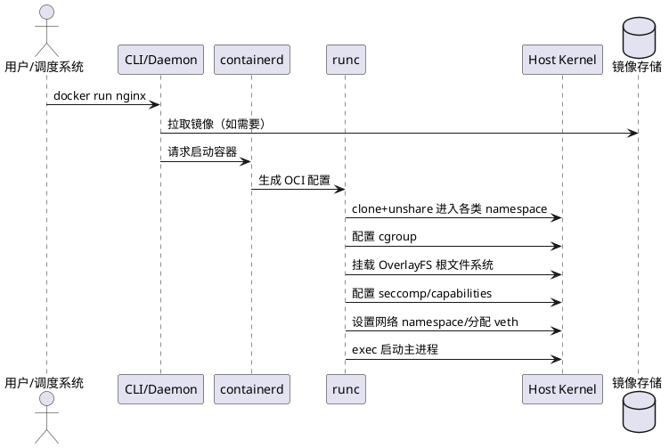

# 容器技术总体架构与内核资源隔离机制分析

---

## 1. 容器技术体系结构总览

容器技术（以 Docker、containerd、Podman 等为代表）通过内核提供的进程隔离与资源控制能力，实现了高效、轻量、可移植的应用运行环境。其核心架构主要包括：

- **运行时管理层**（如 containerd、Docker Daemon）  
  负责容器的生命周期管理、镜像管理、网络分配、API 调度等。

- **容器运行时（Runtime）**（如 runc）  
  按照 OCI 标准实际创建隔离的容器进程，包括挂载文件系统、配置资源、进入各类 namespace。

- **镜像存储与分发**  
  镜像分层存储，实现高效复用、文件系统挂载（OverlayFS 等）。

- **网络驱动与虚拟化**  
  利用虚拟网桥、veth pair、overlay 网络等技术实现容器间及与外部的通信。

- **安全与隔离加固**  
  包括 Seccomp、Linux Capabilities、AppArmor、SELinux、rootless 等机制。

### 架构简图（概念）

```
        ┌───────────────────────┐
        │   用户/调度系统        │
        └─────────▲─────────────┘
                  │
        ┌─────────┴─────────────┐
        │  Docker daemon/ctr    │
        └─────────▲─────────────┘
                  │
        ┌─────────┴─────────────┐
        │      containerd       │
        └─────────▲─────────────┘
                  │
        ┌─────────┴─────────────┐
        │        runc           │
        └─────┬───────────┬─────┘
              │           │
     ┌────────▼───┐   ┌───▼─────────┐
     │ namespace  │   │   cgroup    │
     └────────────┘   └─────────────┘
     ┌────────────┐   ┌─────────────┐
     │OverlayFS   │   │ 网络驱动     │
     └────────────┘   └─────────────┘
```

---

## 2. Linux 内核实现的主要隔离与资源控制机制

### 2.1 Namespace（命名空间）

- **功能**：将内核可见的资源“切片”，为不同容器进程提供彼此独立（隔离）的资源视图。
- **主流类型**：
  - UTS（主机名/域名）
  - IPC（信号、消息队列）
  - PID（进程号空间）
  - NET（网络协议栈、设备）
  - MNT（挂载点、文件系统）
  - USER（用户/组ID）
  - cgroup（cgroup 层级视图）
- **作用**：实现进程间资源“看不见”，保证容器互不干扰。

### 2.2 cgroup（控制组）

- **功能**：对一组进程施加资源限制/配额与统计。
- **可控制内容**：
  - CPU 时间/优先级
  - 内存使用量/限制
  - blkio 磁盘带宽
  - pids 进程数
- **作用**：防止任何容器“独占”物理资源，实现服务稳定与资源公平分配。

### 2.3 文件系统隔离（OverlayFS）

- **功能**：多层文件系统叠加，实现容器可写层分离与镜像只读复用。
- **实现方式**：上层写时复制（COW），底层镜像层复用，卷与持久化支持。

### 2.4 容器安全加固补充

- **seccomp**：系统调用白名单，阻止危险 syscall。
- **Linux Capabilities**：最小化可用 root 权限能力。
- **AppArmor/SELinux**：强制访问控制（MAC），锁定进程行为。
- **rootless 机制**：允许容器进程在无 root 权限下运行，降低宿主风险。

---

## 3. 典型容器启动流程中的内核隔离与资源分配



---

## 4. 小结

- 容器不是“轻量虚拟机”，而是对同一内核的进程进行资源视图切分和限额管理。
- Namespace + cgroup 是内核级的基石，实现隔离与配额，辅以多层存储和安全机制。
- 现代容器平台通过统一镜像、强安全策略、自动编排等机制，大幅提升了分布式应用的可维护性和弹性。

---

