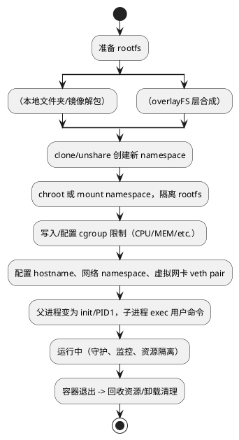

# 容器进程分析指南

本指南旨在帮助您系统分析和排查容器中的进程相关问题，包括进程查看、命名空间、资源限制、常见故障排查等。

---

## 1. 查看容器内的进程

可以通过如下方式查看容器内部的进程列表：

### 1.1 使用 `docker` 命令

```bash
docker exec <container_id_or_name> ps aux
```

### 1.2 进入容器查看

```bash
docker exec -it <container_id_or_name> /bin/bash
ps aux
```

---

## 2. 容器与宿主机的进程关系

- 宿主机上通过 `ps`, `top` 查看到的进程其实是容器里的进程在宿主机上的表现，进程 PID 可能不同。
- 可以通过如下方式匹配宿主机与容器内的进程：

```bash
# 查看容器的主进程 PID
docker inspect -f '{{.State.Pid}}' <container_id_or_name>
# 进入 PID 命名空间
nsenter -t <PID> -n -m -u -i
```

---

## 3. 常见 Linux 容器化技术及其进程隔离

- Docker、containerd、Podman 等都使用 Linux 命名空间（Namespace）和控制组（cgroup）实现隔离。
- 不同 Namespace 包括：
  - PID: 进程隔离
  - NET: 网络隔离
  - IPC: 信号量等隔离
  - UTS: 主机名隔离
  - MNT: 挂载点隔离

---

## 4. 分析容器内进程资源限制

资源限制主要由 cgroup 实现，排查时可以：

- 检查容器的 cgroup 配置：
  ```bash
  cat /sys/fs/cgroup/cpu/cpu.cfs_quota_us
  cat /sys/fs/cgroup/memory/memory.limit_in_bytes
  ```
- 通过 Docker 查看资源使用
  ```bash
  docker stats <container_id_or_name>
  ```

---

## 5. 容器进程的常见故障及排查方法

| 问题            | 排查思路                                       |
|-----------------|-----------------------------------------------|
| 进程崩溃        | 查看日志、`docker logs`、容器内部日志           |
| 资源耗尽        | 排查 cgroup、`docker stats`、内存/CPU 限制      |
| 无法访问服务    | 检查网络命名空间、端口映射、iptables            |
| 僵尸进程        | 容器内主进程需为 PID 1，确保能正常回收子进程     |

---

## 6. 推荐工具

- `htop`, `ps`, `pstree`: 进程树查看
- `strace`, `lsof`: 进程行为跟踪、文件句柄查看
- `nsenter`, `docker exec`: 命名空间切入和交互

---

## 7. 进阶分析

- 分析内核 namespace 隔离情况：
  ```bash
  lsns
  ```
- 查看具体进程的 namespace 绑定：
  ```bash
  readlink /proc/<pid>/ns/*
  ```

---

如需更多排查与分析建议，推荐结合生产环境场景和实际需求进行深入探索。


## 8. 手写实现自己的容器：原理与核心步骤

如果你想动手开发一个“像 Docker 一样能运行容器”的 Cloud Native 运行时，可以参考如下最小实现思路。主流容器运行时的核心机制主要依赖 Linux Namespace、Cgroup、Rootfs 隔离以及进程生命周期管理等内核特性。

### 实现容器运行时的基本原理

1. **Namespace 隔离**  
   利用 `clone(2)` 或 `unshare(2)` 系统调用，为容器进程单独建立新的进程、网络、挂载、UTS（主机名）、用户等 namespace，实现进程与宿主机的"视图隔离"。

2. **Cgroup 资源限制**  
   通过创建和配置 cgroup 控制组，为容器进程绑定 cpu/mem/io 等资源配额，限制单个容器资源消耗。

3. **RootFS（根文件系统）隔离**  
   利用 `chroot` 或 mount namespace 挂载独立文件系统，通常准备一份最小化的 rootfs，切换后进程只能访问自己的根目录（类似镜像）。

4. **镜像分发与管理（可选）**  
   简单情况直接用本地 rootfs 目录，复杂方案实现镜像下载、解包、overlayFS 等多层文件系统管理。

5. **主进程替换（exec/子进程管理）**  
   clone 启动新容器进程后，`execve` 执行用户指定命令。父进程负责监控和回收子进程，保证容器退出时自动清理资源。

6. **网络虚拟化（可选）**  
   veth pair 创建容器独立网卡，桥接到宿主机网络，分配独立 IP。

### 最小 Golang 容器实现（核心伪代码）

```go
func main() {
    // 1. 利用 clone/unshare 创建新 namespace
    syscall.Unshare(syscall.CLONE_NEWUTS | syscall.CLONE_NEWIPC |
                   syscall.CLONE_NEWPID | syscall.CLONE_NEWNS | syscall.CLONE_NEWNET)
    // 2. chroot 到指定 rootfs，实现文件系统隔离
    syscall.Chroot("/path/to/my-rootfs")
    syscall.Chdir("/")
    // 3. 配置 cgroup （cpu, memory 等限制）
    setupCgroup(os.Getpid())
    // 4. 设置主机名/挂载 proc/dev 等必要目录
    syscall.Sethostname([]byte("mycontainer"))
    syscall.Mount("proc", "/proc", "proc", 0, "")
    // 5. exec 替换为用户命令
    syscall.Exec("/bin/sh", []string{"/bin/sh"}, os.Environ())
}
```

### 关键知识点概览

- `clone` 或 `unshare`：用于 namespace 隔离
- `chroot` 或 mount namespace：rootfs 隔离
- 手动创建/写入 `/sys/fs/cgroup/` 下相关控制文件，限制资源
- 对进程 PID 1 的特殊处理，回收僵尸进程（init/subreaper）
- overlayFS/aufs（实现分层存储，类似镜像）

### 进阶推荐

- 参考 runc、LXC、crun 等容器运行时的源码
- 试着支持 OCI 规范，兼容K8s生态
- 深入：实现 shim 进程、支持 checkpoint/restore、丰富的生命周期与安全机制

**参考资料**  
- [Liz Rice: Building a container from scratch in Go](https://www.youtube.com/watch?v=8fi7uSYlOdc)
- [Linux man page: clone(2), unshare(2), cgroups(7)]
- [runc 源码解读与文档](https://github.com/opencontainers/runc)

通过少量代码即可体验底层容器技术的本质，深入理解后可逐步补齐镜像分发、overlayfs 分层、网络隔离等生产级特性！

---

### 容器原理及核心步骤流程图（PlantUML）

下面用 PlantUML 描述一个最小容器的原理与核心流程，并解释为何离不开 runc、LXC、crun、overlayfs、rootfs、network 等底层组件。



#### 各核心组件和技术的依赖解释

- **runc / LXC / crun**  
  这些是 OCI 标准的容器 runtime，实现了 namespace、cgroup、seccomp 等隔离机制的生命周期管理，是“容器启动/销毁/监控”的关键执行引擎。K8s、Docker 等会通过它们真正调用内核能力。

- **overlayfs**  
  实现容器镜像分层——即读写分离、减少存储空间消耗，并允许多个容器共享只读层，快速启动。没有 overlayfs，很难高效支持镜像管理与极速部署。

- **rootfs**  
  即容器内视角的完整根文件系统。必须有 rootfs 才能像“独立主机”一样正常运行应用。chroot/mount namespace + rootfs 组成最小隔离单元。

- **network (namespace/veth pair/桥接等)**  
  保证每个容器有独立网络栈、IP等，流量/端口互不影响，支持灵活接入主机或外部网络，也是安全隔离的基础。

**总结**：  
无论你用 Go/C 自己“手撸”容器，还是用 k8s、Docker 的高级封装，底层都离不开上述这些核心机制和“runtime”工具。它们“胶水”了内核能力与云原生生态，支撑了容器的极致隔离性、弹性和自服务的现代应用交付模式。

---

