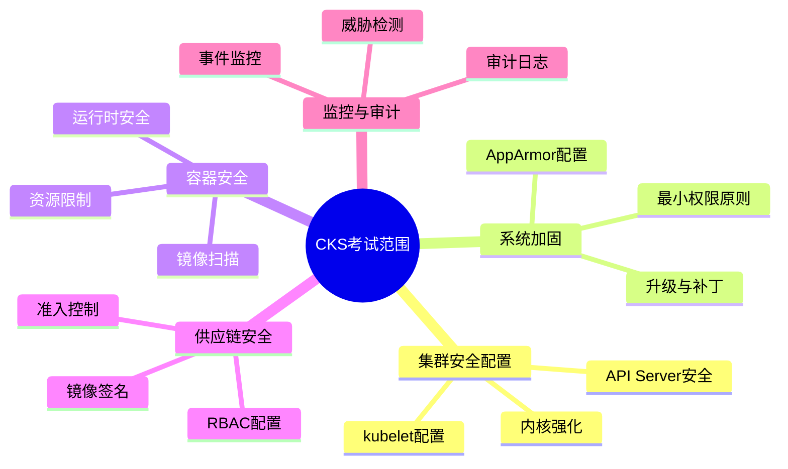
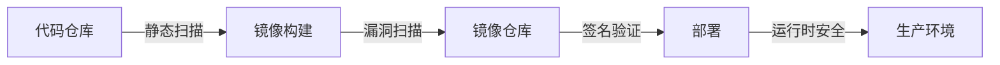
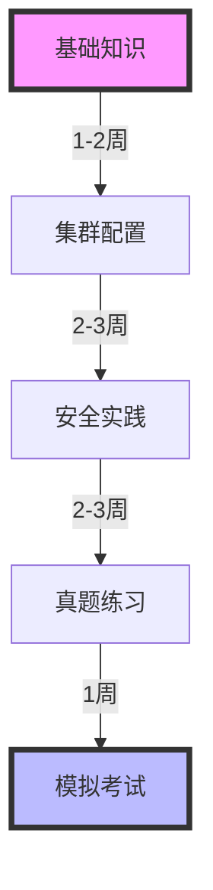
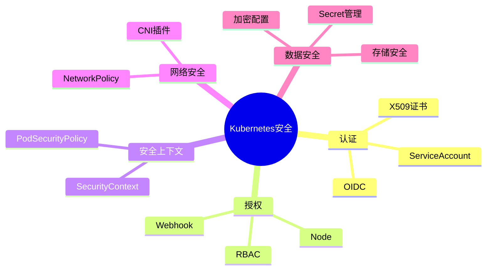

# CKS (Certified Kubernetes Security Specialist) 认证实战指南

## 目录

1. [考试概述](#考试概述)
2. [核心知识点](#核心知识点)
3. [实战案例](#实战案例)
4. [学习路线](#学习路线)
5. [考试技巧](#考试技巧)

## 考试概述

### 基本信息

- 考试时长：2小时
- 题目数量：15-20道
- 及格分数：67%
- 考试环境：Kubernetes v1.26
- 证书有效期：3年

### 考试范围



## 核心知识点

### 1. 集群强化 (Cluster Hardening)

#### 1.1 RBAC配置

```yaml
// 示例: 创建只读权限的Role
apiVersion: rbac.authorization.k8s.io/v1
kind: Role
metadata:
  namespace: default
  name: pod-reader
rules:
- apiGroups: [""]
  resources: ["pods"]
  verbs: ["get", "list", "watch"]
```

#### 1.2 网络策略

```yaml
// 示例: 默认拒绝所有入站流量
apiVersion: networking.k8s.io/v1
kind: NetworkPolicy
metadata:
  name: default-deny-ingress
spec:
  podSelector: {}
  policyTypes:
  - Ingress
```

### 2. 系统加固

#### 2.1 AppArmor配置

```bash
# 安装AppArmor
sudo apt-get install apparmor-utils

# 创建配置文件
sudo vim /etc/apparmor.d/container-profile

# 加载配置
sudo apparmor_parser -r /etc/apparmor.d/container-profile
```

#### 2.2 SecurityContext配置

```yaml
apiVersion: v1
kind: Pod
metadata:
  name: security-context-demo
spec:
  securityContext:
    runAsNonRoot: true
    runAsUser: 1000
  containers:
  - name: sec-ctx-demo
    image: busybox
    command: [ "sh", "-c", "sleep 1h" ]
```

### 3. 供应链安全



## 实战案例

### 案例1: 配置审计日志

```bash
# 1. 修改API Server配置
sudo vim /etc/kubernetes/manifests/kube-apiserver.yaml

# 添加以下参数
spec:
  containers:
  - command:
    - kube-apiserver
    - --audit-log-path=/var/log/audit.log
    - --audit-policy-file=/etc/kubernetes/audit-policy.yaml
```

### 案例2: 实现Pod安全策略

```yaml
apiVersion: policy/v1beta1
kind: PodSecurityPolicy
metadata:
  name: restricted
spec:
  privileged: false
  seLinux:
    rule: RunAsAny
  runAsUser:
    rule: MustRunAsNonRoot
  fsGroup:
    rule: RunAsAny
  volumes:
  - 'configMap'
  - 'emptyDir'
  - 'persistentVolumeClaim'
```

## 学习路线



### 推荐学习资源

1. Kubernetes官方文档
2. CKS课程(Udemy)
3. Killer.sh模拟考试
4. GitHub实验项目

## 考试技巧

1. 时间管理
   - 先做简单题
   - 标记难题待回顾
   - 预留检查时间

2. 环境熟悉
   - 善用kubectl自动补全
   - 掌握vim基本操作
   - 熟练使用Linux命令

3. 常用命令速查

```bash
# 查看集群状态
kubectl get nodes -o wide

# 查看安全上下文
kubectl describe pod pod-name | grep -A 10 Security

# 检查网络策略
kubectl get networkpolicies -A

# 审计日志查看
sudo tail -f /var/log/audit.log
```

## 实用工具清单

1. 容器扫描
   - Trivy
   - Clair
   - Aqua

2. 配置检查
   - kube-bench
   - kubesec
   - Polaris

3. 运行时安全
   - Falco
   - Tracee
   - Kubearmor

## 总结

CKS认证考试不仅考察Kubernetes的安全配置能力，更注重实际问题的解决能力。通过系统化的学习和大量实践，可以全面提升Kubernetes安全管理水平。

### 知识图谱



## 参考资料

1. [Kubernetes官方安全文档](https://kubernetes.io/docs/concepts/security/)
2. [CKS考试大纲](https://github.com/cncf/curriculum)
3. [Kubernetes安全最佳实践](https://kubernetes.io/docs/concepts/security/security-best-practices/)