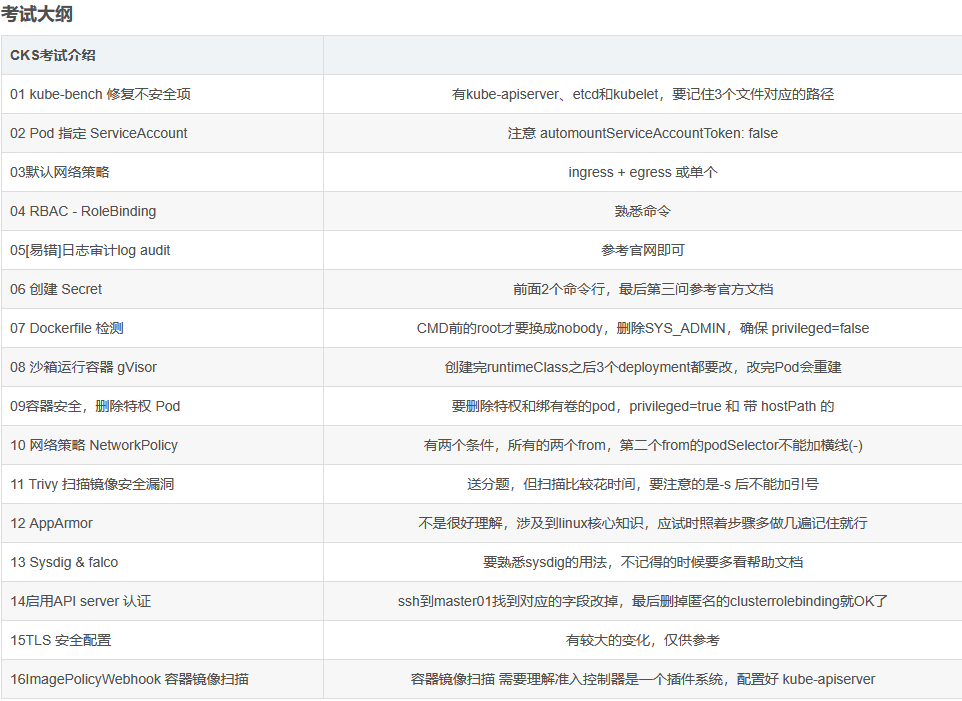
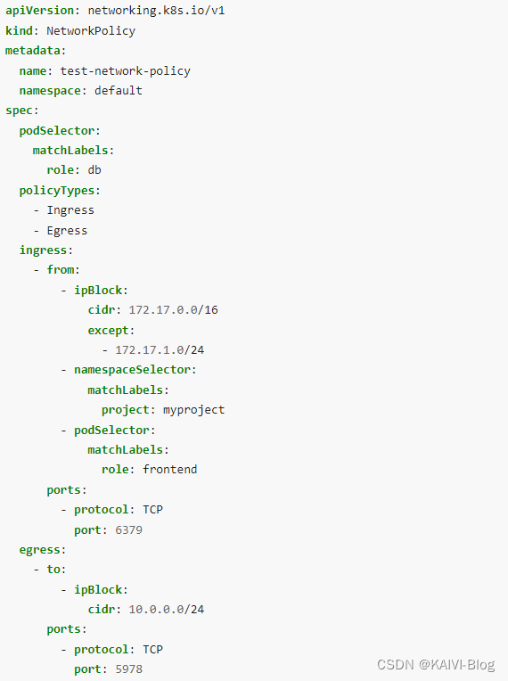
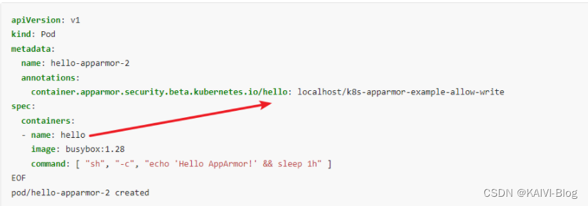
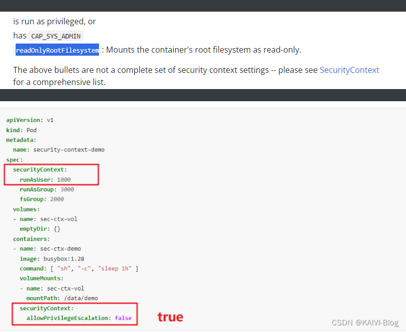
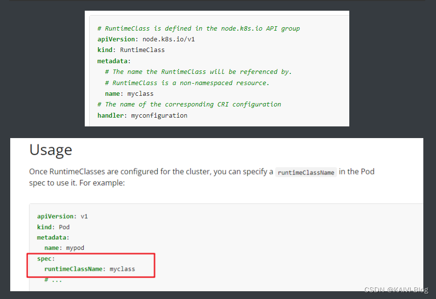
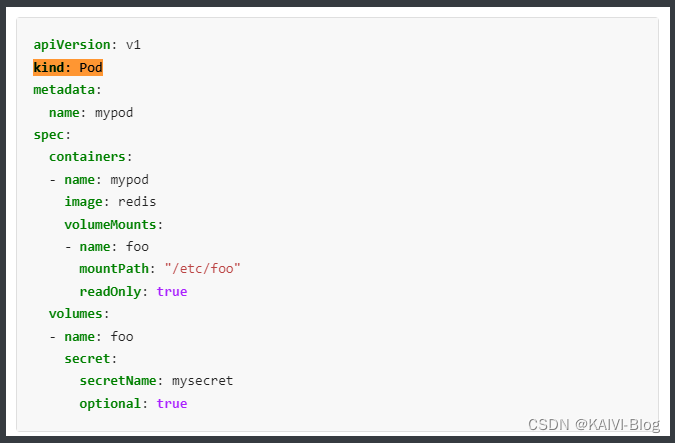

# CKS (Certified Kubernetes Security Specialist) 认证实战指南

## 目录

1. [考试概述](#考试概述)
2. [核心知识点](#核心知识点)
3. [实战案例](#实战案例)
4. [学习路线](#学习路线)
5. [考试技巧](#考试技巧)

## 考试概述

### 基本信息

- 考试时长：2小时
- 题目数量：15-20道
- 及格分数：67%
- 考试环境：Kubernetes v1.26
- 证书有效期：3年

### 考试范围


[参考图片](https://blog.csdn.net/weixin_45651006/article/details/134135587?utm_medium=distribute.pc_relevant.none-task-blog-2~default~baidujs_utm_term~default-1-134135587-blog-135914430.235^v43^pc_blog_bottom_relevance_base9&spm=1001.2101.3001.4242.1&utm_relevant_index=4)


```mermaid
mindmap
  root((CKS考试范围))
    集群安全配置
      API Server安全
      kubelet配置
      内核强化
    系统加固
      最小权限原则
      升级与补丁
      AppArmor配置
    容器安全
      镜像扫描
      运行时安全
      资源限制
    供应链安全
      镜像签名
      准入控制
      RBAC配置
    监控与审计
      审计日志
      事件监控
      威胁检测
```

## 核心知识点
集群强化（15% ）

    限制访问Kubernetes API
    使用基于角色的访问控制来最小化暴露
    谨慎使用服务帐户，例如禁用默认设置，减少新创建帐户的权限
    经常更新Kubernetes

系统强化 （10% ）

    最小化主机操作系统的大小(减少攻击面)
    使用最小权限标识和访问管理
    最小化对网络的外部访问
    适当使用内核强化工具，如AppArmor, seccomp

微服务漏洞最小化（20%）

    使用适当的pod安全标准
    管理Kubernetes机密
    理解并实现隔离技术（多租户、沙盒容器等）
    使用Cilium实现Pod-to-Pod加密

供应链安全(20%)

    最小化基本图像占用空间
    了解您的供应链（例如，SBOM、CI/CD、工件存储库）
    保护您的供应链（允许的注册中心、签名和验证工件等）。
    执行用户工作负载和容器映像的静态分析（例如Kubesec， KubeLinter)

监控、日志记录和运行时安全（20%）

    执行行为分析以检测恶意活动
    检测物理基础设施、应用程序、网络、数据、用户和工作负载中的威胁
    调查并识别攻击阶段和环境中的不良参与者
    确保容器在运行时的不变性
    使用Kubernetes审计日志监控访问

CKS考试介绍	
01 kube-bench 修复不安全项	有kube-apiserver、etcd和kubelet，要记住3个文件对应的路径
02 Pod 指定 ServiceAccount	注意 automountServiceAccountToken: false
03默认网络策略	ingress + egress 或单个
04 RBAC - RoleBinding	熟悉命令
05[易错]日志审计log audit	参考官网即可
06 创建 Secret	前面2个命令行，最后第三问参考官方文档
07 Dockerfile 检测	CMD前的root才要换成nobody，删除SYS_ADMIN，确保 privileged=false
08 沙箱运行容器 gVisor	创建完runtimeClass之后3个deployment都要改，改完Pod会重建
09容器安全，删除特权 Pod	要删除特权和绑有卷的pod，privileged=true 和 带 hostPath 的
10 网络策略 NetworkPolicy	有两个条件，所有的两个from，第二个from的podSelector不能加横线(-)
11 Trivy 扫描镜像安全漏洞	送分题，但扫描比较花时间，要注意的是-s 后不能加引号
12 AppArmor	不是很好理解，涉及到linux核心知识，应试时照着步骤多做几遍记住就行
13 Sysdig & falco	要熟悉sysdig的用法，不记得的时候要多看帮助文档
14启用API server 认证	ssh到master01找到对应的字段改掉，最后删掉匿名的clusterrolebinding就OK了
15TLS 安全配置	有较大的变化，仅供参考
16ImagePolicyWebhook 容器镜像扫描	容器镜像扫描 需要理解准入控制器是一个插件系统，配置好 kube-apiserver

### 1. 集群强化 (Cluster Hardening)

#### 1.1 RBAC配置

```yaml
// 示例: 创建只读权限的Role
apiVersion: rbac.authorization.k8s.io/v1
kind: Role
metadata:
  namespace: default
  name: pod-reader
rules:
- apiGroups: [""]
  resources: ["pods"]
  verbs: ["get", "list", "watch"]
```

绑定到 Pod 的 ServiceAccount 的 Role 授予过度宽松的权限。完成以下项目以减少权限集。
Task
一个名为 web-pod 的现有 Pod 已在 namespace db 中运行。
编辑绑定到 Pod 的 ServiceAccount service-account-web 的现有 Role，仅允许只对 services 类型的资源执行 get 操作。
在 namespace db 中创建一个名为 role-2 ，并仅允许只对 namespaces 类型的资源执行 delete 操作的新 Role。
创建一个名为 role-2-binding 的新 RoleBinding，将新创建的 Role 绑定到 Pod 的 ServiceAccount。
注意：请勿删除现有的 RoleBinding

```yaml
### 查询 sa 对应的 role 名称（假设是 role-1）
kubectl get rolebinding -n db -oyaml | grep 'service-account-web' -B 10  #通过rolebanding找到对应的role名称

### 修改 role 清单文件（仅允许对 services 类型的资源执行 get 操作）
kubectl edit role -n db role-1
apiVersion: rbac.authorization.k8s.io/v1
kind: Role
metadata:
  name: role-1
  namespace: db
  resourceVersion: "9528"
rules:
- apiGroups:        	#为默认的核心组
    - ""
  resources:
    - services			#只给services资源授权
  verbs:
    - get				#具体的权限
    
### 创建新角色 role-2（仅允许只对 namespaces 类型的资源执行 delete 操作）
kubectl create role role-2 -n db --verb=delete --resource=namespaces


### 创建 rolebinding，并绑定到 sa 上
kubectl create rolebinding role-2-binding --role=role-2 --serviceaccount=db:service-account-web
```


#### 1.2 网络策略

```yaml
// 示例: 默认拒绝所有入站流量
apiVersion: networking.k8s.io/v1
kind: NetworkPolicy
metadata:
  name: default-deny-ingress
spec:
  podSelector: {}
  policyTypes:
  - Ingress
```

```yaml
apiVersion: networking.k8s.io/v1
kind: NetworkPolicy
metadata:
  name: denypolicy          #修改名称以及NS即可
  namespace: testing        #官网复制，新增字段
spec:
  podSelector: {}
  policyTypes:
  - Ingress
  - Egress
```

> namespace: test-a 允许访问 namespace: test-b ,其他不允许访问，也不允许被访问

首先需要给命名空间添加标签（如果没有）：
```bash
kubectl label namespace test-a kubernetes.io/metadata.name=test-a
kubectl label namespace test-b kubernetes.io/metadata.name=test-b
```
```yaml
# 配置 test-a 命名空间的网络策略
apiVersion: networking.k8s.io/v1
kind: NetworkPolicy
metadata:
  name: allow-test-b-only
  namespace: test-a
spec:
  podSelector: {}  # 应用到所有Pod
  policyTypes:
  - Egress
  - Ingress
  egress:
  - to:
    - namespaceSelector:
        matchLabels:
          kubernetes.io/metadata.name: test-b
  ingress: []  # 空列表表示拒绝所有入站流量

---
# 配置 test-b 命名空间的网络策略
apiVersion: networking.k8s.io/v1
kind: NetworkPolicy
metadata:
  name: allow-test-a-only
  namespace: test-b
spec:
  podSelector: {}  # 应用到所有Pod
  policyTypes:
  - Ingress
  - Egress
  ingress:
  - from:
    - namespaceSelector:
        matchLabels:
          kubernetes.io/metadata.name: test-a
  egress: []  # 空列表表示拒绝所有出站流量
```
> namespace：test-a 允许访问 namespace: test-b ，其他不允许访问，允许被访问

```yaml
# 配置 test-a 命名空间的网络策略
apiVersion: networking.k8s.io/v1
kind: NetworkPolicy
metadata:
  name: test-a-policy
  namespace: test-a
spec:
  podSelector: {}  # 应用到所有Pod
  policyTypes:
  - Egress
  egress:  # 只允许访问 test-b
  - to:
    - namespaceSelector:
        matchLabels:
          kubernetes.io/metadata.name: test-b

---
# 配置 test-b 命名空间的网络策略
apiVersion: networking.k8s.io/v1
kind: NetworkPolicy
metadata:
  name: test-b-policy
  namespace: test-b
spec:
  podSelector: {}  # 应用到所有Pod
  policyTypes:
  - Ingress
  ingress:  # 只允许来自 test-a 的访问
  - from:
    - namespaceSelector:
        matchLabels:
          kubernetes.io/metadata.name: test-a
```

> namespace：test-a 不允许访问所有 namespace，其他不允许被访问

```yaml
# 配置 test-a 命名空间的网络策略
apiVersion: networking.k8s.io/v1
kind: NetworkPolicy
metadata:
  name: deny-all-egress
  namespace: test-a
spec:
  podSelector: {}  # 应用到所有Pod
  policyTypes:
  - Egress
  - Ingress
  egress: []  # 空列表表示拒绝所有出站流量
  ingress: []  # 空列表表示拒绝所有入站流量
```

Task
创建一个名为 pod-restriction 的 NetworkPolicy 来限制对在 namespace dev-team 中运行的 Pod products-service 的访问。
只允许以下 Pod 连接到 Pod products-service：
1.namespace qaqa 中的 Pod
2.位于任何 namespace，带有标签 environment: testing 的 Pod
注意：确保应用 NetworkPolicy。

这个networkPolicy创建的时候需要指定namespace是dev-team，名称是pod-restriction

由于是允许其它pod连接到Pod products-service，因此，策略应该是ingress，也就是入站策略

入站策略指定了两个范围一个是namespace为qaqa（由于网络策略是基于标签的，因此，本题需要查看namespace qaqa的标签），一个是带有指定标签envirnment:testing的pod，因此，该策略需要两个from

```yaml
kubectl get ns qaqa --show-labels      #查看ns标签
kubectl get po products-service -n dev-team --show-labels     #查询Pod products-service的标签


vi /cks/net/po.yaml
根据官网，修改为如下内容：
……
metadata:
  name: pod-restriction 		#修改
  namespace: dev-team 			#修改
spec:
  podSelector:
    matchLabels:
      environment: testing    #根据题目要求的标签修改，这个写的是 Pod products-service 的标签
  policyTypes:
  - Ingress 			#注意，这里只写 - Ingress，不要将 - Egress 也复制进来！
  ingress:
    - from:     #第一个 from
      - namespaceSelector:
          matchLabels:
          name: qaqa         #命名空间有 name: qaqa 标签的
    - from:     #第二个 from
      - namespaceSelector: {}       #修改为这样，所有命名空间
        podSelector:                #注意，这个 podSelector 前面的“-” 要删除，换成空格，空格对齐要对。（很重要）
          matchLabels:
          environment: testing       #有 environment: testing 标签的 Pod
```


#### 1.3 kube-bench 集群安全
针对 kubeadm 创建的 cluster 运行 CIS 基准测试工具时，发现了多个必须立即解决的问题。

```bash
kube-bench run --targets=master
kube-bench run --targets=node
kube-bench run --targets=etcd

千万不要在/etc/kubernetes/下备份，可能会导致异常，可以备份到/tmp或者其他目录下。

kubectl get node -o wide       
ssh master01

1.kube-apiserver配置文件的修改
修改之前，备份一下配置文件。
mkdir bak1
cp /etc/kubernetes/manifests/kube-apiserver.yaml bak1/

vim /etc/kubernetes/manifests/kube-apiserver.yaml
#修改、添加、删除相关内容   1.28没考 也需要检查
#修改 authorization-mode，注意 Node 和 RBAC 之间的符号是英文状态的逗号，而不是点。
 - --authorization-mode=Node,RBAC
#删除 insecure-bind-address，考试中，有可能本来就没写这行。
 - --insecure-bind-address=0.0.0.0
 
 
1.kubelet配置文件的修改
修改之前，备份一下配置文件。
mkdir bak1
cp /var/lib/kubelet/config.yaml bak1/

vim /var/lib/kubelet/config.yaml
修改
apiVersion: kubelet.config.k8s.io/v1beta1
authentication:
 anonymous:  #修改 anonymous 下的，将 true 改为 false
 enabled: false  #改为 false
 webhook:
 cacheTTL: 0s
 enabled: true   #这个 webhook 下的 true 不要改
 x509:
 clientCAFile: /etc/kubernetes/pki/ca.crt
authorization:   #修改 authorization 下的
 mode: Webhook   #改为 Webhook  注意首字母大写
 webhook:
……
#编辑完后重新加载配置文件，并重启 kubelet
systemctl daemon-reload
systemctl restart kubelet.service

3，etcd配置文件的修改
修改之前，备份一下配置文件。
mkdir bak1
cp /etc/kubernetes/manifests/etcd.yaml bak1/

vim /etc/kubernetes/manifests/etcd.yaml
修改
 - --client-cert-auth=true #修改为 true

修改完成后，等待 5 分钟，再检查一下所有 pod，确保模拟环境里的所有 pod 都正常。
kubectl get pod -A
```

#### 1.4 Pod 指定 ServiceAccount

Task

在现有 namespace qa 中创建一个名为 backend-sa 的新 ServiceAccount， 确保此 ServiceAccount 不自动挂载 API 凭据。
使用 /cks/sa/pod1.yaml 中的清单文件来创建一个 Pod。
最后，清理 namespace qa 中任何未使用的 ServiceAccount。

```yaml
### 创建 ServiceAccount
kubectl create sa backend-sa -n qa --dry-run=client -o yaml >2-sa.yaml

apiVersion: v1
kind: ServiceAccount
metadata:
 name: backend-sa #修改 name
 namespace: qa #注意添加 namespace
automountServiceAccountToken: false #修改为 false，表示不自动挂载 secret  注意和metadata同级


kubectl run nginx --image=nginx --dry-run=client -n qa -o yaml >  /cks/sa/pod1.yaml
### 编辑 Pod 使用新创建的 serviceaccount
vim /cks/sa/pod1.yaml
apiVersion: v1
kind: Pod
metadata:
  creationTimestamp: null
  labels:
    run: nginx
  name: nginx
  namespace: qa
spec:
  serviceAccountName: backend-sa   #新增之前创建的sa
  containers:
  - image: nginx
    name: nginx
    resources: {}
  dnsPolicy: ClusterFirst
  restartPolicy: Always
status: {}

### 应用清单文件
kubectl apply -f /cks/9/pod9.yaml

### 把除了 backend-sa 的 serviceaccount 都删除  ##default的sa有待确认  删除了会自动生成
kubectl get pod -n qa -o yaml|grep -i "serviceaccount:"
kubectl get sa -n qa
kubectl delete sa fraont-sa -n qa
```


#### 1.5 启用 API server 认证

由 kubeadm 创建的 cluster 的 Kubernetes API 服务器，出于测试目的，
临时配置允许未经身份验证和未经授权的访问，授予匿名用户 cluster-admin 的访问权限.
Task
重新配置 cluster 的 Kubernetes APl 服务器，以确保只允许经过身份验证和授权的 REST 请求。
使用授权模式 Node,RBAC 和准入控制器 NodeRestriction。
删除用户 system:anonymous 的 ClusterRoleBinding 来进行清理。
注意：所有 kubectl 配置环境/文件也被配置使用未经身份验证和未经授权的访问。
你不必更改它，但请注意，一旦完成 cluster 的安全加固， kubectl 的配置将无法工作。
您可以使用位于 cluster 的 master 节点上，cluster 原本的 kubectl 配置文件
/etc/kubernetes/admin.conf ，以确保经过身份验证的授权的请求仍然被允许。

任务一 确保只有认证并且授权过的 REST 请求才被允许
```bash
vim /etc/kubernetes/manifests/kube-apiserver.yaml
- --authorization-mode=Node,RBAC #				注意，只保留 Node,RBAC 这两个。可能默认已经有了，但还是要检查确认一下。
- --enable-admission-plugins=NodeRestriction 				#原先为 AlwaysAdmit，需要修改为 NodeRestriction。

重启kubelet   #这一步是重点
systemctl daemon-reload
systemctl restart kubelet
```
任务二 删除题目要求的角色绑定
```bash
kubectl get clusterrolebinding -o yaml | grep system:anonymous    #查看所有的clusterrole绑定的角色
kubectl delete clusterrolebinding system:anonymous  #删除clusterrolebinding
```

### 2. 系统加固

#### 2.1 AppArmor

```bash
# 安装AppArmor
sudo apt-get install apparmor-utils

# 创建配置文件
sudo vim /etc/apparmor.d/container-profile

# 加载配置
sudo apparmor_parser -r /etc/apparmor.d/container-profile
```
Task
在 cluster 的工作节点 node02 上，实施位于 /etc/apparmor.d/nginx_apparmor 的现有 APPArmor 配置文件。
编辑位于 /cks/KSSH00401/nginx-deploy.yaml 的现有清单文件以应用 AppArmor 配置文件。
最后，应用清单文件并创建其中指定的 Pod 。
请注意，考试时，考题里已表明 APPArmor 在工作节点上，所以你需要 ssh 到开头写的工作节点上。

确定/cks/KSSH00401/nginx-deploy.yaml是部署在工作节点的。

apparmor等于centos系统的selinux，因此，我们首先应该是查看位于工作节点的/etc/apparmor.d/nginx_apparmor 这个文件，确定次文件是正常的后，将apparmor规则加载到内核，然后修改/cks/KSSH00401/nginx-deploy.yaml这个文件，增加一个注解container.apparmor.security.beta.kubernetes.io/podx: localhost/nginx-profile-3指定到apparmor的名称，最后应用此部署文件即可。

```bash
1 切换到 node02 的 root 下
ssh node02
sudo -i

2 切换到 apparmor 的目录，并检查配置文件
cd /etc/apparmor.d/
vi /etc/apparmor.d/nginx_apparmor

注意，nginx-profile-3 这一行要注释掉，但要确保 profile nginx-profile-3 这一行没有注释。
#include <tunables/global>
profile nginx-profile-3 flags=(attach_disconnected) { #这句是正确的配置，不要修改。profile 后面的 nginx-profile-3 为 apparmor 策略模块的名字。
 #include <abstractions/base>
 file,
……
3 执行 apparmor 策略模块
没有 grep 到，说明没有启动。
apparmor_status | grep nginx-profile-3
加载启用这个配置文件
apparmor_parser -q /etc/apparmor.d/nginx_apparmor    #2种方法都可以
apparmor_parser -r /etc/apparmor.d/*
# 再次检查有结果了
apparmor_status | grep nginx
显示如下内容
nginx-profile-3
（注意！注意！考试时，这个文件是在默认登录的终端那个初始节点上的，而不是在这个 work 节点的。）
（对应模拟环境，就是在 node01 上，所以需要 exit 退回来。）
4 修改 pod 文件
vi /cks/KSSH00401/nginx-deploy.yaml
修改如下内容
……
metadata:
  name: podname
 #添加 annotations，kubernetes.io/podx 名字和 containers 下的名字一样即可，nginx-profile-3 为前面在 worker node02 上执行的 apparmor 策略模块的名字。
  annotations:
    container.apparmor.security.beta.kubernetes.io/podx: localhost/nginx-profile-3
spec:
  containers:
  - image: busybox
    imagePullPolicy: IfNotPresent
    name: podx 		#这个就是 containers 下的名字，为 podx
    command: [ "sh", "-c", "echo 'Hello AppArmor!' && sleep 1h" ]
……
创建
kubectl apply -f /cks/KSSH00401/nginx-deploy.yaml
kubectl exec podx -- touch /tmp/test       #检查，写入文件会报错
```



[apparmor](https://kubernetes.io/zh-cn/docs/tutorials/security/apparmor/)

1. 为什么要配置 AppArmor
* 安全增强

提供额外的安全层，限制容器的权限
防止容器逃逸和提权攻击
减少攻击面，限制系统资源访问
* 最小权限原则

确保容器只能访问必需的资源
限制不必要的系统调用
降低安全风险
2. 工作原理
```
graph TD
    A[应用程序] -->|系统调用| B[AppArmor]
    B -->|检查策略| C[策略规则]
    B -->|审计日志| D[日志系统]
    B -->|允许/拒绝| E[内核]
```

核心机制
```bash
# AppArmor 配置示例
profile docker-nginx flags=(attach_disconnected,mediate_deleted) {
  # 基础规则集
  #include <abstractions/base>
  
  # 文件访问规则
  /var/log/nginx/* w,
  /etc/nginx/nginx.conf r,
  
  # 网络访问规则
  network inet tcp,
  
  # 能力限制
  deny capability sys_admin,
  deny capability sys_module,
}
```

强制访问控制
* 基于预定义的配置文件
* 实时监控和拦截系统调用
* 细粒度的权限控制

3. 主要应用场景
容器安全
```yaml
# Kubernetes Pod 配置示例
apiVersion: v1
kind: Pod
metadata:
  name: nginx
  annotations:
    container.apparmor.security.beta.kubernetes.io/nginx: localhost/docker-nginx
spec:
  containers:
  - name: nginx
    image: nginx
```

Web服务器保护

限制 Nginx/Apache 访问范围
保护敏感文件和目录
控制网络访问权限

数据库安全
```conf
# MySQL AppArmor 配置示例
profile mysql flags=(attach_disconnected) {
  /var/lib/mysql/ r,
  /var/lib/mysql/** rwk,
  /var/log/mysql/ r,
  /var/log/mysql/* rw,
}
```
多租户环境
隔离不同租户的应用
防止资源互相干扰
确保数据安全性


4. 实施建议
配置管理
```bash
# 常用 AppArmor 命令
aa-status                     # 查看状态
aa-complain /etc/apparmor.d/* # 设置警告模式
aa-enforce /etc/apparmor.d/*  # 设置强制模式
```
监控和审计
```bash
# 日志检查
tail -f /var/log/syslog | grep audit
grep audit /var/log/kern.log
```
最佳实践
从宽松模式开始
逐步收紧权限
定期审查和更新策略

5. 性能考虑
5.1 资源开销

  轻量级实现
  最小化性能影响
  可预测的行为
5.2 优化建议
```bash
# 性能优化配置
sysctl -w kernel.perf_event_paranoid=1
sysctl -w kernel.kptr_restrict=0
```
通过合理配置 AppArmor，可以显著提高系统安全性，同时保持良好的性能和可用性。在容器化环境中，AppArmor 是实现深度防御策略的重要组件。

#### 2.2 SecurityContext配置

```yaml
apiVersion: v1
kind: Pod
metadata:
  name: security-context-demo
spec:
  securityContext:
    runAsNonRoot: true
    runAsUser: 1000
  containers:
  - name: sec-ctx-demo
    image: busybox
    command: [ "sh", "-c", "sleep 1h" ]
```
[为 Pod 或容器配置安全上下文 | Kubernetes](https://kubernetes.io/zh-
cn/docs/tasks/configure-pod-container/security-context/ “为 Pod 或容器配置安全上下文 |
Kubernetes”)

Task:
按照如下要求修改 sec-ns 命名空间里的 Deployment secdep
一、用 ID 为 30000 的用户启动容器（设置用户 ID 为: 30000）
二、不允许进程获得超出其父进程的特权（禁止 allowPrivilegeEscalation）
三、以只读方式加载容器的根文件系统（对根文件的只读权限）

```yaml
      securityContext:
        allowPrivilegeEscalation: false
        readOnlyRootFilesystem: true
```


可能–删除非无状态或非不可变的 pod
Task
检查在 namespace production 中运行的 Pod，并删除任何非无状态或非不可变的 Pod。
使用以下对无状态和不可变的严格解释：
a.能够在容器内存储数据的 Pod 的容器必须被视为非无状态的。
b.被配置为任何形式的特权 Pod 必须被视为可能是非无状态和非不可变的。
注意：你不必担心数据是否实际上已经存储在容器中。

```bash
### 在命名空间 dev 中检查 running 状态的 pod
kubectl get pods -n production | grep running

### 查看具有特权的 pod
kubectl get pods -n production -o yaml | egrep -i "privileged: true"

### 查看具有 volume 的 pod
kubectl get pods -n production -o yaml |grep "volume"

### 将查询到的具有特权和 volume 的 pod 都删除
kubectl delete pods -n production pod名称
```

#### 2.3 Dockerfile 检测

Task
1.分析和编辑给定的 Dockerfile /cks/docker/Dockerfile（基于 ubuntu:16.04 镜像），
并修复在文件中拥有的突出的安全/最佳实践问题的两个指令。

2.分析和编辑给定的清单文件 /cks/docker/deployment.yaml ，
并修复在文件中拥有突出的安全/最佳实践问题的两个字段。

注意：请勿添加或删除配置设置；只需修改现有的配置设置让以上两个配置设置都不再有安全/最佳实践问题。
注意：如果您需要非特权用户来执行任何项目，请使用用户 ID 65535 的用户 nobody 。
只修改即可，不需要创建

修改Ubuntu的版本为16.04，一般不使用root来运行容器，这里改为使用nobody
```txt
<1> 修改 Dockerfile
vi /cks/docker/Dockerfile
1、仅将 CMD 上面的 USER root 修改为 USER nobody，不要改其他的
USER nobody
2、修改基础镜像为题目要求的 ubuntu:16.04
FROM ubuntu:16.04
```
标签改为一样的，需要确保三个标签一致。
安全上下文配置错误,只需要修改，无需部署

```txt
 securityContext字段中: 
 (1)将 privileged 变为 False；
 (2)将 readOnlyRootFilesystem 变为 True ;runAsUser: 65535 #注意首字母大写
```

#### 2.4 沙箱运行容器 gVisor
该 cluster 使用 containerd 作为 CRI 运行时。containerd 的默认运行时处理程序是 runc。
containerd 已准备好支持额外的运行时处理程序 runsc (gVisor)。
Task
使用名为 runsc 的现有运行时处理程序，创建一个名为 untrusted 的 RuntimeClass。
更新 namespace server 中的所有 Pod 以在 gVisor 上运行。
您可以在 /cks/gVisor/rc.yaml 中找到一个模版清单。

```bash
vi /cks/gVisor/rc.yaml
apiVersion: node.k8s.io/v1beta1
kind: RuntimeClass
metadata:
  name: untrusted   # 用来引用 RuntimeClass 的名字，RuntimeClass 是一个集群层面的资源
handler: runsc      # 对应的 CRI 配置的名称
创建
kubectl create -f /cks/gVisor/rc.yaml


2 将命名空间为 server 下的 Pod 引用 RuntimeClass。
考试时，3 个 Deployment 下有 3 个 Pod，修改 3 个 deployment 即可。
kubectl -n server get deployment
 
编辑 deployment
kubectl -n server edit deployments busybox-run
kubectl -n server edit deployments nginx-host
kubectl -n server edit deployments run-test

修改如下内容
 spec: #下面有 containers 这个字段的 spec。  这里需要找一下是否已经有这个字段了。
   runtimeClassName: untrusted #添加这一行，注意空格对齐，保存会报错，忽略即可。
   containers:
   - image: nginx:1.9
     imagePullPolicy: IfNotPresent
     name: run-test
编辑pod也同理

验证，进到pod里面执行 命令 demsg 或者uname -a查看内核
```



#### 2.5 Trivy 扫描镜像安全漏洞
Task
使用 Trivy 开源容器扫描器检测 namespace kamino 中 Pod 使用的具有严重漏洞的镜像。
查找具有 High 或 Critical 严重性漏洞的镜像，并删除使用这些镜像的 Pod。
注意：Trivy 仅安装在 cluster 的 master 节点上，
在工作节点上不可使用。
你必须切换到 cluster 的 master 节点才能使用 Trivy。

master 节点才能使用 Trivy
kubectl describe pod -n kamino |grep "Image:"|awk '{print $2}' > 1.txt  #获取命名空间下的所有镜像
for i in `cat 1.txt`; do trivy image -s HIGH,CRITICAL $i > $i.txt; done
kubectl delete pod xxx -n kamino 

trivy image nginx:1.19 | grep -iE 'High|Critical'  #也是可以用的


#### 2.6 Sysdig & falco
Task：
使用运行时检测工具来检测 Pod tomcat123 单个容器中频发生成和执行的异常进程。
有两种工具可供使用：
    sysdig
    falco

注：这些工具只预装在 cluster 的工作节点 node02 上，不在 master 节点。
使用工具至少分析 30 秒 ，使用过滤器检查生成和执行的进程，将事件写到 /opt/KSR00101/incidents/summary 文件中，
其中包含检测的事件， 格式如下：
timestamp,uid/username,processName
保持工具的原始时间戳格式不变。

注：确保事件文件存储在集群的工作节点上。
```bash
### 需登录到工作节点操作
ssh cka-node01

### 查看 sysdig 帮助
sysdig -h

### 查看 sysdig 支持的元数据
sysdig -l |grep time
sysdig -l |grep uid
sysdig -l |grep proc

### 查看指定容器ID
crictl ps | grep tomcat

### -M 分析容器30秒，-p 指定事件保存格式，--cri 指定容器运行时，并且保存到指定文件路径中
sysdig -M 30 -p"%evt.time,%user.uid,%proc.name" --cri /run/containerd/containerd.sock container.id=xxxxx > /opt/KSR00101/incidents/summary      #注意这里--cri 没有"=" 号
###这道题目建议默写下来，节约大量时间
sysdig -M 30 -p"%evt.time,%user.uid,%proc.name" --cri /run/containerd/containerd.sock container.name=tomcat123
sysdig -M 30 -p"%evt.time,%user.name,%proc.name" --cri /run/containerd/containerd.sock container.name=tomcat123
```

#### 2.7 ImagePolicyWebhook 容器镜像扫描

cluster上设置了容器镜像扫描器，但尚未完全集成到 cluster 的配置中。
完成后，容器镜像扫描器应扫描并拒绝易受攻击的镜像的使用。
Task
注意：你必须在 cluster 的 master 节点上完成整个考题，所有服务和文件都已被准备好并放置在该节点上。
给定一个目录 /etc/kubernetes/epconfig 中不完整的配置，
以及具有 HTTPS 端点 https://image-bouncer-webhook.default.svc:1323/image_policy 的功能性容器镜像扫描器：
1. 启用必要的插件来创建镜像策略
2. 校验控制配置并将其更改为隐式拒绝（implicit deny）
3. 编辑配置以正确指向提供的 HTTPS 端点
最后，通过尝试部署易受攻击的资源 /cks/img/web1.yaml 来测试配置是否有效。

image_policywebhook的部署是通过一个服务来完成的，https://image-bouncer-webhook.default.svc:1323/image_policy，考试的时候，这个服务是已经部署好的，因此，我们不需要关心这个服务是否部署，是以何种形式部署的，只需要知道该服务是可用的即可。

imagePolicyWebhook是需要apiserver引用的，因此，我们需要更改apiserver以插件的形式使用这个功能。

最后需要执行/cks/img/web1.yaml，如果此pod部署失败，表示imagePolicyWebhook插件启用成功。

```bash
第 1 步 切换到 Master 的 root 下
ssh master01
sudo -i

第 2 步，编辑 admission_configuration.json（题目会给这个目录），修改 defaultAllow 为 false：
vi /etc/kubernetes/epconfig/admission_configuration.json       #修改准入控制器的json文件
……
 "denyTTL": 50,
 "retryBackoff": 500,
 "defaultAllow": false #将 true 改为 false
……


第 3 步，编辑/etc/kubernetes/epconfig/kubeconfig.yml，添加 webhook server 地址：
操作前，先备份配置文件
mkdir bak16
cp /etc/kubernetes/epconfig/kubeconfig.yml bak16/

vi /etc/kubernetes/epconfig/kubeconfig.yml            #修改镜像扫描策略
修改如下内容
……
 certificate-authority: /etc/kubernetes/epconfig/server.crt
 server: https://image-bouncer-webhook.default.svc:1323/image_policy   #添加 webhook server 地址
 name: bouncer_webhook
……

第 4 步，编辑 kube-apiserver.yaml，从官网中引用 ImagePolicyWebhook 的配置信息：
操作前，先备份配置文件
mkdir bak16
cp /etc/kubernetes/manifests/kube-apiserver.yaml bak16/
vi /etc/kubernetes/manifests/kube-apiserver.yaml
在- command:下添加如下内容，注意空格要对齐（不建议放到最后，建议放置的位置详见下方截图）
 - --enable-admission-plugins=NodeRestriction,ImagePolicyWebhook
 - --admission-control-config-file=/etc/kubernetes/epconfig/admission_configuration.json #在 1.25 的考试中，默认这行已经添加了
 
# 在 kube-apiserver.yaml 的 volumeMounts 增加
 volumeMounts: #在 volumeMounts 下面增加 #注意，在 1.25 考试中，蓝色的内容可能已经有了
   - mountPath: /etc/kubernetes/epconfig #建议紧挨着 volumeMounts 的下方增加
     name: epconfig
     readOnly: true
# 在 kube-apiserver.yaml 的 volumes 增加
 volumes: #在 volumes 下面增加 #注意，在 1.25 考试中，蓝色的内容可能已经有了，你只需要检查确认一下是否准确
   - name: epconfig     #建议紧挨着 volumes 的下方增加
     hostPath:
       path: /etc/kubernetes/epconfig
       type: DirectoryOrCreate       #如果你写的是目录，则是 DirectoryOrCreate，如果你写的是文件，则是 File

第 5 步，重启 kubelet。
systemctl restart kubelet        #等待 3 分钟，等集群应用策略后，确保 kube-apiserver 是 running 的

kubectl -n kube-system get pod   #通过尝试部署易受攻击的资源 /cks/img/web1.yaml 来测试配置是否有

kubectl apply -f /cks/img/web1.yaml  #无法创建 pod，如下报错，表示成功。
```


### 3. 供应链安全
```mermaid
graph LR
    A[代码仓库] -->|静态扫描| B[镜像构建]
    B -->|漏洞扫描| C[镜像仓库]
    C -->|签名验证| D[部署]
    D -->|运行时安全| E[生产环境]
```

#### 3.1 配置审计日志

```bash
# 1. 修改API Server配置
sudo vim /etc/kubernetes/manifests/kube-apiserver.yaml

# 添加以下参数
spec:
  containers:
  - command:
    - kube-apiserver
    - --audit-log-path=/var/log/audit.log
    - --audit-policy-file=/etc/kubernetes/audit-policy.yaml
```

Task
在 cluster 中启用审计日志。为此，请启用日志后端，并确保：
   日志存储在 /var/log/kubernetes/audit-logs.txt
   日志文件能保留 10 天
   最多保留 2 个旧审计日志文件
/etc/kubernetes/logpolicy/sample-policy.yaml 提供了基本策略。它仅指定不记录的内容。
注意：基本策略位于 cluster 的 master 节点上。

编辑和扩展基本策略以记录：
   RequestResponse 级别的 persistentvolumes 更改
   namespace front-apps 中 configmaps 更改的请求体
   Metadata 级别的所有 namespace 中的 ConfigMap 和 Secret 的更改
此外，添加一个全方位的规则以在 Metadata 级别记录所有其他请求。
注意：不要忘记应用修改后的策略。

```yaml
apiVersion: audit.k8s.io/v1
kind: Policy
omitStages:
  - "RequestReceived"
rules:
  - level: RequestResponse
    resources:
    - group: ""
      resources: ["persistentvolumes"] 
  - level: Request
    resources:
    - group: ""
      resources: ["configmaps"]   
    namespaces: ["front-apps"]
  - level: Metadata
    resources:
    - group: ""
      resources: ["secrets", "configmaps"]
  - level: Metadata
    omitStages:
      - "RequestReceived"
```

#### 3.2 实现Pod安全策略

```yaml
apiVersion: policy/v1beta1
kind: PodSecurityPolicy
metadata:
  name: restricted
spec:
  privileged: false
  seLinux:
    rule: RunAsAny
  runAsUser:
    rule: MustRunAsNonRoot
  fsGroup:
    rule: RunAsAny
  volumes:
  - 'configMap'
  - 'emptyDir'
  - 'persistentVolumeClaim'
```

#### 3.3 Secret管理

Task
在 namespace istio-system 中获取名为 db1-test 的现有 secret 的内容
将 username 字段存储在名为 /cks/sec/user.txt 的文件中，并将 password 字段存储在名为 /cks/sec/pass.txt 的文件中。
注意：你必须创建以上两个文件，他们还不存在。
注意：不要在以下步骤中使用/修改先前创建的文件，如果需要，可以创建新的临时文件。

在 istio-system namespace 中创建一个名为 db2-test 的新 secret，内容如下：
username : production-instance
password : KvLftKgs4aVH

最后，创建一个新的 Pod，它可以通过卷访问 secret db2-test ：
Pod 名称 secret-pod
Namespace istio-system
容器名 dev-container
镜像 nginx
卷名 secret-volume
挂载路径 /etc/secret


```bash
kubectl get secret -n istio-system -o yaml
echo xxx | base64 -d
mkdir -p /cks/sec && touch /cks/sec/user.txt && echo lady_killer9 > /cks/sec/user.txt
touch /cks/sec/pass.txt && echo 123456 > /cks/sec/pass.txt
```

创建名为 db2-test 的 secret 使用题目要求的用户名和密码作为键值。注意要加命名空间。
注意，如果密码中有特殊字符（例如：$，\，*，= 和 !），需要加单引号来转义--from-literal=password='G!Y\*d$zDsb'这样。
kubectl create secret generic db2-test -n istio-system --from-literal=username=production-instance --from-literal=password=KvLftKgs4aVH

```bash
根据题目要求，创建 Pod 使用该 secret
vim k8s-secret.yaml
添加如下内容
apiVersion: v1
kind: Pod
metadata:
 name: secret-pod 		    #pod 名字
 namespace: istio-system 	#命名空间
spec:
 containers:
 - name: dev-container	 	#容器名字
   image: nginx 	  	    #镜像名字
   volumeMounts: 			#挂载路径
   - name: secret-volume 		#卷名
     mountPath: /etc/secret
     readOnly: true
 volumes:
 - name: secret-volume 		  #卷名
   secret:
     secretName: db2-test 		#名为 db2-test 的 secret
创建
kubectl apply -f k8s-secret.yaml

```



#### 3.4 TLS 安全配置
Task
通过 TLS 加强 kube-apiserver 安全配置，要求
1、kube-apiserver 除了 VersionTLS13 及以上的版本可以使用，其他版本都不允许使用。
2、密码套件（Cipher suite）为 TLS_AES_128_GCM_SHA256
通过 TLS 加强 ETCD 安全配置，要求
1、密码套件（Cipher suite）为 TLS_ECDHE_RSA_WITH_AES_128_GCM_SHA256
```bash
kubectl exec -it -n kube-system kube-apiserver-controlplane -- kube-apiserver -h|grep tls


1 切换到 Master 的 root 下    #重要
ssh master01
sudo -i

修改 kube-apiserver
修改之前，备份一下配置文件。
mkdir bak15
cp /etc/kubernetes/manifests/kube-apiserver.yaml bak15/
vim /etc/kubernetes/manifests/kube-apiserver.yaml
添加或修改相关内容，并保存（先检查一下，如果考试环境里已经给你这两条了，则你只需要修改即可）
 - --tls-cipher-suites=TLS_AES_128_GCM_SHA256
 - --tls-min-version=VersionTLS13


修改 etcd
修改之前，备份一下配置文件。
mkdir bak15
cp /etc/kubernetes/manifests/etcd.yaml bak15/
vim /etc/kubernetes/manifests/etcd.yaml
添加或修改相关内容，并保存
 - --cipher-suites=TLS_ECDHE_RSA_WITH_AES_128_GCM_SHA256


systemctl daemon-reload
systemctl restart kubelet

重启etcd
systemctl restart etcd 
如果出现：Failed to restart etcd.service: Unit etcd.service not found.，可以查找kube-system下的etcd，例如
kubectl delete po etcd-controlplane -n kube-system

修改完成后，等待3分钟，等集群应用策略后，再检查所有 pod，特别是etcd和kube-apiserver两个pod，确保模拟环境是正常的。
kubectl get pod -A
kubectl -n kube-system get pod
ps -ef|grep etcd  #可以看看是否集成进去

```


## 学习路线

```mermaid
graph TD
    A[基础知识] -->|1-2周| B[集群配置]
    B -->|2-3周| C[安全实践]
    C -->|2-3周| D[真题练习]
    D -->|1周| E[模拟考试]
    
    style A fill:#f9f,stroke:#333,stroke-width:4px
    style E fill:#bbf,stroke:#333,stroke-width:4px
```

### 推荐学习资源

1. Kubernetes官方文档
2. CKS课程(Udemy)
3. Killer.sh模拟考试
4. GitHub实验项目

## 考试技巧

1. 时间管理
   - 先做简单题
   - 标记难题待回顾
   - 预留检查时间

2. 环境熟悉
   - 善用kubectl自动补全
   - 掌握vim基本操作
   - 熟练使用Linux命令

3. 常用命令速查

```bash
# 查看集群状态
kubectl get nodes -o wide

# 查看安全上下文
kubectl describe pod pod-name | grep -A 10 Security

# 检查网络策略
kubectl get networkpolicies -A

# 审计日志查看
sudo tail -f /var/log/audit.log
```

## 实用工具清单

1. 容器扫描
   - Trivy
   - Clair
   - Aqua

2. 配置检查
   - kube-bench
   - kubesec
   - Polaris

3. 运行时安全
   - Falco
   - Tracee
   - Kubearmor

## 总结

CKS认证考试不仅考察Kubernetes的安全配置能力，更注重实际问题的解决能力。通过系统化的学习和大量实践，可以全面提升Kubernetes安全管理水平。

### 知识图谱

```mermaid
mindmap
  root((Kubernetes安全))
    认证
      X509证书
      ServiceAccount
      OIDC
    授权
      RBAC
      Webhook
      Node
    安全上下文
      SecurityContext
      PodSecurityPolicy
    网络安全
      NetworkPolicy
      CNI插件
    数据安全
      Secret管理
      加密配置
      存储安全
```

## 参考资料

1. [Kubernetes官方安全文档](https://kubernetes.io/docs/concepts/security/)
2. [CKS考试大纲](https://github.com/cncf/curriculum)
3. [Kubernetes安全最佳实践](https://kubernetes.io/docs/concepts/security/security-best-practices/)