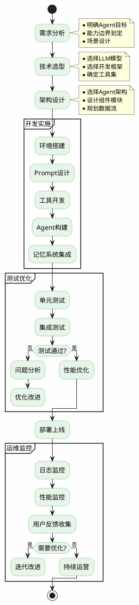
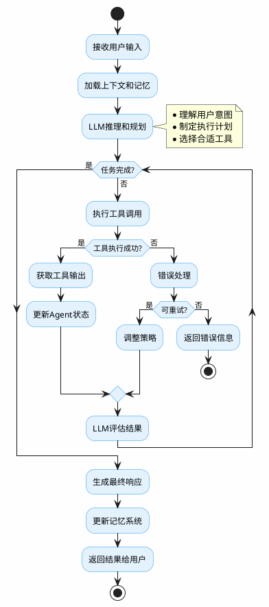
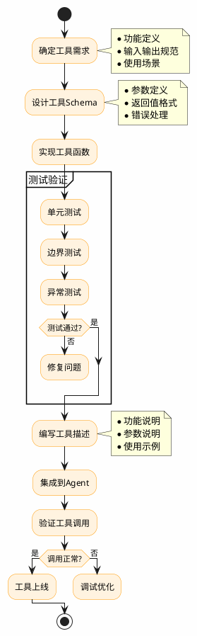
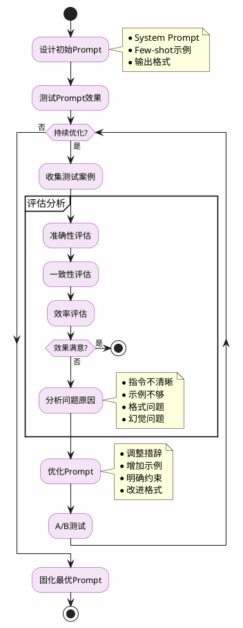
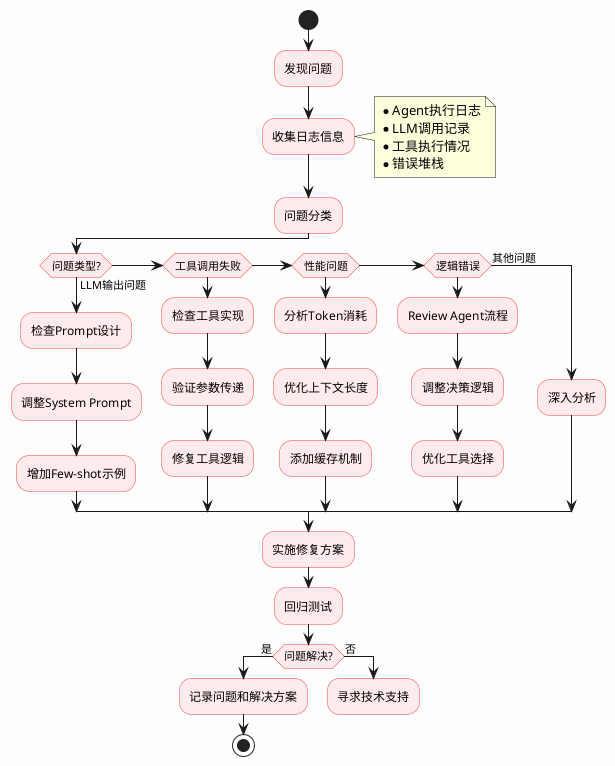
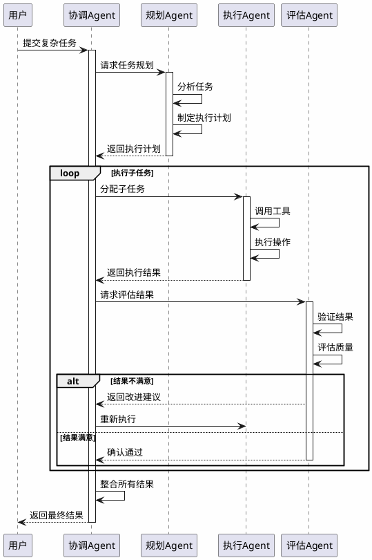

# AI Agent开发知识点梳理

## 一、核心概念

### 1.1 什么是AI Agent
- **定义**：能够感知环境、自主决策并采取行动以实现特定目标的智能系统
- **核心特征**：
  - 自主性（Autonomy）
  - 反应性（Reactivity）
  - 主动性（Proactivity）
  - 社交能力（Social Ability）

### 1.2 Agent架构类型
- **ReAct架构**：Reasoning + Acting，推理与行动结合
- **ReWOO架构**：Reasoning WithOut Observation，先规划后执行
- **Plan-and-Execute**：规划-执行分离架构
- **Reflexion**：带反思机制的Agent

## 二、关键技术栈

### 2.1 大语言模型（LLM）
- **主流模型**：GPT-4、Claude、LLaMA、ChatGLM等
- **Prompt Engineering**：
  - System Prompt设计
  - Few-shot Learning
  - Chain-of-Thought (CoT)
  - Tree of Thoughts (ToT)

### 2.2 开发框架
- **LangChain**：
  - Agent类型（Zero-shot、Conversational、ReAct等）
  - Tool使用
  - Memory管理
  - Chain组合
  
- **AutoGPT/BabyAGI**：
  - 任务分解
  - 自主执行
  - 结果评估

- **Microsoft Semantic Kernel**
- **CrewAI**：多Agent协作
- **MetaGPT**：软件开发Agent

### 2.3 工具集成
- **搜索工具**：Google Search API、Bing Search、DuckDuckGo
- **代码执行**：Python REPL、Jupyter Notebook
- **数据库**：SQL Database、Vector Database（Pinecone、Chroma）
- **API调用**：RESTful API、GraphQL
- **文件操作**：读写文件、文档解析

## 三、核心组件

### 3.1 规划模块（Planning）
- **任务分解**：将复杂任务拆分为子任务
- **策略选择**：根据上下文选择执行策略
- **目标管理**：设定和追踪目标完成度

### 3.2 记忆系统（Memory）
- **短期记忆**：对话历史、上下文缓存
- **长期记忆**：
  - 向量数据库存储
  - 知识图谱
  - 经验总结
- **记忆检索**：相似度搜索、时间序列检索

### 3.3 工具使用（Tool Use）
- **Function Calling**：OpenAI函数调用机制
- **Tool描述**：Schema定义、参数说明
- **执行策略**：串行执行、并行执行、条件执行

### 3.4 反思机制（Reflection）
- **自我评估**：输出质量检查
- **错误修正**：基于反馈调整策略
- **经验积累**：从失败中学习

## 四、日常工作流程

### 4.1 需求分析阶段
1. **明确Agent目标**：
   - 定义Agent要解决的核心问题
   - 确定成功标准和评估指标
   
2. **能力边界划定**：
   - 识别Agent需要的工具和API
   - 评估技术可行性
   - 确定限制条件

3. **场景设计**：
   - 绘制用户交互流程
   - 设计异常处理逻辑
   - 规划测试用例

### 4.2 开发实施阶段

#### 4.2.1 环境搭建
# 安装依赖
pip install langchain openai chromadb tiktoken

# 配置环境变量
export OPENAI_API_KEY="your-api-key"

#### 4.2.2 Prompt设计
- **System Prompt编写**：
  - 角色定义
  - 行为规范
  - 输出格式要求
  
- **Few-shot示例**：
  - 提供典型案例
  - 展示期望输出

#### 4.2.3 工具开发
from langchain.tools import Tool

def custom_tool(query: str) -> str:
    """自定义工具函数"""
    # 实现具体逻辑
    return result

tools = [
    Tool(
        name="CustomTool",
        func=custom_tool,
        description="工具功能描述"
    )
]

#### 4.2.4 Agent构建
from langchain.agents import initialize_agent, AgentType

agent = initialize_agent(
    tools=tools,
    llm=llm,
    agent=AgentType.ZERO_SHOT_REACT_DESCRIPTION,
    verbose=True,
    max_iterations=5
)

### 4.3 测试优化阶段

#### 4.3.1 单元测试
- 工具函数测试
- Prompt效果验证
- 边界条件测试

#### 4.3.2 集成测试
- 端到端流程测试
- 多轮对话测试
- 异常场景测试

#### 4.3.3 性能优化
- **Token优化**：减少不必要的上下文
- **缓存机制**：复用相同查询结果
- **并行处理**：合理使用异步调用

#### 4.3.4 迭代改进
- 收集用户反馈
- 分析失败案例
- 优化Prompt和工具

### 4.4 部署运维阶段

#### 4.4.1 部署方式
- **API服务**：FastAPI、Flask
- **Web应用**：Streamlit、Gradio
- **消息机器人**：Slack Bot、企业微信

#### 4.4.2 监控指标
- **性能指标**：
  - 响应时间
  - Token消耗
  - 成功率
  
- **业务指标**：
  - 任务完成率
  - 用户满意度
  - 工具调用频率

#### 4.4.3 日志管理
import logging

logging.basicConfig(
    level=logging.INFO,
    format='%(asctime)s - %(name)s - %(levelname)s - %(message)s'
)

# 记录Agent执行过程
logger.info(f"Agent执行: {action}")

## 五、日常工作内容

### 5.1 开发任务
- **新Agent开发**：
  - 需求文档编写
  - 技术方案设计
  - 代码实现和测试
  
- **功能迭代**：
  - 新工具集成
  - Prompt优化
  - 性能提升

### 5.2 问题排查
- **常见问题**：
  - LLM幻觉处理
  - 工具调用失败
  - 上下文溢出
  - 无限循环

- **调试技巧**：
  - 启用verbose模式
  - 分析中间输出
  - 逐步验证工具

### 5.3 文档维护
- **技术文档**：
  - API文档
  - 架构设计文档
  - 配置说明
  
- **用户文档**：
  - 使用指南
  - FAQ
  - 最佳实践

### 5.4 学习研究
- **跟踪前沿**：
  - 阅读最新论文
  - 关注开源项目
  - 参与技术社区
  
- **实验验证**：
  - 新模型评测
  - 新框架试用
  - 新方法验证

## 六、最佳实践

### 6.1 设计原则
- **单一职责**：每个Agent专注解决特定问题
- **模块化**：工具和组件可复用
- **可观测性**：完整的日志和监控
- **容错性**：优雅处理异常

### 6.2 常见陷阱
- **过度依赖LLM**：简单任务也用Agent
- **工具过多**：导致选择困难
- **上下文管理不当**：信息丢失或冗余
- **缺乏验证**：未对LLM输出进行校验

### 6.3 安全考虑
- **输入验证**：防止注入攻击
- **权限控制**：限制工具访问范围
- **敏感信息**：避免泄露API密钥
- **成本控制**：设置Token使用上限

## 七、评估指标

### 7.1 技术指标
- **准确性**：正确完成任务的比例
- **效率**：平均完成时间
- **稳定性**：成功率、错误率

### 7.2 业务指标
- **用户满意度**：CSAT、NPS
- **成本效益**：ROI计算
- **可扩展性**：支持的并发量

## 八、工具和资源

### 8.1 开发工具
- **IDE**：VS Code + Copilot
- **调试工具**：LangSmith、Weights & Biases
- **版本控制**：Git、GitHub

### 8.2 学习资源
- **官方文档**：LangChain、OpenAI
- **课程**：DeepLearning.AI、Coursera
- **社区**：Discord、GitHub Discussions
- **论文**：arXiv、Google Scholar

### 8.3 示例项目
- **AutoGPT**：自主任务执行
- **BabyAGI**：任务管理Agent
- **GPT-Engineer**：代码生成Agent
- **SuperAGI**：企业级Agent平台

## 九、AI Agent开发流程图

### 9.1 整体开发流程

### 9.2 Agent执行流程

### 9.3 工具开发流程

### 9.4 Prompt优化迭代流程

### 9.5 问题排查流程

### 9.6 多Agent协作流程
