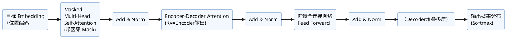

本文系统讲解了Transformer结构中的Decoder（解码器）模块。Decoder是实现自回归文本生成的核心环节，通常与Encoder协作完成机器翻译、文本摘要等任务。主要内容包括：

- Decoder整体结构与各子层作用
- 各关键机制（掩码自注意力、Encoder-Decoder注意力、前馈网络）
- 逐步生成过程与伪代码讲解
- Decoder与Encoder的协作原理
- 结构图辅助理解

适用于LLM、NLP研发、深度模型结构分析场景。

## 目录

- [目录](#目录)
- [1. Decoder结构概览](#1-decoder结构概览)
- [2. 核心子层解析](#2-核心子层解析)
  - [1. Masked Multi-Head Self-Attention](#1-masked-multi-head-self-attention)
  - [2. Encoder-Decoder Attention](#2-encoder-decoder-attention)
  - [3. 前馈神经网络（FFN）](#3-前馈神经网络ffn)
- [3. 逐步生成流程](#3-逐步生成流程)
- [4. 伪代码与结构图](#4-伪代码与结构图)
  - [伪代码](#伪代码)
  - [PlantUML结构图](#plantuml结构图)
- [5. Decoder作用与特点](#5-decoder作用与特点)
- [6. Encoder-Decoder协作机制](#6-encoder-decoder协作机制)

---

## 1. Decoder结构概览

Decoder通常由N层完全相同的Decoder Layer堆叠组成。每一层Decoder Layer包含如下子模块：

1. **Masked Multi-Head Self-Attention**（带因果掩码的多头自注意力）
2. **Encoder-Decoder Multi-Head Attention**（跨模块注意力，Q来自Decoder，K/V来自Encoder输出）
3. **前馈神经网络 Feed Forward Network (FFN)**

每个子层后均有**残差连接（Residual）和层归一化（LayerNorm）**。

结构示意如下：

```
           [Target Embedding]
                 │
        [Positional Encoding]
                 │
   ╔═════════════════════════════════╗
   ║      Repeat N次 Decoder Layer   ║
   ║ ┌─────────────────────────────┐ ║
   ║ │  Masked Self-Attention      │ ║
   ║ │    + Residual & LayerNorm   │ ║
   ║ │  Encoder-Decoder Attention  │ ║
   ║ │    + Residual & LayerNorm   │ ║
   ║ │    FeedForward Network      │ ║
   ║ │    + Residual & LayerNorm   │ ║
   ║ └─────────────────────────────┘ ║
   ╚═════════════════════════════════╝
                 │
           [Softmax输出概率]
```

---

## 2. 核心子层解析

### 1. Masked Multi-Head Self-Attention

- 只允许每个token关注“当前位置及之前”的输出（通过**因果掩码Mask**控制）。
- 防止模型“偷看”未来信息，适用于自回归生成。
- 支持并行处理所有位置，加速训练。

### 2. Encoder-Decoder Attention

- Decoder中的token可使用源序列（Encoder输出）信息。
- 其中Query来自Decoder，Key/Value来自Encoder（即输入序列特征）。
- 帮助目标序列生成时精准融合输入上下文。

### 3. 前馈神经网络（FFN）

- 结构同Encoder：两层线性变换+非线性激活。

---

## 3. 逐步生成流程

Decoder逐步生成目标序列，流程如下：

1. 目标序列（teacher forcing时用实际token，预测时用已生成token）嵌入+位置编码。
2. 依次通过N层Decoder Layer，每层包括：
   - Masked Multi-Head Self-Attention（按序约束）
   - Encoder-Decoder Multi-Head Attention（融合Encoder上文）
   - FFN
   - 每步都有残差连接与归一化
3. 输出送入Softmax，得到下一个Token概率。

---

## 4. 伪代码与结构图

### 伪代码

```python
x = target_embedding + positional_encoding
for layer in decoder_layers:
    # 带因果Mask的Self-Attention
    x = LayerNorm(x + MaskedMultiHeadSelfAttention(x))
    # 融合Encoder输出
    x = LayerNorm(x + MultiHeadAttention(x, encoder_outputs))
    # FFN
    x = LayerNorm(x + FeedForward(x))
out = Softmax(x)
```

### PlantUML结构图



---

## 5. Decoder作用与特点

- 有效模拟目标序列的生成过程，每步基于已生成内容和输入上下文，预测下一个token。
- 加入因果mask，保证内容生成的合理性和顺序性。
- 与Encoder结合，可开展机器翻译、摘要、代码生成等多种生成任务。

---

## 6. Encoder-Decoder协作机制

- Encoder对输入序列进行全局建模提取特征。
- Decoder每步生成时均能依据Encoder输出，实现条件生成或对输入内容的多角度重组。

---

Decoder是自回归文本生成的关键部件，可深入理解其结构和机制，有助于设计和优化各类生成式大模型（LLM）任务。
