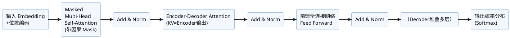

本文详细介绍了Transformer结构中的Encoder模块。Encoder主要负责将输入序列通过多层自注意力机制与前馈网络进行表征编码，实现有效的特征抽取与并行处理。文档涵盖：

- Encoder整体结构及核心流程
- 各子层作用（多头自注意力、残差连接、LayerNorm、前馈网络）
- 编码具体步骤与伪代码
- Encoder的应用场景与技术优势
- 结构图辅助理解

适合LLM原理学习、自注意力结构分析、企业级NLP方案参考。

## 目录

1. [Encoder结构简介](#encoder结构简介)
2. [Encoder层的组成](#encoder层的组成)
3. [编码过程详细步骤](#编码过程详细步骤)
4. [自注意力机制详解](#自注意力机制详解)
5. [残差连接与层归一化](#残差连接与层归一化)
6. [前馈神经网络FFN](#前馈神经网络ffn)
7. [Encoder堆叠与整体流程](#encoder堆叠与整体流程)
8. [Encoder的作用与应用](#encoder的作用与应用)
9. [结构图与代码示例](#结构图与代码示例)

Encoder是Transformer结构中用于处理输入序列的模块，其核心思想是在不依赖时序递归（如RNN）的前提下，利用自注意力机制（Self-Attention）对输入的每个元素建模其与其他所有元素的关系，因此极大提升了并行计算能力。

## 1. Encoder结构总览

Encoder通常由若干个结构完全相同的Encoder Layer堆叠而成，每个Encoder Layer包括如下子层：

1. 多头自注意力机制（Multi-Head Self-Attention）
2. 残差连接与LayerNorm
3. 前馈全连接网络（Feed Forward Network, FFN）
4. 残差连接与LayerNorm

整体结构如下图所示：

```
           [Input Embedding] 
                  │
          [Positional Encoding]
                  │
    ╔═════════════════════════════════╗
    ║   Repeat N次 Encoder Layer      ║
    ║ ┌─────────────────────────────┐ ║
    ║ │  Multi-Head Self Attention  │ ║
    ║ │     + Residual & LayerNorm  │ ║
    ║ │       FeedForward Network   │ ║
    ║ │     + Residual & LayerNorm  │ ║
    ║ └─────────────────────────────┘ ║
    ╚═════════════════════════════════╝
                  │
           [输出到Decoder]
```

## 2. 主要步骤详解

### Step 1: 输入嵌入（Embedding）

输入的每个token通过Embedding层映射为高维向量，使离散token具备连续表示能力。

### Step 2: 位置编码（Positional Encoding）

由于Encoder不依赖序列特性，因此使用位置编码为每个token引入位置信息。常用的是正弦余弦函数编码。

### Step 3: 多头自注意力机制

自注意力机制能捕捉序列中不同位置之间的依赖关系，多头机制则能从不同子空间并行学习多种特征。自注意力的核心计算公式为：

$$
\text{Attention}(Q,K,V) = \text{softmax}\left( \frac{QK^T}{\sqrt{d_k}} \right) V
$$

多个头并行，最后拼接后通过线性变换恢复维度。

### Step 4: 残差连接与LayerNorm

每个子层之后都使用残差连接（即输入与输出相加），再做LayerNorm归一化，加速收敛提升稳定性。

### Step 5: 前馈网络（FFN）

每个Encoder Layer中还包含一个全连接前馈网络，通常包括两层线形变换和ReLU激活。

### Step 6: 多层堆叠

上述结构可堆叠多层，使模型具备更强表征能力和抽象能力。

## 3. Encoder结构伪代码

```python
for layer in encoder_layers:
    # Self-Attention + Residual + LN
    x = LayerNorm(x + MultiHeadSelfAttention(x))
    # FFN + Residual + LN
    x = LayerNorm(x + FeedForward(x))
```

## 4. Encoder的价值

- 并行计算高效，训练快
- 能捕获全局依赖关系
- 可扩展性强，适合大模型

## 5. 与Decoder对比

- Encoder无因果掩码，每个位置可访问全局信息
- Decoder自回归生成，未来信息被mask
- Encoder用于理解，Decoder侧重生成


## Decoder结构详细解析

Transformer的Decoder结构主要用于生成式任务，其基本组成与Encoder类似，但有以下关键区别和独特设计：

### 1. 结构总览

每个Decoder层包含三个主要子层：
1. **Masked Multi-Head Self-Attention**（带掩码的多头自注意力）
2. **Encoder-Decoder Multi-Head Attention**（编码器-解码器注意力）
3. **前馈全连接网络（FFN）**

每个子层后均带有残差连接与LayerNorm。

### 2. 核心步骤拆解

#### Step 1: 输入嵌入与位置编码
- 输出端输入token首先进行嵌入，并加入位置编码以保留顺序信息。

#### Step 2: Masked Multi-Head Self-Attention（带因果Mask）
- Decoder自注意力在当前步只允许看到**当前位置及其之前**的信息，通过**因果掩码**实现，防止模型“偷看”未来token。

#### Step 3: Encoder-Decoder Attention
- 该子层用于关注Encoder输出（即源句信息），帮助Decoder结合输入上下文生成目标序列。
- Q来自Decoder，K/V来自Encoder输出。

#### Step 4: 前馈网络 & 残差
- 跟Encoder类似，包括两层线性变换+激活。
- 每个子层后都做残差与LayerNorm。

#### Step 5: 多层堆叠
- Decoder层可叠加多层，增强建模能力。

### 3. Decoder伪代码

```python
for layer in decoder_layers:
    # Masked Self-Attention + Residual + LN
    x = LayerNorm(x + MaskedMultiHeadSelfAttention(x))
    # Encoder-Decoder Attention + Residual + LN
    x = LayerNorm(x + MultiHeadAttention(x, encoder_outputs))
    # FFN + Residual + LN
    x = LayerNorm(x + FeedForward(x))
```

### 4. Decoder的特点与作用

- 具备**自回归生成**能力，每一步只能基于已生成部分和Encoder输出预测下一个token
- 与Encoder配合，实现翻译、摘要、对话生成等任务
- 加入因果Mask，确保生成顺序合理

### 5. Encoder与Decoder的协作

- Encoder负责理解和编码输入序列
- Decoder逐步生成目标序列，接收Encoder上下文作为条件

#### Decoder 结构说明
- 多层堆叠，每层包括：
  1. Masked Multi-Head Self-Attention（带因果Mask）
  2. Encoder-Decoder Multi-Head Attention
  3. 前馈全连接网络
  - 每一步都有残差连接和 LayerNorm

#### PlantUML 结构图
